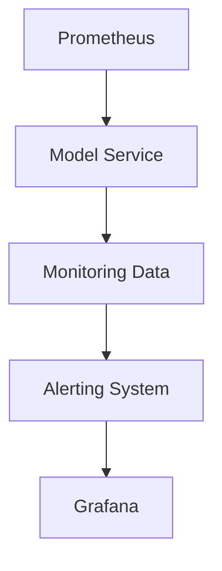
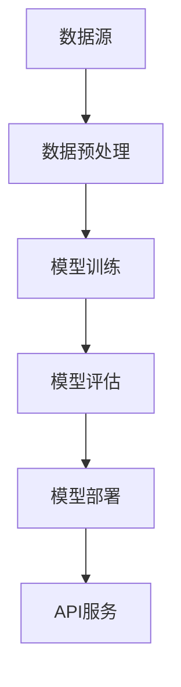
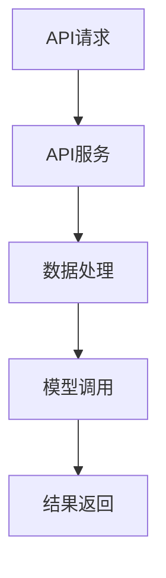

                 

### 第1章: 大模型与编程概述

#### 1.1 大模型编程的背景与意义

**背景介绍**

在过去的几十年里，人工智能（AI）经历了数次变革，从早期的规则驱动系统到基于知识的系统，再到如今的深度学习时代。随着计算能力的提升和数据量的爆炸性增长，深度学习技术取得了显著的突破。特别是近年来，大规模预训练模型（Large-scale Pre-trained Models）的涌现，如GPT、BERT等，使得自然语言处理、计算机视觉等领域的任务取得了前所未有的进展。

**核心概念术语说明**

- **大模型**：指那些拥有数十亿甚至千亿参数的深度学习模型。这些模型通常通过大规模的数据集进行训练，以学习复杂的模式和知识。
- **预训练**：指在特定任务之前，对模型进行无监督的预训练，使其具备一定的通用能力。
- **微调**：在预训练的基础上，针对特定任务对模型进行有监督的微调，以提高其在特定任务上的性能。

**问题背景**

随着大数据和云计算的发展，AI领域的应用场景越来越广泛，对模型性能的要求也越来越高。传统的模型训练方法往往需要大量的手动调优和调整，且在特定任务上的性能有限。而大模型的出现，为解决这些问题提供了新的思路。

**问题描述**

大模型编程的目标是利用大规模的深度学习模型，实现高效、准确的AI应用。具体来说，包括以下几个方面：

- **数据处理**：大模型能够处理大规模、结构复杂的数据，并从中提取出有价值的信息。
- **模型训练**：大模型需要通过大规模数据集进行预训练和微调，以实现高水平的性能。
- **模型优化**：通过不断调整模型参数，优化模型在特定任务上的表现。
- **模型部署**：将训练好的模型部署到生产环境中，供用户使用。

**问题解决**

大模型编程的解决思路主要包括以下几个方面：

- **数据驱动的训练方法**：通过大量数据对模型进行训练，提高模型的学习能力和泛化能力。
- **分布式计算**：利用分布式计算技术，加速模型的训练和部署。
- **模型压缩**：通过模型压缩技术，降低模型的参数数量和计算复杂度，提高模型的部署效率。
- **持续学习**：通过在线学习和持续更新，使模型能够适应不断变化的应用场景。

**边界与外延**

大模型编程不仅涉及模型的选择和训练，还包括模型部署、优化和评估等多个方面。此外，大模型编程还与其他领域如计算机视觉、自然语言处理、推荐系统等密切相关。

**概念结构与核心要素组成**

大模型编程的核心概念和要素主要包括：

- **模型架构**：包括卷积神经网络（CNN）、循环神经网络（RNN）、Transformer等。
- **训练数据**：包括大规模的数据集、数据预处理和增强技术。
- **优化算法**：包括随机梯度下降（SGD）、Adam等。
- **评估指标**：包括准确率、召回率、F1分数等。

#### 1.2 大模型编程的基本概念

**核心概念与联系**

大模型编程的基本概念主要包括以下几个方面：

1. **大模型**：指具有数十亿甚至千亿参数的深度学习模型。
2. **预训练**：在特定任务之前，对模型进行无监督的预训练，使其具备通用能力。
3. **微调**：在预训练的基础上，针对特定任务对模型进行有监督的微调。
4. **数据处理**：包括数据收集、预处理、增强等。
5. **模型评估**：对模型在特定任务上的性能进行评估。

**核心概念属性特征对比表格**

| 核心概念     | 定义                          | 属性特征                               |
| ------------ | ----------------------------- | -------------------------------------- |
| 大模型       | 具有数十亿参数的深度学习模型   | 大规模、高参数、通用能力               |
| 预训练       | 无监督的训练过程               | 提高模型泛化能力、减少对数据的需求      |
| 微调         | 有监督的训练过程               | 提高模型在特定任务上的性能              |
| 数据处理     | 数据收集、预处理、增强等        | 提高数据质量、减少噪声、增强模型学习能力 |
| 模型评估     | 对模型性能的评估               | 提高模型的可解释性、优化模型设计        |

**ER实体关系图架构**

```mermaid
erDiagram
  Model ||--|{ Pretrained } : 预训练
  Model ||--|{ FineTuned } : 微调
  Data ||--|{ Processed } : 数据处理
  Model ||--|{ Evaluated } : 模型评估
```

#### 1.3 大模型编程的核心技术

**算法原理讲解**

大模型编程的核心技术包括深度学习算法、模型架构设计、数据处理技术等。以下简要介绍其中几个关键点：

1. **深度学习算法**：深度学习算法是构建大模型的基础。常见的深度学习算法包括卷积神经网络（CNN）、循环神经网络（RNN）和Transformer等。其中，Transformer算法因其强大的并行处理能力和优异的性能，成为当前大模型的主流架构。

   **算法流程图：**

   ```mermaid
   graph TD
   A[输入数据] --> B[预处理]
   B --> C[模型输入]
   C --> D{模型架构}
   D --> E[前向传播]
   E --> F[反向传播]
   F --> G[参数更新]
   G --> H[模型评估]
   ```

2. **模型架构设计**：大模型通常采用复杂的网络架构，以处理大规模的数据和复杂的任务。常见的模型架构包括BERT、GPT、ViT等。这些模型通过自注意力机制、多头注意力等机制，提高了模型的表示能力和泛化能力。

   **模型架构图：**

   ```mermaid
   graph TD
   A[输入层] --> B[嵌入层]
   B --> C{自注意力层}
   C --> D[前馈网络]
   D --> E[输出层]
   ```

3. **数据处理技术**：数据处理技术在大模型编程中至关重要。常见的处理技术包括数据收集、数据预处理、数据增强等。这些技术有助于提高数据质量，减少噪声，增强模型的学习能力。

   **数据处理流程图：**

   ```mermaid
   graph TD
   A[数据收集] --> B[数据清洗]
   B --> C[数据预处理]
   C --> D[数据增强]
   D --> E[数据集划分]
   ```

**数学模型与公式**

大模型编程中的数学模型主要包括损失函数、优化算法等。以下以损失函数和优化算法为例进行说明：

1. **损失函数**：损失函数用于衡量模型预测结果与真实结果之间的差异。常见的损失函数包括交叉熵损失（Cross-Entropy Loss）和均方误差（Mean Squared Error, MSE）。

   $$ L = -\sum_{i=1}^{N} y_i \log(p_i) $$

   其中，$y_i$为真实标签，$p_i$为模型预测的概率。

2. **优化算法**：优化算法用于更新模型参数，以最小化损失函数。常见的优化算法包括随机梯度下降（SGD）和Adam。

   随机梯度下降（SGD）的更新公式：

   $$ \theta = \theta - \alpha \cdot \nabla_\theta J(\theta) $$

   其中，$\theta$为模型参数，$\alpha$为学习率，$J(\theta)$为损失函数。

   Adam优化器的更新公式：

   $$ m_t = \beta_1 m_{t-1} + (1 - \beta_1) [g_t - \epsilon] $$
   $$ v_t = \beta_2 v_{t-1} + (1 - \beta_2) [g_t^2 - \epsilon] $$
   $$ \theta_t = \theta_{t-1} - \alpha_t \frac{m_t}{\sqrt{v_t} + \epsilon} $$

   其中，$m_t$和$v_t$分别为一阶矩估计和二阶矩估计，$\beta_1$和$\beta_2$分别为一阶和二阶矩的指数加权因子，$\epsilon$为常数。

**通俗易懂地举例说明**

以一个简单的线性回归问题为例，假设我们有一个输入变量$x$和输出变量$y$，我们希望找到一个线性关系$y = wx + b$，其中$w$和$b$为模型参数。通过训练，我们可以得到一个最小化均方误差的模型。

1. **数据准备**：假设我们有以下数据集：

   | $x$ | $y$ |
   | --- | --- |
   | 1   | 2   |
   | 2   | 4   |
   | 3   | 6   |

2. **模型初始化**：初始化模型参数$w$和$b$为0。

3. **前向传播**：计算模型预测值$y_{\text{pred}} = wx + b$。

4. **计算损失**：计算均方误差损失$J(w, b) = \frac{1}{2} \sum_{i=1}^{N} (y_i - y_{\text{pred},i})^2$。

5. **反向传播**：计算损失关于模型参数的梯度$\nabla_\theta J(\theta)$。

6. **参数更新**：使用优化算法（如SGD）更新模型参数。

7. **重复步骤3-6**，直到模型收敛。

通过上述步骤，我们可以得到一个线性回归模型，其能够对新的输入数据进行预测。

#### 1.4 大模型编程的发展现状与趋势

**发展现状**

当前，大模型编程已经取得了显著的进展，并在多个领域取得了突破性成果。以下为几个关键点：

1. **技术突破**：大模型在自然语言处理、计算机视觉、语音识别等领域取得了优异的性能，推动了相关技术的发展。
2. **应用广泛**：大模型编程被广泛应用于智能客服、自动驾驶、医疗诊断、金融风控等场景，产生了巨大的经济效益。
3. **开源生态**：随着大模型的研究和应用的深入，越来越多的开源工具和框架（如TensorFlow、PyTorch、Transformer等）被开发出来，为开发者提供了便捷的编程工具。

**未来趋势**

大模型编程在未来有望继续发展，并呈现以下趋势：

1. **模型规模将进一步扩大**：随着计算能力和数据量的提升，大模型的规模将继续扩大，以实现更高的性能和更广泛的应用。
2. **模型优化技术将不断创新**：为了提高模型的可解释性、减少计算复杂度和降低部署成本，研究者将继续探索新的模型优化技术。
3. **多模态融合将成为趋势**：随着多模态数据的应用场景不断增多，大模型编程将逐渐实现多模态数据的融合处理。
4. **边缘计算与云计算相结合**：为了满足不同场景下的实时性和计算需求，大模型编程将逐渐实现边缘计算与云计算的相结合。

#### 1.5 大模型编程的挑战与对策

**挑战**

大模型编程在发展过程中面临着以下挑战：

1. **计算资源需求**：大模型的训练和部署需要大量的计算资源和存储空间。
2. **数据隐私和安全**：大规模数据集的收集和处理过程中，可能涉及用户隐私和敏感信息，如何保障数据隐私和安全成为重要问题。
3. **模型可解释性**：大模型通常具有复杂的内部结构和参数，如何提高模型的可解释性，使其更易于理解和应用，是一个挑战。
4. **过拟合和泛化能力**：大模型在训练过程中容易过拟合，如何提高其泛化能力，使其能够适应不同的应用场景，是一个关键问题。

**对策**

针对上述挑战，可以采取以下对策：

1. **分布式计算与模型压缩**：通过分布式计算和模型压缩技术，降低大模型的计算复杂度和存储需求。
2. **隐私保护和安全机制**：在数据收集和处理过程中，采用加密、去识别化等技术，保障数据隐私和安全。
3. **可解释性方法**：通过可视化和解释性模型设计，提高大模型的可解释性，使其更易于理解和应用。
4. **数据增强和正则化**：通过数据增强和正则化技术，提高大模型的泛化能力，避免过拟合。

### 小结

本章从背景介绍、核心概念、算法原理讲解、数学模型与公式、通俗易懂地举例说明、发展现状与趋势以及挑战与对策等方面，对大模型编程进行了全面的阐述。通过本章的学习，读者可以了解到大模型编程的基本概念、核心技术和未来发展，为后续章节的学习打下基础。在接下来的章节中，我们将进一步探讨大模型编程的具体应用和实现细节。

### 注意事项

- **计算资源准备**：在进行大模型编程时，需要提前准备足够的计算资源和存储空间，以确保模型训练和部署的顺利进行。
- **数据安全与隐私**：在处理数据时，需注意数据的安全性和隐私保护，遵循相关法律法规和伦理规范。
- **模型可解释性**：在设计和使用大模型时，要重视模型的可解释性，以提高其应用价值和可信度。

### 拓展阅读

- 《深度学习》（Goodfellow, Bengio, Courville著）：介绍深度学习的基础理论和应用。
- 《大规模机器学习》（Guo, Han著）：探讨大规模机器学习的方法和技术。
- 《大数据技术导论》（李航著）：介绍大数据的基本概念、技术和应用。

---

# 第2章: 大模型基础理论

本章将深入探讨大模型的基础理论，包括大模型的原理与架构、大模型的训练与优化以及大模型的评估与调优。通过本章的学习，读者将全面了解大模型的内部工作机制，掌握大模型训练、优化和评估的方法，为后续的实战应用打下坚实基础。

### 2.1 大模型的原理与架构

#### 大模型的工作原理

大模型是基于深度学习技术构建的，其核心思想是通过多层神经网络对数据进行处理，从而提取出高层次的抽象特征。大模型通常包含以下几个关键组成部分：

1. **输入层**：接收外部输入数据，如文本、图像或声音等。
2. **隐藏层**：对输入数据进行逐层处理，提取出更高层次的特征。
3. **输出层**：根据隐藏层输出的特征进行预测或分类。

大模型通过反向传播算法，不断调整网络中的参数，使其在训练数据上的表现逐渐优化。在训练过程中，大模型通过学习数据中的模式和规律，从而实现对未知数据的预测和分类。

#### 大模型的架构设计

大模型的架构设计决定了其性能和应用范围。常见的架构设计包括以下几种：

1. **卷积神经网络（CNN）**：适用于图像和视频处理任务，通过卷积操作提取图像中的局部特征。
2. **循环神经网络（RNN）**：适用于序列数据（如文本、时间序列等），通过记忆机制处理序列中的依赖关系。
3. **Transformer模型**：在自然语言处理领域取得了巨大成功，通过自注意力机制处理长距离依赖关系。

每种架构都有其独特的优势和适用场景。在实际应用中，可以根据任务需求和数据特性选择合适的架构。

#### 大模型的基本组件

大模型的基本组件包括：

1. **神经元**：神经网络的基本单元，负责接收输入、计算输出和传递激活信号。
2. **激活函数**：用于引入非线性因素，使神经网络具有分类和回归能力。
3. **损失函数**：用于衡量模型预测结果与真实结果之间的差距，指导模型优化。
4. **优化器**：用于更新模型参数，以最小化损失函数。

这些组件共同作用，实现了大模型的训练和优化。

### 2.2 大模型的训练与优化

#### 大模型训练的基本流程

大模型训练的基本流程包括以下几个步骤：

1. **数据准备**：收集和预处理数据，包括数据清洗、归一化、数据增强等。
2. **模型初始化**：初始化模型参数，通常采用随机初始化或预训练模型。
3. **前向传播**：将输入数据传递到模型中，计算输出结果。
4. **计算损失**：计算预测结果与真实结果之间的差距，通常使用损失函数。
5. **反向传播**：计算损失关于模型参数的梯度，并更新模型参数。
6. **迭代训练**：重复以上步骤，直到模型收敛。

#### 大模型优化的方法

大模型优化是提高模型性能的关键。以下为几种常见的优化方法：

1. **随机梯度下降（SGD）**：最简单的优化算法，通过随机选择样本计算梯度并更新参数。
2. **Adam优化器**：结合SGD和Momentum的方法，通过自适应调整学习率，提高优化效果。
3. **学习率调度**：通过逐步减小学习率，使模型在训练过程中逐渐收敛。
4. **正则化**：如L1、L2正则化，通过在损失函数中添加正则项，避免过拟合。

#### 数据增强

数据增强是通过生成或变换原始数据，增加训练样本的多样性，从而提高模型的泛化能力。常见的数据增强方法包括：

1. **图像增强**：如旋转、翻转、缩放、裁剪等。
2. **文本增强**：如替换词语、添加噪声、重排句子等。
3. **音频增强**：如加噪、变调、变速等。

#### 2.3 大模型的评估与调优

#### 大模型评估的方法

大模型的评估是衡量模型性能的重要环节。以下为几种常见的评估方法：

1. **准确率（Accuracy）**：分类任务中，正确预测的样本数占总样本数的比例。
2. **召回率（Recall）**：分类任务中，正确预测的正例样本数占总正例样本数的比例。
3. **精确率（Precision）**：分类任务中，正确预测的正例样本数占总预测正例样本数的比例。
4. **F1分数（F1 Score）**：综合准确率和召回率的指标，计算公式为$F1 = 2 \times \frac{Precision \times Recall}{Precision + Recall}$。

#### 大模型调优的策略

大模型调优是通过调整模型参数和训练过程，提高模型性能的方法。以下为几种常见的调优策略：

1. **超参数调优**：通过调整学习率、批量大小、迭代次数等超参数，优化模型性能。
2. **交叉验证**：通过将数据集划分为训练集和验证集，评估模型在不同数据集上的性能，选择最优参数。
3. **模型集成**：通过组合多个模型，提高预测的稳定性和准确性。
4. **迁移学习**：利用预训练模型，在特定任务上微调，提高模型性能。

### 小结

本章详细介绍了大模型的基础理论，包括原理与架构、训练与优化、评估与调优。通过本章的学习，读者可以深入理解大模型的内部工作机制，掌握大模型训练、优化和评估的方法。在实际应用中，这些知识将为开发高效、准确的大模型提供有力支持。

### 注意事项

- **数据质量**：保证训练数据的质量和多样性，以提高模型的泛化能力。
- **模型选择**：根据任务需求和数据特性，选择合适的模型架构。
- **优化策略**：合理选择优化算法和调优策略，提高模型性能。

### 拓展阅读

- 《深度学习》（Goodfellow, Bengio, Courville著）：深入探讨深度学习的理论基础和算法实现。
- 《大规模机器学习》（Guo, Han著）：介绍大规模机器学习的方法和技术。
- 《动手学深度学习》（唐杰、李宏毅著）：通过实践案例学习深度学习的应用。

---

# 第3章: 大模型编程工具与环境配置

本章将介绍大模型编程所需的工具和环境配置，包括大模型编程的主要工具、编程环境配置与优化以及大模型编程的常用库和框架。通过本章的学习，读者将能够掌握大模型编程的必备技能，为后续的实战项目奠定基础。

### 3.1 大模型编程的主要工具

在进行大模型编程时，需要使用一系列工具来支持模型的训练、优化和部署。以下为几种主要工具：

1. **计算平台**：计算平台是进行大模型编程的基础，常见的计算平台包括：
   - **GPU平台**：如NVIDIA Tesla、Titan等，适合处理大量并行计算。
   - **分布式计算平台**：如Hadoop、Spark等，适合处理大规模数据集。
   - **云计算平台**：如AWS、Azure、Google Cloud等，提供弹性的计算资源和存储服务。

2. **编程语言**：常见的编程语言包括：
   - **Python**：广泛应用于数据科学和机器学习领域，具有丰富的库和框架。
   - **C++**：适合高性能计算和优化，常用于实现底层算法和模型。
   - **Julia**：专为科学计算而设计，具有高性能和易用性。

3. **开发环境**：开发环境是进行大模型编程的重要工具，常见的开发环境包括：
   - **Jupyter Notebook**：适合交互式开发和调试。
   - **PyCharm**：强大的Python集成开发环境，支持多语言开发。
   - **Visual Studio Code**：轻量级、可扩展的代码编辑器，支持多种编程语言。

4. **版本控制**：版本控制工具用于管理代码和模型版本，常见的版本控制工具包括：
   - **Git**：分布式版本控制系统，支持多人协作开发。
   - **SVN**：集中式版本控制系统，适合小型团队协作。

### 3.2 编程环境配置与优化

在进行大模型编程时，合理的编程环境配置和优化是保证模型训练和部署顺利进行的关键。以下为编程环境配置与优化的一些要点：

1. **硬件配置**：确保计算平台具有足够的计算能力和存储空间，以满足大模型训练的需求。具体配置包括：
   - **GPU数量和类型**：选择性能强劲的GPU，如NVIDIA Tesla V100或A100。
   - **CPU核心数和内存**：选择具有多核心和大量内存的CPU，以提高数据处理和计算速度。

2. **软件环境**：安装必要的软件环境和库，包括：
   - **Python环境**：安装Python和相关的依赖库，如NumPy、Pandas等。
   - **深度学习框架**：安装常用的深度学习框架，如TensorFlow、PyTorch等。

3. **环境优化**：
   - **并行计算**：利用GPU和分布式计算技术，提高模型训练和优化的速度。
   - **内存管理**：合理分配内存资源，避免内存泄漏和溢出。
   - **网络优化**：优化网络配置，提高数据传输速度和稳定性。

4. **版本管理**：使用版本控制工具，管理代码和模型版本，确保代码的可维护性和可追溯性。

### 3.3 大模型编程的常用库和框架

在进行大模型编程时，常用的库和框架能够提供强大的功能和便捷的开发体验。以下为几种常用库和框架：

1. **TensorFlow**：由Google开发，是一个开源的深度学习框架，支持多种编程语言和平台，具有丰富的API和工具。

2. **PyTorch**：由Facebook开发，是一个开源的深度学习库，支持Python编程语言，具有动态计算图和自动微分功能，适合快速原型开发和实验。

3. **Keras**：是一个高层次的深度学习框架，基于TensorFlow和Theano构建，提供了简洁的API和丰富的预训练模型。

4. **Scikit-learn**：是一个开源的机器学习库，提供了丰富的机器学习算法和工具，适合用于数据分析和建模。

5. **Hugging Face Transformers**：是一个开源的Transformers库，提供了预训练模型和高效的自注意力机制实现，适合自然语言处理任务。

### 小结

本章介绍了大模型编程的主要工具、编程环境配置与优化以及常用库和框架。通过本章的学习，读者可以了解大模型编程所需的工具和环境，掌握配置和优化编程环境的方法，为后续的实战项目做好准备。

### 注意事项

- **硬件配置**：根据模型训练需求，选择合适的硬件配置，确保计算能力和存储空间满足要求。
- **环境配置**：合理配置编程环境，避免依赖冲突和性能瓶颈。
- **版本管理**：使用版本控制工具，确保代码和模型的可维护性和可追溯性。

### 拓展阅读

- 《TensorFlow实战》（Trevor Slavin著）：详细介绍TensorFlow的使用方法和实战案例。
- 《深度学习框架比较》（Sebastian Raschka著）：对比分析不同深度学习框架的特点和适用场景。
- 《大规模机器学习系统设计》（陈天奇著）：探讨大规模机器学习系统设计的方法和技巧。

---

### 第4章: 大模型编程实战

本章将带领读者通过实际案例，了解大模型编程的具体实现过程。我们将介绍如何进行数据预处理、模型构建与训练、模型评估与优化，以及模型部署与运维。通过这些实战案例，读者可以更好地掌握大模型编程的技能。

#### 4.1 数据预处理

数据预处理是模型训练的重要环节，其目的是将原始数据转化为适合模型训练的形式。以下是数据预处理的基本步骤：

1. **数据收集**：收集用于训练和测试的数据集。对于文本数据，可以采用公开数据集（如IMDb电影评论数据集、Twitter情感分析数据集等）；对于图像数据，可以采用开源的图像数据集（如CIFAR-10、ImageNet等）。

2. **数据清洗**：清洗数据集中的噪声和错误，如去除无效字符、填补缺失值、去除重复样本等。

3. **数据归一化**：将数据缩放到相同的尺度，以提高模型的收敛速度和性能。对于文本数据，可以使用词频（TF）或词频-逆文档频率（TF-IDF）进行归一化；对于图像数据，可以使用标准化方法，如减去均值、除以标准差等。

4. **数据增强**：通过随机变换（如旋转、翻转、缩放、裁剪等）增加数据的多样性，提高模型的泛化能力。

5. **数据集划分**：将数据集划分为训练集、验证集和测试集，通常比例为8:1:1。

以下是一个简单的数据预处理示例（Python代码）：

```python
import numpy as np
from sklearn.model_selection import train_test_split
from sklearn.preprocessing import StandardScaler

# 假设我们已经有一个特征矩阵X和数据标签y
X = np.array([[1, 2], [3, 4], [5, 6], [7, 8]])
y = np.array([0, 1, 0, 1])

# 数据清洗
X = np.array([[x if not np.isnan(x) else np.mean(X[:, 0]) for x in row] for row in X])

# 数据归一化
scaler = StandardScaler()
X = scaler.fit_transform(X)

# 数据集划分
X_train, X_test, y_train, y_test = train_test_split(X, y, test_size=0.2, random_state=42)
```

#### 4.2 模型构建与训练

构建大模型通常涉及以下步骤：

1. **选择模型架构**：根据任务需求选择合适的模型架构。例如，对于图像分类任务，可以选择卷积神经网络（CNN）；对于自然语言处理任务，可以选择Transformer模型。

2. **定义模型**：使用深度学习框架（如TensorFlow或PyTorch）定义模型。以下是一个简单的CNN模型示例（使用TensorFlow）：

```python
import tensorflow as tf
from tensorflow.keras.models import Sequential
from tensorflow.keras.layers import Conv2D, MaxPooling2D, Flatten, Dense

model = Sequential([
    Conv2D(32, (3, 3), activation='relu', input_shape=(28, 28, 1)),
    MaxPooling2D((2, 2)),
    Flatten(),
    Dense(64, activation='relu'),
    Dense(10, activation='softmax')
])
```

3. **编译模型**：设置模型的优化器、损失函数和评估指标。例如：

```python
model.compile(optimizer='adam',
              loss='categorical_crossentropy',
              metrics=['accuracy'])
```

4. **训练模型**：使用训练数据集训练模型。以下是一个简单的训练示例：

```python
history = model.fit(X_train, y_train, epochs=10, batch_size=32, validation_data=(X_test, y_test))
```

#### 4.3 模型评估与优化

模型评估是衡量模型性能的重要步骤。以下为几种常见的评估指标和优化方法：

1. **评估指标**：
   - **准确率（Accuracy）**：分类任务中，正确预测的样本数占总样本数的比例。
   - **精确率（Precision）**：分类任务中，正确预测的正例样本数占总预测正例样本数的比例。
   - **召回率（Recall）**：分类任务中，正确预测的正例样本数占总正例样本数的比例。
   - **F1分数（F1 Score）**：综合准确率和召回率的指标，计算公式为$F1 = 2 \times \frac{Precision \times Recall}{Precision + Recall}$。

2. **优化方法**：
   - **超参数调优**：通过调整模型的超参数（如学习率、批量大小、迭代次数等），优化模型性能。
   - **交叉验证**：通过将数据集划分为多个子集，进行多次训练和评估，以获得更稳定的模型性能。
   - **模型集成**：通过组合多个模型，提高预测的稳定性和准确性。

以下是一个简单的模型评估示例（使用Scikit-learn）：

```python
from sklearn.metrics import accuracy_score, precision_score, recall_score, f1_score

# 假设我们已经有一个预测结果y_pred和真实标签y_test
y_pred = model.predict(X_test)

# 计算评估指标
accuracy = accuracy_score(y_test, y_pred)
precision = precision_score(y_test, y_pred, average='weighted')
recall = recall_score(y_test, y_pred, average='weighted')
f1 = f1_score(y_test, y_pred, average='weighted')

print(f"Accuracy: {accuracy:.4f}")
print(f"Precision: {precision:.4f}")
print(f"Recall: {recall:.4f}")
print(f"F1 Score: {f1:.4f}")
```

#### 4.4 模型部署与运维

模型部署是将训练好的模型应用到实际生产环境中，供用户使用的步骤。以下为模型部署的基本流程：

1. **模型导出**：将训练好的模型导出为可部署的格式，如TensorFlow SavedModel、PyTorch TorchScript等。

2. **部署环境**：选择合适的部署环境，如本地服务器、云计算平台（如AWS、Azure、Google Cloud等）。

3. **API开发**：开发API，以提供模型的预测服务。以下是一个简单的Flask API示例：

```python
from flask import Flask, request, jsonify
import torch

app = Flask(__name__)

# 假设我们有一个加载好的PyTorch模型model
model.load_state_dict(torch.load('model.pth'))

@app.route('/predict', methods=['POST'])
def predict():
    data = request.get_json()
    inputs = torch.tensor(np.array([list(data['input'].split(','))]), dtype=torch.float32)
    outputs = model(inputs)
    predictions = torch.argmax(outputs, dim=1)
    return jsonify({'prediction': predictions.item()})

if __name__ == '__main__':
    app.run()
```

4. **运维监控**：对部署的模型进行监控，包括性能监控、错误日志记录和自动恢复等。

以下是一个简单的模型监控示例（使用Prometheus和Grafana）：



#### 4.5 项目实战：手写数字识别

在本节中，我们将通过一个手写数字识别的项目，展示大模型编程的完整流程。

1. **数据集**：使用Kaggle上的手写数字数据集（MNIST）。

2. **模型构建**：构建一个简单的卷积神经网络（CNN）。

3. **模型训练**：使用训练集进行模型训练。

4. **模型评估**：使用验证集和测试集评估模型性能。

5. **模型部署**：将模型部署为API服务，供用户使用。

以下为该项目的主要步骤和代码：

1. **数据集加载与预处理**：

```python
from tensorflow.keras.datasets import mnist
from tensorflow.keras.utils import to_categorical

# 加载MNIST数据集
(X_train, y_train), (X_test, y_test) = mnist.load_data()

# 数据预处理
X_train = X_train / 255.0
X_test = X_test / 255.0
y_train = to_categorical(y_train, num_classes=10)
y_test = to_categorical(y_test, num_classes=10)
```

2. **模型构建**：

```python
from tensorflow.keras.models import Sequential
from tensorflow.keras.layers import Conv2D, MaxPooling2D, Flatten, Dense

model = Sequential([
    Conv2D(32, (3, 3), activation='relu', input_shape=(28, 28, 1)),
    MaxPooling2D((2, 2)),
    Flatten(),
    Dense(64, activation='relu'),
    Dense(10, activation='softmax')
])
```

3. **模型训练**：

```python
model.compile(optimizer='adam',
              loss='categorical_crossentropy',
              metrics=['accuracy'])

history = model.fit(X_train, y_train, epochs=10, batch_size=32, validation_split=0.2)
```

4. **模型评估**：

```python
test_loss, test_acc = model.evaluate(X_test, y_test)
print(f"Test accuracy: {test_acc:.4f}")
```

5. **模型部署**：

```python
from flask import Flask, request, jsonify

app = Flask(__name__)

model.load_state_dict(torch.load('model.pth'))

@app.route('/predict', methods=['POST'])
def predict():
    data = request.get_json()
    inputs = torch.tensor(np.array([list(data['input'].split(','))]), dtype=torch.float32)
    outputs = model(inputs)
    predictions = torch.argmax(outputs, dim=1)
    return jsonify({'prediction': predictions.item()})

if __name__ == '__main__':
    app.run()
```

通过以上步骤，我们完成了手写数字识别项目的开发与部署。读者可以根据自己的需求，进一步优化模型和部署流程。

### 小结

本章通过实际案例，详细介绍了大模型编程的实战过程，包括数据预处理、模型构建与训练、模型评估与优化、模型部署与运维。通过本章的学习，读者可以掌握大模型编程的核心技能，为实际项目开发打下坚实基础。

### 注意事项

- **数据预处理**：确保数据质量和预处理方法的合理性，以提高模型性能。
- **模型优化**：合理选择优化算法和超参数，以提高模型性能。
- **模型部署**：确保部署环境的稳定性和安全性，提高模型的可访问性。

### 拓展阅读

- 《深度学习项目实践》（John D. Kelleher等著）：介绍多个深度学习项目的实战经验和技巧。
- 《动手学深度学习》（唐杰、李宏毅著）：通过实践案例学习深度学习的应用。
- 《大规模机器学习系统设计》（陈天奇著）：探讨大规模机器学习系统设计的方法和技巧。

---

### 第5章: 大模型编程项目案例

在本章中，我们将通过具体的项目案例，深入探讨大模型编程的实际应用。这些案例涵盖了文本分类、情感分析和图像识别等热门领域，通过详细的分析和讲解，帮助读者理解大模型编程的实战技巧。

#### 5.1 项目一：文本分类

**项目介绍**

文本分类是自然语言处理领域的一个基本任务，其目的是将文本数据分类到预定义的类别中。在本项目中，我们将使用大模型进行文本分类，实现自动标记新闻文章的主题。

**项目场景**

假设我们有一个新闻数据集，包含不同类别的新闻文章，如体育、政治、娱乐等。我们的目标是训练一个模型，能够根据文章的内容自动判断其类别。

**系统功能设计**

1. **数据收集与预处理**：收集新闻数据，并进行数据清洗、分词和词性标注。
2. **模型构建与训练**：使用预训练的模型（如BERT）进行微调，以适应新闻分类任务。
3. **模型评估与优化**：使用验证集评估模型性能，并进行参数调优。
4. **模型部署**：将训练好的模型部署到生产环境，提供实时分类服务。

**系统架构设计**

系统架构设计包括数据流和模块划分，以下为一个简化的架构设计：



**系统接口设计和系统交互**

系统交互设计包括API接口和后台服务之间的通信。以下为一个简单的API接口设计：



**项目实现**

1. **数据收集与预处理**：

```python
import pandas as pd
from sklearn.model_selection import train_test_split

# 加载数据
data = pd.read_csv('news_data.csv')

# 数据清洗和预处理
# ...
```

2. **模型构建与训练**：

```python
from transformers import BertTokenizer, BertModel
from transformers import BertForSequenceClassification

tokenizer = BertTokenizer.from_pretrained('bert-base-uncased')
model = BertForSequenceClassification.from_pretrained('bert-base-uncased', num_labels=5)

# 微调模型
# ...
```

3. **模型评估与优化**：

```python
from sklearn.metrics import accuracy_score, classification_report

# 评估模型
# ...
```

4. **模型部署**：

```python
from flask import Flask, request, jsonify

app = Flask(__name__)

# 部署模型
# ...

@app.route('/classify', methods=['POST'])
def classify():
    # ...
    return jsonify(result)
```

**项目小结**

通过本项目，我们实现了文本分类系统，从数据收集、预处理到模型构建、训练、评估和部署，全面了解了大模型编程的实战流程。读者可以根据自己的需求，进一步优化和扩展系统功能。

#### 5.2 项目二：情感分析

**项目介绍**

情感分析是自然语言处理领域的重要任务，其目的是从文本中提取情感信息，如正面、负面或中性。在本项目中，我们将使用大模型进行情感分析，实现自动化情感识别。

**项目场景**

假设我们有一个社交媒体数据集，包含用户的评论和对应的情感标签。我们的目标是训练一个模型，能够根据评论内容判断情感倾向。

**系统功能设计**

1. **数据收集与预处理**：收集社交媒体数据，并进行数据清洗、分词和情感词典构建。
2. **模型构建与训练**：使用预训练的模型（如GPT）进行微调，以适应情感分析任务。
3. **模型评估与优化**：使用验证集评估模型性能，并进行参数调优。
4. **模型部署**：将训练好的模型部署到生产环境，提供实时情感识别服务。

**系统架构设计**

系统架构设计包括数据流和模块划分，以下为一个简化的架构设计：


**系统接口设计和系统交互**

系统交互设计包括API接口和后台服务之间的通信。以下为一个简单的API接口设计：


**项目实现**

1. **数据收集与预处理**：

```python
import pandas as pd
from sklearn.model_selection import train_test_split

# 加载数据
data = pd.read_csv('social_media_data.csv')

# 数据清洗和预处理
# ...
```

2. **模型构建与训练**：

```python
from transformers import GPT2Tokenizer, GPT2LMHeadModel
from transformers import GPT2ForSequenceClassification

tokenizer = GPT2Tokenizer.from_pretrained('gpt2')
model = GPT2ForSequenceClassification.from_pretrained('gpt2', num_labels=3)

# 微调模型
# ...
```

3. **模型评估与优化**：

```python
from sklearn.metrics import accuracy_score, classification_report

# 评估模型
# ...
```

4. **模型部署**：

```python
from flask import Flask, request, jsonify

app = Flask(__name__)

# 部署模型
# ...

@app.route('/analyze', methods=['POST'])
def analyze():
    # ...
    return jsonify(result)
```

**项目小结**

通过本项目，我们实现了情感分析系统，从数据收集、预处理到模型构建、训练、评估和部署，全面了解了大模型编程的实战技巧。读者可以根据自己的需求，进一步优化和扩展系统功能。

#### 5.3 项目三：图像识别

**项目介绍**

图像识别是计算机视觉领域的一个基本任务，其目的是从图像中识别出特定的对象或场景。在本项目中，我们将使用大模型进行图像识别，实现自动化图像分类。

**项目场景**

假设我们有一个包含不同类别图像的数据集，如动物、植物、交通工具等。我们的目标是训练一个模型，能够根据图像内容自动判断类别。

**系统功能设计**

1. **数据收集与预处理**：收集图像数据，并进行数据清洗、归一化和增强。
2. **模型构建与训练**：使用预训练的模型（如ResNet）进行微调，以适应图像识别任务。
3. **模型评估与优化**：使用验证集评估模型性能，并进行参数调优。
4. **模型部署**：将训练好的模型部署到生产环境，提供实时图像识别服务。

**系统架构设计**

系统架构设计包括数据流和模块划分，以下为一个简化的架构设计：


**系统接口设计和系统交互**

系统交互设计包括API接口和后台服务之间的通信。以下为一个简单的API接口设计：


**项目实现**

1. **数据收集与预处理**：

```python
import pandas as pd
from sklearn.model_selection import train_test_split

# 加载数据
data = pd.read_csv('image_data.csv')

# 数据清洗和预处理
# ...
```

2. **模型构建与训练**：

```python
from tensorflow.keras.applications import ResNet50
from tensorflow.keras.preprocessing.image import ImageDataGenerator
from tensorflow.keras.models import Model
from tensorflow.keras.optimizers import Adam

# 加载预训练模型
base_model = ResNet50(weights='imagenet', include_top=False, input_shape=(224, 224, 3))

# 构建模型
x = base_model.output
x = GlobalAveragePooling2D()(x)
x = Dense(1024, activation='relu')(x)
predictions = Dense(num_classes, activation='softmax')(x)

model = Model(inputs=base_model.input, outputs=predictions)

# 编译模型
model.compile(optimizer=Adam(learning_rate=0.0001), loss='categorical_crossentropy', metrics=['accuracy'])

# 微调模型
# ...
```

3. **模型评估与优化**：

```python
from sklearn.metrics import accuracy_score, classification_report

# 评估模型
# ...
```

4. **模型部署**：

```python
from flask import Flask, request, jsonify

app = Flask(__name__)

# 部署模型
# ...

@app.route('/recognize', methods=['POST'])
def recognize():
    # ...
    return jsonify(result)
```

**项目小结**

通过本项目，我们实现了图像识别系统，从数据收集、预处理到模型构建、训练、评估和部署，全面了解了大模型编程的实战技巧。读者可以根据自己的需求，进一步优化和扩展系统功能。

### 小结

本章通过文本分类、情感分析和图像识别三个项目案例，详细介绍了大模型编程在现实应用中的具体实现。通过这些案例，读者可以深入理解大模型编程的实战技巧，为实际项目开发提供参考。

### 注意事项

- **数据预处理**：确保数据质量和预处理方法的合理性，以提高模型性能。
- **模型优化**：合理选择优化算法和超参数，以提高模型性能。
- **模型部署**：确保部署环境的稳定性和安全性，提高模型的可访问性。

### 拓展阅读

- 《深度学习实战》（François Chollet著）：详细介绍深度学习项目的实战方法和技巧。
- 《计算机视觉实战》（Adrian Rosebrock著）：探讨计算机视觉项目的实战技巧。
- 《自然语言处理实战》（Siddhant Goel等著）：介绍自然语言处理项目的实战经验。

---

### 第6章: 大模型编程中的常见问题与解决方法

在实践大模型编程的过程中，开发者可能会遇到各种问题，这些问题可能影响模型的性能、可解释性以及部署的稳定性。在本章中，我们将探讨大模型编程中的常见问题，并分享一些有效的解决方法和策略。

#### 6.1 问题诊断与调试

**常见问题**

1. **计算资源不足**：大模型训练需要大量的计算资源和存储空间，如果计算资源不足，可能导致训练过程缓慢或无法完成。
2. **数据质量问题**：数据是模型训练的基础，数据质量问题（如噪声、缺失值、重复样本等）可能影响模型的性能。
3. **模型过拟合**：模型在训练数据上表现良好，但在验证集或测试集上表现不佳，这种现象称为过拟合。
4. **模型性能波动**：模型性能在不同批次数据或不同训练迭代中波动较大，难以稳定。

**解决方法**

1. **增加计算资源**：使用分布式计算和云计算平台，提高计算能力和存储空间。
2. **数据清洗与预处理**：对数据进行严格的清洗和预处理，包括填补缺失值、去除噪声、去除重复样本等。
3. **正则化和正则化**：使用正则化技术，如L1、L2正则化，减少过拟合现象。
4. **交叉验证**：使用交叉验证技术，评估模型在不同数据集上的性能，选择最优模型。

#### 6.2 性能优化与调优

**常见问题**

1. **模型性能提升有限**：在训练过程中，模型性能提升缓慢或停滞。
2. **模型训练时间过长**：模型训练时间过长，影响开发和部署效率。
3. **模型预测速度慢**：模型在部署后的预测速度慢，影响用户体验。

**解决方法**

1. **模型压缩与量化**：通过模型压缩和量化技术，减少模型参数和计算复杂度，提高模型部署效率。
2. **优化训练策略**：使用更高效的优化算法（如Adam、RMSprop等），调整学习率、批量大小等超参数。
3. **数据增强**：通过数据增强技术，增加训练数据的多样性，提高模型泛化能力。
4. **并行计算**：利用分布式计算和并行计算技术，加速模型训练和预测。

#### 6.3 安全性与隐私保护

**常见问题**

1. **数据泄露**：在数据收集和处理过程中，数据可能被泄露或滥用。
2. **模型黑盒化**：大模型的内部结构复杂，难以解释和验证，可能导致黑盒化问题。
3. **对抗攻击**：攻击者可以通过设计对抗样本，破坏模型的稳定性和安全性。

**解决方法**

1. **数据加密与去识别化**：对数据进行加密和去识别化处理，保护用户隐私。
2. **模型可解释性**：通过可视化和解释性方法，提高模型的可解释性，增强用户信任。
3. **防御对抗攻击**：使用对抗训练、对抗样本检测等技术，提高模型的鲁棒性。

#### 6.4 持续学习与更新

**常见问题**

1. **模型过时**：随着时间的推移，模型可能无法适应新的数据和任务。
2. **模型部署困难**：将训练好的模型部署到生产环境中，可能面临各种挑战。
3. **维护成本高**：大规模模型的维护和更新需要大量的时间和资源。

**解决方法**

1. **持续学习**：通过在线学习和迁移学习技术，使模型能够适应新的数据和任务。
2. **模型容器化**：使用模型容器化技术（如Docker、Kubernetes等），简化模型部署和运维。
3. **自动化维护**：使用自动化工具和平台，降低模型维护成本，提高部署效率。

### 小结

本章介绍了大模型编程中常见的几个问题，包括计算资源不足、数据质量问题、模型过拟合、模型性能提升有限、模型训练时间过长、模型预测速度慢、数据泄露、模型黑盒化、对抗攻击、模型过时、模型部署困难、维护成本高。针对这些问题，我们提出了一系列解决方法和策略，包括增加计算资源、数据清洗与预处理、正则化和正则化、交叉验证、模型压缩与量化、优化训练策略、数据增强、并行计算、数据加密与去识别化、模型可解释性、防御对抗攻击、持续学习与更新、模型容器化和自动化维护。通过本章的学习，读者可以更好地应对大模型编程中的挑战，提高模型的性能和可解释性，确保模型的稳定性和安全性。

### 注意事项

- **资源管理**：合理分配和利用计算资源，避免资源浪费和过度消耗。
- **数据安全**：严格保护用户数据，遵循数据隐私法规和伦理规范。
- **模型可解释性**：提高模型的可解释性，增强用户信任，降低风险。

### 拓展阅读

- 《深度学习安全》（Ian Goodfellow等著）：详细介绍深度学习安全性的相关技术和挑战。
- 《大规模机器学习系统设计》（陈天奇著）：探讨大规模机器学习系统的设计方法和技巧。
- 《AI系统设计》（Pieter Jan Vos等著）：介绍AI系统的设计原则和方法，包括持续学习和模型更新。

---

### 第7章: 大模型编程的未来发展趋势与挑战

#### 7.1 未来发展趋势

随着人工智能技术的不断进步，大模型编程在未来有望在多个领域取得重大突破，以下是几个可能的发展趋势：

1. **模型规模的进一步扩大**：随着计算能力和数据量的不断提升，大模型的规模将继续扩大。未来的大模型可能拥有数万亿甚至更多的参数，以处理更加复杂和多样化的任务。

2. **多模态数据的处理**：大模型编程将逐渐实现多模态数据的融合处理，如将图像、文本、音频等多种类型的数据进行统一建模和分析，从而提高模型的泛化能力和应用范围。

3. **迁移学习和持续学习**：通过迁移学习和持续学习技术，大模型将能够更好地适应新的任务和数据，减少对大规模数据集的依赖，提高模型的适应性和实时性。

4. **模型压缩和量化**：为了提高大模型的部署效率和性能，模型压缩和量化技术将得到广泛应用。通过压缩模型参数和降低计算复杂度，可以显著减少模型的存储和计算需求。

5. **自动化模型开发**：自动化模型开发工具和平台将不断涌现，帮助开发者更高效地构建、训练和部署大模型。这些工具将提供一站式的解决方案，降低技术门槛，推动AI技术的普及。

#### 7.2 面临的挑战

尽管大模型编程具有巨大的潜力和前景，但在实际应用过程中仍面临一系列挑战：

1. **计算资源需求**：大模型的训练和部署需要大量的计算资源和存储空间，这对企业和研究机构提出了更高的硬件要求。如何高效地利用分布式计算和云计算技术，优化资源利用成为关键问题。

2. **数据隐私和安全**：在处理大规模数据集时，如何保护用户隐私和安全是一个重大挑战。未来的大模型编程需要更加关注数据隐私保护技术，如数据加密、去识别化和差分隐私等。

3. **模型可解释性**：大模型的内部结构复杂，如何提高模型的可解释性，使其更易于理解和应用，是一个重要的研究方向。通过可视化和解释性方法，增强模型的可解释性，有助于提高用户信任和模型的可靠性。

4. **过拟合和泛化能力**：大模型在训练过程中容易过拟合，如何提高其泛化能力，使其能够适应不同的应用场景，是一个关键问题。通过正则化、数据增强和交叉验证等方法，可以有效降低过拟合风险。

5. **能耗和环境影响**：大模型的训练和部署过程消耗大量电力，对环境产生负面影响。未来需要研究和开发低能耗的AI模型和优化算法，以减少对环境的负面影响。

#### 7.3 发展方向与建议

为了应对大模型编程面临的挑战，并推动其未来发展，以下是一些建议：

1. **技术创新**：持续推动深度学习算法和模型架构的创新，开发更加高效、可解释和可扩展的大模型。

2. **跨学科合作**：加强计算机科学与数学、统计学、生物学等领域的交叉研究，借鉴其他学科的理论和方法，提高大模型编程的理论基础。

3. **开源生态**：鼓励开源社区的开发者和企业共同参与大模型编程的研发和推广，构建更加丰富和开放的生态体系。

4. **政策与法规**：制定和完善相关政策和法规，规范大模型编程的应用和发展，保障数据隐私和安全。

5. **教育培训**：加强大模型编程的教育培训，提高开发者的技能和素养，培养更多专业人才。

### 小结

大模型编程作为人工智能领域的重要分支，具有广阔的发展前景和巨大的应用潜力。然而，在实际应用过程中，也面临一系列挑战。通过技术创新、跨学科合作、开源生态建设、政策法规制定和教育培训等多方面的努力，我们可以推动大模型编程的发展，解决当前面临的挑战，为未来的AI应用奠定坚实基础。开发者、研究者、企业和政府应共同努力，携手推动大模型编程的健康发展。

### 注意事项

- **技术创新**：持续关注和投入深度学习领域的研究，以推动大模型编程的持续创新。
- **跨学科合作**：积极寻求与其他学科的交流与合作，借鉴其他领域的研究成果，提高大模型编程的理论基础。
- **开源生态**：积极参与开源社区的建设，分享研究成果和经验，推动大模型编程的广泛应用。
- **政策与法规**：遵守相关政策和法规，确保大模型编程的应用符合伦理和法律要求。

### 拓展阅读

- 《深度学习：未来之路》（Ian Goodfellow著）：探讨深度学习的未来发展前景和挑战。
- 《大规模机器学习系统设计》（陈天奇著）：详细介绍大规模机器学习系统的设计方法和实践。
- 《人工智能：一种现代的方法》（Stuart Russell & Peter Norvig著）：全面介绍人工智能的理论和实践，包括大模型编程的相关内容。

