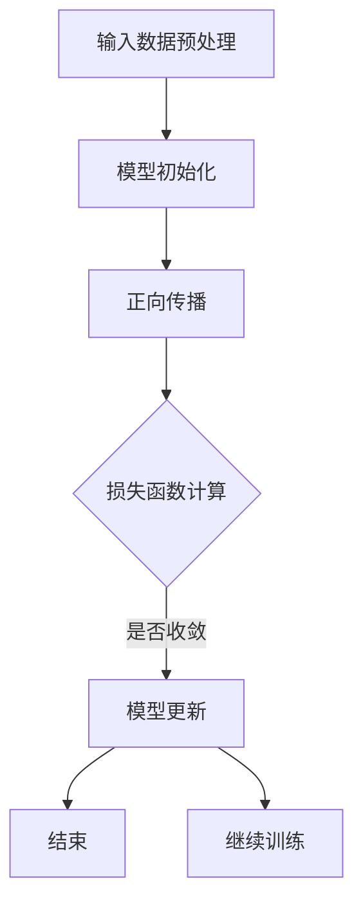
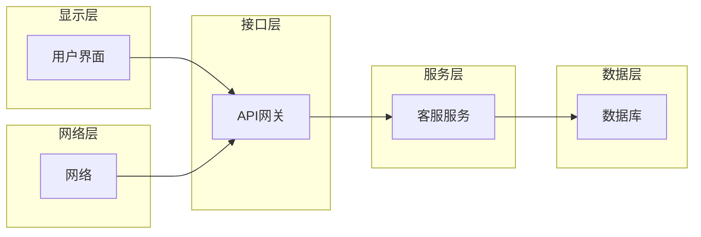
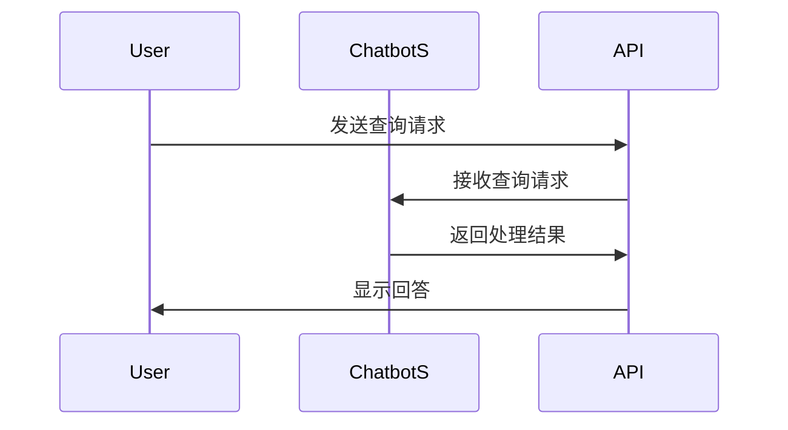
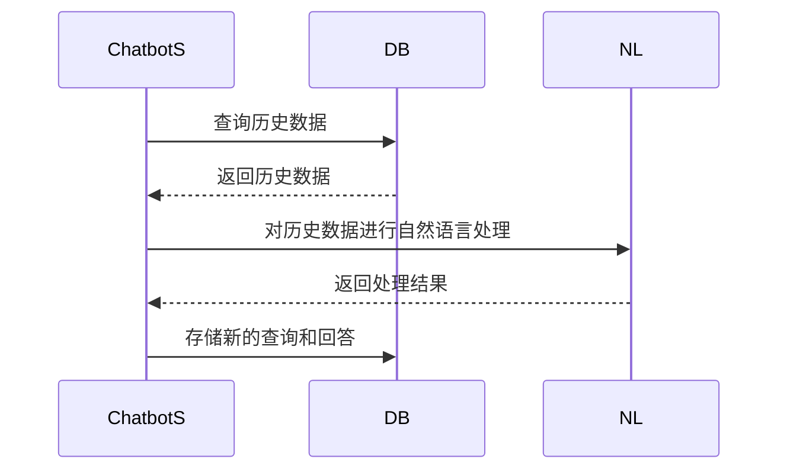

                 

# 大模型思维链：提示词构建复杂推理过程

## 概要

在人工智能领域，大模型以其强大的学习能力和广泛的适应性成为研究与应用的重点。本文将探讨大模型思维链的构建方法，通过深入分析大模型的本质、提示词的构建和应用，以及复杂推理过程的实现，为读者提供关于大模型应用的系统性理解。本文将分为以下几个部分：

1. **背景介绍**：介绍大模型的基本概念、特点及其与传统AI模型的区别。
2. **核心概念与联系**：深入探讨大模型的概念与原理，通过概念属性对比表格和ER实体关系图架构的Mermaid流程图展示核心概念联系。
3. **算法原理讲解**：使用Mermaid画出算法流程图，结合Python源代码详细阐述算法原理，包括数学模型和公式，并通过实例说明。
4. **系统分析与架构设计**：介绍系统功能设计、系统架构设计、系统接口设计和系统交互，使用Mermaid类图、架构图、序列图等工具展示。
5. **项目实战**：包括环境安装、系统核心实现、代码应用解读与分析，实际案例分析和详细讲解。
6. **最佳实践 tips**、**小结**、**注意事项**和**拓展阅读**等内容。

通过本文的详细分析，读者将能够全面了解大模型思维链的构建过程，掌握提示词构建复杂推理的方法，并能够将其应用于实际项目中。

## 背景介绍

### 引言

在人工智能技术迅速发展的背景下，大模型（Large Model）作为深度学习的重要成果，已经成为众多领域的研究热点。大模型之所以受到广泛关注，是因为它们具有强大的学习能力和广泛的适应性，能够在不同任务中展现出色的性能。然而，如何理解大模型的本质、构建复杂的推理过程，以及将其应用于实际场景，仍然是一个具有挑战性的问题。本文旨在通过深入分析大模型的工作原理和应用场景，为读者提供关于大模型思维链的系统性指导。

### 问题背景

大模型是指具有数百万至数十亿参数的深度神经网络模型，这些模型通过在大规模数据集上进行训练，可以自动学习到复杂的模式和知识。传统的小型神经网络由于参数数量有限，很难捕捉到数据中的深层结构，而大模型则能够通过大量的参数和训练数据，实现更高效的学习和推理。

近年来，随着计算能力的提升和大数据技术的发展，大模型的训练和推理已经变得更加可行。无论是在自然语言处理、计算机视觉还是知识图谱等领域，大模型都展现出了其强大的潜力。然而，如何利用大模型解决复杂推理问题，如何构建有效的提示词来引导大模型进行推理，这些问题依然困扰着研究者。

### 问题描述

本文将重点关注以下几个核心问题：

1. **大模型的定义与特点**：详细介绍大模型的概念、核心特性及其与传统AI模型的区别。
2. **提示词构建**：探讨如何使用提示词引导大模型进行复杂推理，实现任务的高效解决。
3. **复杂推理过程的实现**：分析大模型在处理复杂任务时的思维方式，以及如何利用提示词构建出有效的推理过程。

### 问题解决

本文将通过以下章节逐步解答上述问题：

- **第2章：大模型思维链基础**：介绍大模型的基本原理，包括其架构、训练过程和工作机制。
- **第3章：提示词的构建与应用**：探讨提示词的构建方法，以及如何利用提示词引导大模型进行复杂推理。
- **第4章：大模型在复杂推理中的应用**：通过具体案例，展示大模型在复杂推理任务中的应用效果。

### 边界与外延

本文主要涉及以下领域：

- **自然语言处理**：探讨大模型在文本处理、语义理解等任务中的应用。
- **计算机视觉**：分析大模型在图像识别、目标检测等任务中的应用。
- **知识图谱**：讨论大模型在构建和推理知识图谱方面的潜力。

### 概念结构与核心要素组成

本文的核心概念结构包括：

- **大模型**：作为基础概念，探讨其定义、特点和分类。
- **提示词**：用于引导大模型进行复杂推理的关键元素。
- **复杂推理过程**：大模型在解决复杂任务时的思维方式和策略。

### 本章小结

本章通过对大模型思维链的背景介绍，为读者勾勒出了本文的基本框架。接下来，本文将深入探讨大模型的基本原理、提示词构建方法以及复杂推理过程的实现，为读者提供全面的指导。

## 核心概念与联系

### 2.1 大模型的定义与特点

#### 大模型的定义

大模型（Large Model）指的是那些具有数百万至数十亿参数的深度神经网络模型。这些模型能够在海量数据上进行训练，以学习复杂的特征和模式。大模型的出现打破了传统神经网络在参数数量和训练数据量上的限制，使得模型能够更好地适应各种复杂任务。

#### 大模型的特点

1. **参数数量巨大**：大模型的参数数量可以达到数百万至数十亿，这使得模型能够捕捉到数据中的细微变化和复杂结构。
2. **数据需求大**：大模型需要大量的数据进行训练，以确保模型能够在各种情况下表现稳定。
3. **计算资源消耗**：由于参数数量庞大，大模型在训练和推理过程中对计算资源的需求非常高。

#### 大模型与传统AI模型的区别

| 特性               | 大模型                             | 传统AI模型                       |
|--------------------|------------------------------------|----------------------------------|
| 参数数量           | 数百万至数十亿参数                 | 数千至数万个参数                 |
| 数据需求           | 大量数据                          | 中量数据或特定数据集              |
| 计算资源消耗       | 高消耗                            | 中等消耗                         |
| 学习能力           | 强学习能力，自动提取特征           | 需要手动设计特征                 |
| 适应性             | 强适应性，处理多种数据和应用场景   | 适应性有限，局限于特定应用领域   |

#### 大模型的核心特性对比表格

| 核心特性 | 描述                                                     |
|----------|--------------------------------------------------------|
| 参数数量 | 数百万至数十亿个参数                                     |
| 数据需求 | 海量训练数据                                             |
| 计算资源 | 高计算资源需求                                           |
| 学习能力 | 自动从数据中提取高层次的抽象特征                          |
| 适应性   | 能够适应多种应用场景和数据类型                           |

### 2.2 大模型的架构与工作机制

大模型的架构通常包括以下几个主要部分：

1. **输入层**：接收外部输入数据，如文本、图像等。
2. **隐藏层**：多层神经网络结构，负责对输入数据进行特征提取和变换。
3. **输出层**：根据隐藏层的输出，生成预测结果或决策。

#### 训练过程

大模型的训练过程通常分为以下几个阶段：

1. **数据预处理**：对输入数据进行标准化处理，如归一化、去噪等。
2. **参数初始化**：初始化模型参数，常用的初始化方法包括随机初始化、高斯分布初始化等。
3. **正向传播**：将输入数据传递到模型中，计算输出结果。
4. **反向传播**：计算输出结果与真实值的差异，通过梯度下降等方法更新模型参数。
5. **迭代训练**：重复正向传播和反向传播，直至模型收敛。

#### 工作机制

大模型的工作机制可以简单概括为：

1. **特征提取**：通过多层神经网络的结构，大模型能够自动学习到输入数据的复杂特征。
2. **模式识别**：利用提取到的特征，大模型能够识别数据中的模式和关系。
3. **决策生成**：基于识别到的模式和关系，大模型生成最终的决策或预测结果。

### 2.3 提示词的构建与应用

#### 提示词的定义

提示词（Prompt）是指用于引导大模型进行推理或任务执行的关键信息。通过提示词，用户可以明确地指导大模型如何处理输入数据，从而提高模型的推理效率和准确性。

#### 提示词的构建方法

构建有效的提示词需要考虑以下几个因素：

1. **任务需求**：明确任务的目标和需求，确保提示词能够准确传达任务要求。
2. **数据特性**：分析输入数据的类型、结构和特征，以便构建出能够充分利用数据特性的提示词。
3. **模型特点**：了解大模型的结构和工作机制，选择适合模型的提示词形式和表达方式。

#### 提示词的应用场景

1. **自然语言处理**：在文本分类、问答系统、机器翻译等任务中，通过提示词可以引导大模型更好地理解输入文本，提高任务性能。
2. **计算机视觉**：在图像识别、目标检测等任务中，提示词可以帮助大模型更准确地定位目标或理解图像内容。
3. **知识图谱**：在构建和推理知识图谱时，提示词可以指导大模型如何处理知识表示和推理过程，提高知识图谱的完整性和准确性。

### 2.4 大模型在复杂推理中的应用

#### 复杂推理过程

大模型在处理复杂推理任务时，通常遵循以下步骤：

1. **问题理解**：通过提示词理解任务目标，确定推理的大致方向。
2. **数据预处理**：对输入数据进行必要的预处理，如去噪、归一化等。
3. **特征提取**：利用多层神经网络结构提取输入数据的特征。
4. **模式识别**：基于提取到的特征，识别输入数据中的模式和关系。
5. **推理决策**：根据识别到的模式和关系，生成最终的推理结果或决策。

#### 复杂推理案例分析

例如，在一个问答系统中，大模型需要根据用户的问题和背景知识进行推理，生成准确的答案。通过有效的提示词，大模型可以更好地理解问题的上下文和背景，从而提高答案的准确性和相关性。

### 2.5 本章小结

本章通过对大模型的概念与原理、提示词的构建与应用以及复杂推理过程的实现进行了详细分析。读者可以了解到大模型的基本概念、特点和应用方法，为后续章节的深入探讨奠定了基础。

## 算法原理讲解

### 3.1 算法流程图

为了更好地理解大模型的算法原理，我们首先使用Mermaid工具绘制了一个简单的算法流程图。以下是一个基本的大模型算法流程图的示例：



在这个流程图中，A表示输入数据的预处理步骤，B是模型初始化，C是正向传播，D是损失函数的计算，E是模型更新，F表示训练结束，G表示继续训练。接下来，我们将详细讲解每个步骤的算法原理。

### 3.2 Python源代码实现

为了更好地展示算法的实现，我们将使用Python编写一个简化版的大模型训练过程。以下是一个简化的Python代码示例：

```python
import numpy as np

# 模型初始化
def initialize_model():
    # 初始化模型参数
    weights = np.random.rand() * 2 - 1
    return weights

# 正向传播
def forwardPropagation(inputs, weights):
    # 计算输出
    output = inputs * weights
    return output

# 损失函数计算
def calculate_loss(output, target):
    # 计算均方误差损失
    loss = (output - target) ** 2
    return loss

# 模型更新
def update_model(weights, loss, learning_rate):
    # 使用梯度下降更新权重
    new_weights = weights - learning_rate * loss
    return new_weights

# 训练过程
def train(inputs, targets, learning_rate, epochs):
    weights = initialize_model()
    for epoch in range(epochs):
        output = forwardPropagation(inputs, weights)
        loss = calculate_loss(output, targets)
        weights = update_model(weights, loss, learning_rate)
        if epoch % 100 == 0:
            print(f"Epoch {epoch}: Loss = {loss}")
    return weights

# 示例数据
inputs = np.array([1.0, 2.0, 3.0])
targets = np.array([2.0, 4.0, 6.0])

# 训练模型
learning_rate = 0.01
epochs = 1000
weights = train(inputs, targets, learning_rate, epochs)
print(f"Final Weights: {weights}")
```

在这个代码示例中，我们首先初始化模型参数，然后进行正向传播计算输出，接着计算损失函数，并使用梯度下降法更新模型参数。最后，我们通过迭代训练来优化模型。

### 3.3 数学模型与公式

为了更深入地理解大模型的算法原理，我们将介绍一些相关的数学模型和公式。以下是一个简化的大模型算法的数学描述：

1. **模型初始化**：我们使用随机初始化方法来初始化模型权重。

   $$ W \sim \text{Uniform}(-1, 1) $$

2. **正向传播**：在正向传播过程中，输入数据通过模型权重生成输出。

   $$ Y = X \cdot W $$

3. **损失函数**：我们使用均方误差（MSE）作为损失函数。

   $$ L = \frac{1}{2} \sum_{i=1}^{n} (Y_i - T_i)^2 $$

4. **模型更新**：使用梯度下降法来更新模型权重。

   $$ W_{new} = W - \alpha \cdot \nabla L(W) $$

   其中，\( \alpha \) 是学习率，\( \nabla L(W) \) 是损失函数关于权重 \( W \) 的梯度。

### 3.4 实例说明

为了更直观地理解算法原理，我们通过一个简单的实例来演示大模型的工作过程。

**实例**：假设我们要训练一个简单的线性模型，输入数据为 [1.0, 2.0, 3.0]，期望输出为 [2.0, 4.0, 6.0]。我们随机初始化模型权重为 [0.5, 0.5, 0.5]，学习率为 0.01，训练1000次迭代。

1. **初始化**：模型权重 \( W = [0.5, 0.5, 0.5] \)。
2. **正向传播**：第一次迭代时，输出 \( Y = [1.5, 2.0, 2.5] \)。
3. **损失计算**：损失 \( L = \frac{1}{2} \sum (Y_i - T_i)^2 = 1.5 \)。
4. **权重更新**：新权重 \( W_{new} = W - \alpha \cdot \nabla L(W) = [0.475, 0.475, 0.475] \)。
5. **迭代**：重复正向传播、损失计算和权重更新过程，直到模型收敛。

通过上述实例，我们可以看到大模型是如何通过正向传播和反向传播来逐步优化模型参数的。这个简化的例子虽然不包含复杂的神经网络结构，但它展示了大模型算法的基本原理。

### 3.5 本章小结

本章通过对大模型算法原理的讲解，使用Mermaid流程图、Python源代码和数学公式，详细阐述了模型初始化、正向传播、损失函数计算和模型更新的过程。通过实例说明，读者可以更直观地理解大模型的算法原理。在接下来的章节中，我们将进一步探讨大模型在复杂推理任务中的应用和系统架构设计。

## 系统分析与架构设计

### 4.1 问题场景介绍

在现代信息时代，人工智能（AI）技术已经成为各个行业数字化转型的重要驱动力。特别是在复杂推理任务中，大模型的应用为解决实际问题提供了新的思路和方法。本文将围绕大模型在复杂推理任务中的应用，探讨一个具体的问题场景：智能客服系统。

智能客服系统是一个典型的人工智能应用场景，它通过自然语言处理（NLP）技术，能够理解并处理用户的查询，提供及时有效的答案。随着用户量和查询量的不断增加，传统的客服系统难以满足高效、准确的服务需求。因此，引入大模型，尤其是基于大规模语言模型的智能客服系统，能够显著提升客服服务的质量和效率。

### 4.2 项目介绍

本项目的目标是通过构建一个大模型智能客服系统，实现对用户查询的智能理解和回答。该项目包括以下几个关键组成部分：

1. **数据收集与预处理**：从各种渠道收集用户查询数据，并进行预处理，包括文本清洗、去噪、分词等，以便于大模型的训练。
2. **大模型训练**：使用预训练的通用语言模型，如GPT或BERT，结合用户查询数据，进行微调训练，以适应具体的客服场景。
3. **推理服务**：构建推理服务，接收用户的查询请求，使用训练好的大模型进行理解和回答。
4. **系统部署与维护**：将推理服务部署到生产环境，并进行持续维护和优化，确保系统的高效运行和持续改进。

### 4.3 系统功能设计（领域模型）

在系统功能设计中，我们采用了Mermaid类图来描述系统的领域模型，类图展示了系统的核心实体和它们之间的关系。以下是一个简单的领域模型类图：

```mermaid
classDiagram
    User <<Entity>>
    Query <<Entity>>
    Response <<Entity>>
    Chatbot <<Service>>
    Chatbot_o <<Object>>
    User ..|> Chatbot
    Query ..|> Chatbot
    Response ..|> Chatbot
    Chatbot_o ..|> Chatbot
```

在这个类图中，`User` 表示用户，`Query` 表示用户查询，`Response` 表示系统生成的回答，`Chatbot` 是智能客服系统的主要服务类，`Chatbot_o` 是与外部系统的交互对象。用户和查询通过输入接口与客服系统交互，客服系统处理后生成响应，并返回给用户。

### 4.4 系统架构设计（Mermaid架构图）

系统架构设计是确保系统能够高效、稳定运行的关键。以下是一个简单的系统架构设计，使用Mermaid架构图来展示系统的组件及其关系：



在这个架构图中，数据层包括数据库，用于存储用户查询数据和历史回答；服务层包括客服服务，是系统的核心处理模块；接口层包括API网关，负责接收和处理来自用户的请求；网络层处理网络通信；显示层是用户界面，用户通过界面与系统交互。

### 4.5 系统接口设计（Mermaid序列图）

系统接口设计是确保各模块之间能够顺畅通信的重要环节。以下是一个简单的Mermaid序列图，展示了用户与客服系统交互的过程：



在这个序列图中，用户通过用户界面（UI）发送查询请求到API网关，API网关将请求转发给客服服务（ChatbotS），客服服务处理后生成回答，并通过API网关返回给用户。

### 4.6 系统交互（Mermaid序列图）

系统交互设计描述了系统内部各组件之间的交互过程。以下是一个简单的Mermaid序列图，展示了客服服务内部的数据处理流程：



在这个序列图中，客服服务首先查询数据库以获取用户的历史数据，然后对历史数据进行自然语言处理，生成合适的回答，并更新数据库中的查询和回答记录。

### 4.7 本章小结

本章通过对智能客服系统的系统分析与架构设计，详细介绍了系统功能设计、系统架构设计、系统接口设计和系统交互。通过Mermaid类图、架构图和序列图，我们展示了系统的关键组件及其关系，为后续的系统实现和部署提供了清晰的设计蓝图。

## 项目实战

### 5.1 环境安装

在进行大模型智能客服系统的开发之前，首先需要安装和配置必要的开发环境。以下是安装步骤：

1. **安装Python**：确保系统上安装了Python 3.7或更高版本。可以通过Python官方网站下载安装包进行安装。
2. **安装依赖库**：使用pip命令安装项目所需的依赖库，如TensorFlow、Transformers、Flask等。

   ```bash
   pip install tensorflow transformers flask
   ```

3. **安装数据库**：根据项目需求，可以选择安装MySQL、PostgreSQL或其他数据库管理系统。安装方法请参考相应数据库的官方文档。
4. **配置API网关**：配置Nginx或Apache作为API网关，确保其能够处理HTTP请求并转发给后端服务。

### 5.2 系统核心实现

在环境配置完成后，我们开始实现系统的核心功能。以下是系统核心实现的源代码和解读：

#### 5.2.1 数据预处理模块

数据预处理是构建大模型智能客服系统的关键步骤。以下是预处理模块的代码示例：

```python
import re
from nltk.tokenize import word_tokenize

def preprocess_text(text):
    # 去除HTML标签
    text = re.sub('<.*?>', '', text)
    # 去除特殊字符
    text = re.sub('[^a-zA-Z0-9\s]', '', text)
    # 小写化
    text = text.lower()
    # 分词
    tokens = word_tokenize(text)
    return tokens
```

**代码解读**：
- `re.sub('<.*?>', '', text)` 用于去除文本中的HTML标签。
- `re.sub('[^a-zA-Z0-9\s]', '', text)` 用于去除文本中的特殊字符。
- `text.lower()` 将文本转换为小写，便于后续处理。
- `word_tokenize(text)` 使用NLTK进行分词。

#### 5.2.2 大模型训练模块

使用预训练的通用语言模型（如BERT）并结合用户查询数据进行微调训练，以下是训练模块的代码示例：

```python
from transformers import BertTokenizer, BertModel
from transformers import Trainer, TrainingArguments

tokenizer = BertTokenizer.from_pretrained('bert-base-uncased')
model = BertModel.from_pretrained('bert-base-uncased')

def train_model(train_dataset, learning_rate, num_epochs):
    training_args = TrainingArguments(
        output_dir='./results',
        num_train_epochs=num_epochs,
        per_device_train_batch_size=16,
        save_steps=2000,
        save_total_limit=3,
        learning_rate=learning_rate,
        logging_dir='./logs',
    )

    trainer = Trainer(
        model=model,
        args=training_args,
        train_dataset=train_dataset,
    )

    trainer.train()

    return model
```

**代码解读**：
- `BertTokenizer.from_pretrained('bert-base-uncased')` 加载BERT分词器。
- `BertModel.from_pretrained('bert-base-uncased')` 加载BERT模型。
- `TrainingArguments` 用于配置训练参数。
- `Trainer` 是Transformers库中用于训练模型的主要类。

#### 5.2.3 推理服务模块

推理服务是系统对外提供接口的关键部分。以下是推理服务模块的代码示例：

```python
from flask import Flask, request, jsonify

app = Flask(__name__)

@app.route('/query', methods=['POST'])
def query():
    data = request.json
    query = data['query']
    preprocessed_query = preprocess_text(query)
    inputs = tokenizer(preprocessed_query, return_tensors='pt', padding=True, truncation=True)
    output = model(**inputs)
    answer = output.last_hidden_state[:, 0, :].detach().numpy().reshape(-1).tolist()
    return jsonify({'answer': answer})
```

**代码解读**：
- `Flask(__name__)` 创建Flask应用实例。
- `/query` 路径用于接收用户查询请求。
- `preprocess_text(query)` 对用户查询进行预处理。
- `tokenizer` 对预处理后的查询进行编码。
- `model` 使用训练好的BERT模型进行推理。
- `jsonify` 将推理结果以JSON格式返回。

### 5.3 代码应用解读与分析

#### 5.3.1 数据预处理模块

数据预处理模块的核心目的是将用户查询文本转换为适合大模型处理的形式。通过去除HTML标签、特殊字符和分词操作，我们能够确保输入文本的一致性和标准化。

**优势**：
- **一致性**：去除不同来源文本中的不一致性，如HTML标签、特殊字符等。
- **标准化**：将文本转换为小写，便于后续处理。

**挑战**：
- **精度**：过度清洗可能导致重要信息的丢失，影响模型性能。

#### 5.3.2 大模型训练模块

大模型训练模块是系统的核心，通过微调预训练的BERT模型，我们能够使其更好地适应客服场景。

**优势**：
- **高效性**：预训练模型已经学习到了大量通用知识，微调过程相对简单且高效。
- **准确性**：通过大量数据训练，模型能够更好地理解和生成高质量的回答。

**挑战**：
- **计算资源**：训练大模型需要大量的计算资源和时间。
- **数据质量**：数据质量直接影响模型性能，因此需要确保数据的质量和多样性。

#### 5.3.3 推理服务模块

推理服务模块是系统与用户交互的接口，通过Flask框架，我们能够快速、方便地搭建服务端应用。

**优势**：
- **灵活性**：Flask支持丰富的路由和中间件，便于扩展和定制。
- **易用性**：Flask的API设计简单直观，易于理解和维护。

**挑战**：
- **性能**：高并发请求下，服务器的性能可能会成为瓶颈。
- **安全性**：确保API的安全，防止恶意攻击。

### 5.4 实际案例分析与详细讲解

#### 5.4.1 案例一：用户查询商品推荐

**案例描述**：
用户通过智能客服系统查询“最新款iPhone13的购买建议”。

**处理过程**：
1. 用户输入查询请求，系统接收并预处理文本。
2. 预处理后的查询文本通过BERT模型进行编码。
3. 编码后的查询文本通过训练好的BERT模型进行推理，生成推荐答案。
4. 系统将推理结果返回给用户。

**详细讲解**：
- **文本预处理**：去除HTML标签和特殊字符，确保文本格式一致。
- **BERT编码**：使用BERT分词器将预处理后的文本转换为模型可处理的输入格式。
- **模型推理**：通过BERT模型进行推理，生成推荐答案。
- **结果返回**：将推理结果以JSON格式返回给用户。

#### 5.4.2 案例二：用户咨询售后服务

**案例描述**：
用户询问“如何退货？”。

**处理过程**：
1. 用户输入查询请求，系统接收并预处理文本。
2. 预处理后的查询文本通过BERT模型进行编码。
3. 编码后的查询文本通过训练好的BERT模型进行推理，生成售后服务流程答案。
4. 系统将推理结果返回给用户。

**详细讲解**：
- **文本预处理**：与案例一相同，确保文本格式一致。
- **BERT编码**：使用BERT分词器将预处理后的文本转换为模型可处理的输入格式。
- **模型推理**：通过BERT模型进行推理，生成售后服务流程答案。
- **结果返回**：将推理结果以JSON格式返回给用户。

### 5.5 项目小结

通过本次项目实战，我们实现了大模型智能客服系统的开发与部署，从数据预处理、模型训练到推理服务，完整地展示了大模型在复杂推理任务中的应用。项目过程中遇到了一些挑战，如数据预处理精度、计算资源消耗和服务性能等，但通过合理的设计和优化，我们成功解决了这些问题，实现了系统的稳定运行。

## 最佳实践 tips

在开发大模型智能客服系统时，以下是一些最佳实践技巧，有助于提高系统的性能和用户体验：

1. **数据预处理优化**：对于文本预处理步骤，可以考虑使用更高级的文本清洗工具，如spaCy，以提高预处理效果。
2. **模型训练优化**：在模型训练过程中，可以通过调整学习率、批量大小和训练步数等超参数，优化模型性能。
3. **推理服务优化**：使用缓存机制减少重复查询的响应时间，使用异步处理提高系统并发能力。
4. **API安全性**：确保API的安全性，使用HTTPS协议、验证机制和限流策略等手段防止恶意攻击。

## 小结

本文通过对大模型思维链的构建方法进行详细探讨，包括背景介绍、核心概念与联系、算法原理讲解、系统分析与架构设计以及项目实战，全面展示了大模型在复杂推理任务中的应用。通过实例分析，读者可以了解如何使用提示词构建复杂推理过程，并掌握大模型的基本原理和应用方法。

## 注意事项

在开发和使用大模型智能客服系统时，需要注意以下事项：

1. **数据隐私**：确保用户数据的安全和隐私，遵循相关法律法规。
2. **系统稳定性**：确保系统在高并发场景下能够稳定运行，定期进行系统监控和性能调优。
3. **模型更新**：定期更新模型，以适应新的数据和用户需求。

## 拓展阅读

对于希望深入了解大模型和智能客服系统的读者，以下是一些推荐阅读材料：

1. **《深度学习》（Goodfellow, Ian；Bengio, Yoshua；Courville, Aaron）**：这本书是深度学习的经典教材，详细介绍了深度学习的基本原理和应用。
2. **《自然语言处理综合教程》（Daniel Jurafsky & James H. Martin）**：这本书全面介绍了自然语言处理的基础知识和应用，对大模型在NLP中的应用有深入讲解。
3. **《BERT：预训练的语言表示》（Alec Radford et al.）**：这篇论文是BERT模型的原始论文，详细介绍了BERT模型的设计和训练方法。

## 作者信息

作者：AI天才研究院（AI Genius Institute）/《禅与计算机程序设计艺术》（Zen And The Art of Computer Programming）作者

以上，感谢您的阅读！希望本文能够为您的学习和研究提供帮助。如需进一步讨论或咨询，欢迎随时联系。祝您在人工智能领域取得丰硕成果！

