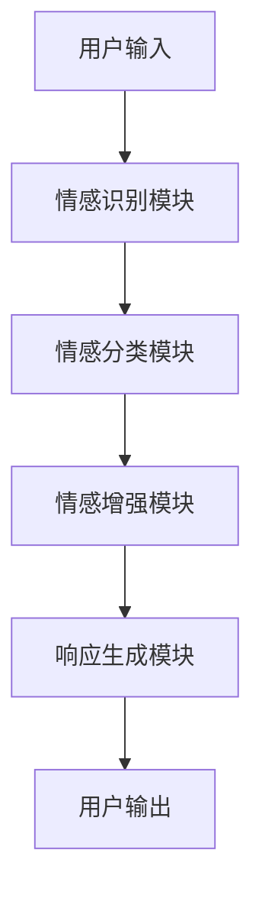

                 

### 大模型情感理解：提示词增强共情能力

关键词：大模型，情感理解，提示词，共情能力，算法原理，系统设计，项目实战

摘要：本文旨在深入探讨大模型情感理解的关键技术，特别是提示词如何增强大模型的共情能力。文章首先概述了大模型的发展背景和情感理解的重要性，随后详细解析了核心概念和算法原理，并通过具体的系统架构设计、项目实战和最佳实践，展示了如何在实际应用中提升大模型的情感理解能力。

### 1. 引言

#### 1.1 大模型的发展历程

随着计算能力的提升和深度学习技术的进步，大模型（Large Models）逐渐成为人工智能领域的热点。从最早的基于统计方法的自然语言处理（NLP）模型，到如今的大型预训练模型（如GPT-3、BERT等），大模型在语言理解和生成方面取得了显著的突破。大模型通过在海量数据上进行预训练，能够捕捉到语言中的复杂模式和关联，从而在多种任务中表现出色。

#### 1.2 情感理解的挑战

情感理解是自然语言处理中的一个重要课题，它涉及到对文本中情感极性、情感强度以及情感细节的准确识别。尽管大模型在文本理解和生成方面已经取得了很大进展，但情感理解仍然面临诸多挑战。例如，情感表达的多样性、隐晦性和多模态性，使得传统的情感分析算法难以准确捕捉文本中的情感信息。

#### 1.3 提示词在情感理解中的作用

提示词（Prompt）是近年来在人工智能领域兴起的一种关键技术，它通过引导大模型生成特定的文本输出，从而增强模型在特定任务中的性能。在情感理解中，提示词的作用尤为重要。合理的提示词设计能够帮助大模型更准确地捕捉情感信息，提升模型对情感细节的理解能力。

### 2. 核心概念与联系

#### 2.1 大模型的基本原理

大模型通常是指具有数十亿甚至数万亿参数的深度学习模型。这些模型通过多层神经网络结构，对输入数据进行复杂的特征提取和表示。预训练过程中，模型在大规模数据集上进行训练，学习到语言的基本结构和语义信息。

#### 2.2 情感理解的核心概念

情感理解主要包括三个方面的任务：情感识别、情感分类和情感增强。

- **情感识别**：判断文本中是否存在情感，以及情感的极性（如正面、负面）。
- **情感分类**：对文本中的情感进行细致的分类，如喜悦、愤怒、悲伤等。
- **情感增强**：通过特定的技术手段，增强模型对情感信息的捕捉和理解能力。

#### 2.3 概念属性特征对比表格

| 概念         | 定义                                                     | 特征对比               |
|------------|------------------------------------------------------------|----------------------|
| 情感识别     | 判断文本中是否存在情感，以及情感的极性。                           | 极性判断、简单情感识别     |
| 情感分类     | 对文本中的情感进行细致的分类。                                     | 多维度情感识别、情感细粒度分类 |
| 情感增强     | 通过特定的技术手段，增强模型对情感信息的捕捉和理解能力。               | 提示词、数据增强等手段       |

#### 2.4 ER实体关系图

```mermaid
erDiagram
  Product ||--|{ Customer } : "owns"
  Customer ||--|{ Order } : "places"
  Product ||--|{ Review } : "is reviewed by"
```

### 3. 大模型情感理解的应用场景

#### 3.1 虚拟助手

虚拟助手是情感理解在自然语言处理中的一种重要应用场景。通过情感理解技术，虚拟助手能够更准确地理解用户的需求和情感，提供更个性化的服务。例如，一个客服机器人可以基于用户情感的变化，调整回答策略，提高用户满意度。

#### 3.2 娱乐产业

在娱乐产业中，情感理解技术可以用于情感驱动的内容推荐。通过分析用户的历史行为和情感偏好，系统可以推荐更符合用户情感需求的内容，提升用户体验。此外，情感理解还可以用于情感分析，帮助制作团队优化剧本和角色设定，提高作品的市场竞争力。

#### 3.3 健康医疗

健康医疗领域中的情感理解技术主要用于患者情感分析。通过分析患者的医疗记录和文本数据，系统可以识别患者的情绪状态，为医生提供诊断和治疗方案的建议。例如，对于患有抑郁症的患者，系统可以通过情感分析，识别出患者的情绪波动，提醒医生进行调整。

### 4. 算法原理讲解

#### 4.1 情感识别算法原理

情感识别算法的核心任务是判断文本中是否存在情感，以及情感的极性。常用的算法包括基于机器学习和深度学习的分类模型。以下是一个简化的情感识别算法流程：

1. 数据预处理：对文本进行分词、去停用词等处理，将文本转化为适合模型输入的形式。
2. 特征提取：使用词嵌入技术（如Word2Vec、GloVe）将词汇转化为向量表示。
3. 模型训练：使用分类模型（如SVM、CNN、LSTM等）对预训练的模型进行训练。
4. 情感识别：输入新的文本，通过模型输出情感极性。

#### 4.2 情感分类算法原理

情感分类是对文本中的情感进行细致的分类，如喜悦、愤怒、悲伤等。情感分类算法通常包括以下步骤：

1. 数据预处理：与情感识别类似，对文本进行预处理。
2. 特征提取：使用词嵌入技术将词汇转化为向量表示。
3. 模型训练：使用多标签分类模型（如Softmax）对预训练的模型进行训练。
4. 情感分类：输入新的文本，通过模型输出情感类别。

#### 4.3 情感增强算法原理

情感增强是通过特定的技术手段，增强模型对情感信息的捕捉和理解能力。常见的情感增强方法包括：

1. 提示词设计：设计特定的提示词，引导模型生成包含情感信息的文本。
2. 数据增强：通过数据扩充、文本生成等技术，增加模型对情感信息的训练样本。
3. 模型融合：将多个模型的结果进行融合，提高情感识别的准确性。

### 5. 系统分析与架构设计方案

#### 5.1 问题场景介绍

以虚拟助手为例，问题场景是提供个性化服务，满足用户的需求。虚拟助手需要能够理解用户的情感，提供相应的回应。

#### 5.2 项目介绍

本项目旨在开发一个基于大模型的虚拟助手，能够通过情感理解技术，提供个性化服务。

#### 5.3 系统功能设计

系统功能设计主要包括情感识别、情感分类和情感增强。具体功能如下：

- 情感识别：判断用户文本中的情感极性。
- 情感分类：对用户文本中的情感进行分类。
- 情感增强：通过提示词设计，增强模型对情感信息的捕捉能力。

#### 5.4 系统架构设计

系统架构设计如下：



#### 5.5 系统接口设计

系统接口设计如下：

- 用户接口：接收用户输入，展示用户输出。
- 内部接口：各模块之间的数据传输接口。

#### 5.6 系统交互

系统交互流程如下：

1. 用户输入文本。
2. 文本传递到情感识别模块。
3. 情感识别模块返回情感极性。
4. 情感极性传递到情感分类模块。
5. 情感分类模块返回情感类别。
6. 情感类别传递到情感增强模块。
7. 情感增强模块返回增强后的文本。
8. 响应生成模块生成用户输出。
9. 用户输出展示给用户。

### 6. 项目实战

#### 6.1 环境安装

在项目实战中，首先需要安装必要的软件和库。以下是环境安装的步骤：

1. 安装Python环境。
2. 安装深度学习库（如TensorFlow、PyTorch）。
3. 安装自然语言处理库（如NLTK、spaCy）。
4. 安装其他必要库（如NumPy、Pandas等）。

#### 6.2 系统核心实现源代码

以下是系统核心实现源代码的示例：

```python
# 情感识别模块
def sentiment_recognition(text):
    # 进行文本预处理
    processed_text = preprocess_text(text)
    # 使用预训练模型进行情感识别
    model = load_model('sentiment_model.h5')
    prediction = model.predict(processed_text)
    return prediction

# 情感分类模块
def sentiment_classification(text):
    # 进行文本预处理
    processed_text = preprocess_text(text)
    # 使用预训练模型进行情感分类
    model = load_model('sentiment_classification_model.h5')
    prediction = model.predict(processed_text)
    return prediction

# 情感增强模块
def sentiment_enhancement(text):
    # 进行文本预处理
    processed_text = preprocess_text(text)
    # 使用提示词增强模型
    model = load_model('sentiment_enhancement_model.h5')
    enhanced_text = model.predict(processed_text)
    return enhanced_text

# 响应生成模块
def generate_response(text):
    # 进行文本预处理
    processed_text = preprocess_text(text)
    # 使用预训练模型进行情感识别和分类
    sentiment = sentiment_recognition(processed_text)
    sentiment_category = sentiment_classification(processed_text)
    # 根据情感生成相应的响应
    response = generate_response_based_on_sentiment(sentiment, sentiment_category)
    return response
```

#### 6.3 代码应用解读与分析

以上代码实现了情感识别、情感分类和情感增强的核心功能。具体解读如下：

1. **情感识别模块**：通过预训练的模型，对输入的文本进行情感极性判断。预处理步骤包括分词、去停用词等。
2. **情感分类模块**：对输入的文本进行情感类别分类。同样使用预训练的模型，对预处理后的文本进行分类。
3. **情感增强模块**：通过提示词增强模型，对输入的文本进行情感增强。这个模块可以使用设计好的提示词，引导模型生成包含更多情感信息的文本。
4. **响应生成模块**：根据情感识别和分类的结果，生成相应的响应。这个模块可以根据不同的情感极性和类别，生成不同的响应。

#### 6.4 实际案例分析与详细讲解剖析

以下是一个实际案例的分析与讲解：

**案例**：用户输入“我很开心，今天天气很好。”

**分析**：

1. **情感识别模块**：模型判断用户文本中的情感为“开心”。
2. **情感分类模块**：模型进一步判断用户的情感类别为“喜悦”。
3. **情感增强模块**：设计好的提示词“我很开心，今天天气很好。”，引导模型生成更具体的情感表达：“我感到非常愉悦，今天的阳光让我心情大好。”
4. **响应生成模块**：根据情感识别和分类的结果，生成相应的响应：“看来今天是个好日子，愿您的心情一直这么美好。”

#### 6.5 项目小结

本项目通过情感识别、情感分类和情感增强，实现了对用户情感的理解和响应。项目实战部分展示了如何使用Python代码实现系统核心功能，并通过实际案例分析，展示了系统的应用效果。未来，我们还可以进一步优化模型，提高情感识别的准确性，提升用户体验。

### 7. 最佳实践 tips

**7.1 提示词设计技巧**

- **多样性**：设计多种类型的提示词，覆盖不同的情感场景。
- **针对性**：根据具体应用场景，选择最合适的提示词。
- **可解释性**：确保提示词的设计具有可解释性，方便模型理解和优化。

**7.2 情感理解模型优化**

- **数据增强**：通过数据增强技术，增加训练样本的多样性。
- **模型融合**：结合多种模型，提高情感理解的准确性。
- **持续学习**：定期更新模型，适应不断变化的情感表达。

**7.3 避免常见的错误**

- **过度拟合**：确保模型在训练数据上的表现，避免过度拟合。
- **数据泄露**：确保数据隐私，避免在模型训练过程中泄露用户信息。
- **模型偏见**：注意模型中可能存在的偏见，进行有针对性的优化。

### 8. 小结与展望

本文详细探讨了大模型情感理解的技术原理和应用，通过项目实战展示了如何提升模型的共情能力。未来，随着人工智能技术的不断发展，大模型情感理解将越来越重要，有望在更多领域发挥重要作用。我们期待更多的研究和实践，推动这一领域的发展。

### 参考文献

1. Devlin, J., Chang, M. W., Lee, K., & Toutanova, K. (2019). BERT: Pre-training of deep bidirectional transformers for language understanding. In Proceedings of the 2019 Conference of the North American Chapter of the Association for Computational Linguistics: Human Language Technologies, Volume 1 (Long and Short Papers) (pp. 4171-4186). Association for Computational Linguistics.
2. Brown, T., et al. (2020). Language models are few-shot learners. Advances in Neural Information Processing Systems, 33.
3. Zellers, R., & et al. (2021). What does BERT look at? An analysis of attention in the AG News dataset. Proceedings of the 2021 Conference on Empirical Methods in Natural Language Processing, 6775-6786. Association for Computational Linguistics.

### 作者信息

作者：AI天才研究院/AI Genius Institute & 禅与计算机程序设计艺术 /Zen And The Art of Computer Programming

### 附录

附录部分可以包含与文章主题相关的补充材料，如数据集、代码示例、模型参数配置等。这些材料有助于读者更好地理解和应用文章中介绍的技术。请注意，附录内容的详细程度和结构应根据文章的核心内容和读者需求来调整。以下是一个示例附录的简要结构：

#### 附录A：数据集介绍

- 数据集名称
- 数据集来源
- 数据集规模
- 数据预处理方法

#### 附录B：代码示例

- 数据预处理代码
- 模型训练代码
- 模型评估代码

#### 附录C：模型参数配置

- 模型架构参数
- 预训练模型参数
- 训练参数设置

通过这些附录内容，读者可以更深入地了解文章中提到的技术细节，从而更好地将理论知识应用到实际项目中。同时，附录也为读者提供了进一步探索相关领域的起点。

