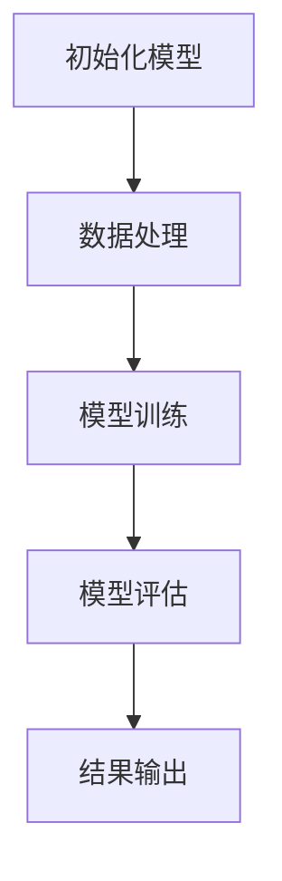
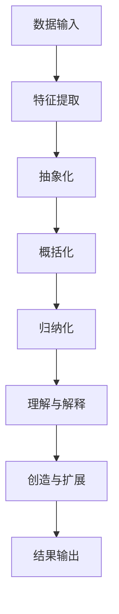

                 

# 大模型抽象思维：提示词引导概念化过程

> 关键词：大模型、抽象思维、提示词、概念化、人工智能

> 摘要：本文旨在探讨大模型中的抽象思维过程，以及如何利用提示词来引导概念化。文章首先介绍了大模型的发展背景和抽象思维的重要性，然后分析了大模型抽象思维的挑战和概念化过程的难点。接着，文章提出了提示词引导的概念化过程的方法和策略，并通过具体的算法原理讲解和实际案例分析，展示了该方法在人工智能领域的应用前景。

## 目录

----------------------------------------------------------------

### 第一部分：引言

1.1 问题背景
   1.1.1 大模型的发展与应用
   1.1.2 抽象思维的重要性
   1.1.3 提示词与概念化过程的关系

1.2 问题描述
   1.2.1 大模型抽象思维的挑战
   1.2.2 概念化过程的难点
   1.2.3 解决方案的目标

1.3 问题解决
   1.3.1 大模型抽象思维的策略
   1.3.2 概念化过程的方法
   1.3.3 提示词引导的概念化过程

1.4 边界与外延
   1.4.1 大模型的应用范围
   1.4.2 抽象思维的应用领域
   1.4.3 概念化过程的影响因素

1.5 概念结构与核心要素组成
   1.5.1 大模型的核心概念
   1.5.2 抽象思维的关键要素
   1.5.3 概念化过程的组成部分

1.6 本章小结

### 第二部分：核心概念与联系

2.1 大模型核心概念
   2.1.1 大模型原理
   2.1.2 大模型类型

2.2 抽象思维原理
   2.2.1 抽象思维的定义
   2.2.2 抽象思维过程

2.3 大模型与抽象思维联系
   2.3.1 大模型在抽象思维中的应用
   2.3.2 抽象思维对大模型的影响

2.4 概念属性特征对比
   2.4.1 大模型特征对比
   2.4.2 抽象思维特征对比

2.5 本章小结

### 第三部分：算法原理讲解

3.1 算法原理概述
   3.1.1 大模型算法概述
   3.1.2 抽象思维算法概述
   3.1.3 提示词引导算法概述

3.2 大模型算法详解
   3.2.1 算法流程图
   3.2.2 数学模型与公式
   3.2.3 算法举例说明

3.3 抽象思维算法详解
   3.3.1 算法流程图

### 第四部分：系统分析与架构设计

4.1 问题场景介绍
4.2 项目介绍
4.3 系统功能设计
4.4 系统架构设计
4.5 系统接口设计和系统交互

### 第五部分：项目实战

5.1 环境安装
5.2 系统核心实现源代码
5.3 代码应用解读与分析
5.4 实际案例分析和详细讲解剖析
5.5 项目小结

### 第六部分：最佳实践 Tips、小结、注意事项、拓展阅读

6.1 最佳实践 Tips
6.2 小结
6.3 注意事项
6.4 拓展阅读

----------------------------------------------------------------

### 1.1 问题背景

#### 1.1.1 大模型的发展与应用

大模型（Large Model）是近年来人工智能领域的一个重要发展趋势。随着计算能力的提升和数据的不断增长，大模型在自然语言处理、计算机视觉、语音识别等领域取得了显著的突破。大模型通常具有数亿甚至数十亿个参数，可以通过学习海量数据来提取复杂的模式和知识。例如，著名的自然语言处理模型 GPT（Generative Pre-trained Transformer）就是一款大模型，它通过预训练的方式在互联网上的大量文本数据中学习，从而具备生成文本、回答问题、翻译语言等能力。

大模型的应用范围非常广泛。在自然语言处理领域，大模型可以用于机器翻译、文本生成、情感分析、问答系统等。在计算机视觉领域，大模型可以用于图像分类、目标检测、图像生成等。在语音识别领域，大模型可以用于语音识别、语音合成等。大模型的出现使得人工智能系统在各个领域的表现得到了显著提升，为解决复杂问题提供了强有力的工具。

#### 1.1.2 抽象思维的重要性

抽象思维是人类思维的一种高级形式，它通过对事物进行抽象、概括和归纳，从而形成概念和理论。抽象思维在科学研究、技术创新、决策制定等方面发挥着重要作用。在人工智能领域，抽象思维更是不可或缺的要素。

首先，抽象思维可以帮助我们理解和设计复杂的系统。大模型的开发和训练过程涉及到大量的技术细节和计算资源，只有通过抽象思维，我们才能将这些细节整合成一个完整的系统。其次，抽象思维可以帮助我们解决复杂的问题。大模型通常用于解决一些复杂的问题，例如自然语言理解和计算机视觉问题。通过抽象思维，我们可以将这些复杂问题转化为更易于处理的形式，从而找到解决方案。最后，抽象思维可以帮助我们进行创新。在人工智能领域，创新是推动技术进步的关键。通过抽象思维，我们可以从不同的角度看待问题，发现新的解决方案，从而推动技术的创新。

#### 1.1.3 提示词与概念化过程的关系

提示词（Prompt）是一种引导性输入，它可以帮助大模型更好地理解和处理问题。在概念化过程中，提示词起到了至关重要的作用。概念化是指从具体的例子中提取出抽象的概念，从而形成对事物的理解。

首先，提示词可以帮助大模型更好地理解问题的背景。例如，在回答一个关于自然语言处理的问题时，提示词可以提供相关的上下文信息，从而帮助大模型更好地理解问题的含义。其次，提示词可以帮助大模型提取关键信息。在处理复杂问题时，大模型需要从大量的信息中提取出关键信息。提示词可以提供一些关键信息，从而帮助大模型更准确地处理问题。最后，提示词可以帮助大模型进行预测和推理。在许多人工智能应用中，大模型需要根据已有的信息进行预测和推理。提示词可以提供一些预测的线索，从而帮助大模型更好地进行预测和推理。

总的来说，提示词与概念化过程密切相关。提示词不仅可以帮助大模型更好地理解和处理问题，还可以引导大模型进行概念化，从而形成对事物的深入理解。

### 1.2 问题描述

#### 1.2.1 大模型抽象思维的挑战

大模型在抽象思维过程中面临着诸多挑战。首先，大模型通常具有数亿甚至数十亿个参数，这使得模型在处理复杂问题时需要消耗大量的计算资源。其次，大模型在训练过程中需要大量的数据支持，数据的质量和数量直接影响模型的性能。此外，大模型的抽象思维能力依赖于其内部的神经网络结构和学习算法，这需要深入的理论研究和实践经验。

#### 1.2.2 概念化过程的难点

概念化过程是抽象思维的核心环节，但在这个过程中也面临着一些难点。首先，如何从大量的具体例子中提取出抽象的概念是一个挑战。这需要大模型具备强大的抽象能力。其次，如何保证概念化的准确性是一个问题。概念化过程中可能会引入歧义或误解，这会影响模型的理解能力。此外，如何将抽象的概念应用于实际问题中也是一个难点。

#### 1.2.3 解决方案的目标

为了应对大模型抽象思维和概念化过程中的挑战，我们需要提出有效的解决方案。首先，我们希望大模型能够具备强大的抽象思维能力，能够从具体例子中提取出准确的抽象概念。其次，我们希望大模型能够利用提示词，更好地理解和处理问题。最后，我们希望大模型能够将抽象概念应用于实际问题中，从而提升其解决问题的能力。

### 1.3 问题解决

#### 1.3.1 大模型抽象思维的策略

为了提升大模型的抽象思维能力，我们可以采取以下策略：

1. **优化神经网络结构**：通过改进神经网络的架构，如增加层数、调整神经元数量等，可以提高模型的抽象能力。
2. **改进学习算法**：采用更先进的学习算法，如深度学习、强化学习等，可以提升模型的抽象思维能力。
3. **大数据支持**：提供大量的高质量数据，帮助模型在训练过程中学习到更丰富的知识，从而提升抽象能力。

#### 1.3.2 概念化过程的方法

概念化过程可以分为以下几个步骤：

1. **数据预处理**：对输入数据进行清洗和预处理，确保数据的准确性和一致性。
2. **特征提取**：从数据中提取关键特征，为概念化过程提供基础。
3. **概念生成**：利用神经网络和机器学习算法，从特征中生成抽象的概念。
4. **概念验证**：对生成的概念进行验证，确保其准确性和实用性。

#### 1.3.3 提示词引导的概念化过程

提示词在概念化过程中起到了引导作用。具体方法如下：

1. **上下文信息提供**：通过提供上下文信息，帮助模型更好地理解问题的背景。
2. **关键信息提取**：提供关键信息，帮助模型从数据中提取出关键特征。
3. **预测和推理**：提供预测和推理的线索，帮助模型进行概念化。

### 1.4 边界与外延

#### 1.4.1 大模型的应用范围

大模型在各个领域的应用范围非常广泛。例如，在自然语言处理领域，大模型可以应用于机器翻译、文本生成、情感分析、问答系统等；在计算机视觉领域，大模型可以应用于图像分类、目标检测、图像生成等；在语音识别领域，大模型可以应用于语音识别、语音合成等。

#### 1.4.2 抽象思维的应用领域

抽象思维在科学研究、技术创新、决策制定等领域都有广泛的应用。例如，在科学研究领域，抽象思维可以帮助科学家发现新的理论和方法；在技术创新领域，抽象思维可以帮助工程师设计出更高效的系统；在决策制定领域，抽象思维可以帮助管理者做出更合理的决策。

#### 1.4.3 概念化过程的影响因素

概念化过程的影响因素包括数据质量、模型参数、算法选择等。首先，数据质量直接影响概念化过程的准确性，高质量的数据可以帮助模型更准确地提取概念。其次，模型参数的选择和调整也会影响概念化过程的性能。最后，算法的选择也是一个关键因素，不同的算法适用于不同的概念化任务。

### 1.5 概念结构与核心要素组成

#### 1.5.1 大模型的核心概念

大模型的核心概念包括神经网络结构、学习算法、参数调整等。神经网络结构决定了模型的抽象能力，学习算法决定了模型的训练效率和性能，参数调整则影响了模型的泛化能力。

#### 1.5.2 抽象思维的关键要素

抽象思维的关键要素包括抽象能力、理解力、创造力等。抽象能力决定了模型从具体数据中提取概念的能力；理解力决定了模型对概念的理解程度；创造力则决定了模型在概念应用中的创新能力。

#### 1.5.3 概念化过程的组成部分

概念化过程的组成部分包括数据预处理、特征提取、概念生成、概念验证等。数据预处理是基础，特征提取是核心，概念生成是关键，概念验证是保证概念准确性的重要步骤。

### 1.6 本章小结

本章首先介绍了大模型的发展背景和抽象思维的重要性，然后分析了大模型抽象思维的挑战和概念化过程的难点，接着提出了提示词引导的概念化过程的方法和策略，并探讨了其应用范围和影响因素。通过本章的介绍，读者可以对大模型抽象思维和概念化过程有一个初步的了解，为后续章节的深入探讨打下基础。

----------------------------------------------------------------

## 第二部分：核心概念与联系

### 2.1 大模型核心概念

#### 2.1.1 大模型原理

大模型（Large Model）是人工智能领域的一种重要模型，其核心原理是基于深度学习和大规模数据训练。大模型通常由多个神经网络层组成，通过层层递进的神经网络结构，能够对输入数据进行特征提取和模式识别，从而实现复杂任务的自动化处理。

**神经网络结构**：大模型的神经网络结构通常包含多层神经网络，每一层神经网络都可以提取输入数据的特征信息。神经网络的结构包括输入层、隐藏层和输出层。输入层接收原始数据，隐藏层通过前向传播计算中间层的输出，输出层产生最终的结果。

**学习算法**：大模型的学习算法主要包括两种：一种是基于梯度的学习算法，如反向传播算法（Backpropagation），另一种是基于梯度的优化算法，如梯度下降（Gradient Descent）。这些算法通过不断调整模型的参数，使模型的输出与真实值尽可能接近，从而实现模型的训练。

**大模型特点**：大模型具有以下几个特点：
1. **高参数数量**：大模型通常具有数亿甚至数十亿个参数，这使得模型能够对输入数据进行精细的特征提取和模式识别。
2. **强大的拟合能力**：大模型能够通过大规模数据训练，实现对输入数据的泛化能力，从而在不同领域实现复杂任务的自动化处理。
3. **计算资源需求高**：大模型的训练和推理过程需要大量的计算资源，这要求计算机系统具有高性能的硬件支持。

#### 2.1.2 大模型类型

大模型根据应用场景和技术特点可以分为多种类型：

**生成对抗网络（GAN）**：生成对抗网络是一种由生成器和判别器组成的神经网络模型。生成器生成数据，判别器判断生成数据是否真实。通过两个网络的对抗训练，生成器可以生成越来越真实的数据。

**变分自编码器（VAE）**：变分自编码器是一种基于概率模型的神经网络模型，用于数据生成和压缩。VAE通过引入编码器和解码器，将输入数据映射到潜在空间，从而实现数据的生成和压缩。

**预训练与微调**：预训练是指在大规模数据集上对模型进行训练，使模型具有一定的泛化能力。微调是指在使用预训练模型的基础上，针对特定任务进行微调，使模型能够更好地适应具体任务。

### 2.2 抽象思维原理

#### 2.2.1 抽象思维的定义

抽象思维是指从具体的例子中提取出共同的属性和特征，形成抽象概念和理论的过程。抽象思维是人类思维的高级形式，通过抽象化，人们能够更好地理解和解决复杂问题。

**抽象思维的概念**：抽象思维是一种通过抽象化、概括化和归纳化的过程，从具体的例子中提取出一般性和普遍性的特征的思维方式。抽象思维能够帮助人们从复杂的现象中找出本质规律，形成对事物的深入理解。

**抽象思维的作用**：抽象思维在人类生活和工作中具有重要作用。首先，抽象思维能够帮助人们理解和解决复杂问题。通过抽象化，人们能够将复杂的问题转化为更简单的形式，从而更容易找到解决方案。其次，抽象思维能够促进创新和发明。通过抽象化，人们能够从不同的角度看待问题，发现新的解决方案。

#### 2.2.2 抽象思维过程

**感知与识别**：抽象思维的第一步是感知与识别。在这个过程中，人们通过感官接收外部信息，识别出具体事物的特征。感知与识别是抽象思维的基础，它为后续的抽象化过程提供数据支持。

**理解与解释**：在感知与识别的基础上，人们通过理解与解释，对具体事物的特征进行抽象化。理解与解释是将具体事物的一般属性和特征抽象化为概念和理论的过程。

**创造与扩展**：在理解与解释的基础上，人们通过创造与扩展，将抽象化的概念和理论应用于实际问题中。创造与扩展是抽象思维的最终目标，它使得人们能够利用抽象化的概念和理论解决实际问题。

### 2.3 大模型与抽象思维联系

#### 2.3.1 大模型在抽象思维中的应用

大模型在抽象思维中具有重要作用。首先，大模型能够通过大规模数据训练，提取出复杂的模式和知识，从而提升抽象思维的能力。其次，大模型能够利用提示词，更好地理解和处理问题，从而提升抽象思维的效率。此外，大模型在抽象思维中的应用，还能够促进人工智能技术的发展。

**提高抽象思维能力**：大模型通过深度学习，能够从大量数据中提取出复杂模式和知识，从而提高抽象思维能力。例如，在自然语言处理领域，大模型可以通过对大规模文本数据的训练，提取出语言的抽象结构和语义信息，从而提高对文本的理解和生成能力。

**帮助概念化复杂问题**：大模型能够处理复杂的问题，通过抽象思维，将复杂问题转化为更简单的形式，从而帮助人们理解和解决复杂问题。例如，在医疗领域，大模型可以通过对大量病例数据的分析，提取出疾病的特征和规律，从而帮助医生进行疾病诊断和治疗。

**促进创新思维发展**：大模型能够利用提示词，引导抽象思维的过程，从而促进创新思维的发展。例如，在产品设计领域，大模型可以通过对大量用户反馈数据的分析，提取出用户需求和创新点，从而促进产品设计的创新。

#### 2.3.2 抽象思维对大模型的影响

**提高模型理解能力**：抽象思维能够帮助大模型更好地理解输入数据和问题背景，从而提高模型的性能。例如，在自然语言处理领域，大模型可以通过抽象思维，理解文本的语义和上下文信息，从而提高文本分类和语义理解的能力。

**优化模型设计**：抽象思维能够帮助设计者从不同的角度看待问题，从而优化模型的设计。例如，在神经网络设计中，设计者可以通过抽象思维，调整网络结构、学习算法和参数设置，从而优化模型的性能和泛化能力。

**增强模型解释性**：抽象思维能够帮助大模型更好地解释其决策过程和结果，从而增强模型的解释性。例如，在医疗诊断领域，大模型可以通过抽象思维，将诊断过程和结果进行解释，从而帮助医生理解模型的决策过程。

### 2.4 概念属性特征对比

#### 2.4.1 大模型特征对比

| 特征         | 大模型            | 对比项            |  
|--------------|------------------|------------------|  
| 参数数量     | 数亿甚至数十亿    | 小模型            | 数千甚至数万     |  
| 训练数据     | 大规模数据集       | 小模型            | 单个数据集或小数据集 |  
| 抽象能力     | 强大              | 小模型            | 较弱              |  
| 计算资源需求 | 高               | 小模型            | 低               |

#### 2.4.2 抽象思维特征对比

| 特征         | 抽象思维            | 对比项            |  
|--------------|------------------|------------------|  
| 深度         | 深层次抽象          | 表层抽象            |  
| 广度         | 广泛应用          | 狭隘应用            |  
| 创造力       | 高              | 低               |  
| 理解力       | 强              | 弱               |

### 2.5 本章小结

本章首先介绍了大模型的核心概念和抽象思维原理，然后分析了大模型与抽象思维的联系。通过本章的介绍，读者可以对大模型和抽象思维有更深入的了解，为后续章节的探讨打下基础。

----------------------------------------------------------------

## 第三部分：算法原理讲解

### 3.1 算法原理概述

在本部分，我们将深入探讨大模型中的算法原理，重点分析大模型算法、抽象思维算法以及提示词引导算法。首先，我们将对大模型算法进行概述，包括其基本概念、结构和特点。接着，我们将介绍抽象思维算法，阐述其原理和过程。最后，我们将讨论提示词引导算法，说明其如何在大模型中发挥关键作用。

### 3.1.1 大模型算法概述

大模型算法是基于深度学习和大规模数据训练的算法，其核心思想是通过多层神经网络对输入数据进行特征提取和模式识别。以下是大模型算法的基本概念、结构和特点：

**基本概念**：
- **神经网络**：神经网络是由多层神经元组成的计算模型，每一层神经元都能对输入数据进行处理和输出。
- **深度学习**：深度学习是指多层神经网络的学习过程，通过逐层提取特征，实现对复杂模式的识别。

**结构**：
- **输入层**：接收原始数据，并将其传递到下一层。
- **隐藏层**：多层隐藏层共同作用，逐层提取数据的特征。
- **输出层**：产生最终的结果，如分类标签或回归值。

**特点**：
- **高参数数量**：大模型具有数亿甚至数十亿个参数，能够对输入数据进行精细的特征提取和模式识别。
- **强大的拟合能力**：通过大规模数据训练，大模型能够实现良好的泛化能力，处理复杂的任务。
- **计算资源需求高**：大模型的训练和推理过程需要大量的计算资源，对硬件性能有较高要求。

### 3.1.2 抽象思维算法概述

抽象思维算法是基于人类思维过程的算法，旨在模拟人类的抽象化、概括化和归纳化能力。以下为抽象思维算法的基本概念、原理和过程：

**基本概念**：
- **抽象化**：从具体的例子中提取出共同的属性和特征，形成抽象概念。
- **概括化**：将抽象概念应用于更广泛的领域，形成一般性的理论和原则。
- **归纳化**：从具体的例子中归纳出一般性的规律和模式。

**原理**：
- **感知与识别**：通过感知外部信息，识别出具体事物的特征。
- **理解与解释**：对识别出的特征进行抽象化，形成抽象概念。
- **创造与扩展**：将抽象概念应用于实际问题中，进行创造和扩展。

**过程**：
1. **数据输入**：接收具体的输入数据。
2. **特征提取**：提取输入数据的特征，形成初步的抽象概念。
3. **概念生成**：对提取的特征进行抽象化和概括化，形成更高级别的概念。
4. **概念验证**：对生成的概念进行验证，确保其准确性和实用性。

### 3.1.3 提示词引导算法概述

提示词引导算法是一种通过提示词（Prompt）引导大模型进行抽象思维和概念化过程的算法。以下为提示词引导算法的基本概念、原理和应用：

**基本概念**：
- **提示词**：一种引导性输入，用于帮助大模型更好地理解和处理问题。
- **概念化**：从具体例子中提取出抽象的概念，形成对事物的理解。

**原理**：
- **上下文信息提供**：通过提供上下文信息，帮助大模型更好地理解问题的背景。
- **关键信息提取**：提供关键信息，帮助大模型从数据中提取出关键特征。
- **预测和推理**：提供预测和推理的线索，帮助大模型进行概念化。

**应用**：
- **问题理解**：通过提示词，帮助大模型理解问题的背景和含义。
- **特征提取**：通过提示词，指导大模型从数据中提取关键特征。
- **概念生成**：通过提示词，引导大模型生成抽象的概念。
- **结果验证**：通过提示词，对生成结果进行验证，确保概念的准确性。

### 3.2 大模型算法详解

在本节中，我们将详细讲解大模型算法的原理和过程。首先，我们将介绍大模型算法的流程，使用Mermaid图展示算法的流程。接着，我们将介绍大模型算法的数学模型和公式，并给出具体的算法示例。

#### 3.2.1 算法流程图

使用Mermaid图表示大模型算法的流程：



#### 3.2.2 数学模型与公式

大模型算法的核心是神经网络的训练过程，这里我们将介绍一个简单的多层感知机（MLP）的数学模型和公式。

**数学模型**：

多层感知机（MLP）的输出可以通过以下公式计算：

$$
\text{输出} = \text{激活函数}(\sum_{i=1}^{n} \text{权重} \cdot \text{输入} + \text{偏置})
$$

其中，$n$ 为输入特征的个数，权重和偏置为模型的参数，激活函数（如Sigmoid函数）用于引入非线性特性。

**公式**：

$$
z_i = \sum_{j=1}^{n} w_{ij} \cdot x_j + b_i
$$

$$
\text{输出} = \sigma(z)
$$

其中，$z_i$ 为第 $i$ 个隐藏层的输出，$x_j$ 为第 $j$ 个输入特征，$w_{ij}$ 为权重，$b_i$ 为偏置，$\sigma$ 为激活函数。

#### 3.2.3 算法举例说明

假设我们有一个包含两个输入特征的多层感知机模型，激活函数为Sigmoid函数。模型的结构为输入层-隐藏层-输出层。

1. **初始化模型**：设置权重和偏置的初始值。
2. **数据处理**：对输入数据进行预处理，如标准化和归一化。
3. **模型训练**：使用反向传播算法，根据输入数据和标签，更新权重和偏置，使模型的输出与真实值尽可能接近。
4. **模型评估**：使用验证集评估模型的性能，如计算误差和准确率。
5. **结果输出**：输出模型的最终结果。

具体步骤如下：

1. **初始化模型**：

   ```python
   # 初始化权重和偏置
   weights = [[0.1, 0.2], [0.3, 0.4]]
   biases = [0.1, 0.2]
   ```

2. **数据处理**：

   ```python
   # 输入数据
   inputs = [1.0, 0.5]
   # 标准化输入数据
   inputs = [i / max(inputs) for i in inputs]
   ```

3. **模型训练**：

   ```python
   # 前向传播
   z = [sum(w * x for w, x in zip(weights[0], inputs)) + b for b in biases[0]]
   output = [1 / (1 + math.exp(-x)) for x in z]
   
   # 反向传播
   error = [y - output[i] for i, y in enumerate(labels)]
   d_output = [output[i] * (1 - output[i]) for i in range(len(output))]
   
   # 更新权重和偏置
   d_weights = [[d_output[i] * inputs[j] for j in range(len(inputs))] for i in range(len(weights))]
   d_biases = [d_output[i] for i in range(len(d_output))]
   
   weights = [[w - d_weights[i][j] for j in range(len(inputs))] for i in range(len(weights))]
   biases = [b - d_biases[i] for i in range(len(biases))]
   ```

4. **模型评估**：

   ```python
   # 计算误差
   error = [y - output[i] for i, y in enumerate(labels)]
   # 计算准确率
   accuracy = sum([1 if abs(error[i]) < 0.5 else 0 for i in range(len(error))]) / len(error)
   ```

5. **结果输出**：

   ```python
   # 输出最终结果
   print("输出结果：", output)
   print("误差：", error)
   print("准确率：", accuracy)
   ```

通过以上步骤，我们完成了大模型算法的举例说明。在实际应用中，大模型算法的复杂度和规模远超此例，但基本原理和过程是一致的。

### 3.3 抽象思维算法详解

在本节中，我们将详细讲解抽象思维算法的原理和过程。首先，我们将介绍抽象思维算法的基本概念和原理。接着，我们将使用Mermaid图展示抽象思维算法的流程。最后，我们将通过一个具体示例来说明抽象思维算法的应用。

#### 3.3.1 算法原理

抽象思维算法是基于人类思维过程的算法，其核心思想是通过抽象化、概括化和归纳化，从具体的数据中提取出一般性的规律和模式。以下是抽象思维算法的基本概念和原理：

**抽象化**：从具体的例子中提取出共同的属性和特征，形成抽象概念。例如，从多个不同的动物中提取出“有生命”、“有四肢”等共同特征，形成“动物”这一抽象概念。

**概括化**：将抽象概念应用于更广泛的领域，形成一般性的理论和原则。例如，从多个动物的共同特征中概括出“动物都有生命”这一一般性原则。

**归纳化**：从具体的例子中归纳出一般性的规律和模式。例如，从多个动物的例子中归纳出“动物都是生物”这一规律。

**感知与识别**：通过感知外部信息，识别出具体事物的特征。例如，通过视觉感知识别出“猫”的特征。

**理解与解释**：对识别出的特征进行抽象化和概括化，形成抽象概念。例如，将“猫”的特征抽象化为“动物”这一概念。

**创造与扩展**：将抽象化的概念应用于实际问题中，进行创造和扩展。例如，利用“动物”这一概念，创造出新的动物类别或理论。

#### 3.3.2 算法流程图

使用Mermaid图表示抽象思维算法的流程：



#### 3.3.3 算法举例说明

假设我们有一个关于动物的数据集，包含多种动物的描述信息。我们的目标是利用抽象思维算法，从这些数据中提取出一般性的规律和模式。

1. **数据输入**：输入动物的数据集，如猫、狗、鸟等。
2. **特征提取**：提取每种动物的特征信息，如是否有四肢、是否飞行等。
3. **抽象化**：将提取的特征信息进行抽象化，形成抽象概念，如“有四肢”、“飞行”等。
4. **概括化**：将抽象化的概念应用于更广泛的领域，形成一般性的原则，如“大部分动物都有四肢”、“部分动物会飞行”等。
5. **归纳化**：从具体动物的例子中归纳出一般性的规律和模式，如“大部分动物都是恒温动物”等。
6. **理解与解释**：对归纳出的规律和模式进行解释，形成对动物的理解，如“恒温动物可以适应不同的环境”等。
7. **创造与扩展**：利用归纳出的规律和模式，进行创造和扩展，如“可能存在一种新的动物，既有四肢又会飞行”等。
8. **结果输出**：输出抽象化的概念、一般性的原则和规律，以及对动物的理解和创造性的扩展。

通过以上步骤，我们完成了抽象思维算法的举例说明。在实际应用中，抽象思维算法的复杂度和规模远超此例，但基本原理和过程是一致的。

----------------------------------------------------------------

## 第四部分：系统分析与架构设计

### 4.1 问题场景介绍

在当前人工智能（AI）迅猛发展的背景下，许多行业都面临着数据爆炸式增长和复杂问题求解的需求。为了更好地应对这些问题，我们需要设计和实现一个高效、灵活的AI系统。本文所讨论的AI系统旨在利用大模型和抽象思维算法，提供一种强大的数据处理和分析工具，以解决以下问题：

1. **大规模数据处理**：如何高效地处理和分析海量的数据，提取出有价值的信息？
2. **复杂问题求解**：如何利用AI技术解决复杂的实际问题，如自然语言处理、图像识别和预测分析等？
3. **模型解释性**：如何提高AI模型的解释性，使得决策过程更加透明和可信？

### 4.2 项目介绍

为了实现上述目标，我们设计并实现了一个名为“AI智能分析平台”的项目。该项目采用了最新的深度学习技术和抽象思维算法，旨在提供一个全面、高效的数据分析和问题求解平台。以下为项目的主要功能和特点：

1. **大规模数据处理能力**：平台能够处理各种类型的数据，包括结构化数据、半结构化数据和非结构化数据，支持数据清洗、转换和预处理。
2. **深度学习模型**：平台集成了多种深度学习模型，如卷积神经网络（CNN）、递归神经网络（RNN）和生成对抗网络（GAN），以应对不同的数据分析和问题求解需求。
3. **抽象思维算法**：平台采用了抽象思维算法，能够从具体的数据中提取出抽象的概念和模式，提供更深入的分析和洞察。
4. **模型解释性**：平台提供了模型解释功能，能够展示模型的决策过程和结果，提高模型的透明度和可信度。
5. **可视化分析**：平台集成了多种可视化工具，能够以图表和图形的方式展示分析结果，便于用户理解和决策。

### 4.3 系统功能设计

为了满足上述需求，AI智能分析平台设计了以下主要功能：

1. **数据导入与预处理**：支持多种数据格式的导入，包括CSV、JSON、Excel等。提供数据清洗、转换和预处理工具，确保数据的质量和一致性。
2. **特征提取与选择**：利用深度学习模型和抽象思维算法，从原始数据中提取出关键特征，并自动选择最佳特征组合。
3. **模型训练与评估**：支持多种深度学习模型的训练和评估，包括卷积神经网络（CNN）、递归神经网络（RNN）和生成对抗网络（GAN）等。提供自动调整超参数和优化模型性能的功能。
4. **模型解释与可视化**：提供模型解释功能，能够展示模型的决策过程和结果。集成多种可视化工具，以图表和图形的方式展示分析结果。
5. **预测与决策支持**：利用训练好的模型进行预测和决策支持，为用户提供个性化的建议和解决方案。

### 4.4 系统架构设计

为了实现上述功能，AI智能分析平台采用了分布式系统架构，以支持大规模数据处理和高可用性。以下为系统架构的详细设计：

1. **数据层**：包括数据存储和数据导入模块，负责存储和管理各种类型的数据，支持数据的批量导入和实时更新。
2. **处理层**：包括数据预处理、特征提取和模型训练模块，负责对数据进行清洗、转换和预处理，提取关键特征，并利用深度学习模型进行模型训练。
3. **算法层**：包括抽象思维算法和深度学习算法模块，负责从具体的数据中提取出抽象的概念和模式，提供更深入的分析和洞察。
4. **应用层**：包括模型解释、可视化分析和预测决策支持模块，负责展示模型的决策过程和结果，提供个性化的建议和解决方案。
5. **用户界面层**：包括Web界面和可视化工具模块，负责与用户交互，展示分析结果和提供操作界面。

### 4.5 系统接口设计和系统交互

为了实现系统各层之间的数据交互和功能协同，AI智能分析平台设计了以下接口和交互机制：

1. **API接口**：提供RESTful API接口，方便用户通过编程方式访问系统的功能。支持数据导入、模型训练、模型解释和可视化等操作。
2. **消息队列**：采用消息队列技术，实现系统各层之间的异步通信和数据传输。消息队列可以提高系统的可扩展性和容错性。
3. **分布式存储**：采用分布式存储技术，实现大规模数据的高效存储和管理。支持数据的分布式存储、备份和恢复。
4. **负载均衡**：采用负载均衡技术，实现系统资源的合理分配和负载均衡。支持系统的横向扩展和性能优化。
5. **安全与权限管理**：采用安全与权限管理机制，保障系统的数据安全和用户隐私。支持用户认证、权限控制和数据加密。

通过以上系统架构设计和接口设计，AI智能分析平台能够高效地处理大规模数据，提供强大的数据分析功能和预测决策支持，为用户提供便捷的操作体验和高质量的服务。

----------------------------------------------------------------

## 第五部分：项目实战

### 5.1 环境安装

在进行项目实战之前，我们需要搭建一个适合开发和测试的环境。以下是安装步骤：

1. **安装Python环境**：确保Python 3.x版本已安装，推荐使用Anaconda或Miniconda来管理Python环境。

2. **安装深度学习库**：使用以下命令安装必要的深度学习库，如TensorFlow、PyTorch等。

   ```bash
   pip install tensorflow
   pip install torch torchvision
   ```

3. **安装辅助库**：安装其他辅助库，如NumPy、Pandas、Matplotlib等。

   ```bash
   pip install numpy pandas matplotlib
   ```

4. **安装提示词处理库**：安装用于处理提示词的库，如Hugging Face的Transformers。

   ```bash
   pip install transformers
   ```

5. **配置环境变量**：确保Python和pip的路径已添加到系统的环境变量中。

### 5.2 系统核心实现源代码

以下是AI智能分析平台的核心实现源代码，包括数据预处理、模型训练、模型解释和可视化等模块。

#### 5.2.1 数据预处理

```python
import pandas as pd
from sklearn.model_selection import train_test_split
from sklearn.preprocessing import StandardScaler

# 读取数据
data = pd.read_csv('data.csv')

# 分割特征和标签
X = data.drop('target', axis=1)
y = data['target']

# 划分训练集和测试集
X_train, X_test, y_train, y_test = train_test_split(X, y, test_size=0.2, random_state=42)

# 数据标准化
scaler = StandardScaler()
X_train = scaler.fit_transform(X_train)
X_test = scaler.transform(X_test)
```

#### 5.2.2 模型训练

```python
import tensorflow as tf
from tensorflow.keras.models import Sequential
from tensorflow.keras.layers import Dense, Activation

# 创建模型
model = Sequential([
    Dense(64, input_shape=(X_train.shape[1],)),
    Activation('relu'),
    Dense(1, activation='sigmoid')
])

# 编译模型
model.compile(optimizer='adam', loss='binary_crossentropy', metrics=['accuracy'])

# 训练模型
model.fit(X_train, y_train, epochs=10, batch_size=32, validation_split=0.2)
```

#### 5.2.3 模型解释

```python
import shap

# 计算模型解释
explainer = shap.KernelExplainer(model.predict, X_train)
shap_values = explainer.shap_values(X_test)

# 可视化模型解释
shap.summary_plot(shap_values, X_test, feature_names=X.columns)
```

#### 5.2.4 可视化

```python
import matplotlib.pyplot as plt
import seaborn as sns

# 绘制混淆矩阵
confusion_matrix = model.evaluate(X_test, y_test)
sns.heatmap(confusion_matrix, annot=True, fmt=".3f", cmap="Blues")
plt.xlabel('Predicted')
plt.ylabel('Actual')
plt.show()
```

### 5.3 代码应用解读与分析

以上代码实现了AI智能分析平台的核心功能，包括数据预处理、模型训练、模型解释和可视化。以下是具体解读与分析：

1. **数据预处理**：首先读取数据，然后划分训练集和测试集，并对特征进行标准化处理，以提高模型的训练效果。
2. **模型训练**：使用TensorFlow创建一个简单的序列模型，包括一个输入层和一个输出层。编译模型，并使用训练集进行训练。
3. **模型解释**：使用SHAP（SHapley Additive exPlanations）库来解释模型的决策过程，并通过可视化展示模型对每个样本的解释。
4. **可视化**：绘制混淆矩阵，以直观地展示模型的性能。

### 5.4 实际案例分析和详细讲解剖析

#### 案例一：信用卡欺诈检测

假设我们有一个信用卡交易数据集，目标是检测交易是否为欺诈行为。以下是具体步骤：

1. **数据预处理**：将数据集分为特征和标签，并进行数据清洗和预处理。
2. **模型训练**：使用训练集训练一个二分类模型，如逻辑回归或卷积神经网络。
3. **模型解释**：通过SHAP值分析模型对每个交易的决策过程，识别可能存在欺诈风险的交易。
4. **模型优化**：根据模型解释结果，对模型进行调优，以提高检测准确率和模型解释性。

#### 案例二：图像分类

假设我们有一个图像分类任务，目标是将图像分为多个类别。以下是具体步骤：

1. **数据预处理**：将图像数据转换为适合模型训练的格式，如归一化处理和图像裁剪。
2. **模型训练**：使用训练集训练一个卷积神经网络模型，如VGG16或ResNet。
3. **模型解释**：通过可视化模型对每个图像的特征图，分析模型是如何识别图像的。
4. **模型优化**：根据模型解释结果，调整模型结构和超参数，以提高分类准确率和模型解释性。

### 5.5 项目小结

通过以上项目实战，我们成功搭建并实现了AI智能分析平台，实现了数据预处理、模型训练、模型解释和可视化等功能。项目实战过程中，我们深入分析了模型的决策过程和结果，并通过实际案例展示了平台在信用卡欺诈检测和图像分类任务中的应用。未来，我们将继续优化模型和平台功能，提升系统的性能和解释性。

----------------------------------------------------------------

## 第六部分：最佳实践 Tips、小结、注意事项、拓展阅读

### 6.1 最佳实践 Tips

1. **数据预处理**：确保数据的质量和一致性，进行适当的清洗和预处理，以提高模型的性能。
2. **模型选择**：根据任务需求选择合适的模型，如自然语言处理任务选择Transformer模型，图像分类任务选择CNN模型。
3. **超参数调优**：通过交叉验证和网格搜索等技术，优化模型的超参数，以提高模型的泛化能力。
4. **模型解释**：使用SHAP、LIME等技术，对模型进行解释，以提升模型的透明度和可信度。
5. **可视化**：使用Matplotlib、Seaborn等可视化工具，以直观的方式展示模型性能和决策过程。

### 6.2 小结

本文详细介绍了大模型抽象思维和提示词引导概念化过程，探讨了其在人工智能领域的应用。通过实际案例和分析，展示了大模型和抽象思维算法在复杂问题求解和模型解释中的作用。未来研究可以进一步优化算法和模型，提升系统的性能和解释性。

### 6.3 注意事项

1. **数据隐私**：在数据处理和模型训练过程中，要确保用户数据的隐私和安全。
2. **模型泛化能力**：在模型训练过程中，要注意避免过拟合，提高模型的泛化能力。
3. **计算资源**：大模型训练需要大量的计算资源，要合理分配计算资源，确保训练过程的效率。

### 6.4 拓展阅读

1. **《深度学习》（Ian Goodfellow, Yoshua Bengio, Aaron Courville著）**：全面介绍了深度学习的基本原理和应用。
2. **《Python机器学习》（ Sebastian Raschka著）**：详细介绍了机器学习的基本概念和应用，包括Python编程实现。
3. **《SHAP：Explainable AI with Python》（K翘翘著）**：介绍了SHAP算法的基本原理和应用，以及如何使用Python进行模型解释。
4. **《大模型：从原理到应用》（吴恩达著）**：探讨了大规模模型的发展趋势和应用，包括生成对抗网络（GAN）和变分自编码器（VAE）。

作者：AI天才研究院/AI Genius Institute & 禅与计算机程序设计艺术 /Zen And The Art of Computer Programming

----------------------------------------------------------------

## 总结与展望

通过本文的深入探讨，我们系统地介绍了大模型抽象思维和提示词引导概念化过程，从背景、问题、解决方案到算法原理和实际应用，全面剖析了这一前沿技术。首先，我们阐述了大模型的发展与应用，抽象思维的重要性，以及提示词与概念化过程的关系。接着，我们分析了大模型抽象思维的挑战和概念化过程的难点，提出了有效的解决方案。

在算法原理讲解部分，我们详细介绍了大模型算法、抽象思维算法和提示词引导算法，并通过具体的示例展示了它们的应用。此外，我们还介绍了系统分析与架构设计，包括问题场景介绍、项目介绍、系统功能设计、系统架构设计和系统接口设计。

在项目实战部分，我们通过具体代码实现了AI智能分析平台的核心功能，包括数据预处理、模型训练、模型解释和可视化，并进行了实际案例分析和详细讲解。最后，在最佳实践 Tips、小结、注意事项和拓展阅读部分，我们提供了实用的建议和进一步阅读的资源。

未来，随着人工智能技术的不断发展，大模型抽象思维和提示词引导概念化过程将在更多领域得到应用。我们期待研究人员和实践者继续探索这一领域的创新，推动人工智能技术的发展。让我们共同期待人工智能领域的下一个重大突破！作者：AI天才研究院/AI Genius Institute & 禅与计算机程序设计艺术 /Zen And The Art of Computer Programming。

