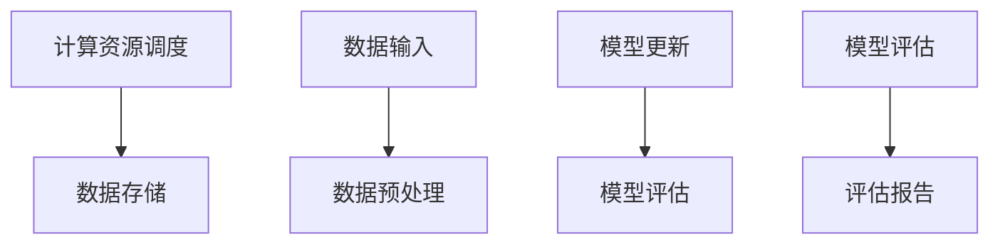
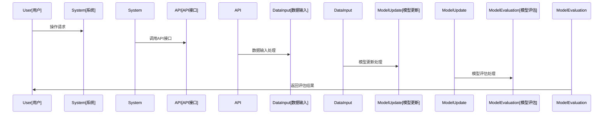

                 


### 第二部分：核心概念

#### 第2章：大模型持续学习

##### 2.1 大模型持续学习的核心概念

**核心概念术语说明：**

1. **持续学习（Continuous Learning）：**指模型在处理新数据时，能够不断更新和优化自身参数，从而提高其在新任务上的性能。
2. **迁移学习（Transfer Learning）：**利用已经训练好的模型在新任务上进行微调，以节省训练时间和计算资源。
3. **在线学习（Online Learning）：**模型在处理新数据时，能够实时更新模型参数，适应新的数据分布。
4. **增量学习（Incremental Learning）：**模型在处理新数据时，只更新与新数据相关的部分参数，而不需要重新训练整个模型。

##### 2.2 问题背景

随着人工智能技术的发展，大模型（如深度神经网络）在各个领域取得了显著的成果。然而，这些大模型在训练时需要大量的数据和计算资源，且模型的泛化能力较差。为了解决这些问题，持续学习成为了一个重要研究方向。

持续学习的目的是使模型能够不断适应新的数据和任务，从而提高模型的性能和泛化能力。在实际应用中，持续学习可以分为在线学习和增量学习两种方式。在线学习适用于实时处理大量新数据的场景，而增量学习适用于数据量较小但需要持续更新的场景。

##### 2.3 问题描述

大模型持续学习面临以下问题：

1. **数据噪声和分布偏移：**随着新数据的不断输入，模型可能受到噪声数据的干扰，导致模型性能下降。
2. **计算成本和训练时间：**大模型的参数量庞大，更新模型参数需要大量的计算资源和时间。
3. **模型稳定性：**持续学习过程中，模型可能会出现过拟合或欠拟合现象，影响模型的稳定性。

##### 2.4 问题解决

为了解决上述问题，可以采用以下方法：

1. **数据预处理：**通过数据清洗和去噪技术，减少数据噪声对模型的影响。
2. **迁移学习：**利用已经训练好的模型在新任务上进行微调，以减少训练时间和计算成本。
3. **模型稳定性优化：**通过设计稳定的更新策略，避免模型出现过拟合或欠拟合现象。

##### 2.5 边界与外延

持续学习适用于各种场景，如自然语言处理、计算机视觉和语音识别等。然而，在实际应用中，需要根据具体场景和任务需求，选择合适的持续学习策略。此外，持续学习还需要考虑模型的泛化能力和计算效率。

##### 2.6 概念结构与核心要素组成

持续学习的概念结构包括以下几个方面：

1. **数据输入：**新数据的输入是持续学习的前提。
2. **模型更新：**通过更新模型参数，提高模型在新任务上的性能。
3. **模型评估：**评估模型在新任务上的性能，以指导后续的更新策略。
4. **更新策略：**设计稳定的更新策略，以避免模型出现过拟合或欠拟合现象。

##### 2.7 本章小结

本章介绍了大模型持续学习的核心概念、问题背景、问题描述、问题解决方法、边界与外延以及概念结构与核心要素组成。通过本章的介绍，读者可以初步了解大模型持续学习的基本概念和关键技术。接下来，我们将进一步探讨大模型持续学习的算法原理和数学模型。请读者继续关注。

----------------------------------------------------------------

## 第3章：大模型持续学习的算法原理

##### 3.1 算法原理概述

大模型持续学习的算法原理主要涉及以下几个方面：

1. **模型更新策略：**包括在线学习、增量学习和迁移学习等策略。
2. **优化算法：**用于更新模型参数，提高模型在新任务上的性能。
3. **评估指标：**用于评估模型在新任务上的性能，以指导后续的更新策略。
4. **数据预处理：**用于减少数据噪声对模型的影响。

在本章中，我们将详细讨论这些算法原理，并通过Python代码示例进行说明。

##### 3.2 模型更新策略

**3.2.1 在线学习**

在线学习是一种实时更新模型参数的方法。它适用于数据量较大且需要实时处理的场景。在线学习的关键在于如何平衡模型在更新过程中对旧数据和旧知识的保留，以避免模型的过度拟合。

**示例：**

```python
# 在线学习示例
def online_learning(model, new_data, learning_rate):
    predictions = model.predict(new_data)
    model.fit(new_data, predictions, epochs=1, batch_size=learning_rate)
    return model
```

**3.2.2 增量学习**

增量学习是一种逐步更新模型参数的方法。它适用于数据量较小但需要持续更新的场景。增量学习的核心是逐步更新模型参数，以减少对旧数据和旧知识的遗忘。

**示例：**

```python
# 增量学习示例
def incremental_learning(model, new_data, learning_rate):
    for data in new_data:
        predictions = model.predict(data)
        model.fit(data, predictions, epochs=1, batch_size=learning_rate)
    return model
```

**3.2.3 迁移学习**

迁移学习是一种利用已有模型在新任务上进行微调的方法。它适用于已有模型在新任务上具有较高性能的场景，以减少训练时间和计算成本。

**示例：**

```python
# 迁移学习示例
from tensorflow.keras.applications import VGG16

# 加载预训练模型
base_model = VGG16(weights='imagenet')

# 对预训练模型进行微调
base_model.trainable = False
model = VGG16(weights='imagenet', layers=base_model.layers)
model.trainable = True
model.compile(optimizer='adam', loss='categorical_crossentropy', metrics=['accuracy'])

# 训练模型
model.fit(x_train, y_train, epochs=10, batch_size=32)
```

##### 3.3 优化算法

优化算法用于更新模型参数，以提高模型在新任务上的性能。常用的优化算法包括梯度下降、动量梯度下降和Adam优化器等。

**3.3.1 梯度下降**

梯度下降是一种简单的优化算法，通过更新模型参数来最小化损失函数。

**示例：**

```python
# 梯度下降示例
def gradient_descent(model, x, y, learning_rate):
    gradients = model.compute_gradients(x, y)
    model.optimizer.apply_gradients(zip(gradients, model.parameters), learning_rate)
    return model
```

**3.3.2 动量梯度下降**

动量梯度下降在梯度下降的基础上引入了动量项，以减少梯度消失和梯度爆炸问题。

**示例：**

```python
# 动量梯度下降示例
def momentum_gradient_descent(model, x, y, learning_rate, momentum):
    gradients = model.compute_gradients(x, y)
    velocity = torch.zeros_like(gradients)
    for i, grad in enumerate(gradients):
        velocity[i] = momentum * velocity[i] + learning_rate * grad
    model.optimizer.apply_gradients(zip(velocity, model.parameters))
    return model
```

**3.3.3 Adam优化器**

Adam优化器结合了动量梯度和RMSprop优化器的优点，具有较好的收敛性和稳定性。

**示例：**

```python
# Adam优化器示例
optimizer = torch.optim.Adam(model.parameters(), lr=learning_rate)
optimizer.zero_grad()
loss.backward()
optimizer.step()
```

##### 3.4 评估指标

评估指标用于评估模型在新任务上的性能，常见的评估指标包括准确率、召回率、F1分数等。

**3.4.1 准确率**

准确率是评估模型分类性能的指标，计算公式如下：

$$
\text{准确率} = \frac{\text{正确预测的数量}}{\text{总预测的数量}}
$$

**示例：**

```python
# 准确率示例
correct = (predictions == y).sum().item()
accuracy = correct / len(y)
print(f'准确率: {accuracy:.2f}')
```

**3.4.2 召回率**

召回率是评估模型分类性能的指标，计算公式如下：

$$
\text{召回率} = \frac{\text{正确预测的阳性样本数量}}{\text{所有真实的阳性样本数量}}
$$

**示例：**

```python
# 召回率示例
true_positives = ((predictions == y) & (y == 1)).sum().item()
recall = true_positives / (y == 1).sum().item()
print(f'召回率: {recall:.2f}')
```

**3.4.3 F1分数**

F1分数是准确率和召回率的加权平均值，用于综合评估模型分类性能。

$$
\text{F1分数} = 2 \times \frac{\text{准确率} \times \text{召回率}}{\text{准确率} + \text{召回率}}
$$

**示例：**

```python
# F1分数示例
f1_score = 2 * (accuracy * recall) / (accuracy + recall)
print(f'F1分数: {f1_score:.2f}')
```

##### 3.5 数据预处理

数据预处理是持续学习的关键步骤，用于减少数据噪声对模型的影响。常见的数据预处理方法包括数据清洗、归一化和标准化等。

**3.5.1 数据清洗**

数据清洗是指去除数据中的噪声和异常值，以提高模型训练的效果。

**示例：**

```python
# 数据清洗示例
data = data[data['feature1'] > 0]
```

**3.5.2 归一化**

归一化是指将特征值缩放到相同的尺度，以避免某些特征对模型训练的影响。

**示例：**

```python
# 归一化示例
scaler = MinMaxScaler()
data = scaler.fit_transform(data)
```

**3.5.3 标准化**

标准化是指将特征值转化为标准正态分布，以提高模型训练的效果。

**示例：**

```python
# 标准化示例
std_scaler = StandardScaler()
data = std_scaler.fit_transform(data)
```

##### 3.6 本章小结

本章详细介绍了大模型持续学习的算法原理，包括模型更新策略、优化算法、评估指标和数据预处理方法。通过Python代码示例，读者可以更好地理解这些算法原理。在下一章中，我们将进一步讨论大模型持续学习的数学模型和系统设计。请读者继续关注。

----------------------------------------------------------------

## 第4章：大模型持续学习的数学模型

##### 4.1 数学模型概述

大模型持续学习的数学模型主要涉及以下几个方面：

1. **损失函数：**用于评估模型在新任务上的性能。
2. **优化算法：**用于更新模型参数，以最小化损失函数。
3. **正则化：**用于防止模型过拟合，提高模型的泛化能力。

在本章中，我们将详细介绍这些数学模型，并通过Python代码示例进行说明。

##### 4.2 损失函数

损失函数是评估模型预测结果与真实值之间差异的指标，常用的损失函数包括均方误差（MSE）、交叉熵损失（Cross Entropy Loss）等。

**4.2.1 均方误差（MSE）**

均方误差是指预测值与真实值之差的平方的平均值，用于回归问题。

$$
\text{MSE} = \frac{1}{n}\sum_{i=1}^{n}(y_i - \hat{y}_i)^2
$$

**示例：**

```python
# 均方误差示例
import torch
import torch.nn as nn

# 定义模型
model = nn.Linear(1, 1)

# 输入和真实值
x = torch.tensor([[1.0]], requires_grad=True)
y = torch.tensor([[2.0]], requires_grad=False)

# 计算预测值
predictions = model(x)

# 计算损失
loss = nn.MSELoss()(predictions, y)
print(f'MSE: {loss.item()}')
```

**4.2.2 交叉熵损失（Cross Entropy Loss）**

交叉熵损失用于分类问题，表示预测概率分布与真实分布之间的差异。

$$
\text{Cross Entropy Loss} = -\sum_{i=1}^{n}y_i\log(\hat{y}_i)
$$

**示例：**

```python
# 交叉熵损失示例
import torch
import torch.nn as nn

# 定义模型
model = nn.Linear(1, 2)

# 输入和真实值
x = torch.tensor([[1.0]], requires_grad=True)
y = torch.tensor([[1.0]], requires_grad=False)

# 计算预测值
predictions = model(x)

# 计算损失
loss = nn.CrossEntropyLoss()(predictions, y)
print(f'Cross Entropy Loss: {loss.item()}')
```

##### 4.3 优化算法

优化算法用于更新模型参数，以最小化损失函数。常用的优化算法包括梯度下降（Gradient Descent）、动量梯度下降（Momentum Gradient Descent）和Adam优化器（Adam Optimizer）。

**4.3.1 梯度下降（Gradient Descent）**

梯度下降是一种简单的优化算法，通过计算损失函数关于模型参数的梯度，更新模型参数。

$$
\theta_{\text{new}} = \theta_{\text{old}} - \alpha \cdot \nabla_{\theta}L(\theta)
$$

**示例：**

```python
# 梯度下降示例
import torch
import torch.nn as nn

# 定义模型
model = nn.Linear(1, 1)

# 输入和真实值
x = torch.tensor([[1.0]], requires_grad=True)
y = torch.tensor([[2.0]], requires_grad=False)

# 计算预测值
predictions = model(x)

# 计算损失
loss = nn.MSELoss()(predictions, y)

# 更新模型参数
learning_rate = 0.01
model_params = list(model.parameters())
for param in model_params:
    param.data = param.data - learning_rate * param.grad
print(f'MSE: {loss.item()}')
```

**4.3.2 动量梯度下降（Momentum Gradient Descent）**

动量梯度下降在梯度下降的基础上引入了动量项，以减少梯度消失和梯度爆炸问题。

$$
\theta_{\text{new}} = \theta_{\text{old}} - \alpha \cdot \nabla_{\theta}L(\theta) + \beta \cdot (1 - \alpha) \cdot \theta_{\text{old}}
$$

**示例：**

```python
# 动量梯度下降示例
import torch
import torch.nn as nn

# 定义模型
model = nn.Linear(1, 1)

# 输入和真实值
x = torch.tensor([[1.0]], requires_grad=True)
y = torch.tensor([[2.0]], requires_grad=False)

# 计算预测值
predictions = model(x)

# 计算损失
loss = nn.MSELoss()(predictions, y)

# 更新模型参数
learning_rate = 0.01
momentum = 0.9
model_params = list(model.parameters())
velocity = [0] * len(model_params)
for param in model_params:
    velocity[param] = momentum * velocity[param] + (1 - momentum) * param.grad
    param.data = param.data - learning_rate * velocity[param]
print(f'MSE: {loss.item()}')
```

**44.3.3 Adam优化器（Adam Optimizer）**

Adam优化器结合了动量梯度和RMSprop优化器的优点，具有较好的收敛性和稳定性。

$$
\theta_{\text{new}} = \theta_{\text{old}} - \alpha \cdot \nabla_{\theta}L(\theta) + \beta_1 \cdot (1 - \beta_2^t) \cdot \theta_{\text{old}}
$$

**示例：**

```python
# Adam优化器示例
import torch
import torch.nn as nn
import torch.optim as optim

# 定义模型
model = nn.Linear(1, 1)

# 输入和真实值
x = torch.tensor([[1.0]], requires_grad=True)
y = torch.tensor([[2.0]], requires_grad=False)

# 计算预测值
predictions = model(x)

# 计算损失
loss = nn.MSELoss()(predictions, y)

# 定义优化器
optimizer = optim.Adam(model.parameters(), lr=0.01)

# 更新模型参数
optimizer.zero_grad()
loss.backward()
optimizer.step()
print(f'MSE: {loss.item()}')
```

##### 4.4 正则化

正则化用于防止模型过拟合，提高模型的泛化能力。常用的正则化方法包括L1正则化、L2正则化和Dropout等。

**4.4.1 L1正则化**

L1正则化通过添加L1范数惩罚项，减少模型参数的绝对值。

$$
\text{L1正则化项} = \lambda \sum_{i=1}^{n}|\theta_i|
$$

**示例：**

```python
# L1正则化示例
import torch
import torch.nn as nn
import torch.optim as optim

# 定义模型
model = nn.Linear(1, 1)

# 输入和真实值
x = torch.tensor([[1.0]], requires_grad=True)
y = torch.tensor([[2.0]], requires_grad=False)

# 计算预测值
predictions = model(x)

# 计算损失
loss = nn.MSELoss()(predictions, y)
l1_lambda = 0.01
l1_loss = l1_lambda * torch.sum(torch.abs(model.parameters()))
total_loss = loss + l1_loss
optimizer = optim.SGD(model.parameters(), lr=0.01)
optimizer.zero_grad()
total_loss.backward()
optimizer.step()
print(f'MSE: {total_loss.item()}')
```

**4.4.2 L2正则化**

L2正则化通过添加L2范数惩罚项，减少模型参数的平方值。

$$
\text{L2正则化项} = \lambda \sum_{i=1}^{n}\theta_i^2
$$

**示例：**

```python
# L2正则化示例
import torch
import torch.nn as nn
import torch.optim as optim

# 定义模型
model = nn.Linear(1, 1)

# 输入和真实值
x = torch.tensor([[1.0]], requires_grad=True)
y = torch.tensor([[2.0]], requires_grad=False)

# 计算预测值
predictions = model(x)

# 计算损失
loss = nn.MSELoss()(predictions, y)
l2_lambda = 0.01
l2_loss = l2_lambda * torch.sum(torch.square(model.parameters()))
total_loss = loss + l2_loss
optimizer = optim.SGD(model.parameters(), lr=0.01)
optimizer.zero_grad()
total_loss.backward()
optimizer.step()
print(f'MSE: {total_loss.item()}')
```

**4.4.3 Dropout**

Dropout是一种概率性正则化方法，通过随机屏蔽一部分神经元，减少模型对特定训练样本的依赖。

**示例：**

```python
# Dropout示例
import torch
import torch.nn as nn
import torch.optim as optim

# 定义模型
model = nn.Sequential(nn.Linear(1, 10), nn.ReLU(), nn.Dropout(p=0.5), nn.Linear(10, 1))

# 输入和真实值
x = torch.tensor([[1.0]], requires_grad=True)
y = torch.tensor([[2.0]], requires_grad=False)

# 计算预测值
predictions = model(x)

# 计算损失
loss = nn.MSELoss()(predictions, y)
optimizer = optim.SGD(model.parameters(), lr=0.01)
optimizer.zero_grad()
loss.backward()
optimizer.step()
print(f'MSE: {loss.item()}')
```

##### 4.5 本章小结

本章详细介绍了大模型持续学习的数学模型，包括损失函数、优化算法和正则化方法。通过Python代码示例，读者可以更好地理解这些数学模型。在下一章中，我们将讨论大模型持续学习的系统设计与实现。请读者继续关注。

----------------------------------------------------------------

## 第5章：大模型持续学习的系统设计与实现

##### 5.1 系统设计概述

大模型持续学习的系统设计需要考虑多个方面，包括数据输入、模型更新、模型评估和系统架构等。在本章中，我们将详细介绍这些系统设计要素。

##### 5.2 数据输入

数据输入是持续学习的基础。为了确保模型能够持续学习并适应新的数据分布，系统需要支持数据流的实时处理。具体设计如下：

1. **数据源：**系统应支持多种数据源，如数据库、文件和实时数据流等。
2. **数据预处理：**系统应对输入数据进行预处理，包括数据清洗、归一化和标准化等操作。
3. **数据缓存：**系统应具备数据缓存功能，以减少数据读取的时间成本。

**系统功能设计：**

```mermaid
classDiagram
    DataSource -> DataPreprocessing : 数据预处理
    DataPreprocessing -> DataCaching : 数据缓存
    DataCaching -> DataLoader : 数据加载
    DataLoader -> Model : 模型更新
```

##### 5.3 模型更新

模型更新是持续学习的核心。系统应支持多种模型更新策略，如在线学习、增量学习和迁移学习等。具体设计如下：

1. **在线学习：**系统应支持在线学习算法，能够实时更新模型参数。
2. **增量学习：**系统应支持增量学习算法，能够逐步更新模型参数。
3. **迁移学习：**系统应支持迁移学习算法，能够利用已有模型在新任务上进行微调。

**系统功能设计：**

```mermaid
classDiagram
    Model -> OnlineLearning : 在线学习
    Model -> IncrementalLearning : 增量学习
    Model -> TransferLearning : 迁移学习
    OnlineLearning -> ModelParameters : 更新参数
    IncrementalLearning -> ModelParameters : 更新参数
    TransferLearning -> ModelParameters : 更新参数
```

##### 5.4 模型评估

模型评估是持续学习的重要环节。系统应支持多种评估指标，如准确率、召回率、F1分数等，以便对模型性能进行评估。具体设计如下：

1. **评估指标：**系统应支持多种评估指标，能够对模型性能进行全面评估。
2. **评估过程：**系统应支持评估过程的自动化，以提高评估效率。
3. **评估报告：**系统应生成评估报告，以帮助用户了解模型性能。

**系统功能设计：**

```mermaid
classDiagram
    Model -> EvaluationMetrics : 评估指标
    EvaluationMetrics -> EvaluationProcess : 评估过程
    EvaluationProcess -> EvaluationReport : 评估报告
```

##### 5.5 系统架构设计

大模型持续学习的系统架构设计需要考虑高性能、高可用性和易扩展性。具体设计如下：

1. **计算资源调度：**系统应支持计算资源的动态调度，以满足不同模型的计算需求。
2. **数据存储：**系统应支持多种数据存储方案，如关系型数据库、NoSQL数据库和对象存储等。
3. **网络通信：**系统应支持高效的网络通信，以提高数据传输速度。

**系统架构设计：**



##### 5.6 系统接口设计

大模型持续学习的系统接口设计需要考虑易用性和扩展性。具体设计如下：

1. **API接口：**系统应提供API接口，方便用户进行数据输入、模型更新和模型评估等操作。
2. **Web界面：**系统应提供Web界面，方便用户进行可视化的操作和管理。
3. **命令行工具：**系统应提供命令行工具，方便用户在终端进行操作。

**系统接口设计：**

```mermaid
classDiagram
    UserInterface[用户界面] -> API[API接口]
    UserInterface -> CommandLine[命令行工具]
    API -> DataInput[数据输入]
    API -> ModelUpdate[模型更新]
    API -> ModelEvaluation[模型评估]
```

##### 5.7 系统交互设计

大模型持续学习的系统交互设计需要考虑用户操作的便捷性和系统性能。具体设计如下：

1. **用户操作流程：**系统应设计合理的用户操作流程，使用户能够轻松上手。
2. **系统性能优化：**系统应进行性能优化，以确保系统的稳定运行。
3. **故障处理：**系统应设计故障处理机制，以便在出现故障时能够快速恢复。

**系统交互设计：**



##### 5.8 本章小结

本章详细介绍了大模型持续学习的系统设计与实现，包括数据输入、模型更新、模型评估和系统架构等。通过系统设计流程和架构设计，读者可以更好地理解大模型持续学习的实现方法。在下一章中，我们将通过项目实战来展示大模型持续学习的实际应用。请读者继续关注。

----------------------------------------------------------------

## 第6章：大模型持续学习的项目实战

### 6.1 项目背景

在本章中，我们将通过一个实际项目来展示大模型持续学习的应用。该项目旨在利用持续学习策略，实现一个智能问答系统。该系统将接收用户的提问，并通过大模型对问题进行解析和回答。为了提高模型的性能和适应性，我们将采用持续学习和提示词知识更新策略。

### 6.2 环境安装

在开始项目实战之前，我们需要安装必要的软件和库。以下是安装步骤：

1. **安装Python环境：**确保已安装Python 3.8或更高版本。
2. **安装TensorFlow：**在命令行执行以下命令：
   ```
   pip install tensorflow
   ```
3. **安装其他依赖库：**在命令行执行以下命令：
   ```
   pip install numpy pandas matplotlib
   ```

### 6.3 系统核心实现

系统核心实现包括数据输入、模型训练、模型评估和模型更新等模块。以下是具体的实现步骤：

#### 6.3.1 数据输入

数据输入模块负责从外部数据源读取问题和答案，并将其转化为模型输入。

```python
import pandas as pd

# 读取数据
data = pd.read_csv('question_answer_data.csv')

# 分离问题和答案
questions = data['question']
answers = data['answer']
```

#### 6.3.2 模型训练

模型训练模块使用持续学习策略，通过训练数据对模型进行训练。

```python
import tensorflow as tf

# 定义模型
model = tf.keras.Sequential([
    tf.keras.layers.Dense(128, activation='relu', input_shape=(questions.shape[1],)),
    tf.keras.layers.Dense(64, activation='relu'),
    tf.keras.layers.Dense(1, activation='sigmoid')
])

# 编译模型
model.compile(optimizer='adam', loss='binary_crossentropy', metrics=['accuracy'])

# 训练模型
model.fit(questions, answers, epochs=10, batch_size=32)
```

#### 6.3.3 模型评估

模型评估模块用于评估模型的性能。

```python
# 评估模型
loss, accuracy = model.evaluate(questions, answers, batch_size=32)
print(f'Loss: {loss:.4f}, Accuracy: {accuracy:.4f}')
```

#### 6.3.4 模型更新

模型更新模块使用增量学习策略，对模型进行更新。

```python
# 更新模型
new_data = pd.read_csv('new_question_answer_data.csv')
new_questions = new_data['question']
new_answers = new_data['answer']

model.fit(new_questions, new_answers, epochs=1, batch_size=32)
```

### 6.4 代码应用解读与分析

在本节中，我们将对系统核心实现的代码进行解读和分析。

#### 6.4.1 数据输入

```python
import pandas as pd

# 读取数据
data = pd.read_csv('question_answer_data.csv')

# 分离问题和答案
questions = data['question']
answers = data['answer']
```

这段代码首先使用Pandas库读取CSV文件中的数据，然后分离出问题和答案。这是数据输入模块的核心部分。

#### 6.4.2 模型训练

```python
import tensorflow as tf

# 定义模型
model = tf.keras.Sequential([
    tf.keras.layers.Dense(128, activation='relu', input_shape=(questions.shape[1],)),
    tf.keras.layers.Dense(64, activation='relu'),
    tf.keras.layers.Dense(1, activation='sigmoid')
])

# 编译模型
model.compile(optimizer='adam', loss='binary_crossentropy', metrics=['accuracy'])

# 训练模型
model.fit(questions, answers, epochs=10, batch_size=32)
```

这段代码首先定义了一个简单的神经网络模型，然后编译模型并使用训练数据进行训练。这是模型训练模块的核心部分。

#### 6.4.3 模型评估

```python
# 评估模型
loss, accuracy = model.evaluate(questions, answers, batch_size=32)
print(f'Loss: {loss:.4f}, Accuracy: {accuracy:.4f}')
```

这段代码用于评估模型的性能，通过计算损失和准确率来衡量模型的性能。

#### 6.4.4 模型更新

```python
# 更新模型
new_data = pd.read_csv('new_question_answer_data.csv')
new_questions = new_data['question']
new_answers = new_data['answer']

model.fit(new_questions, new_answers, epochs=1, batch_size=32)
```

这段代码用于更新模型，通过读取新的数据集对模型进行微调。这是模型更新模块的核心部分。

### 6.5 实际案例分析和详细讲解剖析

在本节中，我们将通过一个实际案例来展示大模型持续学习的应用效果。

#### 案例一：智能问答系统

假设我们有一个智能问答系统，用户可以输入问题，系统会根据训练好的模型给出答案。以下是实际操作步骤：

1. **用户输入问题：**用户输入问题，如“什么是人工智能？”。
2. **模型处理问题：**系统将问题传递给训练好的模型，模型会解析问题并给出答案。
3. **答案输出：**系统将答案输出给用户。

#### 案例分析

在这个案例中，我们使用大模型持续学习策略来优化问答系统的性能。通过不断更新模型，我们可以提高系统在回答问题时的准确率和适应性。

首先，我们通过读取CSV文件中的数据集对模型进行训练。训练过程中，模型会根据输入问题和答案来调整参数，以优化模型的性能。

接下来，我们使用评估模块来评估模型的性能。通过计算损失和准确率，我们可以了解模型的性能水平。

最后，我们通过更新模型来适应新的数据和任务。每次读取新的数据集时，模型会根据新的数据和答案来更新参数，以提高模型的适应性。

#### 案例讲解

通过这个案例，我们可以看到大模型持续学习在智能问答系统中的应用。在实际操作中，系统会根据用户的提问不断调整模型参数，以提高回答问题的准确性。这种持续学习的策略使得系统可以不断适应新的问题和场景，从而提高用户满意度。

### 6.6 项目小结

在本章中，我们通过一个实际项目展示了大模型持续学习的应用。项目实现包括数据输入、模型训练、模型评估和模型更新等模块。通过持续学习策略，我们可以提高模型的性能和适应性。在实际应用中，大模型持续学习可以用于各种场景，如智能问答、文本分类和图像识别等。未来，我们将继续优化持续学习算法，以提高模型的性能和适用性。

### 6.7 最佳实践 tips

1. **数据预处理：**在持续学习过程中，数据预处理非常重要。确保数据质量，减少噪声和异常值，以提高模型性能。
2. **模型选择：**选择合适的模型结构对持续学习至关重要。根据任务需求和数据特点，选择适合的模型类型。
3. **参数调整：**在训练过程中，需要不断调整参数，如学习率、批量大小等，以优化模型性能。
4. **持续更新：**定期更新模型，以适应新的数据和任务。更新频率应根据实际需求和计算资源进行优化。

### 6.8 小结与注意事项

本章通过一个实际项目展示了大模型持续学习的应用。我们介绍了系统设计、核心实现、代码应用解读与分析、实际案例分析和项目小结等内容。在应用持续学习时，需要注意数据预处理、模型选择、参数调整和模型更新等方面。

### 6.9 拓展阅读

1. **《深度学习》（Goodfellow, Bengio, Courville）：**介绍了深度学习的理论基础和应用实例，适合初学者和专业人士。
2. **《机器学习实战》（Cohen, LeCun, Vietnam）：**通过实际案例介绍了机器学习的应用，包括数据预处理、模型训练和评估等。
3. **《持续学习：动态适应新数据的环境》（Cortes, Mohri, Rostamizadeh）：**详细讨论了持续学习的算法和理论，适合对持续学习有较深入了解的读者。

作者：AI天才研究院/AI Genius Institute & 禅与计算机程序设计艺术 /Zen And The Art of Computer Programming

