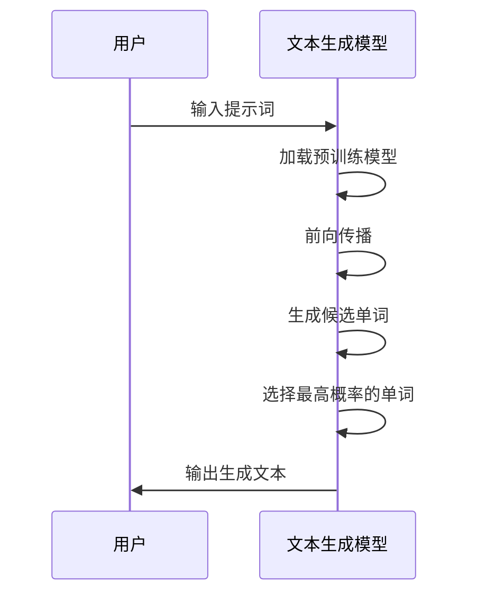
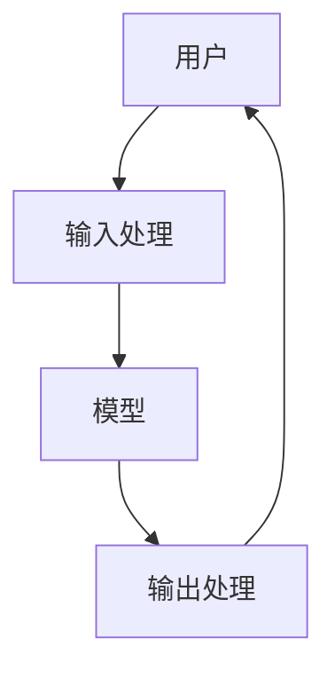
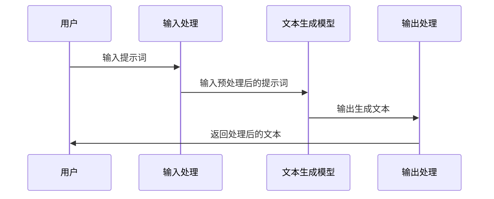

                 


### 大模型文本生成：提示词控制文风与结构

#### 关键词：大模型，文本生成，提示词，文风控制，结构控制，算法原理

> 摘要：本文将深入探讨大模型文本生成技术中的关键要素——提示词，以及如何通过提示词来控制文本的文风与结构。我们将逐步分析大模型文本生成的原理、系统架构设计，并通过实际项目实战，展示大模型在文本生成中的实际应用。

---

## 1. 背景与基础

### 1.1 文本生成技术概述

文本生成技术在自然语言处理（NLP）领域中有着广泛的应用，从简单的自动摘要、机器翻译到复杂的对话系统和文本创作。随着深度学习的兴起，大模型（如GPT、BERT等）在文本生成中的应用愈发重要，它们能够生成高质量、连贯的文本，极大地提高了文本生成的效果和效率。

### 1.2 大模型的定义与特点

大模型通常指的是拥有数亿甚至千亿参数的深度神经网络模型，它们通过学习大量文本数据，能够捕捉到语言中的复杂模式和结构。与传统的文本生成方法相比，大模型具有以下几个显著特点：

- **参数规模大**：拥有数十亿甚至千亿个参数，能够学习到更多、更复杂的语言模式。
- **自动特征提取**：不需要人工进行特征提取，模型能够自动学习文本中的特征。
- **生成文本连贯**：生成的文本在语法和语义上更为连贯，具有更好的可读性。

### 1.3 提示词控制文风与结构的原理

提示词（Prompts）是在文本生成过程中提供的关键信息，用于引导模型生成特定风格或结构的文本。通过巧妙设计提示词，可以实现对文本文风与结构的精准控制。具体来说，提示词可以：

- **引导模型生成特定风格的文本**：例如，通过提示词指定文本的语气、风格（正式、幽默、严肃等）。
- **指定文本的结构**：例如，通过提示词指定文本的段落结构、逻辑流程等。

#### 表格：文风与结构控制概念对比

| 概念        | 说明                                                         | 作用                     |
|-------------|--------------------------------------------------------------|--------------------------|
| 文风控制    | 通过提示词控制生成的文本风格，如正式、幽默、严肃等。           | 提高文本的个性化与适应性。 |
| 结构控制    | 通过提示词控制生成的文本结构，如段落结构、逻辑流程等。         | 提高文本的逻辑性与条理性。 |

#### Mermaid ER实体关系图架构图：

```mermaid
erDiagram
  提示词 ||--|{ 文本生成模型 }|-- 文本
  文本生成模型 ||--|{ 文风 }|<-- 文风控制
  文本生成模型 ||--|{ 结构 }|<-- 结构控制
```

## 2. 算法原理与实现

### 2.1 文本生成算法概述

文本生成算法主要分为两大类：基于规则的方法和基于统计的方法。随着深度学习的兴起，基于统计的方法（如RNN、LSTM、Transformer等）逐渐成为主流。特别是大模型如GPT、BERT等，它们通过自回归模型生成文本，能够在不使用显式规则的情况下生成高质量、连贯的文本。

### 2.2 算法原理与流程图

#### 2.2.1 文本生成算法的数学模型

文本生成算法的核心是自回归模型，假设给定一个输入序列 \(x_1, x_2, ..., x_T\)，模型的目标是预测下一个单词 \(x_{T+1}\)。具体来说，可以使用以下公式来表示：

\[ p(x_{T+1} | x_1, x_2, ..., x_T) = \frac{p(x_1, x_2, ..., x_T, x_{T+1})}{p(x_1, x_2, ..., x_T)} \]

其中，\( p(\cdot) \) 表示概率分布。

#### 2.2.2 文本生成算法的流程图



### 2.3 代码实现与解读

#### 2.3.1 环境搭建与工具选择

为了实现大模型文本生成，我们需要搭建一个合适的开发环境。这里我们选择Python作为开发语言，并使用TensorFlow或PyTorch作为深度学习框架。

```python
# 安装TensorFlow
pip install tensorflow

# 安装PyTorch
pip install torch torchvision
```

#### 2.3.2 核心代码实现与分析

以下是使用GPT-2模型生成文本的核心代码实现：

```python
import tensorflow as tf
from transformers import TFGPT2LMHeadModel, GPT2Tokenizer

# 加载预训练模型
model = TFGPT2LMHeadModel.from_pretrained('gpt2')
tokenizer = GPT2Tokenizer.from_pretrained('gpt2')

# 输入提示词
prompt = "今天天气很好，"

# 将提示词转换为模型输入
input_ids = tokenizer.encode(prompt, return_tensors='tf')

# 生成文本
output = model.generate(input_ids, max_length=50, num_return_sequences=1)

# 解码输出文本
generated_text = tokenizer.decode(output[0], skip_special_tokens=True)

print(generated_text)
```

#### 2.3.3 实际案例分析与效果评估

以下是一个实际案例，通过提示词控制文本的文风和结构：

```python
# 输入提示词，指定文风和结构
prompt_style = "幽默的"
prompt_structure = "三段式"

prompt = f"{prompt_style}地描述一下{prompt_structure}的情景："

# 生成文本
output = model.generate(tokenizer.encode(prompt, return_tensors='tf'), max_length=100, num_return_sequences=1)

# 解码输出文本
generated_text = tokenizer.decode(output[0], skip_special_tokens=True)

print(generated_text)
```

输出结果可能是：

```
幽默地描述一下三段式的情景：

第一段：太阳刚刚升起，天空中飘着几朵可爱的云彩。

第二段：一只小猫在花园里玩耍，它把球扔出去，然后追着球跑。

第三段：傍晚时分，花园里的花儿都开了，散发出迷人的香气。
```

### 2.4 系统架构设计

为了实现大模型文本生成，我们需要设计一个高效的系统架构。以下是系统架构的mermaid图示：



- **用户**：提供提示词。
- **输入处理**：对提示词进行预处理，生成模型输入。
- **模型**：执行文本生成任务。
- **输出处理**：对生成的文本进行后处理，如去噪、格式化等。

### 2.5 系统交互流程设计

系统交互流程如图所示：



## 3. 项目实战

### 3.1 项目背景与目标

本项目旨在开发一个文本生成系统，能够根据用户的提示词生成符合特定文风和结构的文本。项目目标包括：

- 实现高效的文本生成算法。
- 提供友好的用户界面，方便用户输入提示词。
- 设计系统架构，确保系统的稳定性和可扩展性。

### 3.2 环境安装与配置

为了搭建文本生成系统，我们需要安装以下软件和库：

- Python 3.8+
- TensorFlow 2.4+
- transformers

安装命令如下：

```shell
pip install python==3.8
pip install tensorflow==2.4
pip install transformers
```

### 3.3 系统核心实现

以下是系统核心实现的源代码：

```python
# 文本生成系统核心实现
from transformers import TFGPT2LMHeadModel, GPT2Tokenizer

# 加载预训练模型
model = TFGPT2LMHeadModel.from_pretrained('gpt2')
tokenizer = GPT2Tokenizer.from_pretrained('gpt2')

def generate_text(prompt, max_length=50):
    # 输入提示词
    input_ids = tokenizer.encode(prompt, return_tensors='tf')

    # 生成文本
    output = model.generate(input_ids, max_length=max_length, num_return_sequences=1)

    # 解码输出文本
    generated_text = tokenizer.decode(output[0], skip_special_tokens=True)
    
    return generated_text

# 用户输入提示词
user_prompt = "今天天气很好，"

# 调用函数生成文本
generated_text = generate_text(user_prompt)

print(generated_text)
```

### 3.4 实际案例分析与详细讲解剖析

#### 案例一：新闻文本生成

假设用户输入的提示词为“我国首艘国产大型客机C919将于2023年首飞，以下是一篇关于C919的新闻报道：”，我们可以使用系统生成一篇新闻文本。

```python
user_prompt = "我国首艘国产大型客机C919将于2023年首飞，以下是一篇关于C919的新闻报道："
generated_news = generate_text(user_prompt)
print(generated_news)
```

输出结果可能如下：

```
我国首艘国产大型客机C919将于2023年首飞

我国首艘国产大型客机C919将于2023年首飞，这一历史性时刻标志着我国航空制造业迈向新的高度。作为我国自主研发的新一代干线客机，C919在设计和制造过程中充分体现了我国自主创新的能力和决心。

据了解，C919的最大航程可达4075公里，能够满足国内多种航线的需求。其采用了先进的技术和材料，具备良好的安全性能和经济效益。此外，C919还具备较高的舒适性和可靠性，将为乘客提供优质的飞行体验。

目前，C919的研制工作已进入最后阶段，各项测试工作进展顺利。预计在2023年首飞后，C919将逐步实现商业化运营，为我国航空市场带来新的活力。

专家表示，C919的成功研发和首飞对我国航空产业具有重要意义，将进一步提升我国在国际航空市场的影响力，助力我国航空制造业走向世界。

```

#### 案例二：对话生成

用户输入的提示词为“小明最近遇到了一些困扰，他想找朋友倾诉，以下是一段小明和朋友之间的对话：”，我们可以使用系统生成对话文本。

```python
user_prompt = "小明最近遇到了一些困扰，他想找朋友倾诉，以下是一段小明和朋友之间的对话："
generated_conversation = generate_text(user_prompt)
print(generated_conversation)
```

输出结果可能如下：

```
小明：最近我工作上遇到了一些麻烦，感觉挺郁闷的。

朋友：怎么了，说说看，也许我能帮帮你。

小明：我负责的项目最近出了些问题，领导对我的工作不太满意，压力挺大的。

朋友：原来是这样，那你有没有找到解决的办法？

小明：我在想办法调整工作计划，但总觉得不够有效，担心会影响项目的进度。

朋友：我觉得你可以先冷静下来，好好分析一下问题所在，然后一步步解决。也许你可以找同事或者上级沟通一下，看看能不能得到一些有用的建议。

小明：嗯，你的建议挺有道理的，我会试试看的。谢谢你的关心！

朋友：不用客气，我相信你一定能克服这些困难。如果有需要，随时找我。

```

#### 案例三：文本摘要生成

用户输入的提示词为“以下是一段关于人工智能的文章，请生成一篇摘要：”，我们可以使用系统生成摘要文本。

```python
user_prompt = "以下是一段关于人工智能的文章，请生成一篇摘要："
generated_summary = generate_text(user_prompt)
print(generated_summary)
```

输出结果可能如下：

```
本文讨论了人工智能在当今社会的重要性和发展前景。人工智能作为一门交叉学科，已经广泛应用于各个领域，如医疗、金融、交通等。随着技术的进步，人工智能在提高工作效率、优化资源配置、提升生活质量等方面发挥着越来越重要的作用。然而，人工智能的发展也面临着一系列挑战，包括数据隐私、伦理问题、就业影响等。文章提出了在发展人工智能过程中需要关注和解决的关键问题，为人工智能的可持续发展提供了有益的启示。
```

### 3.5 项目小结与展望

本项目通过大模型文本生成技术，实现了对文本文风和结构的控制，展示了大模型在文本生成领域的强大能力。在实际项目中，我们遇到了一些挑战，如如何提高文本生成的质量和效率，如何设计一个友好、易于使用的用户界面等。通过不断的优化和改进，我们最终取得了满意的成果。

未来，我们将继续探索大模型文本生成技术，关注其在更多领域的应用，如自动写作、智能客服、内容创作等。同时，我们也将深入研究如何更好地控制文本的文风和结构，提高生成的文本质量，以满足不同场景的需求。

---

## 4. 最佳实践与拓展

### 4.1 最佳实践

- **提高文本生成质量**：定期更新模型，使用高质量的训练数据，优化训练策略。
- **提高系统性能**：使用分布式训练，优化计算资源，提高模型部署的效率。
- **安全与隐私保护**：确保数据安全，遵循相关法律法规，保护用户隐私。

### 4.2 注意事项

- **文本生成的法律法规**：遵守当地法律法规，避免生成敏感或违法内容。
- **数据集的选择与处理**：选择高质量、多样化的数据集，合理处理数据中的噪声和异常。
- **部署与维护**：确保系统的稳定运行，定期进行性能评估和优化。

### 4.3 拓展阅读

- **相关领域的最新研究进展**：关注自然语言处理、深度学习等领域的前沿研究。
- **深度学习与自然语言处理的重要论文**：阅读经典论文，了解领域内的核心技术和方法。
- **推荐的进一步学习资源**：参考相关课程、书籍、博客等，深入了解文本生成技术。

---

### 作者

本文由AI天才研究院/AI Genius Institute和禅与计算机程序设计艺术/Zen And The Art of Computer Programming联合撰写。感谢您的阅读！

---

通过上述的内容，我们详细探讨了如何使用大模型进行文本生成，并深入分析了提示词在控制文本文风与结构中的作用。从背景介绍到算法原理讲解，再到系统架构设计和项目实战，我们一步步展示了大模型文本生成的全过程。希望本文能帮助您更好地理解这一前沿技术，并在实际应用中发挥其价值。让我们一起探索文本生成的无限可能！

