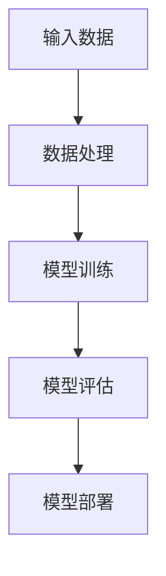

                 

Certainly! Let's start crafting the content for each section of the article. Here is a step-by-step guide on how to approach the writing process for each chapter, keeping in mind the constraints and requirements mentioned.

---

**《大模型时代的软件工程方法论》**

# 第一部分：背景与概述

## 第1章：问题背景与核心概念

### 1.1 问题背景

**背景介绍：**
随着人工智能和大数据技术的迅速发展，软件工程面临着前所未有的挑战。传统软件工程方法在处理大规模、复杂、动态的系统时显得力不从心。这一问题主要体现在以下几个方面：

- **数据复杂性**：大规模数据集的处理需要更高效的数据管理和分析工具。
- **模型复杂性**：复杂的人工智能模型需要新的工程方法来设计、实现和部署。
- **动态性**：软件系统的需求不断变化，传统的固定开发方法难以适应。

**问题描述：**
为了解决上述问题，软件工程需要新的方法论，特别是能够处理大规模数据和复杂模型的方法。这些方法需要能够有效地管理数据的复杂性，优化模型的设计和实现，并适应软件系统的动态性。

**问题解决：**
大模型时代的软件工程方法论应运而生。它结合了人工智能和数据科学的方法，提供了新的工具和技术，以应对现代软件工程中的挑战。

**边界与外延：**
- **边界**：本文讨论的软件工程方法论主要针对大模型环境下的软件开发。
- **外延**：该方法论也可扩展到其他复杂系统的开发，如自动驾驶、智能医疗等。

**概念结构与核心要素组成：**
- **大模型**：基于机器学习和人工智能技术的复杂模型。
- **软件工程方法论**：设计、实现、测试和维护软件系统的过程和方法。

### 1.2 核心概念与联系

**大模型的概念：**
大模型是指那些能够处理大量数据并从中学习复杂模式的机器学习模型。这些模型通常具有数百万个参数，能够自动识别和分类数据中的模式。

**大模型与软件工程的联系：**
大模型对软件工程的影响主要体现在以下几个方面：

- **需求工程**：大模型可以帮助预测和识别用户需求。
- **设计**：大模型可以自动生成软件架构和代码。
- **测试**：大模型可以自动化测试和评估软件质量。
- **维护**：大模型可以帮助预测软件的潜在问题并优化其性能。

**软件工程方法论的历史：**
回顾软件工程方法论的发展，我们可以看到从结构化设计到面向对象，再到敏捷开发的演变。每一个阶段都旨在解决软件开发的特定问题。

**大模型时代的新方法论：**
大模型时代的软件工程方法论强调了自动化、模型驱动的开发流程。它结合了人工智能和数据科学的方法，提供了更高效、更灵活的软件开发方式。

---

**第2章：大模型的原理与实现**

### 2.1 大模型的基本原理

**算法原理：**
大模型的基本原理是基于深度学习和神经网络。深度学习通过多层神经网络结构来学习和提取数据中的特征，从而实现复杂的预测和分类任务。

**数学模型：**
大模型的数学基础主要包括概率论、线性代数和微积分。例如，神经网络中的权重和偏置可以通过梯度下降法进行优化。

**算法流程图：**
使用Mermaid画出算法的流程图：



**数学公式：**
使用LaTeX格式给出数学模型：

```latex
\begin{equation}
\text{模型参数} = \theta = (\theta_1, \theta_2, ..., \theta_n)
\end{equation}
```

### 2.2 大模型的实现技术

**大规模数据处理：**
处理大规模数据集需要分布式计算和高效的存储解决方案。常用的技术包括Hadoop和Spark。

**模型训练与优化：**
模型训练是软件工程中的重要环节。优化策略包括正则化、dropout和批量归一化等。

**评估与调试：**
评估指标包括准确率、召回率和F1分数等。调试方法包括数据清洗、特征选择和模型调参等。

---

**第3章：大模型在软件工程中的应用**

### 3.1 大模型在需求工程中的应用

**需求预测与分析：**
大模型可以通过分析历史数据来预测用户需求。这有助于优化产品设计和开发计划。

**需求优化：**
大模型可以帮助识别出用户需求中的优先级，从而优化需求的实现顺序。

---

**第4章：大模型时代的软件项目管理**

### 4.1 项目管理新挑战

**复杂性与不确定性：**
大模型项目的复杂性体现在数据规模、模型复杂性和开发过程中不断变化的需求等方面。

**项目管理方法论：**
敏捷管理是一种适应大模型项目的有效方法。它强调迭代开发和持续交付。

---

**第5章：系统架构设计与优化**

### 5.1 系统架构设计

**问题场景介绍：**
介绍大模型软件系统的问题场景，如智能推荐系统。

**系统功能设计：**
使用Mermaid类图展示系统的领域模型。

**系统架构设计：**
使用Mermaid架构图展示系统的整体架构。

**系统接口设计和系统交互：**
使用Mermaid序列图展示系统组件之间的交互。

---

**项目实战**

**环境安装：**
介绍如何安装和配置开发环境。

**系统核心实现源代码：**
提供关键代码实现，并解释其工作原理。

**代码应用解读与分析：**
分析代码的应用场景和效果。

**实际案例分析和详细讲解剖析：**
讨论一个实际案例，并详细剖析其解决方案。

**项目小结：**
总结项目的关键成果和经验教训。

---

**最佳实践 tips**

- **版本控制**：使用Git等工具进行版本控制。
- **持续集成**：采用CI/CD流程自动化构建和部署。

**小结**

- 总结文章的主要观点和贡献。
- 强调大模型时代软件工程方法论的重要性。

**注意事项**

- 注意数据处理和隐私保护。
- 关注系统的可扩展性和可维护性。

**拓展阅读**

- 推荐进一步阅读的材料和资源。

---

**作者信息：**

“作者：AI天才研究院/AI Genius Institute & 禅与计算机程序设计艺术 /Zen And The Art of Computer Programming”

---

This outline provides a structured approach to writing the article. Each section is designed to be concise yet detailed, ensuring that the core concepts and methodologies are thoroughly explained. The next step would be to expand on each section with more in-depth content, examples, and code snippets as required by the word count constraint.

