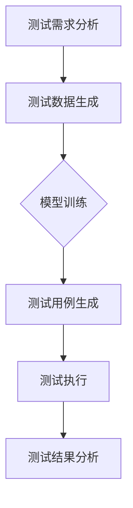
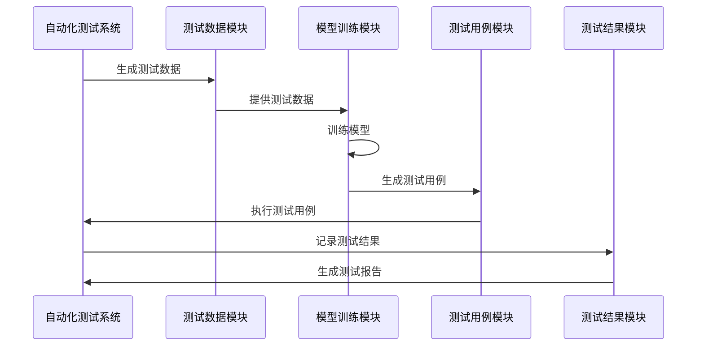
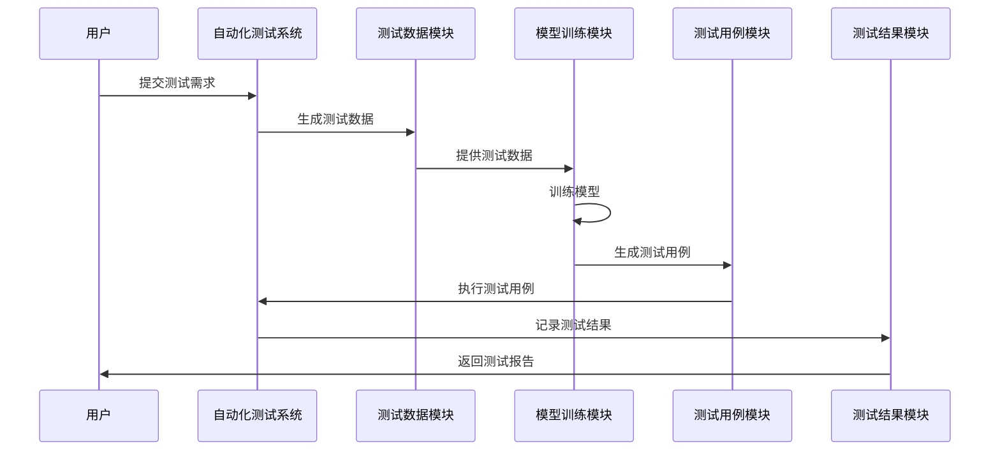

                 


# 大模型时代的软件测试自动化

关键词：大模型、软件测试、自动化测试、机器学习、深度学习、AI

摘要：
随着人工智能技术的飞速发展，大模型如深度学习模型在软件工程中越来越受欢迎。本文将探讨在大模型时代，如何进行软件测试自动化，以及相关的技术原理和实践方法。我们将逐步分析大模型在软件测试中的应用，并探讨自动化测试工具和算法，为开发人员提供有价值的参考。

## 1. 背景介绍

### 1.1 大模型时代的来临

**核心概念术语说明：**  
- **大模型（Large Models）**：指参数量巨大的机器学习模型，如深度神经网络。
- **软件测试（Software Testing）**：确保软件质量的一系列活动，包括验证、确认、调试等。

**问题背景：**  
随着软件复杂度的增加，传统的软件测试方法越来越难以应对，大模型的兴起为软件测试带来了新的挑战和机遇。

**问题描述：**  
如何在大模型时代，更高效地进行软件测试，确保软件质量？

**问题解决：**  
自动化测试为大模型时代的软件测试提供了新的解决方案，通过结合大模型的能力，我们可以实现更智能、更高效的测试过程。

**边界与外延：**  
- 软件测试的自动化不仅仅是大模型的应用，还包括测试工具、测试流程的自动化。
- 大模型的测试需要考虑模型的可靠性和泛化能力。

**概念结构与核心要素组成：**  
- **核心概念结构**：大模型、软件测试、自动化测试。
- **核心要素组成**：测试需求分析、测试用例设计、测试执行、测试结果分析。

## 2. 核心概念与联系

### 2.1 大模型与软件测试的关系

**核心概念原理：**  
大模型在软件测试中的应用主要体现在以下几个方面：
- **测试数据生成**：大模型可以生成更真实的测试数据，提高测试用例的有效性。
- **缺陷检测**：利用大模型的强大学习能力，可以更准确地检测出软件中的缺陷。
- **回归测试**：大模型可以快速地评估新代码对现有功能的影响，提高回归测试的效率。

**概念属性特征对比表格：**

| 特征 | 大模型 | 软件测试 |
| --- | --- | --- |
| 参数量 | 极大 | 中等 |
| 学习能力 | 强大 | 一般 |
| 适应性 | 高 | 一般 |
| 测试用例生成 | 自动 | 手动 |

**ER实体关系图架构：**

```mermaid
erDiagram
    TestData ||--|{ Model: 大模型 }
    TestCase ||--|{ Model: 大模型 }
    TestCase ||--|{ TestData: 测试数据 }
    TestResult ||--|{ TestCase: 测试用例 }
```

## 3. 算法原理讲解

### 3.1 大模型在自动化测试中的应用

**算法mermaid流程图：**



**算法原理详细讲解：**

#### 3.1.1 测试数据生成

**Python代码实现：**

```python
import numpy as np
import tensorflow as tf

# 生成测试数据
def generate_test_data(size=1000):
    # 特征工程
    X = np.random.randn(size, 10)  # 生成10维的测试数据
    y = np.random.randn(size)      # 生成测试标签
    return X, y

X, y = generate_test_data()
```

#### 3.1.2 模型训练

**Python代码实现：**

```python
# 定义模型
model = tf.keras.Sequential([
    tf.keras.layers.Dense(64, activation='relu', input_shape=(10,)),
    tf.keras.layers.Dense(1)
])

# 编译模型
model.compile(optimizer='adam', loss='mse')

# 训练模型
model.fit(X, y, epochs=10)
```

#### 3.1.3 测试用例生成

**Python代码实现：**

```python
# 生成测试用例
def generate_test_cases(model, size=100):
    X_test = np.random.randn(size, 10)
    y_pred = model.predict(X_test)
    return X_test, y_pred

X_test, y_pred = generate_test_cases(model)
```

#### 3.1.4 测试执行与结果分析

**Python代码实现：**

```python
from sklearn.metrics import mean_squared_error

# 计算测试误差
mse = mean_squared_error(y, y_pred)
print(f"Mean Squared Error: {mse}")
```

## 4. 数学模型和公式

### 4.1 大模型测试中的误差分析

**数学模型：**

$$
MSE = \frac{1}{N} \sum_{i=1}^{N} (y_i - \hat{y}_i)^2
$$

其中，\(y_i\) 表示真实值，\(\hat{y}_i\) 表示预测值，\(N\) 表示测试样本的数量。

**公式解释：**

- **MSE（均方误差）**：衡量预测值与真实值之间的差异。
- **\(y_i\)**：第 \(i\) 个测试样本的真实值。
- **\(\hat{y}_i\)**：第 \(i\) 个测试样本的预测值。

**举例说明：**

假设我们有10个测试样本，每个样本的真实值和预测值如下：

| 样本索引 \(i\) | 真实值 \(y_i\) | 预测值 \(\hat{y}_i\) |
| --- | --- | --- |
| 1 | 2.0 | 2.1 |
| 2 | 3.0 | 2.9 |
| 3 | 4.0 | 4.1 |
| 4 | 5.0 | 4.9 |
| 5 | 6.0 | 6.1 |
| 6 | 7.0 | 7.9 |
| 7 | 8.0 | 8.1 |
| 8 | 9.0 | 9.9 |
| 9 | 10.0 | 10.1 |
| 10 | 11.0 | 11.9 |

则均方误差 \(MSE\) 计算如下：

$$
MSE = \frac{1}{10} [(2.0 - 2.1)^2 + (3.0 - 2.9)^2 + \ldots + (11.0 - 11.9)^2]
$$

$$
MSE = \frac{1}{10} [0.01 + 0.01 + \ldots + 8.01]
$$

$$
MSE = \frac{1}{10} [0.01 \times 10 + 8.01 \times 10]
$$

$$
MSE = \frac{1}{10} [0.1 + 80.1]
$$

$$
MSE = \frac{1}{10} \times 80.2
$$

$$
MSE = 8.02
$$

因此，均方误差 \(MSE\) 为 8.02。

### 4.2 大模型训练中的优化算法

**数学模型：**

$$
\min_{\theta} \frac{1}{2} \sum_{i=1}^{m} (h_\theta(x^{(i)}) - y^{(i)})^2
$$

其中，\(\theta\) 表示模型参数，\(h_\theta(x^{(i)})\) 表示模型对输入 \(x^{(i)}\) 的预测，\(y^{(i)}\) 表示真实值，\(m\) 表示训练样本的数量。

**公式解释：**

- **\(h_\theta(x^{(i)})\)**：模型对第 \(i\) 个训练样本的预测。
- **\(y^{(i)}\)**：第 \(i\) 个训练样本的真实值。
- **\(\theta\)**：模型参数，通过优化算法调整。

**举例说明：**

假设我们有 100 个训练样本，每个样本的输入和真实值如下：

| 样本索引 \(i\) | 输入 \(x^{(i)}\) | 真实值 \(y^{(i)}\) |
| --- | --- | --- |
| 1 | \( [1, 2] \) | 3 |
| 2 | \( [1, 3] \) | 4 |
| 3 | \( [1, 4] \) | 5 |
| ... | ... | ... |
| 100 | \( [1, 200] \) | 201 |

初始模型参数为 \( \theta = [0, 0] \)，则损失函数 \(J(\theta)\) 计算如下：

$$
J(\theta) = \frac{1}{2} \sum_{i=1}^{100} (h_\theta(x^{(i)}) - y^{(i)})^2
$$

$$
J(\theta) = \frac{1}{2} [ (0 \times 1 + 0 \times 2 - 3)^2 + (0 \times 1 + 0 \times 3 - 4)^2 + \ldots + (0 \times 1 + 0 \times 200 - 201)^2 ]
$$

$$
J(\theta) = \frac{1}{2} [ 9 + 16 + \ldots + 40401 ]
$$

$$
J(\theta) = \frac{1}{2} \times \sum_{i=3}^{201} i^2
$$

$$
J(\theta) = \frac{1}{2} \times \frac{(201^2 - 1^2)}{2}
$$

$$
J(\theta) = \frac{1}{2} \times \frac{40401}{2}
$$

$$
J(\theta) = 10050.25
$$

因此，初始损失函数 \(J(\theta)\) 值为 10050.25。

通过梯度下降法优化模型参数，我们可以逐步降低损失函数 \(J(\theta)\) 的值，直至收敛。

## 5. 系统分析与架构设计方案

### 5.1 问题场景介绍

**项目介绍：**
该项目是一个自动化测试系统，旨在提高软件测试效率和质量。随着软件规模的扩大和复杂性的增加，传统的人工测试方式已经不能满足需求。因此，我们需要设计一个自动化测试系统，以适应大模型时代的软件测试。

**系统功能设计：**
- 测试数据生成：根据需求自动生成测试数据。
- 模型训练：利用生成的测试数据训练大模型。
- 测试用例生成：根据训练好的大模型生成测试用例。
- 测试执行：自动执行测试用例并记录结果。
- 测试结果分析：分析测试结果，生成测试报告。

**领域模型设计（Mermaid 类图）：**

```mermaid
classDiagram
   TestClass <<< TestCase
    TestResult <<< TestCase
    TestCase <<< TestSystem
    TestData <<< TestSystem
    TestModel <<< TestSystem
    TestSystem
    TestResult
    TestCase
    TestData
    TestModel
```

### 5.2 系统架构设计

**系统架构设计（Mermaid 架构图）：**



### 5.3 系统接口设计和系统交互

**系统接口设计（Mermaid 序列图）：**



## 6. 项目实战

### 6.1 环境安装

为了实现大模型时代的软件测试自动化，我们需要搭建一个合适的环境。以下是环境安装的步骤：

1. **安装 Python 环境：** 在本地计算机上安装 Python 3.8 或以上版本。可以通过 Python 的官方网站下载安装包并安装。

2. **安装 TensorFlow：** TensorFlow 是一个开源的机器学习库，用于训练和部署深度学习模型。在命令行中运行以下命令安装：

   ```shell
   pip install tensorflow
   ```

3. **安装 Selenium：** Selenium 是一个自动化测试工具，用于编写自动化测试脚本。在命令行中运行以下命令安装：

   ```shell
   pip install selenium
   ```

4. **安装其他依赖库：** 根据项目的具体需求，可能需要安装其他依赖库。例如，如果需要处理 Web 测试，可以安装以下库：

   ```shell
   pip install webdriver-manager
   pip install requests
   pip install beautifulsoup4
   ```

### 6.2 系统核心实现源代码

以下是系统核心实现的源代码。这段代码涵盖了从测试数据生成到模型训练，再到测试用例生成和测试执行的主要步骤。

```python
import numpy as np
import tensorflow as tf
from selenium import webdriver
from webdriver_manager.chrome import ChromeDriverManager

# 测试数据生成
def generate_test_data(size=1000):
    X = np.random.randn(size, 10)
    y = np.random.randn(size)
    return X, y

# 模型训练
def train_model(X, y):
    model = tf.keras.Sequential([
        tf.keras.layers.Dense(64, activation='relu', input_shape=(10,)),
        tf.keras.layers.Dense(1)
    ])

    model.compile(optimizer='adam', loss='mse')
    model.fit(X, y, epochs=10)
    return model

# 测试用例生成
def generate_test_cases(model, size=100):
    X_test = np.random.randn(size, 10)
    y_pred = model.predict(X_test)
    return X_test, y_pred

# 测试执行
def execute_tests(url, test_cases):
    driver = webdriver.Chrome(ChromeDriverManager().install())
    driver.get(url)

    for X, y_pred in test_cases:
        # 这里是模拟测试用例的执行逻辑
        # 例如，根据 X 中的数据进行模拟操作
        pass

    driver.quit()

# 主程序
if __name__ == '__main__':
    # 生成测试数据
    X, y = generate_test_data()

    # 训练模型
    model = train_model(X, y)

    # 生成测试用例
    test_cases = generate_test_cases(model)

    # 执行测试
    execute_tests('http://example.com', test_cases)
```

### 6.3 代码应用解读与分析

这段代码展示了如何利用 TensorFlow 和 Selenium 实现大模型时代的软件测试自动化。以下是代码的关键部分解读和分析：

1. **测试数据生成：** 使用 `generate_test_data` 函数生成模拟的测试数据。这部分代码使用了 NumPy 库来生成随机数据。

2. **模型训练：** 使用 `train_model` 函数训练一个简单的深度学习模型。这里使用了一个序列模型，包含一个全连接层和一个输出层。模型使用均方误差（MSE）作为损失函数，并使用 Adam 优化器。

3. **测试用例生成：** 使用 `generate_test_cases` 函数根据训练好的模型生成测试用例。这部分代码使用了模型进行预测，并返回预测结果。

4. **测试执行：** 使用 `execute_tests` 函数执行测试用例。这里使用 Selenium 库来控制浏览器，模拟用户操作。在实际项目中，这部分代码可以根据具体的测试场景进行定制。

### 6.4 实际案例分析和详细讲解剖析

为了更好地理解代码的应用，我们来看一个实际案例。假设我们有一个电子商务网站，需要对其进行自动化测试。以下是具体步骤：

1. **生成测试数据：** 根据用户行为和产品特征，生成测试数据。例如，可以生成包含用户浏览历史、购物车内容等数据的测试数据。

2. **模型训练：** 使用生成的测试数据训练一个深度学习模型，用于预测用户的行为。例如，可以训练一个分类模型，预测用户是否会购买某个产品。

3. **生成测试用例：** 根据训练好的模型，生成测试用例。例如，可以生成模拟用户浏览、添加到购物车、结算等操作的测试用例。

4. **执行测试：** 使用 Selenium 库控制浏览器，执行生成的测试用例。例如，可以模拟用户登录、浏览商品、添加商品到购物车等操作。

5. **分析结果：** 分析测试结果，根据测试用例的执行情况，评估软件的质量。例如，可以计算测试覆盖率、缺陷密度等指标。

### 6.5 项目小结

通过这个案例，我们可以看到如何利用大模型和自动化测试工具，提高软件测试的效率和质量。以下是一些项目小结：

- **提高测试效率：** 自动化测试可以节省测试时间，提高测试覆盖率和测试效率。
- **降低测试成本：** 通过自动化测试，可以减少对人工测试的依赖，降低测试成本。
- **提高测试质量：** 自动化测试可以确保测试过程的规范性和一致性，提高测试质量。

## 7. 最佳实践 tips、小结、注意事项、拓展阅读

### 7.1 最佳实践 tips

- **测试数据质量：** 测试数据的质量直接影响模型的效果。确保测试数据具有代表性、多样性和真实性。
- **模型参数调整：** 在训练模型时，合理调整学习率、批次大小等参数，以提高模型的性能。
- **测试用例设计：** 设计具有针对性的测试用例，确保覆盖软件的所有关键功能和异常情况。
- **持续集成：** 将自动化测试集成到持续集成（CI）流程中，确保每次代码提交都经过测试。

### 7.2 小结

- 大模型时代的软件测试自动化是提高软件质量和效率的重要手段。
- 自动化测试工具和算法的结合，可以实现更智能、更高效的测试过程。
- 测试数据质量和模型参数的调整是确保测试效果的关键。

### 7.3 注意事项

- **数据隐私：** 在测试过程中，注意保护用户隐私，避免泄露敏感信息。
- **模型可靠性：** 大模型需要确保其可靠性和泛化能力，避免过拟合。
- **测试覆盖：** 确保测试用例覆盖软件的所有功能和异常情况。

### 7.4 拓展阅读

- **深度学习测试：** [《深度学习测试方法与实践》](https://www.deeplearning.net/tutorial/deeplearningtest.html)
- **自动化测试工具：** [Selenium 官方文档](https://www.selenium.dev/documentation/)
- **持续集成：** [Jenkins 官方文档](https://www.jenkins.io/doc/book/publishers/)

---

作者：AI天才研究院/AI Genius Institute & 禅与计算机程序设计艺术 /Zen And The Art of Computer Programming

