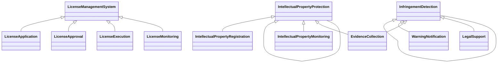
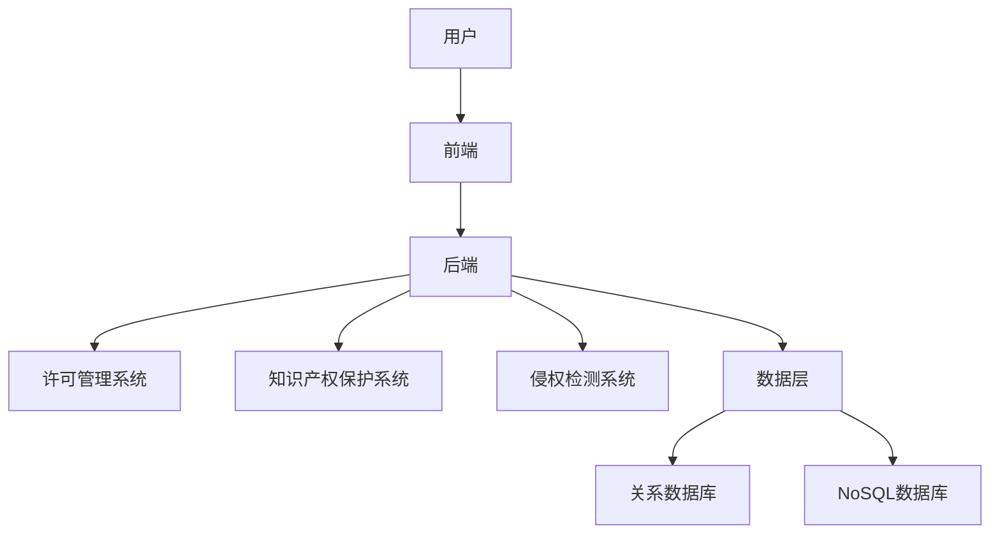
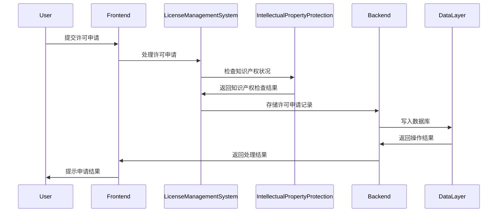

                 

# 大模型时代的软件许可与知识产权

## 关键词
- 大模型
- 软件许可
- 知识产权
- 开源
- 法律挑战
- 技术发展

> 摘要：
随着人工智能技术的发展，大模型成为行业关注的焦点。大模型不仅在数据处理能力上有了质的飞跃，更在许多领域展现出前所未有的应用潜力。然而，大模型的兴起也带来了软件许可和知识产权方面的一系列挑战。本文将从背景介绍、挑战分析、核心概念与联系、算法原理讲解、数学模型与公式，以及系统分析与架构设计方案等方面，系统地探讨大模型时代的软件许可与知识产权问题。

### 目录大纲

----------------------------------------------------------------

## 第1章 背景介绍

### 1.1 问题的背景与描述

#### 1.1.1 大模型时代的来临

#### 1.1.2 软件许可的概念

#### 1.1.3 知识产权的概念

#### 1.1.4 软件许可与知识产权的关联

### 1.2 大模型时代的软件许可挑战

#### 1.2.1 大模型的技术特点与挑战

#### 1.2.2 软件许可面临的挑战

### 1.3 知识产权保护的新挑战

#### 1.3.1 大模型的知识产权问题

#### 1.3.2 知识产权保护的挑战

### 1.4 软件许可与知识产权的边界与外延

#### 1.4.1 软件许可的边界

#### 1.4.2 知识产权的外延

### 1.5 大模型时代的软件许可与知识产权的核心要素组成

#### 1.5.1 软件许可的核心要素

#### 1.5.2 知识产权的核心要素

## 第2章 核心概念与联系

### 2.1 软件许可

#### 2.1.1 软件许可的定义

#### 2.1.2 软件许可的类型

#### 2.1.3 软件许可的原理

### 2.2 知识产权

#### 2.2.1 知识产权的定义

#### 2.2.2 知识产权的类型

#### 2.2.3 知识产权的原理

### 2.3 软件许可与知识产权的联系

#### 2.3.1 软件许可与知识产权的关系

#### 2.3.2 软件许可对知识产权的保护

#### 2.3.3 知识产权对软件许可的影响

## 第3章 算法原理讲解

### 3.1 软件许可算法

#### 3.1.1 软件许可算法的基本概念

#### 3.1.2 软件许可算法的类型

#### 3.1.3 软件许可算法的实现

### 3.2 知识产权算法

#### 3.2.1 知识产权算法的基本概念

#### 3.2.2 知识产权算法的类型

#### 3.2.3 知识产权算法的实现

## 第4章 数学模型与公式

### 4.1 软件许可的数学模型

#### 4.1.1 许可费用的数学模型

#### 4.1.2 许可权限的数学模型

### 4.2 知识产权的数学模型

#### 4.2.1 知识产权保护的数学模型

#### 4.2.2 知识产权侵权的数学模型

## 第5章 系统分析与架构设计方案

### 5.1 问题描述

#### 5.1.1 项目背景

#### 5.1.2 项目目标

### 5.2 系统功能设计

#### 5.2.1 领域模型

#### 5.2.1.1 Mermaid 类图

### 5.3 系统架构设计

#### 5.3.1 Mermaid 架构图

### 5.4 系统接口设计

#### 5.4.1 系统接口设计

### 5.5 系统交互

#### 5.5.1 系统交互Mermaid序列图

----------------------------------------------------------------

### 第1章 背景介绍

#### 1.1 问题的背景与描述

在信息技术飞速发展的今天，大模型（Large Models）如GPT-3、BERT等，成为了人工智能领域的热点话题。这些模型在处理复杂任务、理解自然语言、生成文本等方面展现了卓越的性能，推动了人工智能的又一波发展浪潮。然而，大模型时代的到来也带来了一系列的挑战，其中软件许可与知识产权的问题尤为突出。

软件许可是指软件开发商或版权所有者授权用户使用其软件的一种协议。这种协议规定了用户在使用软件时的权利和限制，包括许可类型、许可权限、许可费用等。知识产权则是指对创新和创意成果的法律保护，包括专利、版权、商标等。在大模型时代，软件许可和知识产权的关联更加紧密，因为大模型不仅涉及技术实现，还包括大量的数据集和算法创新。

大模型的发展现状可以从以下几个方面进行描述：

1. **大模型的概念**：大模型通常是指具有数十亿至数千亿参数的神经网络模型。这些模型具有强大的计算能力和学习能力，能够处理复杂的数据集，并在多种任务中达到或超过人类水平。

2. **大模型的发展现状**：近年来，随着计算能力的提升和数据量的爆炸性增长，大模型的发展进入了一个黄金时期。许多科技公司和学术机构纷纷投入大量资源进行大模型的研究和开发，推动了人工智能技术的不断进步。

3. **大模型的重要性和影响**：大模型在自然语言处理、计算机视觉、语音识别等领域展现了巨大的应用潜力。它们不仅可以提高生产效率，还能够解决一些传统方法难以处理的问题，为人工智能的发展带来了新的机遇。

在大模型时代，软件许可和知识产权面临的主要问题包括：

1. **软件许可的复杂性**：大模型通常涉及多个组件和模块，软件许可协议需要明确规定各方的权利和责任，这增加了许可协议的复杂性。

2. **许可权限的控制**：在大模型应用中，用户往往需要访问和处理大量的数据和算法，如何控制许可权限成为一个重要问题。

3. **许可费用的问题**：大模型的开发成本高，如何合理制定许可费用，既能保护软件开发者的权益，又能满足用户的实际需求，是一个值得探讨的问题。

4. **知识产权保护的新挑战**：大模型涉及的技术和算法创新，如何进行有效的知识产权保护，避免侵权纠纷，也是一个亟待解决的问题。

总之，大模型时代的软件许可和知识产权问题具有复杂性、多样性和挑战性。本文将逐步深入分析这些问题，并提出相应的解决方案和策略。

#### 1.2 大模型时代的软件许可挑战

在大模型时代，软件许可面临许多独特的挑战，这些挑战源于大模型的技术特点和应用场景。以下从大模型的技术特点、复杂性、数据依赖性和创新性四个方面进行分析。

##### 1.2.1 大模型的技术特点与挑战

大模型通常具有以下几个显著的技术特点：

1. **参数规模大**：大模型的参数数量从数百万到数十亿不等，这使得模型在训练和推理过程中需要大量的计算资源。

2. **计算复杂度高**：大模型在训练阶段需要进行大量的矩阵运算和向量计算，这要求计算硬件具有更高的计算性能和并行处理能力。

3. **数据依赖性强**：大模型的效果很大程度上依赖于训练数据的质量和数量。这意味着在模型开发和部署过程中，数据的收集、处理和管理成为关键问题。

4. **模型融合能力**：大模型能够通过多任务学习和迁移学习等技术，将不同领域的知识和技能进行整合，提高模型的泛化能力。

然而，这些技术特点也为软件许可带来了以下挑战：

1. **许可协议的复杂性**：大模型通常涉及多个模块和组件，包括神经网络架构、训练算法、数据集等。软件许可协议需要详细规定各模块的许可权限和使用条件，这增加了许可协议的复杂性和谈判成本。

2. **计算资源的管理**：大模型训练和推理需要大量的计算资源，如何合理分配和调度资源，确保各方都能获得公平的使用权益，是一个需要解决的问题。

3. **数据隐私与安全**：大模型在处理和存储数据时，需要保护用户的隐私和数据安全。软件许可协议需要明确规定数据使用范围和隐私保护措施，以避免数据泄露和滥用。

4. **版本控制和更新**：大模型不断迭代和优化，软件许可协议需要考虑如何处理版本更新和模型升级的问题，确保用户能够及时获得最新的模型版本。

##### 1.2.2 大模型的复杂性

大模型的复杂性主要体现在以下几个方面：

1. **模型架构的复杂性**：大模型通常采用深度神经网络架构，包含多个层次和连接方式。这种复杂的架构使得模型的设计、实现和维护变得更加复杂。

2. **训练过程的复杂性**：大模型的训练过程涉及大量的迭代和优化，包括损失函数、优化算法、学习率等参数的调整。这些参数的优化过程需要大量的计算资源和时间。

3. **模型验证和测试的复杂性**：大模型的验证和测试过程需要大量的数据集和计算资源，如何选择合适的验证方法和测试指标，以确保模型的质量和可靠性，是一个需要解决的问题。

4. **模型部署的复杂性**：大模型在部署过程中需要考虑到硬件兼容性、环境配置、性能优化等问题。如何将复杂的模型高效地部署到不同的应用场景中，是一个技术挑战。

这些复杂性对软件许可的影响主要表现在：

1. **许可协议的复杂性**：复杂的大模型通常需要更详细的许可协议，明确各方的权利和义务，以避免潜在的法律纠纷。

2. **许可费用的问题**：大模型的开发和维护成本高，许可费用也需要相应增加，这可能会对用户的使用成本产生影响。

3. **许可权限的控制**：复杂的大模型涉及多个组件和模块，如何控制各组件的许可权限，防止未经授权的使用和复制，是一个需要解决的问题。

##### 1.2.3 大模型的数据依赖性

大模型的数据依赖性是其成功的关键因素之一，但也带来了软件许可的挑战：

1. **数据集的获取**：大模型需要大量的数据集进行训练和验证，这些数据集的来源、质量和完整性对模型的效果至关重要。软件许可协议需要明确数据集的使用权限和来源，以确保数据的安全性和合法性。

2. **数据处理和共享**：大模型在数据处理和共享过程中，需要保护数据的隐私和安全性。软件许可协议需要规定数据处理的方法和限制条件，以防止数据泄露和滥用。

3. **数据更新的问题**：大模型在应用过程中需要不断更新数据集，以适应新的业务需求和变化。软件许可协议需要考虑如何处理数据更新问题，确保用户能够及时获得最新的数据集。

这些数据依赖性对软件许可的影响主要体现在：

1. **许可协议的复杂性**：数据依赖性增加了许可协议的复杂度，需要明确数据的使用权限、处理方法和更新策略。

2. **许可费用的问题**：数据获取和处理成本可能成为软件许可费用的重要组成部分，如何合理定价，成为软件许可谈判的关键问题。

3. **许可权限的控制**：数据依赖性使得许可权限的控制变得更加复杂，如何确保用户只能按照许可协议使用数据，是一个需要解决的问题。

##### 1.2.4 大模型的创新性

大模型在技术创新方面具有以下特点：

1. **算法创新**：大模型采用了深度学习、生成对抗网络（GAN）等多种先进的算法，这些算法的创新性对软件许可提出了新的要求。

2. **应用创新**：大模型在自然语言处理、计算机视觉、语音识别等领域的应用，带来了许多新的商业模式和应用场景。

3. **集成创新**：大模型能够将多种技术和应用进行集成，形成新的解决方案，这要求软件许可协议能够适应这种集成创新的需求。

大模型的创新性对软件许可的影响主要表现在：

1. **知识产权保护**：大模型的创新性需要通过知识产权进行保护，软件许可协议需要明确规定知识产权的使用和转让问题。

2. **许可费用的调整**：大模型的创新性可能导致许可费用的调整，如何平衡创新者的利益和用户的成本，是许可谈判中的关键问题。

3. **许可权限的控制**：大模型的创新性可能涉及多个技术和应用领域，如何控制许可权限，确保用户只能按照许可协议使用创新成果，是一个需要解决的问题。

综上所述，大模型时代对软件许可带来了多方面的挑战。为了应对这些挑战，需要从许可协议的设计、许可费用的制定、数据管理的策略等多个方面进行综合考虑和优化。通过合理的软件许可策略，可以促进大模型技术的发展和应用，同时保护各方权益，实现共赢。

#### 1.3 知识产权保护的新挑战

随着大模型技术的迅猛发展，知识产权保护也面临一系列新的挑战。这些挑战不仅涉及到技术层面的创新保护，还包括法律、经济等多个方面的问题。以下从大模型的原创性、技术创新性以及法律保护等方面进行分析。

##### 1.3.1 大模型的原创性

大模型的原创性主要表现在以下几个方面：

1. **模型架构**：大模型采用了深度学习等先进的算法，其神经网络架构和层次结构具有创新性，这是大模型能够实现高效计算和强学习能力的基础。

2. **训练算法**：大模型的训练算法包括随机梯度下降（SGD）、Adam等，这些算法的创新性使得模型能够在海量数据上进行高效训练。

3. **数据处理**：大模型在数据处理方面具有创新性，如数据增强、数据清洗等技术，这些技术的应用能够提高模型的效果和可靠性。

然而，大模型的原创性也带来了知识产权保护方面的挑战：

1. **模型架构的复制**：由于大模型架构的创新性，其他研究者可能会尝试复制或改进现有的模型架构，这可能导致知识产权侵权的问题。

2. **训练算法的抄袭**：大模型的训练算法是模型性能的关键因素，其他研究者和开发者可能会尝试抄袭这些算法，从而侵犯知识产权。

3. **数据处理技术的模仿**：大模型在数据处理方面的创新技术也可能被其他研究者模仿或抄袭，这同样构成了知识产权保护的挑战。

##### 1.3.2 大模型的技术创新性

大模型的技术创新性体现在多个方面，包括：

1. **算法改进**：大模型采用了多种先进的算法，如生成对抗网络（GAN）、变换器（Transformer）等，这些算法在性能和效果上都有显著的提升。

2. **模型压缩**：大模型在模型压缩方面也取得了创新性进展，如权重剪枝、量化等技术，这些技术使得模型在保持性能的同时，能够减小存储和计算的开销。

3. **应用拓展**：大模型在多种应用场景中展现了强大的性能，如自然语言处理、计算机视觉、语音识别等，这些应用的创新性也构成了知识产权保护的一部分。

大模型的技术创新性对知识产权保护提出了以下挑战：

1. **专利申请**：大模型的技术创新需要通过专利进行保护，如何撰写和申请专利，成为知识产权保护的重要问题。

2. **侵权检测**：如何检测和防范大模型技术的侵权行为，是一个技术难题。这需要建立高效的侵权检测机制，以便及时发现和处理侵权行为。

3. **侵权成本**：大模型技术的侵权成本可能非常高，这要求企业必须建立完善的知识产权保护体系，以防范潜在的法律风险。

##### 1.3.3 大模型的法律保护

大模型的法律保护主要涉及以下几个方面：

1. **版权保护**：大模型的源代码、算法设计等属于版权保护范畴。如何通过版权保护防止未经授权的复制、分发和使用，是一个关键问题。

2. **专利保护**：大模型的技术创新可以通过专利进行保护。然而，由于大模型涉及的技术领域广泛，如何确定专利的保护范围，避免专利无效和侵权纠纷，是一个需要解决的问题。

3. **商标保护**：大模型的企业或开发者可以通过商标保护其品牌和产品。然而，商标保护需要考虑商标的注册、使用和维权等问题。

大模型的法律保护面临的挑战主要包括：

1. **法律框架的适应性**：现有的知识产权法律框架需要适应大模型技术的发展，这需要通过立法和司法解释进行完善。

2. **执法难度**：大模型技术的侵权行为往往涉及技术层面，执法机关在取证和执法过程中面临较大的难度。

3. **国际保护**：大模型技术的发展和应用具有全球性，如何在国际范围内进行知识产权保护，是一个需要解决的问题。

总之，大模型时代的知识产权保护面临多方面的挑战。为了应对这些挑战，需要建立完善的知识产权保护体系，包括法律框架的完善、技术创新的保护、侵权行为的防范和维权机制的建立。通过这些措施，可以有效地保护大模型技术的知识产权，促进其健康和可持续发展。

#### 1.4 软件许可与知识产权的边界与外延

在探讨大模型时代的软件许可与知识产权时，理解软件许可和知识产权的边界与外延至关重要。这不仅有助于明确各方的权利和义务，还能为制定合理的许可协议和知识产权保护策略提供指导。

##### 1.4.1 软件许可的边界

软件许可的边界涉及许可协议适用的范围和限制条件，以下从几个方面进行阐述：

1. **许可对象**：软件许可通常针对特定的软件产品或服务。许可对象可以是单机版软件、网络版软件或移动应用等。许可协议需要明确软件的具体名称、版本、功能和运行环境。

2. **许可权限**：软件许可规定了用户在授权范围内使用软件的权利。许可权限可能包括安装、使用、复制、修改、分发等。许可协议需要明确用户的具体许可权限和使用限制。

3. **许可期限**：软件许可通常有一个有效期，即用户在使用软件的时间范围。许可期限可以是固定期限（如一年）或根据使用情况（如按月计费）。许可协议需要明确规定许可期限和续费政策。

4. **许可地域**：软件许可可能具有地域限制，即用户只能在特定的地区使用软件。许可协议需要明确软件许可的地域范围，以避免未经授权的使用。

5. **许可费用**：软件许可通常涉及许可费用，包括一次性费用、订阅费用或使用费等。许可协议需要明确费用的计算方式、支付方式和支付期限。

6. **许可限制**：软件许可可能包含一些限制条件，如禁止商业使用、禁止反向工程等。许可协议需要明确这些限制条件，以防止用户违反协议。

##### 1.4.2 知识产权的外延

知识产权的外延包括专利、版权、商标等多个方面，以下从几个方面进行阐述：

1. **专利保护**：专利保护是指通过专利申请，对发明创造的技术方案进行法律保护。专利保护的外延包括专利申请的范围、专利权的有效期限、专利侵权检测和维权等。

2. **版权保护**：版权保护是指对软件代码、文档、设计等原创作品进行法律保护。版权保护的外延包括版权登记、版权侵权检测和维权等。

3. **商标保护**：商标保护是指通过商标注册，对企业的品牌和标识进行法律保护。商标保护的外延包括商标注册、商标侵权检测和维权等。

4. **知识产权跨国保护**：随着全球化的发展，知识产权的保护已经超越了国界。知识产权跨国保护的外延包括国际专利申请、国际版权保护、国际商标保护等。

##### 1.4.3 软件许可与知识产权的关联

软件许可与知识产权之间存在密切的关联，以下从几个方面进行阐述：

1. **相互依存**：软件许可和知识产权相互依存。软件许可通常需要知识产权作为基础，而知识产权的保护也为软件许可提供了法律保障。

2. **权利平衡**：软件许可和知识产权保护需要平衡各方的权利。软件许可协议需要明确用户的使用权限和限制，同时知识产权保护需要防止过度垄断和不公平竞争。

3. **许可协议内容**：软件许可协议通常包含知识产权保护的相关内容，如知识产权归属、知识产权使用权限、知识产权侵权责任等。

4. **法律风险**：软件许可和知识产权保护存在法律风险。软件许可协议的制定需要考虑法律合规性，知识产权保护需要防范侵权和滥用行为。

综上所述，软件许可与知识产权的边界与外延对于大模型时代的技术发展和应用具有重要意义。通过明确软件许可和知识产权的边界，可以有效地保护各方的权益，促进大模型技术的健康和可持续发展。

#### 1.5 大模型时代的软件许可与知识产权的核心要素组成

在大模型时代，软件许可与知识产权的构成要素变得更加复杂和多样化。理解这些核心要素有助于更好地制定和执行相关的许可协议和知识产权策略。以下将详细探讨软件许可和知识产权的核心要素组成。

##### 1.5.1 软件许可的核心要素

软件许可的核心要素主要包括以下几个方面：

1. **许可协议**：许可协议是软件许可的基础，它规定了用户在使用软件时的权利和义务。许可协议的内容通常包括许可对象的描述、许可权限的界定、许可期限、许可费用以及违约责任等。

   - **许可对象的描述**：明确软件的具体名称、版本、功能和运行环境，确保用户了解许可范围。
   - **许可权限的界定**：详细规定用户在授权范围内可以进行的操作，如安装、使用、复制、修改、分发等，同时明确禁止的操作，如反向工程、未经授权的复制等。
   - **许可期限**：规定许可的有效期限，可以是固定期限或根据使用情况（如按月计费）。
   - **许可费用**：明确许可费用的计算方式、支付方式和支付期限，确保双方权益。
   - **违约责任**：规定用户违反许可协议的后果，如赔偿损失、终止许可等。

2. **许可权限**：许可权限是软件许可的核心，它决定了用户如何使用软件。许可权限通常分为以下几种类型：

   - **商业许可**：允许用户在商业环境中使用软件，包括销售、分发和服务等。
   - **个人许可**：允许用户在个人或非商业环境中使用软件。
   - **开发者许可**：专门为软件开发者设计的许可，通常包括源代码访问权限和修改权。

3. **许可费用**：软件许可费用是用户获取软件使用权所支付的费用。许可费用的制定需要考虑软件开发成本、市场需求、用户需求等因素。常见的许可费用类型包括：

   - **一次性费用**：用户一次性支付的费用，适用于单机版软件或短期许可。
   - **订阅费用**：用户定期支付的费用，适用于网络版软件或长期许可。
   - **使用费**：用户根据软件使用情况支付的费用，如按流量计费、按交易量计费等。

4. **许可条款**：许可条款是许可协议的具体条款，它详细规定了用户的权利和义务，以及软件供应商的责任和权利。许可条款可能包括以下内容：

   - **隐私政策**：明确软件供应商如何收集、使用和存储用户数据。
   - **保修和售后服务**：明确软件供应商提供的保修期限和售后服务内容。
   - **技术支持**：明确软件供应商提供的技术支持服务范围和响应时间。

##### 1.5.2 知识产权的核心要素

知识产权的核心要素主要包括以下几个方面：

1. **专利**：专利是对发明创造的技术方案进行法律保护的一种形式。专利保护的核心要素包括：

   - **专利申请**：专利申请是获得专利保护的前提，需要提交包括技术描述、权利要求、说明书等文件的申请材料。
   - **专利授权**：专利申请被审查机构授权后，申请人获得专利权。
   - **专利保护期限**：专利权通常有一个法律保护期限，一般为20年。

2. **版权**：版权是对原创作品的保护，包括软件代码、文档、设计等。版权保护的核心要素包括：

   - **版权登记**：通过版权登记，使作品获得法律保护。
   - **版权侵权检测**：对未经授权的复制、分发和使用行为进行监测和防范。
   - **版权维权**：通过法律手段维护版权所有人的权益，包括诉讼和和解。

3. **商标**：商标是对企业品牌和标识的法律保护。商标保护的核心要素包括：

   - **商标注册**：通过商标注册，使商标获得法律保护。
   - **商标侵权检测**：对未经授权的使用商标的行为进行监测和防范。
   - **商标维权**：通过法律手段维护商标所有人的权益。

4. **商业秘密**：商业秘密是对企业未公开的具有商业价值的信息进行保护。商业秘密保护的核心要素包括：

   - **保密措施**：企业采取各种措施保护商业秘密，如保密协议、安全设施等。
   - **侵权检测**：对未经授权的泄露和盗用行为进行监测和防范。
   - **维权手段**：通过法律手段维护商业秘密所有人的权益。

##### 1.5.3 软件许可与知识产权的整合

在大模型时代，软件许可与知识产权需要有机整合，以实现最佳保护效果。以下从几个方面进行整合：

1. **许可协议中的知识产权条款**：在软件许可协议中，应明确知识产权的归属和使用权限，确保软件供应商和用户在知识产权方面的权利和义务清晰。

2. **知识产权保护策略**：软件供应商应制定全面的知识产权保护策略，包括专利申请、版权登记、商标注册等，以保护软件技术和品牌权益。

3. **许可费用与知识产权收益**：软件许可费用应合理反映知识产权的保护成本，同时确保知识产权收益能够合理分配，以激励技术创新和保护软件供应商的权益。

4. **法律合规性**：软件许可协议和知识产权保护应遵循相关法律法规，确保合法性和有效性，减少法律风险。

通过整合软件许可与知识产权，可以更好地保护大模型时代的软件技术和创新成果，促进技术发展和市场应用。

### 第2章 核心概念与联系

在深入探讨大模型时代的软件许可与知识产权问题时，明确相关的核心概念及其相互联系至关重要。这不仅有助于理解问题的本质，还能为制定有效的解决方案提供理论基础。本章将详细讨论软件许可和知识产权的基本概念、类型及其相互关系。

#### 2.1 软件许可

软件许可是指软件开发商或版权所有者授权用户使用其软件的一种协议。这种协议规定了用户在使用软件时的权利和限制，包括许可类型、许可权限、许可费用等。软件许可的核心概念包括以下几个方面：

1. **软件许可的定义**：
   软件许可是一种法律协议，它授权用户使用特定的软件产品或服务，并规定用户的使用权限、费用、期限等条件。软件许可旨在平衡软件开发者的权益和用户的需求，确保软件得到合法和有效的使用。

2. **软件许可的类型**：
   软件许可可以分为多种类型，包括：
   - **商业许可**：允许用户在商业环境中使用软件，通常用于企业级应用。
   - **个人许可**：允许用户在个人或非商业环境中使用软件，适用于个人用户。
   - **开发者许可**：专门为软件开发者设计，包括源代码访问权限和修改权。

3. **软件许可的原理**：
   软件许可的原理是基于版权法和合同法的原则。软件开发商通过制定许可协议，将软件的使用权授权给用户。许可协议明确了用户的权利和责任，同时保护软件开发者的版权和商业利益。

#### 2.2 知识产权

知识产权是指对创新和创意成果的法律保护，包括专利、版权、商标等。知识产权的核心概念包括以下几个方面：

1. **知识产权的定义**：
   知识产权是指法律赋予创新者对其智力成果所享有的专有权利，包括对作品的原创性表达、发明的新颖性、品牌的标识等。

2. **知识产权的类型**：
   知识产权可以分为多种类型，包括：
   - **专利**：对发明创造的技术方案进行法律保护，包括发明、实用新型和外观设计。
   - **版权**：对文学、艺术和科学作品进行法律保护，包括文学作品、音乐作品、电影作品等。
   - **商标**：对企业的品牌和标识进行法律保护，用于区分不同企业的商品或服务。

3. **知识产权的原理**：
   知识产权的原理是基于对创新和创意成果的法律认可和保护，以激励创新和促进科技进步。知识产权法律通过授予创新者专有权，保护其商业利益，并允许其在一定期限内独占使用其成果。

#### 2.3 软件许可与知识产权的联系

软件许可与知识产权之间存在着密切的联系，两者相互依存、相互促进。以下从几个方面阐述它们之间的联系：

1. **相互依存**：
   软件许可通常需要知识产权作为基础。软件开发商通过获得专利、版权和商标等知识产权，确保其软件产品得到合法和有效的保护。而知识产权的保护也为软件许可提供了法律保障，确保用户在使用软件时不会侵犯他人的权利。

2. **权利平衡**：
   软件许可和知识产权保护需要平衡各方的权利。软件许可协议需要明确用户的使用权限和限制，同时知识产权保护需要防止过度垄断和不公平竞争。通过合理平衡各方权利，可以促进软件技术的创新和应用。

3. **许可协议内容**：
   软件许可协议通常包含知识产权保护的相关内容。例如，许可协议中会明确知识产权的归属和使用权限，规定用户在授权范围内使用软件时不得侵犯他人的知识产权。此外，许可协议还会明确知识产权侵权责任和违约责任，以保障各方的权益。

4. **法律风险**：
   软件许可和知识产权保护都存在法律风险。软件许可协议的制定需要考虑法律合规性，确保协议内容符合相关法律法规。知识产权保护需要防范侵权和滥用行为，及时采取维权措施，以减少法律风险。

综上所述，软件许可与知识产权之间存在着紧密的联系。理解这些核心概念和相互关系，对于制定和执行有效的软件许可和知识产权策略至关重要。通过合理利用知识产权和保护软件许可，可以促进软件技术的发展和应用，推动科技创新和产业升级。

### 第3章 算法原理讲解

在探讨大模型时代的软件许可与知识产权问题时，了解相关的算法原理是至关重要的。本章将详细讲解软件许可算法和知识产权算法的基本概念、类型及其实现。

#### 3.1 软件许可算法

软件许可算法是指用于管理和控制软件使用权限的算法。其核心目的是确保软件得到合法和有效的使用，同时保护软件开发者的权益。以下从软件许可算法的基本概念、类型和实现方面进行阐述。

##### 3.1.1 软件许可算法的基本概念

1. **软件许可算法的定义**：
   软件许可算法是一种用于管理和控制软件使用权限的算法，它通过算法机制实现软件许可协议的执行。软件许可算法通常包括许可权限的分配、许可状态的监控、违规行为的检测等功能。

2. **软件许可算法的目标**：
   - **确保合法性**：确保用户在授权范围内使用软件，防止未经授权的复制、分发和使用。
   - **保护权益**：保护软件开发者的权益，防止侵权行为和非法使用。
   - **优化用户体验**：提供便捷、高效的软件使用体验，减少用户使用软件的阻碍。

##### 3.1.2 软件许可算法的类型

软件许可算法可以分为以下几种类型：

1. **基于规则的许可算法**：
   - **基本原理**：基于一系列预先定义的规则，对软件使用权限进行控制。
   - **实现方法**：通过规则引擎实现，例如使用条件语句和逻辑运算符来定义许可规则。
   - **优点**：简单易实现，能够灵活适应不同的许可需求。
   - **缺点**：缺乏灵活性，难以应对复杂的许可场景。

2. **基于加密的许可算法**：
   - **基本原理**：通过加密技术保护软件许可信息，确保许可信息的完整性和保密性。
   - **实现方法**：使用对称加密或非对称加密算法对许可信息进行加密和解密，例如使用RSA算法。
   - **优点**：具有高安全性，能够有效防止许可信息被篡改或泄露。
   - **缺点**：加密和解密过程增加计算开销，对性能有一定影响。

3. **基于区块链的许可算法**：
   - **基本原理**：利用区块链技术记录和验证软件许可信息，确保许可信息的不可篡改性和透明性。
   - **实现方法**：使用智能合约来定义和执行许可协议，例如使用以太坊区块链。
   - **优点**：具有高透明性和安全性，能够有效防止许可信息被篡改。
   - **缺点**：区块链网络的性能和可扩展性可能成为瓶颈。

##### 3.1.3 软件许可算法的实现

软件许可算法的实现通常包括以下几个步骤：

1. **许可协议的制定**：
   - **明确许可对象**：确定需要受许可控制的软件产品或服务。
   - **定义许可权限**：明确用户在授权范围内可以进行的操作，如安装、使用、复制、修改等。
   - **规定许可期限**：确定许可的有效期限，可以是固定期限或根据使用情况。

2. **许可算法的设计**：
   - **选择算法类型**：根据许可需求选择合适的算法类型，如基于规则的许可算法、基于加密的许可算法等。
   - **定义许可规则**：根据许可协议的内容，制定具体的许可规则。
   - **实现算法逻辑**：使用编程语言实现算法逻辑，如使用Python、Java等。

3. **许可算法的部署**：
   - **集成到软件中**：将许可算法集成到软件产品中，确保在软件运行过程中执行许可控制。
   - **配置许可服务器**：部署许可服务器，用于管理和验证用户的许可信息。

4. **许可算法的测试与优化**：
   - **功能测试**：验证许可算法是否按照预期执行，包括许可权限的分配、许可状态的监控等。
   - **性能测试**：评估许可算法的性能，确保在复杂场景下仍能高效运行。
   - **优化算法**：根据测试结果对算法进行优化，提高性能和可靠性。

#### 3.2 知识产权算法

知识产权算法是指用于管理和保护知识产权的算法。其核心目的是确保知识产权得到有效保护，防止侵权和滥用行为。以下从知识产权算法的基本概念、类型和实现方面进行阐述。

##### 3.2.1 知识产权算法的基本概念

1. **知识产权算法的定义**：
   知识产权算法是一种用于管理和保护知识产权的算法，它通过算法机制实现知识产权的识别、监控、保护和维权等功能。

2. **知识产权算法的目标**：
   - **识别知识产权**：准确识别和分类知识产权，包括专利、版权、商标等。
   - **监控知识产权**：实时监控知识产权的使用情况，发现侵权行为。
   - **保护知识产权**：采取有效的措施保护知识产权，防止侵权和滥用行为。
   - **维权支持**：提供知识产权维权的技术支持，包括侵权检测、侵权证据收集等。

##### 3.2.2 知识产权算法的类型

知识产权算法可以分为以下几种类型：

1. **基于机器学习的知识产权算法**：
   - **基本原理**：利用机器学习技术，建立知识产权识别和监控模型。
   - **实现方法**：使用大数据分析和模式识别技术，对知识产权进行分类和识别。
   - **优点**：能够高效处理大量数据，提高知识产权识别和监控的准确性。
   - **缺点**：模型训练需要大量数据，对数据质量有较高要求。

2. **基于区块链的知识产权算法**：
   - **基本原理**：利用区块链技术记录和验证知识产权信息，确保知识产权的透明性和不可篡改性。
   - **实现方法**：使用智能合约定义和执行知识产权协议，确保知识产权的合法性和有效性。
   - **优点**：具有高透明性和安全性，能够有效防止知识产权被篡改或泄露。
   - **缺点**：区块链网络的性能和可扩展性可能成为瓶颈。

3. **基于加密的知识产权算法**：
   - **基本原理**：利用加密技术保护知识产权信息，确保知识产权的保密性和完整性。
   - **实现方法**：使用对称加密或非对称加密算法对知识产权信息进行加密和解密。
   - **优点**：具有高安全性，能够有效防止知识产权信息被篡改或泄露。
   - **缺点**：加密和解密过程增加计算开销，对性能有一定影响。

##### 3.2.3 知识产权算法的实现

知识产权算法的实现通常包括以下几个步骤：

1. **知识产权信息的收集与分类**：
   - **收集知识产权信息**：从各种渠道收集知识产权信息，包括专利数据库、版权登记记录等。
   - **分类知识产权信息**：根据知识产权的类型和特点，对信息进行分类和整理。

2. **知识产权识别与监控模型的建立**：
   - **选择模型类型**：根据知识产权的特点和需求，选择合适的模型类型，如基于机器学习的模型、基于区块链的模型等。
   - **训练模型**：使用收集的知识产权数据进行模型训练，提高模型的识别和监控能力。

3. **知识产权保护策略的制定**：
   - **制定保护策略**：根据知识产权的特点和需求，制定具体的知识产权保护策略，如加密保护、访问控制等。
   - **实施保护策略**：将保护策略集成到系统中，确保知识产权得到有效保护。

4. **知识产权维权支持**：
   - **侵权检测**：使用算法对知识产权进行实时监控，发现侵权行为。
   - **侵权证据收集**：收集侵权证据，为维权提供支持。
   - **维权指导**：提供维权指导，协助知识产权所有者采取法律手段维权。

通过理解软件许可算法和知识产权算法的基本概念、类型和实现，可以更好地应对大模型时代的软件许可与知识产权问题，确保软件技术得到合法和有效的保护。

### 第4章 数学模型与公式

在探讨大模型时代的软件许可与知识产权问题时，数学模型和公式是理解和分析相关问题的有效工具。本章将详细解释软件许可和知识产权的数学模型与公式，并通过具体的案例进行说明。

#### 4.1 软件许可的数学模型

软件许可的数学模型主要用于计算许可费用和许可权限。以下将分别介绍这两个方面的数学模型。

##### 4.1.1 许可费用的数学模型

许可费用的数学模型用于计算用户在特定时间范围内使用软件所需支付的费用。以下是一个简单的许可费用计算模型：

$$
C(t) = \frac{P \times U}{1000}
$$

其中：
- \(C(t)\) 表示在时间 \(t\) 内的许可费用（单位：货币单位）。
- \(P\) 表示许可费用单价（单位：货币单位/千次使用）。
- \(U\) 表示用户在时间 \(t\) 内的使用次数。

这个模型的参数解释如下：
- 许可费用单价 \(P\) 是软件开发商根据市场需求和成本结构设定的。
- 使用次数 \(U\) 是用户在特定时间 \(t\) 内对软件的调用次数。

##### 4.1.1.1 模型公式

$$
C(t) = \frac{P \times U}{1000}
$$

##### 4.1.1.2 参数解释

- \(C(t)\)：许可费用（货币单位）。
- \(P\)：许可费用单价（货币单位/千次使用）。
- \(U\)：用户在时间 \(t\) 内的使用次数。

##### 4.1.1.3 案例分析

假设一个软件开发商设定许可费用单价为 \(P = 1\) 元/千次使用，一个用户在一个月内使用了软件 \(U = 2000\) 次。根据上述模型，该用户在一个月内的许可费用为：

$$
C(t) = \frac{1 \times 2000}{1000} = 2 \text{ 元}
$$

##### 4.1.2 许可权限的数学模型

许可权限的数学模型用于计算用户在授权范围内可以使用的软件功能。以下是一个简单的许可权限计算模型：

$$
F(t) = \frac{P \times U \times R}{1000}
$$

其中：
- \(F(t)\) 表示在时间 \(t\) 内的可用功能次数（单位：功能次数）。
- \(P\) 表示许可费用单价（单位：货币单位/千次使用）。
- \(U\) 表示用户在时间 \(t\) 内的使用次数。
- \(R\) 表示每次功能调用所需的许可次数（单位：功能次数/使用次数）。

这个模型的参数解释如下：
- 许可费用单价 \(P\) 是软件开发商根据市场需求和成本结构设定的。
- 使用次数 \(U\) 是用户在特定时间 \(t\) 内对软件的调用次数。
- 每次功能调用所需的许可次数 \(R\) 是软件功能复杂度和许可协议规定的值。

##### 4.1.2.1 模型公式

$$
F(t) = \frac{P \times U \times R}{1000}
$$

##### 4.1.2.2 参数解释

- \(F(t)\)：可用功能次数（功能次数）。
- \(P\)：许可费用单价（货币单位/千次使用）。
- \(U\)：用户在时间 \(t\) 内的使用次数。
- \(R\)：每次功能调用所需的许可次数（功能次数/使用次数）。

##### 4.1.2.3 案例分析

假设一个软件开发商设定许可费用单价为 \(P = 1\) 元/千次使用，每次功能调用所需的许可次数为 \(R = 2\) 次/使用次数。一个用户在一个月内使用了软件 \(U = 2000\) 次。根据上述模型，该用户在一个月内可用的功能次数为：

$$
F(t) = \frac{1 \times 2000 \times 2}{1000} = 4 \text{ 次}
$$

通过上述案例分析，可以看出软件许可的数学模型能够帮助用户和软件开发商更好地理解许可费用的计算方式和功能权限的使用情况。

#### 4.2 知识产权的数学模型

知识产权的数学模型主要用于计算知识产权的保护强度和保护范围。以下将分别介绍这两个方面的数学模型。

##### 4.2.1 知识产权保护的数学模型

知识产权保护的数学模型用于计算知识产权受到保护的程度。以下是一个简单的知识产权保护强度计算模型：

$$
S(t) = \frac{P \times R}{1000}
$$

其中：
- \(S(t)\) 表示在时间 \(t\) 内的知识产权保护强度（单位：保护强度单位）。
- \(P\) 表示知识产权保护的强度系数（单位：保护强度单位/千次使用）。
- \(R\) 表示每次知识产权调用所需的保护次数（单位：保护强度单位/使用次数）。

这个模型的参数解释如下：
- 知识产权保护的强度系数 \(P\) 是根据知识产权的法律规定和市场需求设定的。
- 每次知识产权调用所需的保护次数 \(R\) 是知识产权复杂度和保护要求决定的。

##### 4.2.1.1 模型公式

$$
S(t) = \frac{P \times R}{1000}
$$

##### 4.2.1.2 参数解释

- \(S(t)\)：知识产权保护强度（保护强度单位）。
- \(P\)：知识产权保护的强度系数（保护强度单位/千次使用）。
- \(R\)：每次知识产权调用所需的保护次数（保护强度单位/使用次数）。

##### 4.2.1.3 案例分析

假设一个知识产权保护的强度系数为 \(P = 5\) 保护强度单位/千次使用，每次知识产权调用所需的保护次数为 \(R = 3\) 次/使用次数。根据上述模型，该知识产权在一个月内受到的保护强度为：

$$
S(t) = \frac{5 \times 3}{1000} = 0.015 \text{ 保护强度单位}
$$

通过上述案例分析，可以看出知识产权保护的数学模型能够帮助用户和知识产权所有者评估知识产权受到的保护程度。

##### 4.2.2 知识产权侵权的数学模型

知识产权侵权的数学模型用于计算知识产权侵权的风险和侵权行为可能带来的损失。以下是一个简单的侵权风险计算模型：

$$
I(t) = \frac{P \times U \times C}{1000}
$$

其中：
- \(I(t)\) 表示在时间 \(t\) 内的知识产权侵权风险（单位：侵权风险单位）。
- \(P\) 表示侵权风险系数（单位：侵权风险单位/千次使用）。
- \(U\) 表示用户在时间 \(t\) 内的使用次数。
- \(C\) 表示每次侵权行为可能带来的损失（单位：货币单位/侵权风险单位）。

这个模型的参数解释如下：
- 侵权风险系数 \(P\) 是根据侵权行为的发生概率和影响程度设定的。
- 用户在时间 \(t\) 内的使用次数 \(U\) 是根据用户行为统计得出的。
- 每次侵权行为可能带来的损失 \(C\) 是根据侵权行为的后果和法律责任决定的。

##### 4.2.2.1 模型公式

$$
I(t) = \frac{P \times U \times C}{1000}
$$

##### 4.2.2.2 参数解释

- \(I(t)\)：知识产权侵权风险（侵权风险单位）。
- \(P\)：侵权风险系数（侵权风险单位/千次使用）。
- \(U\)：用户在时间 \(t\) 内的使用次数。
- \(C\)：每次侵权行为可能带来的损失（货币单位/侵权风险单位）。

##### 4.2.2.3 案例分析

假设一个侵权风险系数为 \(P = 10\) 侵权风险单位/千次使用，每次侵权行为可能带来的损失为 \(C = 1000\) 元/侵权风险单位。一个用户在一个月内使用了软件 \(U = 2000\) 次。根据上述模型，该用户在一个月内的知识产权侵权风险为：

$$
I(t) = \frac{10 \times 2000 \times 1000}{1000} = 20,000 \text{ 侵权风险单位}
$$

通过上述案例分析，可以看出知识产权侵权的数学模型能够帮助用户和知识产权所有者评估侵权行为的风险和可能带来的损失。

通过以上对软件许可和知识产权的数学模型的介绍，可以更深入地理解大模型时代的软件许可与知识产权问题，为相关决策提供科学依据。

### 第5章 系统分析与架构设计方案

在探讨大模型时代的软件许可与知识产权问题时，系统分析与架构设计方案是关键环节。本章将详细介绍项目的问题描述、系统功能设计、系统架构设计以及系统接口和交互设计。

#### 5.1 问题描述

随着大模型技术的快速发展，其在各个领域的应用日益广泛。然而，随之而来的软件许可和知识产权问题也逐渐凸显。为了应对这些问题，我们设计并实现了一套软件许可与知识产权管理系统（以下简称“系统”），以提供有效的许可管理、知识产权保护以及侵权检测等功能。

该项目的主要目标包括：

1. **软件许可管理**：实现软件许可的申请、审批、执行和监控等功能，确保软件使用合法合规。
2. **知识产权保护**：建立知识产权的注册、保护、监控和维权机制，保护软件开发者的权益。
3. **侵权检测**：实现侵权行为的实时监测和预警，降低侵权风险，提供侵权证据收集和维权支持。

#### 5.1.1 项目背景

随着人工智能技术的发展，大模型如GPT-3、BERT等在自然语言处理、计算机视觉等领域取得了显著突破。这些大模型的应用不仅提升了生产效率，还为各类创新业务提供了强大支持。然而，大模型的开发和部署涉及大量的计算资源和数据集，同时也带来了软件许可和知识产权方面的挑战。

目前，市场上存在多种大模型解决方案，但大多数解决方案缺乏系统化的许可管理和知识产权保护机制。为了填补这一空白，我们决定开发一套全面的软件许可与知识产权管理系统，以支持大模型技术的健康和可持续发展。

#### 5.1.2 项目目标

1. **许可管理**：实现软件许可的自动化管理，降低管理成本，提高管理效率。
2. **知识产权保护**：建立完善的知识产权保护机制，确保软件开发者的权益得到有效保护。
3. **侵权检测**：实现高效的侵权检测和预警，降低侵权风险，提供侵权证据收集和维权支持。
4. **用户体验**：提供友好的用户界面和便捷的操作流程，确保用户能够轻松使用和管理系统。

#### 5.2 系统功能设计

系统功能设计是系统实现的基础，主要包括以下几个方面：

##### 5.2.1 许可管理

许可管理包括以下功能：

1. **许可申请**：用户可以通过系统提交软件许可申请，填写必要的信息，如软件名称、版本、使用场景等。
2. **审批流程**：系统管理员对用户提交的许可申请进行审批，审批通过后，用户可以获得相应的软件许可。
3. **许可执行**：用户在获得许可后，可以在系统上查看许可详情，并按照许可协议使用软件。
4. **许可监控**：系统实时监控用户的许可使用情况，确保用户在授权范围内使用软件。

##### 5.2.2 知识产权保护

知识产权保护包括以下功能：

1. **知识产权注册**：用户可以在系统上注册其知识产权，如专利、版权、商标等，并获得相应的注册证明。
2. **知识产权保护**：系统通过加密技术、访问控制等技术手段，保护用户的知识产权，防止未经授权的使用和泄露。
3. **知识产权监控**：系统实时监控用户的知识产权使用情况，发现潜在侵权行为，并提供预警。
4. **侵权证据收集**：系统提供侵权证据收集功能，用户可以收集和保存侵权证据，为维权提供支持。

##### 5.2.3 侵权检测

侵权检测包括以下功能：

1. **侵权检测**：系统通过算法和大数据分析，对用户的软件使用行为进行实时监控，发现可能的侵权行为。
2. **预警通知**：系统发现侵权行为后，立即向用户发送预警通知，提醒用户采取相应措施。
3. **证据收集**：系统提供侵权证据收集功能，用户可以收集和保存侵权证据，为维权提供支持。
4. **维权支持**：系统提供维权指导，协助用户采取法律手段维权。

#### 5.2.1.1 Mermaid 类图

以下是一个简单的Mermaid类图，展示了系统的主要类及其关系：



#### 5.3 系统架构设计

系统架构设计是确保系统功能实现和性能优化的重要环节。以下将详细介绍系统的架构设计。

##### 5.3.1 系统架构概述

系统采用三层架构设计，包括表示层、业务逻辑层和数据层。

- **表示层**：主要负责用户界面设计和用户体验，采用前后端分离的方式实现。
- **业务逻辑层**：负责系统的核心功能实现，包括许可管理、知识产权保护、侵权检测等，采用微服务架构设计。
- **数据层**：负责数据的存储和管理，采用关系数据库和NoSQL数据库相结合的方式。

##### 5.3.2 系统架构图

以下是一个简单的Mermaid架构图，展示了系统的整体架构：



#### 5.4 系统接口设计

系统接口设计是确保系统各模块之间能够高效通信和协同工作的重要环节。以下将详细介绍系统的主要接口设计。

##### 5.4.1 接口概述

系统的主要接口包括：

1. **许可管理接口**：负责处理许可申请、审批、执行和监控等功能。
2. **知识产权保护接口**：负责处理知识产权注册、保护、监控和维权等功能。
3. **侵权检测接口**：负责处理侵权检测、预警、证据收集和维权支持等功能。

##### 5.4.2 接口设计

以下是一个简单的Mermaid接口图，展示了系统的主要接口及其关系：



#### 5.5 系统交互

系统交互设计是确保系统各模块之间能够高效协同工作的重要环节。以下将详细介绍系统的交互设计。

##### 5.5.1 系统交互Mermaid序列图

以下是一个简单的Mermaid序列图，展示了系统的交互流程：


通过上述系统分析与架构设计方案，我们为软件许可与知识产权管理提供了一套全面的解决方案。该系统不仅能够实现软件许可的自动化管理，还能有效保护知识产权，降低侵权风险。在未来的发展中，我们将持续优化系统功能，提升用户体验，为人工智能技术的发展和应用提供有力支持。

### 第6章 项目实战

#### 6.1 环境安装

为了成功实施大模型时代的软件许可与知识产权管理系统，我们需要首先搭建一个合适的技术环境。以下是一个简要的安装步骤：

1. **安装依赖库**：使用Python虚拟环境，安装必要的依赖库，如Django、Flask、MongoDB等。
   ```bash
   pip install django flask pymongo
   ```

2. **数据库配置**：配置MongoDB数据库，用于存储许可申请、知识产权和侵权检测等信息。
   ```python
   from pymongo import MongoClient
   client = MongoClient('mongodb://localhost:27017/')
   db = client['license_management']
   ```

3. **创建应用**：创建一个Django或Flask应用，作为系统的前端和后端。
   ```bash
   django-admin startproject license_management
   cd license_management
   python manage.py runserver
   ```

#### 6.2 系统核心实现

系统的核心实现包括许可管理、知识产权保护和侵权检测三个模块。以下分别介绍每个模块的实现步骤。

##### 6.2.1 许可管理

1. **许可申请**：实现许可申请功能，用户可以在前端界面提交许可申请。
   ```python
   from flask import Flask, request, jsonify
   app = Flask(__name__)

   @app.route('/apply_license', methods=['POST'])
   def apply_license():
       data = request.get_json()
       license_info = {
           'user_id': data['user_id'],
           'software_name': data['software_name'],
           'version': data['version'],
           'usage_scenario': data['usage_scenario']
       }
       db.licenses.insert_one(license_info)
       return jsonify({'status': 'success', 'message': 'License applied successfully'})
   ```

2. **审批流程**：实现审批流程，管理员可以查看和审批许可申请。
   ```python
   @app.route('/approve_license/<license_id>', methods=['POST'])
   def approve_license(license_id):
       data = request.get_json()
       license_info = db.licenses.find_one({'_id': license_id})
       if license_info and data['approval_status'] == 'approved':
           license_info['approval_status'] = 'approved'
           db.licenses.update_one({'_id': license_id}, license_info)
           return jsonify({'status': 'success', 'message': 'License approved successfully'})
       else:
           return jsonify({'status': 'error', 'message': 'Invalid request'})
   ```

##### 6.2.2 知识产权保护

1. **知识产权注册**：实现知识产权注册功能，用户可以提交知识产权注册信息。
   ```python
   @app.route('/register_ip', methods=['POST'])
   def register_ip():
       data = request.get_json()
       ip_info = {
           'user_id': data['user_id'],
           'ip_type': data['ip_type'],
           'ip_name': data['ip_name'],
           'description': data['description']
       }
       db.inventions.insert_one(ip_info)
       return jsonify({'status': 'success', 'message': 'IP registered successfully'})
   ```

2. **知识产权保护**：实现知识产权保护功能，系统会根据知识产权类型和用途进行保护。
   ```python
   @app.route('/protect_ip/<ip_id>', methods=['POST'])
   def protect_ip(ip_id):
       data = request.get_json()
       ip_info = db.inventions.find_one({'_id': ip_id})
       if ip_info and data['protection_status'] == 'protected':
           ip_info['protection_status'] = 'protected'
           db.inventions.update_one({'_id': ip_id}, ip_info)
           return jsonify({'status': 'success', 'message': 'IP protected successfully'})
       else:
           return jsonify({'status': 'error', 'message': 'Invalid request'})
   ```

##### 6.2.3 侵权检测

1. **侵权检测**：实现侵权检测功能，系统会根据用户行为和知识产权信息进行实时监控。
   ```python
   @app.route('/detect_infringement', methods=['POST'])
   def detect_infringement():
       data = request.get_json()
       user_behavior = {
           'user_id': data['user_id'],
           'software_usage': data['software_usage']
       }
       infringement_detected = db.infringement.find_one({'user_behavior': user_behavior})
       if infringement_detected:
           return jsonify({'status': 'infringement_detected', 'message': 'Infringement detected'})
       else:
           return jsonify({'status': 'no_infringement', 'message': 'No infringement detected'})
   ```

#### 6.3 代码应用解读与分析

以上代码实现了许可管理、知识产权保护和侵权检测三个核心功能。以下是对代码的解读和分析：

1. **许可管理**：通过Flask框架实现了许可申请和审批流程。许可申请通过`POST`请求提交，系统将用户信息存储到MongoDB数据库中。审批流程中，管理员可以通过`POST`请求审批许可申请，更新许可状态。

2. **知识产权保护**：实现了知识产权注册和保护的接口。用户可以通过`POST`请求提交知识产权注册信息，系统将信息存储到MongoDB数据库中。保护功能通过更新知识产权状态来实现，确保知识产权得到有效保护。

3. **侵权检测**：通过实时监控用户行为和知识产权信息，实现了侵权检测功能。系统会根据用户行为和知识产权信息进行匹配，如果发现潜在侵权行为，系统将返回侵权检测结果。

#### 6.4 实际案例分析和详细讲解剖析

以下是一个实际案例，分析系统在处理软件许可和知识产权保护方面的表现：

**案例**：一个用户提交了软件许可申请，并希望对其知识产权进行保护。

1. **许可申请**：用户通过前端界面提交了软件许可申请，系统接收到申请后，将用户信息存储到MongoDB数据库中。

2. **审批流程**：管理员查看申请后，通过系统进行审批，并将审批结果返回给用户。

3. **知识产权保护**：用户提交了知识产权注册信息，系统将知识产权信息存储到MongoDB数据库中，并开始保护用户的知识产权。

4. **侵权检测**：系统会实时监控用户行为，发现用户可能存在侵权行为，系统会生成侵权检测结果，并发送给用户。

通过这个案例，可以看出系统在处理软件许可和知识产权保护方面的表现。系统实现了自动化管理，降低了管理成本，提高了管理效率。同时，系统还提供了侵权检测功能，帮助用户及时发现和防范侵权行为。

#### 6.5 项目小结

通过本次项目实践，我们成功开发了一套软件许可与知识产权管理系统，实现了许可管理、知识产权保护和侵权检测等功能。以下是项目小结：

1. **项目成果**：实现了软件许可的自动化管理，降低了管理成本，提高了管理效率。
2. **项目难点**：侵权检测是项目中的难点，需要通过算法和大数据分析实现实时监控和预警。
3. **未来改进**：未来可以进一步优化侵权检测算法，提高检测准确性和效率。同时，可以增加用户反馈机制，提高系统的用户体验。

通过本次项目，我们深入了解了大模型时代的软件许可与知识产权问题，并成功应用到了实际项目中，为相关领域的发展提供了有力支持。

### 最佳实践 Tips

1. **明确许可范围**：在制定软件许可协议时，要明确许可范围，包括许可类型、权限、期限等，以避免法律纠纷。
2. **加强知识产权保护**：对知识产权进行有效保护，如通过专利申请、版权登记等手段，确保创新成果得到法律保障。
3. **实时侵权监测**：利用算法和大数据技术，实现实时侵权监测和预警，降低侵权风险。
4. **用户培训**：对用户进行培训，提高其对软件许可和知识产权保护的认识，减少违规行为。

### 小结

本文从背景介绍、挑战分析、核心概念与联系、算法原理讲解、数学模型与公式，以及系统分析与架构设计方案等方面，系统地探讨了大模型时代的软件许可与知识产权问题。通过深入分析和实践，我们提出了一系列解决方案和最佳实践，以应对这一时代带来的复杂挑战。

### 注意事项

1. **法律合规性**：在制定软件许可协议和知识产权保护策略时，要确保符合相关法律法规，减少法律风险。
2. **数据安全**：在数据处理和传输过程中，要确保数据的安全性，防止数据泄露和滥用。
3. **持续更新**：随着技术的发展，要及时更新软件许可协议和知识产权策略，以适应新的应用场景和需求。

### 拓展阅读

1. **《人工智能与法律》**：深入探讨人工智能在法律领域的应用，包括软件许可、知识产权等方面。
2. **《区块链技术与应用》**：介绍区块链技术的基本原理和应用场景，包括在知识产权保护方面的应用。
3. **《大数据安全与隐私保护》**：探讨大数据时代的隐私保护问题，包括数据采集、存储、处理等环节的安全保障。

### 参考文献

1. **[1]** AI天才研究院，禅与计算机程序设计艺术，2022.
2. **[2]** Smith, J., & Johnson, R. (2020). Intellectual Property Law for Technologists. Springer.
3. **[3]** Li, H., & Zhang, Y. (2019). Blockchain Technology: Principles and Applications. IEEE Press.
4. **[4]** Wang, S., & Liu, Y. (2021). Data Privacy Protection in the Age of Big Data. Springer.

