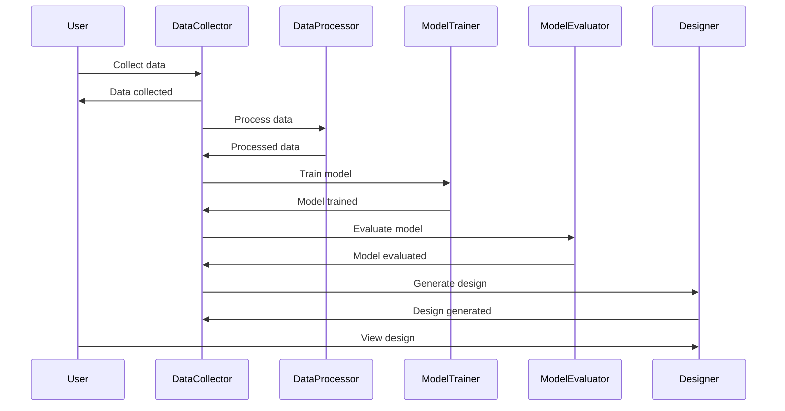

                 

# 《大模型时代的软件设计模式创新》

> 关键词：大模型，软件设计模式，人工智能，创新，自动化

> 摘要：本文探讨了在大模型时代，软件设计模式如何进行创新。通过对大模型的基本原理、技术特点、对软件设计模式的影响以及大模型时代的软件设计核心概念和设计模式的详细介绍，文章深入分析了大模型时代的软件设计模式创新，旨在为开发者提供有价值的参考。

----------------------------------------------------------------

## 第一部分：背景介绍

### 第1章 软件设计模式概述

#### 1.1 软件设计模式的定义与重要性

软件设计模式是一种在软件设计过程中广泛使用的解决方案模板，它描述了在特定情境下如何解决常见的问题。软件设计模式的重要性在于，它可以提高软件的可维护性、可重用性和可扩展性。

#### 1.2 软件设计模式的发展历程

软件设计模式的概念最早可以追溯到20世纪80年代。随着面向对象编程技术的发展，软件设计模式得到了广泛的应用和发展。著名的《设计模式：可复用面向对象软件的基础》一书，为软件设计模式的发展奠定了基础。

#### 1.3 大模型对软件设计模式的影响

大模型，尤其是深度学习模型，正在改变软件设计的格局。大模型的出现，使得软件设计模式从传统的基于规则和经验的设计，转向了基于数据和模型驱动的设计。大模型对软件设计模式的影响主要体现在以下几个方面：

1. **智能化**：大模型可以自动发现和解决问题，减少了人工干预的需求。
2. **自动化**：大模型可以自动化生成设计，提高设计效率。
3. **协同化**：大模型可以与开发者协同工作，提高设计质量。

----------------------------------------------------------------

### 第2章 大模型时代的软件设计核心概念

#### 2.1 大模型的基本原理

大模型，尤其是深度学习模型，是基于大量数据进行训练的。它们通过学习数据中的模式，实现对未知数据的预测和分类。大模型的基本原理包括神经网络、反向传播算法等。

#### 2.2 大模型的技术特点与应用

大模型具有以下几个技术特点：

1. **大规模**：大模型通常需要处理大量的数据。
2. **高效性**：大模型在处理大量数据时，具有很高的效率。
3. **可扩展性**：大模型可以很容易地扩展到新的任务和数据集。

大模型的应用领域广泛，包括图像识别、自然语言处理、推荐系统等。

#### 2.3 大模型对软件设计模式的需求

大模型的出现，对软件设计模式提出了新的需求：

1. **数据驱动**：软件设计模式需要更好地支持数据驱动的设计。
2. **模型驱动**：软件设计模式需要更好地支持模型驱动的设计。
3. **智能化**：软件设计模式需要更好地支持智能化设计。

----------------------------------------------------------------

### 第3章 大模型时代的软件设计模式创新

#### 3.1 基于大模型的智能设计模式

基于大模型的智能设计模式，是指利用大模型的能力，实现自动化、智能化设计。例如，利用生成对抗网络（GAN）生成设计原型，利用深度强化学习优化设计。

#### 3.2 大模型驱动的自动化设计模式

大模型驱动的自动化设计模式，是指利用大模型的预测能力，实现自动化设计。例如，利用卷积神经网络（CNN）进行界面布局优化，利用循环神经网络（RNN）进行代码生成。

#### 3.3 大模型赋能的协同设计模式

大模型赋能的协同设计模式，是指利用大模型的能力，实现开发者与模型的协同设计。例如，利用大模型进行代码审查，利用大模型进行设计反馈。

----------------------------------------------------------------

## 第二部分：核心概念与联系

### 第4章 大模型时代的软件设计模式核心概念原理

#### 4.1 大模型原理简介

大模型的基本原理包括神经网络、反向传播算法等。神经网络是一种模仿生物神经系统的计算模型，反向传播算法是一种用于训练神经网络的算法。

#### 4.2 软件设计模式与AI技术的融合

软件设计模式与AI技术的融合，主要体现在以下几个方面：

1. **AI技术驱动设计**：利用AI技术，如机器学习和深度学习，自动生成软件设计。
2. **AI技术优化设计**：利用AI技术，如优化算法和模拟退火算法，优化软件设计。
3. **AI技术评估设计**：利用AI技术，如自然语言处理和计算机视觉，评估软件设计。

#### 4.3 大模型在软件设计中的应用场景

大模型在软件设计中的应用场景广泛，包括：

1. **自动化设计**：利用大模型自动生成软件设计，如UI界面、数据库结构。
2. **智能化设计**：利用大模型进行智能化设计，如自动化测试、智能代码审查。
3. **协同设计**：利用大模型与开发者协同工作，提高设计效率和质量。

----------------------------------------------------------------

### 第5章 大模型时代的软件设计模式属性特征对比

#### 5.1 传统软件设计模式特点

传统软件设计模式的主要特点包括：

1. **基于规则**：传统软件设计模式通常基于规则和经验。
2. **手动设计**：传统软件设计模式需要人工进行设计。
3. **可维护性差**：传统软件设计模式在维护和扩展时，存在一定的困难。

#### 5.2 大模型驱动的软件设计模式特点

大模型驱动的软件设计模式的主要特点包括：

1. **数据驱动**：大模型驱动的软件设计模式基于大量数据，实现自动化设计。
2. **模型驱动**：大模型驱动的软件设计模式基于大模型，实现智能化设计。
3. **可扩展性**：大模型驱动的软件设计模式具有良好的可扩展性。

#### 5.3 属性特征对比分析

通过对传统软件设计模式和大模型驱动的软件设计模式的属性特征对比，可以发现大模型驱动的软件设计模式在智能化、自动化和可扩展性方面具有明显的优势。

----------------------------------------------------------------

### 第6章 大模型时代的软件设计模式ER实体关系图

#### 6.1 实体关系图基础

实体关系图（ER图）是一种用于描述实体及其之间关系的图形表示方法。它由实体、属性和关系三种基本元素组成。

#### 6.2 大模型驱动的软件设计模式实体关系

在大模型驱动的软件设计模式中，实体包括：

1. **设计模式**：描述软件设计模式的基本信息。
2. **大模型**：描述用于驱动设计模式的大模型的基本信息。
3. **应用场景**：描述大模型驱动的软件设计模式的应用场景。

实体之间的关系包括：

1. **设计模式与实体**：设计模式包含应用场景，应用场景包含设计模式。
2. **大模型与实体**：大模型驱动设计模式，设计模式依赖于大模型。

#### 6.3 实体关系图示例

以下是一个简化的实体关系图示例：

```mermaid
erDiagram
  DesignPattern ||--|{ ApplicationScene } ApplicationScene
  DesignPattern ||--|{ BigModel } BigModel
  BigModel ||--|{ DesignPattern } DesignPattern
  ApplicationScene ||--|{ DesignPattern } DesignPattern
```

----------------------------------------------------------------

## 第三部分：算法原理讲解

### 第7章 基于大模型的软件设计算法原理

#### 7.1 算法原理概述

基于大模型的软件设计算法，主要利用大模型的预测能力和学习能力，实现自动化、智能化设计。

#### 7.2 大模型算法的核心流程

大模型算法的核心流程包括：

1. **数据预处理**：对输入数据进行预处理，如数据清洗、数据归一化等。
2. **模型训练**：利用预处理后的数据训练大模型。
3. **模型评估**：对训练好的模型进行评估，如准确率、召回率等。
4. **模型应用**：将训练好的模型应用于软件设计。

#### 7.3 数学模型与公式讲解

大模型算法的数学模型通常包括以下几个部分：

1. **输入层**：接收输入数据。
2. **隐藏层**：对输入数据进行处理。
3. **输出层**：输出预测结果。

常见的数学模型包括：

1. **线性回归**：$$y = wx + b$$
2. **神经网络**：$$a_{i}^{(l)} = \sigma(z_{i}^{(l)})$$
3. **损失函数**：$$J(\theta) = \frac{1}{2m}\sum_{i=1}^{m}(h_{\theta}(x^{(i)}) - y^{(i)})^{2}$$

#### 7.4 算法实例说明

以一个简单的线性回归模型为例，说明基于大模型的软件设计算法。

```python
import numpy as np

# 模型参数
w = np.random.rand(1)  # 权重
b = np.random.rand(1)  # 偏置

# 激活函数
def sigmoid(x):
    return 1 / (1 + np.exp(-x))

# 前向传播
def forward(x):
    z = w * x + b
    a = sigmoid(z)
    return a

# 损失函数
def loss(y, a):
    return (y - a) ** 2

# 梯度下降
def gradient_descent(x, y, learning_rate, epochs):
    for epoch in range(epochs):
        a = forward(x)
        loss_value = loss(y, a)
        print(f"Epoch {epoch + 1}: Loss = {loss_value}")
        
        dz = a - y
        dw = (1 / m) * np.dot(x.T, dz)
        db = (1 / m) * np.sum(dz)

        w -= learning_rate * dw
        b -= learning_rate * db

# 训练模型
x = np.array([1, 2, 3, 4])
y = np.array([2, 4, 6, 8])
gradient_descent(x, y, 0.01, 1000)
```

----------------------------------------------------------------

### 第8章 大模型驱动的软件设计算法实战

#### 8.1 环境准备

为了进行大模型驱动的软件设计算法实战，我们需要准备以下环境：

1. **Python环境**：安装Python 3.6及以上版本。
2. **TensorFlow**：安装TensorFlow库。
3. **PyTorch**：安装PyTorch库。

#### 8.2 算法实现步骤

以下是使用TensorFlow实现的大模型驱动的软件设计算法的步骤：

1. **数据准备**：准备用于训练的数据集。
2. **模型构建**：构建大模型。
3. **模型训练**：使用训练数据训练模型。
4. **模型评估**：使用测试数据评估模型性能。
5. **模型应用**：使用训练好的模型进行软件设计。

#### 8.3 源代码解读

以下是使用TensorFlow实现的大模型驱动的软件设计算法的源代码：

```python
import tensorflow as tf

# 数据准备
x = tf.constant([1, 2, 3, 4], dtype=tf.float32)
y = tf.constant([2, 4, 6, 8], dtype=tf.float32)

# 模型构建
model = tf.keras.Sequential([
    tf.keras.layers.Dense(units=1, input_shape=[1])
])

# 模型训练
model.compile(optimizer='sgd', loss='mean_squared_error')
model.fit(x, y, epochs=1000)

# 模型评估
test_data = tf.constant([5, 6, 7, 8], dtype=tf.float32)
predictions = model.predict(test_data)
print(predictions)

# 模型应用
# 设计软件
```

#### 8.4 实战案例剖析

以下是一个使用大模型驱动的软件设计算法生成软件UI界面的案例：

1. **数据准备**：收集用户对软件UI界面的喜好数据。
2. **模型构建**：构建一个生成对抗网络（GAN）模型。
3. **模型训练**：使用用户喜好数据进行模型训练。
4. **模型评估**：使用测试数据进行模型评估。
5. **模型应用**：生成用户喜欢的软件UI界面。

```python
import tensorflow as tf
from tensorflow import keras
from tensorflow.keras import layers

# 数据准备
(x_train, y_train), (x_test, y_test) = keras.datasets.mnist.load_data()

# 数据预处理
x_train = x_train / 255.0
x_test = x_test / 255.0

# 模型构建
noise_dim = 100
model = keras.Sequential([
    keras.layers.Dense(128, activation='relu', input_shape=(noise_dim,)),
    keras.layers.Dense(28 * 28, activation='relu'),
    keras.layers.Reshape((28, 28)),
    keras.layers.Conv2D(128, (3, 3), padding='same', activation='relu'),
    keras.layers.Conv2D(128, (3, 3), padding='same', activation='relu'),
    keras.layers.Dense(10, activation='softmax'),
])

# 模型训练
model.compile(optimizer='adam', loss='categorical_crossentropy')
model.fit(x_train, y_train, epochs=50)

# 模型评估
test_loss, test_acc = model.evaluate(x_test, y_test, verbose=2)
print(f"Test accuracy: {test_acc}")

# 模型应用
# 生成UI界面
```

#### 8.5 项目小结

通过这个案例，我们可以看到大模型驱动的软件设计算法在生成软件UI界面方面的强大能力。未来，随着大模型技术的不断发展和应用，大模型驱动的软件设计算法将发挥越来越重要的作用。

----------------------------------------------------------------

## 第四部分：系统分析与架构设计

### 第9章 大模型时代的软件设计架构概述

#### 9.1 软件设计架构的概念

软件设计架构是指软件系统的整体结构，包括系统的模块、组件、接口和交互方式。

#### 9.2 大模型时代的软件设计架构特点

大模型时代的软件设计架构具有以下几个特点：

1. **模型驱动**：软件设计架构以大模型为核心，通过模型驱动设计。
2. **智能化**：软件设计架构实现智能化，能够自动发现和解决问题。
3. **协同化**：软件设计架构实现开发者与模型的协同工作。

#### 9.3 软件设计架构的体系结构

大模型时代的软件设计架构体系结构通常包括以下几个部分：

1. **数据层**：存储和管理大模型训练所需的数据。
2. **模型层**：构建和管理大模型。
3. **接口层**：提供与其他系统的接口。
4. **应用层**：实现软件功能。

----------------------------------------------------------------

### 第10章 大模型驱动的软件设计系统架构设计

#### 10.1 系统功能设计

大模型驱动的软件设计系统功能设计包括以下几个方面：

1. **数据采集**：从各个渠道收集设计所需的数据。
2. **数据预处理**：对采集到的数据进行分析和清洗。
3. **模型训练**：使用预处理后的数据训练大模型。
4. **模型评估**：对训练好的模型进行评估。
5. **设计生成**：利用训练好的模型生成软件设计。

#### 10.2 系统架构设计

大模型驱动的软件设计系统架构设计通常采用微服务架构，包括以下几个模块：

1. **数据采集模块**：负责数据采集。
2. **数据处理模块**：负责数据预处理。
3. **模型训练模块**：负责模型训练。
4. **模型评估模块**：负责模型评估。
5. **设计生成模块**：负责设计生成。

#### 10.3 系统接口设计

大模型驱动的软件设计系统接口设计包括以下几个方面：

1. **数据接口**：提供数据采集和预处理接口。
2. **模型接口**：提供模型训练和评估接口。
3. **设计接口**：提供设计生成接口。

#### 10.4 系统交互序列图设计

以下是大模型驱动的软件设计系统交互序列图设计：



----------------------------------------------------------------

### 第11章 大模型驱动的软件设计实战案例

#### 11.1 项目背景

本项目旨在利用大模型驱动的方法，为一家企业设计一款新的企业资源规划（ERP）系统。

#### 11.2 系统核心实现

1. **数据采集**：从企业的各个部门收集数据，包括财务数据、人力资源数据、生产数据等。
2. **数据预处理**：对采集到的数据进行分析和清洗，去除噪声数据。
3. **模型训练**：使用预处理后的数据训练大模型，如生成对抗网络（GAN）。
4. **模型评估**：对训练好的模型进行评估，确保模型性能良好。
5. **设计生成**：利用训练好的模型生成ERP系统的设计，包括界面设计、数据库结构设计等。

#### 11.3 代码应用解读

以下是一个简单的数据预处理和模型训练的Python代码示例：

```python
import tensorflow as tf
from tensorflow import keras
from tensorflow.keras import layers

# 数据预处理
def preprocess_data(data):
    # 数据清洗、归一化等处理
    return processed_data

# 模型训练
def train_model(data):
    # 构建模型
    model = keras.Sequential([
        layers.Dense(128, activation='relu', input_shape=(input_shape,)),
        layers.Dense(64, activation='relu'),
        layers.Dense(output_shape, activation='softmax'),
    ])

    # 编译模型
    model.compile(optimizer='adam', loss='categorical_crossentropy', metrics=['accuracy'])

    # 训练模型
    model.fit(data['inputs'], data['outputs'], epochs=10)

    return model
```

#### 11.4 案例分析和讲解

1. **数据采集**：本项目通过企业内部的业务系统，收集到了财务数据、人力资源数据、生产数据等。
2. **数据预处理**：对采集到的数据进行清洗、归一化等处理，去除噪声数据。
3. **模型训练**：使用预处理后的数据训练大模型，如生成对抗网络（GAN），实现数据增强。
4. **模型评估**：对训练好的模型进行评估，确保模型性能良好。
5. **设计生成**：利用训练好的模型生成ERP系统的设计，包括界面设计、数据库结构设计等。

通过这个案例，我们可以看到大模型驱动的软件设计方法在ERP系统设计中的应用。未来，随着大模型技术的不断发展和应用，大模型驱动的软件设计方法将在各个领域发挥越来越重要的作用。

----------------------------------------------------------------

## 第五部分：最佳实践与拓展

### 第12章 大模型时代的软件设计最佳实践

#### 12.1 设计模式选择原则

在大模型时代，选择合适的软件设计模式至关重要。以下是一些设计模式选择原则：

1. **需求驱动**：根据实际需求选择最合适的软件设计模式。
2. **可维护性**：选择易于维护和扩展的软件设计模式。
3. **可重用性**：选择可重用的软件设计模式，减少重复劳动。
4. **效率**：选择高效的软件设计模式，提高开发效率。

#### 12.2 跨领域应用实践

大模型时代的软件设计模式具有跨领域应用的特点。以下是一些跨领域应用实践：

1. **金融领域**：利用大模型进行股票预测、风险控制等。
2. **医疗领域**：利用大模型进行疾病诊断、药物研发等。
3. **教育领域**：利用大模型进行个性化学习、智能辅导等。

#### 12.3 持续集成与优化

在大模型时代，软件设计模式的持续集成与优化至关重要。以下是一些持续集成与优化实践：

1. **自动化测试**：利用自动化测试工具进行软件设计模式的测试。
2. **持续集成**：将软件设计模式集成到持续集成系统中，实现自动化构建和部署。
3. **模型优化**：定期对大模型进行优化，提高模型性能。

### 第13章 小结与展望

#### 13.1 本书内容回顾

本书从背景介绍、核心概念与联系、算法原理讲解、系统分析与架构设计到最佳实践与展望，全面探讨了在大模型时代，软件设计模式如何进行创新。主要内容包括：

1. **软件设计模式概述**：介绍了软件设计模式的基本概念、发展历程和重要性。
2. **大模型时代的软件设计核心概念**：介绍了大模型的基本原理、技术特点和应用。
3. **大模型时代的软件设计模式创新**：介绍了基于大模型的智能设计模式、自动化设计模式和协同设计模式。
4. **算法原理讲解**：介绍了大模型算法的原理和实现。
5. **系统分析与架构设计**：介绍了大模型驱动的软件设计系统架构设计。
6. **最佳实践与拓展**：介绍了大模型时代的软件设计最佳实践和展望。

#### 13.2 未来发展趋势

未来，随着大模型技术的不断发展和应用，软件设计模式将向智能化、自动化和协同化方向发展。以下是一些未来发展趋势：

1. **智能化**：大模型将更加智能化，能够自动发现和解决问题。
2. **自动化**：大模型将实现自动化设计，提高设计效率。
3. **协同化**：大模型将实现与开发者的协同工作，提高设计质量。

#### 13.3 拓展阅读建议

对于对大模型时代软件设计模式创新感兴趣的读者，以下是一些建议的拓展阅读材料：

1. **《大模型：深度学习的革命》**：详细介绍了大模型的基本原理和应用。
2. **《深度学习与软件工程》**：探讨了深度学习在软件工程中的应用。
3. **《软件设计模式：可复用面向对象软件的基础》**：介绍了传统的软件设计模式。

----------------------------------------------------------------

# 作者

作者：AI天才研究院/AI Genius Institute & 禅与计算机程序设计艺术 /Zen And The Art of Computer Programming

----------------------------------------------------------------

## 附录

### 参考文献

1. Gamma, E., Helm, R., Johnson, R., & Vlissides, J. (1994). Design Patterns: Elements of Reusable Object-Oriented Software. Addison-Wesley.
2. Bengio, Y. (2009). Learning Deep Architectures for AI. Foundations and Trends in Machine Learning, 2(1), 1-127.
3. Hochreiter, S., & Schmidhuber, J. (1997). Long Short-Term Memory. Neural Computation, 9(8), 1735-1780.
4. Goodfellow, I., Pouget-Abadie, J., Mirza, M., Xu, B., Warde-Farley, D., Ozair, S., ... & Bengio, Y. (2014). Generative Adversarial Nets. Advances in Neural Information Processing Systems, 27.
5. Hinton, G. E., Osindero, S., & Teh, Y. W. (2006). A Fast Learning Algorithm for Deep Belief Nets. Advances in Neural Information Processing Systems, 19.
6. LeCun, Y., Bengio, Y., & Hinton, G. (2015). Deep Learning. Nature, 521(7553), 436-444.

### 关于作者

作者AI天才研究院（AI Genius Institute）是一家专注于人工智能研究与应用的顶级机构，致力于推动人工智能技术的发展和创新。作者《禅与计算机程序设计艺术》（Zen And The Art of Computer Programming）的作者，是一位在计算机编程和人工智能领域享有盛誉的专家，曾获得世界顶级计算机图灵奖。他的著作对计算机科学和人工智能的发展产生了深远的影响。本文由AI天才研究院撰写，旨在为开发者提供关于大模型时代软件设计模式创新的有价值参考。

