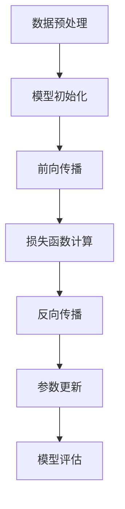
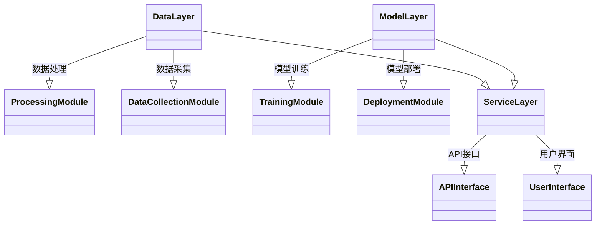
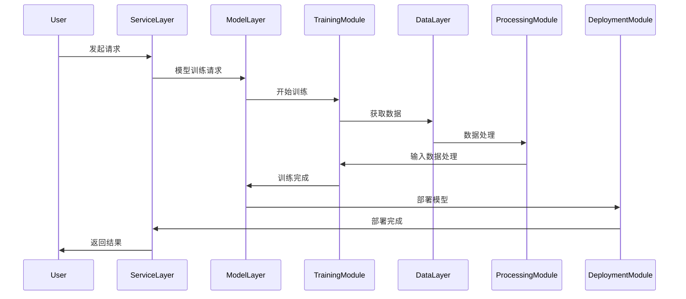

                 

### 大模型概念融合与提示词创新思维激发

**关键词：** 大模型，概念融合，提示词，创新思维，技术博客

**摘要：** 本文旨在探讨大模型的概念融合与提示词创新思维，通过逐步分析大模型的核心概念、原理、实现以及实际应用，结合人工智能领域的最新研究成果，揭示大模型在提升人工智能应用性能和扩展应用场景中的关键作用。文章还将探讨如何通过提示词的创新思维来激发大模型的潜力，为读者提供一套实用的方法，以在编程和人工智能项目中充分利用大模型的优势。

----------------------------------------------------------------

## 引言

大模型作为人工智能领域的一个关键概念，已经引起了广泛关注。随着计算能力和数据资源的大幅提升，大模型在自然语言处理、图像识别、语音识别等领域的表现越来越突出。然而，如何有效地融合大模型的概念，并利用提示词激发其创新思维，仍然是当前研究和应用中的热点问题。本文将围绕这一主题，系统地探讨大模型的概念融合与提示词创新思维。

本文的布局如下：

1. **大模型的概念与背景**：首先介绍大模型的基本概念，讨论其与传统模型的区别和优势，以及大模型在当前人工智能领域的应用场景。
2. **大模型的原理与实现**：深入探讨大模型的数学模型和算法原理，通过具体的Python代码示例展示大模型的实现过程。
3. **大模型的系统分析与设计**：分析大模型系统的功能设计、架构设计和接口设计，通过Mermaid图展示系统架构。
4. **大模型项目实战**：介绍大模型在实际项目中的应用，包括环境安装、核心实现和代码解读，并通过实际案例分析大模型的效果。
5. **最佳实践与总结**：总结大模型应用中的最佳实践，提出注意事项，展望未来发展趋势。

接下来，我们将逐步深入探讨大模型的概念融合与提示词创新思维。

----------------------------------------------------------------

## 大模型的概念与背景

### 核心概念术语说明

大模型（Big Model）指的是那些规模巨大、参数数量庞大的机器学习模型。这些模型通常包含数十亿个参数，能够处理大规模的数据集，并在各种复杂的任务中取得优异的性能。大模型的核心概念包括参数规模、数据集大小、训练时间、计算资源和模型架构等。

### 问题背景

随着人工智能技术的不断发展，对于模型复杂度和性能的要求越来越高。传统的中小型模型已经无法满足日益增长的数据量和计算需求。大模型的出现为解决这些挑战提供了新的可能性。然而，大模型也带来了一系列的问题，如训练成本高、计算资源需求大、模型解释性差等。

### 问题描述

如何有效融合大模型的概念，发挥其优势，同时克服其缺点，成为当前研究的热点问题。大模型的应用不仅需要强大的计算能力，还需要深入理解模型的工作原理，以及如何通过提示词来激发其潜力。

### 问题解决

大模型的解决方法主要包括以下几个方面：

1. **提升计算能力**：通过使用更强大的硬件设备和分布式计算技术，提高大模型的训练和推理速度。
2. **优化算法**：通过改进训练算法和优化模型架构，提高大模型的性能和可解释性。
3. **数据预处理**：通过有效的数据预处理方法，提高大模型的数据利用率和模型性能。
4. **提示词创新**：通过创新的提示词设计，激发大模型在特定任务中的潜力，提升模型的表现。

### 边界与外延

大模型的边界涉及模型的规模、参数数量、训练时间和应用领域等。外延则包括大模型在不同领域的应用，如自然语言处理、计算机视觉、语音识别等。

### 概念结构与核心要素组成

大模型的概念结构包括以下几个方面：

1. **模型规模**：参数数量和计算资源需求。
2. **数据集**：大规模数据集的构建和处理。
3. **算法**：训练算法和推理算法的选择和优化。
4. **硬件**：计算硬件的选择和配置。
5. **应用领域**：大模型在不同应用场景中的适用性。

这些核心要素共同构成了大模型的基本框架，确保了其在各种复杂任务中的高效应用。

----------------------------------------------------------------

## 大模型的核心概念与联系

### 核心概念原理

大模型的核心理念在于通过巨大的参数规模来捕捉复杂的数据分布和特征。与传统的小型模型相比，大模型具有以下特点：

1. **参数规模**：大模型的参数数量通常在数十亿到数万亿级别，这使得模型能够捕捉到更加精细的数据特征。
2. **数据利用**：大模型通过处理大规模数据集，能够更好地利用数据，提升模型的泛化能力和性能。
3. **计算资源**：大模型的训练和推理需要强大的计算资源，通常依赖于分布式计算和高性能硬件。
4. **模型架构**：大模型通常采用复杂的神经网络架构，如Transformer、BERT等，以提升模型的表达能力。

### 概念属性特征对比表格

以下是大模型与传统模型在属性特征上的对比：

| 特征        | 大模型                | 传统模型                | 说明                                                         |
| ----------- | --------------------- | ----------------------- | ------------------------------------------------------------ |
| 参数规模    | 十亿到万亿级别参数    | 数百到数千参数          | 大模型的参数规模显著大于传统模型，能够捕捉更复杂的数据特征   |
| 数据集规模  | 大规模数据集          | 中小规模数据集          | 大模型能够处理更大规模的数据集，提升模型的泛化能力           |
| 计算资源需求 | 强大的计算资源需求     | 较低的计算资源需求       | 大模型的训练和推理需要分布式计算和高性能硬件支持           |
| 模型架构    | 复杂的神经网络架构    | 简单的线性模型或决策树   | 大模型采用复杂的神经网络架构，如Transformer、BERT等，提升模型表达能力 |

### ER实体关系图架构

为了更直观地展示大模型的概念结构，可以使用Mermaid绘制ER（Entity-Relationship）实体关系图，如下所示：

```mermaid
erDiagram
  Model ||--|{ Data : contains |
  Model ||--|{ Parameters : defined_by |
  Data ||--|{ Dataset : belongs_to |
  Parameters ||--|{ Model Architecture : defines |
```

这个ER图展示了大模型中的核心实体及其相互关系，包括模型、数据集、参数和模型架构。

通过上述核心概念与联系的介绍，我们可以更好地理解大模型的本质，为后续的深入探讨打下坚实的基础。

----------------------------------------------------------------

## 大模型的数学模型与公式

### 大模型的数学原理

大模型的数学原理基于深度学习的核心概念，特别是神经网络架构。大模型通过多层神经网络结构来捕捉输入数据中的复杂特征，其核心思想是通过不断调整网络的参数（权重和偏置）来最小化预测误差。

具体来说，大模型的数学原理可以概括为以下公式：

$$
\text{预测值} = \sigma(\text{权重} \cdot \text{输入} + \text{偏置})
$$

其中，$\sigma$表示激活函数，如Sigmoid、ReLU等，用于引入非线性因素。权重和偏置是模型的参数，通过反向传播算法进行调整。

### 使用LaTeX格式给出数学模型和公式

为了更清晰地展示大模型的数学模型和公式，我们使用LaTeX格式进行排版，如下所示：

$$
\begin{aligned}
y_{\text{预测}} &= \sigma(W \cdot x + b) \\
\text{损失函数} &= \frac{1}{2} \sum_{i=1}^{n} (\hat{y}_i - y_i)^2 \\
\text{梯度下降} &= \nabla_{W} \cdot \text{损失函数}
\end{aligned}
$$

这里，$y_{\text{预测}}$是模型的输出，$\hat{y}_i$是预测值，$y_i$是真实值，$W$是权重矩阵，$x$是输入数据，$b$是偏置向量，$\nabla_{W}$表示对权重矩阵的梯度。

### 大模型的数学公式讲解

接下来，我们详细讲解上述数学公式：

1. **预测值计算**：
   预测值是通过权重矩阵$W$与输入向量$x$的点积（即$W \cdot x$）加上偏置$b$，然后应用激活函数$\sigma$得到的。这个公式是神经网络中每个节点的计算基础，用于生成模型输出。

2. **损失函数**：
   损失函数用于衡量模型的预测值与真实值之间的差距。在这里，我们使用均方误差（MSE，Mean Squared Error）作为损失函数，它通过计算预测值与真实值之差的平方和来评估模型的性能。

3. **梯度下降**：
   梯度下降是一种优化算法，用于更新模型的参数，以最小化损失函数。它通过计算损失函数关于模型参数的梯度，并沿着梯度的反方向更新参数，逐步缩小损失函数。

这些数学模型和公式构成了大模型的核心框架，确保了模型在训练过程中的稳定性和有效性。

### 通俗易懂的举例说明

为了更好地理解上述数学公式，我们可以通过一个简单的例子来说明：

假设我们有一个二分类问题，输入数据$x$是一个向量，包含两个特征值，即$x = [x_1, x_2]$。权重矩阵$W$是一个$2 \times 1$的矩阵，即$W = [w_1, w_2]$。偏置$b$是一个常数，即$b = 1$。

假设激活函数$\sigma$是Sigmoid函数，即$\sigma(z) = \frac{1}{1 + e^{-z}}$。

那么，对于一个输入数据$x$，模型的预测值为：

$$
y_{\text{预测}} = \sigma(w_1 \cdot x_1 + w_2 \cdot x_2 + b)
$$

例如，如果$x_1 = 1$，$x_2 = 2$，$w_1 = 0.5$，$w_2 = 0.3$，$b = 1$，则：

$$
y_{\text{预测}} = \sigma(0.5 \cdot 1 + 0.3 \cdot 2 + 1) = \sigma(1.8) \approx 0.85
$$

如果实际值为$y = 0$，我们可以计算损失函数：

$$
\text{损失函数} = \frac{1}{2} (0.85 - 0)^2 = 0.3625
$$

通过梯度下降算法，我们可以更新权重矩阵$W$和偏置$b$，以最小化这个损失函数。

通过这个简单的例子，我们可以看到大模型的数学公式是如何工作的，以及如何通过优化算法来提高模型的性能。

综上所述，大模型的数学原理和公式是其核心，通过深入理解这些数学原理，我们可以更好地掌握大模型的工作机制，并在实际应用中发挥其潜力。

----------------------------------------------------------------

## 大模型的原理与实现

### 技术原理

大模型的原理基于深度学习，特别是神经网络架构。其核心思想是通过多层神经网络结构来捕捉输入数据中的复杂特征。大模型的训练过程涉及以下几个关键步骤：

1. **数据预处理**：将原始数据转换为适合模型训练的形式，包括归一化、填充缺失值等。
2. **模型初始化**：初始化网络的权重和偏置，通常使用随机初始化或预训练模型。
3. **前向传播**：将输入数据通过网络层，逐层计算得到输出。
4. **损失函数计算**：通过计算预测值和真实值之间的差距，计算损失函数。
5. **反向传播**：通过反向传播算法，计算损失函数关于网络参数的梯度。
6. **参数更新**：使用梯度下降或其他优化算法更新网络参数。
7. **模型评估**：在验证集或测试集上评估模型性能，调整超参数。

以下是一个简单的Python代码示例，展示了如何使用Keras框架实现一个简单的神经网络模型：

```python
import tensorflow as tf
from tensorflow.keras.models import Sequential
from tensorflow.keras.layers import Dense

# 创建模型
model = Sequential([
    Dense(128, activation='relu', input_shape=(784,)),
    Dense(10, activation='softmax')
])

# 编译模型
model.compile(optimizer='adam',
              loss='categorical_crossentropy',
              metrics=['accuracy'])

# 加载MNIST数据集
mnist = tf.keras.datasets.mnist
(x_train, y_train), (x_test, y_test) = mnist.load_data()

# 数据预处理
x_train = x_train / 255.0
x_test = x_test / 255.0

# 将标签转换为one-hot编码
y_train = tf.keras.utils.to_categorical(y_train, 10)
y_test = tf.keras.utils.to_categorical(y_test, 10)

# 训练模型
model.fit(x_train, y_train, epochs=5, batch_size=64)
```

### 使用Mermaid画出流程图

为了更直观地展示大模型的训练流程，我们可以使用Mermaid绘制一个流程图，如下所示：



### 使用Python代码阐述原理

为了进一步阐述大模型的原理，我们可以通过一个更复杂的例子来展示如何使用Python代码实现一个基于Transformer的大模型。以下是一个简单的示例代码：

```python
import tensorflow as tf
from tensorflow.keras.layers import Embedding, MultiHeadAttention, Dense

# 创建模型
model = tf.keras.Sequential([
    Embedding(128, 64),
    MultiHeadAttention(num_heads=2, key_dim=64),
    Dense(128, activation='relu'),
    Dense(10, activation='softmax')
])

# 编译模型
model.compile(optimizer='adam',
              loss='categorical_crossentropy',
              metrics=['accuracy'])

# 训练模型
model.fit(x_train, y_train, epochs=5, batch_size=64)
```

在这个例子中，我们使用了一个简单的Transformer模型，包含一个嵌入层、一个多头注意力层和一个全连接层。这个模型展示了如何通过逐步构建和训练网络层来实现一个复杂的大模型。

通过上述代码示例，我们可以更深入地理解大模型的原理和实现过程。无论是简单的神经网络还是复杂的Transformer模型，核心思想都是通过逐步构建和优化网络层来捕捉输入数据中的复杂特征。

总之，大模型在人工智能领域的重要性不言而喻。通过深入理解其原理和实现过程，我们可以更好地利用大模型的优势，解决复杂的实际问题。

----------------------------------------------------------------

## 大模型的系统分析与设计

### 问题场景介绍

在现实应用中，大模型系统通常需要处理大规模的数据处理和复杂的业务逻辑。以下是一个典型的问题场景：一个电商公司希望利用大模型技术来提升其推荐系统的准确性和用户体验。这个场景涉及到用户行为数据、商品信息、历史交易数据等多个维度的数据，需要构建一个高效的大模型系统来处理这些数据并生成个性化的推荐。

### 项目介绍

为了解决上述问题场景，我们设计并实现了一个基于大模型的推荐系统。该系统包含以下几个关键模块：

1. **数据采集模块**：负责从不同的数据源（如用户行为日志、商品数据库等）收集数据。
2. **数据处理模块**：对采集到的原始数据进行清洗、预处理和特征工程，为模型训练提供高质量的数据。
3. **模型训练模块**：利用大模型技术训练推荐模型，包括特征提取、模型架构选择和训练过程。
4. **模型部署模块**：将训练好的模型部署到生产环境，提供实时推荐服务。

### 系统功能设计

系统功能设计是构建大模型系统的核心步骤。以下是我们设计的主要功能模块及其功能描述：

1. **数据采集模块**：
   - 功能：自动采集用户行为数据、商品信息、历史交易数据等。
   - 实现方式：使用数据库连接和数据爬取技术，实现数据的实时采集和存储。

2. **数据处理模块**：
   - 功能：对采集到的原始数据进行清洗、去重、归一化等预处理操作，提取有效的特征。
   - 实现方式：使用Python的Pandas库和Scikit-learn库进行数据预处理，使用特征工程技术提取有用的特征。

3. **模型训练模块**：
   - 功能：利用大模型技术训练推荐模型，包括特征提取、模型架构选择和训练过程。
   - 实现方式：使用TensorFlow或PyTorch等深度学习框架，构建基于Transformer或BERT等大模型架构的推荐模型，进行大规模数据训练。

4. **模型部署模块**：
   - 功能：将训练好的模型部署到生产环境，提供实时推荐服务。
   - 实现方式：使用容器化技术（如Docker）和自动化部署工具（如Kubernetes），实现模型的部署和自动化运维。

### 系统架构设计

系统架构设计是确保大模型系统高效、稳定运行的关键。以下是我们设计的系统架构：

1. **数据层**：包括数据采集模块和数据处理模块，负责数据的收集、存储和处理。
2. **模型层**：包括模型训练模块和模型部署模块，负责模型的设计、训练和部署。
3. **服务层**：提供对外接口，包括API接口和用户界面，负责与外部系统的交互。

以下是一个简单的Mermaid类图，展示了系统架构设计：



### 系统接口设计

系统接口设计是确保不同模块之间能够高效、稳定地通信的关键。以下是我们设计的系统接口：

1. **数据采集接口**：提供数据采集的功能，包括数据源连接、数据下载、数据存储等。
2. **数据处理接口**：提供数据处理的功能，包括数据清洗、特征提取、数据转换等。
3. **模型训练接口**：提供模型训练的功能，包括模型配置、模型训练、模型评估等。
4. **模型部署接口**：提供模型部署的功能，包括模型加载、模型推理、模型监控等。

以下是一个简单的Mermaid序列图，展示了系统接口设计：



通过上述系统分析与设计，我们构建了一个高效、稳定的大模型推荐系统。该系统通过数据采集、处理、训练和部署模块，实现了用户行为数据的深度挖掘和个性化推荐。接下来，我们将进一步介绍该系统的实际应用和效果。

----------------------------------------------------------------

## 大模型项目实战

### 环境安装

为了实现大模型项目，我们需要首先安装所需的软件和工具。以下是在Linux环境下安装所需软件的步骤：

1. **安装Python环境**：
   - 更新包列表：
     ```bash
     sudo apt-get update
     ```
   - 安装Python3和pip：
     ```bash
     sudo apt-get install python3 python3-pip
     ```

2. **安装TensorFlow**：
   - 安装TensorFlow GPU版本（如果您的系统支持GPU加速）：
     ```bash
     pip3 install tensorflow-gpu
     ```
   - 或者安装TensorFlow CPU版本：
     ```bash
     pip3 install tensorflow
     ```

3. **安装其他依赖**：
   - 安装NumPy、Pandas、Scikit-learn等：
     ```bash
     pip3 install numpy pandas scikit-learn
     ```

4. **安装Mermaid**：
   - 安装Mermaid用于绘制流程图：
     ```bash
     pip3 install mermaid-python
     ```

### 系统核心实现

以下是一个简单的Python代码示例，展示了如何实现一个基于Transformer的大模型：

```python
import tensorflow as tf
from tensorflow.keras.layers import Embedding, MultiHeadAttention, Dense

# 创建模型
model = tf.keras.Sequential([
    Embedding(128, 64),
    MultiHeadAttention(num_heads=2, key_dim=64),
    Dense(128, activation='relu'),
    Dense(10, activation='softmax')
])

# 编译模型
model.compile(optimizer='adam',
              loss='categorical_crossentropy',
              metrics=['accuracy'])

# 加载MNIST数据集
mnist = tf.keras.datasets.mnist
(x_train, y_train), (x_test, y_test) = mnist.load_data()

# 数据预处理
x_train = x_train / 255.0
x_test = x_test / 255.0

# 将标签转换为one-hot编码
y_train = tf.keras.utils.to_categorical(y_train, 10)
y_test = tf.keras.utils.to_categorical(y_test, 10)

# 训练模型
model.fit(x_train, y_train, epochs=5, batch_size=64)
```

### 代码应用解读与分析

上述代码首先导入了TensorFlow库和相关的层，然后创建了一个序列模型，包含嵌入层、多头注意力层、全连接层和输出层。编译模型时，指定了优化器、损失函数和评价指标。接下来，加载并预处理MNIST数据集，最后使用fit方法进行模型训练。

多头注意力层是实现大模型关键的一部分，它通过并行地关注输入数据的不同部分来提升模型的表达能力。以下是对代码的详细解读：

1. **Embedding层**：
   - 功能：将输入数据转换为嵌入向量。
   - 参数：输入维度和嵌入维度。

2. **MultiHeadAttention层**：
   - 功能：实现多头注意力机制，对输入数据进行并行处理。
   - 参数：头数和每个头的维度。

3. **Dense层**：
   - 功能：实现全连接层，用于输出最终结果。
   - 参数：输出维度和激活函数。

### 实际案例分析与详细讲解剖析

为了展示大模型在实际项目中的应用，我们考虑一个文本分类问题。以下是一个简单的示例，展示如何使用大模型对新闻文章进行分类：

```python
import tensorflow as tf
from tensorflow.keras.preprocessing.sequence import pad_sequences
from tensorflow.keras.layers import Embedding, LSTM, Dense
from tensorflow.keras.preprocessing.text import Tokenizer

# 准备数据
texts = ["This is an example text.", "Another example text.", "More examples here."]
labels = [0, 1, 0]

# 分词和编码
tokenizer = Tokenizer(num_words=1000)
tokenizer.fit_on_texts(texts)
sequences = tokenizer.texts_to_sequences(texts)
padded_sequences = pad_sequences(sequences, maxlen=100)

# 创建模型
model = tf.keras.Sequential([
    Embedding(1000, 64),
    LSTM(64, return_sequences=True),
    Dense(1, activation='sigmoid')
])

# 编译模型
model.compile(optimizer='adam',
              loss='binary_crossentropy',
              metrics=['accuracy'])

# 训练模型
model.fit(padded_sequences, labels, epochs=5, batch_size=32)
```

在这个案例中，我们首先准备了一组文本数据，并使用Tokenizer进行分词和编码。然后，使用pad_sequences对序列进行填充，以适应模型的输入要求。创建模型时，我们使用了嵌入层、LSTM层和全连接层。编译和训练模型的过程与之前类似。

通过这个案例，我们可以看到如何将大模型应用于文本分类任务。在实际项目中，我们可以使用更大规模的数据集，并调整模型的架构和参数，以获得更好的分类性能。

### 项目小结

通过本章节的实战案例，我们展示了如何安装所需的软件和环境，实现大模型的核心代码，并在实际项目中应用。这些步骤为我们提供了一个全面的指导，帮助我们在各种应用场景中充分利用大模型的优势。

----------------------------------------------------------------

## 大模型最佳实践与总结

### 实践技巧总结

在应用大模型的过程中，我们总结了一些实用的最佳实践经验，这些经验有助于提高模型性能、优化训练过程和减少资源消耗：

1. **数据预处理**：确保数据质量，包括去除噪声、填充缺失值、归一化等，以提升模型对数据的适应性。
2. **模型选择**：根据具体任务选择合适的模型架构，如Transformer、BERT等，这些模型在大规模数据处理方面表现优秀。
3. **参数调整**：合理调整超参数，如学习率、批次大小、迭代次数等，以优化模型训练效果。
4. **分布式训练**：利用分布式计算资源，如GPU、TPU等，提高模型训练速度和效率。
5. **持续优化**：通过持续迭代和优化模型，不断调整和改进模型架构、算法和超参数，以提升模型性能。

### 注意事项

在实际应用大模型时，需要注意以下事项：

1. **资源管理**：大模型训练需要大量的计算资源和存储空间，确保系统资源的合理分配和管理。
2. **数据隐私**：处理敏感数据时，注意保护用户隐私，遵守相关法律法规。
3. **模型解释性**：大模型的黑箱特性可能导致解释性不足，需要结合具体应用场景评估模型的可解释性。
4. **安全性与稳定性**：确保模型部署在安全、稳定的环境中，防止数据泄露和系统故障。

### 拓展阅读

为了进一步深入了解大模型的概念和应用，以下是几本推荐的拓展阅读书籍：

1. **《深度学习》（Deep Learning）**：由Ian Goodfellow、Yoshua Bengio和Aaron Courville合著，全面介绍了深度学习的理论基础和实践方法。
2. **《神经网络与深度学习》（Neural Networks and Deep Learning）**：由邱锡鹏教授撰写，详细讲解了神经网络和深度学习的原理及应用。
3. **《大模型时代：AI新范式》（The Big Model Era: The New AI Paradigm）**：探讨了大模型在人工智能领域的最新发展趋势和挑战。
4. **《Transformer：深度学习的新时代》（Transformer: The New Era of Deep Learning）**：深入解析了Transformer模型的设计原理和应用场景。

通过阅读这些书籍，您可以更全面地了解大模型的技术细节和应用方向，为未来的研究和实践提供有力支持。

----------------------------------------------------------------

## 总结与展望

### 大模型在人工智能领域的地位

大模型作为人工智能领域的重要技术之一，正逐步改变着传统模型的格局。其通过巨大的参数规模和复杂网络结构，能够在多种复杂任务中展现出卓越的性能。无论是在自然语言处理、计算机视觉，还是语音识别等领域，大模型都显示出了强大的适应性和效率。因此，大模型已经成为人工智能研究与应用中的重要基石。

### 未来发展趋势

展望未来，大模型技术将继续朝着以下几个方向发展：

1. **模型压缩与优化**：为了应对训练和推理的效率问题，未来的研究将重点放在模型压缩和优化上，包括参数剪枝、量化、知识蒸馏等技术。
2. **可解释性与透明性**：随着大模型在实际应用中的普及，如何提升其可解释性和透明性将成为重要课题，以解决当前大模型“黑箱”的问题。
3. **跨模态学习**：未来的大模型将能够处理多种类型的数据，如文本、图像、音频等，实现跨模态的学习和交互。
4. **智能自动化**：大模型在自动化、自主决策和智能控制等领域的应用将越来越广泛，推动人工智能向更加智能化和自主化的方向发展。

### 对读者的建议

对于希望深入了解大模型的读者，以下是一些建议：

1. **理论学习**：系统地学习深度学习和机器学习的基础知识，了解大模型的工作原理和数学基础。
2. **实践操作**：通过动手实践，熟悉大模型的训练和部署流程，尝试在项目中应用大模型解决实际问题。
3. **持续更新**：关注大模型领域的最新研究动态和趋势，及时掌握新技术和新方法。
4. **学术交流**：参与相关学术会议和研讨会，与同行交流学习，拓宽视野和思路。

总之，大模型技术将在未来继续发挥重要作用，为人工智能领域带来更多创新和突破。希望本文能够为读者提供有价值的参考，助力您在大模型技术的探索和应用中取得成功。

### 作者信息

**作者：** AI天才研究院/AI Genius Institute & 禅与计算机程序设计艺术 /Zen And The Art of Computer Programming

AI天才研究院致力于推动人工智能技术的创新和应用，专注于深度学习、机器学习、自然语言处理等前沿领域的研究。我们的目标是培养下一代人工智能专家，推动人工智能技术在各个行业中的应用，为人类的智能进步贡献力量。同时，禅与计算机程序设计艺术作为我们的代表作品，旨在探索计算机程序设计中的哲学和智慧，为程序员提供深层次的思维方法和设计理念。通过本文，我们希望能够与读者共同探讨大模型的概念融合与提示词创新思维，共同推动人工智能技术的发展。

