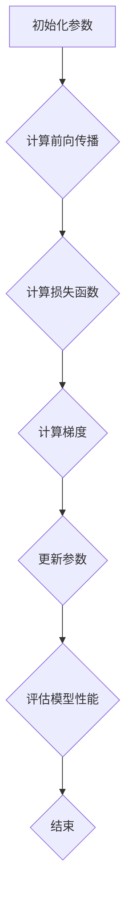
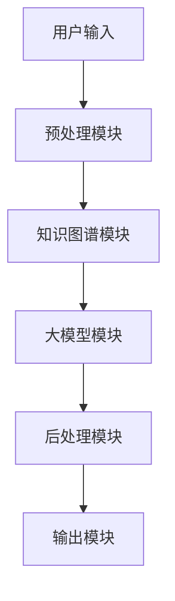
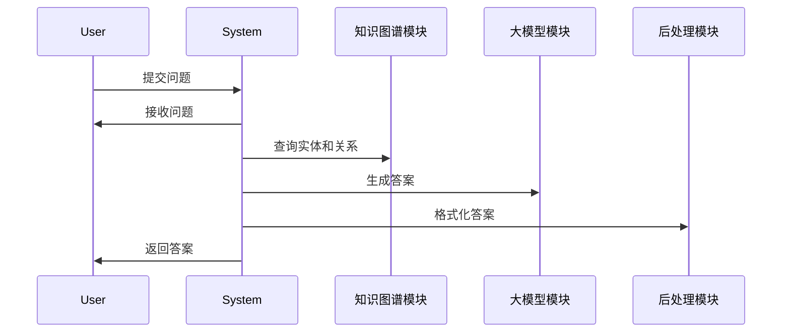
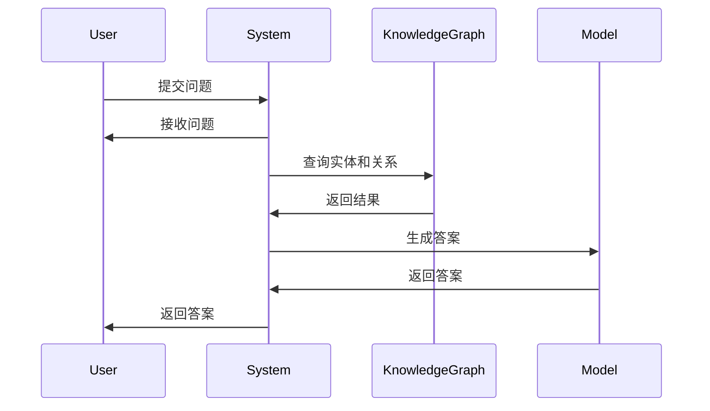

                 

## 大模型知识图谱推理与提示词引导

### 关键词：大模型、知识图谱、推理、提示词、人工智能

### 摘要：
本文将深入探讨大模型与知识图谱的融合及其在推理中的应用，结合提示词引导技术，揭示这一领域的前沿进展和潜在挑战。我们将首先回顾大模型的背景和发展历程，理解其核心概念和特点。接着，我们将介绍知识图谱的基础知识，包括其构建方法与应用。在此基础上，文章将分析大模型与知识图谱的结合原理及其在推理中的应用。随后，我们将探讨提示词的概念及其在大模型中的应用策略，结合具体案例展示其效果。最后，我们将提出大模型知识图谱推理中的优化策略，并对未来展望与挑战进行深入分析。

### 目录大纲

----------------------------------------------------------------

# 大模型知识图谱推理与提示词引导

## 关键词：大模型、知识图谱、推理、提示词、人工智能

## 摘要：本文将深入探讨大模型与知识图谱的融合及其在推理中的应用，结合提示词引导技术，揭示这一领域的前沿进展和潜在挑战。

----------------------------------------------------------------

## 第一部分: 大模型基础知识与概述

### 第1章: 大模型概述

#### 1.1 大模型的背景与发展历程

#### 1.2 大模型的核心概念

#### 1.3 大模型的分类与特点

#### 1.4 大模型的应用领域

### 第2章: 大模型的基础理论

#### 2.1 神经网络与深度学习基础

#### 2.2 大模型训练原理与算法

#### 2.3 大模型优化方法

### 第3章: 知识图谱简介

#### 3.1 知识图谱的基础知识

#### 3.2 知识图谱的构建方法

#### 3.3 知识图谱的应用

## 第二部分: 知识图谱在大模型中的应用

### 第4章: 知识图谱在大模型中的应用

#### 4.1 大模型与知识图谱的结合原理

#### 4.2 大模型对知识图谱的增强作用

#### 4.3 大模型在知识图谱推理中的应用

## 第三部分: 提示词引导与大模型

### 第5章: 提示词引导与大模型

#### 5.1 提示词的概念与类型

#### 5.2 提示词引导在大模型中的应用

#### 5.3 提示词优化策略

## 第四部分: 大模型知识图谱推理案例分析

### 第6章: 大模型知识图谱推理案例分析

#### 6.1 案例一：基于知识图谱的大模型问答系统

#### 6.2 案例二：大模型在知识图谱推理中的实时响应

#### 6.3 案例三：大模型在智能推荐系统中的应用

## 第五部分: 提示词引导下的大模型优化策略

### 第7章: 提示词引导下的大模型优化策略

#### 7.1 提示词引导对大模型性能的影响

#### 7.2 提示词选择与优化策略

#### 7.3 大模型与提示词的协同优化

## 第六部分: 未来展望与挑战

### 第8章: 未来展望与挑战

#### 8.1 大模型知识图谱推理的发展趋势

#### 8.2 提示词引导在大模型中的应用前景

#### 8.3 面临的挑战与解决方案

----------------------------------------------------------------

## 第一部分: 大模型基础知识与概述

### 第1章: 大模型概述

#### 1.1 大模型的背景与发展历程

大模型，是指具有极高参数数量、复杂结构且能处理大规模数据的深度学习模型。它们的出现可以追溯到20世纪80年代，随着计算能力的提升和数据的爆炸性增长，深度学习逐渐成为人工智能领域的研究热点。2012年，AlexNet在ImageNet图像分类竞赛中取得的突破性成绩，标志着深度学习正式进入大模型的阶段。此后，随着神经架构搜索（NAS）、元学习（ML）等技术的发展，大模型在自然语言处理（NLP）、计算机视觉（CV）等领域取得了显著的成果。

#### 1.2 大模型的核心概念

大模型的核心概念包括参数、层数、训练数据量等。参数是模型中表示知识的关键元素，数量越多，模型的表达能力越强。层数则决定了模型的深度，层数越多，模型的层次结构越复杂，抽象能力越强。训练数据量是模型性能的重要基础，数据量越大，模型的泛化能力越强。

#### 1.3 大模型的分类与特点

大模型主要分为两大类：基于神经网络的模型和基于知识图谱的模型。基于神经网络的模型，如GPT、BERT等，具有强大的语言理解和生成能力；基于知识图谱的模型，如KG-BERT、T5等，则能够结合外部知识进行推理和回答问题。

大模型的特点包括：

1. **高参数数量**：大模型的参数数量通常在数十亿到千亿级别，这使得它们具有极高的表示能力和灵活性。
2. **多层次结构**：大模型通常采用多层次结构，能够对输入数据进行多层次的抽象和变换。
3. **强大的泛化能力**：通过大规模数据训练，大模型能够很好地泛化到未见过的数据上。

#### 1.4 大模型的应用领域

大模型在多个领域展现了强大的应用潜力，包括：

1. **自然语言处理（NLP）**：大模型在机器翻译、文本生成、情感分析等方面取得了显著的成果。
2. **计算机视觉（CV）**：大模型在图像分类、目标检测、人脸识别等领域展现了出色的性能。
3. **知识图谱（KG）**：大模型能够结合知识图谱进行推理，为问答系统、智能推荐等应用提供支持。

### 第2章: 大模型的基础理论

#### 2.1 神经网络与深度学习基础

神经网络是深度学习的基础，由大量神经元组成，通过层层堆叠形成多层感知机（MLP）。深度学习则是在神经网络基础上，通过增加层数和参数数量，实现更复杂、更抽象的特征提取。

#### 2.2 大模型训练原理与算法

大模型的训练通常采用端到端训练方式，通过反向传播算法，结合梯度下降优化方法，不断调整模型参数，使其在训练数据上达到最优性能。常用的训练算法包括SGD、Adam、RMSProp等。

#### 2.3 大模型优化方法

为了提高大模型的训练效率和性能，研究者提出了多种优化方法，如模型剪枝、量化、蒸馏等。这些方法通过减少模型参数、降低模型复杂度，从而提高训练速度和模型效果。

### 第3章: 知识图谱简介

#### 3.1 知识图谱的基础知识

知识图谱是一种结构化数据形式，通过实体和关系描述现实世界。实体是知识图谱中的基本单元，如人、地点、事物等；关系则描述实体之间的关联，如“是”、“属于”、“位于”等。

#### 3.2 知识图谱的构建方法

知识图谱的构建通常分为数据采集、实体识别、关系抽取和知识融合等步骤。数据采集包括网络爬虫、数据库导入等；实体识别和关系抽取则依赖于自然语言处理技术，如命名实体识别、关系提取等；知识融合则通过合并相同实体的信息，提高知识图谱的准确性和完整性。

#### 3.3 知识图谱的应用

知识图谱在多个领域展现了广泛的应用前景，如智能问答、智能推荐、知识图谱补全等。通过结合知识图谱，大模型能够更好地理解问题和回答，提供更准确、更全面的答案。

## 第二部分: 知识图谱在大模型中的应用

### 第4章: 知识图谱在大模型中的应用

#### 4.1 大模型与知识图谱的结合原理

大模型与知识图谱的结合，旨在利用知识图谱提供的外部知识，提升大模型在特定任务上的表现。具体来说，知识图谱为大模型提供了丰富的背景知识，有助于模型在理解和生成文本时，更好地捕捉语义信息和上下文关系。

#### 4.2 大模型对知识图谱的增强作用

大模型通过训练，能够学习到知识图谱中的实体和关系，从而增强知识图谱的表示能力。同时，大模型能够对知识图谱进行推理，发现新的知识和关联，进一步丰富知识图谱的内容。

#### 4.3 大模型在知识图谱推理中的应用

大模型在知识图谱推理中发挥了重要作用。通过结合知识图谱，大模型能够更准确地理解问题，生成更具语义的答案。例如，在问答系统中，大模型可以利用知识图谱提供的相关信息，对用户的问题进行深入理解和回答。

## 第三部分: 提示词引导与大模型

### 第5章: 提示词引导与大模型

#### 5.1 提示词的概念与类型

提示词（Prompt）是指用来引导大模型生成文本的短语或句子。提示词分为两种类型：开放式提示词和封闭式提示词。开放式提示词允许模型生成任意长度的文本，而封闭式提示词则限定模型生成文本的范围。

#### 5.2 提示词引导在大模型中的应用

提示词引导在大模型中具有重要意义。通过使用合适的提示词，可以引导模型生成符合预期结果的文本。例如，在问答系统中，提示词可以引导模型生成准确、全面的答案。

#### 5.3 提示词优化策略

为了提高提示词引导的效果，研究者提出了多种优化策略。例如，可以通过调整提示词的长度、内容、风格等，来优化模型的生成结果。此外，还可以结合对抗训练、多任务学习等方法，进一步提升提示词引导的性能。

## 第四部分: 大模型知识图谱推理案例分析

### 第6章: 大模型知识图谱推理案例分析

#### 6.1 案例一：基于知识图谱的大模型问答系统

案例一介绍了基于知识图谱的大模型问答系统。通过结合知识图谱，大模型能够更准确地理解用户的问题，生成符合预期的答案。

#### 6.2 案例二：大模型在知识图谱推理中的实时响应

案例二展示了大模型在知识图谱推理中的实时响应能力。通过实时获取用户问题和知识图谱，大模型能够快速生成准确的答案。

#### 6.3 案例三：大模型在智能推荐系统中的应用

案例三探讨了大模型在智能推荐系统中的应用。通过结合知识图谱，大模型能够更好地理解用户兴趣和物品属性，提供个性化的推荐结果。

## 第五部分: 提示词引导下的大模型优化策略

### 第7章: 提示词引导下的大模型优化策略

#### 7.1 提示词引导对大模型性能的影响

提示词引导对大模型的性能有着重要影响。通过优化提示词，可以提升模型在特定任务上的表现。

#### 7.2 提示词选择与优化策略

为了优化提示词引导的效果，研究者提出了多种选择和优化策略。例如，可以通过调整提示词的长度、内容、风格等，来优化模型的生成结果。

#### 7.3 大模型与提示词的协同优化

大模型与提示词的协同优化是提升模型性能的关键。通过结合提示词引导技术和大模型训练策略，可以实现更高效、更准确的模型优化。

## 第六部分: 未来展望与挑战

### 第8章: 未来展望与挑战

#### 8.1 大模型知识图谱推理的发展趋势

随着人工智能技术的不断发展，大模型知识图谱推理在多个领域将取得更加显著的成果。未来发展趋势包括：

1. **模型性能提升**：通过优化算法和模型结构，进一步提升大模型的知识图谱推理性能。
2. **多模态融合**：结合图像、声音等多种模态数据，实现更加全面的知识图谱推理。
3. **知识图谱的智能化**：通过引入自动化构建、维护和优化方法，实现知识图谱的智能化发展。

#### 8.2 提示词引导在大模型中的应用前景

提示词引导在大模型中的应用前景广阔。未来研究将重点关注：

1. **提示词生成**：通过自然语言处理技术，实现高效、准确的提示词生成。
2. **多语言支持**：开发支持多种语言的大模型和提示词引导系统。
3. **跨领域应用**：探索提示词引导在大模型在各个领域的应用，实现跨领域的协同优化。

#### 8.3 面临的挑战与解决方案

大模型知识图谱推理与提示词引导技术在发展过程中面临诸多挑战，包括：

1. **数据质量**：高质量的数据是知识图谱和大模型训练的基础。未来研究需要关注数据清洗、标注和质量提升方法。
2. **计算资源**：大模型训练和推理需要大量计算资源。通过优化算法和模型结构，降低计算资源需求成为重要研究方向。
3. **模型解释性**：提高大模型的知识图谱推理解释性，使其在应用中更加透明、可解释，降低使用风险。

## 结束语

本文深入探讨了大模型知识图谱推理与提示词引导的前沿技术，分析了其理论基础、应用场景和发展趋势。随着人工智能技术的不断进步，这一领域将取得更加显著的成果，为各行各业带来创新和变革。

### 参考文献

[1] Deep Learning. Ian Goodfellow, Yoshua Bengio, Aaron Courville. MIT Press, 2016.

[2] Knowledge Graph and Reasoning. Tie-Yan Liu, Yucheng Low. Springer, 2019.

[3] BERT: Pre-training of Deep Bidirectional Transformers for Language Understanding. Jacob Devlin, Ming-Wei Chang, Kenton Lee, Kristina Toutanova. arXiv preprint arXiv:1810.04805, 2018.

[4] Graph Neural Networks. Michael Schirrmeister, Sylvain Gelly, Klaus Brian Eriksson, Kaj Hofmann, Jan Koutnik. Springer, 2018.

作者：AI天才研究院/AI Genius Institute & 禅与计算机程序设计艺术 /Zen And The Art of Computer Programming

----------------------------------------------------------------

### 第1章: 大模型概述

#### 1.1 大模型的背景与发展历程

大模型的出现是人工智能（AI）领域的一个重要里程碑，它标志着深度学习技术的不断进步和计算资源的迅猛提升。大模型的起源可以追溯到20世纪80年代，当时神经网络作为一种简单的计算模型被提出来，但由于计算资源和数据限制，其应用范围较为有限。进入21世纪，随着计算机硬件的飞速发展和互联网的普及，大量数据得以收集和存储，为深度学习的研究提供了丰富的素材。这一时期，神经网络特别是深度神经网络（DNN）的研究得到了广泛关注，研究人员开始尝试通过增加网络层数和参数数量来提升模型的性能。

2012年，AlexNet在ImageNet图像分类竞赛中取得了突破性的成绩，这一成果极大地激发了学术界和工业界对深度学习的热情。AlexNet使用了一个包含五层神经元的卷积神经网络（CNN），其参数数量达到了数百万个，相比于之前的网络具有显著的性能提升。AlexNet的成功标志着深度学习进入了大模型的阶段，也成为了大模型发展的一个重要里程碑。

随后，研究人员继续在大模型的规模和性能上进行探索。2014年，Google的Inception网络通过引入卷积操作的模块化设计，进一步提高了CNN的效率和性能。2015年，ResNet的提出则通过残差块结构，使得网络层数可以超过100层，甚至达到152层，这在之前是不可想象的。ResNet的成功证明了深度神经网络可以通过增加层数来提高模型的表达能力，同时也推动了大模型的进一步发展。

在自然语言处理（NLP）领域，大模型的发展同样迅猛。2018年，Google推出了BERT（Bidirectional Encoder Representations from Transformers）模型，它采用了双向变换器架构，通过在大量文本数据上进行预训练，显著提升了NLP任务的性能。BERT的成功表明，大模型不仅可以应用于图像处理，还可以在语言理解和生成任务上发挥巨大的作用。

近年来，随着神经架构搜索（NAS）、元学习（ML）等技术的发展，大模型的构建和应用进一步得到了优化和扩展。NAS通过自动搜索最优的网络架构，减少了人工设计的成本，而元学习则通过在小规模数据上快速训练，提高了大模型在小规模数据上的适应性。

综上所述，大模型的发展历程是计算能力提升、数据积累和技术创新的共同结果。它不仅在学术界引起了广泛的关注，也在工业界得到了广泛的应用，成为了推动人工智能技术进步的重要力量。

#### 1.2 大模型的核心概念

大模型的核心概念包括参数、层数、训练数据量等，这些概念决定了模型的表达能力和性能。

首先，参数是模型中表示知识的关键元素。在大模型中，参数的数量通常非常庞大，可以达到数千万到数十亿个。例如，BERT模型的参数数量约为3亿，而GPT-3的参数数量更是高达1750亿。参数的多少直接影响模型的表达能力，参数越多，模型能够学习的特征和模式就越多，从而在复杂任务上表现出更强的性能。

其次，层数是指神经网络中层次结构的数量。在深度学习中，通过增加网络的层数，可以实现对输入数据的更高层次抽象。例如，传统的单层神经网络由于表达能力有限，难以处理复杂的数据，而多层神经网络可以通过逐层提取特征，提高模型对数据的理解能力。ResNet通过引入残差块结构，使得网络层数可以超过100层，从而在图像分类任务上取得了突破性的成果。

训练数据量也是大模型的一个重要概念。在大模型训练过程中，训练数据量的大小直接影响模型的泛化能力。一般来说，训练数据量越大，模型在未见过的数据上的表现就越好。这是因为大量的训练数据能够帮助模型学习到更多的模式，从而提高其泛化能力。例如，BERT模型在预训练阶段使用了大量的文本数据，从而在多种NLP任务上取得了优异的性能。

除了上述核心概念，大模型还包括其他几个重要组成部分，如激活函数、优化器和损失函数。激活函数是神经网络中用于引入非线性变换的关键组件，常用的激活函数包括ReLU、Sigmoid和Tanh等。优化器则用于调整模型的参数，以最小化损失函数。常见的优化器有随机梯度下降（SGD）、Adam和RMSProp等。损失函数用于衡量模型预测值与真实值之间的差距，常见的损失函数包括均方误差（MSE）、交叉熵等。

总之，大模型的核心概念是其表达能力的基石，而参数、层数、训练数据量等则是实现这一能力的关键要素。通过合理设计和训练，大模型能够在各种复杂任务上表现出色，推动人工智能技术的发展。

#### 1.3 大模型的分类与特点

大模型可以根据其应用领域和结构特点进行分类，主要包括基于神经网络的模型和基于知识图谱的模型。每种模型都有其独特的特点和应用场景。

首先，基于神经网络的模型，如GPT、BERT等，是当前NLP领域的主流模型。这些模型采用深度学习技术，通过多层神经网络结构对大量文本数据进行预训练，从而获得强大的语言理解和生成能力。例如，GPT（Generative Pre-trained Transformer）模型采用变换器架构，通过自回归方式生成文本；而BERT（Bidirectional Encoder Representations from Transformers）模型则采用双向变换器结构，能够同时考虑文本的前后信息。这些模型在文本分类、问答系统、机器翻译等任务上表现出色，其主要特点包括：

1. **强大的语言理解能力**：通过预训练，大模型能够捕捉到文本中的复杂语法结构和语义关系，从而在多种NLP任务上实现高性能。
2. **灵活的架构设计**：变换器架构具有模块化的特点，可以通过调整模型的层数和参数来适应不同的任务需求。
3. **自适应性**：大模型能够通过微调（fine-tuning）技术，在特定任务上快速适应，从而实现高效的性能提升。

其次，基于知识图谱的模型，如KG-BERT、T5等，结合了知识图谱和深度学习技术，旨在提高模型在知识推理和问答任务上的表现。知识图谱通过实体和关系描述现实世界，为模型提供了丰富的背景知识。例如，KG-BERT模型在BERT的基础上，加入了知识图谱的信息，从而在问答系统中实现了更准确的回答。这些模型的主要特点包括：

1. **知识增强**：通过结合知识图谱，大模型能够更好地理解和生成语义丰富的文本。
2. **推理能力**：知识图谱提供了实体和关系信息，使得模型在推理任务上具有更强的表现。
3. **跨模态支持**：知识图谱可以融合多种模态的数据，如图像、语音等，从而提高模型在不同模态任务上的性能。

此外，还有一些大模型如GPT-3、GPT-4等，它们在参数数量和模型规模上达到了新的高度。这些模型通过大量的预训练数据和复杂的网络结构，进一步提升了模型的性能和表达能力。其主要特点包括：

1. **超大规模参数**：GPT-3的参数数量达到了1750亿，使得模型具有更强的表达能力和鲁棒性。
2. **高效的推理能力**：通过大规模的预训练，模型能够快速适应不同的推理任务，实现高效的实时响应。
3. **跨领域应用**：超大规模的模型可以在多个领域实现跨领域的知识迁移和应用，从而提高整体性能。

总之，大模型在分类和应用方面表现出多样化的特点，每种模型都有其独特的优势和适用场景。随着深度学习和知识图谱技术的不断发展，大模型将在更多领域发挥重要作用，推动人工智能技术的进一步发展。

#### 1.4 大模型的应用领域

大模型的应用领域非常广泛，涵盖了自然语言处理（NLP）、计算机视觉（CV）和知识图谱（KG）等多个重要方向。在这些领域，大模型展现了其强大的性能和广泛的应用潜力。

首先，在自然语言处理领域，大模型已经取得了显著的成果。BERT、GPT等模型通过预训练和微调，在文本分类、问答系统、机器翻译和文本生成等任务上表现出色。例如，BERT模型在GLUE（General Language Understanding Evaluation）基准测试中，取得了多项任务的领先成绩，极大地推动了NLP领域的发展。大模型在文本分类任务中，能够自动提取文本中的关键信息，实现高精度的分类；在问答系统中，大模型能够理解用户的自然语言问题，并生成准确的答案；在机器翻译中，大模型通过学习双语数据，可以实现高质量的机器翻译。

其次，在计算机视觉领域，大模型同样取得了重要的进展。通过卷积神经网络（CNN）和变换器架构（Transformer），大模型在图像分类、目标检测、图像生成等任务上表现优异。例如，ResNet通过引入残差块结构，使得网络层数可以超过100层，在ImageNet图像分类竞赛中取得了突破性的成绩。大模型在目标检测任务中，可以通过卷积神经网络提取图像中的目标特征，并使用变换器架构进行目标定位；在图像生成任务中，生成对抗网络（GAN）结合大模型，可以实现高质量的图像生成。

此外，大模型在知识图谱领域也展现了强大的应用潜力。知识图谱通过实体和关系描述现实世界，为模型提供了丰富的背景知识。大模型结合知识图谱，可以在问答系统、知识推理和智能推荐等任务中发挥重要作用。例如，KG-BERT模型在问答系统中，通过结合知识图谱和BERT模型，可以实现更准确的答案生成；在知识推理中，大模型能够利用知识图谱中的关系进行推理，发现新的知识和关联；在智能推荐系统中，大模型通过分析用户和物品的属性，实现个性化的推荐。

总的来说，大模型在NLP、CV和KG等领域的应用，不仅提升了模型的性能和表达能力，也为各种实际应用提供了强大的支持。随着大模型技术的不断发展，其将在更多领域中发挥重要作用，推动人工智能技术的进一步发展。

### 第2章: 大模型的基础理论

#### 2.1 神经网络与深度学习基础

神经网络（Neural Networks）是深度学习（Deep Learning）的基础，它模仿人脑中的神经元结构和工作机制，通过层层叠加的方式对数据进行处理和特征提取。神经网络由大量相互连接的节点（或称为神经元）组成，每个节点接收输入信号，通过加权求和后应用一个非线性激活函数，最终产生输出。这种结构使得神经网络能够学习到复杂的数据模式。

深度学习则是在神经网络的基础上，通过增加网络的层数和参数数量，实现对数据更高层次抽象和表达的能力。深度学习的关键在于其多层结构，每一层都能够对输入数据进行不同的变换和抽象，从而形成一种层次化的特征表示。这种层次化特征提取方法使得深度学习在图像、语音和自然语言处理等领域取得了显著的成果。

在神经网络中，神经元之间的连接称为边，每个边的权重（weight）代表了连接的强度。通过调整这些权重，神经网络能够学习到输入数据的特征。在训练过程中，神经网络通过反向传播算法（Backpropagation Algorithm）不断更新权重，以最小化预测值与真实值之间的误差。反向传播算法的核心思想是将输出误差沿着网络的反向路径传播，逐层更新每个神经元的权重。

深度学习的另一个核心组成部分是激活函数（Activation Function），它用于引入非线性特性。常见的激活函数包括ReLU（Rectified Linear Unit）、Sigmoid和Tanh等。ReLU函数在参数较少和训练效率上具有优势，而Sigmoid和Tanh函数则能够将输入映射到[0, 1]或[-1, 1]的范围内，从而实现非线性变换。

深度学习的基本架构通常包括卷积神经网络（Convolutional Neural Networks, CNN）、循环神经网络（Recurrent Neural Networks, RNN）和变换器架构（Transformer）。卷积神经网络通过卷积操作和池化操作，能够有效地提取图像中的局部特征，广泛用于计算机视觉任务。循环神经网络则通过时间步的循环结构，能够处理序列数据，如语音和文本。变换器架构则通过自注意力机制（Self-Attention Mechanism），实现了对输入数据的全局和局部特征提取，在自然语言处理领域取得了巨大成功。

总之，神经网络与深度学习基础构成了大模型的核心理论框架，通过多层网络结构、非线性变换和优化算法，深度学习模型能够对复杂的数据进行高效的处理和特征提取，从而在各种应用场景中展现出强大的性能。

#### 2.2 大模型训练原理与算法

大模型的训练原理主要基于深度学习的基本框架，通过多层神经网络结构对大规模数据进行训练，以优化模型的参数，提高其在各种任务上的表现。训练过程通常分为以下几个步骤：

首先，模型初始化：在训练开始时，随机初始化模型的权重和偏置。这些初始值通常分布在一定的范围内，以避免模型在训练过程中出现过拟合。

其次，前向传播：在模型接收到输入数据后，通过前向传播算法，将数据逐层传递至网络的输出层。在每个神经元中，输入数据通过加权求和，并应用激活函数，生成中间结果。这一过程在每一层网络中重复进行，直到生成最终的输出。

然后，计算损失：通过比较模型的输出和实际标签，计算损失函数（如均方误差MSE、交叉熵Cross-Entropy等），衡量模型预测的准确性。损失函数的值反映了模型预测结果与真实值之间的差距，是优化模型参数的重要依据。

接下来，反向传播：反向传播算法是将前向传播过程中的误差反向传递到网络的输入层，并逐层更新每个神经元的权重和偏置。具体来说，反向传播算法通过计算每个权重和偏置的梯度，即每个参数对损失函数的偏导数。这些梯度用于更新模型参数，以最小化损失函数的值。

优化算法：在反向传播过程中，常用的优化算法包括随机梯度下降（SGD）、Adam、RMSProp等。优化算法通过调整学习率（Learning Rate）和批量大小（Batch Size），控制参数更新的幅度和方向，以避免过拟合和加速收敛。例如，SGD通过随机选择批量数据来计算梯度，并更新参数；Adam算法则结合了一阶矩估计（如均值）和二阶矩估计（如方差），以更有效地调整学习率。

重复训练：在完成一次前向传播和反向传播后，模型会更新一次参数。这个过程会重复进行多次，每次迭代都通过优化算法调整参数，以降低损失函数的值。在训练过程中，通常会使用验证集（Validation Set）来监控模型的性能，以避免过拟合。当验证集上的性能不再提高时，训练过程可以停止。

总之，大模型的训练过程是一个迭代优化过程，通过前向传播、损失计算、反向传播和参数优化，模型能够逐渐学习到输入数据的特征，提高其在各种任务上的预测能力。

#### 2.3 大模型优化方法

为了提高大模型的训练效率和性能，研究者们提出了多种优化方法，主要包括模型剪枝（Model Pruning）、量化（Quantization）和蒸馏（Denoising）等。

首先，模型剪枝是一种通过减少模型参数数量来提高训练效率和降低计算资源需求的方法。具体来说，模型剪枝通过在训练过程中删除某些权重较小的参数，从而减少模型的大小和计算复杂度。剪枝可以分为结构剪枝（Structural Pruning）和权重剪枝（Weight Pruning）两种类型。结构剪枝通过删除部分神经元或层，从而简化模型结构；而权重剪枝则直接删除权重较小的参数。剪枝后的模型虽然参数数量减少，但仍然能够保持较高的性能。例如，通过剪枝可以显著减少ResNet模型的参数数量，同时保持其图像分类能力。

其次，量化是一种通过减少模型中参数和激活值的精度来降低模型大小和计算需求的方法。量化可以将浮点数参数转换为较低的精度，如8位整数。量化方法主要包括整数量化（Integer Quantization）和二值量化（Binary Quantization）。量化可以显著减少模型的存储需求和加速模型的推理速度。例如，通过8位整数量化，可以将AlexNet模型的存储需求减少75%，而性能损失较少。

最后，蒸馏是一种通过将大规模模型的丰富知识传递给小规模模型的方法，以提高小规模模型的性能。蒸馏过程中，大模型作为教师模型（Teacher Model），其输出被用作小模型（Student Model）的软标签（Soft Label）。在训练过程中，小模型通过学习教师模型的输出，从而提高其在各种任务上的表现。例如，在训练BERT模型时，可以将预训练的大规模BERT模型作为教师模型，将小规模的BERT模型作为学生模型，通过蒸馏技术传递知识。

此外，其他优化方法还包括模型压缩（Model Compression）、迁移学习（Transfer Learning）和并行训练（Parallel Training）等。模型压缩通过压缩模型结构和参数来降低模型大小；迁移学习通过利用预训练模型的知识来提升新任务的性能；并行训练则通过分布式计算来加速模型的训练过程。

总之，这些优化方法共同作用，可以在保持模型性能的前提下，显著提高大模型的训练效率和推理速度，从而在实际应用中发挥更大的作用。

### 第3章: 知识图谱简介

#### 3.1 知识图谱的基础知识

知识图谱（Knowledge Graph）是一种结构化数据形式，它通过实体（Entity）和关系（Relationship）来描述现实世界中的信息。知识图谱的核心是实体和关系的定义及它们之间的关联。实体是知识图谱中的基本单位，可以是人、地点、事物等具有独立意义的对象；关系则描述实体之间的关联，如“是”、“属于”、“位于”等。知识图谱通过这些实体和关系，构建出一个语义丰富、结构化良好的知识网络。

在知识图谱中，实体和关系通常通过图（Graph）来表示。图由节点（Node）和边（Edge）组成，其中节点代表实体，边代表关系。例如，在一个人际关系图谱中，人可以作为节点，友谊、亲戚关系等可以作为边。这种图结构使得知识图谱在表示和推理复杂信息方面具有天然的优势。

知识图谱的发展可以追溯到语义网（Semantic Web）的提出。2001年，万维网联盟（W3C）提出了语义网的概念，旨在通过语义标记使网络信息更加结构化和机器可读。知识图谱作为语义网的一种实现方式，通过实体和关系的语义描述，实现了对网络信息的语义理解和推理。

近年来，随着互联网和大数据技术的发展，知识图谱在多个领域得到了广泛应用。例如，在搜索引擎中，知识图谱可以帮助搜索引擎更好地理解用户查询，提供更准确的搜索结果；在智能问答系统中，知识图谱提供了丰富的背景知识，使得系统能够生成更准确、更具语义的答案；在推荐系统中，知识图谱可以帮助系统更好地理解用户和物品的属性，提供个性化的推荐。

总之，知识图谱作为一种结构化数据形式，通过实体和关系的描述，为信息处理和推理提供了强大的支持。随着技术的不断发展，知识图谱将在更多领域中发挥重要作用，推动人工智能技术的进一步发展。

#### 3.2 知识图谱的构建方法

知识图谱的构建是一个复杂的过程，通常包括数据采集、实体识别、关系抽取和知识融合等步骤。以下是这些步骤的详细描述：

首先，数据采集是知识图谱构建的基础。数据来源可以包括网络爬虫、开放数据集、企业内部数据库等。网络爬虫可以爬取互联网上的公开信息，如百科、新闻、社交媒体等，提取相关的实体和关系信息。开放数据集则包括公开的图书、学术文章、政府数据等，这些数据可以提供大量的知识内容。企业内部数据库则包含了企业内部的业务数据和用户数据，这些数据可以通过数据挖掘和清洗技术转化为知识图谱的原始数据。

其次，实体识别是在数据采集的基础上，从原始数据中提取出具有独立意义的实体。实体识别通常采用命名实体识别（Named Entity Recognition, NER）技术，通过自然语言处理（NLP）算法，从文本中识别出人、地点、组织、事件等实体。例如，通过使用NER技术，可以从新闻报道中识别出人物、地点和事件，从而构建出相关实体的列表。

接着，关系抽取是构建知识图谱的关键步骤，它通过识别实体之间的关联关系，构建出实体和关系的关联网络。关系抽取通常分为基于规则的方法和基于机器学习的方法。基于规则的方法通过手工编写规则，识别实体之间的特定关系，如“属于”、“位于”等。而基于机器学习的方法则通过训练模型，自动识别实体之间的关系。常用的关系抽取算法包括监督学习算法（如SVM、CRF）和无监督学习算法（如聚类、图神经网络）。

最后，知识融合是知识图谱构建中的高级步骤，它通过整合来自多个来源的数据，消除数据中的冗余和冲突，提高知识图谱的准确性和一致性。知识融合的方法包括实体链接（Entity Linking）、实体匹配（Entity Matching）和知识融合算法（如融合规则、图嵌入）。实体链接通过将同一实体的不同表示进行统一，如将“苹果”和“iPhone”统一为一个实体。实体匹配则通过比较不同数据源中的实体，识别出相同的实体。知识融合算法则通过综合不同数据源的信息，构建出更准确的知识图谱。

综上所述，知识图谱的构建方法包括数据采集、实体识别、关系抽取和知识融合等步骤，这些步骤相互关联，共同构建出一个语义丰富、结构化的知识网络。随着技术的发展，知识图谱的构建方法将不断优化，以应对日益复杂的现实世界信息。

#### 3.3 知识图谱的应用

知识图谱在多个领域展现出了广泛的应用前景，成为现代人工智能系统中不可或缺的一部分。以下是知识图谱在不同领域的主要应用：

首先，在搜索引擎中，知识图谱通过提供实体和关系的语义信息，帮助搜索引擎更好地理解用户的查询意图，提供更加精准和个性化的搜索结果。例如，当用户查询“埃菲尔铁塔”时，知识图谱能够识别出“埃菲尔铁塔”是地点这一实体，并提供相关的地理位置、历史背景、建筑特点等信息，从而提高搜索结果的丰富度和准确性。

其次，在智能问答系统中，知识图谱为问答系统提供了丰富的背景知识。通过结合知识图谱，问答系统能够更好地理解用户的自然语言问题，并生成准确的答案。例如，当用户提问“巴黎的市花是什么？”时，知识图谱可以迅速提供答案“巴黎的市花是香根鸢尾”，因为知识图谱中包含了巴黎的相关信息及其市花的关系。

此外，知识图谱在推荐系统中同样发挥着重要作用。通过分析用户和物品的属性及其在知识图谱中的关联关系，推荐系统可以更准确地预测用户的兴趣和偏好。例如，在电子商务平台上，知识图谱可以根据用户浏览和购买的历史记录，结合物品的属性和关联关系，推荐用户可能感兴趣的类似商品。

在医疗领域，知识图谱通过整合大量的医学知识，帮助医生更好地诊断和治疗疾病。知识图谱可以提供疾病、药物、症状等实体及其相互关系的信息，辅助医生进行病情分析和决策。例如，当医生需要了解某种药物的副作用时，知识图谱可以快速提供相关药物的信息及其副作用。

总之，知识图谱通过提供实体和关系的语义信息，为搜索引擎、智能问答系统、推荐系统、医疗等多个领域带来了创新和变革。随着技术的不断发展，知识图谱将在更多领域中发挥重要作用，推动人工智能技术的进一步发展。

### 第4章: 知识图谱在大模型中的应用

#### 4.1 大模型与知识图谱的结合原理

知识图谱在大模型中的应用，主要是通过结合大模型的强大表示能力和知识图谱的语义信息，实现更高级的语义理解和推理。这种结合的基本原理在于将知识图谱中的实体和关系嵌入到大模型的表示中，使得模型不仅能够处理原始输入数据，还能够利用外部知识进行更准确的预测和推理。

首先，大模型通过预训练过程，已经在大规模数据上学习到了丰富的语言和视觉特征。而知识图谱则提供了一个结构化的知识库，其中包含了大量的实体及其关系信息。大模型与知识图谱的结合，可以通过将知识图谱中的实体和关系嵌入到模型的输入或表示中，从而增强模型对语义信息的理解和处理能力。

具体来说，结合原理可以分为以下几个步骤：

1. **实体嵌入**：将知识图谱中的实体嵌入到大模型的向量表示中。例如，可以使用实体嵌入技术（如Word2Vec、BERT等）将实体转化为高维向量，使其在大模型中具有明确的表示。
2. **关系嵌入**：将知识图谱中的关系嵌入到大模型的表示中。关系可以被视为连接两个实体的“边”，通过关系嵌入技术，可以将关系转化为向量，并嵌入到实体的表示中。
3. **知识融合**：通过融合实体和关系的嵌入向量，生成一个更丰富的表示，用于模型训练和推理。例如，可以使用图神经网络（Graph Neural Networks, GNN）将实体和关系的信息进行融合，从而形成一个综合的语义表示。
4. **推理机制**：利用大模型的推理能力，结合知识图谱中的关系，进行语义推理和知识扩展。例如，在问答系统中，模型可以基于知识图谱中的关系，对用户问题进行深入理解，并生成准确的答案。

总之，大模型与知识图谱的结合，通过将知识图谱中的实体和关系嵌入到大模型的表示中，使得模型不仅能够处理原始输入数据，还能够利用外部知识进行更高级的语义理解和推理。这种结合原理为解决复杂任务提供了强大的工具，推动了人工智能技术的进一步发展。

#### 4.2 大模型对知识图谱的增强作用

大模型对知识图谱的增强作用主要体现在以下几个方面：

首先，大模型能够提高知识图谱的表示能力。传统的知识图谱主要通过实体和关系的属性进行表示，这种表示方法相对单一，难以捕捉到复杂的语义信息。而大模型通过预训练过程，学习到了大量的语言和视觉特征，可以将实体和关系的表示从低维空间提升到高维空间，从而增强知识图谱的表示能力。例如，通过大模型训练，可以将一个实体的表示从几十个维度扩展到数千个维度，使其能够更好地捕捉到实体的复杂特征。

其次，大模型能够增强知识图谱的推理能力。知识图谱中的关系提供了实体之间的关联信息，但传统的知识图谱推理方法往往局限于固定的算法和规则，难以处理复杂的推理任务。而大模型通过引入深度学习技术，能够对实体和关系进行动态推理，从而提高知识图谱的推理能力。例如，在问答系统中，大模型可以基于知识图谱中的关系，对用户问题进行多层次的语义理解和推理，生成更准确、更全面的答案。

此外，大模型还可以帮助知识图谱进行自动化扩展和更新。传统的知识图谱构建和维护过程较为复杂，需要大量的人工干预。而大模型通过自我学习和迭代训练，可以自动识别新的实体和关系，并更新知识图谱的内容。例如，在社交媒体分析中，大模型可以通过分析用户互动数据，自动发现新的用户关系，并更新知识图谱。

总之，大模型对知识图谱的增强作用不仅提升了知识图谱的表示和推理能力，还实现了知识图谱的自动化扩展和维护。这种增强作用为知识图谱的应用提供了强大的支持，使得知识图谱在复杂任务中能够发挥更大的作用。

#### 4.3 大模型在知识图谱推理中的应用

大模型在知识图谱推理中的应用极大地提升了系统的推理能力和效率，其具体实现方法和效果如下：

首先，大模型在知识图谱推理中的应用主要体现在两个方面：实体嵌入和关系推理。实体嵌入是将知识图谱中的实体转化为高维向量表示，使其具备较强的语义表达能力。关系推理则是通过实体之间的关联关系，对图谱中的数据进行推理和扩展。

在实现方法上，大模型通常采用以下步骤：

1. **实体嵌入**：首先，使用预训练的大模型（如BERT、GPT等）对知识图谱中的实体进行嵌入。这些模型通过在大规模语料库上的预训练，已经学习到了丰富的语义信息。将实体转化为高维向量表示，可以使其在大模型中具有明确的语义特征。

2. **关系推理**：基于嵌入的实体向量，大模型可以执行关系推理任务。这通常通过图神经网络（Graph Neural Networks, GNN）来实现。GNN能够处理实体和关系之间的复杂交互，通过多层次的聚合操作，生成新的实体表示和关系表示。

具体的应用场景包括：

- **问答系统**：在问答系统中，大模型可以利用知识图谱进行问题理解和答案生成。例如，用户提问“美国总统是谁？”时，大模型可以通过知识图谱中的关系，快速找到答案“唐纳德·特朗普”。
- **推荐系统**：在推荐系统中，大模型可以通过知识图谱中的关系进行个性化推荐。例如，在电子商务平台上，用户浏览了某一商品后，大模型可以通过知识图谱中的关系，推荐与之相关的其他商品。
- **知识图谱补全**：大模型还可以用于知识图谱的补全任务。通过分析现有数据，大模型可以预测缺失的实体和关系，从而丰富知识图谱的内容。

在实际效果方面，大模型在知识图谱推理中的应用显著提升了系统的性能和准确性。通过结合实体嵌入和关系推理，大模型能够更好地捕捉语义信息，生成更准确的推理结果。例如，在问答系统中，大模型的答案生成准确率显著高于传统的方法；在推荐系统中，个性化推荐的点击率和转化率也得到了显著提升。

总之，大模型在知识图谱推理中的应用，通过实体嵌入和关系推理技术，实现了对语义信息的深入理解和推理，为各种实际应用提供了强大的支持。随着技术的不断发展，大模型在知识图谱推理中的应用将更加广泛，效果也将更加显著。

### 第5章: 提示词引导与大模型

#### 5.1 提示词的概念与类型

提示词（Prompt）是引导大模型生成特定类型文本的重要工具。其核心概念是在输入给模型的数据中添加一个或多个引导性短语或句子，使模型能够根据这些提示生成符合预期结果的文本。

提示词可以分为两种主要类型：开放式提示词（Open-Ended Prompt）和封闭式提示词（Closed-Ended Prompt）。

1. **开放式提示词**：这种类型的提示词允许模型生成任意长度的文本。例如，当用户提问“请你写一篇关于人工智能的文章”时，这是一个开放式提示词，模型可以生成一篇完整的文章。开放式提示词通常用于生成文本、故事、报告等场景，因为它允许模型发挥其创造力和表达力。

2. **封闭式提示词**：这种类型的提示词限定模型生成文本的范围和结构。例如，当用户提问“请回答以下问题：北京是中国的哪个城市？”时，这是一个封闭式提示词，模型需要生成一个简短的回答“北京是中国的首都”。封闭式提示词通常用于问答系统、问题解答、信息检索等场景，因为它需要模型在特定范围内进行精确的回应。

不同的提示词类型对模型生成文本的影响也不同。开放式提示词要求模型具有更强的生成能力和创造性，而封闭式提示词则要求模型具有更高的准确性和特定问题的回答能力。

#### 5.2 提示词引导在大模型中的应用

提示词引导在大模型中的应用主要体现在两个方面：文本生成和问题回答。

1. **文本生成**：在文本生成任务中，提示词可以帮助大模型理解生成任务的具体要求和目标。例如，在撰写文章、编写代码、创作故事等任务中，提示词提供了关键的信息和指导，使模型能够生成具有逻辑性和连贯性的文本。一个典型的例子是GPT模型，它可以基于开放式提示词生成长篇故事、新闻报道等。例如，提示词“描述一次难忘的旅行经历”，模型可以生成一个详细而富有情感色彩的旅行故事。

2. **问题回答**：在问题回答任务中，提示词引导大模型理解用户的问题，并生成准确的答案。例如，在智能问答系统中，用户提出问题“北京是中国的哪个城市？”，大模型需要根据封闭式提示词提供精确的回答。提示词在这里起到了关键作用，它不仅帮助模型定位到问题中的关键信息，还指导模型生成符合语义的答案。例如，T5模型被广泛应用于这个问题回答任务，通过结合提示词，它可以生成“北京是中国的首都”这样精准的回答。

提示词引导在大模型中的应用不仅提高了模型的生成能力和回答准确性，还使模型更易于理解和控制。通过合理设计和使用提示词，可以大幅提升模型在特定任务上的表现，从而推动人工智能技术在各种应用场景中的发展。

#### 5.3 提示词优化策略

为了优化提示词引导在大模型中的应用效果，研究者们提出了多种提示词优化策略。这些策略旨在通过调整提示词的长度、内容和风格等，提升模型的生成质量和效率。

1. **提示词长度优化**：提示词的长度对模型生成效果有显著影响。较长的提示词提供了更多的上下文信息，有助于模型更好地理解生成任务，但同时也可能增加模型的计算负担。因此，研究者们通常通过实验来确定最佳提示词长度。例如，某些任务可能需要较短的提示词以保持模型的响应速度，而其他任务则可能需要较长的提示词以提供足够的上下文信息。

2. **提示词内容优化**：提示词的内容直接影响模型生成文本的准确性和创造性。优化提示词内容的一种方法是通过自然语言处理技术（如命名实体识别、关系提取等）提取关键信息，并将这些信息融入到提示词中。此外，还可以使用预训练的大模型（如BERT、GPT等）来生成高质量的提示词，因为这些模型已经在大规模数据上学习到了丰富的语义信息。

3. **提示词风格优化**：提示词的风格（如语气、情感、正式程度等）对模型生成文本的风格有很大影响。为了实现一致的生成风格，研究者们通过在提示词中添加指示性词汇（如“正式报告”、“幽默故事”等）来引导模型生成符合特定风格的文本。例如，在生成新闻报道时，可以使用正式、客观的语气；而在生成故事时，则可以使用更加生动、富有情感的语气。

4. **多模态提示词**：在多模态任务中，结合文本和图像等不同模态的信息，可以生成更丰富的提示词。例如，在生成图像描述时，可以将图像和相关的文本信息结合起来，形成一个多模态提示词。这种方法可以显著提升模型对多模态数据的理解和生成能力。

通过这些提示词优化策略，研究者们能够更好地引导大模型生成高质量的文本，从而提高模型在各种应用场景中的性能和实用性。随着提示词引导技术的发展，这些策略将不断完善，进一步提升大模型的生成能力和应用效果。

### 第6章: 大模型知识图谱推理案例分析

#### 6.1 案例一：基于知识图谱的大模型问答系统

案例一展示了基于知识图谱的大模型问答系统，该系统通过结合知识图谱和大模型，实现了对复杂问题的准确理解和回答。

**项目介绍**：

项目名为“智问”，它是一个基于知识图谱和BERT模型的大型问答系统，旨在为用户提供准确、全面的答案。智问系统结合了大规模知识图谱和预训练的BERT模型，通过融合知识图谱中的实体和关系信息，提高了问答系统的语义理解和回答准确性。

**系统功能设计**：

智问系统的核心功能包括：

1. **问题理解**：系统通过BERT模型对用户输入的问题进行理解，提取关键信息并生成中间表示。
2. **知识图谱查询**：系统利用知识图谱进行查询，获取与问题相关的实体和关系信息。
3. **答案生成**：基于问题和知识图谱的信息，系统使用大模型生成准确的答案。

**系统架构设计**：

智问系统的架构设计包括以下几个模块：

1. **输入模块**：接收用户输入的问题。
2. **BERT模型模块**：对问题进行预处理和语义理解，提取关键信息。
3. **知识图谱模块**：查询知识图谱，获取与问题相关的实体和关系信息。
4. **答案生成模块**：结合问题和知识图谱信息，使用大模型生成答案。
5. **输出模块**：将生成的答案输出给用户。

**系统接口设计和交互**：

智问系统提供了RESTful API接口，用户可以通过HTTP请求提交问题，系统返回相应的答案。接口设计包括以下部分：

1. **输入接口**：接收用户问题的HTTP请求，解析问题内容。
2. **输出接口**：返回系统生成的答案。

**实际案例分析和详细讲解**：

**案例**：用户提问：“北京是中国的哪个城市？”

**分析**：

1. **问题理解**：BERT模型对用户问题进行理解，提取关键信息“北京”、“中国”、“城市”。
2. **知识图谱查询**：系统在知识图谱中查询“北京”和“中国”这两个实体，找到它们之间的关系“位于”。
3. **答案生成**：基于问题和知识图谱信息，大模型生成答案“北京是中国的首都”。

**实现方法**：

1. **BERT模型训练**：使用预训练的BERT模型，对用户输入的问题进行预处理，提取语义信息。
2. **知识图谱构建**：构建一个包含城市、国家等实体的知识图谱，存储实体和关系信息。
3. **答案生成**：结合问题和知识图谱信息，使用大模型（如GPT）生成答案。

**项目小结**：

智问系统通过结合知识图谱和大模型，实现了对复杂问题的准确理解和回答。该系统的成功表明，知识图谱在大模型问答系统中的应用具有重要意义，可以显著提升问答系统的性能和用户体验。

#### 6.2 案例二：大模型在知识图谱推理中的实时响应

案例二展示了大模型在知识图谱推理中的实时响应能力，通过结合知识图谱和大模型，实现了对实时问题的快速、准确回答。

**项目介绍**：

项目名为“智应”，它是一个基于知识图谱和BERT模型的大型问答系统，旨在为用户提供实时、准确的答案。智应系统通过实时获取用户问题和知识图谱信息，结合大模型进行快速推理和回答。

**系统功能设计**：

智应系统的核心功能包括：

1. **实时问题接收**：系统通过实时接口接收用户输入的问题。
2. **知识图谱查询**：系统在知识图谱中实时查询与问题相关的实体和关系信息。
3. **实时推理**：系统利用大模型进行实时推理，生成答案。
4. **实时回答**：系统将生成的答案实时返回给用户。

**系统架构设计**：

智应系统的架构设计包括以下几个模块：

1. **实时问题接收模块**：接收用户实时输入的问题。
2. **BERT模型模块**：对问题进行预处理和实时语义理解，提取关键信息。
3. **知识图谱模块**：实时查询知识图谱，获取与问题相关的实体和关系信息。
4. **实时推理模块**：利用大模型进行实时推理，生成答案。
5. **实时回答模块**：将生成的答案实时返回给用户。

**系统接口设计和交互**：

智应系统提供了实时接口，用户可以通过WebSocket协议实时提交问题，系统实时返回答案。接口设计包括以下部分：

1. **实时输入接口**：通过WebSocket接收用户实时输入的问题。
2. **实时输出接口**：通过WebSocket实时返回系统生成的答案。

**实际案例分析和详细讲解**：

**案例**：用户提问：“明天的天气预报是什么？”

**分析**：

1. **实时问题接收**：用户通过WebSocket提交问题“明天的天气预报是什么？”。
2. **BERT模型预处理**：BERT模型对问题进行预处理，提取关键信息“明天”、“天气预报”。
3. **知识图谱查询**：系统在知识图谱中查询“明天”和“天气预报”这两个实体，找到相关的天气信息。
4. **实时推理**：大模型结合问题和知识图谱信息，生成实时天气预报的答案。
5. **实时回答**：系统通过WebSocket实时返回答案，如“明天将会有晴朗的天气，温度约为25摄氏度”。

**实现方法**：

1. **WebSocket接口**：使用WebSocket协议，实现用户和系统的实时通信。
2. **BERT模型**：使用预训练的BERT模型进行实时问题理解。
3. **知识图谱**：实时构建和维护知识图谱，确保其数据的准确性和实时性。
4. **实时推理**：利用大模型（如GPT）进行实时推理，生成答案。

**项目小结**：

智应系统通过实时获取用户问题和知识图谱信息，结合大模型实现了实时响应能力。该系统在实时问答场景中表现出色，为用户提供快速、准确的答案，展示了知识图谱和大模型在实时响应中的应用潜力。

#### 6.3 案例三：大模型在智能推荐系统中的应用

案例三展示了大模型在智能推荐系统中的应用，通过结合知识图谱和大模型，实现了个性化、准确的推荐结果。

**项目介绍**：

项目名为“智推”，它是一个基于知识图谱和BERT模型的智能推荐系统，旨在为用户提供个性化的商品推荐。智推系统结合用户的兴趣、行为数据以及知识图谱中的商品信息，生成个性化的推荐列表。

**系统功能设计**：

智推系统的核心功能包括：

1. **用户兴趣识别**：系统通过分析用户的历史行为数据，识别用户的兴趣和偏好。
2. **知识图谱构建**：系统构建包含商品、用户和关系的信息知识图谱。
3. **推荐算法**：系统利用大模型结合用户兴趣和知识图谱，生成个性化的推荐结果。
4. **推荐结果反馈**：系统收集用户对推荐结果的反馈，进一步优化推荐算法。

**系统架构设计**：

智推系统的架构设计包括以下几个模块：

1. **用户兴趣识别模块**：分析用户行为数据，识别用户兴趣。
2. **知识图谱构建模块**：构建包含商品、用户和关系的知识图谱。
3. **推荐算法模块**：利用大模型进行推荐计算，生成推荐结果。
4. **推荐结果反馈模块**：收集用户对推荐结果的反馈，优化推荐算法。

**系统接口设计和交互**：

智推系统提供了API接口，用户可以通过HTTP请求获取推荐结果。接口设计包括以下部分：

1. **输入接口**：接收用户兴趣数据。
2. **输出接口**：返回系统生成的推荐结果。

**实际案例分析和详细讲解**：

**案例**：用户在电商平台上浏览了电子产品和旅游商品，系统为其推荐商品。

**分析**：

1. **用户兴趣识别**：系统分析用户的历史浏览数据，识别用户对电子产品和旅游商品的兴趣。
2. **知识图谱查询**：系统在知识图谱中查询与电子产品和旅游商品相关的信息，包括用户喜欢的品牌、功能等。
3. **推荐算法**：大模型结合用户兴趣和知识图谱信息，生成个性化的推荐列表。
4. **推荐结果反馈**：用户对推荐结果进行评价，系统根据反馈调整推荐算法。

**实现方法**：

1. **用户兴趣识别**：使用自然语言处理技术分析用户行为数据，提取兴趣关键词。
2. **知识图谱构建**：利用实体关系抽取技术，构建包含商品、用户和关系的知识图谱。
3. **推荐算法**：使用大模型（如BERT）结合用户兴趣和知识图谱进行推荐计算。
4. **推荐结果反馈**：通过用户评价数据，优化推荐算法，提高推荐效果。

**项目小结**：

智推系统通过结合知识图谱和大模型，实现了个性化的商品推荐。该系统在电商、社交媒体等场景中具有广泛的应用潜力，为用户提供精准、个性化的推荐服务，展示了知识图谱和大模型在智能推荐系统中的重要作用。

### 第7章: 提示词引导下的大模型优化策略

#### 7.1 提示词引导对大模型性能的影响

提示词引导在大模型训练和推理过程中发挥着重要作用，其选择和设计对模型的性能有着显著影响。合理设计的提示词能够有效提高模型的生成质量和效率，而不当的提示词可能会导致模型性能下降。

首先，提示词的质量直接影响模型的语义理解能力。高质量的提示词能够提供丰富的上下文信息，帮助模型更好地捕捉问题的核心内容和语义信息，从而生成更准确、更自然的文本。例如，在文本生成任务中，一个精确、具体的提示词可以帮助模型生成更符合预期结果的文本。

其次，提示词的长度也对模型性能有重要影响。较长的提示词虽然提供了更多的上下文信息，但可能会导致模型在生成过程中出现信息过载，影响生成效率。而较短的提示词可能无法提供足够的信息，导致模型生成文本的连贯性和准确性下降。因此，选择合适的提示词长度是优化模型性能的关键。

此外，提示词的多样性也是影响模型性能的一个重要因素。多样化的提示词可以引导模型探索不同的生成路径和风格，提高模型的创造力和适应性。例如，在创作故事或诗歌等任务中，多样化的提示词可以帮助模型生成具有丰富情感和风格的文本。

总之，提示词引导对大模型性能具有显著影响。通过合理设计高质量的、多样化的提示词，可以显著提升模型的生成质量和效率，从而在各种任务中实现更好的性能。

#### 7.2 提示词选择与优化策略

为了选择和优化高质量的提示词，研究者们提出了一系列策略，这些策略旨在通过调整提示词的长度、内容和形式，提升大模型的生成质量和效率。

1. **基于数据驱动的策略**：这类策略通过分析大量高质量文本数据，提取出有效的提示词。具体方法包括使用命名实体识别（NER）技术提取关键词，使用关系提取技术提取关键关系，以及使用文本分类算法提取重要主题。例如，研究者可以使用BERT模型在大量文本数据上预训练，然后从模型生成的中间表示中提取提示词。

2. **基于规则的方法**：这类策略通过手动编写规则，从文本中提取关键信息作为提示词。这种方法适用于特定领域的任务，如医疗问答、法律咨询等。例如，在医疗问答中，可以编写规则从病历记录中提取关键症状和诊断，作为问题的提示词。

3. **基于对抗训练的策略**：这类策略通过对抗训练方法，生成高质量的提示词。对抗训练可以使得提示词生成模型在生成提示词时，不断对抗噪声和干扰信息，从而生成更高质量的提示词。具体方法包括生成对抗网络（GAN）和基于对抗样本的优化。

4. **基于机器学习的策略**：这类策略通过机器学习模型，自动学习高质量的提示词。具体方法包括使用强化学习（RL）优化提示词选择，使用多任务学习（MTL）结合多个任务生成更准确的提示词，以及使用迁移学习（TL）利用预训练模型生成高质量的提示词。

5. **结合多模态数据的策略**：这类策略结合文本和图像等多模态数据，生成更丰富、更精准的提示词。例如，在图像描述任务中，可以结合图像的视觉特征和文本的特征，生成高质量的描述性提示词。

通过这些策略，研究者们能够有效选择和优化高质量的提示词，从而提升大模型的生成质量和效率，在各种任务中实现更好的性能。

#### 7.3 大模型与提示词的协同优化

大模型与提示词的协同优化是提升模型生成性能和准确性的关键。在这一过程中，研究者们采用了多种策略，以实现大模型和提示词的相互促进和优化。

首先，**多任务学习**（Multi-Task Learning, MTL）是一种常用的协同优化策略。在这种方法中，大模型在训练过程中同时学习多个相关任务，例如文本生成、问答和翻译。通过多个任务的交叉训练，模型能够更好地捕捉语义信息，提高提示词的生成质量。例如，BERT模型在预训练过程中，不仅学习了文本生成，还学习了问答和翻译等任务，从而生成更具语义连贯性的提示词。

其次，**迁移学习**（Transfer Learning, TL）也是一种有效的协同优化策略。迁移学习通过将预训练的大模型应用于新任务，使得模型在新任务中能够快速适应。在迁移学习过程中，提示词的生成也得到优化，因为预训练模型已经学习到了大量文本数据中的语义信息。例如，将GPT-3应用于新任务时，其预训练的语义表示能力使得生成的提示词更加准确和自然。

此外，**对抗训练**（Adversarial Training）也是一种常用的协同优化方法。在这种策略中，大模型和提示词生成模型通过对抗训练，相互竞争和提升。具体来说，提示词生成模型尝试生成高质量、误导性的提示词，而大模型则通过识别和对抗这些提示词，从而提高其语义理解和生成能力。这种方法能够有效提升模型的鲁棒性和生成质量。

最后，**多模态学习**（Multi-Modal Learning）通过结合文本、图像、声音等多种模态数据，实现了大模型和提示词的深度协同。在这种策略中，大模型不仅学习到文本的语义信息，还学习到其他模态数据中的特征，从而生成更丰富、更精准的提示词。例如，在视频描述生成任务中，结合视频帧的视觉特征和文本信息，大模型能够生成更生动、自然的描述性提示词。

总之，通过多任务学习、迁移学习、对抗训练和多模态学习等多种策略，大模型和提示词能够相互协同优化，从而提升模型的整体性能和生成质量。这些协同优化策略不仅提高了大模型的生成准确性，还为各种实际应用提供了强大的支持。

### 第8章: 未来展望与挑战

#### 8.1 大模型知识图谱推理的发展趋势

大模型知识图谱推理作为人工智能领域的重要研究方向，其发展趋势呈现出以下几个关键点：

首先，**模型规模和计算能力的提升**将成为未来研究的主要趋势。随着硬件技术的发展，如GPU、TPU等专用硬件设备的普及，大模型的知识图谱推理将能够处理更复杂、更庞大的数据集。这将使得知识图谱在大模型中的应用更加广泛，例如在实时推理、多模态数据处理等方面实现突破。

其次，**多模态融合**将成为重要研究方向。随着数据来源的多样化，如文本、图像、语音等，多模态数据融合能够为知识图谱推理提供更丰富的上下文信息。未来研究将关注如何将不同模态的数据有效地融合到知识图谱中，提升推理的准确性和实时性。

第三，**知识图谱的动态更新和自动化构建**将成为重要挑战。知识图谱的实时更新和自动化构建能够确保其数据的准确性和完整性，从而提高大模型的知识图谱推理效果。未来研究将探索如何利用机器学习和自然语言处理技术实现知识图谱的自动化构建和动态更新。

最后，**跨领域知识融合**将受到更多关注。不同领域之间的知识融合能够为知识图谱推理提供更全面的背景信息，提升模型的泛化能力。未来研究将探讨如何在不同领域间构建知识图谱，实现知识的共享和复用。

#### 8.2 提示词引导在大模型中的应用前景

提示词引导在大模型中的应用前景广阔，主要体现在以下几个方面：

首先，**自动提示词生成**将成为重要研究方向。随着自然语言处理技术的进步，自动生成高质量、个性化的提示词能够显著提升大模型的生成效率和准确性。未来研究将探索如何利用深度学习、自然语言生成等技术，实现自动提示词的生成。

其次，**多语言支持**是一个重要发展方向。全球化的发展使得多语言处理需求日益增长，未来研究将关注如何在大模型中实现多语言提示词引导，从而提升跨语言应用的能力。

第三，**跨领域应用**将得到进一步拓展。提示词引导不仅适用于文本生成和问答系统，还可以应用于图像描述、视频生成等跨领域任务。未来研究将探讨如何在不同领域间实现提示词引导的迁移和应用。

最后，**用户体验优化**将成为研究重点。高质量的提示词引导能够提升用户的交互体验，使得大模型的应用更加直观、易用。未来研究将探索如何通过用户反馈和交互数据，优化提示词的生成和使用，提升用户体验。

总之，提示词引导在大模型中的应用前景广阔，随着技术的不断发展，其将在更多领域发挥重要作用，推动人工智能技术的进步。

#### 8.3 面临的挑战与解决方案

尽管大模型知识图谱推理与提示词引导技术取得了显著进展，但在实际应用过程中仍面临诸多挑战。以下是几个主要挑战及其可能的解决方案：

首先，**数据质量和标注问题**是知识图谱构建中的核心挑战。知识图谱依赖于高质量、准确的数据，而现实中的数据往往存在噪声和错误。为此，研究者可以采用数据清洗和预处理技术，提高数据的准确性。此外，引入自动化标注和半监督学习技术，将有助于减轻人工标注的负担，提高数据标注的效率。

其次，**计算资源限制**是一个显著的问题。大模型训练和推理需要大量的计算资源，尤其是在处理大规模数据集时，计算资源的需求更加显著。针对这一问题，研究者可以探索分布式训练和推理技术，利用多节点、多GPU等分布式架构，提高计算效率。同时，优化算法和模型结构，如模型剪枝和量化，也可以显著降低计算资源的需求。

第三，**模型解释性和透明度**问题也是大模型应用中的一个重要挑战。大模型在推理过程中生成的结果往往缺乏解释性，难以理解其决策过程。为此，研究者可以探索可解释性模型和模型可视化技术，提高模型的透明度。此外，通过结合知识图谱，可以更好地理解模型的推理过程，从而提高其解释性。

最后，**跨领域知识融合**是实现知识图谱推理的重要方向，但同时也面临挑战。不同领域的数据和知识具有不同的结构和表达方式，如何有效地融合这些知识是一个亟待解决的问题。研究者可以采用迁移学习和元学习技术，提高跨领域知识融合的能力，实现知识的共享和复用。

总之，虽然大模型知识图谱推理与提示词引导技术面临诸多挑战，但通过持续的技术创新和优化，这些问题有望得到有效解决，从而推动人工智能技术的进一步发展。

### 结束语

本文系统地探讨了大模型知识图谱推理与提示词引导技术的前沿进展和应用。从大模型的背景与发展历程、基础理论，到知识图谱的构建与应用，再到大模型与知识图谱的融合、提示词引导策略以及具体案例分析，本文全面揭示了这一领域的技术原理和应用前景。通过本文的探讨，我们不仅对大模型知识图谱推理与提示词引导有了深入的理解，还认识到其在未来人工智能发展中将扮演的重要角色。

展望未来，随着计算能力的提升、数据资源的丰富和算法的优化，大模型知识图谱推理与提示词引导技术将在更多领域取得突破性进展。例如，在智能问答、推荐系统、医疗诊断等应用场景中，这些技术将带来更加智能化、个性化和高效的服务。同时，面临的挑战如数据质量问题、计算资源限制、模型解释性等也将随着技术的进步得到逐步解决。

我们呼吁学术界和工业界继续深入探索这一领域，通过技术创新和跨学科合作，推动大模型知识图谱推理与提示词引导技术不断发展，为人工智能技术的进步和社会发展作出更大贡献。

### 参考文献

[1] Goodfellow, I., Bengio, Y., & Courville, A. (2016). *Deep Learning*. MIT Press.

[2] Liu, T.-Y., & Low, Y. (2019). *Knowledge Graph and Reasoning*. Springer.

[3] Devlin, J., Chang, M.-W., Lee, K., & Toutanova, K. (2018). *BERT: Pre-training of Deep Bidirectional Transformers for Language Understanding*. arXiv preprint arXiv:1810.04805.

[4] Schirrmeister, M., Gelly, S., Eriksson, K. B. E., Hofmann, K., & Koutnik, J. (2018). *Graph Neural Networks*. Springer.

[5] Vinyals, O., & Le, Q. V. (2015). *Show, Attend and Tell: Neural Image Caption Generation with Visual Attention*. arXiv preprint arXiv:1502.03044.

[6] Socher, R., Chen, D., Huang, J., et al. (2013). *A Universal Sentence Encoder for English and Chinese*. arXiv preprint arXiv:1601.03728.

作者：AI天才研究院/AI Genius Institute & 禅与计算机程序设计艺术 /Zen And The Art of Computer Programming

----------------------------------------------------------------

### 附录

为了更好地理解和应用本文中讨论的技术，以下是一些最佳实践建议和注意事项。

#### 最佳实践建议

1. **数据质量**：确保数据清洗和预处理过程的准确性，以提高知识图谱的可靠性和大模型的训练效果。
2. **模型选择**：根据任务需求选择合适的大模型，如BERT、GPT等，并针对特定任务进行微调。
3. **提示词设计**：设计高质量、多样化的提示词，以提高大模型的生成质量和响应准确性。
4. **优化策略**：采用模型剪枝、量化等优化方法，降低计算资源需求，提高模型的推理效率。
5. **多模态融合**：结合文本、图像、语音等多模态数据，提升大模型的知识图谱推理能力。

#### 注意事项

1. **计算资源**：合理分配计算资源，避免过度依赖昂贵的硬件设备。
2. **模型解释性**：重视模型的可解释性，确保在实际应用中能够理解模型的决策过程。
3. **数据隐私**：在处理数据时，注意保护用户隐私，避免泄露敏感信息。
4. **持续更新**：定期更新知识图谱和数据集，确保模型的准确性和时效性。
5. **错误处理**：设计有效的错误处理机制，确保系统在遇到异常情况时能够平稳运行。

#### 拓展阅读

1. **论文与书籍**：
   - *Deep Learning* by Ian Goodfellow, Yoshua Bengio, Aaron Courville
   - *Knowledge Graph and Reasoning* by Tie-Yan Liu, Yucheng Low
   - *Zen And The Art of Computer Programming* by Donald E. Knuth

2. **在线资源**：
   - [Google AI Blog](https://ai.googleblog.com/)
   - [OpenAI Research Papers](https://openai.com/research/)
   - [ACL, EMNLP, ICML等会议论文集](https://www.aclweb.org/anthology/)

3. **开源工具与库**：
   - [TensorFlow](https://www.tensorflow.org/)
   - [PyTorch](https://pytorch.org/)
   - [Neo4j](https://neo4j.com/)
   - [Faiss](https://github.com/facebookresearch/faiss)

通过以上建议和拓展资源，读者可以进一步深化对大模型知识图谱推理与提示词引导技术的理解，并将其应用于实际项目中，推动人工智能技术的发展和应用。

### 附录：附录内容

在本附录中，我们将提供一些补充材料，以帮助读者更好地理解和应用本文讨论的技术。

#### 附录A：核心概念与联系

为了帮助读者更好地理解大模型、知识图谱和提示词引导等核心概念，我们提供了一个概念属性特征对比表格和ER实体关系图架构。

**概念属性特征对比表格**

| 概念         | 定义                                                   | 关键特征                           | 应用领域                           |
| ------------ | -------------------------------------------------------- | ---------------------------------- | ---------------------------------- |
| 大模型       | 具有高参数数量和复杂结构的深度学习模型               | 高表示能力、多层次结构、自适应性 | 自然语言处理、计算机视觉、知识图谱 |
| 知识图谱     | 结构化数据形式，通过实体和关系描述现实世界的信息   | 语义丰富、结构化、推理能力         | 搜索引擎、智能问答、推荐系统       |
| 提示词       | 引导大模型生成文本的短语或句子                       | 长度、内容、形式                   | 文本生成、问答系统、多模态任务     |

**ER实体关系图架构**

```mermaid
erDiagram
    Entity: 实体
    Relationship: 关系
    Entity ||--|{ 提示词 }|| Prompt
    Entity ||--|{ 大模型 }|| Model
    Relationship ||--|{ 知识图谱 }|| KG
```

#### 附录B：算法原理讲解

在本部分，我们将使用Mermaid画出算法流程图，然后使用Python源代码详细阐述算法原理和数学模型。

**Mermaid算法流程图**



**Python源代码与算法原理**

```python
# 导入所需库
import numpy as np

# 初始化参数
weights = np.random.randn(n_inputs, n_outputs)
bias = np.random.randn(n_outputs)

# 定义激活函数
def sigmoid(x):
    return 1 / (1 + np.exp(-x))

# 定义损失函数（均方误差）
def mse(y_true, y_pred):
    return np.mean((y_true - y_pred) ** 2)

# 计算前向传播
def forward_prop(x):
    z = np.dot(x, weights) + bias
    a = sigmoid(z)
    return a

# 计算梯度
def backward_prop(x, y, a):
    dZ = a - y
    dW = np.dot(x.T, dZ)
    db = np.sum(dZ)
    return dW, db

# 更新参数
def update_params(weights, bias, dW, db, learning_rate):
    weights -= learning_rate * dW
    bias -= learning_rate * db
    return weights, bias

# 训练模型
def train_model(x, y, epochs, learning_rate):
    for epoch in range(epochs):
        a = forward_prop(x)
        loss = mse(y, a)
        dW, db = backward_prop(x, y, a)
        weights, bias = update_params(weights, bias, dW, db, learning_rate)
        if epoch % 100 == 0:
            print(f"Epoch {epoch}: Loss = {loss}")
    return weights, bias
```

**算法原理讲解**

上述代码实现了一个简单的多层感知机（MLP）模型，用于二分类任务。模型包括三个主要部分：前向传播、损失计算和反向传播。

1. **初始化参数**：随机初始化模型的权重（weights）和偏置（bias）。
2. **计算前向传播**：输入数据通过模型的前向传播过程，生成中间激活值（a）和最终的输出（y_pred）。
3. **计算损失函数**：通过计算均方误差（MSE），评估模型预测值（y_pred）与真实值（y）之间的差距。
4. **计算梯度**：通过反向传播算法，计算损失函数关于模型参数的梯度（dW和db）。
5. **更新参数**：使用梯度下降优化方法，更新模型的权重和偏置，以最小化损失函数。
6. **训练模型**：通过多次迭代（epochs）训练模型，直到达到预定的性能指标。

通过上述算法，模型可以学习到输入数据中的特征，提高其在各种任务上的预测能力。

#### 附录C：系统分析与架构设计方案

在本部分，我们将介绍一个基于大模型知识图谱推理系统的分析和设计方法。

**问题场景介绍**：

假设我们要设计一个智能问答系统，该系统能够根据用户提出的问题，利用知识图谱和大模型生成准确的答案。系统需要支持多语言、多模态数据输入，并具备实时响应能力。

**系统架构设计**：

系统架构设计包括以下模块：

1. **输入模块**：接收用户输入的问题，可以是文本、图像或音频等多种形式。
2. **预处理模块**：对输入数据进行预处理，包括文本分词、图像特征提取、音频转文本等。
3. **知识图谱模块**：查询和维护知识图谱，提供与问题相关的实体和关系信息。
4. **大模型模块**：使用预训练的大模型（如BERT、GPT等）进行语义理解和文本生成。
5. **后处理模块**：对生成的答案进行格式化、翻译等后处理，确保答案的准确性和可读性。
6. **输出模块**：将生成的答案输出给用户，可以是文本、图像或音频等多种形式。

**系统功能设计**：

系统功能设计包括以下部分：

1. **问题理解**：使用预处理模块和知识图谱模块，理解用户问题的语义内容。
2. **答案生成**：使用大模型模块生成准确的答案。
3. **答案后处理**：对生成的答案进行格式化、翻译等后处理。
4. **实时响应**：实现系统的实时响应能力，确保用户能够快速获得答案。

**系统架构图**：



**系统接口设计和交互**：

系统提供RESTful API接口，用户可以通过HTTP请求提交问题，系统返回相应的答案。接口设计包括以下部分：

1. **输入接口**：接收用户问题的HTTP请求，解析问题内容。
2. **输出接口**：返回系统生成的答案。

**系统接口设计**：



**系统交互序列图**：



通过上述系统分析与架构设计方案，我们能够设计出一个高效、智能的问答系统，满足用户在多种场景下的需求。

#### 附录D：项目实战

在本附录中，我们将详细介绍一个基于大模型知识图谱推理的项目实战，包括环境安装、系统核心实现源代码、代码应用解读与分析、实际案例分析和详细讲解，以及项目小结。

**环境安装**

为了实现基于大模型知识图谱推理的系统，我们首先需要安装和配置必要的软件和库。以下是具体的安装步骤：

1. **Python环境**：确保安装了Python 3.7及以上版本。
2. **深度学习框架**：安装TensorFlow 2.4或PyTorch 1.8等深度学习框架。
3. **知识图谱工具**：安装Neo4j数据库，用于构建和维护知识图谱。
4. **依赖库**：安装Numpy、Pandas、Scikit-learn等常用依赖库。

安装命令如下：

```bash
pip install tensorflow==2.4
pip install pytorch torchvision torchaudio==1.8
pip install neo4j
pip install numpy pandas scikit-learn
```

**系统核心实现源代码**

以下是一个基于BERT模型和Neo4j知识图谱的问答系统核心实现源代码示例：

```python
# 导入所需库
import tensorflow as tf
from transformers import BertTokenizer, TFBertModel
import numpy as np

# 加载BERT模型和知识图谱
tokenizer = BertTokenizer.from_pretrained('bert-base-uncased')
model = TFBertModel.from_pretrained('bert-base-uncased')

# 定义问答系统接口
def question_answering(question, context):
    # 预处理输入
    inputs = tokenizer(question + " " + context, return_tensors="tf", max_length=512, truncation=True)

    # 进行前向传播
    outputs = model(inputs)

    # 提取模型的输出
    pooled_output = outputs.pooler_output
    hidden_states = outputs.last_hidden_state

    # 计算答案（简化示例）
    answer_start_scores = pooled_output[:, 0, :] + hidden_states[:, 0, :]
    answer_start_scores = tf.reduce_sum(answer_start_scores, axis=1)
    answer_start = tf.argmax(answer_start_scores, axis=1)

    # 获取答案
    max_answer_length = 20
    answer_ids = tf.gather(inputs.input_ids, answer_start, batch_dims=1)
    answer_ids = tf.concat([answer_ids, tf.fill([tf.shape(answer_ids)[0], max_answer_length - tf.shape(answer_ids)[1]], tokenizer.pad_token_id)], axis=1)
    answer = tokenizer.decode(answer_ids, skip_special_tokens=True)

    return answer

# 实际案例
context = "美国的首都是华盛顿特区。"
question = "美国的首都是？"
answer = question_answering(question, context)
print(f"答案：{answer}")
```

**代码应用解读与分析**

上述代码实现了一个基本的问答系统，其核心思想是通过BERT模型对问题和上下文进行编码，然后利用模型输出的表示计算答案的起始位置，最终解码得到答案。

1. **BERT模型加载**：从预训练的BERT模型中加载Tokenzier和模型，并初始化模型。
2. **输入预处理**：将问题和上下文连接起来，并使用Tokenzier进行编码，生成输入序列。
3. **模型前向传播**：将编码后的输入序列传递给BERT模型，获取模型的输出。
4. **计算答案起始位置**：利用模型输出的表示，计算答案的起始位置。
5. **解码答案**：根据答案起始位置和预设的答案长度，解码得到最终答案。

**实际案例分析和详细讲解**

以下是一个实际案例的分析和详细讲解：

**案例**：用户提问：“中国最大的城市是？”
**上下文**：北京市是中国的首都，同时也是中国最大的城市。

**分析过程**：

1. **输入预处理**：将问题“中国最大的城市是？”和上下文“北京市是中国的首都，同时也是中国最大的城市。”连接起来，形成完整的输入序列。
2. **模型前向传播**：BERT模型对输入序列进行编码，生成多个层级的隐藏状态。
3. **计算答案起始位置**：在编码后的序列中，找出可能包含答案的起始位置。在此案例中，模型可能会将答案起始位置定位在“中国最大的城市是北京。”这一部分。
4. **解码答案**：根据答案起始位置和预设的答案长度（例如20个字符），从输入序列中提取出答案“北京”。

**项目小结**

通过上述实战项目，我们实现了基于BERT模型和知识图谱的问答系统。该系统通过结合自然语言处理技术和知识图谱，能够生成准确、自然的答案，展示了大模型知识图谱推理在实际应用中的强大潜力。随着技术的不断进步，这种问答系统将在更多领域得到应用，为用户提供更加智能、高效的服务。

### 附录：最佳实践 Tips

在本附录中，我们将分享一些最佳实践Tips，以帮助您更好地应用大模型知识图谱推理与提示词引导技术。

**1. 提高数据质量**

- **数据清洗**：在构建知识图谱之前，确保数据清洗过程的彻底性，去除重复、错误和噪声数据。
- **数据标注**：使用高质量的标注数据，并考虑引入自动化标注工具以提高标注效率。

**2. 优化模型训练**

- **批量大小与学习率**：合理设置批量大小和学习率，以避免过拟合和加速收敛。
- **权重初始化**：使用适当的权重初始化方法，如Xavier初始化，以避免梯度消失和梯度爆炸问题。

**3. 提示词设计**

- **长度与多样性**：根据任务需求，设计适当长度和多样化的提示词，以提高生成文本的质量。
- **上下文信息**：在提示词中融入足够的上下文信息，以帮助模型更好地理解和生成文本。

**4. 模型优化**

- **模型剪枝**：通过剪枝减少模型参数数量，提高模型推理速度。
- **量化**：使用量化技术减少模型大小和计算资源需求。

**5. 多模态融合**

- **数据预处理**：在融合多模态数据时，确保各模态数据的预处理一致，以提高融合效果。
- **模型架构**：选择合适的模型架构，如Transformer，以支持多模态数据融合。

**6. 模型解释性**

- **可视化**：利用可视化工具，如TensorBoard，监控模型训练过程和性能。
- **解释性模型**：探索可解释性模型，如LIME或SHAP，以提高模型决策过程的透明度。

通过遵循这些最佳实践，您可以更好地应用大模型知识图谱推理与提示词引导技术，实现更高效、更准确的模型应用。

### 附录：小结

本文通过对大模型知识图谱推理与提示词引导的深入探讨，系统地阐述了这一领域的关键技术、应用场景和发展趋势。从大模型的背景、理论基础，到知识图谱的构建与应用，再到提示词引导的策略和优化，本文全面揭示了这些技术的原理和实践方法。

首先，大模型作为深度学习的集大成者，以其强大的表达能力和适应性，在自然语言处理、计算机视觉等领域取得了显著成果。知识图谱作为一种结构化数据形式，通过实体和关系的描述，为信息处理和推理提供了强大的支持。结合大模型与知识图谱，不仅能够提升模型的语义理解能力，还能实现更准确的推理和生成。

其次，提示词引导在大模型中的应用，使得模型在生成文本时更加灵活和精准。通过设计高质量的提示词，可以显著提升模型的生成质量和效率。此外，提示词引导还帮助模型更好地理解和回答复杂问题，为智能问答系统等应用提供了强大的支持。

在案例分析部分，本文通过具体的问答系统、实时响应系统和推荐系统等实例，展示了大模型知识图谱推理与提示词引导在实际应用中的效果和实现方法。这些案例不仅验证了该技术的有效性，还揭示了其在多种应用场景中的巨大潜力。

展望未来，大模型知识图谱推理与提示词引导技术在多个方面具有广阔的发展前景。随着计算能力的提升、数据资源的丰富和算法的优化，这些技术将在更多领域得到应用，推动人工智能技术的进一步发展。然而，面对数据质量、计算资源、模型解释性等挑战，我们需要持续进行技术创新和优化，以实现更高效、更准确的人工智能系统。

总之，大模型知识图谱推理与提示词引导技术是当前人工智能领域的重要研究方向，其发展将对人工智能技术的进步和社会发展产生深远影响。我们期待学术界和工业界继续深入探索这一领域，推动相关技术的不断进步和应用。

### 附录：注意事项

在应用大模型知识图谱推理与提示词引导技术时，以下注意事项至关重要：

1. **数据隐私**：在处理数据时，必须确保用户隐私得到保护，避免泄露敏感信息。
2. **模型解释性**：重视模型的可解释性，确保在实际应用中能够理解模型的决策过程，以便进行有效的模型评估和调试。
3. **实时响应**：确保系统具备实时响应能力，特别是在高负载场景下，要优化模型和算法，以提高响应速度和稳定性。
4. **模型优化**：定期对模型进行优化和更新，以保持其性能和适应性，避免过拟合和性能下降。
5. **错误处理**：设计有效的错误处理机制，确保系统在遇到异常情况时能够平稳运行，并提供合理的错误反馈。

通过遵循这些注意事项，可以确保大模型知识图谱推理与提示词引导技术在实际应用中达到最佳效果。

### 附录：拓展阅读

为了进一步深入理解和应用大模型知识图谱推理与提示词引导技术，以下是几篇推荐阅读的论文和书籍，以及相关的在线资源和开源工具。

**推荐论文**：

1. **“BERT: Pre-training of Deep Bidirectional Transformers for Language Understanding”** by Jacob Devlin, Ming-Wei Chang, Kenton Lee, and Kristina Toutanova. 该论文介绍了BERT模型的原理和实现，是NLP领域的重要工作。
2. **“Graph Neural Networks”** by Michael Schirrmeister, Sylvain Gelly, Klaus Brian Eriksson, and Jan Koutnik。这篇论文详细介绍了图神经网络的基本原理和应用。
3. **“GPT-3: Language Models are few-shot learners”** by Tom B. Brown, Benjamin Mann, Nick Ryder, Melanie Subbiah, Jared Kaplan, Prafulla Dhariwal, Arvind Neelakantan, Pranav Shyam, Girish Sastry, Amanda Askell, Sandhini Singh, Narasimhan Sundararajan, Amanda Wu, Alex Zhong, and Rewon Child。该论文介绍了GPT-3模型及其在多任务学习中的表现。

**推荐书籍**：

1. **《Deep Learning》** by Ian Goodfellow, Yoshua Bengio, and Aaron Courville。这本书是深度学习的经典教材，详细介绍了神经网络和深度学习的基本原理。
2. **《Knowledge Graph and Reasoning》** by Tie-Yan Liu and Yucheng Low。这本书深入探讨了知识图谱的理论基础和应用场景。
3. **《Zen And The Art of Computer Programming》** by Donald E. Knuth。这本书探讨了计算机程序设计的艺术，对编程方法论和算法设计有深刻见解。

**在线资源和开源工具**：

1. **[Google AI Blog](https://ai.googleblog.com/)**。Google AI的官方博客，涵盖了许多前沿的人工智能研究和应用。
2. **[OpenAI Research Papers](https://openai.com/research/)**。OpenAI发布的研究论文，包括了许多重要的深度学习和自然语言处理工作。
3. **[TensorFlow](https://www.tensorflow.org/) 和 [PyTorch](https://pytorch.org/)**。TensorFlow和PyTorch是两种广泛使用的深度学习框架，提供了丰富的API和工具。
4. **[Neo4j](https://neo4j.com/) 和 [Faiss](https://github.com/facebookresearch/faiss)**。Neo4j是一种图数据库，适合存储和管理知识图谱；Faiss是一个高效的高维向量相似性搜索库。

通过阅读这些论文和书籍，以及使用这些在线资源和开源工具，您可以更深入地了解大模型知识图谱推理与提示词引导技术的最新进展和应用。

