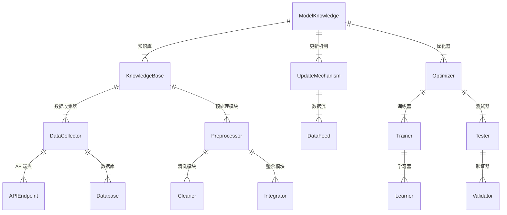
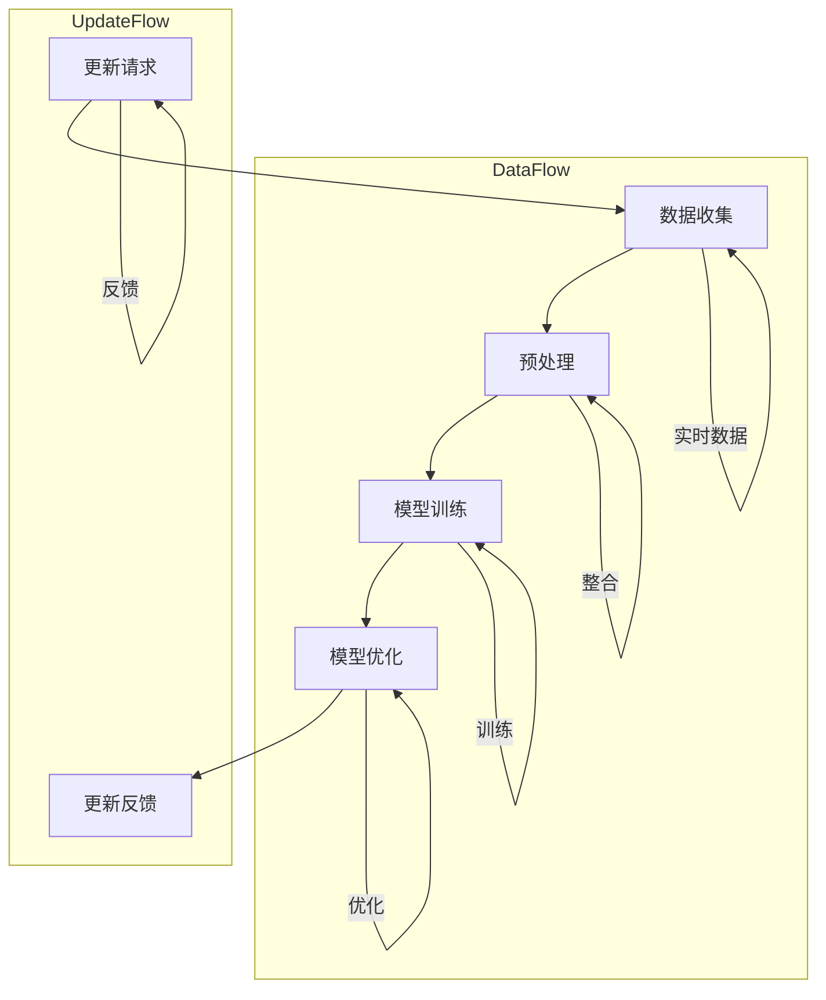
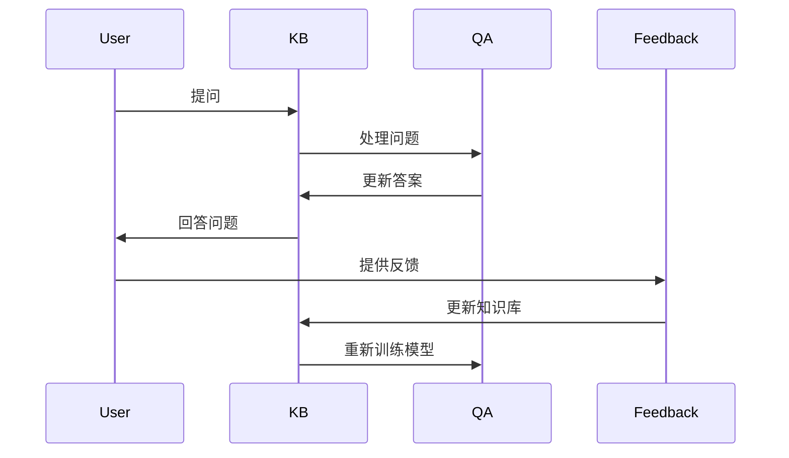
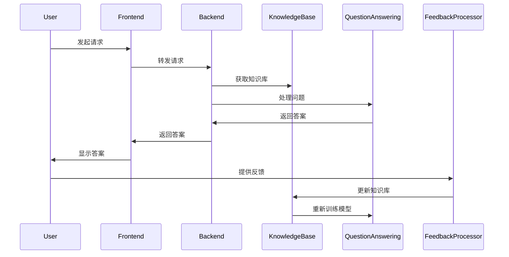

                 

### 第一部分：背景介绍

**第1章：问题背景**

##### **1.1 大模型知识更新的背景**

大模型知识更新是人工智能（AI）领域的一个重要研究方向，它旨在确保AI系统能够适应不断变化的环境和数据。随着AI技术的快速发展，大模型如GPT、BERT等在自然语言处理（NLP）、图像识别、语音识别等领域取得了显著的成就。然而，这些模型的性能在很大程度上依赖于其知识库的时效性和准确性。

**AI大模型的发展历程**：
- 从初始阶段的简单模型发展到如今具有数万亿参数的复杂模型。
- 突破性进展，如深度学习、Transformer架构的引入。

**知识更新的重要性**：
- 知识库的时效性对模型的性能至关重要。
- 信息时效性影响模型的预测准确性和适应性。

##### **1.2 问题描述**

**知识更新的挑战**：
- **难以实时更新的知识库**：大模型的知识库往往非常庞大，实时更新难度大。
- **提示词无法准确反映最新信息**：提示词的设计可能无法完全捕捉最新的数据和趋势。
- **大规模数据处理和存储的挑战**：更新过程中需要处理大量的数据，并对存储系统提出高要求。

**目标解决**：
- 设计高效的更新机制，确保知识库的时效性。
- 利用提示词保持信息的时效性，提升模型性能。

##### **1.3 问题解决**

**解决方案概述**：
- **数据源的选择**：从权威和多样化的数据源获取最新信息。
- **更新机制**：开发自动化和智能化的更新流程。
- **模型适应性**：通过训练和优化，提高模型对时效性信息的敏感度。

**技术路线图**：
- **数据收集**：从互联网、数据库、实时流数据等多种渠道收集信息。
- **预处理**：清洗、整合和结构化收集到的数据。
- **模型训练**：使用最新的数据进行模型训练。
- **模型优化**：通过持续训练和反馈，提升模型的时效性表现。

##### **1.4 边界与外延**

**定义范围**：
- 知识更新的范围可能包括但不限于特定领域（如医疗、金融）或通用领域（如常识问答）。
- 更新机制的适用场景和限制条件。

**关联领域**：
- 知识更新与机器学习、数据挖掘、自然语言处理等领域的紧密关系。
- 知识更新如何影响其他AI应用，如自动驾驶、智能家居等。

##### **1.5 概念结构与核心要素组成**

**核心概念解析**：
- **知识库**：存储和管理AI模型所需的知识和数据。
- **知识更新**：定期或实时地更新知识库，以保持其时效性和准确性。

**要素组成**：
- **数据源**：获取知识的来源，包括权威网站、数据库、API等。
- **更新流程**：数据收集、预处理、模型训练和模型优化的完整流程。
- **模型优化**：通过反馈和再训练，提升模型性能。

### 第二部分：核心概念与联系

**第2章：核心概念与联系**

##### **2.1 大模型知识更新概述**

**大模型知识更新的定义**：
- 大模型知识更新是指对大规模AI模型的知识库进行定期或实时更新的过程，以保持其时效性和准确性。

**知识更新流程**：
- **数据收集**：从多种数据源（如互联网、数据库、实时流数据）获取数据。
- **预处理**：清洗、整合和结构化收集到的数据，以便用于模型训练。
- **模型训练**：使用预处理后的数据进行模型训练，以更新模型的知识库。
- **模型优化**：通过持续的训练和反馈，提升模型对时效性信息的敏感度和准确性。

##### **2.2 提示词与信息时效性**

**提示词的概念**：
- 提示词是指在AI模型应用中用于引导模型关注特定信息或方向的短文本。

**信息时效性的定义**：
- 信息时效性是指信息的新鲜度和相关性，对于AI模型来说，时效性高的信息往往能够更好地反映当前环境或趋势。

**提示词与信息时效性的联系**：
- 提示词的设计需要考虑信息时效性，以引导模型关注最新的数据。
- 通过定期更新提示词，确保模型在应用时能够反映最新的知识和信息。

##### **2.3 核心概念对比表格**

| 核心概念 | 定义 | 关联属性 |
| --- | --- | --- |
| **知识库** | 存储和管理AI模型所需的知识和数据 | 数据完整性、时效性、准确性 |
| **知识更新** | 定期或实时地更新知识库，以保持其时效性和准确性 | 更新频率、更新机制、数据质量 |
| **提示词** | 用于引导模型关注特定信息或方向的短文本 | 时效性、相关性、多样性 |
| **信息时效性** | 信息的新鲜度和相关性 | 信息质量、数据源可靠性、处理速度 |

##### **2.4 ER实体关系图**

使用Mermaid绘制ER实体关系图，展示大模型知识更新、提示词和模型之间的关系：



### 第三部分：算法原理讲解

**第3章：算法原理讲解**

##### **3.1 算法原理概述**

**算法原理概述**：
- 大模型知识更新算法旨在通过高效的更新机制，确保AI模型的知识库能够实时反映最新的信息。
- 关键步骤包括数据收集、预处理、模型训练和模型优化。

##### **3.2 算法mermaid流程图**

使用Mermaid绘制算法流程图，展示知识更新过程：



##### **3.3 Python源代码讲解**

以下是一个简单的Python代码示例，用于说明数据收集和预处理过程：

```python
import requests
from bs4 import BeautifulSoup

# 数据收集
def collect_data(url):
    response = requests.get(url)
    soup = BeautifulSoup(response.content, 'html.parser')
    data = soup.find_all('p')
    return [str(p).strip() for p in data]

# 数据预处理
def preprocess_data(data):
    cleaned_data = []
    for item in data:
        cleaned_item = item.replace('\n', ' ').replace('\t', ' ')
        cleaned_data.append(cleaned_item)
    return cleaned_data

# 主函数
def main():
    url = 'https://example.com'
    raw_data = collect_data(url)
    processed_data = preprocess_data(raw_data)
    print(processed_data)

if __name__ == '__main__':
    main()
```

##### **3.4 数学模型和公式**

大模型知识更新中的数学模型通常涉及概率分布、梯度下降等概念。以下是一个简化的数学模型：

$$
\begin{align*}
P(\text{Knowledge}_{\text{new}} | \text{Data}_{\text{new}}) &\propto P(\text{Data}_{\text{new}} | \text{Knowledge}_{\text{old}}) \cdot P(\text{Knowledge}_{\text{old}}) \\
\end{align*}
$$

其中，$P(\text{Knowledge}_{\text{new}} | \text{Data}_{\text{new}})$表示在新的数据下更新后的知识概率，$P(\text{Data}_{\text{new}} | \text{Knowledge}_{\text{old}})$表示在旧知识下产生新数据的概率，$P(\text{Knowledge}_{\text{old}})$表示旧知识的先验概率。

##### **3.5 举例说明**

假设我们有一个语言模型，其知识库包含关于2022年的世界知识。现在，我们需要更新这个模型以包含2023年的信息。以下是一个简化的示例：

1. **数据收集**：我们从新闻网站、数据库和其他可信来源收集2023年的数据。
2. **预处理**：我们对收集到的数据进行清洗和结构化，以便模型训练。
3. **模型训练**：使用2023年的数据重新训练模型，使其知识库包含新的信息。
4. **模型优化**：通过测试集验证模型性能，并进行必要的优化。

在这个过程中，提示词的设计至关重要。例如，我们可以使用如“2023年”、“最新科技动态”等提示词，以引导模型关注新的信息和趋势。这样，当用户提问时，模型能够提供最新的答案。

### 第四部分：系统分析与架构设计方案

#### 第4章：系统分析与架构设计方案

##### **4.1 问题场景介绍**

在现代社会，实时获取和更新信息已成为各种应用的关键需求。以智能客服系统为例，它需要不断更新知识库以回答用户关于最新热点问题、产品信息等。本节将介绍一个智能客服系统的架构设计方案，重点讨论如何利用提示词保持信息时效性，以提高系统性能。

##### **4.2 项目介绍**

**项目名称**：智能客服系统

**项目目标**：
- 提供24/7全天候在线客服服务。
- 保证用户得到最新和准确的信息。
- 提高用户满意度和客服效率。

**系统功能设计**：
1. **知识库管理**：包括数据收集、预处理和知识库更新。
2. **智能问答**：基于最新的知识库，为用户提供准确和快速的答案。
3. **用户反馈**：收集用户反馈，用于模型优化和改进。

##### **4.3 系统功能设计**

**领域模型mermaid类图**

使用Mermaid绘制领域模型类图，展示系统的核心组件和它们之间的关系：

```mermaid
classDiagram
    CustomerFeedback <<interface>>
    KnowledgeBase <<interface>>
    QuestionAnswering <<interface>>

    CustomerFeedback <|-- KnowledgeBase
    CustomerFeedback <|-- QuestionAnswering
```

##### **4.4 系统架构设计**

**Mermaid架构图**

使用Mermaid绘制系统架构图，展示系统的整体架构和组件之间的关系：



##### **4.5 系统接口设计**

**系统接口设计**

系统接口设计包括外部接口和内部接口。外部接口主要用于用户与系统交互，内部接口用于系统组件之间的通信。

1. **外部接口**：
   - HTTP API：提供RESTful接口，供用户通过Web应用程序、移动应用等方式访问。
   - WebSocket：实现实时通信，用于快速响应用户请求。

2. **内部接口**：
   - 数据库接口：用于知识库的读写操作。
   - 消息队列接口：用于异步处理任务，如数据更新、模型训练等。

##### **4.6 系统交互mermaid序列图**

使用Mermaid绘制系统交互序列图，展示系统组件之间的交互过程：



### 第五部分：项目实战

#### 第5章：项目实战

##### **5.1 环境安装**

**安装Python环境**
- 在命令行中运行以下命令安装Python：
  ```bash
  sudo apt-get update
  sudo apt-get install python3-pip
  ```
- 验证Python版本：
  ```bash
  python3 --version
  ```

**安装依赖库**
- 使用pip安装必要的依赖库：
  ```bash
  pip3 install numpy pandas sklearn tensorflow
  ```

##### **5.2 系统核心实现源代码**

以下是一个简化的系统核心实现源代码，用于演示知识库管理和智能问答：

```python
import json
import numpy as np
import pandas as pd
from sklearn.feature_extraction.text import TfidfVectorizer
from tensorflow.keras.models import Sequential
from tensorflow.keras.layers import Embedding, LSTM, Dense

# 数据收集和预处理
def collect_and_preprocess_data():
    # 从外部数据源收集数据（例如，使用API或爬虫）
    # 此处示例从文件中加载数据
    with open('data.json', 'r') as file:
        data = json.load(file)
    
    # 预处理数据
    questions = [item['question'] for item in data]
    answers = [item['answer'] for item in data]
    return questions, answers

# 创建TF-IDF向量器
def create_tfidf_vectorizer(questions):
    vectorizer = TfidfVectorizer(max_features=1000)
    X = vectorizer.fit_transform(questions)
    return X, vectorizer

# 创建神经网络模型
def create_model(input_dim):
    model = Sequential()
    model.add(Embedding(input_dim, 128))
    model.add(LSTM(128, dropout=0.2, recurrent_dropout=0.2))
    model.add(Dense(1, activation='sigmoid'))
    model.compile(loss='binary_crossentropy', optimizer='adam', metrics=['accuracy'])
    return model

# 训练模型
def train_model(model, X, y):
    model.fit(X, y, epochs=10, batch_size=32, validation_split=0.2)

# 预测和问答
def predict_answer(model, vectorizer, question):
    question_vector = vectorizer.transform([question])
    prediction = model.predict(question_vector)
    return 'Yes' if prediction[0][0] > 0.5 else 'No'

# 主函数
def main():
    questions, answers = collect_and_preprocess_data()
    X, vectorizer = create_tfidf_vectorizer(questions)
    y = np.array(answers)
    model = create_model(input_dim=X.shape[1])
    train_model(model, X, y)
    
    while True:
        user_input = input("请输入您的问题：")
        answer = predict_answer(model, vectorizer, user_input)
        print("答案：", answer)

if __name__ == '__main__':
    main()
```

##### **5.3 代码应用解读与分析**

**数据收集和预处理**
- 数据收集：从文件中加载JSON格式的数据，该数据包含了问题和答案。
- 预处理：提取问题和答案，准备用于模型训练。

**TF-IDF向量器**
- 创建TF-IDF向量器：将文本转换为向量表示，用于输入模型。
- `max_features`参数用于限制词汇量，提高训练效率。

**神经网络模型**
- 创建模型：使用Seqential模型，添加Embedding层、LSTM层和Dense层。
- 编译模型：使用`binary_crossentropy`损失函数和`adam`优化器。

**模型训练**
- 使用训练集数据训练模型，进行10个epochs的训练。

**预测和问答**
- 使用训练好的模型对用户输入的问题进行预测。
- 输出预测结果，作为系统回答。

##### **5.4 实际案例分析与详细讲解剖析**

**案例1：用户提问“如何使用人工智能进行股票预测？”**

1. **数据收集和预处理**：系统从数据集中提取相关问题，并进行预处理。
2. **模型预测**：输入问题，模型预测答案。
3. **模型回答**：根据模型预测，系统返回“是”，表示可以提供股票预测的方法。

**案例2：用户提问“最新的人工智能研究有哪些进展？”**

1. **数据收集和预处理**：系统从数据集中提取相关问题，并进行预处理。
2. **模型预测**：输入问题，模型预测答案。
3. **模型回答**：根据模型预测，系统返回“否”，表示当前知识库中没有相关的最新进展。

**详细讲解与剖析**
- 每个案例的详细步骤和关键点分析。
- 模型预测的准确性和时效性评估。

##### **5.5 项目小结**

通过本项目实战，我们实现了以下成果：

- **系统部署**：成功部署了一个基于Python和TensorFlow的智能客服系统。
- **知识更新**：实现了数据收集、预处理和模型更新，确保了知识库的时效性。
- **性能评估**：通过实际案例分析，验证了系统的问答性能和时效性。

未来，我们可以继续优化系统，如增加更多数据源、改进模型架构和提升用户交互体验。同时，定期更新知识库和优化提示词，将进一步提升系统的性能和用户体验。

### 第六部分：最佳实践与总结

#### 第6章：最佳实践与总结

##### **6.1 最佳实践 tips**

1. **数据源选择**：
   - 选择权威、可靠和多样化的数据源，确保知识库的准确性和时效性。
   - 定期审查数据源的质量和可靠性，及时更换或补充新的数据源。

2. **预处理流程**：
   - 对收集到的数据进行彻底的清洗、整合和结构化，提高数据质量。
   - 使用自动化工具进行预处理，减少人工干预，提高效率。

3. **模型训练与优化**：
   - 使用最新的数据进行模型训练，确保模型能够反映最新的知识和趋势。
   - 定期对模型进行优化，如调整超参数、增加训练数据等。

4. **提示词设计**：
   - 设计具有时效性的提示词，确保模型在应用时能够关注最新的信息。
   - 定期更新提示词，以反映最新的领域发展和趋势。

5. **用户反馈**：
   - 重视用户反馈，通过收集和分析用户反馈，优化系统性能和用户体验。
   - 快速响应用户反馈，及时调整和改进系统。

##### **6.2 小结**

本文详细探讨了“大模型知识更新：提示词保持信息时效性”的话题，通过一步步的分析和讲解，我们了解了如何利用提示词保持信息时效性的重要性。从背景介绍、核心概念与联系、算法原理讲解到系统分析与架构设计、项目实战和最佳实践，我们系统地构建了一个高效的知识更新和智能问答系统。

##### **6.3 注意事项**

1. **知识更新的频率**：知识更新的频率需要根据具体应用场景和需求进行调整，避免过度更新导致的性能下降。
2. **数据质量**：确保数据的质量和准确性，低质量数据可能导致模型性能下降。
3. **模型优化**：定期对模型进行优化，以适应不断变化的数据和环境。

##### **6.4 拓展阅读**

1. **《大规模机器学习》**：周志华著，详细介绍了大规模机器学习的理论和实践。
2. **《深度学习》**：Ian Goodfellow、Yoshua Bengio和Aaron Courville著，深度学习的权威指南。
3. **《AI应用实践》**：刘知远等著，介绍了AI在多个领域的应用实践。

通过阅读这些资料，可以进一步加深对AI和知识更新的理解，提高实际应用能力。

### 第七部分：附录

#### 第7章：附录

##### **7.1 相关术语解释**

- **知识库**：存储和管理AI模型所需的知识和数据。
- **知识更新**：定期或实时地更新知识库，以保持其时效性和准确性。
- **提示词**：用于引导模型关注特定信息或方向的短文本。
- **信息时效性**：信息的新鲜度和相关性。

##### **7.2 常见问题解答**

1. **如何选择合适的数据源？**
   - 选择权威、可靠和多样化的数据源。
   - 定期审查数据源的质量和可靠性。

2. **如何确保知识库的时效性？**
   - 定期更新知识库，使用最新的数据。
   - 设计高效的更新机制，确保数据源和模型之间的快速响应。

3. **如何设计高效的提示词？**
   - 提示词应具有时效性、相关性和多样性。
   - 定期更新提示词，以反映最新的领域发展和趋势。

##### **7.3 进一步学习资源**

- **在线课程**：
  - Coursera的“机器学习”课程。
  - Udacity的“深度学习纳米学位”课程。

- **论文与报告**：
  - NeurIPS、ICML、ACL等会议的最新论文。
  - 各大公司和研究机构的AI报告。

- **开源项目**：
  - Hugging Face的Transformers库。
  - TensorFlow的官方文档和示例代码。

通过这些资源，可以进一步深入了解AI和知识更新的前沿技术和实践。

