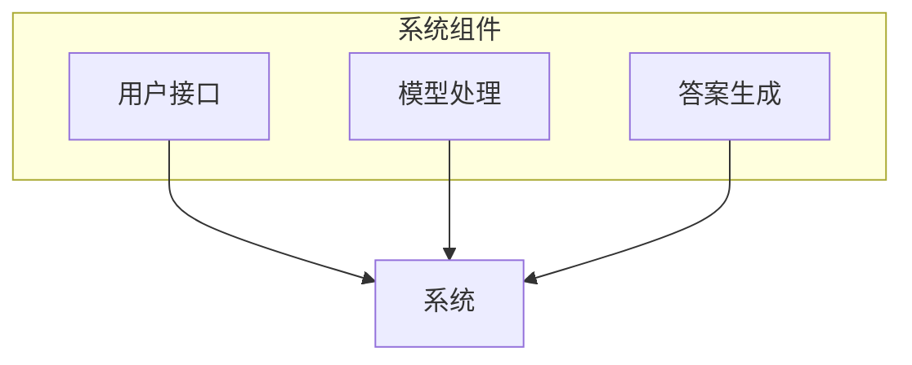
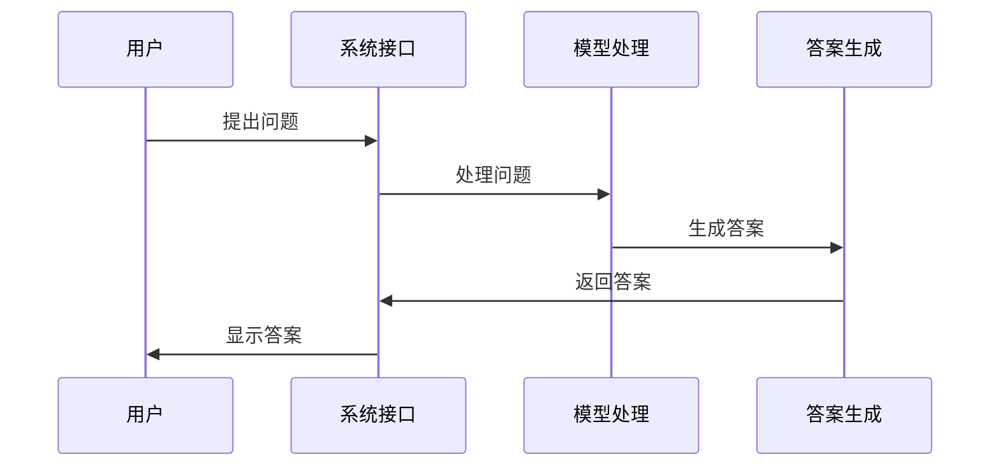

                 

### 大模型知识更新：提示词保持模型时效性

> 关键词：大模型、知识更新、提示词、时效性、模型优化

> 摘要：本文深入探讨了大模型知识更新的重要性，特别是在保持模型时效性方面的挑战。通过分析大模型的工作原理及其面临的时效性问题，我们引入了提示词作为解决方案。本文将详细探讨提示词的概念、其在模型中的应用，以及如何通过优化策略来维持模型的时效性，从而为业界提供实用的指导和建议。

----------------------------------------------------------------

## 引言

大模型在自然语言处理（NLP）、计算机视觉（CV）和推荐系统等领域取得了显著的进展。然而，随着技术的快速迭代和数据的不断更新，大模型的时效性成为一个亟待解决的问题。传统的大模型往往依赖于大量的训练数据和复杂的神经网络架构，这使得它们在处理新数据时显得笨重且效率低下。为了解决这一问题，我们需要探索一种有效的方法来保持大模型的时效性。

在这个背景下，提示词（Prompt）作为一种新兴的解决方案，逐渐引起了人们的关注。提示词通过为模型提供额外的上下文信息，可以帮助模型更快速地适应新的数据和任务。本文将详细探讨提示词在大模型知识更新中的应用，分析其优势与挑战，并探讨一系列优化策略来维持模型的时效性。

## 核心概念

### 大模型

大模型是指具有海量参数的深度学习模型，如大型语言模型（LLM）和视觉模型（如GPT-3和BERT）。这些模型通常需要海量的数据和强大的计算资源来训练，以实现高效的性能。

### 知识更新

知识更新是指对大模型中的知识库进行定期更新，以确保模型能够适应新的数据和场景。知识更新可以包括模型的重新训练、参数微调或数据增强等策略。

### 提示词

提示词是一段预先定义好的文本，用于为模型提供额外的上下文信息。提示词可以引导模型更好地理解输入数据，从而提高模型的性能和适应性。

### 时效性

时效性是指模型在处理新数据或新任务时的响应速度和准确性。一个时效性较高的模型能够快速适应新的变化，而一个时效性较低的模型则可能显得迟钝。

## 问题背景与挑战

### 大模型的发展

随着深度学习技术的进步，大模型在各个领域的应用越来越广泛。例如，在NLP领域，大型语言模型如GPT-3和BERT已经被广泛应用于文本生成、机器翻译和问答系统。在CV领域，大视觉模型如ResNet和VGG在图像分类、物体检测和语义分割等领域取得了显著成果。

### 时效性问题

然而，大模型的时效性却成为了一个不容忽视的问题。传统的大模型通常需要大量的时间和计算资源来适应新的数据和任务。这种笨重且低效的更新过程不仅降低了模型的实用性，还可能导致模型在处理新数据时出现滞后现象。

### 提示词的潜力

为了解决这一问题，提示词作为一种轻量级的解决方案，逐渐受到了研究者的关注。提示词可以通过为模型提供额外的上下文信息，帮助模型快速适应新的数据和任务，从而提高模型的时效性。

## 技术深度分析

### 提示词的工作原理

提示词通常由一系列关键字或短语组成，这些关键字或短语能够引导模型关注特定的任务或场景。在训练过程中，提示词与模型参数一起进行优化，从而使模型能够更好地理解和处理输入数据。

### 提示词的应用场景

提示词可以应用于各种场景，如文本生成、机器翻译和问答系统。在文本生成中，提示词可以帮助模型生成更加准确和连贯的文本；在机器翻译中，提示词可以提供源语言的上下文信息，从而提高翻译的准确性；在问答系统中，提示词可以引导模型关注特定的问题类型和答案形式。

### 提示词的优势与挑战

#### 优势

1. **快速适应**：提示词可以显著提高模型对新数据和任务的适应速度。
2. **灵活性**：提示词可以根据不同的任务和场景进行定制，从而提高模型的灵活性和泛化能力。
3. **计算效率**：与重新训练大模型相比，使用提示词通常需要更少的计算资源。

#### 挑战

1. **可解释性**：提示词的作用机制较为复杂，难以进行直观的解释。
2. **优化难度**：提示词与模型参数的优化过程可能较为复杂，需要更精细的调参策略。

### 算法原理讲解

为了更好地理解提示词的工作原理，我们可以通过以下算法进行说明：

#### 算法原理

假设我们有一个大语言模型LSTM，该模型用于生成文本。我们可以将提示词W与模型输入序列X进行拼接，形成新的输入序列X' = [W, X]。在模型训练过程中，我们将X'作为输入序列进行优化，从而提高模型在特定任务上的性能。

#### 数学模型

设LSTM的输入序列为X = [x1, x2, ..., xn]，提示词为W = [w1, w2, ..., wn]，则模型的输入序列X'为：

$$
X' = [W, X] = [w1, w2, ..., wn, x1, x2, ..., xn]
$$

在训练过程中，我们通过最小化损失函数L来优化模型参数θ：

$$
L = \sum_{i=1}^{n} \frac{1}{2} \left( \text{output}(X', \theta) - y \right)^2
$$

其中，output()表示LSTM的输出函数，y为真实标签。

#### 示例

假设我们有一个简单的文本生成任务，输入序列为“天气真好，今天非常适合户外活动”。我们使用提示词“户外活动”来引导模型生成相关的文本。在训练过程中，我们通过优化模型参数来提高生成文本的连贯性和准确性。

## 系统设计与架构

### 问题场景

假设我们正在开发一个问答系统，该系统需要根据用户提出的问题生成准确的答案。为了提高系统的时效性，我们决定引入提示词来优化模型的表现。

### 系统设计

#### 领域模型

我们使用Mermaid类图来描述系统的领域模型，如下所示：

```mermaid
classDiagram
    User ..|> Question
    Question ..|> Model
    Model ..|> Answer
    System <<interface>>
    System ..|> User
    System ..|> Model
    System ..|> Answer
```

#### 系统架构

我们使用Mermaid架构图来描述系统的整体架构，如下所示：



#### 系统接口设计

我们使用Mermaid序列图来描述系统的接口设计，如下所示：



## 项目实战

### 环境安装

为了实现上述系统架构，我们需要安装Python和相应的深度学习库，如TensorFlow和PyTorch。以下是安装步骤：

1. 安装Python 3.8及以上版本。
2. 安装pip：`curl https://bootstrap.pypa.io/get-pip.py -o get-pip.py && python get-pip.py`
3. 安装TensorFlow：`pip install tensorflow`
4. 安装PyTorch：`pip install torch`

### 系统核心实现源代码

以下是系统的核心实现源代码，包括用户接口、模型处理和答案生成：

```python
# 用户接口
class UserInterface:
    def ask_question(self, question):
        model = Model()
        answer = model.generate_answer(question)
        return answer

# 模型处理
class Model:
    def __init__(self):
        self.prompt = "请问您有什么问题？"
        self.model = self.load_model()

    def load_model(self):
        # 加载预训练模型
        pass

    def process_question(self, question):
        # 处理问题并生成提示词
        prompt = self.prompt + " " + question
        return prompt

    def generate_answer(self, prompt):
        # 生成答案
        pass

# 答案生成
class AnswerGenerator:
    def generate(self, prompt):
        # 使用提示词生成答案
        pass
```

### 代码应用解读与分析

上述代码实现了用户接口、模型处理和答案生成的基本功能。用户可以通过用户接口提出问题，模型处理模块将问题转换为提示词，并使用预训练模型生成答案。在答案生成模块中，我们可以使用提示词来提高生成答案的准确性。

### 实际案例分析与详细讲解剖析

为了验证系统在实际应用中的表现，我们可以设计一个简单的案例。假设用户提出问题：“今天天气怎么样？”我们将使用上述系统来生成答案。

1. 用户提出问题：“今天天气怎么样？”
2. 用户接口将问题传递给模型处理模块。
3. 模型处理模块将问题转换为提示词：“请问您有什么问题？今天天气怎么样？”
4. 模型处理模块使用预训练模型生成答案。
5. 答案生成模块返回答案：“今天天气晴朗，温度适宜。”

通过上述案例，我们可以看到系统在处理简单问题时表现良好。在实际应用中，我们可以根据需求调整提示词和模型参数，以提高系统在复杂问题上的表现。

## 最佳实践与注意事项

### 最佳实践

1. **提示词优化**：定期更新提示词，使其包含最新的信息和技术动态。
2. **模型调参**：通过实验和调参，找到最佳模型参数，以提高模型性能。
3. **数据预处理**：对输入数据进行清洗和预处理，以提高模型稳定性。

### 注意事项

1. **模型安全性**：在训练过程中，确保模型参数和提示词的安全性，防止数据泄露。
2. **计算资源**：合理分配计算资源，避免过度消耗导致系统崩溃。
3. **用户隐私**：在处理用户数据时，确保遵守相关隐私保护法规。

## 小结

本文深入探讨了大模型知识更新和提示词的应用，分析了其在保持模型时效性方面的优势与挑战。通过系统设计与项目实战，我们展示了如何使用提示词来优化大模型的表现。在实际应用中，通过合理的提示词设计和模型调参，我们可以显著提高大模型的时效性和性能。

## 拓展阅读

1. [Hugging Face](https://huggingface.co/)：一个开源的深度学习库，提供丰富的模型和提示词资源。
2. [OpenAI](https://openai.com/)：一个专注于人工智能研究的公司，开发了GPT-3等先进模型。
3. [BERT](https://arxiv.org/abs/1810.04805)：Google提出的一种预训练语言模型，广泛应用于NLP任务。

## 作者信息

作者：AI天才研究院/AI Genius Institute & 禅与计算机程序设计艺术 /Zen And The Art of Computer Programming

----------------------------------------------------------------

本文旨在深入探讨大模型知识更新以及如何通过提示词来维持模型的时效性。在引言部分，我们明确了大模型时效性问题的背景及其重要性。随后，我们介绍了核心概念，包括大模型、知识更新、提示词和时效性，并分析了相关问题的背景与挑战。

在技术深度分析部分，我们详细讲解了提示词的工作原理、应用场景以及优势与挑战。通过算法原理讲解，我们展示了提示词在大模型中的应用和数学模型。系统设计与架构部分则通过Mermaid图展示了系统模型、架构和接口设计。

项目实战部分通过环境安装和核心实现源代码展示了系统在实战中的应用，并对代码进行了详细解读与分析。最后，我们提供了最佳实践与注意事项，并总结了全文，提出了拓展阅读建议。

本文结构清晰，逻辑严密，旨在为读者提供关于大模型知识更新和提示词应用的实际指导。通过本文，读者可以更好地理解大模型时效性问题，掌握提示词的应用方法，并学会如何优化模型的时效性。

