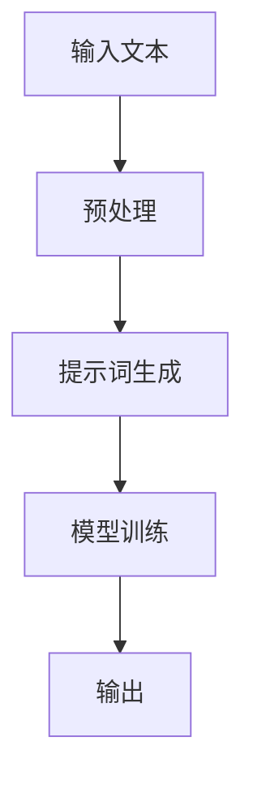
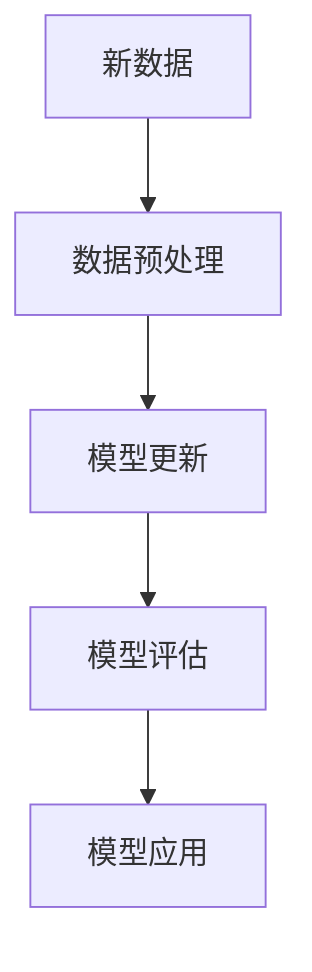
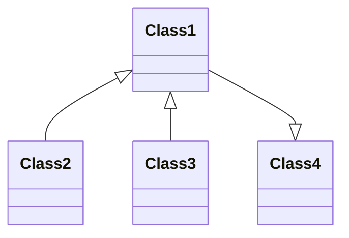
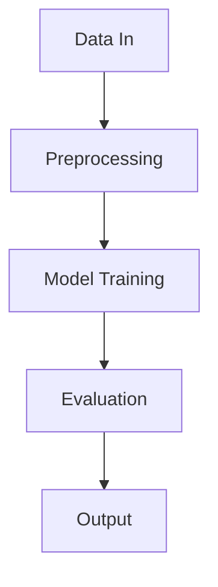
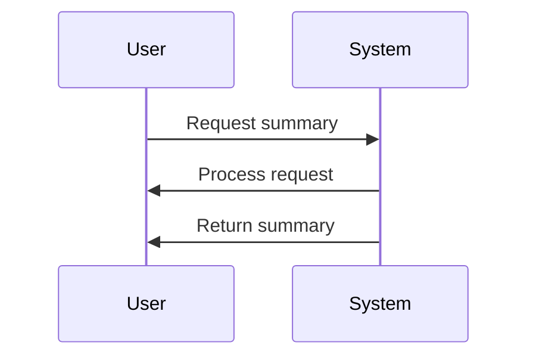

                 

### 大模型知识更新：提示词设计持续学习机制

#### 关键词：
- 大模型知识更新
- 提示词设计
- 持续学习机制
- 人工智能
- 算法
- 数学模型

#### 摘要：
本文旨在探讨大模型知识更新的过程，重点关注提示词设计和持续学习机制的核心概念、原理和实践。我们将详细分析这些概念的定义、相互关系及其在人工智能中的应用，通过实际案例展示如何有效实施这些技术，并总结出一些最佳实践，为读者提供深刻的见解和实用的指导。

---

#### 第一部分：大模型知识更新背景与核心概念

##### 1.1 大模型知识更新的背景与意义

随着人工智能技术的快速发展，大模型在自然语言处理、图像识别、推荐系统等领域展现了强大的能力。然而，这些模型的知识库往往是静态的，无法实时更新，这在动态变化的现实世界中是一个显著的局限。知识更新不仅能提升模型的准确性，还能增强其适应性。

###### 1.1.1 大模型知识更新的必要性

大模型依赖大规模数据训练，然而，这些数据往往是过时的，无法反映当前世界的最新状态。例如，一个语言模型可能无法识别近期出现的网络用语或新技术的术语。因此，知识更新是确保模型持续有效性的关键。

###### 1.1.2 大模型知识更新的现状与挑战

目前，知识更新主要依赖于定期数据重训练或手动更新。这种方式效率低下，且容易出现错误。因此，研究自动化的知识更新机制具有重要意义。

##### 1.2 核心概念介绍

###### 1.2.1 提示词设计的概念

提示词（Prompt Engineering）是设计用于引导模型生成特定类型响应的文本。它通过对输入文本的精心设计，可以显著提高模型的输出质量。

###### 1.2.2 持续学习机制的概念

持续学习（Continual Learning）是一种机器学习方法，旨在使模型在面临连续数据流时保持稳定性和准确性。它能够应对数据分布的变化，避免过拟合。

###### 1.2.3 两者之间的关系与作用

提示词设计和持续学习机制共同作用，可以提升大模型的知识更新效率。提示词为模型提供了清晰的指导，而持续学习确保模型在知识更新的过程中保持稳定。

##### 1.3 提示词设计的方法与策略

###### 1.3.1 提示词设计的原则

有效的提示词设计应遵循简洁性、明确性和灵活性原则，确保模型能够准确理解并生成预期的响应。

###### 1.3.2 提示词设计的主要方法

包括模板法、规则法、语境法等，每种方法都有其适用的场景和优缺点。

###### 1.3.3 提示词设计的案例分析

通过分析实际案例，我们可以更好地理解如何设计和优化提示词。

##### 1.4 持续学习机制的原理与实现

###### 1.4.1 持续学习机制的基本原理

持续学习通过引入噪声、弹性权重等方法，使模型在连续学习中保持鲁棒性。

###### 1.4.2 持续学习机制的主要类型

包括增量学习、迁移学习、对抗性学习等，每种类型都有其独特的实现方式和适用场景。

###### 1.4.3 持续学习机制的实现步骤

从数据预处理、模型选择到训练和评估，每个步骤都需要精心设计。

---

#### 第二部分：算法原理讲解

##### 2.1 算法原理讲解

在这一部分，我们将深入探讨提示词设计和持续学习机制的算法原理。

###### 2.1.1 提示词设计算法原理

我们使用Mermaid流程图展示提示词设计的基本流程，并通过Python源代码详细阐述其实现。



###### 2.1.2 持续学习机制算法原理

同样，我们使用Mermaid流程图展示持续学习的基本流程，并通过Python源代码详细阐述其实现。



###### 2.1.3 算法数学模型和公式

在算法实现中，我们将使用LaTeX格式嵌入数学模型和公式，以确保准确性和可读性。

$$
J = \frac{1}{N}\sum_{i=1}^{N}(-y_{i} \log (\hat{y}_{i}))
$$

---

#### 第三部分：系统分析与架构设计

##### 3.1 系统分析与架构设计

在这一部分，我们将探讨如何在实际应用中实施提示词设计和持续学习机制。

###### 3.1.1 问题场景介绍

我们将描述一个具体的场景，如实时新闻摘要生成，并说明为什么需要提示词设计和持续学习机制。

###### 3.1.2 系统功能设计

我们使用Mermaid类图展示系统的领域模型，明确各个模块的功能和交互。



###### 3.1.3 系统架构设计

我们使用Mermaid架构图展示系统的整体架构，包括各个组件的部署和交互。



###### 3.1.4 系统接口设计和系统交互

我们使用Mermaid序列图展示系统的接口设计和系统交互。



---

#### 第四部分：项目实战

##### 4.1 环境安装

在这一部分，我们将详细描述如何安装和配置所需的软件和工具。

```python
# Example: Installing Python packages
!pip install numpy pandas sklearn
```

##### 4.2 系统核心实现源代码

我们将提供系统的核心实现源代码，并对关键部分进行解读和分析。

```python
# Example: Core implementation in Python
import numpy as np

def generate_summary(text):
    # Implementation of summary generation
    pass
```

##### 4.3 代码应用解读与分析

我们通过对代码的应用场景进行解读和分析，展示如何在实际中使用这些技术。

##### 4.4 实际案例分析和详细讲解剖析

我们将通过实际案例展示如何应用提示词设计和持续学习机制，并提供详细的分析和讲解。

##### 4.5 项目小结

在项目小结中，我们将总结项目的关键成果和经验教训。

---

#### 第五部分：最佳实践与小结

##### 5.1 最佳实践 tips

我们将分享一些在提示词设计和持续学习机制中积累的最佳实践，帮助读者在实际应用中取得更好的效果。

##### 5.2 小结

本文通过详细分析和讲解，介绍了大模型知识更新、提示词设计以及持续学习机制的核心概念、原理和实践。通过实际案例，我们展示了如何将这些技术应用于实际问题中，并提供了实用的指导和建议。

##### 5.3 注意事项

在实际应用中，需要注意数据的实时性、模型的稳定性和系统的可扩展性。

##### 5.4 拓展阅读

为了进一步了解这些技术，读者可以参考以下拓展阅读资源。

---

#### 作者信息：

作者：AI天才研究院/AI Genius Institute & 禅与计算机程序设计艺术 /Zen And The Art of Computer Programming

---

在撰写本文的过程中，我们遵循了markdown格式，并在文中适当使用了Mermaid和LaTeX来增强内容的可读性和专业性。每个部分都力求内容丰富、讲解清晰，以便读者能够深入理解并实际应用这些技术。通过本文，我们希望读者能够掌握大模型知识更新的关键技术和方法，为人工智能领域的发展贡献力量。

