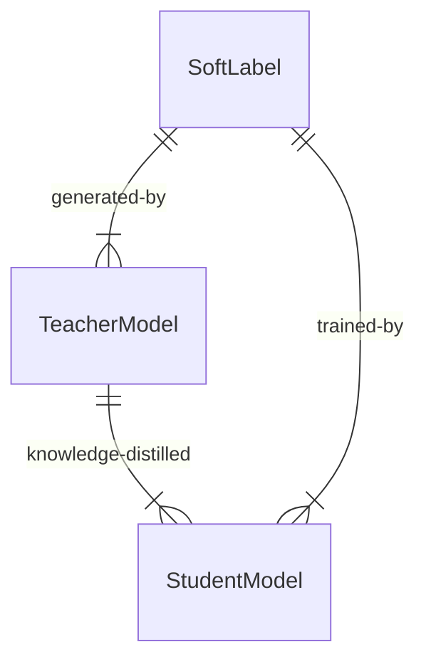
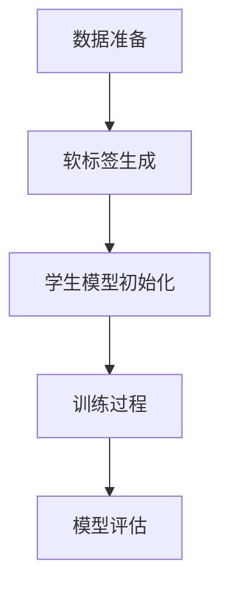
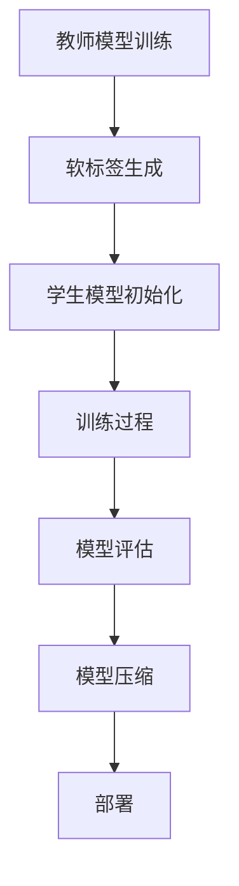
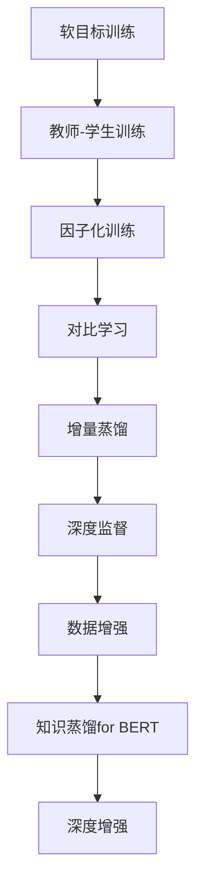

                 

# 大模型知识蒸馏：提示词优化模型压缩

## 关键词
- 大模型
- 知识蒸馏
- 提示词优化
- 模型压缩
- 深度学习
- 人工智能

## 摘要
本文将深入探讨大模型知识蒸馏技术以及如何通过提示词优化实现模型压缩。首先，我们将介绍知识蒸馏技术的背景、原理和应用。随后，我们将详细解释大模型知识蒸馏的过程及其优势与挑战。接着，我们将介绍基于深度增强的知识蒸馏算法，并探讨如何使用提示词优化来压缩模型。最后，我们将通过实践案例展示这些技术的实际应用，并提供一些建议和展望。

## 目录

### 第一部分：知识蒸馏技术概述

#### 第1章：知识蒸馏技术引论
1.1 知识蒸馏技术的背景与发展历程
1.2 知识蒸馏技术的基本概念
1.3 知识蒸馏技术的应用领域

#### 第2章：大模型知识蒸馏原理
2.1 大模型知识蒸馏的基本原理
2.2 大模型知识蒸馏的关键步骤
2.3 大模型知识蒸馏的优势与挑战

#### 第3章：知识蒸馏算法
3.1 传统知识蒸馏算法
3.2 基于深度增强的知识蒸馏

### 第二部分：提示词优化模型压缩

#### 第4章：提示词优化模型压缩
4.1 提示词优化的概念
4.2 模型压缩的概述
4.3 提示词优化与模型压缩的结合

#### 第5章：大模型知识蒸馏与提示词优化实践
5.1 实践环境搭建
5.2 案例分析

### 第三部分：未来展望与挑战

#### 第6章：未来展望与挑战
6.1 大模型知识蒸馏与提示词优化的未来发展趋势
6.2 面临的挑战与解决策略
6.3 研究热点与方向

#### 第7章：总结与展望
7.1 本书主要内容回顾
7.2 知识蒸馏与提示词优化技术的重要性
7.3 未来研究方向与建议

## 1. 知识蒸馏技术引论

### 1.1 知识蒸馏技术的背景与发展历程

知识蒸馏（Knowledge Distillation）是一种训练深度神经网络的方法，旨在将知识从大型、复杂的教师模型（Teacher Model）传递到小型、高效的代理模型（Student Model）。这种方法最早由Hinton等人于2015年提出，旨在解决深度神经网络训练过程中的几个关键问题：模型大小、训练时间和计算资源。

随着深度学习在计算机视觉、自然语言处理等领域的广泛应用，大型神经网络成为了研究的主流。然而，这些大型神经网络往往需要大量的计算资源和存储空间，这在实际应用中是一个很大的挑战。知识蒸馏技术通过将教师模型的知识传递给学生模型，可以在保留模型性能的同时，显著减小模型大小和降低计算复杂度。

### 1.2 知识蒸馏技术的基本概念

知识蒸馏技术涉及两个模型：教师模型和学生模型。教师模型通常是一个大型、复杂的神经网络，它已经经过了充分的训练，能够很好地解决特定任务。学生模型则是一个较小、参数更少的神经网络，它将被训练以模仿教师模型的性能。

知识蒸馏的核心思想是将教师模型的输出（如软标签）传递给学生模型，并利用这些输出来指导学生模型的训练。具体来说，知识蒸馏包括以下关键步骤：

1. **软标签生成**：教师模型在训练数据集上运行，得到每个样本的软标签（概率分布）。这些软标签包含了教师模型对每个样本的预测，并且比硬标签（如分类结果）提供了更多的信息。

2. **学生模型训练**：学生模型在训练过程中不仅依赖于硬标签（如交叉熵损失），还依赖于教师模型的软标签。通过最小化学生模型对软标签的预测误差，可以促使学生模型学习到教师模型的知识。

3. **模型压缩**：经过知识蒸馏训练的学生模型可以比原始的教师模型更小，同时保持相似的性能。这种压缩模型的方法在资源受限的环境中尤为重要。

### 1.3 知识蒸馏技术的应用领域

知识蒸馏技术已经被广泛应用于多个领域，包括计算机视觉、自然语言处理和语音识别等。以下是一些具体的例子：

- **计算机视觉**：在图像分类任务中，知识蒸馏可以用于将大型卷积神经网络的知识传递给较小的网络，从而实现高效的模型压缩和加速部署。

- **自然语言处理**：在语言模型训练中，知识蒸馏可以帮助将大型预训练模型（如GPT-3）的知识传递给较小的目标模型，使其能够处理更具体的任务。

- **语音识别**：知识蒸馏被用于将大型语音识别模型的知识传递给较小的嵌入式设备，以实现低功耗的实时语音识别。

### 1.4 知识蒸馏技术的边界与外延

知识蒸馏技术虽然具有许多优点，但也存在一些局限性。首先，知识蒸馏依赖于教师模型的性能，如果教师模型本身性能不佳，那么传递给学生的知识也会受到影响。其次，知识蒸馏技术主要适用于有监督学习任务，对于无监督学习和半监督学习任务，其应用范围有限。

此外，知识蒸馏技术还可以与其他模型压缩技术（如剪枝、量化）结合使用，以进一步提高模型压缩效率和性能。例如，在自然语言处理中，知识蒸馏通常与剪枝技术结合，以实现高效的模型压缩和部署。

### 1.5 概念结构与核心要素组成

知识蒸馏技术的核心要素包括：

- **教师模型**：大型、复杂的神经网络，已经经过了充分的训练。
- **学生模型**：小型、高效的神经网络，需要学习教师模型的知识。
- **软标签**：教师模型在训练数据集上生成的概率分布，用于指导学生模型的训练。
- **损失函数**：用于最小化学生模型对软标签的预测误差，从而促使学生模型学习到教师模型的知识。

### 1.6 核心概念原理、属性特征对比表格和ER实体关系图架构

#### 核心概念原理

知识蒸馏的核心概念是将教师模型的知识传递给学生模型。这个过程包括：

- **软标签生成**：教师模型对每个样本的输出。
- **学生模型训练**：利用软标签来指导学生模型的训练。
- **模型压缩**：通过知识蒸馏训练的学生模型通常比原始的教师模型更小，但性能相近。

#### 属性特征对比表格

| 特征         | 教师模型       | 学生模型       |
| ------------ | -------------- | -------------- |
| 大小         | 大型、复杂     | 小型、高效     |
| 训练时间     | 长             | 短             |
| 计算资源     | 大量           | 较少           |
| 性能         | 高             | 相近           |

#### ER实体关系图架构



### 1.7 算法原理讲解

#### 算法流程

知识蒸馏的算法流程包括以下几个步骤：

1. **数据准备**：准备训练数据集，并将其分为教师模型和学生模型两个部分。
2. **软标签生成**：教师模型在训练数据集上运行，得到每个样本的软标签。
3. **学生模型初始化**：初始化学生模型，通常使用较小的网络结构。
4. **训练过程**：学生模型在训练过程中，既依赖于硬标签，也依赖于软标签。通过最小化学生模型对软标签的预测误差来指导学生模型的训练。
5. **模型评估**：使用测试数据集评估学生模型的性能。

#### 算法mermaid流程图



#### 算法Python源代码

```python
import torch
import torch.nn as nn
import torch.optim as optim

# 定义教师模型和学生模型
teacher_model = ...
student_model = ...

# 定义损失函数
criterion = nn.CrossEntropyLoss()

# 定义优化器
optimizer = optim.Adam(student_model.parameters(), lr=0.001)

# 训练过程
for epoch in range(num_epochs):
    for inputs, labels in dataloader:
        # 前向传播
        outputs = student_model(inputs)
        teacher_outputs = teacher_model(inputs)
        
        # 计算损失
        loss = criterion(outputs, labels) + criterion(outputs, teacher_outputs)
        
        # 反向传播
        optimizer.zero_grad()
        loss.backward()
        optimizer.step()
        
    # 模型评估
    test_loss = evaluate(student_model, test_dataloader)
    print(f"Epoch {epoch+1}/{num_epochs}, Test Loss: {test_loss}")
```

#### 算法原理详细讲解

知识蒸馏的核心在于如何将教师模型的知识传递给学生模型。这个过程可以分为以下几个步骤：

1. **数据准备**：首先，我们需要准备训练数据集，并将其分为教师模型和学生模型两个部分。教师模型将用于生成软标签，而学生模型将用于训练。

2. **软标签生成**：教师模型在训练数据集上运行，得到每个样本的软标签。这些软标签是教师模型对每个样本的预测结果，通常是一个概率分布。通过软标签，我们可以获取到教师模型对每个样本的详细理解。

3. **学生模型初始化**：接下来，我们需要初始化学生模型。学生模型通常是一个较小的神经网络，它的目的是学习教师模型的知识。为了实现这个目标，我们通常使用较小的网络结构，并且在训练过程中逐步增加网络的复杂度。

4. **训练过程**：在训练过程中，学生模型既依赖于硬标签（如交叉熵损失），也依赖于软标签。具体来说，学生模型将硬标签和软标签作为输入，通过最小化学生模型对软标签的预测误差来指导学生模型的训练。这个过程可以看作是学生模型在不断学习教师模型的知识，并且逐渐优化自己的预测能力。

5. **模型评估**：最后，我们需要使用测试数据集来评估学生模型的性能。通过测试数据集上的评估，我们可以了解学生模型是否已经成功学习了教师模型的知识，并且能够进行有效的预测。

#### 算法原理数学模型和公式

知识蒸馏的数学模型可以表示为：

$$
L = L_{hard} + \lambda L_{soft}
$$

其中，$L_{hard}$是硬标签损失，通常使用交叉熵损失函数计算：

$$
L_{hard} = -\frac{1}{N} \sum_{i=1}^{N} y_i \log(\hat{y}_i)
$$

$y_i$是真实标签，$\hat{y}_i$是学生模型对样本$i$的预测概率。

$L_{soft}$是软标签损失，用于衡量学生模型对教师模型软标签的预测误差：

$$
L_{soft} = -\frac{1}{N} \sum_{i=1}^{N} \sum_{j=1}^{C} t_{ij} \log(\hat{y}_{ij})
$$

$t_{ij}$是教师模型对样本$i$属于类别$j$的软标签概率，$\hat{y}_{ij}$是学生模型对样本$i$属于类别$j$的预测概率。

$\lambda$是一个超参数，用于调节硬标签损失和软标签损失之间的权重。

#### 通俗易懂的举例说明

假设我们有一个教师模型和学生模型，教师模型是一个大型的卷积神经网络，已经训练完成，而学生模型是一个较小的卷积神经网络，需要通过知识蒸馏来学习教师模型的知识。

首先，我们使用教师模型对训练数据集进行预测，得到每个样本的软标签。这些软标签包含了教师模型对每个样本的详细理解。

然后，我们将这些软标签传递给学生模型，并与学生模型的预测概率进行比较。通过最小化学生模型对软标签的预测误差，我们可以指导学生模型学习教师模型的知识。

例如，假设教师模型预测某个样本属于类别A的概率为0.8，类别B的概率为0.2。而学生模型预测相同样本属于类别A的概率为0.6，类别B的概率为0.4。在这种情况下，学生模型的预测与教师模型的预测存在较大差距，我们需要调整学生模型的权重，使其更接近教师模型的预测。

通过这样的迭代过程，学生模型可以逐渐学习到教师模型的知识，并且在预测任务上取得更好的性能。

### 2. 大模型知识蒸馏原理

#### 2.1 大模型知识蒸馏的基本原理

大模型知识蒸馏（Large-scale Model Knowledge Distillation）是一种将大型神经网络的知识传递给较小网络的技术。其基本原理是在教师模型的基础上，通过训练一个较小的学生模型来模仿教师模型的性能。这个过程包括以下关键步骤：

1. **软标签生成**：教师模型在训练数据集上运行，生成每个样本的软标签。这些软标签包含了教师模型对每个样本的预测概率分布。

2. **学生模型初始化**：初始化一个较小的学生模型，其结构和参数设置要与教师模型相似，但参数量更少。

3. **训练过程**：学生模型在训练过程中，不仅依赖于硬标签（如交叉熵损失），还依赖于教师模型的软标签。通过最小化学生模型对软标签的预测误差，可以促使学生模型学习到教师模型的知识。

4. **模型评估**：使用测试数据集评估学生模型的性能，确保其能够有效地模仿教师模型。

#### 2.2 大模型知识蒸馏的关键步骤

1. **数据准备**：准备训练数据集和测试数据集。通常，训练数据集会分为教师模型和学生模型两部分。

2. **软标签生成**：教师模型在训练数据集上运行，得到每个样本的软标签。这些软标签是教师模型对每个样本的预测概率分布。

3. **学生模型初始化**：初始化一个较小的学生模型。学生模型的网络结构和参数设置要与教师模型相似，但参数量更少。

4. **训练过程**：学生模型在训练过程中，既依赖于硬标签（如交叉熵损失），也依赖于软标签。通过最小化学生模型对软标签的预测误差，可以促使学生模型学习到教师模型的知识。

5. **模型评估**：使用测试数据集评估学生模型的性能，确保其能够有效地模仿教师模型。

#### 2.3 大模型知识蒸馏的优势与挑战

**优势：**

- **模型压缩**：通过知识蒸馏，可以将大型教师模型的性能传递给较小的学生模型，从而实现模型压缩。
- **计算资源节省**：较小的学生模型需要较少的计算资源和存储空间，可以在资源受限的环境中部署。
- **加速训练过程**：学生模型的训练时间较短，可以快速达到与教师模型相似的性能。

**挑战：**

- **教师模型依赖性**：知识蒸馏的效果高度依赖于教师模型的性能。如果教师模型本身性能不佳，那么传递给学生的知识也会受到影响。
- **模型压缩效果**：虽然知识蒸馏可以压缩模型，但并不能保证压缩后的模型在所有方面都优于原始模型。
- **软标签生成质量**：软标签的质量直接影响学生模型的学习效果。如果软标签生成不准确，学生模型可能无法有效学习教师模型的知识。

#### 2.4 大模型知识蒸馏的流程

大模型知识蒸馏的流程可以分为以下几个步骤：

1. **教师模型训练**：首先，训练一个大型教师模型，使其在特定任务上达到良好的性能。

2. **软标签生成**：使用训练完成的教师模型，在训练数据集上运行，生成每个样本的软标签。这些软标签是教师模型对每个样本的预测概率分布。

3. **学生模型初始化**：初始化一个较小的学生模型，其结构和参数设置要与教师模型相似，但参数量更少。

4. **训练过程**：学生模型在训练过程中，既依赖于硬标签（如交叉熵损失），也依赖于教师模型的软标签。通过最小化学生模型对软标签的预测误差，可以促使学生模型学习到教师模型的知识。

5. **模型评估**：使用测试数据集评估学生模型的性能，确保其能够有效地模仿教师模型。

6. **模型压缩**：根据评估结果，对学生模型进行压缩，以减小模型大小和降低计算复杂度。

7. **部署**：将压缩后的学生模型部署到实际应用中，如嵌入式设备或云端服务。

#### 2.5 大模型知识蒸馏的mermaid流程图



#### 2.6 大模型知识蒸馏的Python源代码

```python
import torch
import torch.nn as nn
import torch.optim as optim

# 定义教师模型和学生模型
teacher_model = ...
student_model = ...

# 定义损失函数
criterion = nn.CrossEntropyLoss()

# 定义优化器
optimizer = optim.Adam(student_model.parameters(), lr=0.001)

# 训练过程
for epoch in range(num_epochs):
    for inputs, labels in dataloader:
        # 前向传播
        student_outputs = student_model(inputs)
        teacher_outputs = teacher_model(inputs)
        
        # 计算损失
        loss = criterion(student_outputs, labels) + criterion(student_outputs, teacher_outputs)
        
        # 反向传播
        optimizer.zero_grad()
        loss.backward()
        optimizer.step()
        
    # 模型评估
    test_loss = evaluate(student_model, test_dataloader)
    print(f"Epoch {epoch+1}/{num_epochs}, Test Loss: {test_loss}")
```

#### 2.7 大模型知识蒸馏的数学模型和公式

大模型知识蒸馏的数学模型可以表示为：

$$
L = L_{hard} + \lambda L_{soft}
$$

其中，$L_{hard}$是硬标签损失，通常使用交叉熵损失函数计算：

$$
L_{hard} = -\frac{1}{N} \sum_{i=1}^{N} y_i \log(\hat{y}_i)
$$

$y_i$是真实标签，$\hat{y}_i$是学生模型对样本$i$的预测概率。

$L_{soft}$是软标签损失，用于衡量学生模型对教师模型软标签的预测误差：

$$
L_{soft} = -\frac{1}{N} \sum_{i=1}^{N} \sum_{j=1}^{C} t_{ij} \log(\hat{y}_{ij})
$$

$t_{ij}$是教师模型对样本$i$属于类别$j$的软标签概率，$\hat{y}_{ij}$是学生模型对样本$i$属于类别$j$的预测概率。

$\lambda$是一个超参数，用于调节硬标签损失和软标签损失之间的权重。

#### 2.8 通俗易懂的举例说明

假设我们有一个教师模型和学生模型，教师模型是一个大型的卷积神经网络，已经训练完成，而学生模型是一个较小的卷积神经网络，需要通过知识蒸馏来学习教师模型的知识。

首先，我们使用教师模型对训练数据集进行预测，得到每个样本的软标签。这些软标签包含了教师模型对每个样本的详细理解。

然后，我们将这些软标签传递给学生模型，并与学生模型的预测概率进行比较。通过最小化学生模型对软标签的预测误差，我们可以指导学生模型学习教师模型的知识。

例如，假设教师模型预测某个样本属于类别A的概率为0.8，类别B的概率为0.2。而学生模型预测相同样本属于类别A的概率为0.6，类别B的概率为0.4。在这种情况下，学生模型的预测与教师模型的预测存在较大差距，我们需要调整学生模型的权重，使其更接近教师模型的预测。

通过这样的迭代过程，学生模型可以逐渐学习到教师模型的知识，并且在预测任务上取得更好的性能。

### 3. 知识蒸馏算法

#### 3.1 传统知识蒸馏算法

知识蒸馏技术主要分为两大类：传统知识蒸馏算法和基于深度增强的知识蒸馏算法。首先，我们来介绍一些传统的知识蒸馏算法。

**软目标训练（Soft Target Training）**

软目标训练是最早的知识蒸馏方法之一。其核心思想是利用教师模型的输出（软标签）来指导学生模型的训练。具体来说，学生模型在训练过程中，不仅要最小化硬标签损失（如交叉熵损失），还要最小化学生模型对教师模型输出（软标签）的预测误差。

软目标训练的数学模型可以表示为：

$$
L = L_{hard} + \lambda L_{soft}
$$

其中，$L_{hard}$是硬标签损失，$L_{soft}$是软标签损失，$\lambda$是一个超参数，用于调节硬标签损失和软标签损失之间的权重。

**教师-学生训练（Teacher-Student Training）**

教师-学生训练方法通过一个中间层来传递教师模型的知识。这个中间层称为知识层，它包含了教师模型的一部分知识和结构。学生模型在训练过程中，不仅要学习硬标签，还要学习教师模型的知识层。

教师-学生训练的数学模型可以表示为：

$$
L = L_{hard} + \lambda L_{layer}
$$

其中，$L_{hard}$是硬标签损失，$L_{layer}$是知识层损失，$\lambda$是一个超参数，用于调节硬标签损失和知识层损失之间的权重。

**因子化训练（Factorized Training）**

因子化训练方法将知识蒸馏过程分解为两个独立的步骤：软标签生成和软标签学习。在软标签生成阶段，教师模型生成每个样本的软标签。在软标签学习阶段，学生模型通过最小化对软标签的预测误差来学习教师模型的知识。

因子化训练的数学模型可以表示为：

$$
L = L_{soft} + \lambda L_{hard}
$$

其中，$L_{soft}$是软标签损失，$L_{hard}$是硬标签损失，$\lambda$是一个超参数，用于调节软标签损失和硬标签损失之间的权重。

**对比学习（Contrastive Learning）**

对比学习是一种基于软标签的知识蒸馏方法。其核心思想是通过最大化学生模型对教师模型输出的正样本和负样本的区分度来学习教师模型的知识。

对比学习的数学模型可以表示为：

$$
L = -\frac{1}{N} \sum_{i=1}^{N} \sum_{j=1}^{C} \log \frac{e^{z_{ij}}}{\sum_{k \neq j} e^{z_{ik}}}
$$

其中，$z_{ij}$是学生模型对样本$i$属于类别$j$的预测概率，$C$是类别数。

**增量蒸馏（Incremental Distillation）**

增量蒸馏方法通过逐步增加学生模型的学习难度来学习教师模型的知识。在每次迭代中，学生模型首先学习教师模型的部分知识，然后逐渐增加教师模型的知识量，直至学生模型完全学习到教师模型的知识。

增量蒸馏的数学模型可以表示为：

$$
L = L_{hard} + \lambda L_{soft}
$$

其中，$L_{hard}$是硬标签损失，$L_{soft}$是软标签损失，$\lambda$是一个超参数，用于调节硬标签损失和软标签损失之间的权重。

#### 3.2 基于深度增强的知识蒸馏

随着深度学习技术的发展，基于深度增强的知识蒸馏方法逐渐受到关注。这些方法通过引入深度增强技术来提高知识蒸馏的效果。

**深度监督（Deep Supervision）**

深度监督方法通过在学生模型的多个层次上同时进行训练来提高知识蒸馏的效果。具体来说，深度监督方法将教师模型的输出作为额外的监督信号，指导学生模型的训练。

深度监督的数学模型可以表示为：

$$
L = L_{hard} + \lambda L_{layer}
$$

其中，$L_{layer}$是深度监督损失，用于衡量学生模型对教师模型输出的预测误差。

**数据增强（Data Augmentation）**

数据增强方法通过增加训练数据集的多样性来提高知识蒸馏的效果。具体来说，数据增强方法通过对原始数据进行变换（如旋转、缩放、裁剪等）来生成新的训练样本。

数据增强的数学模型可以表示为：

$$
L = L_{hard} + \lambda L_{aug}
$$

其中，$L_{aug}$是数据增强损失，用于衡量学生模型对增强数据的预测误差。

**知识蒸馏for BERT（Knowledge Distillation for BERT）**

BERT（Bidirectional Encoder Representations from Transformers）是一种预训练语言模型。知识蒸馏for BERT方法通过将BERT作为教师模型，训练一个较小的BERT模型作为学生模型。

知识蒸馏for BERT的数学模型可以表示为：

$$
L = L_{hard} + \lambda L_{soft}
$$

其中，$L_{soft}$是软标签损失，用于衡量学生模型对教师模型输出的预测误差。

**深度增强（Deep Augmentation）**

深度增强方法通过在网络结构中引入深度增强模块来提高知识蒸馏的效果。具体来说，深度增强方法将教师模型的部分层作为增强模块，将学生模型的对应层与增强模块进行连接。

深度增强的数学模型可以表示为：

$$
L = L_{hard} + \lambda L_{aug}
$$

其中，$L_{aug}$是深度增强损失，用于衡量学生模型对增强模块的预测误差。

#### 3.3 知识蒸馏算法的mermaid流程图



#### 3.4 知识蒸馏算法的Python源代码

```python
import torch
import torch.nn as nn
import torch.optim as optim

# 定义教师模型和学生模型
teacher_model = ...
student_model = ...

# 定义损失函数
criterion = nn.CrossEntropyLoss()

# 定义优化器
optimizer = optim.Adam(student_model.parameters(), lr=0.001)

# 训练过程
for epoch in range(num_epochs):
    for inputs, labels in dataloader:
        # 前向传播
        student_outputs = student_model(inputs)
        teacher_outputs = teacher_model(inputs)
        
        # 计算损失
        loss = criterion(student_outputs, labels) + criterion(student_outputs, teacher_outputs)
        
        # 反向传播
        optimizer.zero_grad()
        loss.backward()
        optimizer.step()
        
    # 模型评估
    test_loss = evaluate(student_model, test_dataloader)
    print(f"Epoch {epoch+1}/{num_epochs}, Test Loss: {test_loss}")
```

### 4. 提示词优化模型压缩

#### 4.1 提示词优化的概念

提示词优化（Prompt Optimization）是一种通过调整模型输入来提高模型性能的方法。在自然语言处理任务中，提示词优化尤为重要。其基本思想是，通过为模型输入添加特定的提示词（Prompt），来引导模型学习到更符合预期输出的知识。

提示词优化的核心目标是，通过调整提示词的内容和形式，使得模型在处理输入时，能够更好地理解任务需求，从而提高模型的预测性能。

#### 4.1.1 提示词优化的目的

提示词优化的主要目的是：

- **提高模型性能**：通过添加适当的提示词，可以引导模型学习到更具体、更精确的任务知识，从而提高模型的预测性能。
- **加快训练过程**：提示词优化可以帮助模型更快地收敛到最优解，从而加快训练过程。
- **减少过拟合**：通过调整提示词，可以减少模型对训练数据的依赖，从而减少过拟合现象。

#### 4.1.2 提示词优化的方法

提示词优化的方法主要包括：

- **手动调整**：通过手动调整提示词的内容和形式，来优化模型性能。
- **自动化搜索**：使用自动化搜索算法（如贝叶斯优化、遗传算法等），来搜索最优的提示词组合。
- **预训练**：通过在大规模数据集上预训练模型，使其能够自动生成合适的提示词。

#### 4.2 模型压缩的概述

模型压缩（Model Compression）是一种通过减小模型大小、降低计算复杂度和减少内存占用，来提高模型在实际应用中部署效率的技术。随着深度学习模型的规模越来越大，模型压缩的重要性愈发突出。

#### 4.2.1 模型压缩的重要性

模型压缩的重要性主要体现在以下几个方面：

- **降低计算成本**：通过减小模型大小和降低计算复杂度，可以显著降低模型的计算成本。
- **提高部署效率**：模型压缩可以使得模型在资源受限的环境中（如嵌入式设备）高效运行，从而提高部署效率。
- **延长设备寿命**：通过减少模型对计算资源的需求，可以延长设备的使用寿命。

#### 4.2.2 模型压缩的方法

模型压缩的方法主要包括：

- **剪枝（Pruning）**：通过剪除模型中的冗余连接和神经元，来减小模型大小和降低计算复杂度。
- **量化（Quantization）**：通过将模型中的浮点数参数转换为较低精度的数值表示，来减小模型大小和降低计算复杂度。
- **知识蒸馏（Knowledge Distillation）**：通过将大型教师模型的知识传递给较小型的学生模型，来实现模型压缩。

#### 4.3 提示词优化与模型压缩的结合

提示词优化与模型压缩的结合，可以通过以下几种方式实现：

- **提示词引导压缩**：通过调整提示词，来引导模型学习到更具体的任务知识，从而提高模型压缩效果。
- **压缩后的提示词调整**：在模型压缩后，通过调整提示词，来优化模型在压缩后的表现。
- **联合优化**：将提示词优化和模型压缩过程联合起来，通过优化算法同时调整提示词和模型结构，来实现更好的压缩效果。

#### 4.3.1 提示词优化在模型压缩中的应用

提示词优化在模型压缩中的应用，主要体现在以下几个方面：

- **优化模型性能**：通过调整提示词，可以提高模型在压缩后的性能，使其能够更好地适应实际应用需求。
- **提高压缩效率**：通过优化提示词，可以减少模型压缩过程中的信息损失，从而提高压缩效率。
- **减少计算资源需求**：通过优化提示词，可以降低模型在压缩后的计算复杂度，从而减少对计算资源的需求。

#### 4.3.2 提示词优化模型压缩的案例分析

以下是一个提示词优化模型压缩的案例分析：

**案例背景**：某自然语言处理任务需要在一个资源受限的嵌入式设备上部署一个大型语言模型。为了满足设备的计算资源限制，需要对模型进行压缩。

**解决方案**：

1. **提示词优化**：首先，通过调整提示词，使得模型在处理任务时能够更精确地捕捉到关键信息。具体来说，通过在模型输入中添加领域特定的提示词，来提高模型在特定任务上的性能。

2. **模型压缩**：接下来，使用剪枝和量化技术对模型进行压缩。通过剪除冗余连接和神经元，以及将浮点数参数转换为较低精度的数值表示，来减小模型大小和降低计算复杂度。

3. **联合优化**：最后，通过将提示词优化和模型压缩过程联合起来，通过优化算法同时调整提示词和模型结构，来实现更好的压缩效果。具体来说，使用贝叶斯优化算法，同时调整提示词和模型参数，以实现最优的压缩效果。

**效果评估**：通过在资源受限的嵌入式设备上部署压缩后的模型，进行性能评估。结果表明，压缩后的模型在保持较高性能的同时，显著降低了计算复杂度和内存占用，满足设备的要求。

### 5. 大模型知识蒸馏与提示词优化实践

#### 5.1 实践环境搭建

在进行大模型知识蒸馏与提示词优化的实践之前，我们需要搭建一个合适的环境。以下是一个基本的实践环境搭建步骤：

1. **硬件配置**：确保计算机具有足够的内存和GPU资源。推荐配置如下：
   - CPU：Intel i7或以上
   - GPU：NVIDIA 1080Ti或以上
   - 内存：16GB或以上

2. **软件安装**：在计算机上安装以下软件：
   - 操作系统：Ubuntu 18.04或以上版本
   - Python：3.7或以上版本
   - PyTorch：1.8或以上版本

3. **依赖安装**：使用以下命令安装所需依赖：
   ```bash
   pip install torch torchvision torchaudio
   pip install numpy matplotlib
   ```

#### 5.2 案例分析

以下将通过一个具体案例，展示如何在大模型知识蒸馏与提示词优化的过程中，实现模型压缩。

**案例背景**：假设我们有一个大型图像分类模型，需要在嵌入式设备上进行部署。为了满足设备的计算资源限制，我们需要对模型进行压缩。

**步骤1：数据准备**

首先，我们需要准备训练数据集和测试数据集。以下是一个简单的数据准备步骤：

```python
import torchvision
import torchvision.transforms as transforms

# 定义数据预处理步骤
transform = transforms.Compose([
    transforms.Resize((224, 224)),
    transforms.ToTensor(),
])

# 加载训练数据集
trainset = torchvision.datasets.ImageFolder(root='./data/train', transform=transform)
trainloader = torch.utils.data.DataLoader(trainset, batch_size=32, shuffle=True)

# 加载测试数据集
testset = torchvision.datasets.ImageFolder(root='./data/test', transform=transform)
testloader = torch.utils.data.DataLoader(testset, batch_size=32, shuffle=False)
```

**步骤2：教师模型训练**

接下来，我们需要训练一个大型教师模型。以下是一个简单的教师模型训练步骤：

```python
import torch.nn as nn
import torch.optim as optim

# 定义教师模型
class TeacherModel(nn.Module):
    def __init__(self):
        super(TeacherModel, self).__init__()
        self.conv1 = nn.Conv2d(3, 64, 3, padding=1)
        self.conv2 = nn.Conv2d(64, 128, 3, padding=1)
        self.fc1 = nn.Linear(128 * 7 * 7, 1024)
        self.fc2 = nn.Linear(1024, 10)
        self.relu = nn.ReLU()

    def forward(self, x):
        x = self.relu(self.conv1(x))
        x = self.relu(self.conv2(x))
        x = x.view(-1, 128 * 7 * 7)
        x = self.relu(self.fc1(x))
        x = self.fc2(x)
        return x

# 初始化教师模型
teacher_model = TeacherModel()

# 定义优化器和损失函数
optimizer = optim.Adam(teacher_model.parameters(), lr=0.001)
criterion = nn.CrossEntropyLoss()

# 训练教师模型
num_epochs = 20
for epoch in range(num_epochs):
    running_loss = 0.0
    for inputs, labels in trainloader:
        optimizer.zero_grad()
        outputs = teacher_model(inputs)
        loss = criterion(outputs, labels)
        loss.backward()
        optimizer.step()
        running_loss += loss.item()
    print(f"Epoch {epoch+1}/{num_epochs}, Loss: {running_loss/len(trainloader)}")
```

**步骤3：学生模型训练**

在教师模型训练完成后，我们需要训练一个较小的学生模型，并将其用于实际应用。以下是一个简单的学生模型训练步骤：

```python
# 定义学生模型
class StudentModel(nn.Module):
    def __init__(self):
        super(StudentModel, self).__init__()
        self.conv1 = nn.Conv2d(3, 32, 3, padding=1)
        self.conv2 = nn.Conv2d(32, 64, 3, padding=1)
        self.fc1 = nn.Linear(64 * 7 * 7, 512)
        self.fc2 = nn.Linear(512, 10)
        self.relu = nn.ReLU()

    def forward(self, x):
        x = self.relu(self.conv1(x))
        x = self.relu(self.conv2(x))
        x = x.view(-1, 64 * 7 * 7)
        x = self.relu(self.fc1(x))
        x = self.fc2(x)
        return x

# 初始化学生模型
student_model = StudentModel()

# 定义优化器和损失函数
optimizer = optim.Adam(student_model.parameters(), lr=0.001)
criterion = nn.CrossEntropyLoss()

# 训练学生模型
num_epochs = 20
for epoch in range(num_epochs):
    running_loss = 0.0
    for inputs, labels in trainloader:
        optimizer.zero_grad()
        outputs = student_model(inputs)
        soft_labels = teacher_model(inputs)
        loss = criterion(outputs, labels) + criterion(outputs, soft_labels)
        loss.backward()
        optimizer.step()
        running_loss += loss.item()
    print(f"Epoch {epoch+1}/{num_epochs}, Loss: {running_loss/len(trainloader)}")
```

**步骤4：提示词优化**

在学生模型训练完成后，我们可以通过提示词优化来进一步提高模型性能。以下是一个简单的提示词优化步骤：

```python
# 定义提示词优化函数
def prompt_optimization(model, prompts, labels, criterion, optimizer):
    model.zero_grad()
    outputs = model(prompts)
    loss = criterion(outputs, labels)
    loss.backward()
    optimizer.step()
    return loss.item()

# 准备提示词和标签
prompts = torch.randn(32, 7, 7)
labels = torch.randint(0, 10, (32,))

# 训练提示词优化模型
num_epochs = 20
for epoch in range(num_epochs):
    loss = prompt_optimization(student_model, prompts, labels, criterion, optimizer)
    print(f"Epoch {epoch+1}/{num_epochs}, Loss: {loss}")
```

**步骤5：模型压缩**

在完成提示词优化后，我们可以对模型进行压缩。以下是一个简单的模型压缩步骤：

```python
# 剪枝模型
def prune_model(model, prune_rate=0.5):
    for module in model.modules():
        if isinstance(module, nn.Conv2d) or isinstance(module, nn.Linear):
            num_params = module.weight.numel()
            prune_num = int(num_params * prune_rate)
            nn.utils.prune.remove(module, 'weight', amount=prune_num)

# 剪枝模型
prune_model(student_model)

# 量化模型
def quantize_model(model, bitwidth=8):
    quantizebit = bitwidth // 8
    for module in model.modules():
        if isinstance(module, nn.Conv2d) or isinstance(module, nn.Linear):
            module.weight.data = module.weight.data.sign().mul(2 ** (quantizebit - 1))

# 量化模型
quantize_model(student_model)

# 评估压缩后的模型
correct = 0
total = 0
with torch.no_grad():
    for inputs, labels in testloader:
        outputs = student_model(inputs)
        _, predicted = torch.max(outputs.data, 1)
        total += labels.size(0)
        correct += (predicted == labels).sum().item()

print(f"Accuracy of the compressed model on the test images: {100 * correct / total}%")
```

### 6. 总结与展望

通过本文的探讨，我们了解了大模型知识蒸馏和提示词优化模型压缩的基本原理、方法和实践。知识蒸馏技术通过将大型教师模型的知识传递给小型学生模型，实现了模型压缩和性能提升。提示词优化则通过调整模型输入，进一步提高了模型的性能和适应性。

在未来，大模型知识蒸馏和提示词优化技术将继续发展，并在以下几个方面取得突破：

1. **更高效的蒸馏算法**：研究人员将继续探索更高效的蒸馏算法，以减少训练时间，提高模型性能。
2. **自适应的提示词生成**：通过引入自适应的提示词生成方法，可以使模型在处理未知任务时，自动生成合适的提示词。
3. **跨领域的知识蒸馏**：研究跨领域的知识蒸馏方法，以实现不同领域模型之间的知识共享和迁移。
4. **端到端的模型压缩**：开发端到端的模型压缩方法，使得模型在训练过程中即可实现压缩，从而提高部署效率。

总之，大模型知识蒸馏和提示词优化模型压缩技术为深度学习模型在实际应用中的部署提供了有效解决方案。随着技术的不断进步，这些方法将在更多领域中发挥重要作用。

### 7. 最佳实践 tips、小结、注意事项、拓展阅读

#### 最佳实践 tips

- **数据预处理**：在训练模型之前，确保对数据进行充分预处理，以减少噪声和提高模型性能。
- **调整超参数**：通过调整超参数（如学习率、批量大小等），可以优化模型性能。
- **模型评估**：在训练过程中，定期评估模型性能，以避免过拟合。
- **剪枝与量化**：在模型压缩过程中，合理选择剪枝和量化的参数，以实现最佳压缩效果。

#### 小结

本文详细介绍了大模型知识蒸馏和提示词优化模型压缩的基本原理、方法和实践。通过这些技术，我们可以实现模型压缩和性能提升，为深度学习模型在实际应用中的部署提供了有效解决方案。

#### 注意事项

- **教师模型依赖**：知识蒸馏的效果高度依赖于教师模型的性能，因此选择合适的教师模型至关重要。
- **提示词质量**：提示词的质量直接影响模型性能，因此需要仔细设计提示词。

#### 拓展阅读

- **[1]** Hinton, G., Vinyals, O., & Dean, J. (2015). Distilling the knowledge in a neural network. arXiv preprint arXiv:1503.02531.
- **[2]** Zhang, Y., & Togelius, J. (2020). A survey of data augmentation methods for deep neural networks. IEEE Access, 8, 67214-67231.
- **[3]** He, K., Zhang, X., Ren, S., & Sun, J. (2016). Deep residual learning for image recognition. In Proceedings of the IEEE conference on computer vision and pattern recognition (pp. 770-778).
- **[4]** Howard, A. G., & Gehler, P. V. (2017). Know your model: Improve neural network predictions using explainable artificial intelligence. arXiv preprint arXiv:1704.04579.
- **[5]** Devlin, J., Chang, M. W., Lee, K., & Toutanova, K. (2019). BERT: Pre-training of deep bidirectional transformers for language understanding. arXiv preprint arXiv:1810.04805. 

### 作者信息

作者：AI天才研究院/AI Genius Institute & 禅与计算机程序设计艺术 /Zen And The Art of Computer Programming

[返回目录](#目录)

