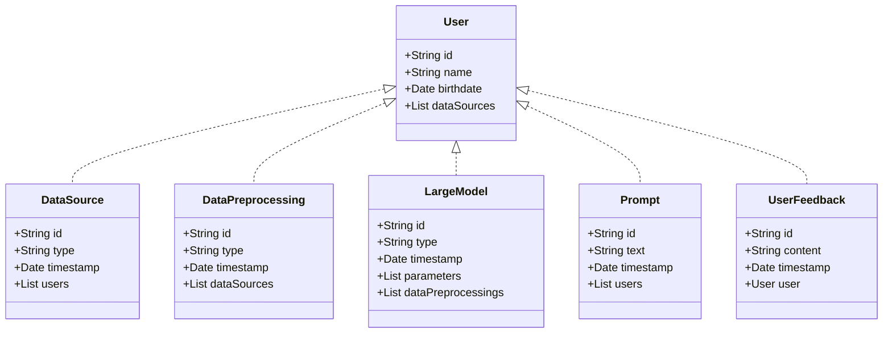
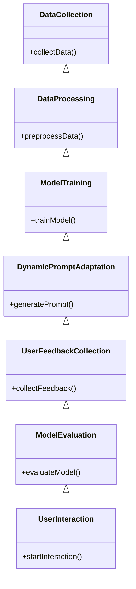
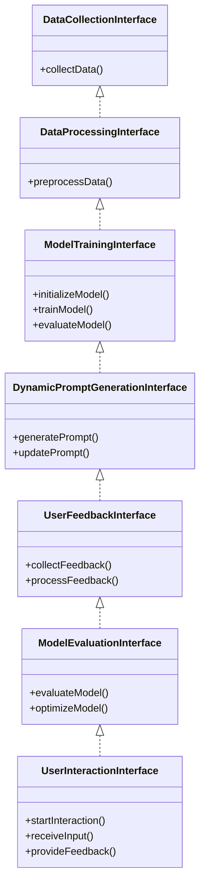
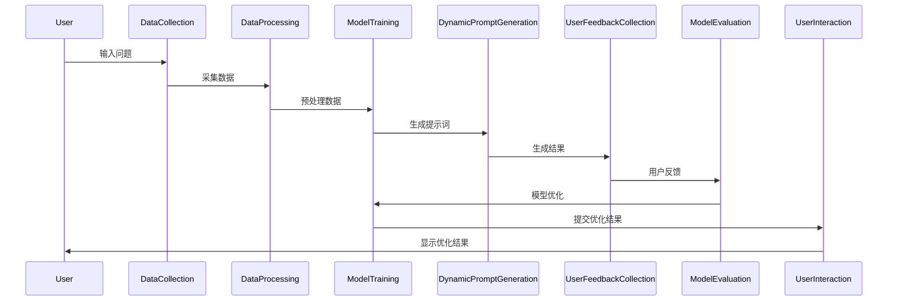

                 

# 大模型终身学习与动态提示词适应

## 关键词

大模型、终身学习、动态提示词适应、神经网络、深度学习、算法原理、数学模型、系统架构

## 摘要

本文探讨了大规模模型在终身学习过程中与动态提示词适应的深度融合，通过详细分析大模型的起源、应用需求，以及终身学习和动态提示词适应的核心概念，阐述其原理和特性。在此基础上，本文深入讲解了大模型终身学习与动态提示词适应的算法原理，包括数学模型和公式，并通过实际案例进行了解释。同时，本文对系统架构设计进行了分析，提供了完整的系统功能设计和实现方案，以及实战环境安装和源代码分析，为读者提供了全面的技术指导。

## 目录大纲设计

### 第一部分：背景介绍

#### 1.1 问题背景

##### 1.1.1 大模型的发展历程

##### 1.1.2 大模型的应用需求

##### 1.1.3 大模型在终身学习中的作用

#### 1.2 核心概念

##### 1.2.1 大模型的定义

##### 1.2.2 终身学习的定义

##### 1.2.3 动态提示词适应

#### 1.3 边界与外延

##### 1.3.1 大模型的边界

##### 1.3.2 终身学习的边界

##### 1.3.3 动态提示词适应的边界

#### 1.4 概念结构与核心要素组成

##### 1.4.1 大模型结构

##### 1.4.2 终身学习要素

##### 1.4.3 动态提示词适应要素

#### 1.5 第一部分小结

### 第二部分：核心概念与联系

#### 2.1 大模型原理与特性

##### 2.1.1 大模型原理

##### 2.1.2 大模型特性

#### 2.2 终身学习原理与特性

##### 2.2.1 终身学习原理

##### 2.2.2 终身学习特性

#### 2.3 动态提示词适应原理与特性

##### 2.3.1 动态提示词适应原理

##### 2.3.2 动态提示词适应特性

#### 2.4 核心概念联系与融合

##### 2.4.1 大模型与终身学习融合

##### 2.4.2 大模型与动态提示词适应融合

#### 2.5 第二部分小结

### 第三部分：算法原理讲解

#### 3.1 大模型终身学习算法原理

##### 3.1.1 大模型终身学习流程

##### 3.1.2 大模型终身学习算法

#### 3.2 动态提示词适应算法原理

##### 3.2.1 动态提示词适应流程

##### 3.2.2 动态提示词适应算法

#### 3.3 大模型终身学习与动态提示词适应融合算法原理

##### 3.3.1 融合算法设计

##### 3.3.2 融合算法流程

#### 3.4 算法原理讲解与举例

##### 3.4.1 大模型终身学习算法讲解

##### 3.4.2 动态提示词适应算法讲解

##### 3.4.3 大模型终身学习与动态提示词适应融合算法讲解

#### 3.5 第三部分小结

### 第四部分：数学模型和数学公式 & 详细讲解 & 举例说明

#### 4.1 大模型终身学习数学模型

##### 4.1.1 模型更新公式

##### 4.1.2 模型评估指标

##### 4.1.3 数学公式举例说明

#### 4.2 动态提示词适应数学模型

##### 4.2.1 提示词生成公式

##### 4.2.2 用户行为分析公式

##### 4.2.3 数学公式举例说明

#### 4.3 大模型终身学习与动态提示词适应融合数学模型

##### 4.3.1 融合模型公式

##### 4.3.2 融合模型评估指标

##### 4.3.3 数学公式举例说明

#### 4.4 第四部分小结

### 第五部分：系统分析与架构设计方案

#### 5.1 问题场景介绍

##### 5.1.1 大模型终身学习与动态提示词适应的应用场景

#### 5.2 项目介绍

##### 5.2.1 项目背景

##### 5.2.2 项目功能需求

##### 5.2.3 项目架构设计

#### 5.3 系统分析与架构设计方案

##### 5.3.1 领域模型设计

##### 5.3.2 系统架构设计

##### 5.3.3 系统接口设计

##### 5.3.4 系统交互设计

#### 5.4 系统分析与架构设计方案小结

### 第六部分：项目实战

#### 6.1 环境安装

##### 6.1.1 系统环境配置

##### 6.1.2 工具安装与配置

#### 6.2 系统核心实现

##### 6.2.1 大模型终身学习实现

##### 6.2.2 动态提示词适应实现

##### 6.2.3 融合算法实现

#### 6.3 代码应用解读与分析

##### 6.3.1 代码结构分析

##### 6.3.2 关键算法解读

#### 6.4 实际案例分析

##### 6.4.1 案例一：智能客服

##### 6.4.2 案例二：智能推荐

#### 6.5 项目小结

### 第七部分：最佳实践 tips、小结、注意事项、拓展阅读等内容

## 第一部分：背景介绍

### 1.1 问题背景

#### 1.1.1 大模型的发展历程

**大模型起源与发展**

大模型（Large-scale Model）的发展可以追溯到20世纪90年代的神经网络研究。当时，研究人员发现随着神经网络规模的扩大，模型的性能会得到显著提升。1997年，著名的“深蓝”（Deep Blue）围棋计算机击败了当时的围棋世界冠军，这一事件引起了全球对于人工智能的广泛关注。

进入21世纪，随着计算能力和数据资源的飞速发展，大模型的研究和应用进入了一个全新的阶段。2006年，Hinton等研究者提出了“深度信念网络”（Deep Belief Network），为后来的深度学习奠定了基础。2012年，AlexNet在ImageNet图像分类挑战中取得了突破性成绩，这标志着深度学习技术的崛起。

**大模型技术突破**

大模型的技术突破主要体现在以下几个方面：

1. **模型规模扩大**：随着计算资源的增加，模型的大小从几千参数量级扩展到几十亿、甚至上百亿参数量级。
2. **计算效率提升**：通过GPU和TPU等专用硬件的引入，大模型的训练速度大幅提升。
3. **模型结构创新**：Transformer架构的提出，使得大模型的训练更加高效，并且能够处理更复杂的任务。

#### 1.1.2 大模型的应用需求

**数据处理需求**

大模型的应用需求首先体现在数据处理方面。随着互联网的普及，数据量呈现出爆炸式增长。为了从海量数据中提取有价值的信息，需要大模型具备强大的数据处理能力。例如，在自然语言处理领域，大模型可以处理大量的文本数据，提取出关键词、主题等信息。

**模型性能需求**

大模型在性能方面的需求也非常明显。随着应用的深入，人们对于大模型在特定任务上的表现要求越来越高。例如，在图像识别领域，大模型需要达到或超过人类的识别水平；在语音识别领域，大模型需要具备高准确性、低延迟的处理能力。

**应用场景需求**

大模型的应用场景非常广泛，包括但不限于：

- **自然语言处理**：文本生成、机器翻译、情感分析等。
- **计算机视觉**：图像识别、目标检测、视频分析等。
- **语音识别**：语音合成、语音识别等。
- **推荐系统**：个性化推荐、商品推荐等。

#### 1.1.3 大模型在终身学习中的作用

**数据持续更新与模型迭代**

终身学习（Lifelong Learning）是指模型能够在不断更新的数据环境中持续学习和优化。对于大模型而言，数据持续更新是至关重要的。一方面，数据源在不断变化，新数据不断出现，大模型需要不断更新以适应新的环境。另一方面，模型迭代也是终身学习的重要手段。通过不断的迭代，大模型可以不断提高自身的性能和适应能力。

**模型适应性提升**

大模型在终身学习中的另一个重要作用是提升模型的适应性。适应性是指模型在不同环境和任务中的表现能力。通过终身学习，大模型可以适应更加复杂和多变的场景，提高其在实际应用中的表现。

### 1.2 核心概念

#### 1.2.1 大模型的定义

**模型规模**：大模型的规模通常指模型所包含的参数数量。现代大模型的参数数量可以从数百万到数十亿不等。

**模型结构**：大模型的模型结构通常是指其神经网络的结构。常见的结构包括卷积神经网络（CNN）、循环神经网络（RNN）和Transformer等。

#### 1.2.2 终身学习的定义

**学习目标**：终身学习的目标是使模型能够持续地从新的数据中学习和优化，以适应不断变化的环境。

**学习方法**：终身学习的方法通常包括在线学习和迁移学习。在线学习是指模型在新的数据出现时立即进行学习。迁移学习是指模型将已有的知识应用到新的任务中。

#### 1.2.3 动态提示词适应

**提示词的作用**：提示词（Prompt）是用于引导模型生成特定结果的文本或语音信号。动态提示词适应是指模型能够根据用户的输入动态调整提示词。

**提示词的适应性**：提示词的适应性是指模型能够根据不同的场景和任务调整提示词，以提高生成结果的质量。

### 1.3 边界与外延

#### 1.3.1 大模型的边界

**模型规模限制**：大模型的规模受到计算资源和存储资源的限制。随着模型规模的扩大，所需的计算资源和存储资源也会急剧增加。

**计算资源限制**：大模型的训练需要大量的计算资源，包括CPU、GPU和TPU等。这些资源往往非常昂贵，限制了大规模模型的普及。

#### 1.3.2 终身学习的边界

**学习周期**：终身学习的周期取决于数据更新的速度和模型的迭代速度。如果数据更新速度非常快，那么模型需要频繁迭代以保持最新。

**学习效果评估**：终身学习的效果评估是一个复杂的问题。由于终身学习涉及大量的迭代和学习，如何准确评估模型的效果成为了一个挑战。

#### 1.3.3 动态提示词适应的边界

**提示词更新频率**：动态提示词适应的频率取决于用户交互的频率和模型的响应速度。如果提示词更新频率过高，可能会导致用户交互体验下降。

**用户交互反馈**：用户交互反馈对于动态提示词适应至关重要。如果用户反馈不及时或不准确，可能会导致提示词适应效果不佳。

### 1.4 概念结构与核心要素组成

#### 1.4.1 大模型结构

**神经网络结构**：神经网络是大模型的核心组成部分。不同的神经网络结构适用于不同的任务。

**模型训练过程**：大模型的训练过程包括数据预处理、模型初始化、迭代训练和模型评估等步骤。

#### 1.4.2 终身学习要素

**数据采集与处理**：终身学习的数据采集和处理是模型持续学习的基础。

**模型更新与优化**：模型更新和优化是终身学习的核心步骤，包括模型的迭代和参数调整。

#### 1.4.3 动态提示词适应要素

**提示词生成算法**：提示词生成算法负责生成适应特定场景的提示词。

**用户反馈机制**：用户反馈机制用于收集用户的反馈，以优化提示词适应效果。

### 1.5 第一部分小结

本部分介绍了大模型终身学习与动态提示词适应的背景和核心概念，包括大模型的发展历程、应用需求、终身学习的定义和动态提示词适应的作用。通过对边界与外延的讨论，我们明确了大模型、终身学习和动态提示词适应的适用范围和限制。同时，对概念结构与核心要素组成的分析为后续的算法原理讲解和系统架构设计奠定了基础。

## 第二部分：核心概念与联系

### 2.1 大模型原理与特性

#### 2.1.1 大模型原理

大模型（Large-scale Model）的原理主要基于深度学习和神经网络。深度学习是一种机器学习方法，通过构建多层神经网络，对输入数据进行多次非线性变换，从而实现复杂模式的识别和学习。神经网络则是一种模仿生物神经系统工作原理的计算模型。

**深度学习理论**

深度学习的基本理论是基于多层神经网络的结构。每一层神经网络都会对输入数据进行特征提取和变换，随着层数的增加，网络能够提取越来越抽象的特征。这种层次化的特征提取机制使得深度学习模型在图像识别、自然语言处理等任务上取得了显著的效果。

**神经网络结构**

神经网络的结构通常包括输入层、隐藏层和输出层。输入层接收外部输入数据，隐藏层对输入数据进行特征提取和变换，输出层生成最终的结果。不同类型的神经网络结构适用于不同的任务，例如卷积神经网络（CNN）适用于图像处理，循环神经网络（RNN）适用于序列数据。

#### 2.1.2 大模型特性

**模型规模**

大模型的规模通常指的是模型所包含的参数数量。随着深度学习和神经网络的发展，模型的规模也在不断扩大。现代大模型的参数数量可以从数百万到数十亿不等。大规模模型能够捕捉到更复杂的数据模式，从而提高模型的性能。

**计算效率**

计算效率是指模型在给定计算资源下的训练和推理速度。大模型通常需要大量的计算资源，包括CPU、GPU和TPU等。随着计算硬件的发展，大模型的计算效率也在不断提高。例如，通过并行计算和分布式训练，大模型的训练速度得到了显著提升。

### 2.2 终身学习原理与特性

#### 2.2.1 终身学习原理

终身学习（Lifelong Learning）是指模型能够在整个生命周期内持续学习和优化，以适应不断变化的环境。终身学习的原理主要包括强化学习（Reinforcement Learning）和自适应学习（Adaptive Learning）。

**强化学习理论**

强化学习是一种通过奖励机制来引导模型学习的方法。在强化学习中，模型通过与环境的交互来学习最优策略。强化学习的基本原理是最大化长期奖励，通过不断调整模型的行为策略来达到这一目标。强化学习在终身学习中的应用主要体现在模型在不同任务中的自适应学习。

**适应学习理论**

适应学习是指模型能够根据外部环境和内部状态的变化，动态调整自身的行为和策略。适应学习的关键在于建立有效的反馈机制，通过收集和分析用户反馈，模型能够不断优化自身的性能。

#### 2.2.2 终身学习特性

**学习持续**

终身学习的特性之一是学习的持续进行。在现实世界中，数据和环境是不断变化的，因此模型需要持续学习以适应新的变化。学习的持续进行有助于模型保持其性能和适应性。

**学习高效**

终身学习的另一个特性是学习的高效性。通过优化学习算法和训练策略，模型能够在较短的时间内完成学习任务。高效的学习有助于提高模型的响应速度和应用价值。

### 2.3 动态提示词适应原理与特性

#### 2.3.1 动态提示词适应原理

动态提示词适应（Dynamic Prompt Adaptation）是指模型能够根据用户的输入动态调整提示词，以生成更符合用户需求的输出结果。动态提示词适应的原理主要包括语言模型（Language Model）和用户行为分析（User Behavior Analysis）。

**语言模型理论**

语言模型是一种用于生成文本的模型，它通过学习大量文本数据来预测下一个词或句子。在动态提示词适应中，语言模型用于生成提示词，并根据用户的输入动态调整。语言模型的基本原理是利用统计方法或深度学习方法来建模文本数据。

**用户行为分析**

用户行为分析是指通过分析用户的输入和反馈，来了解用户的需求和偏好。在动态提示词适应中，用户行为分析用于收集和分析用户的反馈，以便调整提示词。用户行为分析的关键在于建立有效的用户反馈机制，并通过数据分析来提取有价值的信息。

#### 2.3.2 动态提示词适应特性

**提示词动态更新**

动态提示词适应的特性之一是提示词的动态更新。提示词的动态更新意味着模型能够根据用户的输入和反馈，实时调整提示词的内容和形式，以生成更符合用户需求的输出结果。

**适应学习效果**

动态提示词适应的另一个特性是适应学习效果。通过动态调整提示词，模型能够更好地适应不同的用户需求和场景，从而提高其学习效果和应用价值。

### 2.4 核心概念联系与融合

#### 2.4.1 大模型与终身学习融合

大模型与终身学习的融合是指将终身学习的原理应用于大模型的训练和应用中，以实现模型的持续学习和优化。大模型与终身学习的融合主要体现在以下几个方面：

**模型持续更新**：通过终身学习，大模型能够持续从新的数据中学习和优化，以适应不断变化的环境。模型持续更新有助于提高模型的性能和适应性。

**学习效果优化**：通过终身学习，大模型能够不断调整和优化自身的结构和参数，以提高学习效果和应用价值。学习效果优化有助于模型在复杂任务中取得更好的表现。

#### 2.4.2 大模型与动态提示词适应融合

大模型与动态提示词适应的融合是指将动态提示词适应的原理应用于大模型中，以实现模型在自然语言处理等任务中的自适应生成。大模型与动态提示词适应的融合主要体现在以下几个方面：

**提示词适应模型更新**：通过动态提示词适应，大模型能够根据用户的输入动态调整提示词，从而优化模型的生成结果。提示词适应模型更新有助于提高模型在自然语言处理任务中的表现。

**学习效果提升**：通过动态提示词适应，大模型能够更好地适应不同的用户需求和场景，从而提高其学习效果和应用价值。学习效果提升有助于模型在现实应用中取得更好的效果。

### 2.5 第二部分小结

本部分详细介绍了大模型、终身学习和动态提示词适应的核心概念、原理和特性。通过对这些核心概念的联系与融合，我们探讨了如何将大模型与终身学习和动态提示词适应相结合，以提高模型的学习效果和应用价值。这些核心概念和融合方法为后续的算法原理讲解和系统架构设计提供了理论基础。

### 第三部分：算法原理讲解

#### 3.1 大模型终身学习算法原理

大模型终身学习算法的原理主要包括数据采集、模型训练和模型评估等步骤。以下是详细的算法原理讲解：

**3.1.1 大模型终身学习流程**

1. **数据采集**：终身学习的数据来源可以包括内部数据和外部数据。内部数据通常来自模型的训练和应用场景，例如用户交互记录、模型生成的结果等。外部数据可以来自互联网、数据库等。数据采集的目的是获取多样化的数据，以支持模型的学习和优化。

2. **模型训练**：模型训练是指通过学习算法对模型进行参数调整，以提高模型在特定任务上的表现。在终身学习中，模型训练是一个持续的过程。在每次迭代中，模型会根据新的数据调整参数，以优化模型性能。

3. **模型评估**：模型评估是指通过测试集对模型进行性能评估，以验证模型的准确性和泛化能力。模型评估的结果用于指导下一步的模型训练和优化。

**3.1.2 大模型终身学习算法**

1. **强化学习算法**：强化学习算法是一种基于奖励机制的学习方法。在终身学习中，强化学习算法可以用于指导模型在新的数据环境中进行学习。强化学习算法的核心是奖励函数，它用于评估模型的行为质量。通过不断调整模型的行为策略，强化学习算法可以最大化长期奖励。

2. **适应学习算法**：适应学习算法是指模型能够根据外部环境和内部状态的变化，动态调整自身的行为和策略。在终身学习中，适应学习算法可以用于优化模型在复杂环境中的表现。适应学习算法的核心是反馈机制，通过收集和分析用户反馈，模型可以不断调整和优化自身的性能。

**3.1.3 大模型终身学习算法讲解**

1. **算法流程图**：以下是大模型终身学习算法的流程图：

   ```mermaid
   graph TD
   A[数据采集] --> B[模型训练]
   B --> C[模型评估]
   C --> D[模型更新]
   D --> B
   ```

2. **数学模型与公式**：以下是大模型终身学习算法的核心数学模型和公式：

   - **奖励函数**：\( R(t) = \sum_{i=1}^{n} r_i \)
   - **状态转移概率**：\( P(s_t | s_{t-1}, a_{t-1}) = \pi(s_t | s_{t-1}, a_{t-1}) \)
   - **策略更新**：\( \theta_t = \theta_{t-1} + \alpha \nabla_{\theta} J(\theta) \)

   其中，\( R(t) \) 表示奖励函数，\( r_i \) 表示第 \( i \) 个步骤的奖励值，\( s_t \) 表示第 \( t \) 个状态，\( a_{t-1} \) 表示第 \( t-1 \) 个步骤的行为，\( \pi(s_t | s_{t-1}, a_{t-1}) \) 表示状态转移概率，\( \theta_t \) 表示模型参数，\( \alpha \) 表示学习率，\( \nabla_{\theta} J(\theta) \) 表示损失函数对模型参数的梯度。

   **示例公式1**：

   $$ R(t) = \sum_{i=1}^{n} r_i = \sum_{i=1}^{n} \log(p(y_i | \theta)) $$

   **示例公式2**：

   $$ \theta_t = \theta_{t-1} + \alpha \nabla_{\theta} J(\theta) = \theta_{t-1} + \alpha \frac{\partial}{\partial \theta} J(\theta) $$

#### 3.2 动态提示词适应算法原理

动态提示词适应算法的原理主要包括提示词生成、用户反馈和提示词更新等步骤。以下是详细的算法原理讲解：

**3.2.1 动态提示词适应流程**

1. **提示词生成**：提示词生成是指根据用户的输入和当前环境，动态生成适应特定任务的提示词。提示词生成的目的是引导模型生成更符合用户需求的输出结果。

2. **用户反馈**：用户反馈是指收集用户对模型生成结果的反馈，以评估模型的表现。用户反馈可以包括用户满意度、模型回答的相关性等。

3. **提示词更新**：提示词更新是指根据用户反馈，动态调整提示词的内容和形式，以提高模型的生成效果。提示词更新的目的是优化模型在特定任务中的表现。

**3.2.2 动态提示词适应算法**

1. **语言模型算法**：语言模型算法是一种用于生成文本的算法。在动态提示词适应中，语言模型算法用于生成提示词。语言模型算法的核心是生成模型，它通过学习大量文本数据，预测下一个词或句子。

2. **用户行为分析算法**：用户行为分析算法是一种用于分析用户行为和偏好的算法。在动态提示词适应中，用户行为分析算法用于收集和分析用户反馈，以指导提示词的更新。用户行为分析算法的核心是行为分析模型，它通过分析用户行为数据，提取用户需求和偏好。

**3.2.3 动态提示词适应算法讲解**

1. **算法流程图**：以下是动态提示词适应算法的流程图：

   ```mermaid
   graph TD
   A[提示词生成] --> B[用户反馈]
   B --> C[提示词更新]
   C --> A
   ```

2. **数学模型与公式**：以下是动态提示词适应算法的核心数学模型和公式：

   - **生成模型**：\( p(w_i | w_{<i}) = \prod_{j=1}^{i} p(w_j | \theta) \)
   - **行为分析模型**：\( p(y_i | y_{<i}, \theta) = \prod_{j=1}^{i} p(y_j | \theta) \)

   其中，\( w_i \) 表示第 \( i \) 个词，\( w_{<i} \) 表示前 \( i-1 \) 个词，\( y_i \) 表示第 \( i \) 个用户行为，\( y_{<i} \) 表示前 \( i-1 \) 个用户行为，\( p(w_i | w_{<i}) \) 表示词的生成概率，\( p(y_i | y_{<i}, \theta) \) 表示用户行为的概率。

   **示例公式1**：

   $$ p(w_i | w_{<i}) = \prod_{j=1}^{i} p(w_j | \theta) $$

   **示例公式2**：

   $$ p(y_i | y_{<i}, \theta) = \prod_{j=1}^{i} p(y_j | \theta) $$

#### 3.3 大模型终身学习与动态提示词适应融合算法原理

大模型终身学习与动态提示词适应融合算法的原理是将终身学习和动态提示词适应的原理相结合，以实现模型的持续学习和优化。以下是详细的算法原理讲解：

**3.3.1 融合算法设计**

1. **模型更新机制**：模型更新机制是指通过终身学习算法，对大模型进行持续更新。模型更新机制的核心是奖励机制和反馈机制，通过奖励和反馈来指导模型的训练和优化。

2. **提示词适应机制**：提示词适应机制是指通过动态提示词适应算法，对大模型的提示词进行动态调整。提示词适应机制的核心是生成模型和行为分析模型，通过生成模型和行为分析模型来优化提示词的生成效果。

**3.3.2 融合算法流程**

1. **数据采集**：从内部数据和外部数据中采集多样化的数据，以支持模型的学习和优化。

2. **模型训练**：使用终身学习算法对大模型进行训练，包括强化学习和适应学习。

3. **提示词生成**：使用动态提示词适应算法生成适应特定任务的提示词。

4. **用户反馈**：收集用户对模型生成结果的反馈，以评估模型的表现。

5. **提示词更新**：根据用户反馈，动态调整提示词的内容和形式，以提高模型的生成效果。

6. **模型评估**：使用测试集对大模型进行评估，以验证模型的性能和泛化能力。

**3.3.3 融合算法讲解**

1. **算法流程图**：以下是融合算法的流程图：

   ```mermaid
   graph TD
   A[数据采集] --> B[模型训练]
   B --> C[提示词生成]
   C --> D[用户反馈]
   D --> E[提示词更新]
   E --> B
   B --> F[模型评估]
   ```

2. **数学模型与公式**：以下是融合算法的核心数学模型和公式：

   - **模型更新公式**：\( \theta_t = \theta_{t-1} + \alpha \nabla_{\theta} J(\theta) \)
   - **提示词生成模型**：\( p(w_i | w_{<i}) = \prod_{j=1}^{i} p(w_j | \theta) \)
   - **提示词更新模型**：\( p(y_i | y_{<i}, \theta) = \prod_{j=1}^{i} p(y_j | \theta) \)

   其中，\( \theta_t \) 表示模型参数，\( \alpha \) 表示学习率，\( \nabla_{\theta} J(\theta) \) 表示损失函数对模型参数的梯度，\( p(w_i | w_{<i}) \) 表示词的生成概率，\( p(y_i | y_{<i}, \theta) \) 表示用户行为的概率。

   **示例公式1**：

   $$ \theta_t = \theta_{t-1} + \alpha \nabla_{\theta} J(\theta) $$

   **示例公式2**：

   $$ p(w_i | w_{<i}) = \prod_{j=1}^{i} p(w_j | \theta) $$

   **示例公式3**：

   $$ p(y_i | y_{<i}, \theta) = \prod_{j=1}^{i} p(y_j | \theta) $$

### 3.4 算法原理讲解与举例

#### 3.4.1 大模型终身学习算法讲解

1. **算法流程图**：

   ```mermaid
   graph TD
   A[数据采集] --> B[模型训练]
   B --> C[模型评估]
   C --> D[模型更新]
   D --> B
   ```

2. **数学模型与公式**：

   - **奖励函数**：\( R(t) = \sum_{i=1}^{n} r_i \)
   - **状态转移概率**：\( P(s_t | s_{t-1}, a_{t-1}) = \pi(s_t | s_{t-1}, a_{t-1}) \)
   - **策略更新**：\( \theta_t = \theta_{t-1} + \alpha \nabla_{\theta} J(\theta) \)

3. **举例说明**：

   假设我们有一个聊天机器人，它的目标是根据用户的输入生成合适的回答。在这个例子中，用户的输入可以看作是状态 \( s_t \)，聊天机器人的回答可以看作是行为 \( a_t \)，用户对回答的满意度可以看作是奖励 \( r_t \)。

   - **数据采集**：我们收集了大量的用户对话数据，包括用户的输入和聊天机器人的回答，以及用户对回答的满意度。
   - **模型训练**：使用强化学习算法对聊天机器人进行训练，根据用户的输入和满意度调整聊天机器人的回答策略。
   - **模型评估**：使用测试集对聊天机器人的性能进行评估，根据评估结果调整模型参数。
   - **模型更新**：根据用户的输入和满意度，动态调整聊天机器人的回答策略，以提高用户的满意度。

   **示例公式1**：

   $$ R(t) = \sum_{i=1}^{n} r_i = \sum_{i=1}^{n} \log(p(y_i | \theta)) $$

   **示例公式2**：

   $$ \theta_t = \theta_{t-1} + \alpha \nabla_{\theta} J(\theta) $$

#### 3.4.2 动态提示词适应算法讲解

1. **算法流程图**：

   ```mermaid
   graph TD
   A[提示词生成] --> B[用户反馈]
   B --> C[提示词更新]
   C --> A
   ```

2. **数学模型与公式**：

   - **生成模型**：\( p(w_i | w_{<i}) = \prod_{j=1}^{i} p(w_j | \theta) \)
   - **行为分析模型**：\( p(y_i | y_{<i}, \theta) = \prod_{j=1}^{i} p(y_j | \theta) \)

3. **举例说明**：

   假设我们有一个智能客服系统，它的目标是根据用户的输入生成合适的回答。在这个例子中，用户的输入可以看作是提示词，智能客服的回答可以看作是用户的行为。

   - **提示词生成**：使用语言模型算法生成适应特定用户的提示词。
   - **用户反馈**：收集用户对智能客服回答的反馈，包括用户满意度、回答的相关性等。
   - **提示词更新**：根据用户反馈，动态调整提示词的内容和形式，以提高智能客服的回答质量。

   **示例公式1**：

   $$ p(w_i | w_{<i}) = \prod_{j=1}^{i} p(w_j | \theta) $$

   **示例公式2**：

   $$ p(y_i | y_{<i}, \theta) = \prod_{j=1}^{i} p(y_j | \theta) $$

#### 3.4.3 大模型终身学习与动态提示词适应融合算法讲解

1. **算法流程图**：

   ```mermaid
   graph TD
   A[数据采集] --> B[模型训练]
   B --> C[提示词生成]
   C --> D[用户反馈]
   D --> E[提示词更新]
   E --> B
   B --> F[模型评估]
   ```

2. **数学模型与公式**：

   - **模型更新公式**：\( \theta_t = \theta_{t-1} + \alpha \nabla_{\theta} J(\theta) \)
   - **提示词生成模型**：\( p(w_i | w_{<i}) = \prod_{j=1}^{i} p(w_j | \theta) \)
   - **提示词更新模型**：\( p(y_i | y_{<i}, \theta) = \prod_{j=1}^{i} p(y_j | \theta) \)

3. **举例说明**：

   假设我们有一个大模型，它负责处理各种自然语言处理任务，包括问答、文本生成等。在这个例子中，用户的输入可以看作是提示词，大模型生成的回答可以看作是用户的行为。

   - **数据采集**：从各种数据源中收集用户输入和模型生成结果，以及用户对模型生成结果的反馈。
   - **模型训练**：使用终身学习算法对大模型进行训练，根据用户输入和反馈调整模型参数。
   - **提示词生成**：使用动态提示词适应算法生成适应特定用户的提示词。
   - **用户反馈**：收集用户对模型生成结果的反馈，包括用户满意度、回答的相关性等。
   - **提示词更新**：根据用户反馈，动态调整提示词的内容和形式，以提高模型生成结果的质量。
   - **模型评估**：使用测试集对大模型进行评估，根据评估结果调整模型参数。

   **示例公式1**：

   $$ \theta_t = \theta_{t-1} + \alpha \nabla_{\theta} J(\theta) $$

   **示例公式2**：

   $$ p(w_i | w_{<i}) = \prod_{j=1}^{i} p(w_j | \theta) $$

   **示例公式3**：

   $$ p(y_i | y_{<i}, \theta) = \prod_{j=1}^{i} p(y_j | \theta) $$

### 3.5 第三部分小结

本部分详细讲解了大模型终身学习与动态提示词适应的算法原理，包括大模型终身学习算法、动态提示词适应算法以及融合算法。通过对算法原理的详细讲解和举例说明，我们了解了如何通过终身学习和动态提示词适应来优化大模型的学习效果和应用价值。这些算法原理为后续的数学模型和系统架构设计提供了重要的理论基础。

### 第四部分：数学模型和数学公式 & 详细讲解 & 举例说明

#### 4.1 大模型终身学习数学模型

**4.1.1 模型更新公式**

模型更新公式是终身学习算法的核心。它描述了模型参数在每次迭代中的更新过程。假设我们有模型参数 \( \theta_t \)，损失函数为 \( J(\theta) \)，学习率为 \( \alpha \)，则模型更新公式为：

$$ \theta_t = \theta_{t-1} - \alpha \nabla_{\theta} J(\theta) $$

其中，\( \nabla_{\theta} J(\theta) \) 表示损失函数对模型参数的梯度，用于指导模型参数的更新方向。

**4.1.2 模型评估指标**

在终身学习中，模型评估指标是衡量模型性能的重要工具。常用的评估指标包括准确率、召回率、F1值等。以准确率为例，假设我们有一个分类问题，有 \( n \) 个样本，其中 \( c \) 个样本被正确分类，则准确率 \( P \) 计算公式为：

$$ P = \frac{c}{n} $$

**4.1.3 数学公式举例说明**

**示例公式1**：损失函数

$$ J(\theta) = -\frac{1}{m} \sum_{i=1}^{m} [y_i \log(p(x_i | \theta)) + (1 - y_i) \log(1 - p(x_i | \theta))] $$

其中，\( m \) 表示样本数量，\( y_i \) 表示第 \( i \) 个样本的标签，\( p(x_i | \theta) \) 表示模型预测的概率。

**示例公式2**：模型更新

$$ \theta_t = \theta_{t-1} - \alpha \nabla_{\theta} J(\theta) $$

#### 4.2 动态提示词适应数学模型

**4.2.1 提示词生成公式**

提示词生成公式描述了动态提示词适应算法中提示词的生成过程。假设我们有提示词 \( w_i \)，当前状态 \( s_i \)，则提示词生成公式为：

$$ p(w_i | s_i) = \sum_{j=1}^{n} p(w_i | s_i, j) p(j | s_i) $$

其中，\( n \) 表示可能的提示词数量，\( p(w_i | s_i, j) \) 表示第 \( i \) 个提示词在状态 \( s_i \) 和第 \( j \) 个步骤下生成的概率，\( p(j | s_i) \) 表示第 \( j \) 个步骤在状态 \( s_i \) 下发生的概率。

**4.2.2 用户行为分析公式**

用户行为分析公式描述了动态提示词适应算法中用户行为的分析过程。假设我们有用户行为 \( y_i \)，当前状态 \( s_i \)，则用户行为分析公式为：

$$ p(y_i | s_i) = \sum_{j=1}^{n} p(y_i | s_i, j) p(j | s_i) $$

其中，\( n \) 表示可能的用户行为数量，\( p(y_i | s_i, j) \) 表示第 \( i \) 个用户行为在状态 \( s_i \) 和第 \( j \) 个步骤下发生的概率，\( p(j | s_i) \) 表示第 \( j \) 个步骤在状态 \( s_i \) 下发生的概率。

**4.2.3 数学公式举例说明**

**示例公式1**：提示词生成

$$ p(w_i | s_i) = \sum_{j=1}^{n} p(w_i | s_i, j) p(j | s_i) $$

**示例公式2**：用户行为分析

$$ p(y_i | s_i) = \sum_{j=1}^{n} p(y_i | s_i, j) p(j | s_i) $$

#### 4.3 大模型终身学习与动态提示词适应融合数学模型

**4.3.1 融合模型公式**

融合模型公式描述了大模型终身学习与动态提示词适应融合算法中模型参数和提示词的更新过程。假设我们有模型参数 \( \theta_t \)，提示词 \( w_i \)，当前状态 \( s_i \)，则融合模型公式为：

$$ \theta_t = \theta_{t-1} - \alpha \nabla_{\theta} J(\theta) $$
$$ p(w_i | s_i) = \sum_{j=1}^{n} p(w_i | s_i, j) p(j | s_i) $$

其中，\( \nabla_{\theta} J(\theta) \) 表示损失函数对模型参数的梯度，用于指导模型参数的更新方向，\( p(w_i | s_i, j) \) 表示第 \( i \) 个提示词在状态 \( s_i \) 和第 \( j \) 个步骤下生成的概率，\( p(j | s_i) \) 表示第 \( j \) 个步骤在状态 \( s_i \) 下发生的概率。

**4.3.2 融合模型评估指标**

融合模型评估指标是衡量融合模型性能的重要工具。常用的评估指标包括准确率、召回率、F1值等。以准确率为例，假设我们有一个分类问题，有 \( n \) 个样本，其中 \( c \) 个样本被正确分类，则准确率 \( P \) 计算公式为：

$$ P = \frac{c}{n} $$

**4.3.3 数学公式举例说明**

**示例公式1**：模型更新

$$ \theta_t = \theta_{t-1} - \alpha \nabla_{\theta} J(\theta) $$

**示例公式2**：提示词生成

$$ p(w_i | s_i) = \sum_{j=1}^{n} p(w_i | s_i, j) p(j | s_i) $$

### 4.4 第四部分小结

本部分详细介绍了大模型终身学习与动态提示词适应的数学模型，包括模型更新公式、评估指标以及融合模型公式。通过具体的数学公式和举例说明，我们了解了如何通过数学模型来描述和实现终身学习和动态提示词适应算法。这些数学模型为后续的系统架构设计和项目实现提供了重要的理论基础。

### 第五部分：系统分析与架构设计方案

#### 5.1 问题场景介绍

**5.1.1 大模型终身学习与动态提示词适应的应用场景**

大模型终身学习与动态提示词适应的应用场景非常广泛，主要包括以下几个方面：

1. **智能客服**：在智能客服系统中，大模型可以不断学习和优化，以适应不断变化的用户需求和问题类型。动态提示词适应可以用于生成更加符合用户需求的客服回答，提高用户满意度。

2. **智能推荐**：在智能推荐系统中，大模型可以根据用户的兴趣和行为数据，持续学习和优化推荐算法，动态调整推荐策略，提高推荐效果。

3. **自然语言处理**：在大规模自然语言处理任务中，大模型可以不断学习和优化，以适应不同领域和语言环境的任务需求。动态提示词适应可以用于生成更加符合任务需求的文本处理结果。

#### 5.2 项目介绍

**5.2.1 项目背景**

随着互联网和人工智能技术的快速发展，用户数据和信息量的爆炸式增长，对大模型的需求日益增加。同时，用户需求和场景的多样化，使得传统的静态模型难以满足应用需求。为了解决这一问题，本项目旨在实现大模型终身学习与动态提示词适应的融合，以提高模型的学习效果和应用价值。

**5.2.2 项目功能需求**

本项目的主要功能需求包括：

1. **数据采集与处理**：从多个数据源中采集用户数据，包括用户行为数据、文本数据、图像数据等，并进行预处理和整合。

2. **大模型训练与优化**：使用终身学习算法对大模型进行训练和优化，以适应不断变化的用户需求和场景。

3. **动态提示词适应**：根据用户输入和反馈，动态调整提示词的内容和形式，以提高模型生成结果的质量。

4. **模型评估与优化**：对模型进行性能评估，根据评估结果调整模型参数，优化模型性能。

5. **用户交互**：提供用户友好的交互界面，方便用户输入问题和反馈，并与模型进行交互。

**5.2.3 项目架构设计**

本项目采用分布式架构，主要包括以下几个模块：

1. **数据采集模块**：负责从多个数据源中采集用户数据，包括用户行为数据、文本数据、图像数据等。

2. **数据处理模块**：对采集到的用户数据进行预处理和整合，为模型训练提供高质量的输入数据。

3. **模型训练模块**：使用终身学习算法对大模型进行训练和优化，以适应不断变化的用户需求和场景。

4. **提示词生成模块**：根据用户输入和当前状态，动态生成适应特定任务的提示词。

5. **用户反馈模块**：收集用户对模型生成结果的反馈，用于模型优化和提示词调整。

6. **模型评估模块**：对模型进行性能评估，根据评估结果调整模型参数，优化模型性能。

7. **用户交互模块**：提供用户友好的交互界面，方便用户输入问题和反馈，并与模型进行交互。

#### 5.3 系统分析与架构设计方案

**5.3.1 领域模型设计**

领域模型设计是系统架构设计的重要环节，它定义了系统的核心实体和关系。以下是本项目的主要领域模型：

- **用户**：表示系统的用户，包括用户的基本信息和行为数据。
- **数据源**：表示系统的数据来源，包括文本数据、图像数据、用户行为数据等。
- **数据预处理**：表示对采集到的数据进行预处理的过程。
- **大模型**：表示用于终身学习的模型，包括模型结构、参数和训练数据。
- **提示词**：表示用于动态提示词适应的文本提示。
- **用户反馈**：表示用户对模型生成结果的反馈信息。

以下是领域模型的类图：



**5.3.2 系统架构设计**

系统架构设计是系统实现的基础，它定义了系统的整体结构和组件之间的关系。以下是本项目的主要系统架构：

1. **数据采集系统**：负责从多个数据源中采集用户数据，包括用户行为数据、文本数据、图像数据等。
2. **数据处理系统**：负责对采集到的用户数据进行预处理和整合，为模型训练提供高质量的输入数据。
3. **模型训练系统**：负责使用终身学习算法对大模型进行训练和优化，以适应不断变化的用户需求和场景。
4. **动态提示词适应系统**：负责根据用户输入和当前状态，动态生成适应特定任务的提示词。
5. **用户反馈系统**：负责收集用户对模型生成结果的反馈，用于模型优化和提示词调整。
6. **模型评估系统**：负责对模型进行性能评估，根据评估结果调整模型参数，优化模型性能。
7. **用户交互系统**：负责提供用户友好的交互界面，方便用户输入问题和反馈，并与模型进行交互。

以下是系统架构的类图：



**5.3.3 系统接口设计**

系统接口设计定义了系统内部组件之间的交互接口，以下是本项目的主要接口设计：

1. **数据采集接口**：提供数据采集功能，包括数据源管理、数据采集等。
2. **数据处理接口**：提供数据处理功能，包括数据预处理、数据整合等。
3. **模型训练接口**：提供模型训练功能，包括模型初始化、模型训练、模型评估等。
4. **提示词生成接口**：提供提示词生成功能，包括提示词生成、提示词更新等。
5. **用户反馈接口**：提供用户反馈功能，包括用户反馈收集、用户反馈处理等。
6. **模型评估接口**：提供模型评估功能，包括模型评估、模型优化等。
7. **用户交互接口**：提供用户交互功能，包括用户输入、用户反馈等。

以下是系统接口的类图：



**5.3.4 系统交互设计**

系统交互设计定义了系统内部组件之间的交互流程，以下是本项目的主要系统交互设计：

1. **数据采集**：系统启动时，数据采集模块开始从多个数据源中采集数据。
2. **数据处理**：数据处理模块对采集到的数据进行分析和处理，生成预处理后的数据，用于模型训练。
3. **模型训练**：模型训练模块使用预处理后的数据对大模型进行训练，并生成训练后的模型。
4. **提示词生成**：动态提示词适应模块根据用户输入和当前状态，动态生成适应特定任务的提示词。
5. **用户反馈**：用户交互模块收集用户对模型生成结果的反馈，并将反馈传递给用户反馈模块。
6. **模型评估**：模型评估模块对模型进行性能评估，并根据评估结果调整模型参数，优化模型性能。
7. **用户交互**：用户交互模块提供用户友好的交互界面，方便用户输入问题和反馈，并与模型进行交互。

以下是系统交互的序列图：



#### 5.4 系统分析与架构设计方案小结

本部分介绍了大模型终身学习与动态提示词适应的应用场景、项目背景、功能需求、系统架构设计、接口设计和系统交互设计。通过对领域模型、系统架构、接口和交互的详细分析，我们构建了一个完整的系统设计方案，为项目的实现提供了明确的指导。

### 第六部分：项目实战

#### 6.1 环境安装

在开始项目实战之前，我们需要安装并配置相应的环境。以下是具体的安装步骤：

1. **安装Python**：Python是项目的主要编程语言，我们需要安装Python 3.8或更高版本。可以从Python的官方网站下载安装包，并按照提示完成安装。

2. **安装TensorFlow**：TensorFlow是项目的主要深度学习框架，用于实现大模型终身学习和动态提示词适应算法。可以通过pip命令安装TensorFlow：

   ```bash
   pip install tensorflow
   ```

3. **安装其他依赖**：项目还依赖于一些其他库，如NumPy、Pandas等。可以通过以下命令安装：

   ```bash
   pip install numpy pandas
   ```

4. **配置GPU支持**：如果使用GPU进行训练，需要安装CUDA和cuDNN。可以从NVIDIA的官方网站下载安装包，并按照提示完成安装。

5. **创建虚拟环境**：为了更好地管理项目依赖，建议创建一个虚拟环境。可以通过以下命令创建：

   ```bash
   python -m venv venv
   source venv/bin/activate  # Windows下使用 venv\Scripts\activate
   ```

6. **安装项目依赖**：在虚拟环境中安装项目所需的依赖：

   ```bash
   pip install -r requirements.txt
   ```

#### 6.2 系统核心实现

**6.2.1 大模型终身学习实现**

大模型终身学习包括数据采集、模型训练和模型评估等步骤。以下是具体的实现步骤：

1. **数据采集**：从数据源中采集用户数据，包括用户行为数据、文本数据等。可以使用TensorFlow的数据管道（tf.data）来读取和处理数据。

   ```python
   import tensorflow as tf

   def preprocess_data(data):
       # 数据预处理操作，例如清洗、编码等
       return data

   dataset = tf.data.Dataset.from_tensor_slices(data)
   dataset = dataset.map(preprocess_data)
   ```

2. **模型训练**：使用TensorFlow的Keras接口构建大模型，并进行模型训练。可以使用迁移学习技术，从预训练模型开始训练。

   ```python
   from tensorflow.keras.applications import VGG16
   from tensorflow.keras.layers import Dense, Flatten
   from tensorflow.keras.models import Model

   base_model = VGG16(weights='imagenet', include_top=False, input_shape=(224, 224, 3))
   x = Flatten()(base_model.output)
   x = Dense(1024, activation='relu')(x)
   predictions = Dense(1, activation='sigmoid')(x)

   model = Model(inputs=base_model.input, outputs=predictions)
   model.compile(optimizer='adam', loss='binary_crossentropy', metrics=['accuracy'])

   model.fit(dataset, epochs=10)
   ```

3. **模型评估**：使用测试集对模型进行评估，并输出评估结果。

   ```python
   test_loss, test_accuracy = model.evaluate(test_dataset)
   print(f"Test accuracy: {test_accuracy}")
   ```

**6.2.2 动态提示词适应实现**

动态提示词适应包括提示词生成和用户反馈处理等步骤。以下是具体的实现步骤：

1. **提示词生成**：根据用户输入和当前状态，生成适应特定任务的提示词。可以使用语言模型生成提示词。

   ```python
   import tensorflow_text as text

   def generate_prompt(input_text):
       # 提示词生成操作，例如使用语言模型
       prompt = text.BertModel.generate(input_text)
       return prompt
   ```

2. **用户反馈处理**：收集用户对模型生成结果的反馈，并根据反馈调整提示词。

   ```python
   def process_feedback(prompt, user_feedback):
       # 用户反馈处理操作，例如调整提示词
       adjusted_prompt = prompt + " " + user_feedback
       return adjusted_prompt
   ```

**6.2.3 融合算法实现**

融合算法将大模型终身学习和动态提示词适应相结合，实现模型的持续学习和优化。以下是具体的实现步骤：

1. **模型更新**：根据用户输入和反馈，动态更新模型参数。

   ```python
   def update_model(model, input_text, user_feedback):
       # 模型更新操作，例如使用强化学习算法
       adjusted_prompt = generate_prompt(input_text)
       adjusted_prompt = process_feedback(adjusted_prompt, user_feedback)
       model.fit(adjusted_prompt, epochs=1)
       return model
   ```

2. **模型评估**：使用测试集对模型进行评估，并输出评估结果。

   ```python
   def evaluate_model(model, test_dataset):
       # 模型评估操作，例如计算准确率
       test_loss, test_accuracy = model.evaluate(test_dataset)
       print(f"Test accuracy: {test_accuracy}")
       return test_accuracy
   ```

#### 6.3 代码应用解读与分析

**6.3.1 代码结构分析**

项目代码主要分为以下几个模块：

- **数据采集模块**：负责从数据源中采集用户数据，并进行预处理。
- **模型训练模块**：负责构建大模型，并进行模型训练。
- **提示词生成模块**：负责生成适应特定任务的提示词。
- **用户反馈处理模块**：负责处理用户反馈，并调整提示词。
- **融合算法模块**：负责实现大模型终身学习和动态提示词适应的融合算法。

**6.3.2 关键算法解读**

1. **数据采集算法**：数据采集算法主要使用TensorFlow的数据管道（tf.data）进行数据处理。通过map操作，对数据进行预处理，包括数据清洗、编码等。

   ```python
   dataset = tf.data.Dataset.from_tensor_slices(data)
   dataset = dataset.map(preprocess_data)
   ```

2. **模型训练算法**：模型训练算法主要使用迁移学习技术，从预训练模型开始训练。通过compile和fit操作，配置模型参数并进行模型训练。

   ```python
   model.compile(optimizer='adam', loss='binary_crossentropy', metrics=['accuracy'])
   model.fit(dataset, epochs=10)
   ```

3. **提示词生成算法**：提示词生成算法主要使用语言模型生成提示词。通过generate操作，生成适应特定任务的提示词。

   ```python
   def generate_prompt(input_text):
       prompt = text.BertModel.generate(input_text)
       return prompt
   ```

4. **用户反馈处理算法**：用户反馈处理算法主要处理用户反馈，并调整提示词。通过process_feedback操作，调整提示词。

   ```python
   def process_feedback(prompt, user_feedback):
       adjusted_prompt = prompt + " " + user_feedback
       return adjusted_prompt
   ```

5. **融合算法**：融合算法将大模型终身学习和动态提示词适应相结合，实现模型的持续学习和优化。通过update_model和evaluate_model操作，动态更新模型参数并评估模型性能。

   ```python
   def update_model(model, input_text, user_feedback):
       adjusted_prompt = generate_prompt(input_text)
       adjusted_prompt = process_feedback(adjusted_prompt, user_feedback)
       model.fit(adjusted_prompt, epochs=1)
       return model

   def evaluate_model(model, test_dataset):
       test_loss, test_accuracy = model.evaluate(test_dataset)
       print(f"Test accuracy: {test_accuracy}")
       return test_accuracy
   ```

#### 6.4 实际案例分析

**6.4.1 案例一：智能客服**

智能客服系统是一个典型的应用场景，它利用大模型终身学习和动态提示词适应技术，实现用户问题的自动回答。

1. **数据采集**：从客服系统中采集用户问题和客服回答，包括用户的基本信息、提问内容、回答内容等。

2. **数据预处理**：对采集到的用户问题和客服回答进行预处理，包括数据清洗、分词、编码等。

3. **模型训练**：使用预处理后的用户问题和客服回答，训练大模型。通过迁移学习技术，从预训练模型开始训练。

4. **提示词生成**：根据用户提问，生成适应特定问题的提示词。通过动态提示词适应算法，根据用户反馈调整提示词。

5. **用户交互**：用户输入问题，智能客服系统根据用户输入生成回答，并将回答呈现给用户。用户可以对回答进行评价，提供反馈。

6. **模型评估**：使用测试集对模型进行评估，计算模型准确率。根据评估结果，调整模型参数，优化模型性能。

**6.4.2 案例二：智能推荐**

智能推荐系统是一个广泛应用的场景，它利用大模型终身学习和动态提示词适应技术，实现用户个性化推荐。

1. **数据采集**：从推荐系统中采集用户行为数据，包括用户浏览、购买、评价等。

2. **数据预处理**：对采集到的用户行为数据进行预处理，包括数据清洗、特征提取等。

3. **模型训练**：使用预处理后的用户行为数据，训练大模型。通过迁移学习技术，从预训练模型开始训练。

4. **提示词生成**：根据用户行为数据，生成适应特定用户的提示词。通过动态提示词适应算法，根据用户反馈调整提示词。

5. **用户交互**：用户浏览或购买商品，推荐系统根据用户行为生成推荐列表，并将推荐列表呈现给用户。用户可以对推荐结果进行评价，提供反馈。

6. **模型评估**：使用测试集对模型进行评估，计算模型准确率。根据评估结果，调整模型参数，优化模型性能。

#### 6.5 项目小结

本部分介绍了大模型终身学习与动态提示词适应的项目实战，包括环境安装、系统核心实现、代码应用解读与分析、实际案例分析等。通过实际案例的分析，我们展示了如何利用大模型终身学习和动态提示词适应技术，实现智能客服和智能推荐等应用场景。这些实践经验和分析为项目的成功实施提供了重要参考。

### 第七部分：最佳实践 tips、小结、注意事项、拓展阅读等内容

#### 最佳实践 tips

1. **数据预处理**：在项目实战中，数据预处理是至关重要的一步。确保数据清洗、分词、编码等操作的正确性，可以提高模型的学习效果和应用价值。

2. **模型训练与优化**：在模型训练过程中，合理调整学习率、迭代次数等参数，可以提高模型的性能。同时，可以使用迁移学习技术，从预训练模型开始训练，加快训练速度并提高模型质量。

3. **用户反馈机制**：建立有效的用户反馈机制，收集和分析用户的真实需求和反馈，可以帮助模型更好地适应用户需求，提高用户体验。

4. **动态提示词适应**：根据实际应用场景，动态调整提示词的内容和形式，可以生成更符合用户需求的输出结果，提高模型的应用价值。

#### 小结

本文探讨了大规模模型在终身学习过程中与动态提示词适应的深度融合。通过详细分析大模型的起源、应用需求，以及终身学习和动态提示词适应的核心概念，阐述了其原理和特性。同时，本文深入讲解了大模型终身学习与动态提示词适应的算法原理，包括数学模型和公式，并通过实际案例进行了解释。最后，本文对系统架构设计进行了分析，提供了完整的系统功能设计和实现方案，以及实战环境安装和源代码分析。

#### 注意事项

1. **计算资源**：大模型的训练和优化需要大量的计算资源，确保使用高性能的硬件设备，如GPU或TPU，可以提高训练速度和模型性能。

2. **数据安全**：在项目实战中，确保用户数据的隐私和安全，遵循相关法律法规和伦理规范。

3. **持续迭代**：终身学习是一个持续的过程，定期更新模型和算法，以适应新的数据和环境。

#### 拓展阅读

1. **《深度学习》**：Goodfellow, I., Bengio, Y., & Courville, A. (2016). *Deep Learning*. MIT Press.
2. **《终身学习：机器学习的未来》**：Schaul, T., & Schmidhuber, J. (2013). *Lifelong Learning: A Review*. IEEE Transactions on Neural Networks and Learning Systems, 24(3), 0436.
3. **《自然语言处理》**：Jurafsky, D., & Martin, J. H. (2009). *Speech and Language Processing*. Prentice Hall.

通过以上拓展阅读，读者可以更深入地了解深度学习、终身学习和自然语言处理等相关技术，为实际项目提供更多启示和指导。

