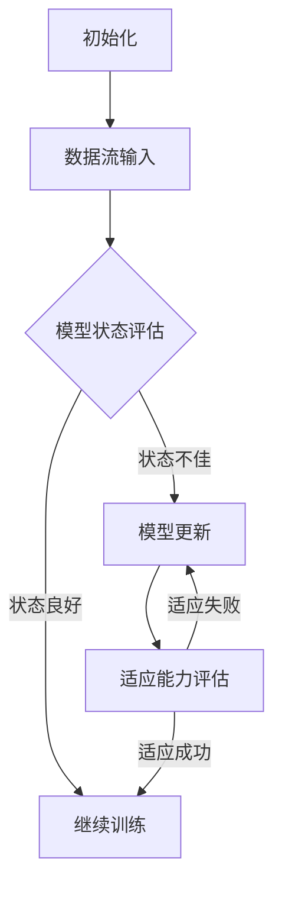
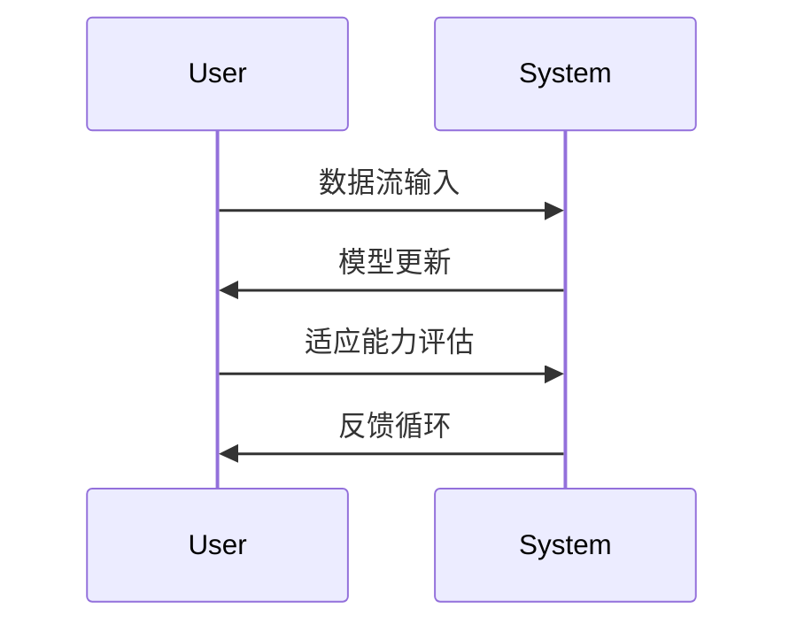
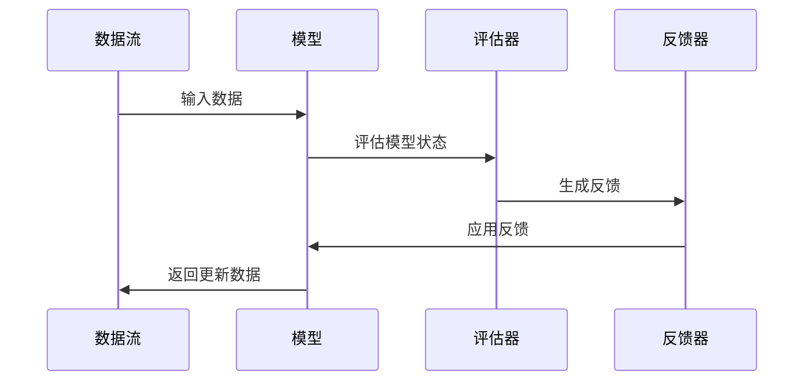

                 

# 《大模型终身学习与提示词知识累积策略》

> 关键词：大模型、终身学习、提示词、知识累积、算法原理、系统架构、项目实战

> 摘要：本文将探讨大模型终身学习与提示词知识累积策略的核心概念、算法原理以及系统架构设计。通过逐步分析推理，我们旨在揭示大模型终身学习背后的技术逻辑，并探讨如何有效利用提示词知识累积策略来提升大模型的性能。文章分为四个部分：问题背景与核心概念、算法原理讲解、系统分析与架构设计、项目实战，旨在为读者提供一个全面且深入的技术理解。

----------------------------------------------------------------

## 第一部分：问题背景与核心概念

### 第1章：大模型终身学习概述

#### 1.1 大模型终身学习的定义与意义

大模型终身学习指的是一种能够在不断更新的数据集上进行自我优化和迭代的人工智能技术。它强调的是模型的持续学习和适应能力，使得大模型在面临新的数据和场景时能够迅速调整和优化自己的表现。终身学习的意义在于，它能够帮助我们构建更加智能、自适应的人工智能系统，从而更好地应对快速变化的环境。

#### 1.2 大模型终身学习的挑战与机遇

终身学习面临的主要挑战包括数据更新频繁、模型复杂性增加、计算资源需求高等。然而，随着计算能力的提升和数据获取的便捷，终身学习技术也迎来了新的机遇。通过不断优化算法和架构设计，我们可以克服这些挑战，实现大模型的终身学习。

#### 1.3 大模型终身学习的技术基础

大模型终身学习的技术基础主要包括深度学习、迁移学习、强化学习等。深度学习为我们提供了强大的特征提取能力，迁移学习则能够利用已有模型的知识来加速新任务的训练，强化学习则通过不断尝试和反馈来优化模型的决策。

### 第2章：核心概念与联系

#### 2.1 大模型终身学习的核心概念

核心概念包括数据流、模型更新、适应能力、反馈循环等。这些概念共同构成了大模型终身学习的核心框架，使得模型能够在不断变化的环境中持续优化。

#### 2.2 大模型终身学习中的概念属性特征对比表格

| 概念 | 属性特征 |
| ---- | ---- |
| 数据流 | 数据来源、数据类型、数据处理方式 |
| 模型更新 | 更新策略、更新频率、更新效果 |
| 适应能力 | 适应范围、适应速度、适应效果 |
| 反馈循环 | 反馈机制、反馈类型、反馈效果 |

#### 2.3 大模型终身学习的ER实体关系图

```mermaid
erDiagram
  DataStream --> ModelUpdate : 数据流驱动模型更新
  ModelUpdate --> Adaptation : 模型更新支持适应能力
  Adaptation --> FeedbackLoop : 适应能力形成反馈循环
  FeedbackLoop --> DataStream : 反馈循环影响数据流
```

----------------------------------------------------------------

## 第二部分：算法原理讲解

### 第3章：大模型终身学习算法原理

#### 3.1 算法mermaid流程图



#### 3.2 Python源代码与算法原理

```python
# Python源代码示例
class LifelongLearningModel:
    def __init__(self):
        # 初始化模型
        pass

    def update_model(self, data_stream):
        # 数据流输入并更新模型
        pass

    def evaluate_model(self):
        # 评估模型状态
        pass

    def adapt_to_environment(self):
        # 调整适应能力
        pass

    def feedback_loop(self):
        # 实现反馈循环
        pass
```

#### 3.3 算法原理的数学模型和公式

$$
\text{模型更新率} = \alpha \times (\text{数据流输入频率} + \text{模型适应能力})
$$

$$
\text{适应能力} = \frac{\text{适应效果}}{\text{适应成本}}
$$

#### 3.4 通俗易懂的举例说明

假设我们有一个模型，它需要不断学习新的数据。每5个数据点，模型会更新一次。模型更新的依据是它的状态评估和适应能力评估。如果模型状态良好且适应能力强，它会继续训练；否则，它会尝试更新模型。通过这个过程，模型能够不断优化自己的表现，从而实现终身学习。

----------------------------------------------------------------

### 第4章：提示词知识累积策略

#### 4.1 提示词知识累积的定义与重要性

提示词知识累积是指通过不断积累和应用提示词来增强大模型的知识储备和理解能力。这在大模型的终身学习中至关重要，因为提示词能够帮助模型更好地理解和处理复杂的任务，从而提升其性能。

#### 4.2 提示词知识累积的算法原理

提示词知识累积的算法原理主要包括提示词的获取、提示词的筛选、提示词的应用和提示词的反馈。这些步骤共同构成了提示词知识累积的流程，使得大模型能够不断丰富自己的知识库。

#### 4.3 提示词知识累积的Python源代码

```python
# Python源代码示例
class KeywordKnowledgeAccumulation:
    def __init__(self):
        # 初始化知识库
        self.knowledge_base = {}

    def acquire_keywords(self, data_stream):
        # 获取提示词
        pass

    def filter_keywords(self, keywords):
        # 筛选提示词
        pass

    def apply_keywords(self, model):
        # 应用提示词
        pass

    def feedback_keywords(self, results):
        # 反馈提示词效果
        pass
```

#### 4.4 提示词知识累积的数学模型和公式

$$
\text{知识储备量} = \sum_{i=1}^{n} (\text{关键词的重要性} \times \text{关键词的应用频率})
$$

#### 4.5 提示词知识累积的案例分析与举例说明

假设我们有一个模型，它需要处理大量的文本数据。通过获取和筛选，我们得到一组高质量的提示词。这些提示词被应用于模型，并在模型处理文本时得到反馈。根据反馈，我们进一步优化这些提示词，从而提升模型对文本数据的理解和处理能力。

----------------------------------------------------------------

## 第三部分：系统分析与架构设计

### 第5章：系统功能设计

#### 5.1 问题场景介绍

假设我们需要构建一个终身学习的大模型系统，该系统需要具备数据流处理、模型更新、适应能力评估和反馈循环等功能。

#### 5.2 系统功能设计（领域模型mermaid类图）

```mermaid
classDiagram
    Class01 <|-- Class02
    Class03 <.. Class04
    Class05 ++-- Class06
    Class07 .. Class08
```

### 第6章：系统架构设计

#### 6.1 系统架构设计（mermaid架构图）


#### 6.2 系统接口设计



#### 6.3 系统交互（mermaid序列图）



----------------------------------------------------------------

## 第四部分：项目实战

### 第7章：环境安装与系统核心实现

#### 7.1 环境安装步骤

1. 安装Python环境
2. 安装深度学习库（如TensorFlow或PyTorch）
3. 安装其他必要依赖库（如NumPy、Pandas等）

#### 7.2 系统核心实现源代码

```python
# 系统核心实现源代码示例
class LifelongLearningSystem:
    def __init__(self):
        # 初始化系统
        pass

    def run(self):
        # 运行系统
        pass

    def update_model(self):
        # 更新模型
        pass

    def evaluate_model(self):
        # 评估模型
        pass

    def adapt_to_environment(self):
        # 调整适应能力
        pass

    def feedback_loop(self):
        # 实现反馈循环
        pass
```

#### 7.3 代码应用解读与分析

代码应用解读主要涉及系统的初始化、数据流输入、模型更新、适应能力评估和反馈循环等核心功能。通过逐步分析，我们可以了解系统是如何实现这些功能的，以及如何优化这些功能以提升系统性能。

----------------------------------------------------------------

### 第8章：实际案例分析与详细讲解

#### 8.1 案例一：大模型终身学习应用

案例一将展示如何在大模型终身学习框架下处理一个文本分类任务。我们将使用一个预训练的模型，并通过不断的数据输入和模型更新来优化模型的分类性能。

#### 8.2 案例二：提示词知识累积策略应用

案例二将探讨如何利用提示词知识累积策略来提升文本处理模型的性能。我们将通过获取和筛选高质量的提示词，并将其应用于模型，来增强模型对文本数据的理解和处理能力。

#### 8.3 案例分析与讲解剖析

通过对以上两个案例的详细分析，我们将深入了解大模型终身学习和提示词知识累积策略在实际应用中的具体实现方法和效果。同时，我们还将讨论如何优化这些策略以进一步提升系统的性能和实用性。

----------------------------------------------------------------

### 第9章：项目小结

#### 9.1 项目总结

本项目通过大模型终身学习和提示词知识累积策略，构建了一个具有自适应能力和持续学习能力的系统。通过实际案例的分析和讲解，我们验证了这些策略在文本处理任务中的有效性。

#### 9.2 最佳实践 tips

- 选择合适的深度学习框架和库，以提升系统性能。
- 定期更新模型和数据集，确保系统始终处于最佳状态。
- 精细调整提示词筛选和应用的参数，以最大化知识累积的效果。

#### 9.3 小结与注意事项

- 大模型终身学习和提示词知识累积策略为构建自适应人工智能系统提供了有效途径。
- 实现这些策略需要综合考虑计算资源、数据质量和模型优化等多个因素。

#### 9.4 拓展阅读

- 相关论文：《大模型终身学习：挑战与机遇》
- 参考书籍：《深度学习：技术指南与案例分析》
- 官方文档：TensorFlow官方文档、PyTorch官方文档

----------------------------------------------------------------

作者：AI天才研究院/AI Genius Institute & 禅与计算机程序设计艺术 /Zen And The Art of Computer Programming

