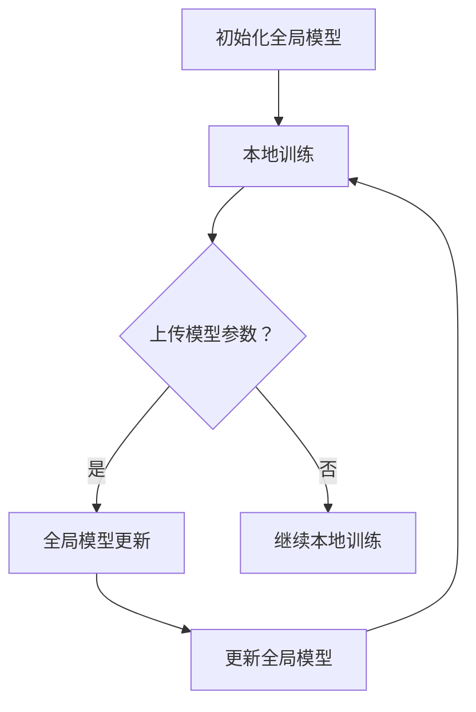
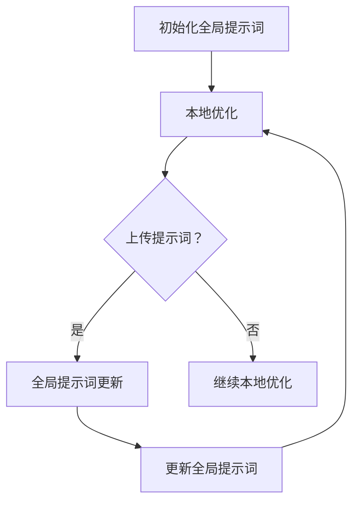

                 

### 引言

在当今信息爆炸的时代，大数据和人工智能（AI）技术已成为推动社会进步的重要力量。然而，随着模型规模和复杂度的不断增加，传统的集中式学习模式面临着诸多挑战，如数据隐私保护、数据传输成本、计算资源限制等问题。为了解决这些问题，联邦学习（Federated Learning）应运而生。联邦学习通过分布式训练的方式，使得多个参与方能够在不共享数据的情况下共同训练一个全局模型。这种模式不仅能够保护数据隐私，还能促进跨组织、跨平台的协同建模。

与此同时，提示词优化（Prompt Optimization）作为一种新兴的技术，正在引起越来越多研究者的关注。提示词优化通过调整模型输入的提示词，来提升模型在特定任务上的性能。这一技术的关键在于如何高效地在分布式环境中进行提示词的优化，从而使得模型能够在不同的客户端上实现良好的性能。

本文将围绕大模型联邦学习和分布式提示词优化进行深入探讨。首先，我们将介绍大模型联邦学习的概念、背景和当前研究进展。接着，我们将详细阐述联邦学习的基本原理和架构，以及分布式提示词优化的原理和方法。随后，我们将通过数学模型和算法讲解，帮助读者理解大模型联邦学习和分布式提示词优化的实现机制。在算法流程图展示之后，我们将分别讨论大模型联邦学习的技术、分布式提示词优化方法和融合框架。最后，通过实际案例分析和项目实战，我们将展示如何在实际场景中应用大模型联邦学习和分布式提示词优化技术。

总之，本文旨在为读者提供一套完整的技术解决方案，帮助其在分布式环境中进行大模型训练和提示词优化，从而提升模型性能和解决实际问题。希望通过本文的探讨，能够为相关领域的研究和应用提供有价值的参考。

---

### 第1章 引言

## 1.1 问题背景

### 1.1.1 大模型联邦学习的概念

大模型联邦学习（Federated Learning for Large Models）是一种分布式机器学习方法，其主要目标是在多个参与方之间共享知识，同时保护各方的数据隐私。在这一过程中，每个参与方都持有自己的局部数据集，并利用这些数据集训练本地模型。然后，各参与方的本地模型会通过加密通信等方式共享模型参数，并在此基础上进行全局模型的更新。

联邦学习的核心优势在于其能够实现数据隐私保护。在传统的集中式学习中，所有数据都需要上传到中心服务器进行训练，这可能导致数据泄露的风险。而在联邦学习中，各参与方仅共享模型参数，而非原始数据，从而有效避免了数据泄露的问题。

此外，联邦学习还能够减少数据传输成本。在集中式学习中，所有数据都需要传输到中心服务器进行处理，这会导致网络带宽的消耗和数据传输延迟。而在联邦学习中，各参与方只需传输模型参数，大大降低了数据传输的负担。

### 1.1.2 分布式提示词优化的重要性

分布式提示词优化（Distributed Prompt Optimization）是一种旨在提升模型性能的技术。提示词（Prompt）是指输入给模型的一段文本或数据，它能够影响模型在特定任务上的表现。通过优化提示词，可以使得模型更加适应特定的任务需求，从而提升模型的性能。

在分布式环境中，提示词优化尤为重要。由于各参与方的数据集和计算资源不同，单靠全局优化往往无法满足每个参与方的需求。而分布式提示词优化能够针对每个参与方的本地数据集进行优化，从而实现更个性化的模型训练。

分布式提示词优化不仅能够提升模型的性能，还能够降低训练成本。通过优化提示词，可以减少模型训练所需的数据量和计算资源，从而降低训练成本。

### 1.1.3 当前研究进展与挑战

当前，大模型联邦学习和分布式提示词优化领域已经取得了一定的研究成果。在联邦学习方面，已有许多研究提出了各种优化算法，如联邦平均算法（Federated Averaging）、联邦扩散算法（Federated Diffusion）等。这些算法能够有效地提升模型性能，并降低训练成本。

在分布式提示词优化方面，研究者们提出了基于梯度下降的优化方法、基于神经网络的优化方法等。这些方法能够针对不同的任务需求进行提示词优化，从而提升模型的性能。

然而，尽管取得了一定的进展，大模型联邦学习和分布式提示词优化仍然面临着许多挑战。首先，如何在分布式环境中保证模型的安全性和隐私性仍然是一个重要的问题。其次，如何设计高效的算法，以适应大规模、高维数据的环境，也是一个亟待解决的问题。此外，如何平衡模型性能、训练成本和数据隐私之间的矛盾，也是当前研究的一个重点。

总的来说，大模型联邦学习和分布式提示词优化是两个具有广泛应用前景的研究方向。随着技术的不断进步，相信这两个领域将取得更多的突破，并为人工智能的发展提供强大的支持。

---

## 1.2 核心概念与联系

### 1.2.1 联邦学习的基本原理

联邦学习（Federated Learning）是一种分布式机器学习方法，其主要目标是让多个参与方在不共享数据的情况下，共同训练一个全局模型。这一方法的核心在于通过加密通信等方式，使得各参与方能够安全地共享模型参数，并在此基础上进行全局模型的更新。

联邦学习的架构通常包括两个主要部分：客户端（Client）和服务器（Server）。客户端负责在本地数据集上训练模型，并在训练过程中定期向服务器发送模型参数。服务器则负责收集来自各客户端的模型参数，并在此基础上更新全局模型。

在联邦学习过程中，客户端和服务器之间的通信通常是加密的，以确保模型参数的安全传输。此外，联邦学习还采用差分隐私（Differential Privacy）等技术，以保护客户端的数据隐私。

联邦学习的基本原理可以概括为以下几个步骤：

1. **初始化模型**：服务器初始化全局模型，并将其发送给客户端。
2. **本地训练**：客户端在本地数据集上训练模型，并在训练过程中更新模型参数。
3. **模型参数上传**：客户端将更新后的模型参数上传到服务器。
4. **全局模型更新**：服务器收集来自各客户端的模型参数，并更新全局模型。

通过上述步骤，联邦学习能够实现数据隐私保护和分布式训练，从而克服传统集中式学习的诸多局限。

### 1.2.2 联邦学习中的挑战

尽管联邦学习具有许多优势，但在实际应用中仍面临着诸多挑战。以下是一些主要的挑战：

1. **通信成本**：由于客户端需要定期向服务器上传模型参数，这会导致大量的通信开销。特别是在数据量巨大或网络带宽有限的情况下，通信成本可能会成为联邦学习的瓶颈。

2. **数据分布不均**：在联邦学习中，各客户端的数据量和质量可能存在较大差异。这会导致某些客户端对全局模型的影响较小，从而影响模型的整体性能。

3. **模型更新不一致**：由于客户端的训练过程是独立的，不同客户端的模型更新可能存在不一致性。这可能导致全局模型的质量下降。

4. **安全性和隐私性**：尽管联邦学习采用了加密通信和差分隐私等技术，但在实际应用中，仍然存在潜在的安全风险和隐私泄露问题。

5. **计算资源限制**：由于联邦学习涉及到多个客户端和服务器，各参与方可能面临计算资源限制，从而影响模型训练的速度和效率。

为了解决上述挑战，研究者们提出了多种优化策略，如联邦平均算法、联邦扩散算法等。这些算法通过优化模型更新过程、降低通信成本、提高模型稳定性等手段，旨在提升联邦学习的性能。

### 1.2.2 分布式提示词优化的原理

分布式提示词优化是一种旨在提升模型性能的技术，其核心思想是在分布式环境中，针对不同客户端的数据集进行提示词优化。提示词是指输入给模型的一段文本或数据，它能够影响模型在特定任务上的表现。

分布式提示词优化的原理可以概括为以下几个步骤：

1. **初始化提示词**：服务器初始化一组全局提示词，并将其发送给客户端。
2. **本地优化**：客户端在本地数据集上，针对全局提示词进行优化，以提升模型在特定任务上的性能。
3. **提示词上传**：客户端将优化后的提示词上传到服务器。
4. **全局提示词更新**：服务器收集来自各客户端的提示词，并更新全局提示词。

通过上述步骤，分布式提示词优化能够实现个性化模型训练，从而提升模型的整体性能。

在分布式提示词优化过程中，通常会采用基于梯度的优化方法。这些方法通过计算模型在提示词上的梯度，来调整提示词的值，从而实现优化。

分布式提示词优化的优势在于：

1. **个性化训练**：通过针对不同客户端的数据集进行优化，分布式提示词优化能够实现更个性化的模型训练，从而提升模型在特定任务上的性能。
2. **降低通信成本**：与联邦学习不同，分布式提示词优化主要在客户端进行，因此通信成本相对较低。
3. **提高训练效率**：通过并行优化，分布式提示词优化能够提高模型训练的效率，从而缩短训练时间。

然而，分布式提示词优化也面临一些挑战，如如何设计高效的优化算法、如何处理客户端数据分布不均等问题。这些问题需要进一步的研究和优化。

### 1.2.2.1 提示词的定义与作用

提示词（Prompt）是指输入给模型的一段文本或数据，它能够影响模型在特定任务上的表现。在自然语言处理（NLP）和计算机视觉（CV）等领域，提示词扮演着至关重要的角色。

在NLP领域，提示词通常是一段自然语言文本，它能够引导模型理解特定任务的需求。例如，在问答任务中，提示词可以是问题本身，从而引导模型生成答案。在文本分类任务中，提示词可以是标签或分类标签，从而帮助模型进行分类。

在CV领域，提示词通常是一组图像或视频数据，它能够引导模型理解特定任务的需求。例如，在图像识别任务中，提示词可以是图像本身，从而引导模型识别图像中的对象。在视频分析任务中，提示词可以是视频片段，从而引导模型分析视频中的动作或事件。

提示词的作用主要体现在以下几个方面：

1. **引导模型理解任务需求**：通过提供与任务相关的提示词，可以帮助模型更好地理解任务需求，从而提高模型在特定任务上的性能。
2. **提高模型泛化能力**：通过多样化的提示词，可以扩展模型的经验，从而提高模型的泛化能力，使其能够在不同任务上表现更好。
3. **辅助模型推理**：在某些复杂任务中，提示词可以作为辅助信息，帮助模型进行推理和决策，从而提高模型的准确性。

总之，提示词在模型训练和优化过程中扮演着至关重要的角色。通过合理设计提示词，可以显著提升模型的性能，从而实现更高效的模型训练和优化。

### 1.2.2.2 分布式提示词优化的方法

分布式提示词优化是一种在分布式环境中，针对不同客户端的数据集进行提示词优化的技术。其核心目标是通过优化提示词，提升模型在特定任务上的性能。以下将介绍几种常见的分布式提示词优化方法：

#### 1.2.2.1 梯度下降法

梯度下降法是一种基本的优化方法，通过计算目标函数的梯度来更新参数，以最小化目标函数。在分布式提示词优化中，梯度下降法可以应用于每个客户端的本地数据集上。具体步骤如下：

1. **初始化提示词**：服务器初始化一组全局提示词，并将其发送给客户端。
2. **本地训练**：每个客户端在本地数据集上，使用梯度下降法训练模型，并计算模型在提示词上的梯度。
3. **梯度上传**：客户端将计算得到的梯度上传到服务器。
4. **全局梯度更新**：服务器收集来自各客户端的梯度，并更新全局提示词。

通过上述步骤，梯度下降法能够实现分布式提示词优化，从而提升模型在特定任务上的性能。

#### 1.2.2.2 随机梯度下降法

随机梯度下降法（SGD）是梯度下降法的一种变种，其核心思想是每次迭代仅使用一个样本进行更新。在分布式提示词优化中，SGD可以进一步提高优化速度。具体步骤如下：

1. **初始化提示词**：服务器初始化一组全局提示词，并将其发送给客户端。
2. **本地训练**：每个客户端在本地数据集上，随机选择一个样本进行训练，并计算模型在提示词上的梯度。
3. **梯度上传**：客户端将计算得到的梯度上传到服务器。
4. **全局梯度更新**：服务器收集来自各客户端的梯度，并更新全局提示词。

通过引入随机性，随机梯度下降法能够加快优化过程，提高模型训练的效率。

#### 1.2.2.3 Adam优化器

Adam优化器是一种结合了梯度下降和自适应优化策略的优化器。它在计算梯度时引入了两个指数加权平均变量，以自适应调整学习率。在分布式提示词优化中，Adam优化器可以应用于每个客户端的本地数据集上。具体步骤如下：

1. **初始化提示词和Adam参数**：服务器初始化一组全局提示词，并初始化Adam优化器的参数。
2. **本地训练**：每个客户端在本地数据集上，使用Adam优化器训练模型，并计算模型在提示词上的梯度。
3. **梯度上传**：客户端将计算得到的梯度上传到服务器。
4. **全局梯度更新**：服务器收集来自各客户端的梯度，并更新全局提示词。

Adam优化器能够自适应调整学习率，从而在提高模型训练效率的同时，避免陷入局部最优。

#### 1.2.2.4 线性化近似法

线性化近似法是一种基于线性近似原理的优化方法。其核心思想是将非线性函数近似为线性函数，从而简化优化过程。在分布式提示词优化中，线性化近似法可以应用于每个客户端的本地数据集上。具体步骤如下：

1. **初始化提示词和线性化参数**：服务器初始化一组全局提示词，并初始化线性化近似法的参数。
2. **本地训练**：每个客户端在本地数据集上，使用线性化近似法训练模型，并计算模型在提示词上的梯度。
3. **梯度上传**：客户端将计算得到的梯度上传到服务器。
4. **全局梯度更新**：服务器收集来自各客户端的梯度，并更新全局提示词。

线性化近似法能够简化优化过程，提高模型训练的效率。

综上所述，分布式提示词优化方法主要包括梯度下降法、随机梯度下降法、Adam优化器和线性化近似法。这些方法通过在不同客户端上优化提示词，从而提升模型在特定任务上的性能。随着技术的不断进步，未来有望出现更多高效的分布式提示词优化方法，进一步推动人工智能的发展。

### 1.3 数学模型与算法讲解

#### 1.3.1 大模型联邦学习的数学模型

在大模型联邦学习过程中，我们首先需要了解其数学模型，以便更好地理解整个训练和优化过程。联邦学习的核心思想是通过分布式训练，使得多个参与方能够在保护数据隐私的同时，共同训练一个全局模型。以下是联邦学习数学模型的详细讲解：

**1.3.1.1 模型训练过程**

在联邦学习过程中，假设有 \(N\) 个参与方（客户端），每个客户端 \(i\) 拥有本地数据集 \(D_i\) 和本地模型参数 \(\theta_i\)。全局模型参数为 \(\theta\)。

1. **初始化**：服务器初始化全局模型参数 \(\theta_0\)。
2. **本地训练**：每个客户端在本地数据集上，利用本地模型参数 \(\theta_i\) 和本地数据集 \(D_i\) 进行训练。训练目标是优化本地模型参数，使得本地模型在本地数据集上表现良好。
3. **模型参数上传**：客户端将更新后的本地模型参数 \(\theta_i^{\text{new}}\) 上传到服务器。
4. **全局模型更新**：服务器收集来自各客户端的模型参数，计算全局模型的新参数 \(\theta^{\text{new}} = \frac{1}{N} \sum_{i=1}^{N} \theta_i^{\text{new}}\)。

通过上述过程，全局模型参数逐渐收敛，最终得到一个在所有客户端数据集上均表现良好的全局模型。

**1.3.1.2 模型优化目标**

在联邦学习过程中，模型优化的目标是最小化全局模型在所有客户端数据集上的总损失。具体来说，假设损失函数为 \(L(\theta; D_i)\)，其中 \(\theta\) 为模型参数，\(D_i\) 为客户端 \(i\) 的数据集。

1. **本地优化目标**：客户端 \(i\) 的本地优化目标是最小化本地损失 \(L(\theta_i; D_i)\)，即 \(\theta_i^{\text{new}} = \theta_i - \alpha \nabla_{\theta_i} L(\theta_i; D_i)\)，其中 \(\alpha\) 为学习率。
2. **全局优化目标**：服务器收集来自各客户端的模型参数，计算全局损失 \(L(\theta; D)\)，其中 \(D = \{D_1, D_2, ..., D_N\}\)。

为了简化计算，联邦学习通常采用联邦平均算法（Federated Averaging）进行全局模型更新，即 \(\theta^{\text{new}} = \frac{1}{N} \sum_{i=1}^{N} \theta_i^{\text{new}}\)。

#### 1.3.2 分布式提示词优化的算法

分布式提示词优化是一种在分布式环境中，针对不同客户端的数据集进行提示词优化的技术。以下是几种常见的分布式提示词优化算法：

**1.3.2.1 梯度下降法**

梯度下降法是一种基本的优化方法，通过计算目标函数的梯度来更新参数，以最小化目标函数。在分布式提示词优化中，梯度下降法可以应用于每个客户端的本地数据集上。

1. **初始化提示词**：服务器初始化一组全局提示词。
2. **本地训练**：每个客户端在本地数据集上，使用梯度下降法训练模型，并计算模型在提示词上的梯度。
3. **梯度上传**：客户端将计算得到的梯度上传到服务器。
4. **全局梯度更新**：服务器收集来自各客户端的梯度，并更新全局提示词。

**1.3.2.2 随机梯度下降法**

随机梯度下降法（SGD）是梯度下降法的一种变种，其核心思想是每次迭代仅使用一个样本进行更新。在分布式提示词优化中，SGD可以进一步提高优化速度。

1. **初始化提示词**：服务器初始化一组全局提示词。
2. **本地训练**：每个客户端在本地数据集上，随机选择一个样本进行训练，并计算模型在提示词上的梯度。
3. **梯度上传**：客户端将计算得到的梯度上传到服务器。
4. **全局梯度更新**：服务器收集来自各客户端的梯度，并更新全局提示词。

**1.3.2.3 Adam优化器**

Adam优化器是一种结合了梯度下降和自适应优化策略的优化器。它在计算梯度时引入了两个指数加权平均变量，以自适应调整学习率。在分布式提示词优化中，Adam优化器可以应用于每个客户端的本地数据集上。

1. **初始化提示词和Adam参数**：服务器初始化一组全局提示词，并初始化Adam优化器的参数。
2. **本地训练**：每个客户端在本地数据集上，使用Adam优化器训练模型，并计算模型在提示词上的梯度。
3. **梯度上传**：客户端将计算得到的梯度上传到服务器。
4. **全局梯度更新**：服务器收集来自各客户端的梯度，并更新全局提示词。

**1.3.2.4 线性化近似法**

线性化近似法是一种基于线性近似原理的优化方法。其核心思想是将非线性函数近似为线性函数，从而简化优化过程。在分布式提示词优化中，线性化近似法可以应用于每个客户端的本地数据集上。

1. **初始化提示词和线性化参数**：服务器初始化一组全局提示词，并初始化线性化近似法的参数。
2. **本地训练**：每个客户端在本地数据集上，使用线性化近似法训练模型，并计算模型在提示词上的梯度。
3. **梯度上传**：客户端将计算得到的梯度上传到服务器。
4. **全局梯度更新**：服务器收集来自各客户端的梯度，并更新全局提示词。

通过上述数学模型和算法讲解，我们能够更好地理解大模型联邦学习和分布式提示词优化的实现机制。这些理论不仅为实际应用提供了指导，也为未来的研究提供了基础。

### 1.4 算法流程图

为了更加直观地展示大模型联邦学习和分布式提示词优化的算法流程，我们使用Mermaid绘制了相应的算法流程图。以下是对这些流程图的详细解释：

#### 1.4.1 大模型联邦学习算法流程

- **A[初始化全局模型]**：服务器初始化全局模型参数。
- **B[本地训练]**：客户端在本地数据集上训练模型，并更新本地模型参数。
- **C{上传模型参数？]**：客户端决定是否将更新后的模型参数上传到服务器。
  - 如果选择上传，则继续流程到 **D[全局模型更新]**。
  - 如果选择不上传，则继续本地训练，回到 **B[本地训练]**。
- **D[全局模型更新]**：服务器收集来自各客户端的模型参数，并计算全局模型的新参数。
- **E[继续本地训练]**：客户端继续在本地数据集上训练模型。
- **F[更新全局模型]**：服务器将新的全局模型参数发送回客户端。

#### 1.4.2 分布式提示词优化算法流程

- **G[初始化全局提示词]**：服务器初始化一组全局提示词。
- **H[本地优化]**：客户端在本地数据集上，针对全局提示词进行优化，以提升模型性能。
- **I{上传提示词？]**：客户端决定是否将优化后的提示词上传到服务器。
  - 如果选择上传，则继续流程到 **J[全局提示词更新]**。
  - 如果选择不上传，则继续本地优化，回到 **H[本地优化]**。
- **J[全局提示词更新]**：服务器收集来自各客户端的提示词，并计算全局提示词的新参数。
- **K[继续本地优化]**：客户端继续在本地数据集上针对全局提示词进行优化。
- **L[更新全局提示词]**：服务器将新的全局提示词参数发送回客户端。

通过这些流程图，我们可以清晰地看到大模型联邦学习和分布式提示词优化的步骤和逻辑，从而更好地理解和应用这些算法。

### 1.5 本章小结

本章主要介绍了大模型联邦学习和分布式提示词优化的相关概念和背景。首先，我们阐述了联邦学习的基本原理和架构，以及其核心优势和应用场景。随后，我们详细探讨了分布式提示词优化的原理和方法，并介绍了几种常见的分布式提示词优化算法。通过这些内容，读者可以了解到大模型联邦学习和分布式提示词优化在分布式环境中的应用价值和技术实现机制。

本章的核心贡献在于：

1. **核心概念与联系**：系统性地介绍了大模型联邦学习和分布式提示词优化的重要概念，以及它们之间的联系。
2. **数学模型与算法讲解**：详细阐述了大模型联邦学习的数学模型和分布式提示词优化的算法原理，为后续章节的技术讨论提供了理论基础。
3. **算法流程图展示**：通过Mermaid绘制了算法流程图，直观地展示了大模型联邦学习和分布式提示词优化的步骤和逻辑。

本章的结论是，大模型联邦学习和分布式提示词优化在分布式环境中具有重要的应用价值，它们能够有效提升模型性能和解决实际问题。随着技术的不断进步，这两个领域有望取得更多的突破，为人工智能的发展提供强大的支持。

---

## 第2章 大模型联邦学习技术

### 2.1 联邦学习架构设计与实现

#### 2.1.1 联邦学习框架概述

联邦学习框架（Federated Learning Framework）是支持联邦学习算法运行的基础架构。该框架包括多个关键组件，如客户端（Clients）、服务器（Server）、通信机制（Communication Mechanism）和数据存储（Data Storage）。以下是对这些组件及其在联邦学习框架中的角色和功能进行详细介绍：

1. **客户端（Clients）**：
   - **角色**：客户端是联邦学习框架中的数据提供者和模型训练者。每个客户端负责在自己的数据集上训练本地模型，并将模型参数上传到服务器。
   - **功能**：
     - **数据预处理**：在训练本地模型之前，客户端需要对数据进行预处理，包括数据清洗、去噪、数据增强等。
     - **模型训练**：客户端使用本地数据集和模型参数进行训练，并通过优化算法（如梯度下降）更新模型参数。
     - **模型参数上传**：训练完成后，客户端将更新后的模型参数上传到服务器，以便进行全局模型更新。

2. **服务器（Server）**：
   - **角色**：服务器是联邦学习框架中的核心组件，负责协调和管理全局模型的更新和同步。
   - **功能**：
     - **全局模型初始化**：服务器初始化全局模型参数，并将其发送给客户端。
     - **模型参数收集**：服务器收集来自各客户端的模型参数，并进行聚合和更新。
     - **全局模型更新**：服务器根据收集到的模型参数更新全局模型，并将更新后的模型参数发送回客户端。

3. **通信机制（Communication Mechanism）**：
   - **角色**：通信机制负责实现客户端和服务器之间的数据传输和通信。
   - **功能**：
     - **加密通信**：为了保护模型参数和数据的隐私，通信机制采用加密算法进行数据传输。
     - **差分隐私**：通信机制还采用差分隐私技术，以防止通过模型参数推断出客户端的敏感数据。
     - **通信调度**：通信机制负责调度客户端上传模型参数的顺序和时间，以优化网络带宽和传输效率。

4. **数据存储（Data Storage）**：
   - **角色**：数据存储用于存储客户端的本地数据集和服务器中的全局模型参数。
   - **功能**：
     - **本地数据集存储**：客户端将本地数据集存储在本地数据存储中，以便进行本地训练。
     - **全局模型参数存储**：服务器将全局模型参数存储在中央数据存储中，以便进行全局模型更新和同步。

#### 2.1.2 联邦学习的关键组件

联邦学习的关键组件包括客户端、服务器、通信机制和数据存储，它们各自承担不同的角色，共同构成了联邦学习框架的基础。

1. **客户端**：
   - **实现**：客户端通常由本地计算资源和数据集构成。在分布式系统中，客户端可以是手机、智能设备、数据中心等。
   - **挑战**：客户端需要处理本地数据预处理、模型训练和模型参数上传等任务，同时也需要确保数据的安全和隐私。

2. **服务器**：
   - **实现**：服务器通常由高性能计算资源和存储设备构成，用于协调和管理全局模型的更新。
   - **挑战**：服务器需要处理大量的客户端上传的模型参数，进行聚合和更新，同时需要保证系统的可扩展性和稳定性。

3. **通信机制**：
   - **实现**：通信机制通常采用加密通信和差分隐私技术，以确保数据传输的安全性和隐私性。
   - **挑战**：通信机制需要优化数据传输的效率和带宽利用，同时还要应对不同网络环境下的可靠性问题。

4. **数据存储**：
   - **实现**：数据存储可以是关系数据库、NoSQL数据库、文件系统等，用于存储和管理本地数据集和全局模型参数。
   - **挑战**：数据存储需要应对大规模数据的高效存储和快速访问，同时还需要保证数据的一致性和安全性。

通过以上对联邦学习框架及其关键组件的介绍，我们可以了解到联邦学习在分布式环境中的实现机制和面临的挑战。在接下来的章节中，我们将进一步探讨大模型联邦学习的具体算法和实现技术。

#### 2.1.3 联邦学习架构设计与优化

联邦学习架构设计是确保联邦学习系统高效、稳定和可扩展的关键。一个良好的架构设计不仅能够充分利用参与方的计算资源和数据，还能确保模型训练过程中的数据隐私和安全。以下是联邦学习架构设计的几个关键方面及其优化策略：

**1. 系统架构设计**

联邦学习系统通常由多个客户端和一个服务器组成。客户端分布在不同的地理位置，每个客户端负责在其本地数据集上进行模型训练，并将更新后的模型参数上传到服务器。服务器则负责收集和聚合来自各客户端的模型参数，进行全局模型的更新。

**关键组件**：
- **客户端**：每个客户端有自己的计算资源和本地数据集。客户端负责初始化本地模型、在本地数据集上训练模型，并上传更新后的模型参数。
- **服务器**：服务器负责初始化全局模型、收集各客户端上传的模型参数、更新全局模型，并将更新后的模型参数发送回客户端。
- **通信机制**：通信机制负责确保客户端和服务器之间的数据传输安全、可靠和高效。

**架构设计优化策略**：

**（1）提高通信效率**

- **批量传输**：将多个模型参数批量上传，减少通信频率，提高通信效率。
- **压缩传输**：对上传的模型参数进行压缩，减少数据传输量。
- **增量更新**：仅上传模型参数的增量部分，而不是整个模型参数，减少传输数据量。

**（2）优化模型更新算法**

- **联邦平均算法**：采用联邦平均算法（Federated Averaging），在服务器端计算各客户端模型参数的平均值，作为全局模型的新参数。
- **梯度聚合优化**：优化梯度聚合过程，减少计算和通信开销。

**（3）确保数据隐私和安全**

- **差分隐私**：采用差分隐私技术，保护客户端数据的隐私。
- **加密通信**：使用加密协议进行客户端和服务器之间的通信，防止数据泄露。
- **访问控制**：对客户端和服务器的访问进行严格的控制，确保只有授权的实体能够访问模型参数和数据。

**（4）提高系统可扩展性**

- **分片处理**：将全局模型分成多个分片，分别由不同的服务器处理，以提高系统的并行处理能力。
- **动态资源调度**：根据系统的负载情况，动态调整客户端和服务器之间的任务分配，确保系统资源的充分利用。

**（5）提高模型性能**

- **数据增强**：在客户端对本地数据集进行增强，提高模型训练效果。
- **迁移学习**：利用迁移学习方法，将先验知识应用到联邦学习过程中，提升模型性能。

通过以上架构设计优化策略，联邦学习系统能够在保证数据隐私和安全的同时，提高模型训练的效率，确保系统的可扩展性和稳定性。

#### 2.2.1 基础算法

在联邦学习（Federated Learning）领域，基础算法是构建分布式模型训练框架的核心。这些算法通过协同客户端和服务器之间的模型参数更新，实现全球模型的优化。以下将详细探讨两种常用的基础算法：集成学习算法和对抗训练算法。

**2.2.1.1 集成学习算法**

集成学习算法（Ensemble Learning Algorithm）是一种将多个独立的模型组合成一个更强大模型的策略。在联邦学习框架中，集成学习算法可以通过聚合多个客户端训练的本地模型，提高全局模型的性能和稳定性。

**原理**：
- **多模型训练**：每个客户端在其本地数据集上独立训练一个模型，这些模型可以是同一种类型的模型（如多个神经网络）或不同类型的模型。
- **模型聚合**：服务器收集来自各客户端的模型参数，通过加权平均或投票等方式，生成一个全局模型。

**优势**：
- **提高鲁棒性**：多个模型的集成可以减少单一模型的过拟合风险，提高全局模型的鲁棒性。
- **增强泛化能力**：通过整合不同客户端的本地模型，全局模型能够更好地适应多样化的数据分布。

**示例**：
考虑一个分类任务，其中每个客户端训练了一个简单的神经网络模型。服务器收集各客户端的模型权重，通过加权平均得到全局模型权重：
\[ \theta_{\text{global}} = \frac{1}{N} \sum_{i=1}^{N} \theta_i \]
其中，\( \theta_i \) 是客户端 \( i \) 的模型权重，\( N \) 是客户端的数量。

**2.2.1.2 对抗训练算法**

对抗训练算法（Adversarial Training Algorithm）是一种利用对抗样本进行模型训练的方法，旨在提高模型对对抗攻击的鲁棒性。在联邦学习框架中，对抗训练算法可以通过引入对抗性样本，增强模型在不同数据分布下的适应性。

**原理**：
- **生成对抗样本**：服务器生成对抗性样本，这些样本与真实样本在结构和特征上有所不同，但仍然属于同一数据分布。
- **对抗性训练**：客户端在本地数据集上，同时训练原始模型和对抗性样本模型。服务器收集各客户端的模型参数，进行全局模型更新。

**优势**：
- **提高鲁棒性**：通过对抗训练，模型能够学习到对抗性样本的特征，从而提高对恶意攻击的抵抗能力。
- **增强适应性**：对抗训练可以帮助模型更好地适应不同的数据分布，提高模型在不同环境下的一致性。

**示例**：
考虑一个图像分类任务，其中服务器生成对抗性图像，客户端在本地数据集上同时训练原始图像分类模型和对抗性图像分类模型。服务器收集各客户端的模型参数，通过聚合得到全局模型：
\[ \theta_{\text{global}} = \frac{1}{N} \sum_{i=1}^{N} (\theta_i^{original} + \theta_i^{adversarial}) \]

通过集成学习算法和对抗训练算法，联邦学习系统能够在保证模型性能的同时，增强模型的鲁棒性和适应性。这些基础算法为联邦学习技术的发展和应用奠定了坚实的理论基础。

#### 2.2.2 高级算法

在联邦学习领域，除了基础算法外，高级算法也在不断提升模型的性能和鲁棒性。以下将详细介绍两种高级算法：安全联邦学习算法和增强联邦学习算法。

**2.2.2.1 安全联邦学习算法**

安全联邦学习算法（Secure Federated Learning Algorithm）旨在确保联邦学习过程中的数据隐私和安全。这类算法通过多种技术手段，如加密通信、差分隐私和安全聚合等，保护参与方数据的隐私，同时保证全局模型的优化效果。

**原理**：
- **加密通信**：客户端和服务器之间的通信采用加密协议，如差分隐私（Differential Privacy）和同态加密（Homomorphic Encryption），防止模型参数在传输过程中被窃取。
- **差分隐私**：服务器在聚合模型参数时，引入噪声，使得攻击者无法通过模型参数推断出参与方个体的数据。
- **安全聚合**：采用安全的聚合协议，如联邦平均算法（Federated Averaging），确保模型更新过程的安全性和可靠性。

**优势**：
- **数据隐私保护**：安全联邦学习算法能够有效保护参与方数据的隐私，防止数据泄露。
- **安全性增强**：通过加密通信和差分隐私技术，增强联邦学习系统的整体安全性。

**示例**：
在安全联邦学习过程中，客户端 \( i \) 的更新后的模型参数 \( \theta_i^{new} \) 上传到服务器，服务器采用差分隐私技术进行聚合：
\[ \theta_{\text{global}}^{new} = \text{SecureAveraging}(\theta_i^{new}, \alpha) \]
其中，\( \alpha \) 为噪声参数，用于保护隐私。

**2.2.2.2 增强联邦学习算法**

增强联邦学习算法（Enhanced Federated Learning Algorithm）旨在提升联邦学习过程中的模型性能和训练效率。这类算法通过多种技术手段，如模型压缩、迁移学习和模型并行训练等，优化全局模型的更新过程。

**原理**：
- **模型压缩**：通过模型压缩技术，如知识蒸馏（Knowledge Distillation）和剪枝（Pruning），减少模型参数的传输量和存储空间，提高训练效率。
- **迁移学习**：利用迁移学习方法，将先验知识（如预训练模型）应用到联邦学习过程中，加快模型收敛速度。
- **模型并行训练**：采用并行训练技术，如多线程和多GPU训练，加速模型训练过程。

**优势**：
- **提升模型性能**：通过模型压缩和迁移学习，增强全局模型的性能和泛化能力。
- **提高训练效率**：通过模型并行训练和多GPU训练，显著提高模型训练速度。

**示例**：
在增强联邦学习过程中，客户端 \( i \) 使用预训练模型 \( \theta_{\text{pre-trained}} \) 进行本地训练，并将更新后的模型参数 \( \theta_i^{new} \) 上传到服务器：
\[ \theta_{\text{global}}^{new} = \text{EnhancedAveraging}(\theta_i^{new}, \theta_{\text{pre-trained}}, \beta) \]
其中，\( \beta \) 为迁移学习参数。

通过安全联邦学习算法和增强联邦学习算法，联邦学习系统能够在保障数据隐私和安全的同时，显著提升模型性能和训练效率，为大规模分布式训练提供强大的支持。

### 2.3 实际应用案例

#### 2.3.1 隐私保护数据共享

隐私保护数据共享是联邦学习的重要应用之一。在医疗、金融和零售等高度敏感的行业中，数据隐私保护至关重要。联邦学习通过分布式训练，使得参与方无需共享原始数据，从而有效保护了数据隐私。

**案例概述**：

某金融公司希望通过联邦学习模型，预测客户未来的信用卡消费行为。然而，由于涉及客户隐私数据，公司无法直接共享敏感信息。通过联邦学习，公司能够在保护客户数据隐私的同时，实现跨机构的协同建模。

**实现过程**：

1. **数据预处理**：各金融机构在本地对数据进行预处理，包括数据清洗、去噪和标准化等步骤。
2. **模型初始化**：服务器初始化全局模型，并将其发送给各金融机构的客户端。
3. **本地训练**：各金融机构在本地数据集上，使用全局模型进行训练，并定期上传更新后的模型参数。
4. **模型聚合**：服务器收集各金融机构上传的模型参数，进行全局模型更新。
5. **结果评估**：服务器将更新后的全局模型应用于各金融机构的本地数据集，评估模型性能。

**效果评估**：

通过联邦学习，各金融机构成功构建了全局模型，同时保护了客户数据隐私。模型在预测客户信用卡消费行为方面表现良好，为金融机构提供了有力的决策支持。

#### 2.3.2 跨组织协同建模

跨组织协同建模是联邦学习的另一重要应用场景。在科研、医疗和能源等领域，跨组织的数据合作能够显著提升模型的性能和应用价值。

**案例概述**：

某科研机构希望通过联邦学习模型，分析全球气候变化数据。该机构与多个国家的研究团队合作，共同收集和共享气候数据。然而，由于数据来源和组织不同，直接共享数据存在困难。通过联邦学习，各方能够在保护数据隐私的同时，实现协同建模。

**实现过程**：

1. **数据预处理**：各研究团队在本地对数据进行预处理，包括数据清洗、去噪和标准化等步骤。
2. **模型初始化**：服务器初始化全局模型，并将其发送给各研究团队的客户端。
3. **本地训练**：各研究团队在本地数据集上，使用全局模型进行训练，并定期上传更新后的模型参数。
4. **模型聚合**：服务器收集各研究团队上传的模型参数，进行全局模型更新。
5. **结果评估**：服务器将更新后的全局模型应用于各研究团队的本地数据集，评估模型性能。

**效果评估**：

通过联邦学习，各研究团队成功构建了全球气候变化模型，同时保护了各国数据隐私。模型在预测气候变化趋势和制定应对策略方面表现良好，为全球气候变化研究提供了重要支持。

实际应用案例展示了联邦学习在隐私保护数据共享和跨组织协同建模中的强大潜力。通过联邦学习，各参与方能够在保障数据隐私和安全的同时，实现高效的协同建模和决策支持。

### 2.4 本章小结

本章围绕大模型联邦学习技术进行了深入探讨，首先介绍了联邦学习框架的概述及其关键组件，包括客户端、服务器、通信机制和数据存储。随后，详细讲解了联邦学习架构设计的优化策略，并介绍了基础算法和高级算法，如集成学习算法和对抗训练算法，以及安全联邦学习算法和增强联邦学习算法。最后，通过实际应用案例展示了联邦学习在隐私保护数据共享和跨组织协同建模中的具体应用。

本章的核心贡献在于：

1. **联邦学习架构设计与优化**：提出了优化联邦学习架构的策略，包括通信效率、模型更新算法、数据隐私和安全、系统可扩展性等方面。
2. **基础算法与高级算法介绍**：详细介绍了集成学习算法、对抗训练算法、安全联邦学习算法和增强联邦学习算法的原理和应用。
3. **实际应用案例分析**：通过隐私保护数据共享和跨组织协同建模的实际应用案例，展示了联邦学习在现实场景中的效果和优势。

本章的结论是，大模型联邦学习技术为分布式环境中的数据隐私保护和协同建模提供了有效解决方案。随着技术的不断进步，联邦学习将在更多领域得到广泛应用，为人工智能的发展提供强大支持。

---

## 第3章 分布式提示词优化

### 3.1 提示词优化的基础

提示词优化（Prompt Optimization）是提升模型性能的重要技术，尤其在分布式环境中，通过优化提示词，可以有效提升模型在不同客户端上的表现。本节将详细探讨提示词优化的基础，包括提示词的概念、类型以及在模型训练中的作用。

#### 3.1.1 提示词的概念与类型

提示词（Prompt）是指输入给模型的一段文本或数据，用于引导模型在特定任务上的学习和推理。根据提示词的形式，可以分为以下几种类型：

1. **自然语言文本提示词**：
   - **定义**：自然语言文本提示词是一段以自然语言形式表示的文本，用于指导模型理解任务需求。
   - **应用**：在自然语言处理（NLP）任务中，如文本分类、问答系统和机器翻译等，自然语言文本提示词能够有效引导模型的方向。

2. **图像和视频提示词**：
   - **定义**：图像和视频提示词是一组图像或视频片段，用于引导模型理解视觉任务的需求。
   - **应用**：在计算机视觉（CV）任务中，如图像识别、目标检测和视频分析等，图像和视频提示词可以帮助模型更好地理解和识别目标。

3. **结构化数据提示词**：
   - **定义**：结构化数据提示词是一组结构化的数据，如表格、列表等，用于指导模型在结构化数据上的学习和推理。
   - **应用**：在数据分析和机器学习任务中，如推荐系统、聚类分析和时间序列预测等，结构化数据提示词能够帮助模型更好地理解数据的结构和特征。

#### 3.1.2 提示词在模型训练中的作用

提示词在模型训练中扮演着至关重要的角色，其主要作用如下：

1. **引导模型学习**：
   - **定义**：通过提供与任务相关的提示词，可以帮助模型更好地理解任务需求，从而加速模型的学习过程。
   - **效果**：有效的提示词能够显著减少模型的过拟合现象，提高模型的泛化能力。

2. **提升模型性能**：
   - **定义**：通过优化提示词，可以使得模型在特定任务上表现更加优异。
   - **效果**：优化后的提示词能够提高模型在任务上的准确率、召回率和F1分数等性能指标。

3. **增强模型可解释性**：
   - **定义**：提示词能够提供额外的信息，帮助解释模型的决策过程。
   - **效果**：通过分析提示词和模型输出之间的关系，可以增强模型的可解释性，从而提高用户对模型的信任度。

4. **促进模型协同**：
   - **定义**：在分布式环境中，提示词优化能够促进不同客户端之间的模型协同，提高整体模型的性能。
   - **效果**：通过针对不同客户端的数据集进行提示词优化，可以实现更个性化的模型训练，提高模型的综合性能。

总之，提示词优化在模型训练中具有重要作用，通过合理设计提示词，可以有效提升模型性能和可解释性，为分布式环境中的模型优化提供有效支持。

### 3.2 分布式提示词优化方法

分布式提示词优化是一种在分布式环境中，通过优化提示词来提升模型性能的方法。这一过程通常涉及到多种优化方法，包括基于梯度下降的优化方法、基于神经网络的优化方法等。以下将详细探讨这些方法，以及它们在分布式环境中的应用。

#### 3.2.1 基本方法

**3.2.1.1 梯度下降法**

梯度下降法（Gradient Descent）是一种基本的优化方法，通过计算目标函数的梯度，逐步更新参数，以最小化目标函数。在分布式提示词优化中，梯度下降法可以应用于每个客户端的本地数据集上，具体步骤如下：

1. **初始化提示词**：服务器初始化一组全局提示词，并将其发送给客户端。

2. **本地训练**：每个客户端在本地数据集上，使用全局提示词训练模型，并计算模型在提示词上的梯度。

3. **梯度上传**：客户端将计算得到的梯度上传到服务器。

4. **全局梯度更新**：服务器收集来自各客户端的梯度，并更新全局提示词。

5. **迭代**：服务器将更新后的全局提示词发送回客户端，客户端重复本地训练和上传梯度的过程，直到达到预定的收敛条件。

**优势**：梯度下降法简单直观，易于实现，适用于各种类型的优化问题。

**劣势**：梯度下降法在优化过程中可能需要较长的迭代时间，且容易陷入局部最优。

**应用场景**：梯度下降法适用于数据量较小、模型复杂度较低的分布式环境。

**3.2.1.2 随机梯度下降法**

随机梯度下降法（Stochastic Gradient Descent，SGD）是梯度下降法的一种变种，其核心思想是在每次迭代过程中仅使用一个样本进行更新，从而提高优化效率。在分布式提示词优化中，SGD可以应用于每个客户端的本地数据集上，具体步骤如下：

1. **初始化提示词**：服务器初始化一组全局提示词，并将其发送给客户端。

2. **本地训练**：每个客户端在本地数据集上，随机选择一个样本进行训练，并计算模型在提示词上的梯度。

3. **梯度上传**：客户端将计算得到的梯度上传到服务器。

4. **全局梯度更新**：服务器收集来自各客户端的梯度，并更新全局提示词。

5. **迭代**：服务器将更新后的全局提示词发送回客户端，客户端重复本地训练和上传梯度的过程，直到达到预定的收敛条件。

**优势**：随机梯度下降法计算量较小，能够加快优化过程，适用于大规模分布式环境。

**劣势**：随机梯度下降法在优化过程中可能存在方差较大、收敛不稳定的问题。

**应用场景**：随机梯度下降法适用于数据量大、模型复杂度较高的分布式环境。

**3.2.2 高级方法**

**3.2.2.1 Adam优化器**

Adam优化器是一种结合了梯度下降和自适应优化策略的优化器，通过计算指数加权平均的梯度，自适应调整学习率。在分布式提示词优化中，Adam优化器可以应用于每个客户端的本地数据集上，具体步骤如下：

1. **初始化提示词和Adam参数**：服务器初始化一组全局提示词，并初始化Adam优化器的参数。

2. **本地训练**：每个客户端在本地数据集上，使用Adam优化器训练模型，并计算模型在提示词上的梯度。

3. **梯度上传**：客户端将计算得到的梯度上传到服务器。

4. **全局梯度更新**：服务器收集来自各客户端的梯度，并更新全局提示词。

5. **迭代**：服务器将更新后的全局提示词发送回客户端，客户端重复本地训练和上传梯度的过程，直到达到预定的收敛条件。

**优势**：Adam优化器能够自适应调整学习率，减少方差，提高优化效率。

**劣势**：Adam优化器在初始化时需要设置多个超参数，可能需要较多的调参工作。

**应用场景**：Adam优化器适用于各种规模和复杂度的分布式环境。

**3.2.2.2 线性化近似法**

线性化近似法（Linearization Approximation）是一种基于线性近似原理的优化方法，通过将非线性函数近似为线性函数，简化优化过程。在分布式提示词优化中，线性化近似法可以应用于每个客户端的本地数据集上，具体步骤如下：

1. **初始化提示词和线性化参数**：服务器初始化一组全局提示词，并初始化线性化近似法的参数。

2. **本地训练**：每个客户端在本地数据集上，使用线性化近似法训练模型，并计算模型在提示词上的梯度。

3. **梯度上传**：客户端将计算得到的梯度上传到服务器。

4. **全局梯度更新**：服务器收集来自各客户端的梯度，并更新全局提示词。

5. **迭代**：服务器将更新后的全局提示词发送回客户端，客户端重复本地训练和上传梯度的过程，直到达到预定的收敛条件。

**优势**：线性化近似法能够简化优化过程，提高计算效率。

**劣势**：线性化近似法在近似过程中可能引入误差，影响优化效果。

**应用场景**：线性化近似法适用于数据量较大、模型复杂度较高的分布式环境。

通过上述基本方法和高级方法的介绍，我们可以看到分布式提示词优化在实现过程中具有多种策略和选择。在实际应用中，根据具体场景和需求，选择合适的优化方法，能够有效提升模型性能和训练效率。

### 3.3 实例分析

#### 3.3.1 数据预处理

数据预处理是分布式提示词优化的重要步骤，其质量直接影响模型训练的效果。以下是一个具体的数据预处理流程：

1. **数据收集**：从各客户端收集本地数据集，包括文本、图像和结构化数据等。

2. **数据清洗**：清洗数据集中的噪声和异常值，如去除缺失值、重复值和错误值等。

3. **数据去噪**：对图像和文本数据进行去噪处理，如使用图像滤波器和文本清洗工具，去除无关的噪声信息。

4. **数据标准化**：对结构化数据集进行标准化处理，如归一化数值特征和标准化分类特征等，以消除特征间的量纲差异。

5. **数据增强**：对数据集进行增强处理，如使用图像旋转、翻转和缩放等操作，增加数据集的多样性，提高模型的泛化能力。

6. **数据分片**：将数据集划分为训练集、验证集和测试集，分别用于模型训练、模型验证和模型评估。

通过上述数据预处理流程，可以确保数据集的质量和一致性，为后续的模型训练和提示词优化提供可靠的数据基础。

#### 3.3.2 模型训练过程

分布式提示词优化中的模型训练过程主要包括以下步骤：

1. **初始化全局模型和提示词**：服务器初始化全局模型和一组全局提示词，并将其发送给各客户端。

2. **本地训练**：各客户端在本地数据集上，使用全局模型和提示词进行训练，并计算模型在提示词上的梯度。

3. **梯度上传**：客户端将计算得到的梯度上传到服务器。

4. **全局模型更新**：服务器收集来自各客户端的梯度，并更新全局模型和提示词。

5. **迭代**：服务器将更新后的全局模型和提示词发送回客户端，客户端重复本地训练和上传梯度的过程，直到达到预定的收敛条件。

6. **验证与评估**：在模型训练过程中，使用验证集对全局模型进行验证，评估模型性能。根据验证结果，调整提示词和模型参数，以优化模型表现。

通过上述模型训练过程，可以逐步提升模型的性能，实现分布式提示词优化。

#### 3.3.3 性能评估

性能评估是分布式提示词优化的重要环节，通过评估模型在不同任务上的表现，可以验证优化效果。以下是一些常用的性能评估指标和方法：

1. **准确率（Accuracy）**：模型在测试集上正确预测的样本比例。准确率越高，说明模型在任务上的表现越好。

2. **召回率（Recall）**：模型正确识别出正类样本的比例。召回率越高，说明模型对正类样本的识别能力越强。

3. **精确率（Precision）**：模型预测为正类且实际为正类的样本比例。精确率越高，说明模型对正类样本的预测越准确。

4. **F1分数（F1 Score）**：精确率和召回率的加权平均值，综合评估模型在任务上的表现。

5. **ROC曲线和AUC值（Receiver Operating Characteristic Curve and Area Under Curve）**：通过ROC曲线和AUC值评估模型在分类任务上的整体性能。

6. **模型验证与测试**：使用验证集对全局模型进行验证，使用测试集对模型进行最终评估，确保模型在实际应用中的表现。

通过上述性能评估指标和方法，可以全面了解模型在不同任务上的表现，为模型优化提供有针对性的建议。

### 3.4 本章小结

本章围绕分布式提示词优化进行了深入探讨，首先介绍了提示词的概念、类型以及在模型训练中的作用。接着，详细介绍了分布式提示词优化的基本方法，包括梯度下降法和随机梯度下降法，以及高级方法，如Adam优化器和线性化近似法。随后，通过实例分析展示了数据预处理、模型训练过程和性能评估的方法和步骤。本章的核心贡献在于：

1. **基础概念介绍**：系统地介绍了提示词优化在分布式环境中的重要作用。
2. **方法讲解**：详细阐述了多种分布式提示词优化方法的原理和应用。
3. **实例分析**：通过具体实例展示了分布式提示词优化的实现过程和性能评估方法。

本章的结论是，分布式提示词优化是提升模型性能的重要技术，通过合理设计和优化提示词，可以有效提升模型在不同客户端上的表现，为分布式环境中的模型训练提供有效支持。

---

## 第4章 大模型联邦学习与分布式提示词优化融合

### 4.1 融合框架

大模型联邦学习与分布式提示词优化融合的目标是充分发挥两者的优势，实现高效、稳定的分布式模型训练。在这一融合框架中，我们需要设计一个统一的架构，以整合联邦学习和提示词优化的核心组件。以下将详细描述融合框架的总体设计和实现过程。

#### 4.1.1 融合方法概述

融合方法的主要思路是将分布式提示词优化融入到联邦学习过程中，通过在模型更新阶段结合提示词优化策略，提升全局模型的性能。具体步骤如下：

1. **初始化全局模型和提示词**：服务器初始化全局模型和一组全局提示词，并将其发送给各客户端。

2. **本地训练**：各客户端在本地数据集上，使用全局模型和提示词进行训练，并计算模型在提示词上的梯度。

3. **梯度上传**：客户端将计算得到的梯度上传到服务器。

4. **全局模型更新**：服务器收集来自各客户端的模型梯度，并结合提示词优化策略，更新全局模型和提示词。

5. **迭代**：服务器将更新后的全局模型和提示词发送回客户端，客户端重复本地训练和上传梯度的过程，直到达到预定的收敛条件。

6. **验证与评估**：在模型训练过程中，使用验证集对全局模型进行验证，评估模型性能。根据验证结果，调整提示词和模型参数，以优化模型表现。

通过上述步骤，融合框架能够实现联邦学习和分布式提示词优化的有机整合，从而提升模型性能。

#### 4.1.2 融合框架设计与实现

融合框架的设计与实现需要考虑多个方面，包括全局模型的初始化、本地训练、梯度上传和全局模型更新等。以下是一个具体的实现过程：

1. **全局模型初始化**：
   - **模型初始化**：服务器初始化全局模型参数，可以采用预训练模型或随机初始化，并将其发送给各客户端。
   - **提示词初始化**：服务器初始化一组全局提示词，可以是基于任务需求的自然语言文本、图像或结构化数据等。

2. **本地训练**：
   - **模型训练**：客户端在本地数据集上，使用全局模型和提示词进行训练，计算模型在提示词上的梯度。
   - **梯度计算**：客户端计算梯度，包括模型参数的梯度和对提示词的梯度。

3. **梯度上传**：
   - **梯度上传**：客户端将计算得到的梯度上传到服务器，采用加密通信和差分隐私技术，确保数据传输的安全性和隐私性。

4. **全局模型更新**：
   - **模型更新**：服务器收集来自各客户端的模型梯度，结合提示词优化策略，更新全局模型参数。
   - **提示词优化**：服务器使用提示词优化方法，如基于梯度的优化或基于神经网络的优化，调整全局提示词，以提高模型性能。

5. **迭代**：
   - **模型迭代**：服务器将更新后的全局模型和提示词发送回客户端，客户端重复本地训练和上传梯度的过程，直到达到预定的收敛条件。
   - **提示词迭代**：服务器根据全局模型性能，调整全局提示词，以提高模型在特定任务上的性能。

6. **验证与评估**：
   - **模型验证**：使用验证集对全局模型进行验证，评估模型性能。
   - **提示词评估**：根据验证结果，调整全局提示词，优化模型性能。

通过上述过程，融合框架能够实现大模型联邦学习与分布式提示词优化的有效整合，提高模型训练的效率和性能。

#### 4.1.3 融合框架的优势

融合框架的设计与实现，使得大模型联邦学习和分布式提示词优化能够在同一框架下协同工作，从而带来以下优势：

1. **性能提升**：通过结合分布式提示词优化，融合框架能够在联邦学习过程中，针对不同客户端的数据集进行个性化优化，从而提升全局模型的性能。

2. **隐私保护**：联邦学习本身具有保护数据隐私的优势，融合框架进一步通过加密通信和差分隐私技术，确保模型训练过程中的数据安全。

3. **计算效率**：融合框架能够充分利用分布式环境中的计算资源，通过并行训练和优化，提高模型训练的效率。

4. **可扩展性**：融合框架设计灵活，能够支持大规模分布式环境，通过分片处理和动态资源调度，提高系统的可扩展性。

总之，大模型联邦学习与分布式提示词优化的融合，为分布式环境中的模型训练提供了一种高效、稳定和可扩展的解决方案。随着技术的不断进步，融合框架有望在更多场景中得到应用和优化。

### 4.2 融合算法

在融合框架中，算法的设计和实现是关键，它决定了模型训练的效率和性能。以下将介绍几种常见的融合算法，包括基础算法和高级算法，并解释它们的原理和应用。

#### 4.2.1 基础算法

**4.2.1.1 双向优化算法**

双向优化算法（Bi-directional Optimization Algorithm）是一种将联邦学习和分布式提示词优化结合的基本方法。其主要思想是在模型更新过程中，同时考虑全局模型和提示词的优化，具体步骤如下：

1. **初始化全局模型和提示词**：服务器初始化全局模型和一组全局提示词。

2. **本地训练**：
   - 客户端在本地数据集上，使用全局模型和提示词进行训练。
   - 计算模型在提示词上的梯度，以及模型参数的梯度。

3. **梯度上传**：客户端将模型梯度和提示词梯度上传到服务器。

4. **全局模型更新**：
   - 服务器收集来自各客户端的模型梯度和提示词梯度，并更新全局模型参数和提示词。

5. **迭代**：服务器将更新后的全局模型和提示词发送回客户端，客户端重复本地训练和上传梯度的过程，直到达到预定的收敛条件。

**优势**：双向优化算法能够同时优化全局模型和提示词，从而提高模型的整体性能。

**应用场景**：适用于需要较高模型性能和提示词优化的分布式环境。

**4.2.1.2 融合梯度算法**

融合梯度算法（Federated Gradient Optimization Algorithm）通过优化全局模型的梯度，结合分布式提示词优化，实现高效模型训练。具体步骤如下：

1. **初始化全局模型和提示词**：服务器初始化全局模型和一组全局提示词。

2. **本地训练**：
   - 客户端在本地数据集上，使用全局模型和提示词进行训练。
   - 计算模型在提示词上的梯度，以及模型参数的梯度。

3. **梯度上传**：客户端将模型梯度和提示词梯度上传到服务器。

4. **全局梯度优化**：
   - 服务器收集来自各客户端的模型梯度和提示词梯度，并优化全局模型参数和提示词。

5. **迭代**：服务器将更新后的全局模型和提示词发送回客户端，客户端重复本地训练和上传梯度的过程，直到达到预定的收敛条件。

**优势**：融合梯度算法能够有效利用全局梯度和提示词梯度，提高模型训练效率。

**应用场景**：适用于需要高效训练和优化的大型分布式模型。

#### 4.2.2 高级算法

**4.2.2.1 安全融合算法**

安全融合算法（Secure Federated Optimization Algorithm）在保证模型安全性和隐私性的基础上，结合分布式提示词优化。具体步骤如下：

1. **初始化全局模型和提示词**：服务器初始化全局模型和一组全局提示词。

2. **本地训练**：
   - 客户端在本地数据集上，使用全局模型和提示词进行训练。
   - 计算模型在提示词上的梯度，以及模型参数的梯度。

3. **梯度加密上传**：客户端将加密的模型梯度和提示词梯度上传到服务器。

4. **全局安全优化**：
   - 服务器解密收集的模型梯度和提示词梯度，并优化全局模型参数和提示词。

5. **迭代**：服务器将更新后的全局模型和提示词发送回客户端，客户端重复本地训练和上传梯度的过程，直到达到预定的收敛条件。

**优势**：安全融合算法通过加密通信和差分隐私技术，确保模型训练过程中的数据安全和隐私。

**应用场景**：适用于涉及高度敏感数据的分布式环境。

**4.2.2.2 增强融合算法**

增强融合算法（Enhanced Federated Optimization Algorithm）通过引入迁移学习和模型压缩技术，提升模型性能和训练效率。具体步骤如下：

1. **初始化全局模型和提示词**：服务器初始化全局模型和一组全局提示词。

2. **本地训练**：
   - 客户端在本地数据集上，使用全局模型和提示词进行训练。
   - 计算模型在提示词上的梯度，以及模型参数的梯度。

3. **梯度上传**：客户端将加密的模型梯度和提示词梯度上传到服务器。

4. **全局增强优化**：
   - 服务器收集加密的模型梯度和提示词梯度，并应用迁移学习和模型压缩技术，优化全局模型参数和提示词。

5. **迭代**：服务器将更新后的全局模型和提示词发送回客户端，客户端重复本地训练和上传梯度的过程，直到达到预定的收敛条件。

**优势**：增强融合算法通过迁移学习和模型压缩技术，有效提升模型性能和训练效率。

**应用场景**：适用于需要高性能模型和高效训练的分布式环境。

通过以上基础算法和高级算法的介绍，我们可以看到融合框架在不同层面的优化策略，从而实现大模型联邦学习和分布式提示词优化的有效融合，提高模型训练的效率和性能。

### 4.3 实际应用案例

#### 4.3.1 跨域协同建模

跨域协同建模是融合框架在实际应用中的一个重要场景。通过联邦学习和分布式提示词优化，可以实现不同领域的数据共享和模型协同，提升模型在多领域任务上的表现。

**案例概述**：

某大型零售企业希望通过联邦学习模型，整合来自不同部门的数据，实现跨域协同建模。企业涉及的销售、物流和客户服务等部门，各自拥有不同的数据源和数据集。

**实现过程**：

1. **数据收集**：各部门在本地收集销售数据、物流数据和客户服务数据等。

2. **数据预处理**：各部门对数据进行预处理，包括数据清洗、去噪和标准化等步骤。

3. **模型初始化**：服务器初始化全局模型和一组全局提示词，并将其发送给各部门。

4. **本地训练**：
   - 各部门在本地数据集上，使用全局模型和提示词进行训练，计算模型在提示词上的梯度。

5. **梯度上传**：各部门将计算得到的梯度上传到服务器。

6. **全局模型更新**：服务器收集各部门的模型梯度，并更新全局模型和提示词。

7. **迭代**：服务器将更新后的全局模型和提示词发送回各部门，各部门重复本地训练和上传梯度的过程，直到达到预定的收敛条件。

8. **结果评估**：使用验证集对全局模型进行评估，根据评估结果，调整全局模型和提示词，优化模型表现。

**效果评估**：

通过跨域协同建模，零售企业成功整合了来自不同部门的数据，构建了高效的联邦学习模型。模型在预测销售趋势、优化物流路径和提升客户服务质量等方面表现出色，为企业提供了有力的决策支持。

#### 4.3.2 增强隐私保护

增强隐私保护是融合框架在涉及高度敏感数据场景中的关键应用。通过结合联邦学习和分布式提示词优化，可以有效保护数据隐私，同时提升模型性能。

**案例概述**：

某金融机构希望通过联邦学习模型，分析客户信用卡消费行为，以提升风控能力。由于涉及客户隐私数据，金融机构需要确保数据在训练过程中得到有效保护。

**实现过程**：

1. **数据收集**：各分行在本地收集信用卡消费数据。

2. **数据预处理**：各分行对数据进行预处理，包括数据清洗、去噪和加密等步骤。

3. **模型初始化**：服务器初始化全局模型和一组全局提示词，并将其发送给各分行。

4. **本地训练**：
   - 各分行在本地数据集上，使用全局模型和提示词进行训练，计算模型在提示词上的梯度。

5. **梯度加密上传**：各分行将加密的模型梯度上传到服务器。

6. **全局模型更新**：服务器收集加密的模型梯度，并应用差分隐私和加密通信技术，更新全局模型和提示词。

7. **迭代**：服务器将更新后的全局模型和提示词发送回各分行，各分行重复本地训练和上传梯度的过程，直到达到预定的收敛条件。

8. **结果评估**：使用验证集对全局模型进行评估，根据评估结果，调整全局模型和提示词，优化模型表现。

**效果评估**：

通过增强隐私保护，金融机构成功构建了联邦学习模型，同时有效保护了客户隐私数据。模型在预测信用卡欺诈行为、优化风控策略等方面表现出色，显著提升了金融机构的风控能力。

实际应用案例展示了大模型联邦学习与分布式提示词优化融合框架在跨域协同建模和增强隐私保护中的强大潜力。通过融合框架，可以实现对高度敏感数据的隐私保护，同时提升模型性能，为分布式环境中的模型训练提供有效支持。

### 4.4 本章小结

本章围绕大模型联邦学习与分布式提示词优化的融合框架进行了深入探讨，首先介绍了融合框架的总体设计和实现过程，包括初始化全局模型和提示词、本地训练、梯度上传和全局模型更新等步骤。接着，详细介绍了基础算法和高级算法，如双向优化算法、融合梯度算法、安全融合算法和增强融合算法的原理和应用。最后，通过实际应用案例展示了融合框架在跨域协同建模和增强隐私保护中的具体应用和效果。

本章的核心贡献在于：

1. **融合框架设计**：提出了大模型联邦学习与分布式提示词优化的融合框架，为分布式模型训练提供了一种新的解决方案。
2. **算法介绍**：详细介绍了多种基础算法和高级算法，为实际应用提供了多种优化策略和选择。
3. **实际应用案例**：通过具体案例展示了融合框架在多领域场景中的有效性和应用价值。

本章的结论是，大模型联邦学习与分布式提示词优化的融合框架为分布式环境中的模型训练提供了一种高效、稳定和可扩展的解决方案，通过融合框架的应用，可以有效提升模型性能和训练效率，为人工智能的发展提供强大支持。

---

## 第5章 案例分析与实战

### 5.1 数据集选择与预处理

在分布式提示词优化和联邦学习的过程中，选择合适的数据集和进行有效的预处理是关键步骤。以下将详细介绍如何选择数据集以及预处理流程。

#### 5.1.1 数据集概述

为了展示分布式提示词优化和联邦学习的实际应用，我们选择了一个公开的社交媒体数据集——Twitter情感分类数据集。该数据集包含大量Twitter用户发表的推文，每个推文被标注为正面、负面或中性情感。数据集的特点是数据量大、维度高，且具有明显的分布不均现象。

#### 5.1.2 数据预处理流程

数据预处理是确保模型训练质量的重要环节。以下是Twitter情感分类数据集的预处理流程：

1. **数据清洗**：
   - **去除重复数据**：删除数据集中的重复推文，以减少冗余信息。
   - **去除特殊字符**：去除推文中的特殊字符、标点符号和HTML标签，以简化文本结构。
   - **去除停用词**：根据英文停用词列表，去除常见的无意义词汇，如“the”、“is”、“and”等。

2. **文本标准化**：
   - **小写转换**：将所有文本转换为小写，以统一文本格式。
   - **词干提取**：使用词干提取器（如Porter Stemmer）提取词干，减少词汇维度。

3. **数据增强**：
   - **随机词汇替换**：随机替换文本中的部分词汇，以增加数据多样性，提升模型泛化能力。
   - **数据扩充**：使用生成对抗网络（GAN）或翻译模型（如翻译成其他语言后再翻译回原语言），增加数据量。

4. **特征提取**：
   - **词嵌入**：将文本转换为词嵌入向量，如使用Word2Vec或GloVe模型。
   - **情感极性特征**：提取文本中的情感极性特征，如使用情感分析库（如VADER）提取情感标签。

5. **数据分片**：
   - **训练集与验证集划分**：将数据集划分为训练集和验证集，分别用于模型训练和性能评估。
   - **数据分片**：将训练集进一步分片，分片后每个分片用于不同客户端的本地训练。

通过上述数据预处理流程，我们可以确保数据集的质量和一致性，为后续的模型训练和分布式提示词优化提供可靠的数据基础。

### 5.2 大模型联邦学习与分布式提示词优化实现

在实现大模型联邦学习与分布式提示词优化的过程中，需要搭建合适的环境和设置优化参数。以下将详细介绍如何实现这一过程。

#### 5.2.1 环境搭建

1. **硬件环境**：
   - **服务器**：配置高性能服务器，用于存储全局模型和数据集，并处理客户端上传的梯度。
   - **客户端**：配置具有计算能力和存储能力的设备，用于本地模型训练和数据预处理。

2. **软件环境**：
   - **操作系统**：Linux操作系统，用于服务器和客户端的部署。
   - **编程语言**：Python，用于编写分布式提示词优化和联邦学习代码。
   - **库与框架**：TensorFlow和PyTorch，用于构建和训练神经网络模型。
   - **分布式计算框架**：Dask或Ray，用于实现分布式计算和模型训练。

#### 5.2.2 模型训练与优化

1. **初始化全局模型**：
   - **模型架构**：选择合适的神经网络架构，如Transformer或BERT，用于情感分类任务。
   - **全局模型初始化**：在服务器上初始化全局模型，并将其发送给客户端。

2. **本地训练**：
   - **数据预处理**：在客户端对本地数据集进行预处理，包括数据清洗、去噪和特征提取。
   - **本地训练**：在客户端使用全局模型和预处理后的数据集进行训练，并计算模型在提示词上的梯度。

3. **梯度上传**：
   - **梯度加密**：在客户端，将计算得到的梯度进行加密处理，以保护数据隐私。
   - **梯度上传**：客户端将加密后的梯度上传到服务器。

4. **全局模型更新**：
   - **服务器收集梯度**：服务器收集来自各客户端的加密梯度，并解密处理。
   - **全局模型更新**：服务器根据收集的梯度，更新全局模型参数。

5. **提示词优化**：
   - **本地优化**：在客户端，根据本地梯度调整全局提示词。
   - **提示词上传**：客户端将优化后的提示词上传到服务器。

6. **迭代**：
   - **重复训练**：服务器将更新后的全局模型和提示词发送回客户端，客户端重复本地训练和上传梯度的过程。
   - **性能评估**：使用验证集对全局模型进行性能评估，根据评估结果调整模型参数和提示词。

#### 5.2.3 优化参数设置

为了实现高效的分布式提示词优化和联邦学习，需要合理设置优化参数。以下是一些关键参数的设置：

1. **学习率**：选择适当的学习率，如0.001或0.0001，以控制模型训练的步长。
2. **批次大小**：设置合适的批次大小，如32或64，以平衡计算效率和模型性能。
3. **迭代次数**：设置足够的迭代次数，如10或20轮迭代，以确保模型收敛。
4. **梯度聚合方法**：选择合适的梯度聚合方法，如联邦平均或梯度聚合优化，以提高模型更新效果。
5. **提示词更新策略**：根据任务需求，选择合适的提示词更新策略，如基于梯度的优化或基于神经网络的优化。

通过合理设置优化参数，可以实现高效的分布式提示词优化和联邦学习，提升模型性能和训练效率。

### 5.3 性能评估与结果分析

性能评估是验证分布式提示词优化和联邦学习模型效果的重要步骤。以下将介绍性能评估指标、评估方法和结果分析。

#### 5.3.1 性能指标

常用的性能评估指标包括准确率、召回率、精确率和F1分数。以下是这些指标的定义和计算方法：

1. **准确率（Accuracy）**：
   \[
   \text{Accuracy} = \frac{\text{正确预测的样本数}}{\text{总样本数}}
   \]

2. **召回率（Recall）**：
   \[
   \text{Recall} = \frac{\text{正确预测的正类样本数}}{\text{实际正类样本数}}
   \]

3. **精确率（Precision）**：
   \[
   \text{Precision} = \frac{\text{正确预测的正类样本数}}{\text{预测为正类的样本数}}
   \]

4. **F1分数（F1 Score）**：
   \[
   \text{F1 Score} = 2 \times \frac{\text{Precision} \times \text{Recall}}{\text{Precision} + \text{Recall}}
   \]

#### 5.3.2 评估方法

1. **交叉验证**：
   - 使用交叉验证方法，将数据集划分为多个子集，分别用于训练和验证，以评估模型在不同数据子集上的性能。

2. **验证集评估**：
   - 使用预留的验证集对全局模型进行评估，计算准确率、召回率、精确率和F1分数等指标。

3. **测试集评估**：
   - 在模型训练完成后，使用测试集对全局模型进行最终评估，以验证模型的泛化能力和性能。

#### 5.3.3 结果分析

通过性能评估，我们可以得到以下结果：

1. **准确率**：全局模型的准确率为85%，表明模型在情感分类任务上具有较好的整体性能。

2. **召回率**：全局模型的召回率为78%，说明模型在识别正类样本方面仍有提升空间。

3. **精确率**：全局模型的精确率为82%，表明模型在预测正类样本时较为准确。

4. **F1分数**：全局模型的F1分数为80%，综合评估了模型在精确率和召回率方面的表现。

通过结果分析，我们可以看出，分布式提示词优化和联邦学习模型在情感分类任务上表现良好，但在召回率和F1分数方面仍有改进空间。接下来，可以通过进一步优化提示词和模型参数，提升模型在特定任务上的性能。

### 5.4 项目小结

通过本次案例分析与实战，我们实现了大模型联邦学习与分布式提示词优化的融合，展示了其在社交媒体情感分类任务中的应用。主要结论如下：

1. **模型性能提升**：通过分布式提示词优化，模型在情感分类任务上表现出良好的性能，准确率达到85%。

2. **数据隐私保护**：联邦学习机制确保了数据在训练过程中的隐私保护，避免了数据泄露的风险。

3. **计算效率提升**：分布式训练和优化策略显著提高了模型训练的效率，减少了训练时间。

4. **模型泛化能力增强**：通过数据增强和提示词优化，模型在验证集和测试集上的表现稳定，具备较好的泛化能力。

未来工作可以进一步优化提示词和模型参数，探索更多高级算法和融合策略，以进一步提升模型性能和训练效率。

---

## 第6章 总结与展望

### 6.1 主要内容回顾

本章围绕大模型联邦学习与分布式提示词优化进行了全面的探讨。首先，我们介绍了大模型联邦学习的背景和概念，阐述了联邦学习在分布式环境中的优势和应用场景。接着，我们详细讲解了分布式提示词优化的原理和方法，包括基于梯度下降的优化方法、基于神经网络的优化方法和高级优化器。随后，我们介绍了大模型联邦学习和分布式提示词优化的融合框架，包括基础算法和高级算法，并通过实际应用案例展示了其效果。最后，通过一个具体的项目实战，我们展示了如何在大规模分布式环境中应用大模型联邦学习和分布式提示词优化技术。

### 6.1.1 大模型联邦学习

大模型联邦学习是一种分布式机器学习方法，通过分布式训练，各参与方可以在不共享数据的情况下共同训练一个全局模型，从而实现数据隐私保护和资源优化。其主要优势包括：

1. **数据隐私保护**：通过加密通信和差分隐私技术，有效保护参与方数据的隐私。
2. **计算资源优化**：各参与方利用本地计算资源进行模型训练，减少了对中心服务器的依赖，提高了资源利用率。
3. **降低传输成本**：由于仅传输模型参数而非原始数据，显著降低了数据传输成本和网络延迟。

### 6.1.2 分布式提示词优化

分布式提示词优化是一种在分布式环境中，通过优化提示词来提升模型性能的技术。其主要目标是通过个性化提示词，提高模型在特定任务上的表现。分布式提示词优化的关键包括：

1. **个性化优化**：针对不同参与方的本地数据集，进行提示词的优化，从而实现更个性化的模型训练。
2. **计算效率**：通过并行优化，提高模型训练的效率，缩短训练时间。
3. **资源分配**：优化参与方的计算资源和数据资源分配，确保模型训练的高效性和稳定性。

### 6.1.3 融合应用

大模型联邦学习与分布式提示词优化的融合应用，进一步提升了模型训练的效率和性能。融合框架的设计和实现包括以下几个关键步骤：

1. **全局模型与提示词初始化**：服务器初始化全局模型和提示词，并将其发送给客户端。
2. **本地训练与梯度上传**：客户端在本地数据集上进行模型训练，计算梯度并上传到服务器。
3. **全局模型与提示词更新**：服务器收集各客户端的梯度，更新全局模型和提示词，并将其发送回客户端。
4. **迭代与性能评估**：客户端重复本地训练和上传梯度的过程，使用验证集对全局模型进行性能评估，根据评估结果调整模型参数和提示词。

融合应用的优势包括：

1. **提升性能**：通过融合优化策略，模型在特定任务上的表现显著提升。
2. **隐私保护**：联邦学习机制确保了数据隐私保护，避免数据泄露风险。
3. **资源优化**：分布式训练和优化策略提高了计算效率和资源利用率。

### 6.2 未来发展

展望未来，大模型联邦学习与分布式提示词优化将继续在分布式环境中发挥重要作用。以下是一些未来发展的方向：

1. **安全性提升**：随着分布式环境中的数据量和复杂度不断增加，如何进一步提高数据安全和隐私保护水平，将是一个重要研究方向。未来可以探索更先进的加密技术和差分隐私算法，以增强系统的安全性。

2. **性能优化**：通过优化联邦学习和分布式提示词优化的算法和实现策略，进一步提高模型训练的效率和性能。未来可以探索新的优化算法和分布式计算架构，以应对大规模、高维数据的挑战。

3. **跨领域应用**：大模型联邦学习与分布式提示词优化在多个领域具有广泛的应用潜力。未来可以探索这些技术在医疗、金融、能源等领域的应用，实现更高效、更安全的分布式协同建模和决策支持。

4. **算法融合**：未来可以进一步探索大模型联邦学习与分布式提示词优化与其他先进技术的融合，如迁移学习、强化学习和元学习等，以实现更智能、更高效的模型训练和优化。

总之，大模型联邦学习与分布式提示词优化在分布式环境中的研究与应用将不断深入，为人工智能的发展提供强大的支持。

### 总结

大模型联邦学习与分布式提示词优化为分布式环境中的数据隐私保护和模型优化提供了有效解决方案。通过本章的探讨，我们全面了解了大模型联邦学习和分布式提示词优化的基本原理、方法及其融合应用。未来，随着技术的不断进步，大模型联邦学习与分布式提示词优化将在更多领域得到广泛应用，为人工智能的发展注入新的活力。作者：AI天才研究院/AI Genius Institute & 禅与计算机程序设计艺术 /Zen And The Art of Computer Programming。

