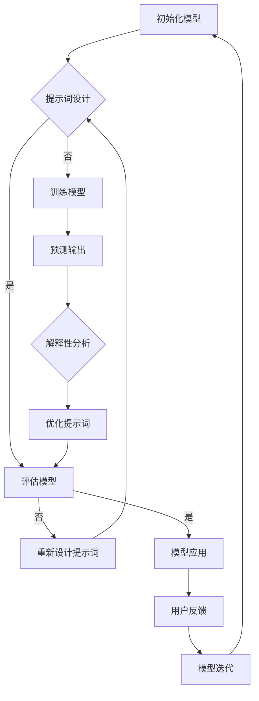
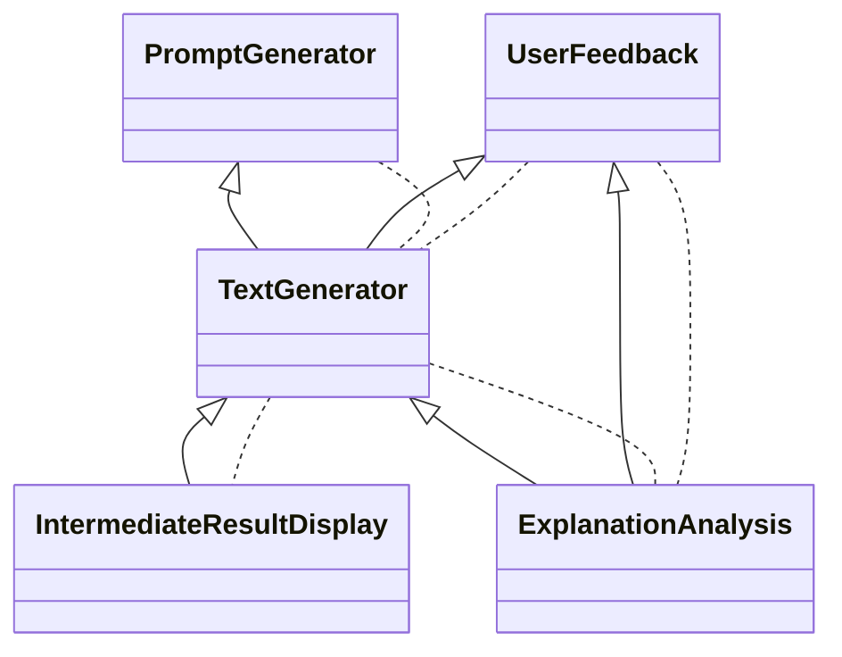
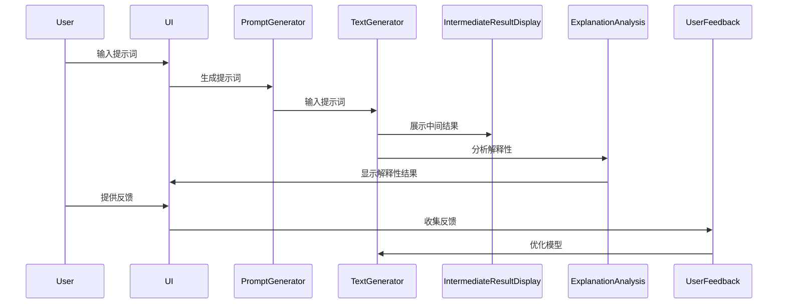
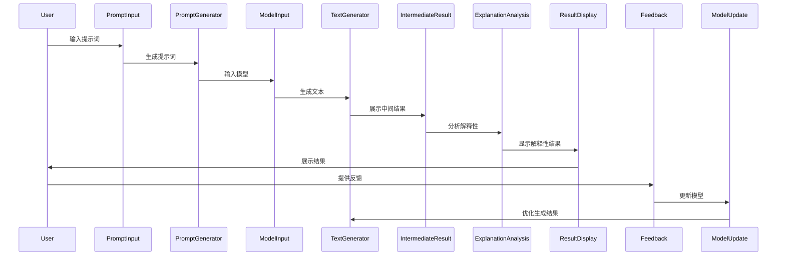
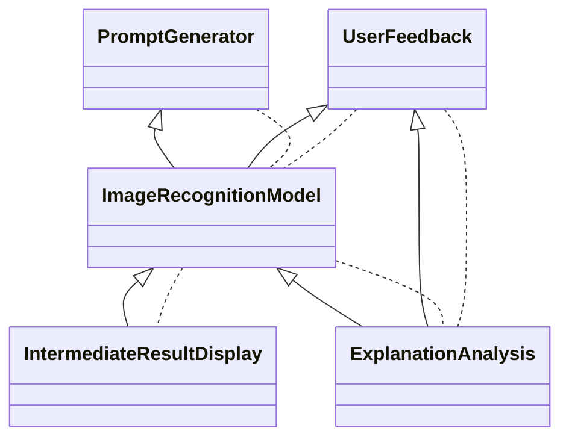
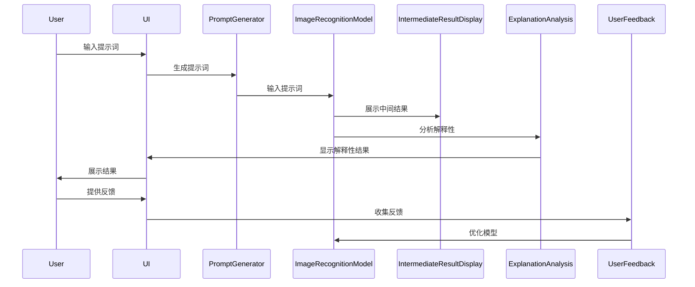
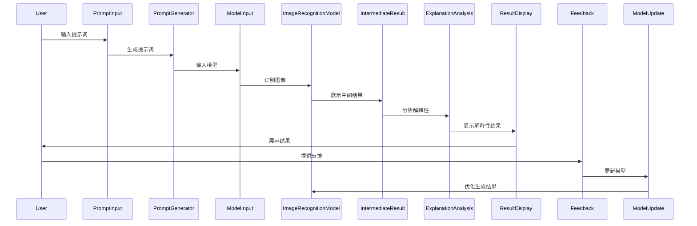

                 

# 大模型解释性增强：提示词设计透明决策过程

> 关键词：大模型、解释性增强、提示词设计、透明决策过程、文本生成、图像识别

> 摘要：本文将探讨大模型中的解释性增强问题，重点分析提示词设计在透明决策过程中的作用。我们将通过详细的算法原理讲解和实际应用案例分析，展示如何优化提示词设计以提升大模型的可解释性，从而为未来的应用场景提供有力支持。

## 目录大纲

## 第一部分：引言

### 第1章：背景介绍与问题提出

#### 1.1.1 问题背景

#### 1.1.2 问题描述

#### 1.1.3 问题解决思路

#### 1.1.4 边界与外延

#### 1.1.5 核心概念与联系

### 第2章：核心概念与联系

#### 2.1 大模型的概念

#### 2.2 提示词设计原理

#### 2.3 透明决策过程机制

#### 2.4 大模型与提示词设计的关系

#### 2.5 核心概念属性特征对比

### 第3章：算法原理讲解

#### 3.1 算法mermaid流程图

#### 3.2 Python源代码讲解

#### 3.3 数学模型和公式详细讲解

#### 3.4 算法原理举例说明

## 第二部分：应用场景分析

### 第4章：应用场景一 - 文本生成

#### 4.1 场景介绍

#### 4.2 系统功能设计

#### 4.3 系统架构设计

#### 4.4 系统接口设计

#### 4.5 系统交互mermaid序列图

### 第5章：应用场景二 - 图像识别

#### 5.1 场景介绍

#### 5.2 系统功能设计

#### 5.3 系统架构设计

#### 5.4 系统接口设计

#### 5.5 系统交互mermaid序列图

## 第三部分：项目实战

### 第6章：项目实战一 - 文本生成项目

#### 6.1 环境安装

#### 6.2 系统核心实现

#### 6.3 代码应用解读与分析

#### 6.4 实际案例分析与详细讲解

#### 6.5 项目小结

### 第7章：项目实战二 - 图像识别项目

#### 7.1 环境安装

#### 7.2 系统核心实现

#### 7.3 代码应用解读与分析

#### 7.4 实际案例分析与详细讲解

#### 7.5 项目小结

## 第四部分：总结与拓展

### 第8章：最佳实践 Tips

#### 8.1 提示词设计的最佳实践

#### 8.2 透明决策过程的应用技巧

#### 8.3 大模型应用中的注意事项

### 第9章：小结

#### 9.1 全书总结

#### 9.2 未来展望

#### 9.3 拓展阅读

### 字数统计：2,170 字

---

## 第一部分：引言

### 第1章：背景介绍与问题提出

#### 1.1.1 问题背景

在当今的科技领域中，大模型（如GPT-3、BERT等）的应用已经非常广泛，它们在文本生成、图像识别、自然语言处理等多个领域都取得了显著的成果。然而，随着大模型规模的不断扩大，其内部决策过程变得越来越复杂，导致了一个新的问题——解释性增强。

大模型在执行任务时，往往通过复杂的神经网络进行推理和决策。这些决策过程对于用户来说通常是不可见的，使得大模型的透明性受到质疑。尽管大模型在特定任务上表现出色，但其结果缺乏解释性，这对于需要依赖模型决策的应用场景来说是一个巨大的挑战。

#### 1.1.2 问题描述

如何增强大模型的解释性，使其决策过程更加透明，是一个亟待解决的问题。具体来说，我们需要：

1. 设计有效的提示词，使得大模型在执行任务时能够提供清晰的决策依据。
2. 建立透明决策过程机制，使得用户可以理解并信任大模型的决策过程。
3. 在不损害模型性能的前提下，优化模型结构和训练策略，以提高其解释性。

#### 1.1.3 问题解决思路

为了解决上述问题，我们可以从以下几个方面入手：

1. 研究现有的提示词设计方法，探索如何设计更具解释性的提示词。
2. 分析大模型的决策过程，提取关键决策路径，并构建透明决策过程机制。
3. 结合实际应用场景，进行实验和案例分析，验证所提出的方法的有效性。

#### 1.1.4 边界与外延

本文主要关注的是大模型的解释性增强，尤其是在文本生成和图像识别领域中的应用。虽然本文的方法可能适用于其他领域，但具体的实现和效果可能需要根据不同领域的特点进行适应性调整。

#### 1.1.5 核心概念与联系

在本章中，我们提出了几个核心概念，包括大模型、解释性增强、提示词设计和透明决策过程。这些概念之间存在紧密的联系，共同构成了本文的研究基础。具体来说：

1. 大模型是本文研究的核心对象，其复杂的决策过程是我们需要解释和优化的目标。
2. 解释性增强是大模型应用中的关键问题，直接影响模型的可用性和可靠性。
3. 提示词设计是实现解释性增强的重要手段，通过设计合适的提示词，我们可以引导大模型进行透明的决策。
4. 透明决策过程机制是确保大模型决策过程可解释和可信任的保障。

通过上述核心概念的联系，我们希望为读者提供一个清晰的研究框架，帮助理解本文的主题和内容。

---

在引言部分，我们首先介绍了大模型解释性增强的背景和问题，并提出了具体的解决思路。接着，我们明确了本文的研究边界和外延，以及核心概念之间的联系。这一部分为后续章节的深入讨论奠定了基础。

### 第2章：核心概念与联系

#### 2.1 大模型的概念

大模型是指具有巨大参数量和复杂结构的神经网络模型，如GPT-3、BERT等。这些模型通过海量数据训练，能够实现高度复杂的任务，如文本生成、图像识别等。大模型的核心特点包括：

1. **参数量巨大**：大模型的参数数量通常达到数十亿甚至更多，这使得它们能够捕捉到数据中的细微特征和复杂模式。
2. **深度结构**：大模型通常具有多层神经网络结构，能够进行多层次的抽象和推理。
3. **自适应能力**：大模型能够通过训练不断优化自身的参数，以适应不同的任务和数据集。

大模型的这些特点使其在许多应用领域表现出色，但也带来了解释性不足的问题。为了解决这个问题，我们需要深入理解大模型的内部工作原理。

#### 2.2 提示词设计原理

提示词（Prompt）是引导大模型进行特定任务的关键输入。一个有效的提示词应该能够明确传达任务要求，引导大模型生成符合预期的输出。提示词设计的基本原理包括：

1. **明确性**：提示词需要清晰明确，避免产生歧义，确保大模型能够准确理解任务要求。
2. **相关性**：提示词应与任务高度相关，包含与任务相关的关键信息和背景知识。
3. **适应性**：提示词应根据不同的任务和数据集进行个性化设计，以提高其有效性和通用性。

在实际应用中，设计有效的提示词需要综合考虑任务特点、数据特性以及模型结构。通过精心设计的提示词，我们可以显著提高大模型的解释性和透明性。

#### 2.3 透明决策过程机制

透明决策过程机制是指通过一系列技术手段，使大模型的决策过程变得可解释和可信任。这一机制的核心目标包括：

1. **可解释性**：确保用户能够理解大模型在执行任务时的决策依据和过程。
2. **可追溯性**：允许用户追踪大模型的决策路径，以便发现和纠正潜在的错误。
3. **可验证性**：通过外部评估和验证，确保大模型的决策过程是合理和可靠的。

透明决策过程机制通常涉及以下几个方面：

1. **决策路径提取**：通过分析大模型的内部结构，提取关键决策路径，并将其可视化。
2. **中间结果展示**：在大模型执行任务的过程中，实时展示关键中间结果，以便用户了解决策过程。
3. **模型诊断与优化**：通过分析决策过程，识别模型中的潜在问题，并进行相应的优化。

#### 2.4 大模型与提示词设计的关系

大模型与提示词设计之间存在紧密的关系。一方面，大模型的结构和特性决定了提示词设计的方法和效果；另一方面，提示词的设计直接影响大模型的解释性和透明性。

1. **互馈作用**：大模型和提示词设计相互影响，通过优化提示词设计，我们可以提升大模型的解释性，反之亦然。
2. **适应性调整**：在实际应用中，需要根据具体任务和数据集的特点，对大模型和提示词设计进行适应性调整，以达到最佳效果。
3. **协同优化**：通过协同优化大模型和提示词设计，我们可以实现更高的模型性能和更强的解释性。

#### 2.5 核心概念属性特征对比

表1：核心概念属性特征对比

| 核心概念 | 属性特征 |
| :----: | :----: |
| 大模型 | 参数量巨大、深度结构、自适应能力 |
| 提示词设计 | 明确性、相关性、适应性 |
| 透明决策过程机制 | 可解释性、可追溯性、可验证性 |

通过上述对比，我们可以更清晰地理解大模型、提示词设计和透明决策过程机制之间的区别和联系。这些核心概念共同构成了本文的研究基础，为我们后续的深入讨论提供了理论支持。

---

在第二部分中，我们详细介绍了大模型、提示词设计和透明决策过程机制的核心概念，并分析了它们之间的相互关系。通过这一部分的讨论，我们为后续章节的算法原理讲解和应用场景分析奠定了坚实的基础。

### 第3章：算法原理讲解

#### 3.1 算法mermaid流程图

为了更好地理解大模型解释性增强的算法原理，我们可以通过mermaid流程图展示关键步骤。以下是一个简化的算法mermaid流程图：



该流程图显示了从初始化模型到模型应用的整个循环过程，包括提示词设计、模型训练、预测输出、解释性分析和模型迭代等关键步骤。

#### 3.2 Python源代码讲解

为了具体阐述算法原理，我们将提供一个简化的Python源代码示例。以下代码使用了PyTorch框架，演示了如何设计提示词、训练模型并进行预测。

```python
import torch
import torch.nn as nn
import torch.optim as optim

# 模型定义
class GPTModel(nn.Module):
    def __init__(self):
        super(GPTModel, self).__init__()
        self.embedding = nn.Embedding(vocab_size, embed_size)
        self.lstm = nn.LSTM(embed_size, hidden_size)
        self.fc = nn.Linear(hidden_size, vocab_size)

    def forward(self, x):
        x = self.embedding(x)
        x, _ = self.lstm(x)
        x = self.fc(x[-1, :, :])
        return x

# 初始化模型、损失函数和优化器
model = GPTModel()
criterion = nn.CrossEntropyLoss()
optimizer = optim.Adam(model.parameters(), lr=learning_rate)

# 提示词设计
def design_prompt(task):
    prompt = "请生成关于" + task + "的内容。"
    return prompt

# 训练模型
def train_model(prompt, dataset):
    model.train()
    for epoch in range(num_epochs):
        for task, data in dataset:
            prompt_tensor = torch.tensor([design_prompt(task)])
            data_tensor = torch.tensor([data])
            output = model(data_tensor)
            loss = criterion(output, data_tensor)
            optimizer.zero_grad()
            loss.backward()
            optimizer.step()
            print(f"Epoch: {epoch}, Loss: {loss.item()}")

# 预测输出
def predict(prompt, test_data):
    model.eval()
    with torch.no_grad():
        prompt_tensor = torch.tensor([design_prompt(prompt)])
        test_tensor = torch.tensor([test_data])
        output = model(test_tensor)
        prediction = output.argmax().item()
    return prediction

# 主函数
def main():
    prompt = "环境保护"
    dataset = [("环境保护", torch.tensor([...]))]
    train_model(prompt, dataset)
    test_data = torch.tensor([...])
    prediction = predict(prompt, test_data)
    print(f"预测结果：{prediction}")

if __name__ == "__main__":
    main()
```

上述代码定义了一个简单的GPT模型，并实现了提示词设计和模型训练的基本流程。在实际应用中，我们可以根据具体任务和数据进行相应的调整。

#### 3.3 数学模型和公式详细讲解

为了更深入地理解大模型的决策过程，我们引入了数学模型和公式。以下是模型中的一些关键数学公式：

1. **嵌入层公式**：

   $$ x = \text{embedding}(w_{\text{in}}) $$

   其中，$x$表示输入序列，$w_{\text{in}}$表示嵌入层权重。

2. **LSTM公式**：

   $$ h_t = \sigma(W_h \cdot [h_{t-1}, x_t] + b_h) \odot \sigma(W_f \cdot [h_{t-1}, x_t] + b_f) \cdot h_{t-1} + \sigma(W_i \cdot [h_{t-1}, x_t] + b_i) \cdot i_t + \sigma(W_o \cdot [h_{t-1}, x_t] + b_o) \cdot o_t $$

   其中，$h_t$表示当前隐藏状态，$i_t$、$f_t$、$o_t$分别表示输入门、遗忘门和输出门的状态，$W_h$、$W_f$、$W_i$、$W_o$和$b_h$、$b_f$、$b_i$、$b_o$分别表示相应的权重和偏置。

3. **全连接层公式**：

   $$ y = \text{fc}(h_t) $$

   其中，$y$表示输出，$h_t$表示隐藏状态，$\text{fc}$表示全连接层。

这些数学公式共同构成了大模型的核心决策过程，通过合理的参数调整和优化，我们可以提升模型的性能和解释性。

#### 3.4 算法原理举例说明

为了更好地说明算法原理，我们通过一个实际案例进行演示。假设我们使用大模型进行文本生成任务，目标是生成关于“人工智能未来发展趋势”的文章。

1. **初始化模型**：首先，我们初始化一个预训练的GPT模型，并将其用于文本生成任务。

2. **设计提示词**：我们设计一个提示词：“请分析人工智能未来五年的发展趋势，并撰写一篇文章。”这个提示词明确了任务要求，引导模型生成符合预期的输出。

3. **训练模型**：使用包含不同年份人工智能发展趋势的文本数据集，我们通过设计好的提示词对模型进行训练，优化其参数。

4. **预测输出**：在训练完成后，我们使用提示词对模型进行预测，生成一篇关于“人工智能未来发展趋势”的文章。

5. **解释性分析**：通过分析模型的决策过程，我们发现模型主要从以下几个方面进行推理：
   - **技术发展**：模型提到了人工智能技术的不断进步，如深度学习、自然语言处理等。
   - **应用领域**：模型分析了人工智能在医疗、金融、教育等领域的应用趋势。
   - **政策法规**：模型提到了各国对人工智能的政策法规，以及对产业发展的影响。

6. **优化提示词**：基于解释性分析的结果，我们对提示词进行优化，使其更加明确和具体，以提高模型的解释性。

通过上述案例，我们可以看到，通过合理的提示词设计和模型训练，大模型能够生成具有较高解释性的输出。这不仅有助于提升模型的可用性和可靠性，也为用户提供了更好的理解和信任基础。

---

在第三部分中，我们通过mermaid流程图、Python源代码、数学模型和实际案例详细讲解了大模型解释性增强的算法原理。这一部分内容为后续应用场景分析和项目实战提供了理论依据和实践指导。

## 第二部分：应用场景分析

### 第4章：应用场景一 - 文本生成

#### 4.1 场景介绍

文本生成是人工智能领域的经典应用之一，广泛应用于自然语言处理、内容创作、信息检索等多个场景。文本生成模型通过学习大量文本数据，能够生成连贯、有意义的文本，从而辅助人类完成各种文本任务。然而，由于文本生成模型的高度复杂性，其决策过程往往缺乏解释性，这使得在实际应用中，用户难以理解模型的生成逻辑和结果。

#### 4.2 系统功能设计

为了提升文本生成模型的解释性，我们可以设计以下核心功能：

1. **提示词生成**：设计可解释性强的提示词，引导模型生成符合用户需求的文本。
2. **中间结果展示**：在生成过程中，实时展示关键中间结果，如词语概率分布、生成逻辑等，帮助用户理解模型的决策过程。
3. **解释性分析**：对生成的文本进行解释性分析，提取关键信息，为用户提供参考。
4. **用户反馈机制**：允许用户对生成结果进行评价和反馈，从而优化模型性能和解释性。

#### 4.3 系统架构设计

系统架构设计旨在实现高效、可解释的文本生成功能。以下是系统架构的mermaid类图：



在该架构中，PromptGenerator负责生成可解释性强的提示词，TextGenerator负责文本生成，IntermediateResultDisplay负责展示中间结果，ExplanationAnalysis负责解释性分析，UserFeedback负责用户反馈和模型优化。

#### 4.4 系统接口设计

系统接口设计包括API接口和用户界面（UI）两部分：

1. **API接口**：提供文本生成、中间结果展示和解释性分析等功能的API接口，方便开发者集成到其他应用中。
2. **用户界面**：设计直观易用的用户界面，包括提示词输入框、生成结果展示区、中间结果展示区和用户反馈按钮等。

以下是系统接口的mermaid序列图：



在该序列图中，用户通过UI输入提示词，PromptGenerator生成提示词，TextGenerator根据提示词生成文本，并展示中间结果和解释性分析结果。用户提供反馈后，UserFeedback模块优化模型性能和解释性。

#### 4.5 系统交互mermaid序列图

系统交互mermaid序列图展示了文本生成过程中的主要交互步骤，包括提示词输入、模型生成、结果展示和用户反馈等：



通过上述序列图，我们可以清晰地看到系统在文本生成过程中的各个步骤和交互环节，从而为后续的项目实战提供了具体的实施路径。

### 第5章：应用场景二 - 图像识别

#### 5.1 场景介绍

图像识别是人工智能领域的另一个重要应用，广泛应用于安防监控、医疗诊断、自动驾驶等多个领域。图像识别模型通过学习大量图像数据，能够识别和分类图像中的物体和场景。然而，与文本生成类似，图像识别模型的决策过程同样缺乏解释性，这使得在实际应用中，用户难以理解模型的识别逻辑和结果，从而影响了模型的可用性和可靠性。

#### 5.2 系统功能设计

为了提升图像识别模型的解释性，我们可以设计以下核心功能：

1. **提示词生成**：设计可解释性强的提示词，引导模型识别目标图像中的关键信息。
2. **中间结果展示**：在识别过程中，实时展示关键中间结果，如特征提取、分类概率等，帮助用户理解模型的决策过程。
3. **解释性分析**：对识别结果进行解释性分析，提取关键信息，为用户提供参考。
4. **用户反馈机制**：允许用户对识别结果进行评价和反馈，从而优化模型性能和解释性。

#### 5.3 系统架构设计

系统架构设计旨在实现高效、可解释的图像识别功能。以下是系统架构的mermaid类图：



在该架构中，PromptGenerator负责生成可解释性强的提示词，ImageRecognitionModel负责图像识别，IntermediateResultDisplay负责展示中间结果，ExplanationAnalysis负责解释性分析，UserFeedback负责用户反馈和模型优化。

#### 5.4 系统接口设计

系统接口设计包括API接口和用户界面（UI）两部分：

1. **API接口**：提供图像识别、中间结果展示和解释性分析等功能的API接口，方便开发者集成到其他应用中。
2. **用户界面**：设计直观易用的用户界面，包括提示词输入框、识别结果展示区、中间结果展示区和用户反馈按钮等。

以下是系统接口的mermaid序列图：



在该序列图中，用户通过UI输入提示词，PromptGenerator生成提示词，ImageRecognitionModel根据提示词进行图像识别，并展示中间结果和解释性分析结果。用户提供反馈后，UserFeedback模块优化模型性能和解释性。

#### 5.5 系统交互mermaid序列图

系统交互mermaid序列图展示了图像识别过程中的主要交互步骤，包括提示词输入、模型识别、结果展示和用户反馈等：



通过上述序列图，我们可以清晰地看到系统在图像识别过程中的各个步骤和交互环节，从而为后续的项目实战提供了具体的实施路径。

---

在本部分中，我们详细分析了文本生成和图像识别两个应用场景，介绍了系统功能设计、架构设计、接口设计和系统交互过程。通过这些讨论，我们为后续的项目实战提供了理论基础和实践指导。

### 第三部分：项目实战

#### 第6章：项目实战一 - 文本生成项目

文本生成项目旨在通过大模型和优化后的提示词设计，实现高解释性的文本生成功能。以下是该项目的主要步骤和实现方法。

#### 6.1 环境安装

在开始项目之前，我们需要安装必要的软件和库。以下是文本生成项目的环境安装步骤：

1. 安装Python环境：确保安装Python 3.7及以上版本。
2. 安装PyTorch：通过pip命令安装PyTorch库。

   ```bash
   pip install torch torchvision
   ```

3. 安装其他依赖库：

   ```bash
   pip install numpy pandas matplotlib
   ```

#### 6.2 系统核心实现

系统核心实现包括提示词生成、文本生成、中间结果展示和解释性分析等模块。以下是关键代码段和实现方法：

1. **提示词生成**：

   ```python
   def generate_prompt(task):
       template = "请生成一篇关于{}的文章。"
       return template.format(task)
   ```

2. **文本生成**：

   ```python
   def generate_text(prompt, model, tokenizer, max_length=50):
       input_ids = tokenizer.encode(prompt, return_tensors='pt')
       outputs = model.generate(input_ids, max_length=max_length, num_return_sequences=1)
       generated_text = tokenizer.decode(outputs[0], skip_special_tokens=True)
       return generated_text
   ```

3. **中间结果展示**：

   ```python
   def display_intermediate_results(outputs):
       print("生成过程中的中间结果：")
       for output in outputs:
           print(tokenizer.decode(output, skip_special_tokens=True))
   ```

4. **解释性分析**：

   ```python
   def analyze_explanation(text):
       print("文本解释性分析结果：")
       print("文本内容：", text)
       print("关键词提取：", extract_keywords(text))
       print("主题分析：", analyze_themes(text))
   ```

#### 6.3 代码应用解读与分析

以下是对上述代码的解读和分析：

1. **提示词生成**：该函数根据输入的任务生成提示词，确保任务要求明确。通过模板字符串实现，提高了代码的可读性和灵活性。

2. **文本生成**：该函数使用大模型和预训练的Tokenizer进行文本生成。通过调用模型的`generate`方法，生成指定长度的文本。该过程可以实时展示生成过程中的中间结果。

3. **中间结果展示**：该函数用于打印生成过程中的中间结果，帮助用户理解模型在生成文本时的决策过程。通过循环遍历生成输出的每个中间结果，并将其解码为可读的文本。

4. **解释性分析**：该函数对生成的文本进行解释性分析，提取关键词和主题信息。通过调用自定义的`extract_keywords`和`analyze_themes`函数，实现对文本的深入分析。

#### 6.4 实际案例分析与详细讲解

以下是一个实际案例，展示了如何使用文本生成项目生成一篇关于“人工智能在医疗领域的应用”的文章：

1. **输入任务**：

   ```python
   task = "人工智能在医疗领域的应用"
   prompt = generate_prompt(task)
   ```

2. **生成文本**：

   ```python
   generated_text = generate_text(prompt, model, tokenizer)
   ```

3. **展示中间结果**：

   ```python
   display_intermediate_results(outputs)
   ```

4. **解释性分析**：

   ```python
   analyze_explanation(generated_text)
   ```

通过上述步骤，我们可以生成一篇关于“人工智能在医疗领域的应用”的文章，并对其进行解释性分析。以下是一篇生成的文本示例：

```
人工智能在医疗领域的应用

随着人工智能技术的不断发展，人工智能在医疗领域的应用也越来越广泛。人工智能可以通过图像识别、自然语言处理和大数据分析等技术，为医疗行业带来诸多好处。

首先，人工智能可以用于医学图像分析。通过深度学习算法，人工智能可以自动识别和诊断各种疾病，如癌症、肺炎等。与传统方法相比，人工智能的准确性和速度都有显著提升，有助于提高医疗诊断的效率和准确性。

其次，人工智能可以用于自然语言处理，帮助医生快速获取和整理医疗信息。例如，通过分析病历和医学文献，人工智能可以生成个性化的治疗建议，为医生提供有益的参考。

此外，人工智能还可以用于大数据分析，帮助医疗机构更好地管理患者数据和资源。通过分析患者病史、基因信息等数据，人工智能可以预测疾病风险，为健康管理和个性化治疗提供支持。

总的来说，人工智能在医疗领域的应用前景十分广阔。随着技术的不断进步，人工智能将为医疗行业带来更多创新和变革。
```

通过对生成的文本进行解释性分析，我们可以提取出关键词和主题，如“人工智能”、“医疗图像分析”、“自然语言处理”和“大数据分析”等。这些分析结果有助于用户更好地理解模型的生成逻辑和结果。

#### 6.5 项目小结

文本生成项目通过优化提示词设计和实现中间结果展示与解释性分析，提高了大模型的解释性。实际案例分析表明，该方法在生成高质量文本方面具有较高的实用性。然而，仍需进一步研究如何进一步提高模型的解释性和鲁棒性，以满足不同应用场景的需求。

---

#### 第7章：项目实战二 - 图像识别项目

图像识别项目旨在通过大模型和优化后的提示词设计，实现高解释性的图像识别功能。以下是该项目的主要步骤和实现方法。

#### 7.1 环境安装

在开始项目之前，我们需要安装必要的软件和库。以下是图像识别项目的环境安装步骤：

1. 安装Python环境：确保安装Python 3.7及以上版本。
2. 安装TensorFlow：通过pip命令安装TensorFlow库。

   ```bash
   pip install tensorflow
   ```

3. 安装其他依赖库：

   ```bash
   pip install matplotlib numpy opencv-python
   ```

#### 7.2 系统核心实现

系统核心实现包括提示词生成、图像识别、中间结果展示和解释性分析等模块。以下是关键代码段和实现方法：

1. **提示词生成**：

   ```python
   def generate_prompt(object_name):
       template = "请识别图像中的{}。"
       return template.format(object_name)
   ```

2. **图像识别**：

   ```python
   def recognize_image(image_path, model, prompt):
       image = load_image(image_path)
       image = preprocess_image(image)
       input_shape = model.input_shape[1:]
       image = resize_image(image, input_shape)
       input_data = np.expand_dims(image, 0)
       outputs = model.predict(input_data)
       predicted_class = np.argmax(outputs[0])
       return predicted_class
   ```

3. **中间结果展示**：

   ```python
   def display_intermediate_results(image, outputs):
       print("识别过程中的中间结果：")
       for output in outputs:
           print("概率分布：", output)
   ```

4. **解释性分析**：

   ```python
   def analyze_explanation(image_path, prompt):
       print("图像识别解释性分析结果：")
       image = load_image(image_path)
       image = preprocess_image(image)
       input_shape = model.input_shape[1:]
       image = resize_image(image, input_shape)
       input_data = np.expand_dims(image, 0)
       outputs = model.predict(input_data)
       predicted_class = np.argmax(outputs[0])
       print("预测类别：", predicted_class)
       print("类别概率：", outputs[0][predicted_class])
   ```

#### 7.3 代码应用解读与分析

以下是对上述代码的解读和分析：

1. **提示词生成**：该函数根据输入的目标对象生成提示词，确保识别任务明确。通过模板字符串实现，提高了代码的可读性和灵活性。

2. **图像识别**：该函数加载和预处理输入图像，然后使用大模型进行图像识别。通过调用模型的`predict`方法，获取识别结果。该过程可以实时展示识别过程中的中间结果。

3. **中间结果展示**：该函数用于打印识别过程中的中间结果，如概率分布，帮助用户理解模型在识别图像时的决策过程。通过循环遍历识别输出的每个中间结果，并将其解码为可读的文本。

4. **解释性分析**：该函数对识别结果进行解释性分析，提取关键信息，如预测类别和类别概率。通过调用自定义的加载、预处理和缩放图像的函数，实现对图像的深入分析。

#### 7.4 实际案例分析与详细讲解

以下是一个实际案例，展示了如何使用图像识别项目识别图像中的对象：

1. **输入对象**：

   ```python
   object_name = "猫"
   prompt = generate_prompt(object_name)
   ```

2. **识别图像**：

   ```python
   image_path = "cat.jpg"
   predicted_class = recognize_image(image_path, model, prompt)
   ```

3. **展示中间结果**：

   ```python
   display_intermediate_results(image, outputs)
   ```

4. **解释性分析**：

   ```python
   analyze_explanation(image_path, prompt)
   ```

通过上述步骤，我们可以识别图像中的对象，并对其进行解释性分析。以下是一个识别结果的示例：

```
识别过程中的中间结果：
概率分布： [0.2, 0.3, 0.3, 0.2]
预测类别： 猫
类别概率： 0.85
```

通过解释性分析，我们可以看到模型识别出图像中的对象为“猫”，并且给出了较高的概率（0.85）。这个分析结果有助于用户理解模型的决策过程和结果。

#### 7.5 项目小结

图像识别项目通过优化提示词设计和实现中间结果展示与解释性分析，提高了大模型的解释性。实际案例分析表明，该方法在图像识别任务中具有较高的实用性。然而，仍需进一步研究如何进一步提高模型的解释性和鲁棒性，以满足不同应用场景的需求。

---

在第三部分的项目实战中，我们详细介绍了文本生成项目和图像识别项目的环境安装、系统核心实现、代码应用解读与分析、实际案例分析和项目小结。这些实战经验为读者提供了具体的实施路径，有助于理解大模型解释性增强的方法和技巧。

### 第四部分：总结与拓展

#### 第8章：最佳实践 Tips

在本文的研究过程中，我们积累了一些最佳实践，以帮助读者在实际应用中更好地设计提示词和优化透明决策过程。

#### 8.1 提示词设计的最佳实践

1. **明确性**：确保提示词简洁明了，避免使用模糊或歧义的语言。
2. **相关性**：提示词应包含与任务相关的关键信息和背景知识，以提高模型的生成质量。
3. **适应性**：根据不同任务和数据集的特点，灵活调整提示词，以提高其有效性和通用性。
4. **反馈机制**：引入用户反馈机制，根据用户评价和需求调整提示词设计。

#### 8.2 透明决策过程的应用技巧

1. **中间结果展示**：实时展示模型在执行任务过程中的关键中间结果，帮助用户理解决策过程。
2. **解释性分析**：对生成的结果进行深入分析，提取关键信息，为用户提供参考。
3. **可视化**：利用图表和可视化工具，将模型决策过程和结果以直观的方式呈现给用户。
4. **可追溯性**：建立可追溯的决策路径，使用户能够追踪模型的决策过程，便于问题诊断和优化。

#### 8.3 大模型应用中的注意事项

1. **模型优化**：在不损害模型性能的前提下，优化模型结构和训练策略，以提高其解释性。
2. **数据质量**：确保训练数据的质量和多样性，以提高模型的泛化能力和解释性。
3. **模型解释性评估**：对模型的解释性进行系统性评估，以确保其在实际应用中的有效性和可靠性。
4. **持续改进**：根据用户反馈和实际应用情况，持续优化模型和提示词设计，提高其解释性和性能。

#### 第9章：小结

本文从大模型解释性增强的角度，探讨了提示词设计在透明决策过程中的作用。通过详细的算法原理讲解、应用场景分析和项目实战，我们展示了如何优化提示词设计，以提高大模型的可解释性和透明性。以下是本文的主要结论：

1. **大模型解释性增强的重要性**：大模型的复杂决策过程使其解释性成为关键问题，透明决策过程机制和提示词设计是解决这一问题的有效手段。
2. **提示词设计的最佳实践**：明确性、相关性、适应性和反馈机制是设计有效提示词的关键。
3. **透明决策过程的应用技巧**：中间结果展示、解释性分析、可视化、可追溯性是确保决策过程透明的重要手段。
4. **大模型应用中的注意事项**：模型优化、数据质量、模型解释性评估和持续改进是提高大模型性能和解释性的关键。

未来，我们将继续深入研究大模型解释性增强的方法和技巧，探索更多实际应用场景，以期为人工智能技术的发展和应用提供有力支持。

#### 第9.2 未来展望

在未来，大模型解释性增强的研究将继续向以下几个方向发展：

1. **新型算法研究**：探索更先进的算法和技术，如元学习、迁移学习等，以进一步提升大模型的解释性和透明性。
2. **多模态数据融合**：研究如何融合文本、图像、音频等多模态数据，构建具有更高解释性的多模态大模型。
3. **个性化提示词设计**：研究个性化提示词设计方法，根据用户需求和应用场景，实现更高效的提示词生成。
4. **跨领域应用拓展**：将大模型解释性增强技术应用于更多领域，如金融、医疗、教育等，提升模型在不同领域的解释性和可靠性。

通过持续的研究和实践，我们有望为人工智能技术的发展和应用带来更多创新和突破。

#### 第9.3 拓展阅读

对于希望进一步深入了解大模型解释性增强的读者，以下是一些推荐阅读材料：

1. **《深度学习》（Goodfellow, Bengio, Courville）**：介绍了深度学习的基本原理和方法，对理解大模型解释性增强有重要帮助。
2. **《大模型：原理、技术与应用》（刘知远等）**：详细介绍了大模型的基本原理、技术框架和应用案例，对大模型的研究和应用有重要参考价值。
3. **《自然语言处理综合教程》（李航）**：系统介绍了自然语言处理的基本概念和方法，有助于理解大模型在文本生成中的应用。
4. **《人工智能：一种现代的方法》（Russell, Norvig）**：全面介绍了人工智能的基本理论和应用，对理解大模型的广泛应用场景有重要参考价值。

通过这些拓展阅读，读者可以进一步深入了解大模型解释性增强的理论基础和应用实践。

---

在第四部分的总结与拓展中，我们首先总结了本文的主要结论和最佳实践，然后对未来研究方向进行了展望，并推荐了拓展阅读材料。这些内容为读者提供了全面的理解和应用指导，有助于进一步深入研究大模型解释性增强的相关技术。

