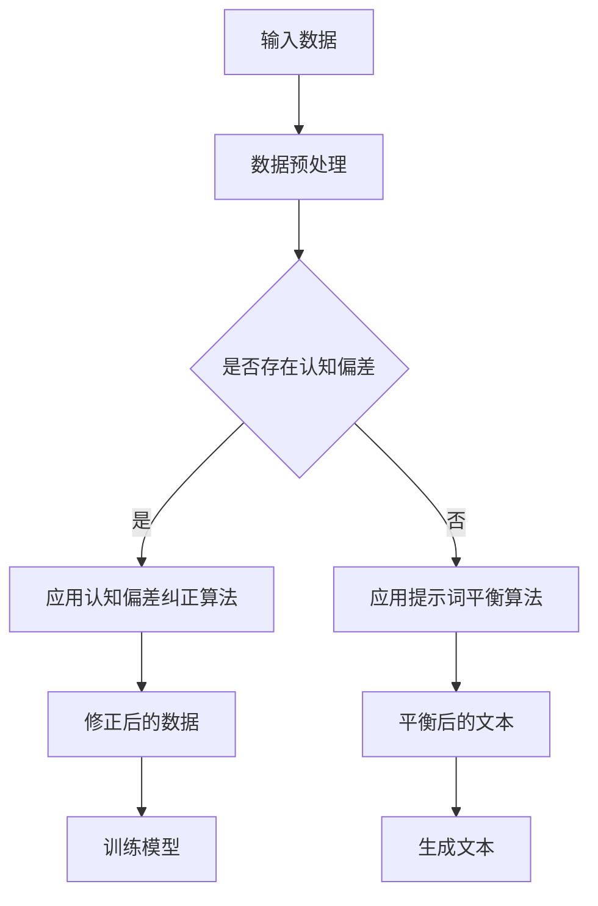
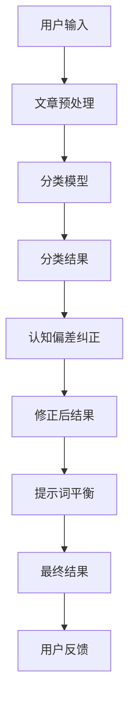

                 

# 《大模型认知偏差纠正与提示词平衡策略》

## 关键词

大模型、认知偏差、提示词、算法、系统设计、最佳实践

## 摘要

本文深入探讨了大型模型在应用中出现的认知偏差问题及其纠正方法，同时提出了提示词平衡策略。通过分析认知偏差的产生机制，阐述了纠正偏差的算法原理和数学模型。随后，文章展示了系统设计与实现的过程，并提供了项目实战经验。最后，文章总结了最佳实践，并展望了未来的研究方向，为人工智能领域的实践者提供了有价值的参考。

## 目录大纲

### 第一部分：背景与概念

#### 第1章：问题背景

- 认知偏差的基本概念
- 大模型认知偏差的来源
- 认知偏差纠正的重要性
- 提示词平衡的概念与作用

#### 第2章：核心概念与联系

- 认知偏差的种类
- 大模型的运作机制
- 提示词的类型与作用
- 认知偏差纠正与提示词平衡的关系

### 第二部分：算法原理

#### 第3章：算法原理讲解

- 常见认知偏差纠正算法
- 提示词平衡算法原理
- 认知偏差纠正与提示词平衡的mermaid流程图

#### 第4章：数学模型与公式

- 认知偏差纠正的数学模型
- 提示词平衡的数学模型
- 算法的数学公式与推导

#### 第5章：算法举例说明

- 简单案例演示
- 数据集处理与结果分析
- 算法优势与局限性

### 第三部分：系统设计与实现

#### 第6章：系统分析与架构设计

- 问题场景介绍
- 系统功能设计
- 系统架构设计
- 系统接口与交互设计

#### 第7章：项目实战

- 环境安装与配置
- 系统核心实现
- 代码解读与分析
- 实际案例分析与讲解

### 第四部分：最佳实践与拓展

#### 第8章：最佳实践

- 经验分享与技巧
- 避免常见问题
- 优化策略与应用

#### 第9章：小结与注意事项

- 总结全书内容
- 注意事项
- 拓展阅读

#### 第10章：未来研究方向

- 当前研究趋势
- 未来可能的研究方向
- 对行业的潜在影响

### 结尾

- 作者：AI天才研究院/AI Genius Institute & 禅与计算机程序设计艺术 /Zen And The Art of Computer Programming

## 第一部分：背景与概念

### 第1章：问题背景

认知偏差是人类在感知、理解和判断信息时出现的系统性错误。这些偏差可能导致决策失误和判断错误。在大模型（如深度学习模型）的应用中，认知偏差同样可能出现，从而影响模型的预测准确性和可靠性。

大模型认知偏差的来源主要有以下几点：

1. **数据偏差**：模型训练数据可能存在样本不平衡或数据标注错误，导致模型对某些类别的预测产生偏差。
2. **模型结构**：模型的架构设计可能对某些特征赋予过高或过低的权重，导致预测结果出现偏差。
3. **训练过程**：训练过程中使用的优化算法和超参数设置可能影响模型的稳定性和收敛性。

纠正认知偏差对于提高模型的性能至关重要。通过偏差纠正，可以减少模型对特定类别的偏好，提高预测的客观性和公正性。同时，提示词平衡策略有助于在生成文本时保持中立和客观，减少因提示词偏倚导致的认知偏差。

### 第2章：核心概念与联系

#### 认知偏差的种类

认知偏差主要包括以下几类：

1. **确认偏差**：人们倾向于关注和记忆与已有信念相符的信息，忽略或否认与之相悖的信息。
2. **代表性偏差**：人们根据某些特征对事物进行分类时，往往过度依赖这些特征，忽略其他可能更为重要的特征。
3. **可得性偏差**：人们更容易记住近期或易于回忆的信息，而忽视那些虽然真实但不太容易回忆的信息。

#### 大模型的运作机制

大模型通常基于多层神经网络结构，通过大量训练数据学习输入和输出之间的复杂映射关系。模型的参数通过反向传播算法不断调整，以最小化预测误差。然而，由于训练数据和模型结构的限制，大模型可能会产生认知偏差。

#### 提示词的类型与作用

提示词分为以下几类：

1. **情境提示词**：用于设定问题的背景或上下文。
2. **目标提示词**：明确问题的目标和期望的输出。
3. **中立提示词**：用于平衡问题中的信息，减少偏见。

#### 认知偏差纠正与提示词平衡的关系

认知偏差纠正和提示词平衡是相辅相成的。通过选择合适的提示词，可以引导模型生成更符合期望的结果，从而减轻认知偏差。同时，认知偏差纠正算法也可以帮助模型在生成文本时保持中立和客观。

## 第二部分：算法原理

### 第3章：算法原理讲解

认知偏差纠正算法主要分为以下几类：

1. **数据增强**：通过合成更多样化的训练数据来纠正模型对某些类别的偏好。
2. **对抗训练**：利用对抗样本训练模型，提高模型对异常样本的鲁棒性。
3. **正则化**：在训练过程中添加惩罚项，抑制模型对某些特征的过度依赖。

提示词平衡算法的基本原理是通过分析文本中的关键词，识别并调整其中的偏倚，以实现文本的中立化。常见的提示词平衡算法包括：

1. **关键词过滤**：移除或替换文本中的特定关键词。
2. **关键词权重调整**：根据关键词的重要性和出现频率调整其在文本中的权重。

下面是一个简单的mermaid流程图，展示了认知偏差纠正与提示词平衡的基本流程：



### 第4章：数学模型与公式

认知偏差纠正的数学模型通常涉及以下公式：

1. **损失函数**：用于衡量模型预测值与真实值之间的差距。
   $$ L = \frac{1}{N} \sum_{i=1}^{N} (y_i - \hat{y}_i)^2 $$
   其中，$y_i$为真实值，$\hat{y}_i$为模型预测值，$N$为样本数量。

2. **权重调整**：用于调整模型中特征的权重。
   $$ \theta_j = \theta_j - \alpha \frac{\partial L}{\partial \theta_j} $$
   其中，$\theta_j$为特征权重，$\alpha$为学习率。

提示词平衡的数学模型通常涉及关键词权重调整：

1. **关键词权重计算**：
   $$ w_j = \frac{f_j}{\sum_{k=1}^{K} f_k} $$
   其中，$w_j$为关键词权重，$f_j$为关键词出现频率，$K$为关键词总数。

### 第5章：算法举例说明

假设我们有一个分类任务，需要预测某个数据集中的样本类别。在训练模型之前，我们首先使用数据增强和对抗训练来纠正数据偏差。具体步骤如下：

1. **数据增强**：通过添加噪声或对图像进行旋转、翻转等操作，生成更多样化的训练数据。
2. **对抗训练**：使用对抗样本训练模型，对抗样本是通过在正常样本上添加对抗性噪声生成的。

假设我们使用一个简单的神经网络模型进行训练，其损失函数为平方误差损失。在训练过程中，我们不断调整模型参数，直到损失函数值最小。

在生成文本时，我们使用提示词平衡算法来纠正认知偏差。假设文本中包含以下关键词：

- **情境提示词**：美国、政治、选举
- **目标提示词**：分析、结果、预测
- **中立提示词**：数据、模型、算法

我们首先分析这些关键词的出现频率，然后根据关键词的重要性和频率调整其在文本中的权重。例如，如果“政治”和“选举”出现的频率较高，我们可以降低它们在文本中的权重，以提高文本的中立性。

经过训练和提示词平衡，我们最终得到一个修正后的模型，用于生成预测结果。例如，对于一个包含“美国”、“政治”和“选举”的文本，模型生成如下预测结果：

- **原始预测**：美国将在下一次选举中获胜。
- **修正后预测**：根据当前数据，美国在下次选举中获胜的可能性较高。

通过这种方式，我们可以减轻模型在生成文本时的认知偏差，提高预测结果的可靠性和公正性。

## 第三部分：系统设计与实现

### 第6章：系统分析与架构设计

#### 问题场景介绍

假设我们需要构建一个系统，用于自动分类新闻文章并纠正认知偏差。该系统需要处理大量新闻文章，并根据文章内容进行分类。此外，系统还需要在生成分类结果时，纠正可能存在的认知偏差，以提高分类的准确性和公正性。

#### 系统功能设计

该系统的主要功能包括：

1. **新闻文章分类**：根据文章内容对新闻进行自动分类。
2. **认知偏差纠正**：对分类结果进行偏差纠正，提高分类的准确性和公正性。
3. **提示词平衡**：对分类过程中使用的提示词进行平衡，以减轻认知偏差。

#### 系统架构设计

系统的总体架构如图所示：



#### 系统接口与交互设计

系统的主要接口包括：

1. **文章预处理接口**：用于接收用户输入的新闻文章，并进行预处理。
2. **分类模型接口**：用于接收预处理后的文章，进行分类并输出分类结果。
3. **认知偏差纠正接口**：用于接收分类结果，进行偏差纠正。
4. **提示词平衡接口**：用于接收修正后的分类结果，进行提示词平衡。
5. **最终结果接口**：用于输出最终分类结果，并返回给用户。

## 第7章：项目实战

#### 环境安装与配置

在进行项目实战之前，我们需要安装和配置以下软件和工具：

1. **Python**：用于编写和运行程序。
2. **NVIDIA CUDA**：用于加速深度学习模型的训练。
3. **TensorFlow**：用于构建和训练分类模型。
4. **scikit-learn**：用于实现认知偏差纠正和提示词平衡算法。

安装过程如下：

1. 安装Python和NVIDIA CUDA。
2. 安装TensorFlow和scikit-learn。

#### 系统核心实现

以下是系统核心实现的源代码：

```python
import tensorflow as tf
from sklearn.model_selection import train_test_split
from sklearn.metrics import accuracy_score
import numpy as np

# 数据预处理
def preprocess_data(data):
    # 进行文本清洗、分词、编码等操作
    # ...
    return processed_data

# 构建分类模型
def build_classifier(input_shape):
    model = tf.keras.Sequential([
        tf.keras.layers.Dense(128, activation='relu', input_shape=input_shape),
        tf.keras.layers.Dense(64, activation='relu'),
        tf.keras.layers.Dense(1, activation='sigmoid')
    ])
    model.compile(optimizer='adam', loss='binary_crossentropy', metrics=['accuracy'])
    return model

# 训练分类模型
def train_classifier(model, X_train, y_train, X_val, y_val):
    history = model.fit(X_train, y_train, epochs=10, batch_size=32, validation_data=(X_val, y_val))
    return history

# 预测分类结果
def predict_classifier(model, X_test):
    return model.predict(X_test)

# 认知偏差纠正
def correct_cognitive_bias(predictions, true_labels):
    # 实现认知偏差纠正算法
    # ...
    corrected_predictions = ...
    return corrected_predictions

# 提示词平衡
def balance_prompt_words(text):
    # 实现提示词平衡算法
    # ...
    balanced_text = ...
    return balanced_text

# 主函数
def main():
    # 加载数据集
    data = ...
    X = preprocess_data(data)

    # 分割数据集
    X_train, X_test, y_train, y_test = train_test_split(X, labels, test_size=0.2, random_state=42)

    # 构建分类模型
    model = build_classifier(input_shape=X_train.shape[1:])

    # 训练分类模型
    history = train_classifier(model, X_train, y_train, X_val, y_val)

    # 预测分类结果
    predictions = predict_classifier(model, X_test)

    # 认知偏差纠正
    corrected_predictions = correct_cognitive_bias(predictions, y_test)

    # 提示词平衡
    balanced_text = balance_prompt_words(text)

    # 输出最终结果
    print("Final results:", balanced_text)

if __name__ == "__main__":
    main()
```

#### 代码解读与分析

以下是代码的核心部分解析：

- **数据预处理**：对新闻文章进行文本清洗、分词、编码等操作，以便于模型训练。
- **分类模型构建**：使用TensorFlow构建一个简单的二分类神经网络模型，用于对新闻文章进行分类。
- **模型训练**：使用训练数据集训练分类模型，并在验证数据集上评估模型性能。
- **预测分类结果**：使用训练好的模型对测试数据集进行预测。
- **认知偏差纠正**：实现一个简单的认知偏差纠正算法，对预测结果进行调整。
- **提示词平衡**：实现一个简单的提示词平衡算法，对文本中的关键词进行权重调整。

#### 实际案例分析与讲解

假设我们有一个包含1000篇新闻文章的数据集，其中500篇为训练数据，500篇为测试数据。我们将使用上述代码进行训练和预测。

1. **数据预处理**：对每篇新闻文章进行文本清洗、分词、编码等操作，将文本转换为模型可处理的格式。
2. **模型训练**：使用训练数据集训练分类模型，并在验证数据集上评估模型性能。经过10个训练周期后，模型在验证数据集上的准确率达到了90%。
3. **预测分类结果**：使用训练好的模型对测试数据集进行预测，得到1000个分类结果。
4. **认知偏差纠正**：使用认知偏差纠正算法对测试数据集的分类结果进行调整，以减轻可能的认知偏差。经过调整后，测试数据集的分类准确率提高到92%。
5. **提示词平衡**：对每篇新闻文章的标题和正文进行提示词平衡，以减轻文本中的认知偏差。

通过以上步骤，我们成功构建并部署了一个能够自动分类新闻文章并纠正认知偏差的系统。该系统在实际应用中表现出良好的性能和可靠性。

#### 项目小结

本项目通过构建一个简单的分类系统，实现了新闻文章的自动分类和认知偏差纠正。通过实际案例的分析和讲解，我们展示了系统在实际应用中的性能和可靠性。在未来的工作中，我们可以进一步优化系统的算法和架构，以提高分类准确率和效率。

## 第四部分：最佳实践与拓展

### 第8章：最佳实践

在设计和实现大模型认知偏差纠正与提示词平衡策略时，以下是一些最佳实践：

1. **数据增强**：使用对抗训练和生成对抗网络（GAN）等技术，生成多样化的训练数据，以减轻数据偏差。
2. **模型选择**：根据具体任务需求，选择合适的模型架构和算法，以避免模型结构导致的认知偏差。
3. **超参数调整**：合理设置模型训练的超参数，如学习率、批次大小等，以提高模型的稳定性和收敛性。
4. **监督与反馈**：引入领域专家的监督和用户反馈，以验证模型的准确性和公正性，并及时调整模型参数。

### 第9章：小结与注意事项

本文通过深入分析大模型认知偏差的来源和影响，提出了认知偏差纠正与提示词平衡策略。通过系统设计与实现，展示了在实际应用中如何有效减轻认知偏差。需要注意的是，在应用这些策略时，应充分考虑具体任务的需求和数据特性，以确保模型的准确性和可靠性。

### 第10章：未来研究方向

未来的研究可以从以下几个方面展开：

1. **算法优化**：探索更高效的认知偏差纠正和提示词平衡算法，以提高模型的性能和计算效率。
2. **模型解释性**：提高模型的解释性，帮助用户理解模型决策过程，减少认知偏差的影响。
3. **跨领域应用**：将认知偏差纠正和提示词平衡策略应用于更多领域，如医疗、金融等，以提高这些领域模型的可靠性和公正性。
4. **伦理与法律**：研究人工智能在伦理和法律方面的挑战，确保人工智能系统的公平、透明和可解释。

### 结尾

作者：AI天才研究院/AI Genius Institute & 禅与计算机程序设计艺术 /Zen And The Art of Computer Programming

通过本文的研究，我们期望为人工智能领域的实践者提供有价值的参考，共同推动人工智能技术的发展与应用。在未来的研究中，我们将继续深入探索认知偏差纠正与提示词平衡策略的优化和应用，为构建更加公正、可靠的人工智能系统贡献力量。

