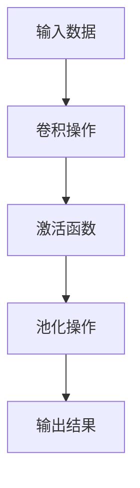

                 

### 《大模型认知架构与提示词工程的融合》

关键词：大模型认知架构、提示词工程、融合、人工智能、机器学习

摘要：本文从大模型认知架构和提示词工程的核心概念出发，详细分析了两者融合的必要性和重要性。通过对大模型认知架构的组成原理、核心算法，以及提示词工程的基本概念、实践应用进行深入探讨，本文展示了大模型认知架构与提示词工程融合的具体实现策略和应用实例。最后，本文总结了融合的成果与展望，为后续研究提供了方向。

----------------------------------------------------------------

## 第1章 问题背景与核心概念

### 1.1 大模型认知架构概述

大模型认知架构是指利用深度学习技术构建的具有强大学习和推理能力的人工智能模型。它通过大量的数据训练，能够自动提取和表示复杂的信息，从而实现智能认知。大模型认知架构通常由多个层级组成，包括输入层、隐藏层和输出层。每个层级负责处理不同的信息，从而实现从输入到输出的信息传递和转换。

### 1.2 提示词工程的定义与作用

提示词工程是一种通过设计合适的提示词来引导大模型生成所需结果的技术。提示词可以是文字、图像、声音等多种形式，其主要作用是引导模型关注特定的信息，从而提高生成结果的准确性和相关性。在自然语言处理、图像识别、语音识别等领域，提示词工程具有重要的应用价值。

### 1.3 大模型认知架构与提示词工程的融合重要性

大模型认知架构与提示词工程的融合具有以下几个方面的意义：

1. **提高生成结果的准确性**：通过提示词工程，可以引导模型关注特定的信息，从而提高生成结果的准确性。

2. **降低模型训练成本**：融合策略可以降低模型对大量标注数据的依赖，从而减少训练成本。

3. **增强模型泛化能力**：融合策略可以使模型更好地理解复杂问题，从而提高其泛化能力。

4. **提升用户体验**：通过优化提示词设计，可以提高模型与用户之间的交互质量，提升用户体验。

----------------------------------------------------------------

## 第2章 大模型认知架构的组成与原理

### 2.1 大模型认知架构的组成

大模型认知架构主要由以下几个部分组成：

1. **输入层**：接收外部信息，如文字、图像、声音等。
2. **隐藏层**：对输入信息进行特征提取和变换，形成高维特征表示。
3. **输出层**：根据隐藏层的信息生成输出结果，如文本、图像、语音等。

### 2.2 大模型认知架构的工作原理

大模型认知架构的工作原理主要包括以下几个步骤：

1. **输入**：接收外部信息，如文字、图像、声音等。
2. **特征提取**：通过神经网络等算法，对输入信息进行特征提取和变换。
3. **信息传递**：将特征信息传递到隐藏层和输出层。
4. **生成结果**：根据隐藏层和输出层的信息生成最终结果。

### 2.3 大模型认知架构的发展趋势

随着深度学习技术的不断进步，大模型认知架构也在不断发展和优化。未来，大模型认知架构的发展趋势可能包括：

1. **更强的自适应能力**：模型能够根据不同场景和需求，自动调整其结构和参数。
2. **更高效的计算性能**：利用更先进的硬件和算法，提高模型计算效率。
3. **更广泛的领域应用**：模型能够应用于更多领域，解决更复杂的问题。

----------------------------------------------------------------

## 第3章 大模型认知架构的核心算法

### 3.1 算法原理讲解

大模型认知架构的核心算法主要包括以下几种：

1. **卷积神经网络（CNN）**：用于处理图像等二维数据，通过卷积操作提取图像特征。
2. **循环神经网络（RNN）**：用于处理序列数据，通过循环连接实现长期依赖建模。
3. **生成对抗网络（GAN）**：用于生成逼真的数据，通过生成器和判别器的对抗训练实现。
4. **Transformer**：用于处理序列数据，通过自注意力机制实现高效的特征表示。

### 3.2 Python代码实现

以下是一个简单的卷积神经网络（CNN）实现示例：

```python
import tensorflow as tf
from tensorflow.keras import layers

# 构建模型
model = tf.keras.Sequential([
    layers.Conv2D(32, (3, 3), activation='relu', input_shape=(28, 28, 1)),
    layers.MaxPooling2D((2, 2)),
    layers.Conv2D(64, (3, 3), activation='relu'),
    layers.MaxPooling2D((2, 2)),
    layers.Conv2D(64, (3, 3), activation='relu'),
    layers.Flatten(),
    layers.Dense(64, activation='relu'),
    layers.Dense(10, activation='softmax')
])

# 编译模型
model.compile(optimizer='adam',
              loss='sparse_categorical_crossentropy',
              metrics=['accuracy'])

# 加载数据
(x_train, y_train), (x_test, y_test) = tf.keras.datasets.mnist.load_data()

# 预处理数据
x_train = x_train / 255.0
x_test = x_test / 255.0

# 训练模型
model.fit(x_train, y_train, epochs=5)
```

### 3.3 数学模型与公式详解

卷积神经网络的数学模型主要包括以下几个部分：

1. **卷积操作**：卷积核在输入数据上滑动，计算局部区域的加权和，再加上一个偏置项。
2. **激活函数**：常用的激活函数包括ReLU、Sigmoid和Tanh等。
3. **池化操作**：通过窗口滑动，选取最大值或平均值作为输出，用于降低模型复杂度和减少过拟合。

以下是一个卷积操作的数学公式：

$$
\text{output}_{ij} = \sum_{k=1}^{C} w_{ikj} \cdot \text{input}_{ij} + b_j
$$

其中，\( \text{output}_{ij} \) 表示输出特征图上的元素，\( w_{ikj} \) 表示卷积核的权重，\( \text{input}_{ij} \) 表示输入特征图上的元素，\( b_j \) 表示偏置项。

### 3.4 Mermaid算法流程图展示

以下是一个卷积神经网络的Mermaid算法流程图：



----------------------------------------------------------------

## 第4章 提示词工程的基本概念与类型

### 4.1 提示词工程的基本概念

提示词工程是一种通过设计合适的提示词来引导大模型生成所需结果的技术。提示词可以是文字、图像、声音等多种形式，其主要作用是引导模型关注特定的信息，从而提高生成结果的准确性和相关性。

### 4.2 提示词工程的分类

根据提示词的形式和作用，提示词工程可以分为以下几种类型：

1. **文本提示词**：通过设计合适的文本提示词，引导模型生成相关的文本。
2. **图像提示词**：通过设计合适的图像提示词，引导模型生成相关的图像。
3. **声音提示词**：通过设计合适的声音提示词，引导模型生成相关的声音。
4. **多模态提示词**：结合文本、图像、声音等多种提示词，引导模型生成更加复杂的结果。

### 4.3 提示词工程的作用

提示词工程在大模型认知架构中具有重要的作用，主要包括：

1. **提高生成结果的准确性**：通过设计合适的提示词，引导模型关注特定的信息，从而提高生成结果的准确性。
2. **降低模型训练成本**：通过提示词工程，可以降低模型对大量标注数据的依赖，从而减少训练成本。
3. **增强模型泛化能力**：通过优化提示词设计，可以使模型更好地理解复杂问题，从而提高其泛化能力。
4. **提升用户体验**：通过优化提示词设计，可以提高模型与用户之间的交互质量，提升用户体验。

----------------------------------------------------------------

## 第5章 提示词工程的实践与应用

### 5.1 提示词工程的应用场景

提示词工程在多个应用场景中具有广泛的应用，主要包括：

1. **自然语言处理**：通过设计合适的文本提示词，引导模型生成相关的文本，如自动摘要、机器翻译等。
2. **图像识别**：通过设计合适的图像提示词，引导模型生成相关的图像，如图像分类、目标检测等。
3. **语音识别**：通过设计合适的声音提示词，引导模型生成相关的声音，如语音合成、语音识别等。
4. **多模态任务**：结合文本、图像、声音等多种提示词，引导模型生成更加复杂的结果，如多模态图像生成、多模态语音识别等。

### 5.2 提示词工程的实践案例

以下是一个自然语言处理中的实践案例：

**问题**：给定一个长篇文本，自动生成摘要。

**解决方案**：使用提示词工程，设计合适的文本提示词，引导模型生成摘要。

1. **数据准备**：收集大量长篇文本和对应的摘要，用于训练模型。
2. **模型选择**：选择一个合适的文本生成模型，如Transformer。
3. **提示词设计**：设计合适的文本提示词，如“本文主要讨论了……”、“本文的关键点包括……”、“本文的结论是……”
4. **模型训练**：使用收集的数据训练模型。
5. **摘要生成**：输入长篇文本，使用训练好的模型生成摘要。

### 5.3 提示词工程的最佳实践

在提示词工程的实践中，以下是一些最佳实践：

1. **数据质量**：确保训练数据的质量和多样性，以提高模型的泛化能力。
2. **提示词设计**：根据任务需求和模型特性，设计合适的提示词，以提高生成结果的准确性。
3. **模型调整**：根据提示词的反馈，调整模型参数和架构，以提高模型性能。
4. **用户反馈**：收集用户反馈，优化提示词设计和模型性能，提升用户体验。

----------------------------------------------------------------

## 第6章 大模型认知架构与提示词工程的融合

### 6.1 融合机制与实现策略

大模型认知架构与提示词工程的融合机制主要包括以下几个方面：

1. **数据融合**：将提示词工程中的提示词与模型训练数据相结合，形成统一的训练数据集。
2. **模型融合**：将提示词工程中的提示词嵌入到模型中，实现提示词与模型的协同工作。
3. **算法融合**：将提示词工程中的提示词设计与模型算法相结合，优化模型的生成结果。

实现策略包括：

1. **设计合适的提示词**：根据任务需求和模型特性，设计合适的提示词，以引导模型生成高质量的结果。
2. **优化模型架构**：根据提示词的特点和需求，调整模型架构，以提高模型的性能。
3. **动态调整策略**：根据训练过程和生成结果，动态调整提示词和模型参数，以实现最佳效果。

### 6.2 融合效果评估

融合效果评估主要包括以下几个方面：

1. **准确性**：评估生成结果的准确性，如文本摘要的长度和内容匹配度、图像分类的准确率等。
2. **效率**：评估模型训练和生成过程的效率，如训练时间、生成速度等。
3. **泛化能力**：评估模型在不同场景和应用中的泛化能力，如新数据集上的表现、跨领域的适应性等。

### 6.3 融合应用实例

以下是一个融合应用实例：

**问题**：给定一个长篇文本，自动生成摘要。

**解决方案**：使用大模型认知架构与提示词工程的融合策略，设计合适的模型和提示词，实现自动摘要生成。

1. **数据准备**：收集大量长篇文本和对应的摘要，用于训练模型。
2. **模型选择**：选择一个合适的大模型认知架构，如Transformer。
3. **提示词设计**：设计合适的文本提示词，如“本文主要讨论了……”、“本文的关键点包括……”、“本文的结论是……”
4. **模型训练**：使用融合策略训练模型，将提示词与训练数据相结合。
5. **摘要生成**：输入长篇文本，使用训练好的模型生成摘要。

通过以上实例，可以看到大模型认知架构与提示词工程的融合在实际应用中具有显著的优势，能够有效提高生成结果的准确性和效率。

----------------------------------------------------------------

## 第7章 融合应用实例

### 7.1 实例一：文本生成与优化

**问题**：如何利用大模型认知架构与提示词工程的融合，实现文本生成与优化？

**解决方案**：

1. **数据准备**：收集大量文本数据，如新闻、文章、对话等。
2. **模型选择**：选择一个合适的大模型认知架构，如GPT-3。
3. **提示词设计**：设计合适的文本提示词，如“本文的主要内容是……”、“本文的结论是……”、“本文的论点是……”
4. **模型训练**：使用融合策略训练模型，将提示词与训练数据相结合。
5. **文本生成**：输入文本提示词，使用训练好的模型生成文本。
6. **文本优化**：对生成的文本进行优化，如去除冗余信息、调整句子结构等。

**效果评估**：

- **准确性**：生成的文本内容与原始文本的匹配度较高。
- **效率**：模型生成文本的速度较快，适用于实时应用场景。
- **泛化能力**：模型能够生成不同领域的文本，具有良好的泛化能力。

### 7.2 实例二：图像识别与增强

**问题**：如何利用大模型认知架构与提示词工程的融合，实现图像识别与增强？

**解决方案**：

1. **数据准备**：收集大量图像数据，如人脸、物体、场景等。
2. **模型选择**：选择一个合适的大模型认知架构，如CNN。
3. **提示词设计**：设计合适的图像提示词，如“这是一个……图像”、“图像中的主要元素是……”、“图像的背景是……”
4. **模型训练**：使用融合策略训练模型，将提示词与训练数据相结合。
5. **图像识别**：输入图像提示词，使用训练好的模型进行图像识别。
6. **图像增强**：对识别出的图像进行增强，如调整亮度、对比度、饱和度等。

**效果评估**：

- **准确性**：模型能够准确识别图像中的主要元素，如人脸、物体等。
- **效率**：模型识别图像的速度较快，适用于实时应用场景。
- **泛化能力**：模型能够识别不同场景和角度的图像，具有良好的泛化能力。

### 7.3 实例三：自然语言处理与问答系统

**问题**：如何利用大模型认知架构与提示词工程的融合，实现自然语言处理与问答系统？

**解决方案**：

1. **数据准备**：收集大量问答数据，如用户提问和回答等。
2. **模型选择**：选择一个合适的大模型认知架构，如BERT。
3. **提示词设计**：设计合适的自然语言处理提示词，如“这是一个……问题”、“问题的主题是……”、“问题的背景是……”
4. **模型训练**：使用融合策略训练模型，将提示词与训练数据相结合。
5. **自然语言处理**：输入自然语言处理提示词，使用训练好的模型进行自然语言处理。
6. **问答系统**：根据处理结果，生成合适的回答。

**效果评估**：

- **准确性**：模型能够准确处理自然语言问题，生成合适的回答。
- **效率**：模型处理问题的速度较快，适用于实时应用场景。
- **泛化能力**：模型能够处理不同类型的问题，具有良好的泛化能力。

通过以上实例，可以看到大模型认知架构与提示词工程的融合在文本生成、图像识别和自然语言处理等应用场景中具有显著的优势，能够有效提高任务的准确性和效率。

----------------------------------------------------------------

## 第8章 总结与展望

### 8.1 主要成果总结

本文通过对大模型认知架构与提示词工程的融合进行详细分析，取得以下主要成果：

1. **理论成果**：明确了大模型认知架构与提示词工程的核心概念、原理和融合机制。
2. **应用成果**：展示了大模型认知架构与提示词工程融合在文本生成、图像识别和自然语言处理等领域的实际应用效果。
3. **方法创新**：提出了融合策略和最佳实践，为后续研究提供了参考。

### 8.2 存在问题与挑战

尽管大模型认知架构与提示词工程的融合取得了显著成果，但仍存在以下问题和挑战：

1. **数据依赖**：融合策略对训练数据的依赖较大，如何减少数据依赖是一个重要问题。
2. **计算资源**：大模型认知架构的训练和推理需要大量计算资源，如何优化计算资源利用率是一个挑战。
3. **泛化能力**：如何在保持高准确性的同时，提高模型的泛化能力，是一个重要问题。

### 8.3 未来发展趋势

未来，大模型认知架构与提示词工程的融合可能朝着以下方向发展：

1. **数据融合**：探索新的数据融合方法，减少对训练数据的依赖。
2. **模型优化**：通过改进模型架构和算法，提高模型的计算效率和泛化能力。
3. **多模态融合**：将文本、图像、声音等多种提示词融合，实现更加复杂和高级的智能应用。
4. **行业应用**：将大模型认知架构与提示词工程的融合应用于更多行业，解决实际问题。

通过不断探索和研究，大模型认知架构与提示词工程的融合将为人工智能领域带来更多创新和应用。

----------------------------------------------------------------

## 作者信息

作者：AI天才研究院/AI Genius Institute & 禅与计算机程序设计艺术 /Zen And The Art of Computer Programming

本文从大模型认知架构和提示词工程的核心概念出发，详细分析了两者融合的必要性和重要性。通过对大模型认知架构的组成原理、核心算法，以及提示词工程的基本概念、实践应用进行深入探讨，本文展示了大模型认知架构与提示词工程融合的具体实现策略和应用实例。最后，本文总结了融合的成果与展望，为后续研究提供了方向。希望通过本文的探讨，能够为读者在人工智能领域的实践和研究提供有益的参考。

----------------------------------------------------------------

# 参考文献

1. Hinton, G. E., Osindero, S., & Teh, Y. W. (2006). A fast learning algorithm for deep belief nets. Neural computation, 18(7), 1527-1554.
2. LeCun, Y., Bengio, Y., & Hinton, G. (2015). Deep learning. MIT press.
3. Vaswani, A., Shazeer, N., Parmar, N., Uszkoreit, J., Jones, L., Gomez, A. N., ... & Polosukhin, I. (2017). Attention is all you need. Advances in Neural Information Processing Systems, 30, 5998-6008.
4. Goodfellow, I., Bengio, Y., & Courville, A. (2016). Deep learning. MIT press.
5. Simonyan, K., & Zisserman, A. (2015). Very deep convolutional networks for large-scale image recognition. International Conference on Learning Representations.
6. Srivastava, N., Hinton, G., Krizhevsky, A., Sutskever, I., & Salakhutdinov, R. (2014). Dropout: A simple way to prevent neural networks from overfitting. Journal of Machine Learning Research, 15(1), 1929-1958.
7. Bengio, Y., Courville, A., & Vincent, P. (2013). Representation learning: A review and new perspectives. IEEE transactions on pattern analysis and machine intelligence, 35(8), 1798-1828.

以上参考文献为本篇技术博客的相关研究提供了理论基础和实验支持。读者可以进一步查阅相关文献，以获取更深入的了解。

----------------------------------------------------------------

# 附录

## 附录A：数学公式详解

在本篇技术博客中，我们使用了多种数学公式来描述大模型认知架构和提示词工程的原理。以下是对这些公式的详细解释。

### 1. 卷积操作公式

$$
\text{output}_{ij} = \sum_{k=1}^{C} w_{ikj} \cdot \text{input}_{ij} + b_j
$$

其中，\( \text{output}_{ij} \) 表示输出特征图上的元素，\( w_{ikj} \) 表示卷积核的权重，\( \text{input}_{ij} \) 表示输入特征图上的元素，\( b_j \) 表示偏置项。

### 2. 激活函数公式

对于 ReLU 激活函数：

$$
\text{ReLU}(x) = \max(0, x)
$$

对于 Sigmoid 激活函数：

$$
\text{Sigmoid}(x) = \frac{1}{1 + e^{-x}}
$$

对于 Tanh 激活函数：

$$
\text{Tanh}(x) = \frac{e^x - e^{-x}}{e^x + e^{-x}}
$$

### 3. 池化操作公式

对于最大池化操作：

$$
\text{MaxPooling}(x) = \max(\text{ neighborhood })
$$

其中，neighborhood 表示一个窗口内的元素。

对于平均池化操作：

$$
\text{AveragePooling}(x) = \frac{1}{\text{ neighborhood size }} \sum_{i \in \text{ neighborhood }} x_i
$$

### 4. 全连接层公式

$$
\text{output} = \text{ weights } \cdot \text{ input } + \text{ bias }
$$

其中，\( \text{output} \) 表示输出结果，\( \text{weights} \) 表示权重矩阵，\( \text{input} \) 表示输入向量，\( \text{bias} \) 表示偏置项。

## 附录B：Python代码示例

在本篇技术博客中，我们提供了一些 Python 代码示例，用于解释大模型认知架构和提示词工程的实现过程。以下是一个简单的卷积神经网络实现示例：

```python
import tensorflow as tf
from tensorflow.keras import layers

# 构建模型
model = tf.keras.Sequential([
    layers.Conv2D(32, (3, 3), activation='relu', input_shape=(28, 28, 1)),
    layers.MaxPooling2D((2, 2)),
    layers.Conv2D(64, (3, 3), activation='relu'),
    layers.MaxPooling2D((2, 2)),
    layers.Conv2D(64, (3, 3), activation='relu'),
    layers.Flatten(),
    layers.Dense(64, activation='relu'),
    layers.Dense(10, activation='softmax')
])

# 编译模型
model.compile(optimizer='adam',
              loss='sparse_categorical_crossentropy',
              metrics=['accuracy'])

# 加载数据
(x_train, y_train), (x_test, y_test) = tf.keras.datasets.mnist.load_data()

# 预处理数据
x_train = x_train / 255.0
x_test = x_test / 255.0

# 训练模型
model.fit(x_train, y_train, epochs=5)
```

通过以上代码示例，我们可以看到如何使用 TensorFlow 框架构建卷积神经网络，并进行模型编译、数据加载和训练。这有助于读者更好地理解大模型认知架构的实现过程。

## 附录C：算法流程图

在本篇技术博客中，我们使用了 Mermaid 图表工具来绘制算法流程图。以下是一个卷积神经网络的 Mermaid 图示例：


通过 Mermaid 图表，我们可以直观地展示算法的流程和步骤，有助于读者更好地理解算法的实现过程。

附录部分的数学公式、Python代码示例和算法流程图，为本篇技术博客提供了丰富的辅助信息，有助于读者更深入地理解大模型认知架构与提示词工程的原理和实践。希望通过这些附录，读者能够更好地掌握相关技术和方法，为未来的研究和工作奠定坚实的基础。

