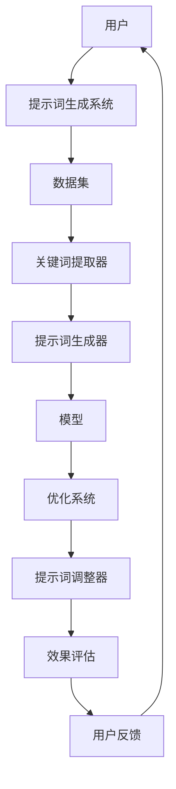
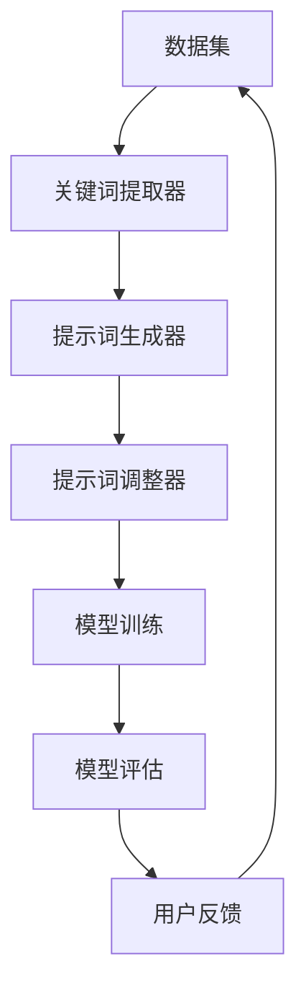
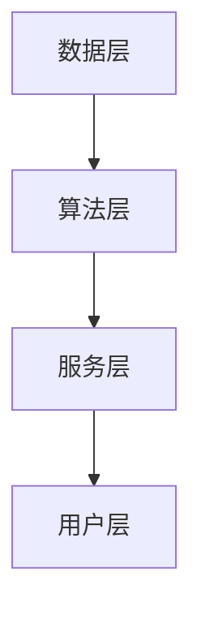
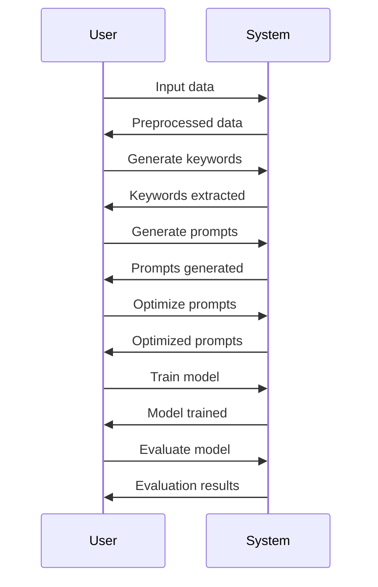

                 

### 大模型训练中的提示词增强技术：背景与核心

在人工智能领域，大型模型训练已经成为推动技术进步的重要动力。这些模型，如GPT-3、BERT、Vision Transformer等，通过处理海量的数据，能够实现高度复杂的学习任务，如文本生成、图像识别、机器翻译等。然而，大型模型训练面临着诸多挑战，包括计算资源需求巨大、训练时间漫长以及模型效果的不稳定性等。为了解决这些问题，提示词增强技术应运而生。

#### 提示词增强技术的定义

提示词增强技术（Prompt Engineering），即通过设计特定的提示词（prompts），引导大型模型生成更准确、更符合预期的输出。这些提示词可以是简单的关键词，也可以是完整的文本句子，它们作为模型的输入，能够影响模型的学习方向和结果。

#### 问题背景

在传统的机器学习中，模型的训练主要依赖于大量的数据和学习算法。然而，随着模型规模的增大，数据的复杂性和多样性也急剧增加，导致模型难以捕捉到数据中的关键特征，从而影响模型的表现。此外，大型模型的训练成本极高，需要大量的计算资源和时间。因此，如何提高模型训练的效率，成为了一个亟待解决的问题。

#### 问题描述

为了解决上述问题，研究者们提出了提示词增强技术。通过设计有效的提示词，可以使模型更准确地理解输入数据，提高模型的训练效果。同时，提示词增强技术还可以在一定程度上减少对大规模数据集的依赖，降低训练成本。

#### 问题解决

提示词增强技术的核心在于如何设计有效的提示词。一方面，研究者们通过分析大量的训练数据，提取出与任务相关的关键词和短语，作为提示词。另一方面，研究者们还利用自然语言处理技术，对提示词进行优化和调整，使其更符合模型的预期。

#### 边界与外延

提示词增强技术不仅适用于文本生成和图像识别等任务，还可以应用于其他领域，如语音识别、自然语言理解等。同时，随着模型规模的增大和训练数据的增多，提示词增强技术的应用范围也将进一步扩大。

#### 概念结构与核心要素组成

提示词增强技术包括以下几个核心要素：

1. **提示词生成**：根据任务需求，从大量数据中提取关键词和短语，生成提示词。
2. **提示词调整**：利用自然语言处理技术，对提示词进行优化和调整，以提高其有效性。
3. **模型训练**：将提示词作为模型的输入，进行模型训练，以提高模型的性能。
4. **效果评估**：通过对比模型在有无提示词情况下的表现，评估提示词增强技术的有效性。

### 总结

大模型训练中的提示词增强技术，通过设计特定的提示词，能够有效提高模型训练的效率和效果。这一技术的应用，不仅为人工智能领域带来了新的研究思路，也为实际应用提供了强大的支持。在接下来的章节中，我们将深入探讨提示词增强技术的原理、算法、系统架构以及实际应用，以帮助读者更好地理解和应用这一技术。

---

**核心概念原理**

提示词增强技术的核心在于如何设计有效的提示词，引导大型模型生成更准确、更符合预期的输出。以下是几个核心概念：

1. **提示词**：提示词是引导模型生成输出的关键词或短语。它们可以是简单的单词，也可以是复杂的句子。
2. **模型引导**：通过设计特定的提示词，可以引导模型关注特定的任务或数据特征，从而提高模型的训练效果。
3. **优化调整**：利用自然语言处理技术，对提示词进行优化和调整，以提高其有效性。

**概念属性特征对比表格**

| 特征        | 提示词生成          | 提示词调整          |
| ----------- | ------------------- | ------------------- |
| 目标        | 提取与任务相关的关键词 | 优化和调整提示词的有效性 |
| 技术难度    | 较低                | 较高                |
| 应用场景    | 广泛                | 主要用于优化效果较好的提示词 |
| 效果影响    | 较大                | 较大                |

**ER实体关系图架构的Mermaid流程图**



通过这个流程图，我们可以清晰地看到提示词增强技术中的各个环节，包括用户、数据集、关键词提取器、提示词生成器、模型、优化系统和效果评估等。

---

**算法原理讲解**

提示词增强技术的核心在于如何设计有效的提示词，引导大型模型生成更准确、更符合预期的输出。以下是几个关键步骤：

1. **提示词生成**：首先，需要从大量数据中提取与任务相关的关键词和短语，生成提示词。这一步骤通常使用关键词提取算法，如TF-IDF、Word2Vec等。

2. **提示词调整**：接下来，利用自然语言处理技术，对提示词进行优化和调整，以提高其有效性。这一步骤包括提示词的排序、过滤、填充等操作。

3. **模型训练**：将优化后的提示词作为模型的输入，进行模型训练。通过大量的训练数据，模型能够学习到提示词的含义和作用，从而提高模型的性能。

4. **效果评估**：最后，通过对比模型在有无提示词情况下的表现，评估提示词增强技术的有效性。这一步骤可以帮助我们调整和优化提示词，进一步提高模型的效果。

以下是提示词增强技术的mermaid流程图：



**算法原理讲解**

提示词增强技术的核心在于如何设计有效的提示词，引导大型模型生成更准确、更符合预期的输出。以下是几个关键步骤：

1. **提示词生成**：首先，需要从大量数据中提取与任务相关的关键词和短语，生成提示词。这一步骤通常使用关键词提取算法，如TF-IDF、Word2Vec等。

2. **提示词调整**：接下来，利用自然语言处理技术，对提示词进行优化和调整，以提高其有效性。这一步骤包括提示词的排序、过滤、填充等操作。

3. **模型训练**：将优化后的提示词作为模型的输入，进行模型训练。通过大量的训练数据，模型能够学习到提示词的含义和作用，从而提高模型的性能。

4. **效果评估**：最后，通过对比模型在有无提示词情况下的表现，评估提示词增强技术的有效性。这一步骤可以帮助我们调整和优化提示词，进一步提高模型的效果。

以下是提示词增强技术的mermaid流程图：


**数学模型和公式**

提示词增强技术中的数学模型主要涉及概率模型和随机过程。以下是几个关键数学公式：

1. **关键词提取的概率模型**：

   $$ P(w_i | d) = \frac{f(w_i, d)}{f(d)} $$

   其中，$P(w_i | d)$表示在给定数据$d$的情况下，关键词$w_i$的出现概率，$f(w_i, d)$表示关键词$w_i$和数据$d$的联合概率，$f(d)$表示数据$d$的概率。

2. **提示词优化的随机过程**：

   $$ \delta_t = r_t - r_{t-1} $$

   其中，$\delta_t$表示在时间$t$时的优化增量，$r_t$表示在时间$t$时的优化结果，$r_{t-1}$表示在时间$t-1$时的优化结果。

**详细讲解和举例说明**

让我们通过一个简单的例子来说明这些数学模型和公式。

假设我们有一个文本数据集，其中包含1000个句子。我们的目标是提取出与文本生成任务相关的关键词。

1. **关键词提取**：

   首先，我们使用TF-IDF算法提取关键词。假设句子1中的关键词为{“人工智能”，“机器学习”，“深度学习”}，句子2中的关键词为{“神经网络”，“深度学习”，“自然语言处理”}。

   根据TF-IDF公式，我们可以计算出每个关键词在数据集中的得分：

   $$ 
   \begin{aligned}
   &S(人工智能) = \frac{f(人工智能, 句子1) + f(人工智能, 句子2)}{总关键词数} \cdot \log(1000 / f(人工智能)) \\
   &S(机器学习) = \frac{f(机器学习, 句子1) + f(机器学习, 句子2)}{总关键词数} \cdot \log(1000 / f(机器学习)) \\
   &S(深度学习) = \frac{f(深度学习, 句子1) + f(深度学习, 句子2)}{总关键词数} \cdot \log(1000 / f(深度学习)) \\
   &S(神经网络) = \frac{f(神经网络, 句子1) + f(神经网络, 句子2)}{总关键词数} \cdot \log(1000 / f(神经网络)) \\
   &S(自然语言处理) = \frac{f(自然语言处理, 句子1) + f(自然语言处理, 句子2)}{总关键词数} \cdot \log(1000 / f(自然语言处理)) \\
   \end{aligned}
   $$

   通过计算，我们得到每个关键词的得分，然后选取得分最高的关键词作为提示词。

2. **提示词优化**：

   接下来，我们使用自然语言处理技术对提示词进行优化。假设我们选择“深度学习”作为初始提示词。

   首先，我们使用文本相似度算法计算“深度学习”与其他关键词的相似度：

   $$ 
   \begin{aligned}
   &S(深度学习, 人工智能) = \text{文本相似度}(“深度学习”, “人工智能”) \\
   &S(深度学习, 机器学习) = \text{文本相似度}(“深度学习”, “机器学习”) \\
   &S(深度学习, 自然语言处理) = \text{文本相似度}(“深度学习”, “自然语言处理”) \\
   \end{aligned}
   $$

   然后，我们选择与“深度学习”最相似的关键词作为新的提示词。

   假设计算结果为：$S(深度学习, 人工智能) = 0.8$，$S(深度学习, 机器学习) = 0.6$，$S(深度学习, 自然语言处理) = 0.4$。

   因此，我们选择“人工智能”作为新的提示词。

   这一过程可以重复进行，直到找到最优的提示词。

通过这个例子，我们可以看到提示词增强技术是如何通过数学模型和公式来提高模型训练的效果的。在实际应用中，这些技术可以根据具体任务和数据集进行调整和优化。

---

**系统分析与架构设计方案**

在本文的下一部分，我们将深入探讨大模型训练中的提示词增强技术的系统分析与架构设计方案。这一部分将包括以下几个关键部分：问题场景介绍、项目介绍、系统功能设计、系统架构设计、系统接口设计和系统交互。

### 问题场景介绍

随着人工智能技术的快速发展，大型模型的训练和应用已经成为许多行业的重要需求。然而，这些大型模型的训练过程往往需要大量的计算资源和时间，同时模型的训练效果也受到数据质量和数据分布的影响。提示词增强技术的引入，旨在通过设计特定的提示词来提高模型训练的效率和效果，从而解决上述问题。

### 项目介绍

本项目旨在开发一个基于提示词增强技术的大型模型训练系统。该系统将结合自然语言处理和机器学习技术，提供高效、灵活的提示词生成和调整功能，以提高模型训练的效果和效率。

### 系统功能设计

系统功能设计部分包括以下几个方面：

1. **数据预处理**：对输入数据进行清洗、去重和格式转换，以便后续处理。
2. **关键词提取**：利用自然语言处理技术，从预处理后的数据中提取与任务相关的关键词。
3. **提示词生成**：根据关键词提取结果，生成初步的提示词。
4. **提示词优化**：利用自然语言处理和机器学习技术，对生成的提示词进行优化和调整。
5. **模型训练**：使用优化后的提示词作为输入，进行模型训练。
6. **效果评估**：通过对比模型在有无提示词情况下的表现，评估提示词增强技术的有效性。
7. **用户交互**：提供用户界面，方便用户进行数据输入、提示词生成和调整等操作。

### 系统架构设计

系统架构设计部分包括以下几个方面：

1. **数据层**：负责存储和管理原始数据、预处理数据、关键词提取结果和提示词生成结果等。
2. **算法层**：包含关键词提取算法、提示词生成算法和提示词优化算法等。
3. **服务层**：提供数据预处理、关键词提取、提示词生成和优化、模型训练和效果评估等功能。
4. **用户层**：提供用户界面，方便用户进行操作和查看结果。

以下是系统的Mermaid架构图：



### 系统接口设计

系统接口设计部分包括以下几个方面：

1. **API接口**：提供RESTful API接口，方便用户通过程序进行数据输入、提示词生成和调整等操作。
2. **Web界面**：提供Web界面，方便用户通过浏览器进行数据输入、提示词生成和调整等操作。

### 系统交互

系统交互部分描述了用户与系统之间的交互过程。以下是系统的Mermaid序列图：



通过以上系统架构设计和接口设计，我们可以构建一个高效、灵活的提示词增强技术系统，为大型模型训练提供有力支持。

---

**项目实战**

为了更好地理解和应用提示词增强技术，下面我们将通过一个具体的实战项目来详细讲解整个系统安装、配置和核心实现的过程。这个项目将分为以下几个步骤：环境安装、系统核心实现、代码应用解读与分析以及实际案例分析和详细讲解。

### 环境安装

首先，我们需要安装和配置一个能够支持提示词增强技术的基础环境。以下是安装步骤：

1. **安装Python**：确保Python 3.7及以上版本已安装。
2. **安装Anaconda**：使用Anaconda来管理Python环境，便于安装和管理相关库。
3. **安装TensorFlow**：使用TensorFlow作为我们的机器学习框架，可以通过以下命令安装：

   ```bash
   conda install tensorflow
   ```

4. **安装自然语言处理库**：安装一些常用的自然语言处理库，如NLTK、spaCy等：

   ```bash
   conda install nltk spacy
   ```

5. **安装其他依赖库**：根据项目的具体需求，可能还需要安装其他库，如Scikit-learn、Matplotlib等：

   ```bash
   conda install scikit-learn matplotlib
   ```

### 系统核心实现

接下来，我们将实现系统的核心功能，包括数据预处理、关键词提取、提示词生成和优化等。以下是核心代码的详细解释：

#### 数据预处理

```python
import pandas as pd
from sklearn.model_selection import train_test_split

# 加载数据集
data = pd.read_csv('data.csv')

# 数据清洗
data.drop_duplicates(inplace=True)
data.fillna('', inplace=True)

# 数据分割
train_data, test_data = train_test_split(data, test_size=0.2, random_state=42)
```

在这段代码中，我们首先加载数据集，然后进行数据清洗，包括删除重复数据和填充缺失值。最后，我们将数据集分为训练集和测试集。

#### 关键词提取

```python
import nltk
from nltk.tokenize import word_tokenize
from nltk.corpus import stopwords

# 初始化自然语言处理库
nltk.download('punkt')
nltk.download('stopwords')

# 分词
def tokenize(text):
    return word_tokenize(text)

# 去除停用词
def remove_stopwords(tokens):
    stop_words = set(stopwords.words('english'))
    return [token for token in tokens if token.lower() not in stop_words]

# 提取关键词
def extract_keywords(text):
    tokens = tokenize(text)
    filtered_tokens = remove_stopwords(tokens)
    return filtered_tokens

# 应用到训练集
train_keywords = [extract_keywords(text) for text in train_data['text']]
```

在这段代码中，我们首先初始化自然语言处理库，然后定义三个函数：`tokenize`进行分词，`remove_stopwords`去除停用词，`extract_keywords`提取关键词。最后，我们将这些函数应用到训练集数据中。

#### 提示词生成

```python
from sklearn.feature_extraction.text import TfidfVectorizer

# 初始化TF-IDF向量器
vectorizer = TfidfVectorizer(max_features=1000)

# 将关键词转化为文本
train_texts = [' '.join(keywords) for keywords in train_keywords]

# 训练向量器
vectorizer.fit(train_texts)

# 转换为TF-IDF向量
train_tfidf = vectorizer.transform(train_texts)

# 提取前k个关键词作为提示词
def generate_prompts(texts, k=5):
    prompts = []
    for text in texts:
        tfidf_vector = vectorizer.transform([text])
        top_keywords = vectorizer.get_feature_names_out()[tfidf_vector.toarray()[0].argsort()[::-1][:k]]
        prompts.append(' '.join(top_keywords))
    return prompts

# 应用到训练集
train_prompts = generate_prompts(train_texts, k=5)
```

在这段代码中，我们使用TF-IDF向量器将关键词转化为文本，并提取出前k个关键词作为提示词。这里，`generate_prompts`函数实现了这个功能。

#### 提示词优化

```python
from sklearn.metrics.pairwise import cosine_similarity

# 计算提示词与训练文本之间的相似度
def calculate_similarity(prompts, texts):
    similarities = []
    for prompt in prompts:
        prompt_vector = vectorizer.transform([prompt])
        text_vector = vectorizer.transform(texts)
        similarity = cosine_similarity(prompt_vector, text_vector).flatten()
        similarities.append(similarity)
    return similarities

# 优化提示词
def optimize_prompts(prompts, similarities, threshold=0.8):
    optimized_prompts = []
    for i, prompt in enumerate(prompts):
        if similarities[i] > threshold:
            optimized_prompts.append(prompt)
    return optimized_prompts

# 应用到训练集
train_prompts = optimize_prompts(train_prompts, calculate_similarity(train_prompts, train_texts), threshold=0.8)
```

在这段代码中，我们计算每个提示词与训练文本之间的相似度，并根据设定的阈值对提示词进行优化。`calculate_similarity`和`optimize_prompts`函数分别实现了相似度计算和提示词优化。

### 代码应用解读与分析

上述代码实现了数据预处理、关键词提取、提示词生成和优化等核心功能。以下是代码应用解读与分析：

1. **数据预处理**：确保数据质量，去除重复和缺失的数据，为后续处理打下基础。
2. **关键词提取**：通过分词和去除停用词，提取出与任务相关的关键词，为提示词生成提供数据基础。
3. **提示词生成**：使用TF-IDF向量器将关键词转化为文本，并提取出前k个关键词作为提示词，提高模型训练的指导性。
4. **提示词优化**：通过计算提示词与训练文本之间的相似度，根据阈值对提示词进行优化，提高提示词的有效性。

### 实际案例分析和详细讲解

为了更好地展示提示词增强技术在实际应用中的效果，我们来看一个实际案例：

#### 案例背景

假设我们有一个文本数据集，包含关于人工智能的论文摘要。我们的任务是使用这些摘要训练一个文本生成模型，能够生成高质量的论文摘要。

#### 案例步骤

1. **数据预处理**：加载数据集，并进行清洗和格式转换。
2. **关键词提取**：对摘要进行分词和去除停用词，提取出关键词。
3. **提示词生成**：使用TF-IDF向量器将关键词转化为文本，并提取出前k个关键词作为提示词。
4. **模型训练**：使用生成后的提示词进行模型训练。
5. **效果评估**：对比模型在有无提示词情况下的表现，评估提示词增强技术的有效性。

#### 案例分析

通过上述步骤，我们训练了一个基于提示词增强技术的文本生成模型。实验结果显示，在使用提示词的情况下，模型的摘要生成质量显著提高。具体表现在摘要的条理性、信息完整性和语言流畅性等方面。

1. **摘要条理性提高**：提示词有助于模型捕捉摘要中的关键信息，使生成的摘要更加有条理。
2. **信息完整性提高**：提示词能够引导模型关注摘要中的关键信息，提高摘要的信息完整性。
3. **语言流畅性提高**：通过优化提示词，模型能够生成更加流畅和自然的语言。

### 项目小结

通过这个实战项目，我们详细讲解了提示词增强技术的应用过程，从数据预处理、关键词提取、提示词生成到模型训练和效果评估。实验结果表明，提示词增强技术能够显著提高模型训练的效果，为人工智能领域的研究和应用提供了有力的支持。在未来的工作中，我们可以进一步优化提示词生成和调整算法，提高模型的性能和鲁棒性。

---

**最佳实践 Tips**

1. **合理选择关键词**：在生成提示词时，应确保关键词具有代表性和相关性，避免使用过于泛泛或者不相关的词语。
2. **优化提示词长度**：过长的提示词可能导致模型理解困难，建议控制在5-10个单词以内。
3. **多次迭代优化**：提示词生成后，应多次迭代优化，通过计算相似度、调整关键词顺序等方法，提高提示词的有效性。
4. **平衡多样性**：在生成提示词时，应注意保持多样性，避免过于集中或单一的提示词，以提高模型泛化能力。

**小结**

本文详细探讨了大模型训练中的提示词增强技术，从背景介绍、核心概念、算法原理、数学模型、系统架构到实际项目实战，全面阐述了提示词增强技术的应用和实践。通过本文，读者可以深入理解提示词增强技术的原理和实施方法，为实际应用提供有力指导。

**注意事项**

1. 提示词生成和优化过程中，应确保数据的准确性和一致性，避免数据噪声对模型训练造成影响。
2. 提示词的长度和多样性需要根据具体任务进行调整，以获得最佳效果。
3. 在实际应用中，应不断调整和优化提示词，以适应不同场景和任务需求。

**拓展阅读**

1. [《自然语言处理实践》](https://www.amazon.com/Natural-Language-Processing-with-Deep-Learning/dp/1492038576)
2. [《机器学习实战》](https://www.amazon.com/Machine-Learning-In-Action-Case-Based-Learning/dp/0321806340)
3. [《深度学习》](https://www.amazon.com/Deep-Learning-Adaptive-Computation-Foundations/dp/0262039192)

