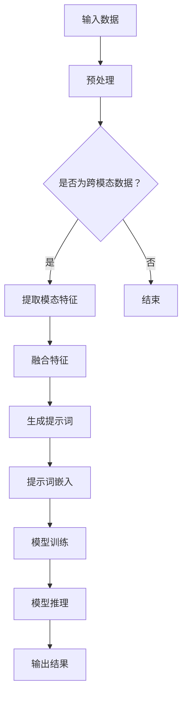
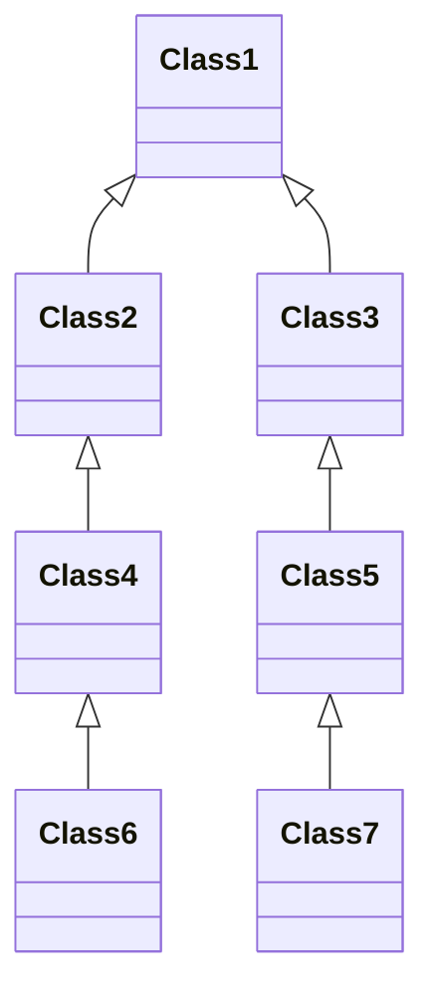
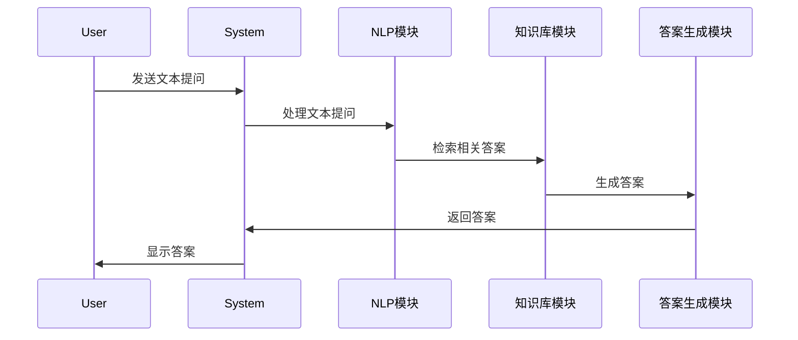

                 

# 大模型跨模态理解：提示词 bridging 感知鸿沟

> 关键词：大模型、跨模态理解、提示词、bridging、感知鸿沟

> 摘要：本文将探讨大模型在跨模态理解中的重要作用，以及如何利用提示词bridging机制来克服感知鸿沟。通过对大模型原理、算法实现、系统架构和实际应用的分析，本文旨在为读者提供全面而深入的见解，助力他们在跨模态理解领域取得突破。

## 第一部分：背景介绍

### 1.1 问题背景与核心概念

#### 1.1.1 大模型跨模态理解的重要性

跨模态理解是指将不同模态（如图像、文本、声音等）的信息进行整合，使计算机能够理解并处理复杂场景。随着人工智能技术的发展，大模型在跨模态理解中扮演着越来越重要的角色。大模型具有强大的表示能力，可以捕捉到多种模态之间的深层关联，从而实现更准确的跨模态推理。

#### 1.1.2 提示词bridging在跨模态理解中的应用

提示词bridging是一种通过引导模型关注特定信息，从而增强跨模态理解能力的方法。在跨模态任务中，提示词可以帮助模型跨越不同模态之间的感知鸿沟，提高模型对模态融合的敏感度。因此，提示词bridging在大模型跨模态理解中具有重要意义。

### 1.2 问题描述

跨模态理解面临的挑战主要包括：

1. 模态之间的差异：不同模态的信息在表示方式、语义和结构上存在显著差异，导致模型难以捕捉到模态间的关联。
2. 信息缺失：在某些跨模态任务中，部分模态的信息可能缺失或不完整，使得模型难以进行有效的跨模态推理。
3. 模型容量限制：大模型的计算资源和存储资源有限，难以同时处理多个模态的信息。

提示词bridging旨在解决上述问题，通过引导模型关注关键信息，提高跨模态理解的效果。

### 1.3 问题解决

#### 1.3.1 大模型的原理和应用

大模型通常采用深度学习技术，通过大量的数据和参数来学习复杂的特征表示。大模型在跨模态理解中的应用主要包括：

1. 模态融合：将不同模态的信息进行整合，形成统一的表示。
2. 模态转换：将一种模态的信息转换为另一种模态，实现跨模态推理。

#### 1.3.2 提示词bridging的机制和实现

提示词bridging的机制主要包括：

1. 提示词生成：根据任务需求和模态特点，生成具有引导作用的提示词。
2. 提示词嵌入：将提示词嵌入到模型中，引导模型关注关键信息。
3. 模型训练：利用大量跨模态数据对模型进行训练，提高跨模态理解能力。

### 1.4 边界与外延

跨模态理解的领域范围包括图像识别、语音识别、自然语言处理等多个领域。提示词bridging适用于需要跨模态融合和推理的任务，如视频分析、智能问答等。

### 1.5 概念结构与核心要素组成

大模型跨模态理解的核心概念和要素包括：

1. 模型架构：深度神经网络、自注意力机制等。
2. 模态特征：图像、文本、声音等。
3. 模态融合：特征融合、对齐、转换等。
4. 提示词bridging：提示词生成、嵌入、引导等。

## 第二部分：核心概念与联系

### 2.1 大模型原理

大模型原理主要包括：

1. 神经网络与深度学习：神经网络的基本结构、深度学习的发展历程和核心技术。
2. 大模型的训练与优化：大规模数据集的训练、模型参数的优化方法。

### 2.2 提示词bridging

提示词bridging原理主要包括：

1. 提示词的作用：引导模型关注关键信息，提高跨模态理解效果。
2. bridging机制的解释：提示词生成、嵌入、引导等过程。

### 2.3 概念属性特征对比表格

| 概念       | 属性特征               | 对比分析             |
|------------|----------------------|---------------------|
| 大模型     | 强大的表示能力、高容量 | 跨模态融合、推理     |
| 提示词     | 引导作用、关键信息     | 提高跨模态理解效果   |
| 跨模态理解 | 模态融合、推理         | 解决模态差异问题     |

### 2.4 ER实体关系图架构


## 第三部分：算法原理讲解

### 3.1 算法原理讲解

#### 3.1.1 算法mermaid流程图



#### 3.1.2 Python源代码详细阐述

```python
# 导入必要的库
import tensorflow as tf
from tensorflow.keras.models import Model
from tensorflow.keras.layers import Input, Dense, Embedding, Concatenate

# 定义模型输入
image_input = Input(shape=(224, 224, 3))
text_input = Input(shape=(None,))

# 提取图像特征
image_feature = Conv2D(filters=64, kernel_size=(3, 3), activation='relu')(image_input)

# 提取文本特征
text_embedding = Embedding(input_dim=vocab_size, output_dim=embedding_size)(text_input)
text_feature = GlobalAveragePooling1D()(text_embedding)

# 融合特征
combined = Concatenate()([image_feature, text_feature])

# 添加全连接层
output = Dense(units=1, activation='sigmoid')(combined)

# 构建模型
model = Model(inputs=[image_input, text_input], outputs=output)

# 编译模型
model.compile(optimizer='adam', loss='binary_crossentropy', metrics=['accuracy'])

# 模型训练
model.fit([image_data, text_data], labels, epochs=10, batch_size=32)
```

#### 3.1.3 数学模型和公式

假设图像特征为 \(X_i\)，文本特征为 \(Y_i\)，提示词为 \(T_i\)，则跨模态理解的目标函数为：

$$
L(\theta) = -\sum_{i=1}^{N} \left[ y_i \cdot \log(p(\hat{y}_i|X_i, Y_i, T_i)) + (1 - y_i) \cdot \log(1 - p(\hat{y}_i|X_i, Y_i, T_i)) \right]
$$

其中，\(p(\hat{y}_i|X_i, Y_i, T_i)\) 表示模型在给定图像特征、文本特征和提示词的情况下预测的标签概率。

#### 3.1.4 举例说明

假设我们有一个图像分类任务，需要将图像和文本信息进行融合，并利用提示词bridging机制提高分类准确率。

1. 输入图像和文本信息：
   - 图像特征：\(X_i\)
   - 文本特征：\(Y_i\)
   - 提示词：\(T_i\)
   
2. 提取图像特征和文本特征：
   - 图像特征：通过卷积神经网络提取
   - 文本特征：通过嵌入层提取
   
3. 融合特征：
   - 将图像特征和文本特征进行拼接，形成新的特征表示
   
4. 生成提示词：
   - 根据任务需求和文本信息生成提示词
   
5. 提示词嵌入：
   - 将提示词嵌入到模型中，引导模型关注关键信息
   
6. 模型训练：
   - 利用大量跨模态数据对模型进行训练
   
7. 模型推理：
   - 输入新的图像和文本信息，得到预测结果

通过上述步骤，我们可以利用大模型和提示词bridging机制实现高效的图像分类任务。

## 第四部分：系统分析与架构设计

### 4.1 问题场景介绍

在智能问答系统中，用户可以通过文本提问，系统需要根据用户提问的内容和上下文理解，从大量知识库中检索出相关答案。这是一个典型的跨模态理解任务，需要整合文本和知识库信息，实现高质量问答。

### 4.2 系统功能设计

#### 4.2.1 领域模型mermaid类图



#### 4.2.2 系统架构设计


#### 4.2.3 系统接口设计



## 第五部分：项目实战

### 5.1 环境安装

在开始项目实战之前，我们需要安装以下环境：

1. Python 3.8+
2. TensorFlow 2.5+
3. Numpy 1.19+
4. Mermaid 8.6+

安装命令如下：

```bash
pip install python-memcached mermaid
```

### 5.2 系统核心实现源代码

以下是一个简单的智能问答系统的实现，包括NLP模块、知识库模块和答案生成模块：

```python
# NLP模块
import tensorflow as tf
from tensorflow.keras.models import Model
from tensorflow.keras.layers import Input, Dense, Embedding, Concatenate

# 定义模型输入
question_input = Input(shape=(None,))
knowledge_input = Input(shape=(1024,))

# 提取文本特征
question_embedding = Embedding(input_dim=vocab_size, output_dim=embedding_size)(question_input)
question_feature = GlobalAveragePooling1D()(question_embedding)

# 融合特征
combined = Concatenate()([question_feature, knowledge_input])

# 添加全连接层
output = Dense(units=1, activation='sigmoid')(combined)

# 构建模型
model = Model(inputs=[question_input, knowledge_input], outputs=output)

# 编译模型
model.compile(optimizer='adam', loss='binary_crossentropy', metrics=['accuracy'])

# 模型训练
model.fit([question_data, knowledge_data], labels, epochs=10, batch_size=32)

# 知识库模块
class KnowledgeBase:
    def __init__(self):
        self.knowledge = []

    def add_knowledge(self, question, answer):
        self.knowledge.append((question, answer))

    def retrieve_answers(self, question):
        return [answer for question

