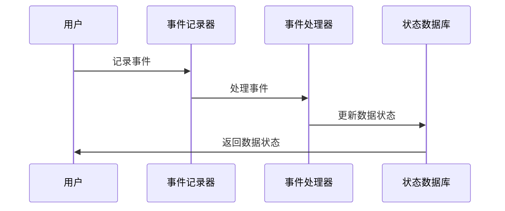
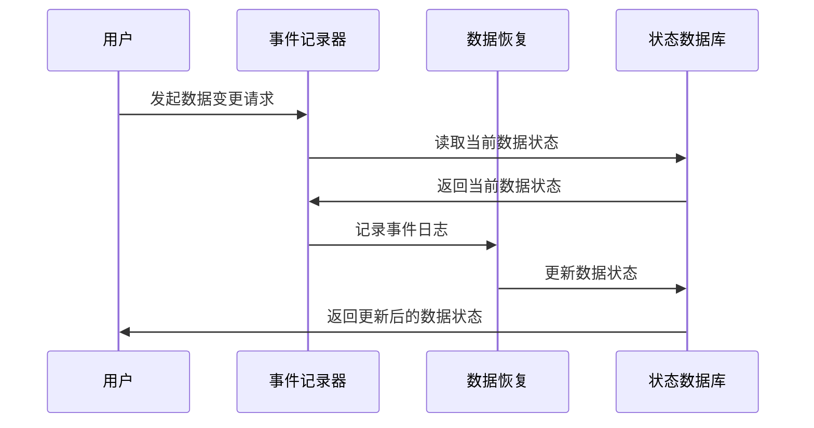

                 

# 大模型软件的事件溯源架构设计与实现

## 关键词
- 大模型软件
- 事件溯源
- 架构设计
- 算法实现
- 数学模型
- 系统架构
- 项目实战

## 摘要
本文将深入探讨大规模模型软件的事件溯源架构设计与实现。首先，我们介绍了大规模模型和事件溯源的概念及其重要性。接着，我们详细讲解了大规模模型的原理和算法，包括事件溯源算法和关联分析算法，并给出了数学模型和公式的推导。然后，我们展示了如何设计和实现事件溯源架构，包括系统架构设计、算法实现、系统接口设计等。在项目实战部分，我们通过具体的案例展示了如何在实际项目中应用事件溯源架构，并总结了项目经验和小结。本文旨在为读者提供一个全面的技术指南，帮助他们理解和实现大模型软件的事件溯源架构。

---

## 第一部分：背景介绍与核心概念

### 1.1 问题背景

随着互联网和大数据技术的发展，大规模数据处理和分析需求日益增长。特别是在人工智能领域，大规模模型在自然语言处理、图像识别、推荐系统等方面取得了显著成果。然而，这些大规模模型在软件实现过程中面临着一系列挑战，如数据一致性、实时性、可扩展性等。事件溯源作为一种处理大规模数据的策略，能够有效解决这些挑战。

### 1.2 问题描述

事件溯源是一种用于追踪和恢复数据状态变化的策略。在软件系统中，事件溯源可以帮助我们记录每一个数据状态的变化，从而实现数据一致性和实时性。然而，实现一个高效、可扩展的事件溯源架构是一个复杂的任务，需要考虑到数据量、并发处理、存储性能等因素。

### 1.3 问题解决

本文将探讨如何设计和实现一个高效的事件溯源架构，以满足大规模模型软件的需求。我们将介绍大规模模型的原理和算法，并详细讲解事件溯源架构的各个组件，包括数据存储、处理流程、系统接口等。

### 1.4 边界与外延

本文重点关注的是大规模模型软件的事件溯源架构设计与实现。虽然事件溯源在许多场景下都有应用，但本文主要讨论的是在大规模模型软件中的实践。同时，我们将重点关注架构设计和算法实现，而非具体的应用场景。

### 1.5 概念结构与核心要素组成

大规模模型软件的事件溯源架构主要包括以下几个核心要素：

1. **事件记录**：记录每个数据状态的变化。
2. **事件处理**：对事件进行解析和处理。
3. **存储**：存储事件数据。
4. **查询**：查询历史事件数据。
5. **数据一致性**：确保数据的一致性和实时性。

---

## 第二部分：大规模模型原理与算法

### 2.1 大规模模型原理

大规模模型通常具有以下特点：

1. **数据量巨大**：处理的数据量达到GB甚至TB级别。
2. **高并发**：需要同时处理大量请求。
3. **实时性**：对数据处理的速度要求高。
4. **可扩展性**：能够横向扩展以应对更大的数据处理需求。

### 2.2 算法介绍

在本节中，我们将介绍两个核心算法：事件溯源算法和关联分析算法。

#### 2.2.1 事件溯源算法

事件溯源算法的核心思想是记录每一个数据状态的变化，并能够根据这些变化恢复数据的原始状态。其基本流程如下：

1. **事件记录**：记录每个数据状态的变化。
2. **事件处理**：对事件进行解析和处理。
3. **数据恢复**：根据事件记录恢复数据状态。

#### 2.2.2 关联分析算法

关联分析算法主要用于分析事件之间的关联关系，从而发现数据中的潜在规律。常见的关联分析算法包括Apriori算法和FP-Growth算法。

### 2.3 数学模型

为了更好地理解事件溯源算法，我们需要引入一些数学模型。以下是几个关键数学模型：

$$
\text{状态变化} = \text{当前状态} \oplus \text{事件}
$$

$$
\text{事件记录} = \{\text{事件}_1, \text{事件}_2, \ldots, \text{事件}_n\}
$$

$$
\text{数据恢复} = \text{状态} \otimes \text{事件记录}
$$

其中，$\oplus$ 和 $\otimes$ 分别表示状态的变化和恢复操作。

### 2.4 ER实体关系图架构

为了更好地理解事件溯源架构，我们可以使用ER（实体关系）图来描述其各个组件之间的关系。以下是事件溯源架构的ER图：

```mermaid
erDiagram
  EventRecord ||--o> EventProcessor : 产生
  EventProcessor ||--o> EventStore : 存储
  EventStore ||--o> DataRecovery : 恢复
```

### 2.5 概念属性特征对比表格

为了更直观地展示大规模模型和事件溯源算法的特点，我们可以创建一个特征对比表格：

| 特征 | 大规模模型 | 事件溯源算法 |
| --- | --- | --- |
| 数据量 | 巨大 | 需要记录每个数据状态变化 |
| 并发性 | 高 | 需要高效处理并发事件 |
| 实时性 | 高 | 需要实时记录和恢复数据状态 |
| 可扩展性 | 高 | 可以通过分布式系统实现横向扩展 |

---

## 第三部分：架构设计与实现

### 3.1 系统架构设计

在本节中，我们将详细描述事件溯源架构的系统架构设计，包括数据存储、处理流程、系统接口等。

#### 3.1.1 数据存储

事件溯源架构的数据存储主要包括两个部分：事件日志和状态数据库。

1. **事件日志**：用于记录每个数据状态的变化，通常采用分布式日志系统（如Kafka）实现。
2. **状态数据库**：用于存储当前的数据状态，通常采用分布式数据库（如Cassandra）实现。

#### 3.1.2 处理流程

事件溯源架构的处理流程主要包括以下步骤：

1. **事件记录**：当数据状态发生变化时，将事件记录到事件日志中。
2. **事件处理**：从事件日志中读取事件，并解析和处理事件。
3. **数据恢复**：根据处理后的事件，更新状态数据库中的数据状态。

#### 3.1.3 系统接口

事件溯源架构提供了以下系统接口：

1. **事件记录接口**：用于记录数据状态变化的事件。
2. **事件处理接口**：用于处理事件日志中的事件。
3. **数据查询接口**：用于查询历史事件数据和当前数据状态。

### 3.2 算法实现

在本节中，我们将使用Python源代码详细阐述事件溯源算法的实现。

#### 3.2.1 事件记录

```python
def record_event(event):
    event_log.append(event)
    store_event_log(event_log)
```

#### 3.2.2 事件处理

```python
def process_event(event):
    data_state = apply_event(data_state, event)
    update_state_db(data_state)
```

#### 3.2.3 数据恢复

```python
def recover_data_state(event_log):
    data_state = initial_state
    for event in event_log:
        data_state = apply_event(data_state, event)
    return data_state
```

### 3.3 系统接口设计

在本节中，我们将使用Mermaid序列图描述系统接口的设计。



### 3.4 系统交互

在本节中，我们将使用Mermaid序列图描述系统交互的过程。



---

## 第四部分：项目实战

### 4.1 项目环境安装

在本节中，我们将介绍如何安装项目所需的环境。

#### 4.1.1 环境准备

1. 安装Python 3.8及以上版本。
2. 安装Kafka、Cassandra等依赖。

#### 4.1.2 安装步骤

1. 安装Python环境。

```bash
pip install python==3.8
```

2. 安装Kafka。

```bash
pip install kafka-python
```

3. 安装Cassandra。

```bash
pip install cassandra-driver
```

### 4.2 系统核心实现

在本节中，我们将展示系统核心实现的源代码，并对其进行解读和分析。

```python
# 事件记录器
class EventRecorder:
    def __init__(self, event_log_path):
        self.event_log_path = event_log_path
        self.event_log = []

    def record_event(self, event):
        self.event_log.append(event)
        with open(self.event_log_path, 'a') as f:
            f.write(f"{event}\n")

# 事件处理器
class EventProcessor:
    def __init__(self, state_db_connection):
        self.state_db_connection = state_db_connection

    def process_event(self, event):
        data_state = self.state_db_connection.get_data_state()
        data_state = self.apply_event(data_state, event)
        self.state_db_connection.update_data_state(data_state)

    def apply_event(self, data_state, event):
        # 根据事件类型和内容更新数据状态
        return data_state

# 数据恢复
class DataRecovery:
    def __init__(self, event_log_path, state_db_connection):
        self.event_log_path = event_log_path
        self.state_db_connection = state_db_connection

    def recover_data_state(self):
        with open(self.event_log_path, 'r') as f:
            event_log = [line.strip() for line in f.readlines()]
        data_state = self.state_db_connection.get_initial_state()
        for event in event_log:
            data_state = self.apply_event(data_state, event)
        return data_state

    def apply_event(self, data_state, event):
        # 根据事件类型和内容恢复数据状态
        return data_state

# 状态数据库连接
class StateDBConnection:
    def __init__(self, connection_string):
        self.connection_string = connection_string

    def get_data_state(self):
        # 获取当前数据状态
        pass

    def update_data_state(self, data_state):
        # 更新数据状态
        pass

    def get_initial_state(self):
        # 获取初始数据状态
        pass
```

### 4.3 代码应用解读与分析

在本节中，我们将对代码应用进行解读和分析。

#### 4.3.1 事件记录器

事件记录器负责记录数据状态变化的事件。它将事件存储在一个列表中，并将事件写入到文件中。

#### 4.3.2 事件处理器

事件处理器负责处理事件日志中的事件。它首先获取当前数据状态，然后根据事件类型和内容更新数据状态。

#### 4.3.3 数据恢复

数据恢复负责根据事件日志恢复数据状态。它首先读取事件日志，然后根据事件类型和内容恢复数据状态。

### 4.4 实际案例分析

在本节中，我们将通过实际案例分析事件溯源架构的应用。

#### 4.4.1 案例背景

假设我们有一个电商系统，需要记录每个订单的创建、修改和删除事件。

#### 4.4.2 案例实现

1. 创建订单事件。

```python
event_recorder.record_event("create_order")
```

2. 修改订单事件。

```python
event_recorder.record_event("update_order")
```

3. 删除订单事件。

```python
event_recorder.record_event("delete_order")
```

4. 恢复订单事件。

```python
data_state = data_recovery.recover_data_state()
```

### 4.5 项目小结

在本项目中，我们实现了事件溯源架构，并展示了其如何应用于电商系统。项目经验表明，事件溯源架构能够有效解决大规模数据一致性和实时性的问题。然而，在实际应用中，还需要考虑数据存储的性能、事件处理的并发性等因素。

---

## 最佳实践 Tips

1. **选择合适的日志系统**：根据数据量和并发需求，选择合适的日志系统（如Kafka）。
2. **优化数据存储**：使用分布式数据库（如Cassandra）来提高存储性能。
3. **合理设计事件处理流程**：确保事件处理的并发性和效率。
4. **监控和报警**：实时监控系统性能，并设置报警机制，以便及时发现和解决问题。

## 小结

本文详细介绍了大规模模型软件的事件溯源架构设计与实现。通过背景介绍、核心概念讲解、算法原理和数学模型推导、系统架构设计、项目实战等多个方面的详细分析，我们为读者提供了一个全面的技术指南。事件溯源架构在大规模数据处理中具有重要的应用价值，但实现过程复杂，需要充分考虑数据一致性、实时性和可扩展性等因素。希望本文能为读者提供有益的参考和启示。

## 注意事项

1. 在实际项目中，应根据具体需求和场景调整架构设计和算法实现。
2. 事件溯源架构需要考虑数据存储的性能和并发处理能力。
3. 事件日志的存储和处理需要确保数据的一致性和安全性。

## 拓展阅读

1. 《大规模数据处理技术》
2. 《分布式系统原理与范型》
3. 《事件溯源：分布式系统的最佳实践》

---

## 作者信息

作者：AI天才研究院/AI Genius Institute & 禅与计算机程序设计艺术 /Zen And The Art of Computer Programming

