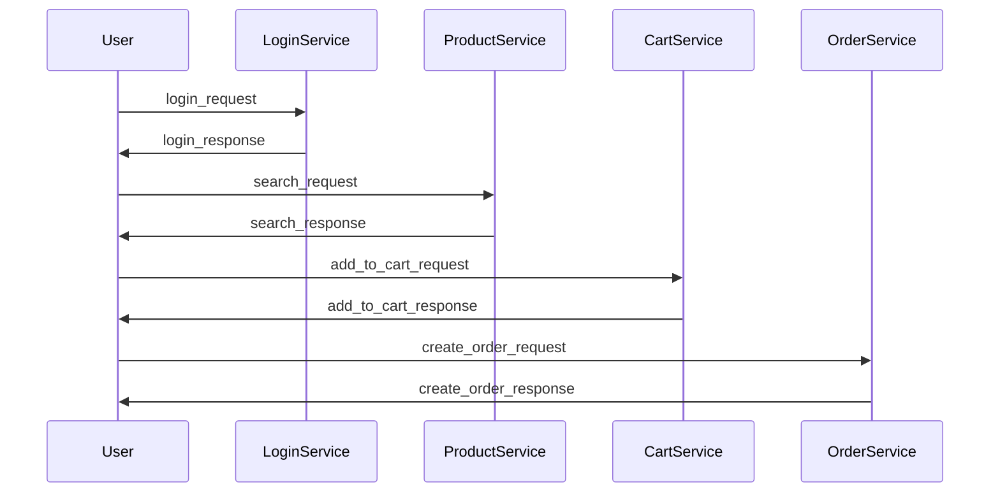
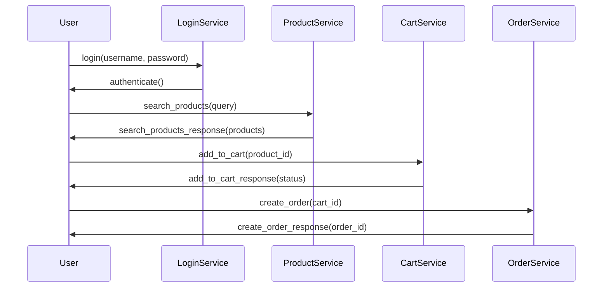

                 


# 大模型软件的事件驱动架构设计

关键词：事件驱动架构、大模型软件、架构设计、系统分析、算法原理

摘要：本文将探讨大模型软件的事件驱动架构设计，从背景介绍、核心概念与联系、算法原理、数学模型和公式、系统分析及设计、项目实践、最佳实践等方面进行详细解析，旨在为开发者提供一套完整的大模型软件事件驱动架构设计思路。

## 第一部分：背景介绍

### 1.1. 事件驱动架构的定义

事件驱动架构（Event-Driven Architecture，简称EDA）是一种以事件为核心的设计模式，其中事件是由系统内部或外部的某种行为、变化或信号触发的。事件可以是任何具有时间戳的数据，例如用户操作、系统异常、网络通信等。

事件驱动架构的核心在于事件处理，通过事件队列（Event Queue）来管理和调度事件。事件处理通常由事件处理器（Event Handler）完成，事件处理器会根据事件的类型和内容进行相应的处理。事件驱动架构具有异步、松耦合、灵活可扩展等特性。

### 1.2. 事件驱动架构的发展历程

事件驱动架构最早起源于20世纪80年代的计算机操作系统领域，例如Unix操作系统中的进程调度和信号处理机制。随着互联网和分布式系统的兴起，事件驱动架构逐渐在应用开发中得到了广泛应用。

在近年来，随着人工智能、大数据和云计算等技术的发展，大模型软件对架构设计的要求越来越高。事件驱动架构因其灵活性和可扩展性，成为大模型软件架构设计的一个重要方向。

## 第二部分：核心概念与联系

### 2.1. 事件驱动架构原理

事件驱动架构的基本原理可以概括为以下三个关键点：

1. **事件监听**：系统通过监听器（Listener）来捕捉感兴趣的事件，并将事件添加到事件队列中。

2. **事件队列**：事件队列是管理事件的中心，它按照事件发生的时间顺序对事件进行排序，并通知事件处理器。

3. **事件处理**：事件处理器根据事件的类型和内容执行相应的操作，例如更新数据、调用服务、发送消息等。

### 2.2. 事件驱动与传统的比较

与传统架构相比，事件驱动架构具有以下优势：

1. **异步处理**：事件驱动架构允许异步处理事件，提高了系统的并发性能和响应速度。

2. **松耦合**：事件驱动架构通过事件队列和事件处理器实现了组件之间的松耦合，降低了系统的复杂度和维护成本。

3. **灵活性**：事件驱动架构可以根据需求动态地添加、删除或修改事件处理器，实现了系统的灵活性和可扩展性。

### 2.3. Mermaid ER Diagram

```mermaid
erDiagram
    Event ||--|{ EventHandler : process }
    Event ||--|{ EventQueue : store }
    EventHandler ||--|{ SystemComponent : related }
    EventQueue ||--|{ SystemComponent : related }
```

在上图中，`Event` 代表事件，`EventHandler` 代表事件处理器，`EventQueue` 代表事件队列，`SystemComponent` 代表系统组件。

## 第三部分：算法原理

### 3.1. 事件驱动算法工作流程

事件驱动算法的工作流程可以分为以下几个步骤：

1. **事件生成**：事件由系统内部或外部触发，例如用户操作、系统异常、网络通信等。

2. **事件监听**：监听器捕获事件并将其添加到事件队列中。

3. **事件调度**：事件队列按照事件发生的时间顺序调度事件。

4. **事件处理**：事件处理器根据事件的类型和内容执行相应的操作。

5. **事件反馈**：事件处理器处理完毕后，可能需要向外部系统发送反馈。

### 3.2. Python源代码解释

以下是一个简单的事件驱动算法的Python实现：

```python
import heapq
import time

class Event:
    def __init__(self, event_type, timestamp):
        self.event_type = event_type
        self.timestamp = timestamp

    def __lt__(self, other):
        return self.timestamp < other.timestamp

class EventQueue:
    def __init__(self):
        self.heap = []

    def add_event(self, event):
        heapq.heappush(self.heap, event)

    def get_next_event(self):
        if self.heap:
            return heapq.heappop(self.heap)
        else:
            return None

def event_handler(event):
    print(f"Processing event of type {event.event_type} at time {event.timestamp}")

def main():
    event_queue = EventQueue()

    # Generate events
    for i in range(5):
        event = Event(f"event_{i}", time.time())
        event_queue.add_event(event)

    # Process events
    while True:
        event = event_queue.get_next_event()
        if event is None:
            break
        event_handler(event)

if __name__ == "__main__":
    main()
```

在上面的代码中，`Event` 类表示事件，包含事件类型和发生时间。`EventQueue` 类表示事件队列，使用最小堆实现。`event_handler` 函数表示事件处理器，根据事件的类型执行相应的操作。`main` 函数模拟事件生成和事件处理过程。

### 第四部分：数学模型和公式

#### 4.1. 事件驱动的数学模型

事件驱动架构中的数学模型主要包括事件生成率、处理时间和延迟等参数。

- **事件生成率（λ）**：单位时间内事件生成的数量。
- **处理时间（t）**：事件处理器处理一个事件所需的时间。
- **延迟（τ）**：事件从生成到处理完毕所需的时间。

#### 4.2. 事件驱动的数学公式

事件驱动的性能指标可以通过以下公式进行计算：

- **吞吐量（Throughput）**：单位时间内处理的事件数量，计算公式为：
  $$ Throughput = \frac{1}{\lambda + \frac{\tau}{t}} $$
- **平均延迟（Average Delay）**：事件平均延迟时间，计算公式为：
  $$ Average Delay = \frac{\tau}{\lambda} $$

## 第五部分：系统分析与设计

### 5.1. 问题场景描述

假设我们要开发一个大型在线购物系统，系统需要处理大量的用户请求，包括用户登录、商品搜索、购物车管理、订单处理等。

### 5.2. 系统功能设计（领域模型Mermaid类图）

```mermaid
classDiagram
    User <<Class>>
    Product <<Class>>
    Cart <<Class>>
    Order <<Class>>
    User <|-- Cart
    User <|-- Order
    Product <|-- Order
```

在上图中，`User`、`Product`、`Cart` 和 `Order` 分别表示用户、商品、购物车和订单类。

### 5.3. 系统架构设计（Mermaid架构图）



在上图中，`User` 代表用户，`LoginService`、`ProductService`、`CartService` 和 `OrderService` 分别表示登录服务、商品服务、购物车服务和订单服务。

### 5.4. 系统接口设计（Mermaid序列图）



在上图中，用户通过接口与各个服务进行交互，完成登录、搜索商品、添加商品到购物车、创建订单等操作。

## 第六部分：项目实践

### 6.1. 环境安装

在本项目实践中，我们将使用Python作为编程语言，并使用Flask作为Web框架。以下是环境安装步骤：

1. 安装Python 3.8及以上版本。
2. 安装Flask：`pip install flask`
3. 安装其他依赖：`pip install -r requirements.txt`

### 6.2. 核心实现源代码

以下是一个简单的事件驱动架构的核心实现源代码：

```python
from flask import Flask, request, jsonify
from datetime import datetime

app = Flask(__name__)

class Event:
    def __init__(self, event_type, data):
        self.event_type = event_type
        self.data = data
        self.timestamp = datetime.now()

class EventQueue:
    def __init__(self):
        self.heap = []

    def add_event(self, event):
        self.heap.append(event)

    def get_next_event(self):
        if self.heap:
            return self.heap.pop(0)
        else:
            return None

    def process_event(self, event):
        if event.event_type == "login":
            # 登录逻辑处理
            print("Processing login event")
        elif event.event_type == "search":
            # 搜索逻辑处理
            print("Processing search event")
        elif event.event_type == "add_to_cart":
            # 添加购物车逻辑处理
            print("Processing add_to_cart event")
        elif event.event_type == "create_order":
            # 创建订单逻辑处理
            print("Processing create_order event")

@app.route('/login', methods=['POST'])
def login():
    # 登录接口实现
    username = request.form['username']
    password = request.form['password']
    event = Event("login", {"username": username, "password": password})
    event_queue.add_event(event)
    return jsonify({"status": "success"})

@app.route('/search', methods=['POST'])
def search():
    # 搜索接口实现
    query = request.form['query']
    event = Event("search", {"query": query})
    event_queue.add_event(event)
    return jsonify({"status": "success"})

@app.route('/add_to_cart', methods=['POST'])
def add_to_cart():
    # 添加购物车接口实现
    product_id = request.form['product_id']
    event = Event("add_to_cart", {"product_id": product_id})
    event_queue.add_event(event)
    return jsonify({"status": "success"})

@app.route('/create_order', methods=['POST'])
def create_order():
    # 创建订单接口实现
    cart_id = request.form['cart_id']
    event = Event("create_order", {"cart_id": cart_id})
    event_queue.add_event(event)
    return jsonify({"status": "success"})

if __name__ == "__main__":
    event_queue = EventQueue()
    app.run(debug=True)

while True:
    event = event_queue.get_next_event()
    if event is None:
        break
    event_queue.process_event(event)
```

### 6.3. 代码分析

上述代码中，我们定义了`Event`类和`EventQueue`类，分别表示事件和事件队列。`EventQueue`类实现了事件队列的基本功能，包括添加事件、获取下一个事件和事件处理。在`app`的各个路由中，我们创建事件并将其添加到事件队列中，然后通过一个循环不断获取事件并处理。

### 6.4. 案例分析

假设用户发起了一个登录请求，系统如何响应？

1. 用户发起登录请求，系统接收到请求后，创建一个登录事件并将其添加到事件队列中。
2. 系统不断从事件队列中获取事件并处理。当登录事件被处理时，系统执行登录逻辑，验证用户名和密码。
3. 如果验证成功，系统返回登录成功响应；否则，返回登录失败响应。

### 6.5. 项目小结

通过本项目实践，我们实现了一个大模型软件的事件驱动架构设计。项目中的关键组件包括事件类、事件队列类和各个路由处理函数。事件队列类实现了事件的管理和调度，路由处理函数实现了具体的事件处理逻辑。项目实践展示了事件驱动架构在Web应用开发中的实际应用，为开发者提供了有益的参考。

## 第七部分：最佳实践、总结与拓展

### 7.1. 最佳实践

1. **合理设计事件类型**：根据实际需求，合理划分事件类型，避免事件类型过多导致管理复杂度增加。

2. **优化事件处理效率**：事件处理速度直接影响系统性能，可以通过优化算法、减少事件处理逻辑复杂度等方式提高事件处理效率。

3. **确保事件处理的一致性**：事件处理过程中，要保证数据的一致性，避免出现数据不一致的情况。

4. **灵活扩展事件处理器**：事件处理器可以根据需求灵活扩展，以适应不同的业务场景。

### 7.2. 总结

本文从背景介绍、核心概念与联系、算法原理、数学模型和公式、系统分析及设计、项目实践等方面详细解析了大模型软件的事件驱动架构设计。事件驱动架构以其异步、松耦合、灵活可扩展等特性，在大模型软件架构设计中具有广泛应用前景。

### 7.3. 注意事项

1. **事件驱动架构不适合所有场景**：事件驱动架构在某些场景下可能不如传统架构高效，如高吞吐量、强一致性要求等。

2. **事件处理顺序**：在事件处理过程中，要确保事件的执行顺序符合业务逻辑，避免出现逻辑错误。

### 7.4. 拓展阅读

1. 《事件驱动架构设计指南》
2. 《基于事件的Web应用架构》
3. 《大模型软件架构设计与优化》

作者：AI天才研究院/AI Genius Institute & 禅与计算机程序设计艺术 /Zen And The Art of Computer Programming

