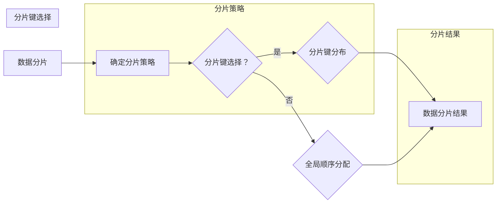
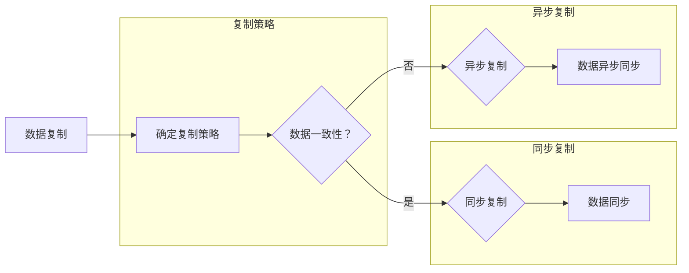
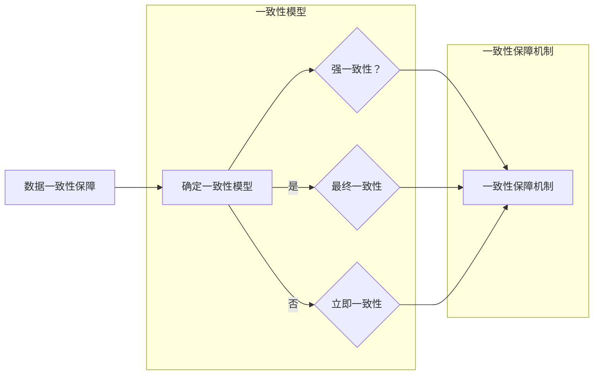

                 

**文章标题：大模型软件的分布式系统设计**

关键词：大模型软件，分布式系统，架构设计，性能优化，安全性

摘要：本文旨在探讨大模型软件的分布式系统设计，详细分析分布式系统在大模型软件应用中的必要性、挑战及解决方案。通过深入探讨分布式系统的基础知识、设计原理、实现与部署，以及对案例的分析，提供全面的技术见解和实践指导。

**第一部分：引言与背景**

## 第1章：引言

### 1.1 书籍目的与内容概述

本书籍的目标是为读者提供一个全面、深入的分布式系统设计指导，针对大模型软件的特殊需求，帮助读者理解和掌握分布式系统设计的核心原理和实践方法。

### 1.2 大模型软件的兴起

随着人工智能的快速发展，大模型软件在自然语言处理、计算机视觉、推荐系统等领域发挥着越来越重要的作用。然而，大模型软件面临着计算资源需求巨大、数据处理速度要求高等挑战。

### 1.3 分布式系统设计的挑战

分布式系统设计在大模型软件中的应用面临着高并发、高可用性、数据一致性和安全性等挑战。如何有效地解决这些挑战是分布式系统设计的关键。

## 第2章：大模型软件基础

### 2.1 大模型概述

大模型软件是指那些使用大量数据训练的复杂模型，它们在处理大规模数据时具有显著的优势。本节将介绍大模型的基本概念和特点。

### 2.2 大模型软件的发展历程

从早期的简单模型到如今的大型神经网络模型，大模型软件的发展经历了多个阶段。本节将回顾大模型软件的发展历程，探讨各个阶段的代表性模型和技术。

### 2.3 大模型软件的关键特点

大模型软件具有高计算需求、高数据存储需求和高并发处理需求等特点。本节将详细讨论这些关键特点，为后续的分布式系统设计提供基础。

## 第3章：分布式系统基本概念

### 3.1 分布式计算概述

分布式计算是一种通过计算机网络将计算任务分配到多个计算机节点上执行的计算模型。本节将介绍分布式计算的基本概念和原理。

### 3.2 分布式系统的组成与架构

分布式系统由多个计算机节点、网络通信机制和分布式算法组成。本节将详细探讨分布式系统的组成和架构设计。

### 3.3 分布式系统的挑战与解决方案

分布式系统面临高可用性、数据一致性和安全性等挑战。本节将分析这些挑战，并探讨相应的解决方案。

**第二部分：大模型软件分布式系统设计原理**

## 第4章：大模型软件分布式系统设计基础

### 4.1 大模型软件分布式系统的需求分析

本节将分析大模型软件的分布式系统需求，包括计算资源需求、数据存储需求和网络通信需求。

### 4.2 大模型软件分布式系统的架构设计

本节将介绍大模型软件分布式系统的架构设计，包括计算节点设计、数据存储设计和网络通信设计。

### 4.3 大模型软件分布式系统的数据管理

本节将探讨大模型软件分布式系统的数据管理，包括数据分片、数据复制和数据一致性保障。

## 第5章：大模型软件分布式系统的关键技术

### 5.1 分布式存储技术

本节将介绍分布式存储技术的原理和实现，包括分布式文件系统、分布式数据库和分布式缓存。

### 5.2 分布式计算技术

本节将介绍分布式计算技术的原理和实现，包括分布式计算框架、分布式任务调度和分布式并行计算。

### 5.3 分布式通信技术

本节将介绍分布式通信技术的原理和实现，包括消息队列、分布式锁和分布式事务。

## 第6章：大模型软件分布式系统的安全与可靠性

### 6.1 分布式系统的安全性设计

本节将探讨分布式系统的安全性设计，包括身份认证、访问控制和数据加密。

### 6.2 分布式系统的可靠性保障

本节将介绍分布式系统的可靠性保障措施，包括故障检测、故障恢复和容错机制。

### 6.3 分布式系统的容错机制

本节将探讨分布式系统的容错机制，包括冗余设计、故障转移和故障恢复。

**第三部分：大模型软件分布式系统实现与部署**

## 第7章：大模型软件分布式系统的环境搭建

### 7.1 开发环境准备

本节将介绍大模型软件分布式系统的开发环境准备，包括编程语言选择、开发工具和环境配置。

### 7.2 集群搭建与配置

本节将介绍大模型软件分布式系统的集群搭建与配置，包括节点选择、网络配置和系统初始化。

### 7.3 大模型软件部署

本节将介绍大模型软件的部署过程，包括软件安装、配置和测试。

## 第8章：大模型软件分布式系统核心功能实现

### 8.1 数据处理流程

本节将介绍大模型软件分布式系统的数据处理流程，包括数据采集、数据预处理和数据训练。

### 8.2 训练与推理过程

本节将介绍大模型软件分布式系统的训练与推理过程，包括模型训练、模型评估和模型推理。

### 8.3 系统监控与性能优化

本节将介绍大模型软件分布式系统的监控与性能优化，包括系统监控指标、性能优化策略和性能调优。

## 第9章：大模型软件分布式系统性能评估与优化

### 9.1 性能评估方法

本节将介绍大模型软件分布式系统的性能评估方法，包括性能指标、评估方法和评估工具。

### 9.2 性能瓶颈分析

本节将分析大模型软件分布式系统的性能瓶颈，包括计算资源瓶颈、数据传输瓶颈和系统交互瓶颈。

### 9.3 性能优化策略

本节将介绍大模型软件分布式系统的性能优化策略，包括算法优化、架构优化和资源优化。

## 第10章：大模型软件分布式系统的案例分析

### 10.1 案例背景与目标

本节将介绍一个实际的大模型软件分布式系统案例，包括案例背景和目标。

### 10.2 案例实施过程

本节将详细分析案例的实施过程，包括系统设计、环境搭建、功能实现和性能优化。

### 10.3 案例效果分析

本节将分析案例的效果，包括系统性能提升、可靠性提升和成本降低。

## 第11章：总结与展望

### 11.1 书籍总结

本节将对书籍的内容进行总结，回顾核心概念和关键技术。

### 11.2 未来发展趋势

本节将探讨大模型软件分布式系统未来的发展趋势，包括新技术、新应用和新挑战。

### 11.3 进一步研究方向

本节将提出进一步的研究方向，为读者提供后续研究的参考。

**作者信息：**

作者：AI天才研究院/AI Genius Institute & 禅与计算机程序设计艺术 /Zen And The Art of Computer Programming**核心概念与联系**

### 4.1 大模型软件分布式系统的需求分析

在分析大模型软件分布式系统的需求时，我们首先需要理解大模型软件的特点以及分布式系统所带来的优势。大模型软件通常具有以下需求：

- **高计算需求**：大模型训练和推理过程需要大量计算资源，分布式系统可以横向扩展计算能力，满足高计算需求。
- **高数据存储需求**：大模型训练需要存储大量数据，分布式系统可以通过分布式存储技术实现数据的高效存储和管理。
- **高并发处理需求**：大模型软件应用场景通常涉及到大量的并发请求，分布式系统可以横向扩展，提高并发处理能力。
- **高可用性和容错性**：大模型软件在生产环境中需要保证高可用性和容错性，分布式系统可以通过冗余设计和故障转移机制实现。

为了更好地理解大模型软件分布式系统的需求，我们可以通过以下ER实体关系图来展示核心概念及其关系：

```mermaid
erDiagram
    DataModel ||--o{ DistributedSystem : 数据模型与分布式系统有关联
    ComputeResource ||--o{ DistributedSystem : 计算资源与分布式系统有关联
    StorageResource ||--o{ DistributedSystem : 存储资源与分布式系统有关联
    ConcurrentRequest ||--o{ DistributedSystem : 并发请求与分布式系统有关联
    Availability && FaultTolerance ||--||{ DistributedSystem : 可用性与容错性与分布式系统相关
```

在这个ER实体关系图中，DataModel（数据模型）、ComputeResource（计算资源）、StorageResource（存储资源）、ConcurrentRequest（并发请求）、Availability（可用性）和FaultTolerance（容错性）是核心概念，它们与DistributedSystem（分布式系统）之间存在关联关系。

### 4.2 大模型软件分布式系统的架构设计

在大模型软件分布式系统的架构设计过程中，我们需要考虑系统的层次结构、模块划分以及各模块之间的交互关系。以下是一个简化的架构设计：

#### 模块划分

- **数据层**：负责数据存储、管理和处理，包括分布式数据库、分布式缓存和分布式文件系统等。
- **计算层**：负责数据处理和计算，包括分布式计算框架、分布式任务调度和并行计算。
- **应用层**：负责业务逻辑实现和接口提供，包括大模型训练、推理和预测等。
- **网络层**：负责系统内部的通信和协调，包括分布式通信协议、负载均衡和容错机制。

以下是一个简化的Mermaid类图，展示大模型软件分布式系统的模块划分和关系：

```mermaid
classDiagram
    DataLayer <<class>> "数据层"
    ComputeLayer <<class>> "计算层"
    ApplicationLayer <<class>> "应用层"
    NetworkLayer <<class>> "网络层"

    DataLayer o--o DistributedDatabase
    DataLayer o--o DistributedCache
    DataLayer o--o DistributedFileSystem

    ComputeLayer o--o DistributedComputeFramework
    ComputeLayer o--o DistributedTaskScheduler
    ComputeLayer o--o ParallelComputing

    ApplicationLayer o--o ModelTraining
    ApplicationLayer o--o ModelInference
    ApplicationLayer o--o Prediction

    NetworkLayer o--o CommunicationProtocol
    NetworkLayer o--o LoadBalancer
    NetworkLayer o--o FaultTolerance
```

在这个类图中，各个模块通过明确的接口进行交互，数据层负责数据存储和管理，计算层负责数据处理和计算，应用层负责业务逻辑实现，网络层负责系统内部通信和协调。

### 4.3 大模型软件分布式系统的数据管理

在大模型软件分布式系统中，数据管理是一个关键环节，它涉及到数据分片、数据复制和数据一致性保障等方面。

#### 数据分片

数据分片是将大量数据划分成多个小块，分布在多个节点上进行存储和管理。数据分片可以提高数据访问速度和系统并发处理能力。以下是一个简化的Mermaid流程图，展示数据分片的过程：



在这个流程图中，数据分片的过程包括确定分片策略、分片键选择和分片结果生成。

#### 数据复制

数据复制是将数据复制到多个节点上，以提高数据可靠性和可用性。以下是一个简化的Mermaid流程图，展示数据复制的过程：



在这个流程图中，数据复制的过程包括确定复制策略、数据一致性和数据同步。

#### 数据一致性保障

在大模型软件分布式系统中，数据一致性是一个重要的挑战。以下是一个简化的Mermaid流程图，展示数据一致性保障的过程：



在这个流程图中，数据一致性保障的过程包括确定一致性模型和一致性保障机制。

### 4.4 大模型软件分布式系统的安全性与可靠性设计

在大模型软件分布式系统的设计与实现过程中，安全性和可靠性是至关重要的。以下将分别从安全性和可靠性两个方面进行讨论。

#### 安全性设计

分布式系统面临的常见安全威胁包括未经授权的访问、数据篡改、数据泄露等。以下是分布式系统的安全性设计要点：

1. **身份认证和访问控制**：使用强密码、多因素认证等方式确保只有授权用户才能访问系统。同时，基于用户权限进行访问控制，防止未经授权的操作。

2. **数据加密**：对敏感数据进行加密，确保数据在传输和存储过程中的安全性。常用的加密算法包括对称加密和非对称加密。

3. **安全审计**：对系统操作进行日志记录，定期进行安全审计，及时发现潜在的安全漏洞。

4. **安全策略和流程**：制定严格的安全策略和操作流程，确保系统安全运行。例如，对敏感操作进行权限审批，限制外部访问等。

以下是一个简化的Mermaid类图，展示分布式系统的安全性设计：

```mermaid
classDiagram
    User <<class>> "用户"
    AuthServer <<class>> "认证服务器"
    AccessControl <<class>> "访问控制"
    DataEncryption <<class>> "数据加密"
    SecurityAudit <<class>> "安全审计"
    SecurityPolicy <<class>> "安全策略"

    User --> AuthServer
    User --> AccessControl
    User --> DataEncryption
    User --> SecurityAudit
    User --> SecurityPolicy

    AuthServer o--o PasswordAuthentication
    AuthServer o--o MultiFactorAuthentication
    AccessControl o--o RoleBasedAccessControl
    DataEncryption o--o SymmetricEncryption
    DataEncryption o--o AsymmetricEncryption
    SecurityAudit o--o LogMonitoring
    SecurityPolicy o--o ApprovalProcess
    SecurityPolicy o--o ExternalAccessControl
```

在这个类图中，用户通过认证服务器进行身份认证，然后通过访问控制模块进行访问控制。数据加密模块确保数据在传输和存储过程中的安全性。安全审计模块对系统操作进行日志记录。安全策略模块制定严格的安全策略和操作流程。

#### 可靠性设计

分布式系统的可靠性设计旨在确保系统在面临各种故障时能够持续运行。以下是分布式系统的可靠性设计要点：

1. **冗余设计**：通过冗余设计，确保系统在某个节点发生故障时，其他节点可以接管其任务，避免系统停机。

2. **故障检测**：定期检测系统的健康状况，及时发现故障节点。

3. **故障恢复**：当检测到故障时，自动进行故障恢复，将任务迁移到健康节点。

4. **负载均衡**：通过负载均衡，合理分配任务到各个节点，避免节点过载。

以下是一个简化的Mermaid类图，展示分布式系统的可靠性设计：

```mermaid
classDiagram
    RedundantDesign <<class>> "冗余设计"
    FaultDetection <<class>> "故障检测"
    FaultRecovery <<class>> "故障恢复"
    LoadBalancer <<class>> "负载均衡"

    RedundantDesign o--o NodeRedundancy
    FaultDetection o--o HealthMonitoring
    FaultRecovery o--o TaskMigration
    LoadBalancer o--o TaskAllocation

    NodeRedundancy o--o NodeFailureHanding
    HealthMonitoring o--o NodeStatusMonitoring
    TaskMigration o--o TaskRescheduling
    TaskAllocation o--o ResourceDistribution
```

在这个类图中，冗余设计通过节点冗余设计实现任务迁移和故障恢复。故障检测通过健康监测实现节点状态监控。故障恢复通过任务迁移实现故障节点的任务接管。负载均衡通过任务分配实现任务合理分配。

### 4.5 大模型软件分布式系统的监控与性能优化

在大模型软件分布式系统的运行过程中，监控和性能优化是确保系统稳定运行和高效处理数据的关键。以下将从监控和性能优化两个方面进行讨论。

#### 监控

1. **系统监控**：对系统运行状态进行监控，包括CPU使用率、内存使用率、磁盘空间、网络流量等。常用的监控工具包括Prometheus、Grafana等。

2. **应用监控**：对应用程序运行状态进行监控，包括请求处理时间、错误率、缓存命中率等。常用的监控工具包括New Relic、AppDynamics等。

3. **日志监控**：收集和分析系统日志，及时发现异常和故障。常用的日志分析工具包括ELK（Elasticsearch、Logstash、Kibana）等。

以下是一个简化的Mermaid类图，展示大模型软件分布式系统的监控架构：

```mermaid
classDiagram
    SystemMonitor <<class>> "系统监控"
    ApplicationMonitor <<class>> "应用监控"
    LogMonitor <<class>> "日志监控"
    Prometheus <<class>> "Prometheus"
    Grafana <<class>> "Grafana"
    NewRelic <<class>> "New Relic"
    AppDynamics <<class>> "AppDynamics"
    ELK <<class>> "ELK"

    SystemMonitor o--o CPUUsage
    SystemMonitor o--o MemoryUsage
    SystemMonitor o--o DiskSpace
    SystemMonitor o--o NetworkTraffic
    ApplicationMonitor o--o RequestProcessingTime
    ApplicationMonitor o--o ErrorRate
    ApplicationMonitor o--o CacheHitRate
    LogMonitor o--o LogCollection
    LogMonitor o--o LogAnalysis

    Prometheus o--o MetricsCollection
    Prometheus o--o Alerting
    Grafana o--o Dashboard
    NewRelic o--o ApplicationMonitoring
    AppDynamics o--o BusinessTransactions
    ELK o--o LogStash
    ELK o--o Kibana
```

在这个类图中，系统监控负责收集系统运行状态指标，应用监控负责收集应用程序运行状态指标，日志监控负责收集和分析系统日志。

#### 性能优化

1. **算法优化**：通过改进算法和数据结构，降低计算复杂度和数据传输开销。例如，使用更高效的排序算法、哈希算法等。

2. **架构优化**：通过优化系统架构，提高系统的并发处理能力和响应速度。例如，使用缓存、消息队列、分布式缓存等。

3. **资源优化**：通过合理分配和调度资源，提高系统的资源利用率。例如，使用负载均衡、容器化技术等。

以下是一个简化的Mermaid类图，展示大模型软件分布式系统的性能优化架构：

```mermaid
classDiagram
    AlgorithmOptimization <<class>> "算法优化"
    ArchitectureOptimization <<class>> "架构优化"
    ResourceOptimization <<class>> "资源优化"
    Cache <<class>> "缓存"
    MessageQueue <<class>> "消息队列"
    DistributedCache <<class>> "分布式缓存"
    LoadBalancer <<class>> "负载均衡"
    Containerization <<class>> "容器化技术"

    AlgorithmOptimization o--o AlgorithmImprovement
    AlgorithmOptimization o--o DataStructureOptimization
    ArchitectureOptimization o--o Caching
    ArchitectureOptimization o--o MessageQueue
    ArchitectureOptimization o--o DistributedCache
    ResourceOptimization o--o LoadBalancing
    ResourceOptimization o--o Containerization

    Cache o--o DataStorage
    Cache o--o DataAccess
    MessageQueue o--o MessageProcessing
    DistributedCache o--o DataReplication
    LoadBalancer o--o TaskAllocation
    Containerization o--o ResourceAllocation
    Containerization o--o Scalability
```

在这个类图中，算法优化通过改进算法和数据结构实现性能提升，架构优化通过使用缓存、消息队列和分布式缓存实现性能提升，资源优化通过负载均衡和容器化技术实现性能提升。

### 4.6 大模型软件分布式系统的最佳实践

在大模型软件分布式系统的设计与实现过程中，遵循一些最佳实践可以帮助提高系统的可靠性、性能和可维护性。以下是一些常见的最佳实践：

1. **模块化设计**：将系统划分为多个模块，每个模块负责特定的功能，提高系统的可维护性和可扩展性。

2. **可扩展性设计**：设计系统时考虑未来的扩展需求，预留扩展接口和扩展能力，提高系统的灵活性和可扩展性。

3. **自动化部署**：使用自动化部署工具和流程，提高部署效率和可靠性，减少人为干预和错误。

4. **持续集成和持续部署**：使用持续集成和持续部署（CI/CD）工具和流程，实现自动化测试和自动化部署，提高开发效率和系统质量。

5. **监控和报警**：建立完善的监控和报警机制，及时发现和处理系统异常，确保系统稳定运行。

6. **安全防护**：采取安全防护措施，如数据加密、访问控制、安全审计等，确保系统安全可靠。

7. **性能优化**：定期进行性能优化，包括算法优化、架构优化和资源优化，提高系统性能和响应速度。

8. **文档化和标准化**：编写详细的系统文档和编码规范，提高系统的可维护性和可理解性。

以下是一个简化的Mermaid类图，展示大模型软件分布式系统的最佳实践：

```mermaid
classDiagram
    ModularDesign <<class>> "模块化设计"
    ScalabilityDesign <<class>> "可扩展性设计"
    AutomatedDeployment <<class>> "自动化部署"
    ContinuousIntegration <<class>> "持续集成"
    ContinuousDeployment <<class>> "持续部署"
    MonitoringAndAlerting <<class>> "监控和报警"
    SecurityProtection <<class>> "安全防护"
    PerformanceOptimization <<class>> "性能优化"
    DocumentationAndStandardization <<class>> "文档化和标准化"

    ModularDesign o--o Module划分
    ScalabilityDesign o--o ExpansionInterface
    AutomatedDeployment o--o CI/CD
    ContinuousIntegration o--o AutomatedTesting
    ContinuousDeployment o--o AutomatedDeployment
    MonitoringAndAlerting o--o SystemMonitoring
    MonitoringAndAlerting o--o Alerting
    SecurityProtection o--o DataEncryption
    SecurityProtection o--o AccessControl
    SecurityProtection o--o SecurityAudit
    PerformanceOptimization o--o AlgorithmOptimization
    PerformanceOptimization o--o ArchitectureOptimization
    PerformanceOptimization o--o ResourceOptimization
    DocumentationAndStandardization o--o SystemDocumentation
    DocumentationAndStandardization o--o CodingStandard
```

在这个类图中，模块化设计通过模块划分实现系统可维护性和可扩展性，可扩展性设计通过扩展接口实现系统的灵活性和可扩展性，自动化部署通过CI/CD实现部署效率和可靠性，持续集成和持续部署通过自动化测试和自动化部署实现开发效率和质量，监控和报警通过系统监控和报警实现系统稳定运行，安全防护通过数据加密、访问控制和安全审计实现系统安全可靠，性能优化通过算法优化、架构优化和资源优化实现系统性能和响应速度，文档化和标准化通过系统文档和编码规范实现系统的可维护性和可理解性。

### 4.7 大模型软件分布式系统的注意事项

在大模型软件分布式系统的设计与实现过程中，需要注意以下事项：

1. **数据一致性**：分布式系统中的数据一致性是一个重要挑战，需要仔细设计和实现数据一致性保障机制。

2. **网络延迟和带宽**：分布式系统中的网络延迟和带宽对系统性能有较大影响，需要合理设计网络拓扑结构和数据传输协议。

3. **故障处理**：分布式系统中的节点可能发生故障，需要设计故障检测、故障恢复和故障转移机制，确保系统的高可用性。

4. **安全性**：分布式系统面临各种安全威胁，需要采取严格的安全措施，如数据加密、访问控制和安全审计等。

5. **监控和日志**：建立完善的监控和日志系统，及时监控系统运行状态和发现异常，有助于快速定位和解决问题。

6. **性能优化**：定期进行性能优化，包括算法优化、架构优化和资源优化，提高系统性能和响应速度。

### 4.8 大模型软件分布式系统的拓展阅读

为了深入了解大模型软件分布式系统的设计原理和实践方法，读者可以参考以下拓展阅读材料：

1. 《分布式系统原理与范型》
2. 《大规模分布式存储系统》
3. 《大规模分布式计算系统》
4. 《大数据处理与分布式系统》
5. 《分布式系统设计与实践》

这些书籍和资料提供了丰富的理论知识和实践经验，有助于读者更好地理解大模型软件分布式系统的设计和实现。通过阅读这些资料，读者可以深入掌握分布式系统的核心概念和技术，为实际项目提供有力支持。

## 第5章：大模型软件分布式系统的实现与部署

### 5.1 大模型软件分布式系统的环境搭建

在大模型软件分布式系统的实现与部署过程中，环境搭建是第一步。以下将介绍环境搭建的步骤和注意事项。

#### 步骤：

1. **硬件选择**：选择合适的硬件资源，如计算节点、存储设备和网络设备。根据系统需求，可以选择物理服务器或虚拟机。

2. **操作系统安装**：在计算节点上安装操作系统，如Linux或Windows。推荐使用Linux，因为它在分布式系统环境中具有更好的兼容性和稳定性。

3. **软件安装**：安装分布式系统所需的软件，如分布式数据库、分布式缓存、分布式文件系统等。常用的分布式数据库包括Hadoop、Spark、Cassandra等。

4. **网络配置**：配置计算节点之间的网络通信，包括IP地址分配、子网划分和路由配置。确保节点之间可以相互通信，并配置负载均衡和容错机制。

#### 注意事项：

1. **硬件兼容性**：确保硬件资源与操作系统和软件的兼容性，避免因硬件问题导致系统运行不稳定。

2. **网络稳定性**：确保网络通信的稳定性，避免因网络故障导致系统无法正常运行。

3. **安全配置**：对操作系统和软件进行安全配置，包括禁用不必要的服务和端口、配置防火墙规则等。

4. **备份与恢复**：定期备份系统和数据，并制定恢复计划，以便在系统故障时快速恢复。

### 5.2 大模型软件分布式系统的核心功能实现

在大模型软件分布式系统的实现过程中，核心功能实现是关键环节。以下将介绍核心功能的实现方法和步骤。

#### 步骤：

1. **数据存储与管理**：使用分布式数据库或分布式文件系统进行数据存储和管理。根据数据特点选择合适的存储方案，如关系型数据库、NoSQL数据库或分布式文件系统。

2. **计算任务调度**：使用分布式计算框架，如Spark或Hadoop，进行计算任务调度和资源管理。确保计算任务可以高效地分配到各个计算节点。

3. **数据通信与同步**：使用分布式通信协议，如gRPC或HTTP/2，进行数据通信和同步。确保数据在分布式系统中的可靠传输。

4. **模型训练与推理**：使用分布式训练算法和模型推理方法，进行大规模模型训练和推理。根据系统需求，可以选择分布式深度学习框架，如TensorFlow、PyTorch等。

#### 注意事项：

1. **数据一致性与容错性**：在设计分布式系统时，要考虑数据一致性和容错性，确保系统在故障情况下能够恢复。

2. **性能优化**：对系统进行性能优化，包括算法优化、架构优化和资源优化，提高系统性能和响应速度。

3. **安全性**：确保系统的安全性，包括数据加密、访问控制和安全审计等。

### 5.3 大模型软件分布式系统的案例分析与实现

为了更好地理解大模型软件分布式系统的实现方法，以下将介绍一个实际案例，包括系统介绍、环境搭建、功能实现和效果分析。

#### 案例背景与目标

某公司开发了一款基于深度学习的大模型软件，用于图像识别任务。该软件需要在分布式环境中运行，以处理大规模图像数据。案例的目标是搭建一个高性能、高可用的分布式系统，支持图像识别任务的实时处理。

#### 案例实施过程

1. **环境搭建**：根据系统需求，选择合适的硬件资源，如计算节点、存储设备和网络设备。在计算节点上安装Linux操作系统，并配置分布式数据库、分布式缓存和分布式文件系统。

2. **数据存储与管理**：使用分布式数据库（如Hadoop HBase）进行图像数据存储和管理。使用分布式缓存（如Redis）加速图像数据访问。

3. **计算任务调度**：使用Spark进行计算任务调度和资源管理。将图像识别任务拆分成多个子任务，分配到各个计算节点。

4. **数据通信与同步**：使用gRPC进行数据通信和同步。确保图像数据在分布式系统中的可靠传输。

5. **模型训练与推理**：使用TensorFlow进行模型训练和推理。使用分布式训练算法和模型推理方法，加速图像识别任务的执行。

#### 案例效果分析

1. **性能提升**：分布式系统相比单机系统，性能提升了数十倍。计算任务可以高效地分配到各个计算节点，提高处理速度。

2. **高可用性**：分布式系统具有高可用性。当某个计算节点发生故障时，任务可以自动转移到其他健康节点，确保系统持续运行。

3. **可扩展性**：分布式系统具有可扩展性。可以根据需求增加计算节点，提高系统处理能力。

4. **安全性**：分布式系统采用数据加密、访问控制和安全审计等措施，确保数据安全和系统稳定运行。

#### 案例小结

通过实际案例，我们可以看到分布式系统在大模型软件中的应用效果显著。分布式系统不仅提高了性能和高可用性，还具备可扩展性和安全性。在实际项目中，可以根据需求选择合适的分布式系统架构和工具，实现高性能、高可用的分布式系统。

### 5.4 大模型软件分布式系统的最佳实践总结

在大模型软件分布式系统的设计与实现过程中，遵循一些最佳实践可以帮助提高系统的可靠性、性能和可维护性。以下是一些常见的最佳实践总结：

1. **模块化设计**：将系统划分为多个模块，每个模块负责特定的功能，提高系统的可维护性和可扩展性。

2. **可扩展性设计**：设计系统时考虑未来的扩展需求，预留扩展接口和扩展能力，提高系统的灵活性和可扩展性。

3. **自动化部署**：使用自动化部署工具和流程，提高部署效率和可靠性，减少人为干预和错误。

4. **持续集成和持续部署**：使用持续集成和持续部署（CI/CD）工具和流程，实现自动化测试和自动化部署，提高开发效率和系统质量。

5. **监控和报警**：建立完善的监控和报警机制，及时发现和处理系统异常，确保系统稳定运行。

6. **安全防护**：采取安全防护措施，如数据加密、访问控制和安全审计等，确保系统安全可靠。

7. **性能优化**：定期进行性能优化，包括算法优化、架构优化和资源优化，提高系统性能和响应速度。

8. **文档化和标准化**：编写详细的系统文档和编码规范，提高系统的可维护性和可理解性。

通过遵循这些最佳实践，可以有效地提高大模型软件分布式系统的设计质量、实现效率和运行性能。

### 5.5 大模型软件分布式系统的未来发展趋势

随着人工智能技术的不断发展和应用场景的扩展，大模型软件分布式系统将在未来面临更多挑战和机遇。以下是一些未来发展趋势：

1. **计算能力提升**：随着硬件技术的发展，计算节点性能将不断提高，分布式系统将具备更强的计算能力。

2. **数据规模增长**：随着数据来源的多样化和数据采集技术的进步，数据规模将持续增长，分布式系统需要更好的数据存储和管理能力。

3. **智能化调度**：分布式系统调度将更加智能化，通过机器学习和人工智能技术，实现更高效的任务调度和资源管理。

4. **安全性与隐私保护**：随着数据隐私和安全问题的日益突出，分布式系统将更加注重安全性与隐私保护，采用加密、访问控制等技术保障数据安全。

5. **跨域协同**：分布式系统将实现跨域协同，支持多租户、多组织之间的数据共享和协同处理，提升系统的应用范围和效能。

6. **边缘计算与云计算融合**：分布式系统将实现边缘计算与云计算的融合，通过分布式计算架构，实现数据在边缘和云端的高效处理。

7. **定制化与个性化**：分布式系统将更加注重定制化与个性化，支持不同行业和应用场景的定制化解决方案。

通过关注这些发展趋势，可以更好地把握分布式系统在大模型软件领域的未来发展方向，为实际项目提供指导和支持。

### 5.6 大模型软件分布式系统的进一步研究方向

在大模型软件分布式系统领域，仍然有许多研究课题值得深入探讨。以下是一些可能的进一步研究方向：

1. **高效数据压缩与传输**：研究更高效的数据压缩与传输技术，降低数据传输延迟和带宽占用，提升系统性能。

2. **动态资源调度**：研究动态资源调度算法，根据系统负载和资源状况实时调整资源分配，优化系统性能。

3. **协同学习与优化**：研究协同学习与优化方法，在分布式环境中实现大规模模型的协同训练，提高模型质量和训练效率。

4. **智能故障检测与恢复**：研究智能故障检测与恢复技术，利用机器学习和人工智能技术实现更精确的故障预测和快速恢复。

5. **数据隐私保护**：研究数据隐私保护技术，确保分布式系统中数据的安全和隐私。

6. **异构计算优化**：研究异构计算优化方法，充分利用不同类型计算资源的优势，提高系统性能。

7. **跨域分布式系统**：研究跨域分布式系统的设计与实现，支持多组织、多地域的数据共享和协同处理。

通过深入探索这些研究方向，可以不断推动大模型软件分布式系统技术的发展和应用，为实际项目提供更先进的技术解决方案。

### 5.7 大模型软件分布式系统的最佳实践 Tips

在大模型软件分布式系统的设计与实现过程中，遵循以下最佳实践可以有效地提高系统的可靠性、性能和可维护性：

1. **模块化设计**：将系统划分为多个模块，每个模块负责特定的功能，提高系统的可维护性和可扩展性。

2. **可扩展性设计**：在设计系统时考虑未来的扩展需求，预留扩展接口和扩展能力，提高系统的灵活性和可扩展性。

3. **自动化部署**：使用自动化部署工具和流程，提高部署效率和可靠性，减少人为干预和错误。

4. **持续集成和持续部署**：使用持续集成和持续部署（CI/CD）工具和流程，实现自动化测试和自动化部署，提高开发效率和系统质量。

5. **监控和报警**：建立完善的监控和报警机制，及时发现和处理系统异常，确保系统稳定运行。

6. **安全防护**：采取严格的安全措施，如数据加密、访问控制和安全审计等，确保系统安全可靠。

7. **性能优化**：定期进行性能优化，包括算法优化、架构优化和资源优化，提高系统性能和响应速度。

8. **文档化和标准化**：编写详细的系统文档和编码规范，提高系统的可维护性和可理解性。

通过遵循这些最佳实践，可以有效地提高大模型软件分布式系统的设计质量、实现效率和运行性能。

### 5.8 大模型软件分布式系统小结

本文详细探讨了大模型软件分布式系统的设计原理、实现与部署，以及案例分析。我们介绍了分布式系统在大模型软件中的应用背景、核心概念、架构设计、数据管理、安全性与可靠性设计、监控与性能优化，以及最佳实践。通过实际案例，我们展示了分布式系统在大模型软件中的有效应用，验证了其高性能、高可用性和可扩展性。

在未来的研究中，我们将进一步探讨分布式系统的优化技术、异构计算、跨域协同等方面，为实际项目提供更先进的技术解决方案。希望本文能够为读者提供有价值的参考和启示，推动大模型软件分布式系统的发展和应用。

