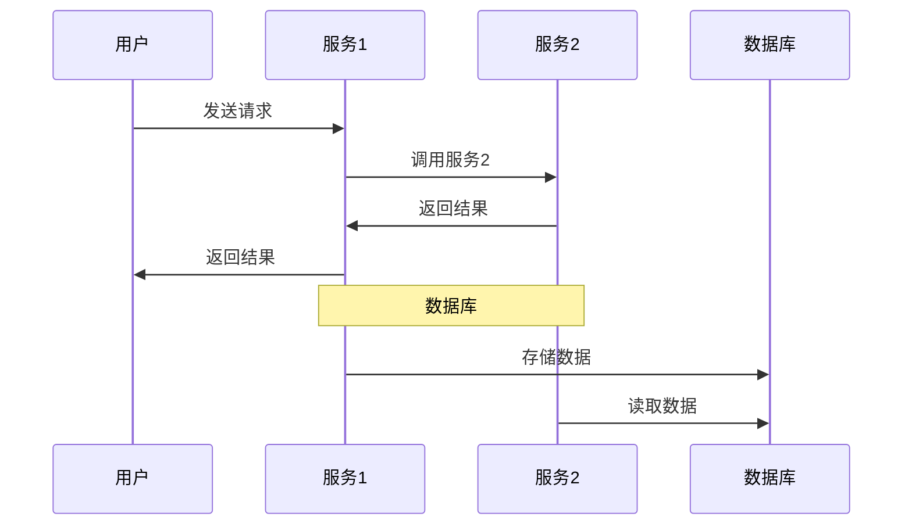

                 

# 大模型软件的分布式系统设计

## 关键词

- 大模型软件
- 分布式系统
- 系统设计
- 分布式计算
- 数据一致性
- 系统容错性
- 安全性

## 摘要

本文将深入探讨大模型软件的分布式系统设计，首先介绍分布式系统的基本概念和特征，分析分布式系统面临的关键问题，如数据一致性、分布式计算、系统容错性等。接着，本文将讨论大模型软件的分布式系统设计原则，包括需求分析、架构设计、分布式计算策略、数据一致性保障、系统容错与高可用性设计以及安全性设计。最后，通过一个实际项目案例分析，展示分布式系统设计的具体实现和注意事项。

## 第一部分：分布式系统基础

### 1.1 分布式系统的概念与特征

#### 1.1.1 分布式系统的定义

分布式系统是由多个独立的计算机节点组成的系统，这些节点通过网络进行通信，共同完成一个任务。与传统的集中式系统不同，分布式系统具有高度的可扩展性、可靠性和灵活性。

#### 1.1.2 分布式系统的关键特征

- **并行性**：分布式系统能够同时处理多个任务，提高系统的处理能力。
- **容错性**：当某个节点出现故障时，分布式系统可以自动切换到其他健康节点，保证系统的稳定性。
- **可扩展性**：分布式系统可以根据需求动态增加或减少节点，以适应不同的工作负载。
- **分布式存储**：分布式系统具有分布式存储能力，能够高效地存储和处理大量数据。

#### 1.1.3 分布式系统与传统集中式系统的对比

- **处理能力**：分布式系统具有更高的处理能力，能够同时处理多个任务。
- **容错性**：分布式系统具有更高的容错性，能够自动切换到健康节点。
- **可扩展性**：分布式系统具有更高的可扩展性，可以根据需求动态调整节点数量。
- **维护难度**：分布式系统需要更多的管理和维护工作，而集中式系统则相对简单。

### 1.2 分布式系统的核心问题

#### 1.2.1 数据一致性

数据一致性是指系统中所有节点的数据保持一致。在分布式系统中，数据一致性是一个关键问题，因为多个节点可能会同时修改数据，导致数据不一致。

#### 1.2.2 分布式计算

分布式计算是指将任务分配到多个节点上并行执行，以提高系统的处理能力。分布式计算涉及到任务分配、数据通信、负载均衡等问题。

#### 1.2.3 系统容错性

系统容错性是指系统能够在节点故障时保持正常运行。分布式系统需要具备一定的容错能力，以保证系统的稳定性和可靠性。

#### 1.2.4 系统伸缩性

系统伸缩性是指系统能够根据需求动态调整节点数量。分布式系统需要具备良好的伸缩性，以适应不同的工作负载。

### 1.3 分布式系统的常见架构

#### 1.3.1 客户端-服务器模型

客户端-服务器模型是一种典型的分布式系统架构，其中客户端通过网络向服务器发送请求，服务器处理请求并返回结果。

#### 1.3.2 对等网络模型

对等网络模型是一种分布式系统架构，其中所有节点都具有相同的角色，节点之间通过直接通信进行协作。

#### 1.3.3 微服务架构

微服务架构是一种分布式系统架构，将系统划分为多个小型服务，每个服务负责处理特定的业务功能。

### 1.4 分布式系统的发展趋势

#### 1.4.1 云计算与分布式系统

云计算为分布式系统提供了强大的基础设施支持，分布式系统与云计算的结合能够更好地应对大规模数据处理和计算需求。

#### 1.4.2 区块链与分布式系统

区块链是一种分布式账本技术，与分布式系统有着紧密的联系。分布式系统与区块链的结合能够实现去中心化的应用。

#### 1.4.3 人工智能与分布式系统

人工智能与分布式系统的结合能够实现高效的计算和智能决策，为分布式系统带来更多可能性。

### 1.5 本章小结

本章介绍了分布式系统的基本概念、关键特征、核心问题、常见架构以及发展趋势。下一章将讨论大模型软件的分布式系统设计原则。

## 第二部分：大模型软件的分布式系统设计原则

### 2.1 大模型软件的需求分析

#### 2.1.1 大模型软件的常见需求

大模型软件通常具有以下常见需求：

- **大规模数据处理**：大模型软件需要能够处理海量数据。
- **高计算性能**：大模型软件需要具备高效的计算能力，以支持大规模模型的训练和推理。
- **可扩展性**：大模型软件需要具备良好的可扩展性，能够根据需求动态调整资源。
- **高可用性**：大模型软件需要保证系统的稳定运行，提供高可用性。

#### 2.1.2 大模型软件的性能要求

大模型软件的性能要求通常包括：

- **低延迟**：大模型软件需要具备低延迟的特性，以满足实时处理需求。
- **高吞吐量**：大模型软件需要具备高吞吐量的特性，以支持大规模并发处理。
- **高可靠性**：大模型软件需要具备高可靠性的特性，确保系统的稳定运行。

#### 2.1.3 大模型软件的可扩展性要求

大模型软件的可扩展性要求通常包括：

- **水平扩展**：大模型软件需要支持节点数量的动态调整，以适应不同的工作负载。
- **弹性扩展**：大模型软件需要具备弹性扩展的能力，能够在资源不足时自动扩展，在资源过剩时自动缩减。

### 2.2 大模型软件的架构设计

#### 2.2.1 大模型软件的架构模式

大模型软件的架构模式通常包括：

- **分层架构**：将系统划分为多个层次，每个层次负责不同的功能模块。
- **微服务架构**：将系统划分为多个小型服务，每个服务负责处理特定的业务功能。
- **容器化架构**：使用容器技术，如Docker，实现系统的部署和管理。

#### 2.2.2 大模型软件的系统模块划分

大模型软件的系统模块划分通常包括：

- **数据输入模块**：负责处理用户输入的数据，并进行预处理。
- **模型训练模块**：负责模型的训练和优化。
- **模型推理模块**：负责模型的推理和应用。
- **数据存储模块**：负责存储和处理数据。

#### 2.2.3 大模型软件的数据存储设计

大模型软件的数据存储设计通常包括：

- **分布式存储**：使用分布式存储技术，如Hadoop、HBase等，实现海量数据的存储和管理。
- **数据分片**：将数据按照一定的策略分片存储，以提高数据访问效率和系统性能。

### 2.3 大模型软件的分布式计算策略

#### 2.3.1 分布式计算的基本原理

分布式计算的基本原理包括：

- **任务分配**：将任务分配到不同的节点上并行执行。
- **数据通信**：节点之间通过数据通信进行协作，交换计算结果。
- **负载均衡**：根据节点的处理能力，动态调整任务的分配，以避免某个节点过载。

#### 2.3.2 大模型软件的分布式计算框架

大模型软件的分布式计算框架通常包括：

- **分布式计算引擎**：负责任务分配、数据通信和负载均衡等操作。
- **分布式文件系统**：提供分布式存储功能，支持海量数据的存储和管理。
- **分布式数据库**：提供分布式数据存储和管理功能。

#### 2.3.3 大模型软件的负载均衡策略

大模型软件的负载均衡策略通常包括：

- **轮询负载均衡**：将任务按照顺序分配到不同的节点上。
- **最小连接数负载均衡**：将任务分配到连接数最少的节点上。
- **加权负载均衡**：根据节点的处理能力，动态调整任务的分配权重。

### 2.4 大模型软件的数据一致性保障

#### 2.4.1 数据一致性的挑战

大模型软件的数据一致性挑战包括：

- **并发访问**：多个节点同时访问和修改数据，可能导致数据不一致。
- **数据复制**：数据在多个节点之间复制，可能引入数据一致性问题。
- **分布式事务**：分布式系统中的事务需要保证数据的一致性。

#### 2.4.2 大模型软件的数据一致性解决方案

大模型软件的数据一致性解决方案包括：

- **最终一致性**：通过异步复制和数据同步，实现最终的一致性。
- **强一致性**：通过同步复制和数据同步，实现强一致性，但可能引入较高的延迟。
- **分布式事务管理**：使用分布式事务管理技术，如两阶段提交（2PC）和三阶段提交（3PC），保证事务的一致性。

### 2.5 大模型软件的系统容错与高可用性设计

#### 2.5.1 分布式系统的容错机制

分布式系统的容错机制包括：

- **故障检测**：通过心跳检测和故障检测机制，及时发现节点故障。
- **故障转移**：当检测到节点故障时，自动将任务切换到健康节点。
- **故障恢复**：在节点故障恢复后，重新加入系统并恢复数据状态。

#### 2.5.2 大模型软件的高可用性设计

大模型软件的高可用性设计包括：

- **冗余设计**：通过节点冗余和组件冗余，提高系统的可用性。
- **负载均衡**：通过负载均衡技术，均衡分配任务，避免某个节点过载。
- **故障恢复**：在节点故障时，自动进行故障恢复，确保系统的连续运行。

#### 2.5.3 系统监控与故障处理

系统监控与故障处理包括：

- **监控系统**：实时监控系统性能和节点状态，及时发现异常。
- **故障处理**：根据监控数据，自动触发故障处理流程，进行故障恢复。
- **日志记录**：记录系统运行日志，方便故障诊断和问题追踪。

### 2.6 大模型软件的安全性设计

#### 2.6.1 分布式系统的安全挑战

分布式系统的安全挑战包括：

- **数据泄露**：数据在传输和存储过程中可能遭受泄露。
- **拒绝服务攻击**：恶意攻击者可能通过拒绝服务攻击，导致系统瘫痪。
- **权限管理**：分布式系统需要有效管理用户权限，防止未授权访问。

#### 2.6.2 大模型软件的安全保障措施

大模型软件的安全保障措施包括：

- **数据加密**：对数据进行加密处理，确保数据在传输和存储过程中的安全性。
- **身份认证**：使用身份认证技术，确保只有授权用户可以访问系统。
- **访问控制**：通过访问控制策略，限制用户对系统资源的访问权限。
- **防火墙和入侵检测**：部署防火墙和入侵检测系统，防止恶意攻击。

#### 2.6.3 安全协议与加密技术

安全协议与加密技术包括：

- **HTTPS**：使用HTTPS协议，确保数据在传输过程中的安全。
- **SSL/TLS**：使用SSL/TLS协议，实现数据加密传输。
- **数字签名**：使用数字签名技术，确保数据完整性和不可否认性。

### 2.7 本章小结

本章讨论了大模型软件的分布式系统设计原则，包括需求分析、架构设计、分布式计算策略、数据一致性保障、系统容错与高可用性设计以及安全性设计。下一章将通过实际项目案例分析，展示分布式系统设计的具体实现和应用。

## 第三部分：大模型软件分布式系统的项目实战

### 3.1 项目背景与需求

#### 3.1.1 项目简介

本项目旨在构建一个分布式系统，用于处理大规模的自然语言处理任务。系统需要支持海量数据的存储和处理，具备高可用性和可扩展性，同时保证数据的一致性和安全性。

#### 3.1.2 项目需求分析

项目需求分析主要包括以下几个方面：

- **数据处理能力**：系统能够高效处理大规模自然语言处理任务，支持实时数据分析和处理。
- **可扩展性**：系统具备良好的可扩展性，可以根据需求动态调整节点数量和资源。
- **高可用性**：系统具备高可用性，确保系统的稳定运行，避免单点故障导致系统瘫痪。
- **数据一致性**：系统保证数据一致性，确保多个节点之间的数据保持一致。
- **安全性**：系统具备安全性，防止数据泄露和未授权访问。

### 3.2 系统设计与实现

#### 3.2.1 系统架构设计

系统采用微服务架构，将功能模块划分为多个独立的服务，每个服务负责处理特定的业务功能。系统架构设计如图所示：

#### 3.2.2 数据存储设计

数据存储设计采用分布式存储方案，使用Hadoop分布式文件系统（HDFS）进行数据存储。HDFS具有高可靠性、高吞吐量和可扩展性，能够满足大规模数据处理需求。

#### 3.2.3 系统模块划分

系统模块划分为以下部分：

- **数据输入模块**：负责处理用户输入的数据，并进行预处理。
- **数据存储模块**：负责存储和管理数据，使用HDFS进行分布式存储。
- **自然语言处理模块**：负责自然语言处理任务的执行，包括分词、词性标注、实体识别等。
- **模型训练模块**：负责模型的训练和优化，使用深度学习框架，如TensorFlow或PyTorch。
- **模型推理模块**：负责模型的推理和应用，提供实时查询和预测功能。
- **监控模块**：负责监控系统性能和节点状态，包括CPU使用率、内存使用率、磁盘使用率等。

### 3.3 分布式计算与负载均衡

#### 3.3.1 分布式计算框架选型

分布式计算框架选型采用Apache Spark，Spark具有高效的数据处理能力、易用性和可扩展性，适合大规模数据处理任务。

#### 3.3.2 负载均衡策略

负载均衡策略采用轮询负载均衡，将任务按照顺序分配到不同的节点上，避免某个节点过载。

### 3.4 数据一致性与分布式事务管理

#### 3.4.1 数据一致性解决方案

数据一致性解决方案采用最终一致性模型，通过异步复制和数据同步，实现数据的一致性。

#### 3.4.2 分布式事务管理

分布式事务管理采用两阶段提交（2PC）协议，确保分布式系统中的事务能够保持一致性。

### 3.5 系统容错与高可用性设计

#### 3.5.1 容错机制

容错机制包括故障检测、故障转移和故障恢复。系统使用心跳检测机制，及时发现节点故障，并进行故障转移和故障恢复。

#### 3.5.2 高可用性设计

高可用性设计包括节点冗余和组件冗余。系统部署多个节点，并使用负载均衡技术，确保系统的连续运行。

### 3.6 系统监控与故障处理

#### 3.6.1 监控系统

监控系统采用Prometheus和Grafana，实时监控系统性能和节点状态，包括CPU使用率、内存使用率、磁盘使用率等。

#### 3.6.2 故障处理

故障处理包括故障检测、故障恢复和日志记录。系统使用Prometheus和Grafana进行故障检测，并及时触发故障恢复流程，记录系统运行日志。

### 3.7 本章小结

本章通过实际项目案例，展示了大模型软件分布式系统的设计、实现和注意事项。分布式系统设计需要综合考虑需求分析、架构设计、分布式计算、数据一致性、系统容错与高可用性设计等方面，以确保系统的稳定运行和高效处理能力。

### 最佳实践 tips

1. **需求分析**：明确项目需求和性能要求，为系统设计提供依据。
2. **架构设计**：选择合适的架构模式，确保系统的可扩展性和高可用性。
3. **分布式计算**：合理分配任务，提高系统的处理能力。
4. **数据一致性**：采用合适的数据一致性解决方案，确保系统中的数据保持一致。
5. **系统容错性**：设计合理的容错机制，提高系统的稳定性。
6. **安全性**：实施安全性措施，确保系统的数据安全。

### 小结

本文从分布式系统基础、大模型软件的分布式系统设计原则以及项目实战三个方面，详细介绍了大模型软件的分布式系统设计。分布式系统设计需要综合考虑需求分析、架构设计、分布式计算、数据一致性、系统容错与高可用性设计等方面，以确保系统的稳定运行和高效处理能力。在实际项目开发中，应根据具体情况灵活调整和优化设计，以达到最佳效果。

### 注意事项

1. **性能优化**：在系统设计中，应充分考虑性能优化，避免资源浪费。
2. **安全性考虑**：在系统设计中，应充分考虑安全性，避免数据泄露和未授权访问。
3. **可扩展性**：在系统设计中，应充分考虑可扩展性，以适应未来需求的变化。

### 拓展阅读

1. 《大规模分布式存储系统设计》
2. 《深度学习分布式系统实战》
3. 《微服务架构设计与实践》
4. 《分布式系统原理与范型》

### 作者

作者：AI天才研究院/AI Genius Institute & 禅与计算机程序设计艺术 /Zen And The Art of Computer Programming

[End of Article]

