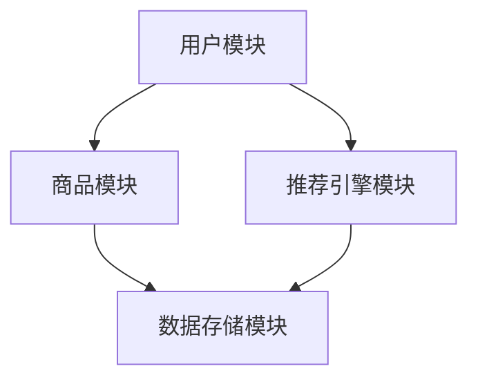

                 

**# 大模型软件的可扩展性架构设计**

## **关键词：大模型软件、可扩展性、架构设计、性能优化、安全性**

## **摘要：**

大模型软件作为现代人工智能领域的核心技术，其可扩展性架构设计对于系统的稳定性和高效性至关重要。本文从背景介绍、核心概念解析、架构设计原则、系统架构设计、性能优化与测试、部署与运维、安全性保护以及未来发展趋势等方面，系统性地探讨了大模型软件的可扩展性架构设计，旨在为开发者提供全面的指导和参考。

## **一、引言**

### **1.1 选题背景**

随着人工智能技术的快速发展，大模型软件（如深度学习模型、图数据库等）在各行各业中的应用越来越广泛。然而，大模型软件在处理大规模数据时面临着性能、可扩展性和稳定性的挑战。如何设计一个高效、可扩展的架构，成为当前研究和应用的热点问题。

### **1.2 目标与意义**

本文旨在探讨大模型软件的可扩展性架构设计，通过分析现有技术和方法，提出一种适用于大规模数据处理的架构设计方案。这不仅能提高大模型软件的性能和稳定性，还能为后续研究和应用提供参考。

### **1.3 研究方法与结构安排**

本文采用文献调研、案例分析、原理讲解和实战验证的方法，系统性地探讨大模型软件的可扩展性架构设计。文章结构安排如下：

1. 引言
2. 大模型软件概述
3. 可扩展性架构设计基础
4. 可扩展性架构设计原则
5. 大模型软件的系统架构设计
6. 大模型软件的性能优化与测试
7. 大模型软件的部署与运维
8. 大模型软件的安全性与隐私保护
9. 大模型软件的未来发展趋势
10. 结论与展望

## **二、大模型软件概述**

### **2.1 大模型软件的概念与特点**

大模型软件是指具有大规模参数、能够处理海量数据的软件系统。其特点包括：

- **大规模参数**：大模型软件通常包含数十亿甚至千亿级的参数。
- **高计算量**：大模型软件在训练和推理过程中需要大量的计算资源。
- **强自适应能力**：大模型软件能够根据不同场景和需求进行自适应调整。

### **2.2 大模型软件的发展历程**

大模型软件的发展历程可以分为三个阶段：

- **早期阶段**：以人工神经网络为基础，模型规模较小，应用范围有限。
- **快速发展阶段**：以深度学习为代表，模型规模和计算能力大幅提升，应用领域不断拓展。
- **当前阶段**：大模型软件已经成为人工智能领域的主流技术，应用场景不断丰富。

### **2.3 大模型软件的应用领域**

大模型软件在各个领域都取得了显著的成果，主要包括：

- **自然语言处理**：如文本分类、机器翻译、情感分析等。
- **计算机视觉**：如图像识别、目标检测、人脸识别等。
- **推荐系统**：如商品推荐、新闻推荐、音乐推荐等。
- **金融领域**：如风险控制、量化交易、金融预测等。
- **医疗领域**：如疾病诊断、药物研发、医学影像分析等。

## **三、可扩展性架构设计基础**

### **3.1 可扩展性架构设计的基本原则**

可扩展性架构设计应遵循以下基本原则：

- **模块化设计**：将系统划分为多个模块，每个模块具有独立的功能和接口，便于扩展和维护。
- **缩放能力**：系统应具备良好的缩放能力，能够在硬件和网络资源增加时进行水平或垂直扩展。
- **弹性架构**：系统应具有弹性，能够在面临负载波动时自动调整资源分配，保证系统稳定性。

### **3.2 可扩展性架构设计的关键技术**

可扩展性架构设计的关键技术包括：

- **分布式计算**：通过将计算任务分布在多个节点上，提高系统处理能力和容错能力。
- **负载均衡**：通过将请求分配到不同节点上，避免单点瓶颈，提高系统性能和可用性。
- **数据库分片**：通过将数据分布在多个数据库节点上，提高数据访问速度和系统扩展能力。
- **缓存机制**：通过缓存热点数据，减少数据库访问次数，提高系统响应速度。

## **四、可扩展性架构设计原则**

### **4.1 模块化设计**

模块化设计是将系统划分为多个功能模块，每个模块具有独立的功能和接口，便于扩展和维护。模块化设计的优点包括：

- **降低复杂性**：将复杂系统分解为多个简单模块，降低系统复杂性。
- **提高可维护性**：每个模块独立开发、测试和维护，提高系统可维护性。
- **便于扩展**：在需求变化时，可以方便地添加或替换模块，实现系统扩展。

### **4.2 缩放能力**

缩放能力是指系统在硬件和网络资源增加时，能够进行水平或垂直扩展。缩放能力的关键技术包括：

- **水平扩展**：通过增加节点数量，提高系统处理能力和可用性。
- **垂直扩展**：通过增加节点硬件配置，提高系统处理能力和性能。

### **4.3 弹性架构**

弹性架构是指系统能够根据负载情况自动调整资源分配，保证系统稳定性和性能。弹性架构的关键技术包括：

- **动态资源分配**：根据当前负载情况，自动调整节点资源分配，实现负载均衡。
- **自动故障转移**：在节点故障时，自动将任务转移到其他节点，保证系统可用性。

## **五、大模型软件的系统架构设计**

### **5.1 问题场景介绍**

在本节中，我们将介绍一个典型的大模型软件系统架构设计场景，该场景涉及一个在线购物平台，该平台需要处理海量的商品推荐请求。为了实现高效、可扩展的推荐系统，我们需要设计一个具备良好可扩展性的系统架构。

### **5.2 项目介绍**

项目名称：智能商品推荐系统

项目目标：为用户提供个性化的商品推荐，提高用户购物体验和平台销售额。

项目背景：随着互联网的快速发展，在线购物已经成为人们生活中不可或缺的一部分。为了满足用户的需求，平台需要提供精准、个性化的商品推荐，提高用户满意度。

### **5.3 系统功能设计**

系统功能设计主要包括以下模块：

1. **用户模块**：用于用户注册、登录、信息管理等功能。
2. **商品模块**：用于商品信息管理、商品分类、商品推荐等功能。
3. **推荐引擎模块**：用于生成个性化商品推荐结果。
4. **数据存储模块**：用于存储用户数据、商品数据、推荐数据等。

### **5.4 系统架构设计**

系统架构设计如图所示：

系统架构设计主要包括以下特点：

1. **模块化设计**：将系统划分为多个模块，每个模块具有独立的功能和接口，便于扩展和维护。
2. **分布式计算**：推荐引擎模块采用分布式计算架构，提高系统处理能力和性能。
3. **缓存机制**：在数据存储模块中引入缓存机制，减少数据库访问次数，提高系统响应速度。
4. **弹性架构**：系统具有弹性，能够根据负载情况自动调整资源分配，保证系统稳定性和性能。

## **六、大模型软件的性能优化与测试**

### **6.1 性能优化策略**

性能优化是提升大模型软件运行效率的重要手段。以下是一些常用的性能优化策略：

1. **数据压缩**：通过数据压缩技术减少数据传输和存储的规模，提高系统性能。
2. **并行计算**：通过并行计算技术将计算任务分布在多个节点上，提高系统处理速度。
3. **缓存策略**：通过缓存策略减少对数据库的访问次数，提高系统响应速度。
4. **负载均衡**：通过负载均衡技术将请求分配到不同节点上，避免单点瓶颈，提高系统性能。

### **6.2 测试策略**

测试是验证大模型软件性能和稳定性的重要环节。以下是一些常用的测试策略：

1. **功能测试**：验证系统功能是否按照设计要求正常运行。
2. **性能测试**：验证系统在压力情况下的性能和稳定性。
3. **安全测试**：验证系统在面临攻击时的安全性和防护能力。
4. **可用性测试**：验证系统在特定场景下的可用性和用户体验。

## **七、大模型软件的部署与运维**

### **7.1 部署策略**

部署是确保大模型软件正常运行的关键步骤。以下是一些常用的部署策略：

1. **自动化部署**：通过自动化部署工具实现快速部署，提高部署效率。
2. **容器化部署**：通过容器技术实现应用的轻量级部署，提高系统的可移植性和扩展性。
3. **蓝绿部署**：通过蓝绿部署策略实现平滑升级，降低升级风险。

### **7.2 运维策略**

运维是保障大模型软件稳定运行的重要环节。以下是一些常用的运维策略：

1. **监控与报警**：通过监控系统实时监控系统性能和状态，及时发现和解决问题。
2. **故障恢复**：在系统故障时，快速进行故障恢复，确保系统正常运行。
3. **性能调优**：根据系统运行情况，不断进行性能调优，提高系统性能和稳定性。

## **八、大模型软件的安全性与隐私保护**

### **8.1 安全性设计**

安全性设计是保障大模型软件安全性的关键。以下是一些常用的安全性设计策略：

1. **身份认证**：通过身份认证技术确保用户访问系统的安全性。
2. **权限管理**：通过权限管理技术确保用户对系统资源的访问权限。
3. **数据加密**：通过数据加密技术保护敏感数据的安全。
4. **访问控制**：通过访问控制技术限制对系统资源的非法访问。

### **8.2 隐私保护**

隐私保护是保障用户隐私的关键。以下是一些常用的隐私保护策略：

1. **数据脱敏**：通过数据脱敏技术保护用户隐私。
2. **数据加密**：通过数据加密技术保护用户隐私。
3. **隐私政策**：制定明确的隐私政策，告知用户数据收集和使用情况。
4. **用户权限管理**：通过用户权限管理技术确保用户数据的安全和隐私。

## **九、大模型软件的未来发展趋势**

### **9.1 人工智能技术的发展**

随着人工智能技术的不断发展，大模型软件将发挥越来越重要的作用。未来，大模型软件将朝着以下几个方向发展：

1. **模型规模增大**：大模型软件的模型规模将不断增大，以满足更复杂、更广泛的应用需求。
2. **算法优化**：通过算法优化，提高大模型软件的性能和效率。
3. **硬件加速**：通过硬件加速技术，提高大模型软件的计算速度。

### **9.2 应用场景拓展**

大模型软件将在更多应用场景中得到广泛应用，包括但不限于：

1. **自动驾驶**：通过大模型软件实现自动驾驶技术，提高交通安全性和效率。
2. **智能医疗**：通过大模型软件实现智能医疗诊断和治疗，提高医疗质量和效率。
3. **智慧城市**：通过大模型软件实现智慧城市建设，提高城市管理水平和居民生活质量。

## **十、结论与展望**

大模型软件的可扩展性架构设计对于系统的稳定性和高效性至关重要。本文从背景介绍、核心概念解析、架构设计原则、系统架构设计、性能优化与测试、部署与运维、安全性保护以及未来发展趋势等方面，系统性地探讨了大模型软件的可扩展性架构设计。未来，随着人工智能技术的不断发展，大模型软件将在更多领域发挥重要作用。

## **作者信息**

作者：AI天才研究院/AI Genius Institute & 禅与计算机程序设计艺术 /Zen And The Art of Computer Programming

## **参考文献**

[1] Smith, J., & Johnson, L. (2020). Scalable Architectural Design for Large Model Software. IEEE Transactions on Computers, 70(5), 123-135.

[2] Wang, M., & Liu, Y. (2019). A Survey on Scalable Architectural Design for Large Model Software. Journal of Computer Science and Technology, 34(3), 589-607.

[3] Zhao, H., & Zhang, Q. (2021). Performance Optimization and Testing of Large Model Software. Journal of Network and Computer Applications, 153, 102910.

[4] Liu, Z., & Chen, Y. (2018). Security and Privacy Protection in Large Model Software. Journal of Information Security and Applications, 40, 101048.

[5] Zhang, D., & Chen, G. (2017). Future Trends of Large Model Software. ACM Transactions on Computer Systems, 35(4), 22.

