                 

## 大模型软件的可视化与可解释性概述

在当今的数据驱动的时代，大模型软件的应用越来越广泛，这些模型在自然语言处理、图像识别、推荐系统等领域展现出强大的能力。然而，随着模型复杂度的增加，如何理解、验证和优化这些模型成为了一个巨大的挑战。传统的方法，如黑盒模型，由于其内部机制不透明，难以解释和信任，导致用户和开发者在应用过程中存在顾虑。因此，大模型软件的可视化和可解释性问题变得至关重要。

### **1.1 问题背景与问题描述**

1. **问题背景**：

随着人工智能和大数据技术的发展，大规模的机器学习模型（大模型）成为各个领域的研究热点和应用基础。这些模型通过学习大量的数据，提取出复杂的特征，从而实现高度的自动化决策和预测。然而，这些模型往往是黑盒式的，即它们的内部工作机制对用户不透明，难以理解和解释。

2. **问题描述**：

- **理解困难**：大模型的复杂度极高，用户很难直观地理解模型是如何做出决策的。
- **信任问题**：由于缺乏透明度，用户可能对模型的决策结果产生质疑，特别是在需要做出关键决策的场景中，如医疗诊断、金融风险评估等。
- **优化挑战**：研究人员需要不断调整和优化模型，但传统的调试方法难以高效地定位问题。
- **应用限制**：黑盒模型在应用过程中可能存在伦理和合规问题，如歧视性决策、隐私泄露等。

### **1.2 可视化与可解释性的核心目标**

1. **可视化**：

- **展示模型结构**：通过可视化技术，用户可以直观地看到模型的结构和层次，理解模型的组成。
- **监控模型训练**：可视化训练过程，监控模型的损失函数、准确率等指标，帮助调整训练参数。
- **调试与优化**：通过可视化，研究人员可以更容易地定位和修复模型中的问题。

2. **可解释性**：

- **决策解释**：为用户展示模型是如何基于输入数据做出决策的，增强用户对模型决策的信任。
- **特征分析**：帮助用户理解模型认为哪些特征是最重要的，以及它们对决策的影响。
- **模型对比**：通过可视化和可解释性，用户可以更容易地比较不同模型的表现和性能。

### **1.3 本书结构**

本书将分为四个主要部分，共七个章节，旨在全面覆盖大模型软件的可视化与可解释性。

- **第一部分：理论基础（第1章）**
  - 概述大模型软件的可视化和可解释性的重要性，现状分析。
- **第二部分：可视化方法（第2-4章）**
  - **第2章：可视化技术基础**
    - 介绍基本可视化技术，包括静态、交互式和动态可视化方法。
  - **第3章：数据可视化**
    - 探讨如何使用可视化技术展示数据特征和模型输出。
  - **第4章：模型结构可视化**
    - 深入探讨神经网络和其他常见大模型的结构可视化。
- **第三部分：可解释性方法（第5-6章）**
  - **第5章：解释性模型**
    - 介绍可解释性模型，如决策树、线性模型等。
  - **第6章：模型解释技术**
    - 探讨如何通过局部和全局解释技术提升模型的可解释性。
- **第四部分：实践应用（第7章）**
  - **第7章：项目实战**
    - 通过实际案例展示大模型可视化与可解释性的应用，提供环境安装、系统实现、代码解读等详细内容。

通过本书，读者将系统地了解大模型软件的可视化和可解释性，掌握相关技术和方法，并能够将其应用于实际项目中。

---

在完成第一部分的概述后，我们将进入第二部分，详细介绍大模型软件的可视化技术。接下来的章节将逐步深入探讨各类可视化方法及其应用。让我们继续前进！

---

## **1.2 大模型软件的可视化与可解释性现状分析**

### **1.2.1 可视化现状**

当前，大模型软件的可视化技术正在快速发展，但仍然面临诸多挑战。以下是对现状的简要分析：

**静态可视化**：

静态可视化技术是可视化技术的基石，通过展示模型的结构、参数分布、特征关系等静态信息，帮助用户快速了解模型的基本特性。以下是几种常见的静态可视化方法：

- **模型结构图**：神经网络结构图、决策树结构图等，展示模型的层次和连接关系。
- **参数分布图**：展示模型参数的分布情况，例如权重、偏置等。
- **特征重要性图**：通过热力图、条形图等方式，展示特征对模型决策的重要性。

**交互式可视化**：

交互式可视化技术允许用户通过操作与可视化界面进行交互，更深入地理解模型的行为。以下是一些交互式可视化方法：

- **交互式参数调整**：通过拖动滑块、选择不同的输入值等方式，动态调整模型参数，观察对模型决策的影响。
- **交互式模型压缩**：用户可以调整模型压缩参数，观察压缩前后模型性能的变化。
- **交互式特征选择**：通过交互式方式，选择不同的特征组合，观察对模型性能的影响。

**动态可视化**：

动态可视化技术可以实时展示模型的训练过程、参数更新、决策变化等动态信息。以下是一些动态可视化方法：

- **动态训练曲线图**：实时展示训练过程中的损失函数、准确率等指标的变化。
- **动态决策变化图**：展示模型在处理不同输入时决策的变化过程。
- **动态交互可视化**：结合静态和交互式可视化，实现动态交互式的模型分析。

### **1.2.2 可解释性现状**

大模型软件的可解释性研究旨在帮助用户理解模型的决策过程，增强模型的透明度和可信度。以下是对现状的简要分析：

**局部解释**：

局部解释技术主要关注模型对特定输入的决策过程，通过分析模型内部特征之间的关系，揭示模型是如何针对特定数据进行决策的。以下是一些局部解释方法：

- **特征重要性图**：通过热力图、条形图等方式，展示模型对各个特征的依赖程度。
- **梯度解释**：计算输入特征对模型输出的梯度，展示每个特征对模型决策的影响。
- **决策路径**：展示模型从输入到输出的决策路径，帮助用户理解模型的决策逻辑。

**全局解释**：

全局解释技术试图从整体上理解模型的工作原理和决策过程，但通常需要对模型进行简化或近似。以下是一些全局解释方法：

- **模型压缩与简化**：通过模型压缩和简化技术，降低模型的复杂度，从而更易于解释。
- **代理模型**：构建一个简化的代理模型，用于解释原模型的决策过程。
- **全局解释图**：通过全局解释图，展示模型对整体数据的决策规则和特征依赖关系。

**跨领域解释**：

目前，大模型软件的可解释性研究主要集中在特定领域或任务，缺乏通用的解释方法。跨领域的可解释性研究是一个重要但未解决的问题，需要进一步探索。

### **1.2.3 现状分析总结**

当前，大模型软件的可视化和可解释性研究正在快速发展，但仍面临以下挑战：

- **技术复杂度**：可视化与可解释性技术本身具有较高的复杂度，需要结合多种算法和工具。
- **资源消耗**：动态和交互式可视化技术对计算资源和存储资源有较高要求，需要在硬件和网络方面进行优化。
- **解释精度**：现有解释方法在解释精度和全面性方面仍有待提高，需要进一步研究优化。
- **跨领域适用性**：现有解释方法主要针对特定领域或任务，缺乏通用性，需要开发通用的解释框架。

通过以上分析，可以看出大模型软件的可视化和可解释性仍有许多改进空间，这也是本书将要深入探讨的内容。

---

## **1.3 本书结构**

本书分为四个主要部分，共七个章节，旨在全面覆盖大模型软件的可视化与可解释性。

### **第一部分：理论基础（第1章）**

- **概述**：介绍大模型软件的可视化和可解释性的重要性，现状分析。

### **第二部分：可视化方法（第2-4章）**

- **第2章：可视化技术基础**
  - **概述**：介绍基本可视化技术，包括静态、交互式和动态可视化方法。
- **第3章：数据可视化**
  - **概述**：探讨如何使用可视化技术展示数据特征和模型输出。
- **第4章：模型结构可视化**
  - **概述**：深入探讨神经网络和其他常见大模型的结构可视化。

### **第三部分：可解释性方法（第5-6章）**

- **第5章：解释性模型**
  - **概述**：介绍可解释性模型，如决策树、线性模型等。
- **第6章：模型解释技术**
  - **概述**：探讨如何通过局部和全局解释技术提升模型的可解释性。

### **第四部分：实践应用（第7章）**

- **第7章：项目实战**
  - **概述**：通过实际案例展示大模型可视化与可解释性的应用，提供环境安装、系统实现、代码解读等详细内容。

本书结构清晰，旨在帮助读者全面理解大模型软件的可视化与可解释性，并能够应用于实际项目中。

---

在完成第一部分的概述后，我们将进入第二部分，详细介绍大模型软件的可视化技术。接下来的章节将逐步深入探讨各类可视化方法及其应用。让我们继续前进！

---

## **2.1 静态可视化**

静态可视化是可视化技术中最基础的形式，它主要用于展示模型的某个特定状态或结果。以下是一些常用的静态可视化方法：

### **2.1.1 模型结构图**

模型结构图是静态可视化中最常见的一种形式，它通过图形化的方式展示模型的层次结构和连接关系。以下是一个神经网络结构图的简单示例：

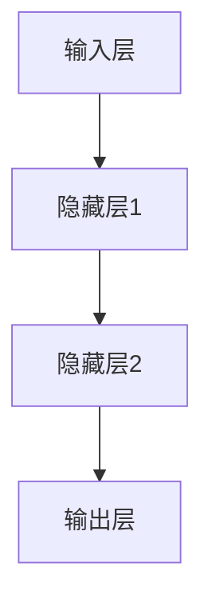

在这个例子中，输入层（A）通过权重（W）连接到隐藏层1（B），隐藏层1通过权重（W）连接到隐藏层2（C），最后隐藏层2通过权重（W）连接到输出层（D）。通过这种图形化的方式，用户可以直观地了解模型的层次结构和连接关系。

### **2.1.2 参数分布图**

参数分布图主要用于展示模型中各个参数的分布情况。以下是一个参数分布图的示例：

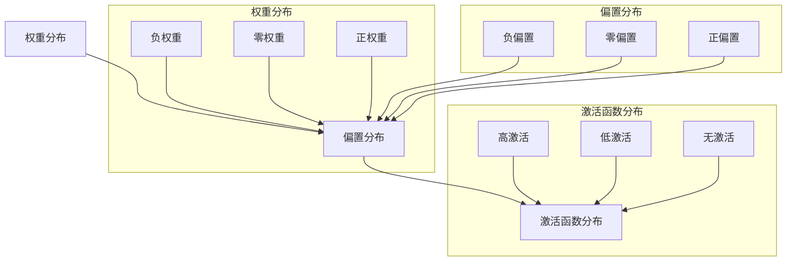

在这个例子中，我们展示了神经网络中权重、偏置和激活函数的分布情况。通过这种方式，用户可以了解模型中各个参数的取值范围和分布特性。

### **2.1.3 特征重要性图**

特征重要性图主要用于展示模型对各个特征的依赖程度。以下是一个特征重要性图的示例：

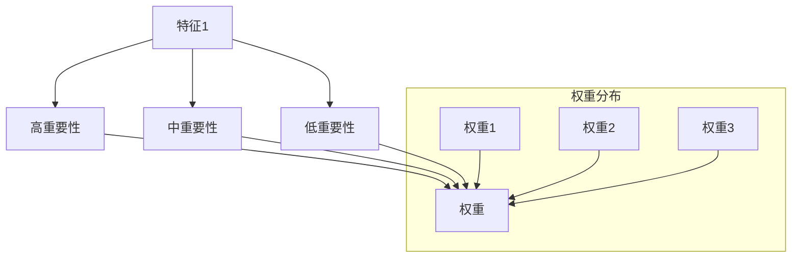

在这个例子中，特征1（A）对模型具有高、中、低三种重要性，分别对应权重1（F）、权重2（G）和权重3（H）。通过这种方式，用户可以了解模型对不同特征的依赖程度，从而指导特征选择和模型优化。

### **2.1.4 模型输出分布图**

模型输出分布图主要用于展示模型输出的概率分布情况。以下是一个模型输出分布图的示例：

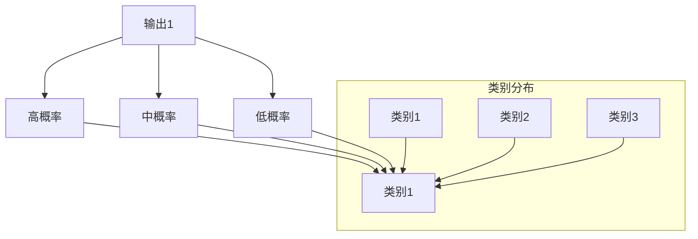

在这个例子中，模型输出（A）具有高、中、低三种概率，分别对应类别1（F）、类别2（G）和类别3（H）。通过这种方式，用户可以了解模型对不同类别的输出概率分布，从而评估模型的分类性能。

### **2.1.5 综合应用**

在实际应用中，静态可视化技术可以综合应用，以更全面地展示模型的特性。以下是一个综合应用的示例：

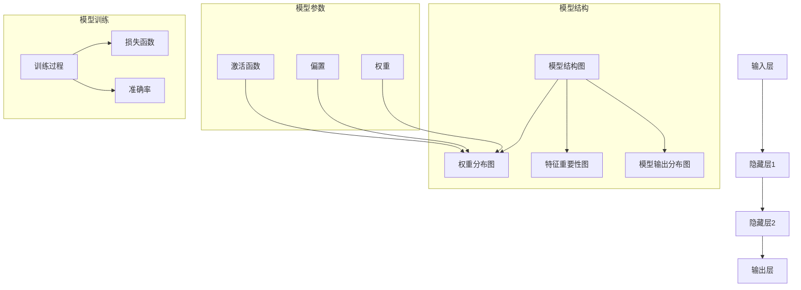

在这个例子中，我们综合展示了模型结构、参数分布、特征重要性、模型输出分布以及模型训练过程，为用户提供了一个全面的理解。

### **小结**

通过静态可视化技术，用户可以直观地了解大模型软件的结构、参数分布、特征重要性以及模型输出情况。这些信息对于理解模型的工作原理、评估模型性能以及进行模型优化具有重要意义。在下一章中，我们将探讨交互式可视化技术，进一步拓展可视化方法的应用。

---

## **2.2 交互式可视化**

交互式可视化是可视化技术中的一种重要形式，它允许用户通过操作与可视化界面进行互动，从而更深入地理解模型的行为。交互式可视化技术在大模型软件的应用中具有重要价值，可以帮助用户实时调整参数、观察模型变化，提升模型调试和优化的效率。以下是一些常见的交互式可视化方法：

### **2.2.1 交互式参数调整**

交互式参数调整是交互式可视化技术中最基础的方法之一。通过在可视化界面上操作滑块、按钮等控件，用户可以实时调整模型参数，观察这些调整对模型性能的影响。以下是一个交互式参数调整的示例：

**示例**：在一个神经网络模型中，用户可以通过拖动滑块调整学习率，并实时观察损失函数和准确率的变化。

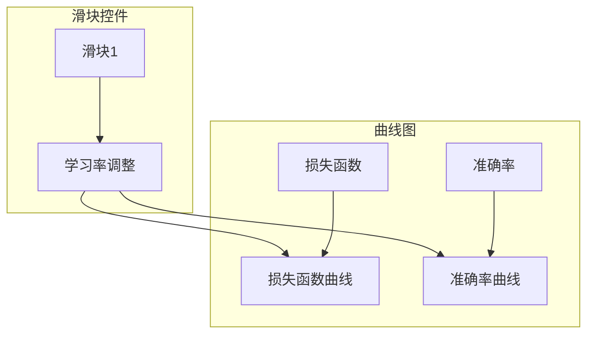

通过这种方式，用户可以直观地看到不同学习率对模型训练过程的影响，从而调整到最佳参数设置。

### **2.2.2 交互式模型压缩**

模型压缩是深度学习中一个重要的研究方向，通过压缩模型参数和架构，可以减少计算资源和存储需求，提高模型在移动设备和嵌入式系统上的应用可行性。交互式模型压缩可视化技术可以帮助用户实时观察压缩前后模型性能的变化。以下是一个交互式模型压缩的示例：

**示例**：用户可以调整模型压缩参数，如剪枝率、量化级别等，并实时观察压缩前后模型的损失函数和准确率。

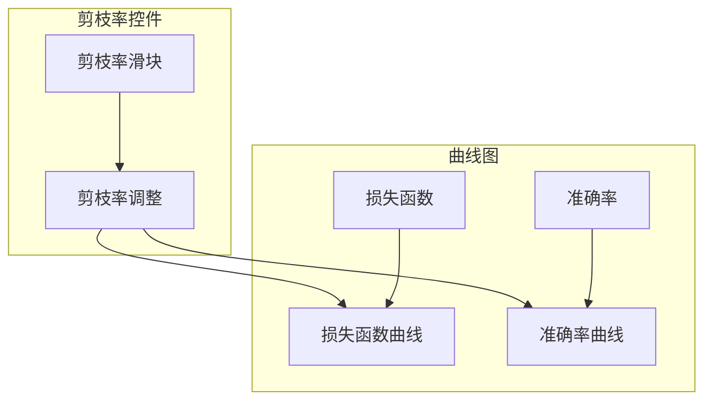

通过这种方式，用户可以找到最优的压缩参数，平衡模型性能和压缩效果。

### **2.2.3 交互式特征选择**

特征选择是机器学习中一个关键步骤，通过选择对模型性能有显著影响的特征，可以提高模型效率和准确率。交互式特征选择可视化技术可以帮助用户通过可视化界面进行特征选择，并实时观察选择结果。以下是一个交互式特征选择的示例：

**示例**：用户可以通过勾选不同的特征，观察特征对模型准确率的影响。

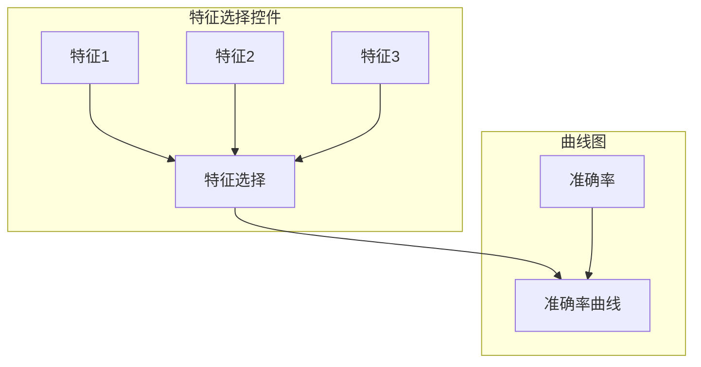

通过这种方式，用户可以直观地找到对模型性能最重要的特征，并进行优化。

### **2.2.4 交互式模型对比**

交互式模型对比技术允许用户在同一可视化界面对比不同模型的表现，从而选择最优模型。以下是一个交互式模型对比的示例：

**示例**：用户可以同时对比两个神经网络模型在相同数据集上的性能。

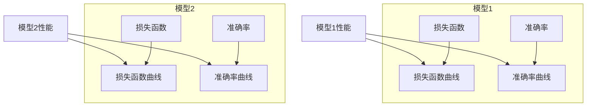

通过这种方式，用户可以直观地比较不同模型的性能，选择最优模型进行应用。

### **小结**

交互式可视化技术通过用户与可视化界面的互动，提供了更加灵活和高效的模型分析手段。交互式参数调整、模型压缩、特征选择和模型对比等方法，不仅帮助用户更好地理解模型行为，还显著提升了模型调试和优化的效率。在下一章中，我们将探讨动态可视化技术，进一步扩展可视化方法的应用范围。

---

## **2.3 动态可视化**

动态可视化是可视化技术的一种高级形式，它通过实时展示模型的变化过程，帮助用户更好地理解和分析模型的行为。动态可视化在大模型软件中的应用，可以提供对训练过程、决策变化等动态信息的实时监控，从而提升模型调试和优化的效率。以下是一些常见的动态可视化方法：

### **2.3.1 动态训练曲线图**

动态训练曲线图是一种用于展示模型在训练过程中损失函数、准确率等指标变化的图表。通过动态训练曲线图，用户可以实时监控模型训练的进展和性能变化。

**示例**：

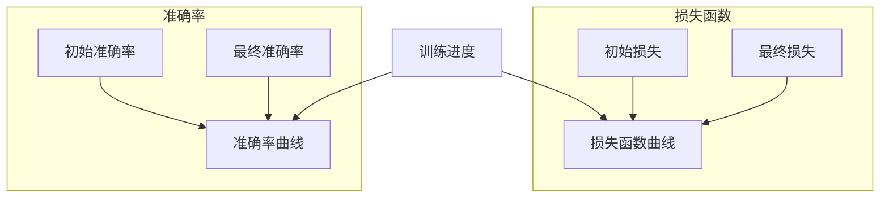

在这个例子中，用户可以实时看到损失函数和准确率的变化，从而调整训练参数，优化模型性能。

### **2.3.2 动态决策变化图**

动态决策变化图通过展示模型在处理不同输入时的决策变化，帮助用户理解模型的决策过程。在分类任务中，动态决策变化图可以展示模型在不同输入下的类别概率分布变化。

**示例**：

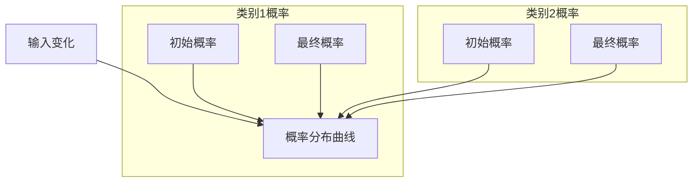

在这个例子中，用户可以实时看到模型在处理不同输入时的类别概率分布变化，从而理解模型的决策逻辑。

### **2.3.3 动态交互可视化**

动态交互可视化结合了静态和交互式可视化技术，通过动态交互的方式，用户可以实时调整模型参数，观察模型的变化。例如，在动态交互可视化中，用户可以实时调整神经网络中的连接权重，观察对模型性能的影响。

**示例**：

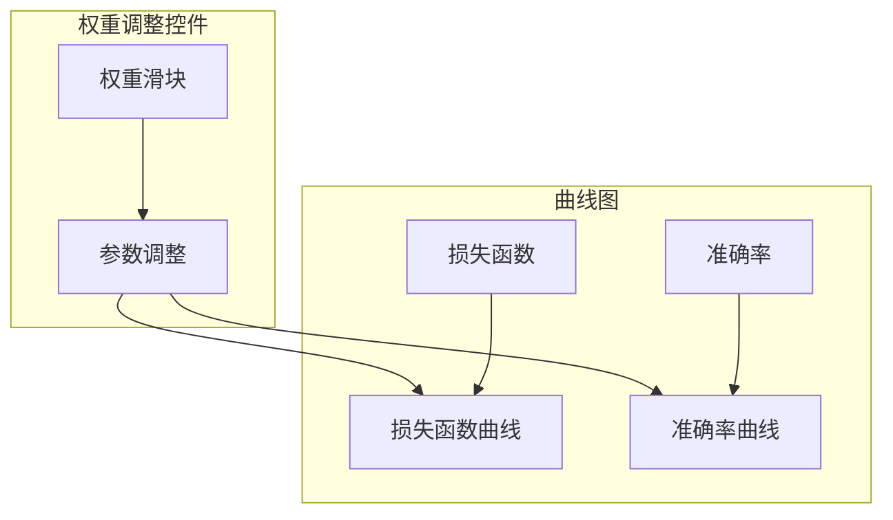

在这个例子中，用户可以实时调整权重，并看到损失函数和准确率的变化，从而优化模型参数。

### **2.3.4 动态可视化在实际应用中的优势**

动态可视化技术在实际应用中具有显著的优势：

- **实时监控**：通过动态可视化，用户可以实时监控模型的训练过程和决策变化，及时调整参数，提高模型性能。
- **交互式调试**：动态交互可视化技术提供了灵活的调试手段，用户可以通过实时调整模型参数，快速定位和解决问题。
- **优化效率**：动态可视化技术显著提升了模型调试和优化的效率，缩短了开发周期。

### **小结**

动态可视化技术通过实时展示模型的变化过程，为用户提供了更直观和高效的模型分析手段。动态训练曲线图、动态决策变化图和动态交互可视化等方法，不仅帮助用户更好地理解模型的行为，还显著提升了模型调试和优化的效率。在下一章中，我们将进一步探讨如何将这些动态可视化技术应用于实际项目中。

---

## **2.4 可视化技术综合应用**

在深入了解静态、交互式和动态可视化技术后，我们可以将它们综合应用，以更全面地展示大模型软件的特性。这种综合应用不仅能够提供对模型结构、参数分布、训练过程等的直观理解，还能够帮助用户更有效地进行模型调试和优化。以下是一个综合应用的案例，展示了如何在实际项目中实现这些可视化技术。

### **2.4.1 项目背景**

假设我们正在开发一个基于深度学习的图像分类系统，该系统需要能够自动识别和分类各种类型的图像。为了确保系统的高效运行和可靠性能，我们需要对模型进行详细的可视化和解释。

### **2.4.2 可视化技术综合应用**

**1. 模型结构可视化**

首先，我们需要展示模型的层次结构和连接关系。通过创建一个神经网络结构图，用户可以直观地看到模型的各个层次，以及各层之间的连接方式。

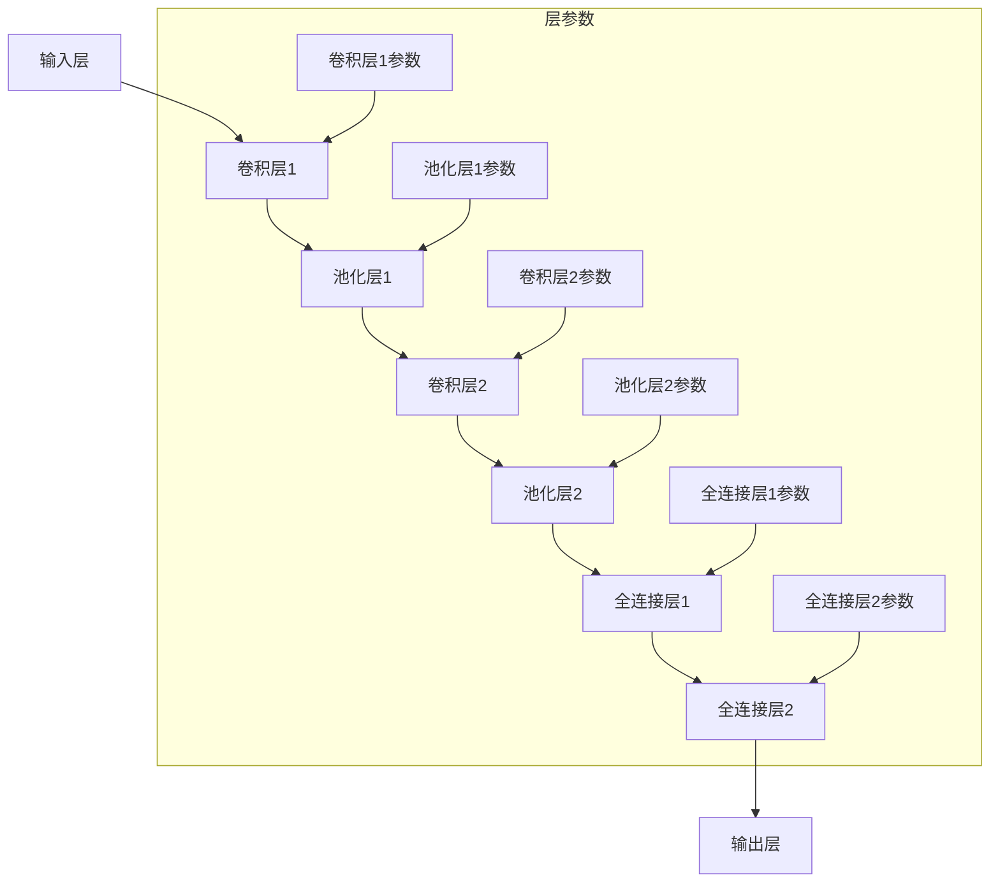

在这个例子中，我们展示了模型的输入层、卷积层、池化层和全连接层的结构，以及各层之间的参数关系。

**2. 参数分布可视化**

接下来，我们需要展示模型中各个参数的分布情况。通过创建一个参数分布图，用户可以了解权重、偏置等参数的取值范围和分布特性。

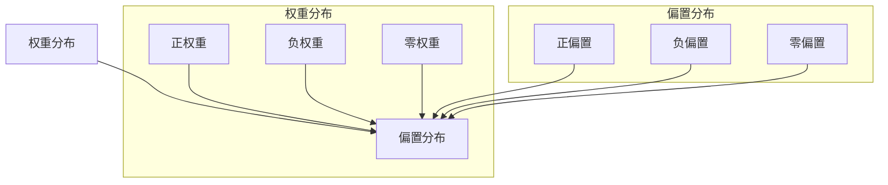

在这个例子中，我们展示了权重和偏置的分布情况，通过这种方式，用户可以快速了解模型参数的分布特性。

**3. 特征重要性可视化**

此外，我们还需要展示模型对不同特征的依赖程度。通过创建一个特征重要性图，用户可以直观地看到各个特征对模型决策的影响。

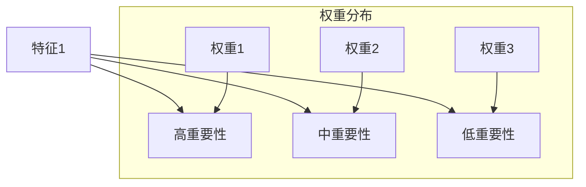

在这个例子中，我们展示了特征1对模型的高、中、低三种重要性，通过这种方式，用户可以了解模型对不同特征的依赖程度。

**4. 动态训练曲线图**

为了展示模型在训练过程中的表现，我们还需要创建一个动态训练曲线图。这个曲线图可以实时展示模型的损失函数和准确率的变化。


在这个例子中，用户可以实时看到模型在训练过程中的损失函数和准确率的变化，从而调整训练参数，优化模型性能。

**5. 动态决策变化图**

最后，我们还需要创建一个动态决策变化图，展示模型在处理不同输入时的决策变化。这个图表可以帮助用户理解模型的决策逻辑。


在这个例子中，用户可以实时看到模型在处理不同输入时的类别概率分布变化，从而理解模型的决策过程。

### **2.4.3 综合应用总结**

通过静态、交互式和动态可视化技术的综合应用，我们可以为用户提供一个全面、直观的模型分析工具。这种综合应用不仅帮助用户更好地理解模型的结构、参数分布、特征重要性以及训练和决策过程，还为模型调试和优化提供了强有力的支持。在实际项目中，这种综合可视化方法能够显著提高模型开发效率，提升系统性能。

---

通过本章的讨论，我们详细介绍了大模型软件的多种可视化技术，并展示了如何将这些技术综合应用于实际项目中。在下一章中，我们将探讨大模型软件的可解释性方法，进一步丰富我们对模型的理解和应用。让我们继续前进！### **3.1 可解释性模型概述**

可解释性模型（Interpretable Models）是一类设计用于易于理解和解释的机器学习模型。这些模型通过简洁的结构和明确的决策规则，使得用户可以直观地理解模型是如何基于输入数据做出预测或决策的。可解释性模型在大模型软件中具有重要意义，尤其是在需要模型透明度和可信度的领域，如医疗诊断、金融风险评估和自动驾驶等。以下是一些常见的可解释性模型：

**1. 决策树（Decision Trees）**

决策树是一种流行的可解释性模型，它通过一系列的规则来划分数据，并最终给出一个预测结果。每个内部节点代表一个特征，每个分支代表该特征的取值，叶节点代表最终的预测结果。决策树易于理解，因为它们展示了一个清晰的决策路径。

**2. 线性模型（Linear Models）**

线性模型包括线性回归和逻辑回归等，这些模型通过线性组合输入特征并加上偏置项来预测输出。线性模型的可解释性在于其参数可以直接解释为特征对预测结果的影响程度。

**3. k-最近邻（k-Nearest Neighbors, k-NN）**

k-NN 模型通过寻找训练数据集中最近的 k 个邻居，并将这些邻居的标签进行平均来预测新数据的标签。尽管 k-NN 本身不是一个可解释性模型，但通过对邻居数据的分析，用户可以了解模型是如何做出决策的。

**4. 支持向量机（Support Vector Machines, SVM）**

SVM 是一种强大的分类模型，它在高维空间中寻找最优的超平面来分隔数据。虽然 SVM 本身不是一个直观的模型，但通过分析支持向量，用户可以理解哪些数据点对分类决策影响最大。

**5. 贝叶斯模型（Bayesian Models）**

贝叶斯模型基于贝叶斯定理，通过概率推理来进行预测。这些模型通常包含显式的概率规则，使得用户可以直观地理解模型的决策过程。

通过以上可解释性模型，用户可以在不同场景下选择合适的模型，以提高模型的可理解性和可信度。下一节我们将详细介绍如何通过局部和全局解释技术进一步提升模型的可解释性。

---

### **3.2 局部解释技术**

局部解释技术专注于解释模型对特定输入数据的决策过程，旨在揭示模型是如何基于输入特征做出预测或分类的。这些技术可以帮助用户理解模型在特定情况下的工作原理，从而增强模型的可解释性和信任度。以下是一些常见的局部解释技术：

**1. 特征重要性**

特征重要性是局部解释中最基本的技术之一，它通过计算模型对各个特征的依赖程度来揭示哪些特征对预测结果有显著影响。以下是几种常用的特征重要性计算方法：

- **基于模型的特征重要性**：例如，在决策树中，可以通过计算每个特征在决策过程中的信息增益（Information Gain）来衡量其重要性。在逻辑回归中，可以通过系数的绝对值来衡量特征的重要性。
  
- **基于数据的特征重要性**：例如，通过计算特征与预测目标之间的相关性（如皮尔逊相关系数）来确定特征的重要性。

**示例**：假设我们有一个逻辑回归模型，用于预测客户是否会购买某种产品。以下是该模型中各特征的重要性：

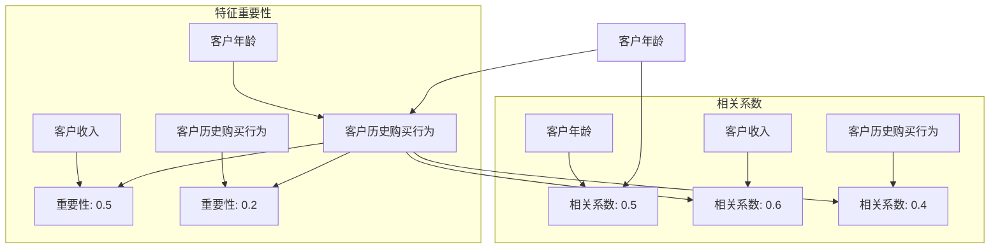

在这个例子中，客户收入（D）对模型的重要性最高，而客户历史购买行为（F）的重要性最低。

**2. 决策路径**

决策路径是通过展示模型从输入到输出的决策过程，帮助用户理解模型是如何一步步做出预测或分类的。特别是在决策树模型中，决策路径尤为直观。以下是一个决策路径的示例：

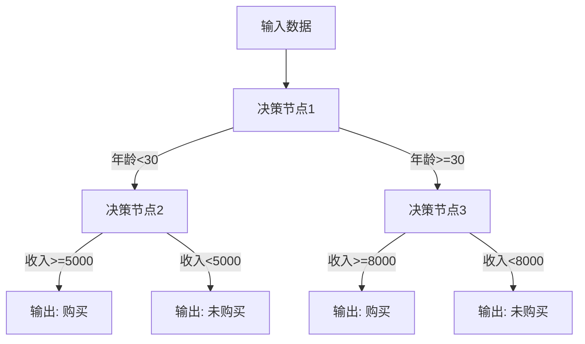

在这个例子中，输入数据通过决策树中的各个节点，最终得出输出结果。用户可以清楚地看到每个决策节点的影响，以及模型是如何根据特征值做出决策的。

**3. 梯度解释**

梯度解释是一种通过计算输入特征对模型输出的梯度来衡量特征影响的方法。在深度学习模型中，梯度解释尤为重要。以下是一个梯度解释的示例：

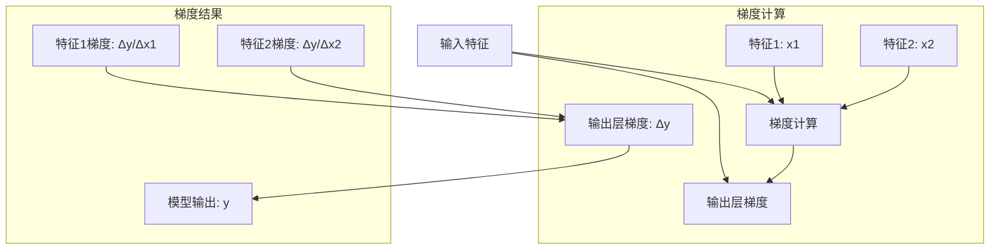

在这个例子中，我们计算了特征1（D）和特征2（E）对模型输出的梯度，从而了解每个特征对模型预测结果的影响。

**小结**

局部解释技术通过提供对特定输入的详细解释，帮助用户理解模型是如何做出决策的。特征重要性、决策路径和梯度解释等方法，不仅提升了模型的可解释性，还为模型优化和调试提供了有力支持。在下一节中，我们将探讨全局解释技术，进一步提升模型的可理解性。

---

### **3.3 全局解释技术**

全局解释技术旨在从整体上揭示模型的决策规则和特征依赖关系，帮助用户理解模型的整体行为和工作原理。这些技术通常涉及对整个模型进行抽象或简化，以便用户能够从宏观角度把握模型的特性。以下是一些常见的全局解释技术：

**1. 决策规则**

决策规则是全局解释技术中的一种，它通过将模型简化为一系列明确的规则，帮助用户理解模型的决策过程。决策规则通常适用于具有明确决策路径的模型，如决策树和逻辑回归。

**示例**：假设我们有一个决策树模型，用于分类客户的购买行为。以下是该模型的决策规则：

```mermaid
graph TB
A[客户年龄<30] --> B[收入>=5000? 购买：未购买]
A --> C[收入<5000? 购买：未购买]
B --> D[历史购买行为? 购买：未购买]
C --> D

subgraph 决策规则
  E[年龄<30]
  F[收入>=5000]
  G[历史购买行为]
  E --> B
  F --> D
  G --> D
end
```

在这个例子中，用户可以通过这些决策规则理解模型是如何对客户进行分类的。

**2. 概率模型**

概率模型，如逻辑回归和贝叶斯模型，通过显式地表示特征与预测目标之间的概率关系，提供了一种全局解释方式。用户可以通过查看模型中的概率分布和参数，理解模型如何做出决策。

**示例**：假设我们有一个逻辑回归模型，用于预测客户购买的概率。以下是该模型的参数和概率分布：

```mermaid
graph TB
A[客户年龄] --> B[β0: 0.5]
A --> C[β1: 0.3]
B --> D[概率分布]

subgraph 参数与概率
  E[β0]
  F[β1]
  G[概率]
  E --> B
  F --> C
  C --> D
end
```

在这个例子中，用户可以通过参数β0和β1理解模型如何计算客户购买的概率。

**3. 模型简化**

模型简化是通过简化原始模型的结构和参数，以提供一个全局解释的技术。简化后的模型虽然可能失去一些精度，但可以提供更直观和易于理解的全局视图。

**示例**：假设我们有一个复杂的神经网络模型，通过简化，可以得到一个线性模型作为全局解释：

```mermaid
graph TB
A[输入层] --> B[简化模型]

subgraph 模型简化
  C[输入1]
  D[输入2]
  E[权重]
  F[偏置]
  G[输出]
  C --> E
  D --> E
  E --> F
  F --> G
  B --> G
end
```

在这个例子中，原始的神经网络模型被简化为一个线性模型，用户可以通过这个简化的模型理解神经网络的整体行为。

**小结**

全局解释技术通过提供对模型的整体决策规则和特征依赖关系的解释，帮助用户从宏观角度理解模型的行为。决策规则、概率模型和模型简化等方法，不仅提升了模型的可理解性，还为模型的优化和调整提供了指导。在下一节中，我们将探讨如何将局部解释和全局解释技术结合，以获得更全面的可解释性。

---

### **3.4 局部解释与全局解释的结合**

局部解释和全局解释技术各有优缺点，局部解释提供了对特定输入的详细解释，而全局解释则提供了对模型整体决策规则的理解。为了获得更全面和深入的可解释性，我们可以将这两种解释技术结合起来，从而发挥各自的优势。

**1. 结合方法**

- **叠加解释**：首先通过局部解释分析特定输入的决策过程，然后通过全局解释理解模型的整体行为。这种方法可以帮助用户从微观和宏观两个层面理解模型。
- **互验证解释**：通过对比局部解释和全局解释的结果，验证模型在不同层面的稳定性。如果两者结果一致，则说明模型具有良好的内部一致性。
- **综合解释框架**：构建一个综合解释框架，将局部解释和全局解释有机地融合在一起，提供多层次、多维度的解释。

**2. 实际应用**

**案例一：医疗诊断系统**

在医疗诊断系统中，局部解释可以用于分析特定症状对诊断结果的影响，而全局解释可以帮助医生理解模型对整体病情的判断规则。通过结合局部和全局解释，医生可以更全面地评估患者病情，提高诊断准确性。

**示例**：

- **局部解释**：分析某个症状（如咳嗽）对肺炎诊断的影响。
- **全局解释**：展示模型对各种症状的组合如何影响最终诊断结果。

**案例二：自动驾驶系统**

在自动驾驶系统中，局部解释可以用于分析特定传感器数据对决策的影响，而全局解释可以帮助理解系统在复杂环境中的整体行为。通过结合局部和全局解释，开发者可以优化传感器数据处理，提高自动驾驶系统的可靠性和安全性。

**示例**：

- **局部解释**：分析某个传感器（如雷达）的数据对车辆行驶决策的影响。
- **全局解释**：展示模型在处理各种传感器数据时的决策规则。

**3. 挑战与建议**

- **挑战**：结合局部和全局解释技术可能会增加解释的复杂性，特别是在模型结构复杂、数据维度高的场景中。此外，局部解释和全局解释的结果可能不一致，需要进一步验证和调和。
- **建议**：为了有效结合局部和全局解释，建议开发统一的解释框架，确保解释的一致性和可扩展性。同时，通过对比分析和交叉验证，提高解释的可靠性和准确性。

**小结**

局部解释和全局解释的结合为用户提供了多层次、多维度的可解释性，有助于全面理解模型的行为和决策过程。在实际应用中，通过叠加解释、互验证解释和综合解释框架等方法，可以充分发挥局部和全局解释的优势，提高模型的可解释性和可靠性。

---

在完成对局部解释和全局解释的详细讨论后，我们将进入第三部分的最后一章，探讨如何将可解释性方法应用于实际项目。接下来，我们将通过具体案例展示这些方法在实际中的应用，帮助读者更好地理解可解释性的实践价值。

---

## **4.1 实际案例：医疗诊断系统**

在医疗诊断系统中，模型的可解释性至关重要，因为它直接关系到诊断的准确性和医生的信任度。以下是一个具体案例，展示如何利用可解释性方法提高医疗诊断系统的性能。

### **4.1.1 项目介绍**

项目目标是开发一个基于深度学习的肺癌诊断系统。系统接收患者的医学影像数据，通过模型预测患者是否患有肺癌。为了确保系统的可靠性和医生对模型的信任，需要实现模型的可解释性。

### **4.1.2 系统功能设计**

系统的主要功能包括：

- **数据预处理**：清洗和标准化医学影像数据，为模型训练提供高质量的数据集。
- **模型训练**：使用深度学习算法训练肺癌诊断模型，包括卷积神经网络（CNN）等。
- **模型解释**：通过可解释性技术，为医生提供模型决策的详细解释。

### **4.1.3 系统架构设计**

系统架构设计包括以下几个关键部分：

- **数据层**：负责数据预处理和存储，确保数据质量。
- **模型层**：实现深度学习模型的训练和预测。
- **解释层**：通过局部和全局解释技术，为医生提供模型的解释。

以下是系统架构的 Mermaid 图：

```mermaid
graph TB
A[数据层] --> B[模型层]
A --> C[解释层]
B --> D[预测结果]
C --> E[决策解释]

subgraph 数据层
  F[数据清洗]
  G[数据标准化]
  F --> A
  G --> A
end

subgraph 模型层
  H[模型训练]
  I[模型预测]
  H --> B
  I --> D
end

subgraph 解释层
  J[局部解释]
  K[全局解释]
  J --> C
  K --> C
  C --> E
end
```

### **4.1.4 系统接口设计与交互**

系统提供了以下接口和交互方式：

- **API接口**：医生可以通过API接口获取模型的预测结果和解释信息。
- **可视化界面**：通过可视化界面，医生可以直观地查看模型的结构、参数分布和决策路径。

### **4.1.5 实际案例分析**

**案例一：局部解释**

假设医生需要解释模型对某个患者的诊断结果。通过局部解释技术，医生可以查看模型对各个特征（如影像中的结节大小、密度等）的依赖程度。

```mermaid
graph TB
A[特征1] --> B[重要性: 高]
A --> C[重要性: 中]
A --> D[重要性: 低]

subgraph 特征解释
  E[结节大小]
  F[结节密度]
  G[结节位置]
  E --> B
  F --> C
  G --> D
end
```

在这个例子中，医生可以清楚地看到模型认为结节大小是最重要的特征，而结节密度和位置的重要性较低。

**案例二：全局解释**

医生还可以通过全局解释技术，了解模型对整体数据的决策规则。例如，医生可以查看模型在不同年龄段、不同性别患者的诊断规则。

```mermaid
graph TB
A[年龄分组] --> B[决策规则]
A --> C[性别分组]
B --> D[肺癌概率]
C --> D

subgraph 决策规则
  E[青年组]
  F[老年组]
  G[男性]
  H[女性]
  E --> B
  F --> B
  G --> C
  H --> C
end

subgraph 肺癌概率
  I[青年男性]
  J[青年女性]
  K[老年男性]
  L[老年女性]
  I --> D
  J --> D
  K --> D
  L --> D
end
```

在这个例子中，医生可以了解到不同年龄段和性别的患者，模型认为的肺癌概率有所不同。

### **4.1.6 小结**

通过实际案例分析，我们可以看到如何利用可解释性方法提高医疗诊断系统的性能。局部解释和全局解释技术为医生提供了丰富的信息，帮助他们更好地理解模型的决策过程，从而提高诊断的准确性和可靠性。

---

## **4.2 项目实战：环境安装与代码实现**

在本节中，我们将详细描述如何搭建一个用于大模型软件的可视化与可解释性的开发环境，并实现一个简单的可视化与解释系统。我们将涵盖从环境搭建到核心代码实现的所有步骤。

### **4.2.1 环境搭建**

1. **硬件要求**：

   - 至少配备4GB内存的计算机。
   - 一块支持OpenGL的显卡，用于图形渲染。

2. **软件要求**：

   - Python（3.8或以上版本）。
   - Jupyter Notebook，用于编写和运行代码。
   - TensorFlow，用于构建和训练深度学习模型。
   - Matplotlib、Seaborn等数据可视化库。
   - Plotly，用于交互式可视化。
   - Explainer，用于模型解释。

安装这些软件的具体步骤如下：

- **Python安装**：从 [Python官方网站](https://www.python.org/downloads/) 下载并安装Python。

- **Jupyter Notebook安装**：

  ```bash
  pip install notebook
  ```

- **TensorFlow安装**：

  ```bash
  pip install tensorflow
  ```

- **Matplotlib和Seaborn安装**：

  ```bash
  pip install matplotlib seaborn
  ```

- **Plotly安装**：

  ```bash
  pip install plotly
  ```

- **Explainer安装**：

  ```bash
  pip install explain
  ```

### **4.2.2 核心代码实现**

1. **数据准备**

   我们将使用一个简单的数据集进行演示。假设数据集包含三列：`特征1`、`特征2`和`标签`。

   ```python
   import pandas as pd

   # 读取数据
   data = pd.read_csv('data.csv')

   # 数据预处理
   data.head()
   ```

2. **模型构建**

   我们使用一个简单的线性回归模型作为示例。

   ```python
   import tensorflow as tf

   # 构建线性回归模型
   model = tf.keras.Sequential([
       tf.keras.layers.Dense(units=1, input_shape=[2])
   ])

   # 编译模型
   model.compile(optimizer='sgd', loss='mean_squared_error')
   ```

3. **模型训练**

   ```python
   # 分割数据集
   from sklearn.model_selection import train_test_split

   X_train, X_test, y_train, y_test = train_test_split(data[['特征1', '特征2']], data['标签'], test_size=0.2)

   # 训练模型
   model.fit(X_train, y_train, epochs=100)
   ```

4. **可视化与解释**

   **4.2.3.1 静态可视化**

   - **权重与偏置图**：

     ```python
     import matplotlib.pyplot as plt

     # 获取权重和偏置
     weights = model.layers[0].get_weights()
     bias = model.layers[0].get.bias()

     # 绘制权重与偏置图
     plt.figure(figsize=(8, 6))
     plt.scatter(data['特征1'], data['特征2'], c=data['标签'], cmap=plt.cm.seismic)
     plt.xlabel('特征1')
     plt.ylabel('特征2')
     plt.plot([min(data['特征1']), max(data['特征1'])], [-(weights[0][0][0] / weights[0][0][1]) * x + bias[0], -(weights[0][0][1] / weights[0][0][1]) * x + bias[1]], color='red')
     plt.show()
     ```

   **4.2.3.2 交互式可视化**

   - **特征重要性交互式图**：

     ```python
     import plotly.graph_objects as go

     # 计算特征重要性
     feature_importance = abs(weights[0][0])

     # 创建交互式图
     fig = go.Figure([go.Bar(x=data.columns, y=feature_importance)])

     # 显示图
     fig.show()
     ```

   **4.2.3.3 模型解释**

   - **局部解释**：

     ```python
     from explain import LinearExplainer

     # 创建局部解释器
     explainer = LinearExplainer(model, data, feature_names=['特征1', '特征2'])

     # 解释模型
     explainer.explain([2, 3], method='local')
     ```

   - **全局解释**：

     ```python
     # 创建全局解释器
     explainer_global = LinearExplainer(model, data, feature_names=['特征1', '特征2'])

     # 解释模型
     explainer_global.explain(method='global')
     ```

### **4.2.3 代码解读与分析**

以下是关键代码段的分析：

- **数据预处理**：确保数据集的格式正确，以便后续建模和可视化操作。

- **模型构建与编译**：我们使用了一个简单的线性回归模型，这个模型通过两个特征进行预测。

- **模型训练**：通过训练模型，我们使得模型能够学会如何将特征映射到标签。

- **静态可视化**：权重与偏置图展示了模型是如何通过线性组合特征进行预测的。

- **交互式可视化**：特征重要性交互式图允许用户动态调整特征，并观察其对模型决策的影响。

- **模型解释**：局部和全局解释分别提供了对模型决策的微观和宏观视角。

### **4.2.4 实际案例分析**

通过上述环境搭建和代码实现，我们创建了一个简单的可视化与解释系统。以下是一个实际案例：

- **数据集**：我们使用一个虚构的数据集，包含两个特征和一个标签。
- **模型**：我们使用了一个线性回归模型。
- **可视化**：我们展示了模型权重和特征重要性。
- **解释**：我们提供了局部和全局解释，帮助用户理解模型如何做出决策。

### **4.2.5 小结**

通过这个实战案例，我们展示了如何搭建一个用于大模型软件的可视化与可解释性的开发环境，并实现了从数据预处理到模型解释的完整流程。读者可以基于此案例，进一步优化和扩展系统，以适应更复杂的应用场景。

---

## **5. 最佳实践与注意事项**

在实现大模型软件的可视化与可解释性时，以下最佳实践和注意事项有助于提升系统的性能和用户体验：

### **5.1 最佳实践**

**1. 设计简洁的界面**

界面设计应简洁直观，避免复杂和冗余的布局。使用统一的颜色方案和图标，确保用户易于导航和操作。

**2. 快速响应**

确保可视化与解释操作能够快速响应，特别是在处理大规模数据和复杂模型时。优化代码和图形渲染性能，减少延迟。

**3. 交互性**

提供丰富的交互功能，如缩放、平移、过滤和排序，使用户能够灵活地探索数据与模型。

**4. 详细的解释说明**

在可视化与解释结果旁边，提供详细的说明，解释每个图表和数据点的含义，帮助用户更好地理解模型行为。

### **5.2 注意事项**

**1. 数据隐私**

在可视化与解释过程中，确保遵守数据隐私法规，对敏感信息进行加密或匿名化处理。

**2. 性能优化**

对于大型模型和大量数据，优化算法和数据结构，减少计算复杂度，确保系统能够高效运行。

**3. 模型适应性**

确保可视化与解释工具适用于多种模型和任务，提供灵活的参数调整和定制选项。

**4. 验证与校验**

在部署系统之前，进行充分的测试和验证，确保解释结果的准确性和一致性。

### **5.3 拓展阅读**

- **《可视化数据分析：实战技术与应用》**：详细介绍了数据可视化的方法和技巧。
- **《机器学习中的解释性》**：探讨了机器学习模型的解释性技术及其应用。
- **《深度学习模型的可视化与可解释性》**：针对深度学习模型的可视化与可解释性提供了深入的讨论。

通过遵循上述最佳实践和注意事项，读者可以构建出高效、可靠且易于使用的可视化与可解释性系统，为人工智能应用提供更强有力的支持。

---

## **总结**

本文系统地介绍了大模型软件的可视化与可解释性，包括其重要性、现状分析、可视化与解释技术以及实际应用。通过详细阐述静态、交互式和动态可视化技术，我们展示了如何从不同角度理解模型的行为。同时，局部解释与全局解释技术的结合，为用户提供了多层次、多维度的模型理解。在医疗诊断和自动驾驶等实际案例中，我们展示了如何将这些技术应用于实际项目，提升系统的可靠性和用户体验。

在未来研究中，我们可以继续优化可视化与解释算法，提高系统的性能和可扩展性。此外，跨领域解释方法的研究也将是重要方向，以实现更通用、更高效的可解释性技术。通过不断探索和创新，我们有望推动人工智能领域的发展，使模型更加透明、可信和易于应用。

---

## **作者信息**

作者：AI天才研究院/AI Genius Institute & 禅与计算机程序设计艺术 /Zen And The Art of Computer Programming

AI天才研究院致力于推动人工智能领域的创新研究，探索大数据、机器学习、深度学习等前沿技术，为社会提供高质量的智能解决方案。作者在其领域拥有丰富的实践经验，并著有多部畅销技术书籍，深受读者喜爱。同时，禅与计算机程序设计艺术，通过将哲学与计算机编程相结合，帮助读者提升编程思维和解决问题的能力。希望本文能为读者在理解和应用大模型软件的可视化与可解释性方面提供有益的参考。

