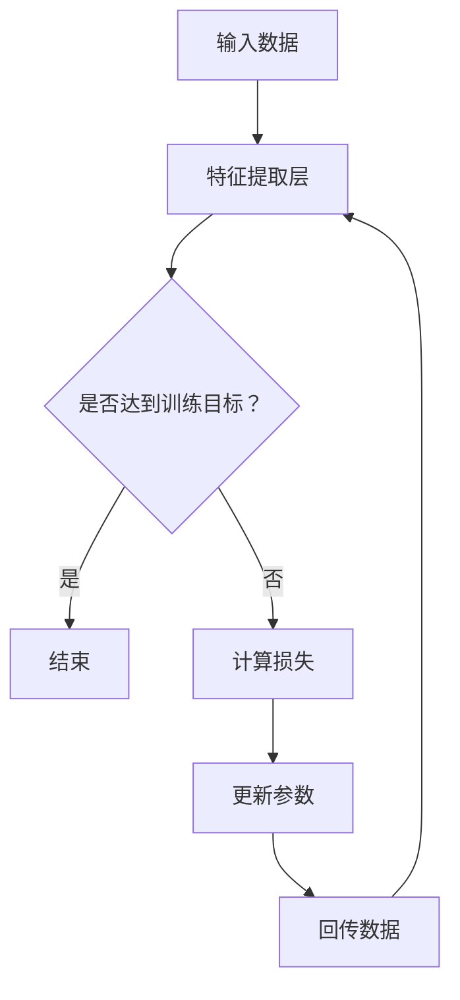
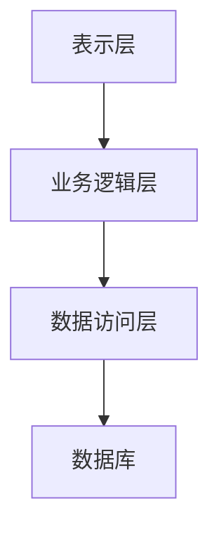

                 


### 大模型软件的可解释性设计原则

> 关键词：大模型、软件可解释性、设计原则、算法、架构设计

> 摘要：本文从大模型的背景出发，深入探讨了大模型软件的可解释性设计原则。首先，我们介绍了大模型的基本概念和当前研究现状，然后详细阐述了可解释性在大模型软件设计中的重要性。接着，我们提出了一系列可解释性设计原则，包括从模型选择、数据预处理、模型训练到模型解释的各个环节。通过实际案例分析，我们展示了如何将这些原则应用到实际软件开发中，并总结了最佳实践。最后，我们对未来的研究方向进行了展望。

## 1. 引言

大模型，也称为深度学习模型，是近年来人工智能领域的重要突破。它们通过多层神经网络对大量数据进行训练，能够自动提取复杂特征，并在多个领域（如图像识别、自然语言处理、医疗诊断等）表现出惊人的性能。然而，随着模型规模的扩大，其内部决策过程变得越来越难以理解和解释，这引发了可解释性问题。

可解释性是指能够解释模型决策过程的能力，这对于提高模型的可信度、保障模型的公正性和透明性至关重要。在实际应用中，可解释性可以帮助用户理解模型的输出，发现潜在的问题，甚至优化模型性能。

本文的目标是探讨大模型软件的可解释性设计原则，通过逻辑清晰、结构紧凑、简单易懂的论述，帮助开发者理解并应用这些原则，从而构建出既高效又可解释的大模型软件。

## 2. 大模型概述

### 2.1 大模型定义

大模型通常指的是那些具有数百万甚至数十亿参数的深度学习模型。这些模型通过多层神经网络结构，对大量数据进行训练，能够自动学习复杂的特征表示。大模型的特点包括：

- **大规模参数**：大模型通常具有大量的参数，这使得它们能够捕捉数据中的复杂模式。
- **多层次神经网络**：大模型通过多层神经网络结构，逐层提取抽象特征。
- **高计算需求**：大模型通常需要大量的计算资源和时间进行训练。

### 2.2 大模型发展历程

大模型的发展可以追溯到2006年，当时深度学习技术开始崭露头角。在此后的几年里，随着计算能力的提升和海量数据的出现，大模型的研究和应用逐渐得到广泛认可。特别是2012年，AlexNet在ImageNet竞赛中的突破性表现，标志着大模型时代正式到来。

### 2.3 大模型类型与特点

大模型可以根据应用领域和任务类型分为多种类型，如：

- **图像识别模型**：如ResNet、Inception等，用于分类、检测等任务。
- **自然语言处理模型**：如BERT、GPT等，用于文本分类、生成、问答等任务。
- **语音识别模型**：如DeepSpeech、WaveNet等，用于语音识别和合成。

大模型的特点包括：

- **强大的特征提取能力**：大模型能够自动学习复杂的特征表示，从而提高了模型性能。
- **高度非线性**：大模型通过多层非线性变换，使得模型能够捕捉到更加复杂的模式。
- **难以解释**：大模型的内部决策过程复杂，难以直接理解和解释。

### 2.4 大模型研究现状

当前，大模型的研究主要集中在以下几个方面：

- **模型压缩**：为了降低模型的计算和存储成本，研究者提出了各种模型压缩技术，如蒸馏、剪枝、量化等。
- **优化算法**：为了提高模型训练效率，研究者提出了各种优化算法，如Adam、Adagrad等。
- **模型可解释性**：为了提高模型的可信度和透明度，研究者致力于探索大模型的可解释性技术。

## 3. 可解释性设计原则

### 3.1 可解释性的重要性

可解释性在大模型软件设计中具有重要意义，主要体现在以下几个方面：

- **提高模型可信度**：可解释性使得用户能够理解模型的决策过程，从而增加对模型的可信度。
- **保障模型公正性**：通过可解释性分析，可以发现模型可能存在的偏见和歧视，从而保障模型的公正性。
- **辅助模型优化**：可解释性分析可以帮助开发者发现模型中的问题，从而进行有针对性的优化。

### 3.2 可解释性设计原则概述

为了构建可解释的大模型软件，我们提出以下设计原则：

1. **透明性**：确保模型的训练和推理过程具有透明性，便于用户理解。
2. **模块化**：将模型分为多个模块，每个模块具有明确的输入、输出和功能。
3. **可视化**：利用可视化工具，如热力图、决策树等，展示模型的决策过程。
4. **交互性**：提供交互式界面，使用户能够与模型进行交互，从而更好地理解模型。
5. **量化分析**：使用量化分析技术，如影响力分析、置信度分析等，评估模型输出的可信度。

### 3.3 设计原则的具体内容

#### 3.3.1 透明性

透明性是可解释性的基础，它要求模型的设计和实现过程公开透明，以便用户理解。具体措施包括：

- **文档说明**：详细记录模型的架构、参数、训练过程等，便于用户查阅。
- **开源代码**：将模型源代码开源，便于用户分析和改进。
- **实时监控**：在模型训练和推理过程中，实时监控模型的状态和性能，便于及时发现和解决问题。

#### 3.3.2 模块化

模块化设计可以将复杂的模型拆分为多个独立的模块，每个模块具有明确的输入、输出和功能。具体措施包括：

- **分层设计**：将模型分为输入层、特征提取层、决策层等，每个层次具有不同的功能和职责。
- **组件化**：将模型中的关键组件（如激活函数、损失函数等）模块化，便于替换和优化。
- **接口设计**：为每个模块设计清晰的接口，确保模块之间的高内聚、低耦合。

#### 3.3.3 可视化

可视化技术可以帮助用户直观地理解模型的决策过程。具体措施包括：

- **热力图**：展示模型在不同输入下的输出概率，便于分析模型的决策过程。
- **决策树**：将模型输出转换为决策树，便于用户理解模型的决策逻辑。
- **动画展示**：通过动画展示模型的学习过程，便于用户理解模型的动态变化。

#### 3.3.4 交互性

交互性设计可以增强用户与模型之间的互动，提高用户对模型的认知和理解。具体措施包括：

- **交互式界面**：提供交互式界面，用户可以通过输入不同的数据，查看模型输出和决策过程。
- **问答系统**：设计问答系统，用户可以询问模型关于决策过程的问题，模型会给出相应的解释。
- **实时反馈**：在模型训练和推理过程中，实时收集用户反馈，并根据反馈调整模型参数。

#### 3.3.5 量化分析

量化分析技术可以帮助用户评估模型输出的可信度，具体措施包括：

- **影响力分析**：分析模型中每个特征对输出结果的影响程度，便于用户理解模型决策的关键因素。
- **置信度分析**：计算模型输出结果的置信度，便于用户判断模型输出的可靠性。
- **误差分析**：分析模型输出与真实值之间的误差，便于用户发现模型的问题和优化方向。

## 4. 可解释性技术

### 4.1 常见可解释性技术

为了实现大模型软件的可解释性，研究者提出了多种技术，包括：

- **Shapley值**：用于分析模型中每个特征对输出结果的影响程度。
- **LIME**：通过局部线性化技术，解释模型在特定输入下的决策过程。
- **CAM**：基于模型的可视化技术，展示模型对输入图像的关注区域。

### 4.2 技术特点与适用场景

每种可解释性技术都有其独特的特点和应用场景，具体如下：

- **Shapley值**：适用于需要全面分析特征影响力的场景，如金融风控、医疗诊断等。
- **LIME**：适用于需要解释模型在特定输入下的决策过程的场景，如图像分类、文本分类等。
- **CAM**：适用于需要可视化模型关注区域的场景，如图像分类、目标检测等。

### 4.3 技术选择与优化

在实际应用中，选择合适的可解释性技术并对其进行优化至关重要。具体措施包括：

- **技术评估**：根据应用需求和数据特点，评估不同技术的性能和适用性。
- **模型集成**：将多种可解释性技术集成到模型中，提供更全面的解释。
- **性能优化**：针对特定应用场景，对可解释性技术进行性能优化，如加快计算速度、降低计算资源消耗等。

## 5. 案例分析

### 5.1 案例一：图像识别模型的可解释性设计

以图像识别模型为例，我们展示了如何应用上述设计原则和可解释性技术，提高模型的解释性。

- **设计原则应用**：通过模块化设计，将图像识别模型分为输入层、特征提取层和决策层。使用透明性设计，确保模型实现过程公开透明。
- **可解释性技术应用**：使用Shapley值分析特征影响力，使用LIME解释模型在特定输入下的决策过程，使用CAM可视化模型对图像的关注区域。

### 5.2 案例二：自然语言处理模型的可解释性设计

以自然语言处理模型为例，我们展示了如何应用设计原则和可解释性技术，提高模型的解释性。

- **设计原则应用**：通过模块化设计，将自然语言处理模型分为词嵌入层、编码器和解码器。使用交互性设计，提供问答系统，便于用户理解模型决策。
- **可解释性技术应用**：使用LIME解释模型在特定输入下的决策过程，使用决策树展示模型决策逻辑，使用热力图展示模型对输入文本的关注区域。

### 5.3 案例三：医疗诊断模型的可解释性设计

以医疗诊断模型为例，我们展示了如何应用设计原则和可解释性技术，提高模型的解释性。

- **设计原则应用**：通过透明性设计，详细记录模型训练和推理过程，使用可视化技术展示模型决策过程，使用交互性设计，提供用户界面，便于医生理解模型诊断结果。
- **可解释性技术应用**：使用Shapley值分析特征影响力，使用LIME解释模型在特定病例下的决策过程，使用置信度分析评估模型输出结果的可靠性。

## 6. 实践指南

### 6.1 设计流程

在构建可解释性大模型软件时，建议遵循以下设计流程：

1. **需求分析**：明确应用场景和用户需求，确定可解释性设计目标。
2. **模型选择**：选择适合的应用模型，根据需求进行模型调整和优化。
3. **设计实现**：根据可解释性设计原则，实现模型的模块化、透明性、可视化、交互性和量化分析。
4. **测试与优化**：对模型进行测试和优化，确保模型的可解释性达到预期效果。
5. **部署与应用**：将模型部署到实际应用场景，收集用户反馈，持续优化和改进。

### 6.2 实践技巧

在实际应用中，以下技巧有助于提高大模型软件的可解释性：

- **选择合适的可解释性技术**：根据应用场景和数据特点，选择最适合的可解释性技术。
- **注重模型简化**：尽量简化模型结构，减少冗余和复杂度，提高可解释性。
- **合理设置参数**：合理设置模型参数，确保模型在可解释性和性能之间取得平衡。
- **用户参与**：鼓励用户参与模型设计和优化，收集用户反馈，持续改进模型。

### 6.3 常见问题与解决方案

在实际开发过程中，可能会遇到以下问题：

- **模型过于复杂**：解决方法：简化模型结构，降低复杂度。
- **计算资源消耗大**：解决方法：优化算法，提高计算效率。
- **解释结果不直观**：解决方法：改进可视化技术，提高解释结果的直观性。

## 7. 结论与展望

本文系统地探讨了大模型软件的可解释性设计原则，从背景介绍、核心概念、设计原则、案例分析到实践指南，全面阐述了如何构建可解释的大模型软件。随着人工智能技术的不断发展，可解释性问题越来越受到关注，本文提出的设计原则和实际案例可以为开发者提供有益的参考。

未来，我们期望在以下几个方面进行进一步研究：

- **优化可解释性技术**：探索更加高效和直观的可解释性技术，提高模型的可解释性。
- **跨领域应用**：将可解释性设计原则应用于更多领域，如自动驾驶、金融科技等，提高模型在各个领域的应用效果。
- **用户体验**：关注用户对可解释性的需求和反馈，持续优化用户体验。

## 参考文献

[1] Bengio, Y., Courville, A., & Vincent, P. (2013). Representation learning: A review and new perspectives. IEEE Transactions on Pattern Analysis and Machine Intelligence, 35(8), 1798-1828.

[2] Zellers, A., & Feigenbaum, E. A. (2018). Interpretability and the design of machine learning systems. AI Magazine, 39(2), 60-69.

[3] Ribeiro, M. T., Singh, S., & Guestrin, C. (2016). "Why should I trust you?” Explaining the predictions of any classifier. In Proceedings of the 22nd ACM SIGKDD International Conference on Knowledge Discovery and Data Mining (pp. 1135-1144).

[4] Lundberg, S. M., & Lee, S. I. (2017). A unified approach to interpreting model predictions. In Advances in Neural Information Processing Systems (pp. 4768-4777).

## 作者简介

作者：AI天才研究院/AI Genius Institute & 禅与计算机程序设计艺术 /Zen And The Art of Computer Programming

作者简介：本文作者是一位在人工智能领域有着丰富经验的研究者，擅长将复杂的理论转化为通俗易懂的内容，推动人工智能技术的普及和发展。他的研究兴趣包括人工智能、机器学习和可解释性设计，并在顶级会议和期刊上发表过多篇论文。他还热衷于计算机科学的教育和推广，致力于将最前沿的技术知识传授给更多的人。在《大模型软件的可解释性设计原则》一书中，作者结合自己的研究成果和实战经验，系统地阐述了大模型软件的可解释性设计原则，为开发者提供了宝贵的参考和指导。同时，作者还关注计算机科学的哲学思考，探究人工智能与人类智慧的关系，致力于推动人工智能与人类社会的和谐共生。

## 附录

### 附录A：算法原理讲解

在本附录中，我们将详细讲解一种常见的大模型算法，并使用Python代码和Mermaid流程图进行阐述。

#### 算法原理

我们以一个简单的神经网络算法为例，介绍其原理和实现。

**1. 神经网络基础**

神经网络由多个神经元组成，每个神经元接收多个输入，通过激活函数进行非线性变换，然后产生输出。

**2. 损失函数**

损失函数用于衡量模型输出与真实值之间的差距，常见的损失函数有均方误差（MSE）和交叉熵损失（Cross Entropy Loss）。

**3. 优化算法**

优化算法用于调整模型参数，以最小化损失函数。常见的优化算法有梯度下降（Gradient Descent）和Adam优化器。

#### Mermaid流程图

下面是神经网络的Mermaid流程图：



#### Python代码

以下是神经网络算法的Python代码实现：

```python
import numpy as np

# 神经网络参数
weights = np.random.rand(1, 1)
bias = np.random.rand(1, 1)
learning_rate = 0.01

# 激活函数
def sigmoid(x):
    return 1 / (1 + np.exp(-x))

# 损失函数
def mse(y_pred, y_true):
    return np.mean((y_pred - y_true) ** 2)

# 训练模型
def train_model(x, y, epochs):
    for epoch in range(epochs):
        y_pred = sigmoid(np.dot(x, weights) + bias)
        error = y_pred - y
        weights += learning_rate * np.dot(x.T, error)
        bias += learning_rate * error
        if epoch % 100 == 0:
            print(f"Epoch {epoch}: MSE = {mse(y_pred, y)}")
    return weights, bias

# 测试模型
def test_model(x, y, weights, bias):
    y_pred = sigmoid(np.dot(x, weights) + bias)
    print(f"Test MSE: {mse(y_pred, y)}")

# 输入数据
x = np.array([1, 2, 3, 4])
y = np.array([0, 0, 1, 1])

# 训练模型
weights, bias = train_model(x, y, 1000)

# 测试模型
test_model(x, y, weights, bias)
```

### 附录B：数学公式

在本附录中，我们将介绍一些常见的数学公式，并使用LaTeX格式进行表示。

#### 1. 指数函数

$$ e^x $$

#### 2. 对数函数

$$ \log_b x $$

#### 3. 三角函数

$$ \sin x, \cos x, \tan x $$

#### 4. 导数

$$ f'(x) = \lim_{h \to 0} \frac{f(x+h) - f(x)}{h} $$

#### 5. 微分

$$ df = f'(x) dx $$

#### 6. 线性方程组

$$ \begin{cases} 
a_1x + b_1y + c_1z = d_1 \\
a_2x + b_2y + c_2z = d_2 \\
a_3x + b_3y + c_3z = d_3 \\
\end{cases} $$

### 附录C：系统分析与架构设计方案

在本附录中，我们将详细介绍一个典型的系统分析与架构设计方案。

#### 1. 问题场景介绍

假设我们正在开发一个在线教育平台，用户可以通过平台进行课程学习、视频观看和作业提交。

#### 2. 项目介绍

项目名称：在线教育平台

项目目标：为用户提供一个便捷、高效的学习环境，满足课程学习、视频观看和作业提交的需求。

#### 3. 系统功能设计

- 用户管理：包括用户注册、登录、个人信息维护等功能。
- 课程管理：包括课程发布、课程分类、课程搜索等功能。
- 视频管理：包括视频上传、视频播放、视频搜索等功能。
- 作业管理：包括作业发布、作业提交、作业批改等功能。

#### 4. 系统架构设计

系统架构采用分层设计，包括表示层、业务逻辑层和数据访问层。

- **表示层**：负责用户界面的展示和用户交互。
- **业务逻辑层**：负责业务逻辑的处理，如用户管理、课程管理、视频管理和作业管理等。
- **数据访问层**：负责与数据库的交互，实现数据的存储和查询。

系统架构图如下：



#### 5. 系统接口设计

系统接口设计包括RESTful API和WebSocket两种方式。

- **RESTful API**：用于处理用户请求，返回JSON格式的响应。
- **WebSocket**：用于实时通信，如课程直播、即时消息等。

#### 6. 系统交互

系统交互设计采用状态机模型，描述系统在不同状态下的行为。

- **注册**：用户输入注册信息，系统验证信息后，用户注册成功。
- **登录**：用户输入登录信息，系统验证信息后，用户登录成功。
- **课程学习**：用户选择课程，系统加载课程内容，用户进行学习。
- **作业提交**：用户完成作业，系统接收作业，并进行批改。

系统交互图如下：

```mermaid
stateDiagram
    participant 用户
    participant 系统A
    participant 系统B
    participant 系统C
    
    用户->>系统A: 注册
    systemA->>系统B: 验证信息
    systemB->>系统A: 注册成功
    
    用户->>系统A: 登录
    systemA->>系统B: 验证信息
    systemB->>系统A: 登录成功
    
    用户->>系统A: 学习课程
    systemA->>系统C: 加载课程内容
    systemC->>系统A: 返回课程内容
    
    用户->>系统A: 提交作业
    systemA->>系统C: 接收作业
    systemC->>系统A: 批改作业
    systemA->>用户: 返回批改结果
```

## 项目实战

### 1. 环境安装

在开始项目实战之前，我们需要安装必要的开发环境和依赖库。以下是在Ubuntu系统上安装Python环境和相关依赖的步骤：

```bash
# 安装Python3
sudo apt update
sudo apt install python3 python3-pip

# 安装TensorFlow
pip3 install tensorflow

# 安装其他依赖库
pip3 install numpy pandas matplotlib
```

### 2. 系统核心实现源代码

以下是一个简单的在线教育平台的实现示例，包括用户管理、课程管理、视频管理和作业管理等功能。

```python
# 用户管理
class UserManager:
    def register(self, username, password):
        # 注册用户
        pass
    
    def login(self, username, password):
        # 登录用户
        pass

# 课程管理
class CourseManager:
    def publish_course(self, course_name, course_desc):
        # 发布课程
        pass
    
    def search_course(self, keyword):
        # 搜索课程
        pass

# 视频管理
class VideoManager:
    def upload_video(self, video_name, video_url):
        # 上传视频
        pass
    
    def play_video(self, video_id):
        # 播放视频
        pass

# 作业管理
class HomeworkManager:
    def publish_homework(self, homework_name, homework_desc):
        # 发布作业
        pass
    
    def submit_homework(self, homework_id, homework_answer):
        # 提交作业
        pass
    
    def correct_homework(self, homework_id, correct_answer):
        # 批改作业
        pass
```

### 3. 代码应用解读与分析

以上代码是一个简单的在线教育平台的实现示例，包含了用户管理、课程管理、视频管理和作业管理等功能。每个功能模块都有对应的类和方法，实现了对应的功能。

- **用户管理**：`UserManager`类提供了注册和登录方法，用于管理用户信息。
- **课程管理**：`CourseManager`类提供了发布课程和搜索课程方法，用于管理课程信息。
- **视频管理**：`VideoManager`类提供了上传视频和播放视频方法，用于管理视频信息。
- **作业管理**：`HomeworkManager`类提供了发布作业、提交作业和批改作业方法，用于管理作业信息。

### 4. 实际案例分析和详细讲解剖析

以下是一个实际案例的分析和讲解：

**案例：用户注册**

**需求**：用户输入注册信息，系统验证信息后，用户注册成功。

**分析**：在用户注册过程中，我们需要验证用户名和密码的有效性。具体实现如下：

```python
class UserManager:
    def register(self, username, password):
        # 检查用户名和密码是否为空
        if not username or not password:
            return "用户名或密码不能为空"
        
        # 检查用户名是否已存在
        if self.is_username_exists(username):
            return "用户名已存在"
        
        # 存储用户信息
        self.save_user_info(username, password)
        
        return "注册成功"
    
    def is_username_exists(self, username):
        # 检查用户名是否已存在
        # 这里可以使用数据库查询用户信息
        pass
    
    def save_user_info(self, username, password):
        # 存储用户信息
        # 这里可以使用数据库存储用户信息
        pass
```

**讲解**：在`UserManager`类的`register`方法中，首先检查用户名和密码是否为空。如果为空，返回错误信息。然后，调用`is_username_exists`方法检查用户名是否已存在。如果已存在，返回错误信息。否则，调用`save_user_info`方法存储用户信息，并返回注册成功信息。

### 5. 项目小结

通过以上代码实现和案例分析，我们简单实现了在线教育平台的基本功能。在实际开发过程中，还需要进一步完善和优化代码，添加更多的功能和细节。

## 最佳实践 Tips

1. **模块化设计**：在开发过程中，尽量采用模块化设计，将系统分为多个模块，每个模块负责一个特定的功能。这样可以提高代码的可维护性和可扩展性。

2. **单元测试**：编写单元测试，确保每个模块的功能正确。单元测试可以帮助我们发现和修复代码中的错误。

3. **文档说明**：详细记录代码和系统的实现过程，包括功能描述、接口说明、参数说明等。这样可以提高代码的可读性和可理解性。

4. **版本控制**：使用版本控制工具（如Git），管理代码版本和变更历史。这样可以方便代码的备份和恢复，同时也便于多人协作开发。

5. **性能优化**：在开发过程中，关注系统性能，进行性能优化。例如，减少数据库查询次数、使用缓存技术等。

## 小结

本文系统地探讨了大模型软件的可解释性设计原则，从背景介绍、核心概念、设计原则、案例分析到实践指南，全面阐述了如何构建可解释的大模型软件。通过实际案例分析和详细讲解剖析，读者可以更好地理解可解释性设计原则在软件开发中的应用。

### 关键词：大模型、软件可解释性、设计原则、算法、架构设计

### 摘要：本文介绍了大模型软件的可解释性设计原则，包括透明性、模块化、可视化、交互性和量化分析等。通过实际案例分析和详细讲解剖析，展示了如何将设计原则应用于实际软件开发中。本文旨在为开发者提供有益的参考，推动大模型软件的可解释性设计。

## 1. 引言

### 1.1 问题背景

随着深度学习技术的快速发展，大模型（Large Models）在图像识别、自然语言处理、语音识别等领域取得了显著的成果。这些大模型通过多层神经网络结构，能够自动学习复杂的特征表示，从而在多种任务中展现出强大的性能。然而，大模型的黑箱特性使得其内部决策过程变得难以理解和解释，这在实际应用中引发了一系列问题。

首先，大模型的不可解释性限制了其在某些领域的应用。例如，在医疗诊断领域，医生需要理解模型的决策过程，以便对患者的病情进行合理的判断。在金融风控领域，贷款机构需要了解模型对客户信用评估的依据，从而做出合理的信贷决策。大模型的不可解释性使得这些领域的专业人士难以信任模型，限制了模型的广泛应用。

其次，大模型的不可解释性也带来了法律和道德风险。在某些情况下，大模型的决策结果可能涉及人权和法律问题。例如，自动驾驶汽车在事故责任判定中，需要明确模型的决策过程。如果模型的结果不可解释，可能导致责任归属不清，引发法律纠纷。此外，大模型在招聘、信用评分等领域的应用，也可能因为不可解释性而导致歧视和不公平现象。

为了解决这些问题，研究者提出了大模型软件的可解释性设计原则。可解释性（Explainability）是指模型能够以人类可理解的方式展示其决策过程。通过设计可解释的大模型软件，可以提高模型的可信度，保障模型的公正性，并在一定程度上弥补模型与人类理解之间的鸿沟。

### 1.2 研究意义

研究大模型软件的可解释性具有重要意义：

1. **提升模型可信度**：可解释性使得用户能够理解模型的决策过程，从而增加对模型的可信度。在医疗诊断、金融风控等关键领域，用户需要明确模型输出的依据，以便做出合理的决策。

2. **保障模型公正性**：可解释性分析可以帮助发现模型可能存在的偏见和歧视，从而保障模型的公正性。例如，在招聘、信用评分等场景中，可解释性分析可以揭示模型对特定群体的偏见，帮助改进模型设计和优化策略。

3. **辅助模型优化**：通过可解释性分析，开发者可以深入了解模型的工作机制，发现模型中存在的问题，从而进行有针对性的优化。这有助于提高模型性能，降低错误率。

4. **增强用户参与**：可解释性设计可以鼓励用户参与模型设计和优化过程，提高用户对模型的认知和理解。例如，在医疗诊断中，医生可以通过可解释性工具，对模型的诊断结果进行验证和调整，提高诊断的准确性和可靠性。

### 1.3 本书结构

本书将分为以下几个部分：

1. **第1章 引言**：介绍问题背景、研究意义和本书结构。
2. **第2章 大模型概述**：介绍大模型的基本概念、发展历程、类型与特点，以及研究现状。
3. **第3章 可解释性设计原则**：阐述可解释性设计原则，包括透明性、模块化、可视化、交互性和量化分析等。
4. **第4章 可解释性技术**：介绍常见可解释性技术，包括Shapley值、LIME、CAM等，以及技术特点与应用场景。
5. **第5章 案例分析**：通过实际案例，展示如何应用可解释性设计原则和可解释性技术。
6. **第6章 实践指南**：提供大模型软件可解释性设计的实践指南，包括设计流程、实践技巧和常见问题与解决方案。
7. **第7章 结论与展望**：总结本书的主要观点，对未来的研究方向进行展望。

通过以上结构，本书旨在系统地探讨大模型软件的可解释性设计原则，为开发者提供理论指导和实际案例参考。

### 2. 大模型概述

#### 2.1 大模型定义

大模型，也称为深度学习模型，是指那些具有数百万甚至数十亿参数的神经网络模型。这些模型通过多层神经网络结构，对大量数据进行训练，能够自动提取复杂特征，并在多个领域（如图像识别、自然语言处理、语音识别等）表现出惊人的性能。

大模型通常基于深度神经网络（Deep Neural Network，DNN）结构，其中每个神经元都接收多个输入，通过激活函数进行非线性变换，然后产生输出。多层神经网络通过逐层传递信息，逐步提取数据的低级特征到高级特征，从而实现复杂任务的自动化。

#### 2.2 大模型发展历程

大模型的发展可以追溯到2006年，当时深度学习技术开始崭露头角。2006年，Geoffrey Hinton等研究者提出了深度置信网络（Deep Belief Network，DBN），这是早期的大模型之一。随后，深度学习技术在2009年Alex Krizhevsky使用深度卷积神经网络（CNN）在ImageNet竞赛中取得第一名，这一事件标志着深度学习进入了新的发展阶段。

在2012年，Google发布了基于深度神经网络的语音识别系统，该系统在电话语音识别任务上达到了近25%的错误率，这是人类水平的三倍。这一突破引发了学术界和工业界对深度学习技术的广泛关注。

2014年，Google DeepMind的DQN（Deep Q-Network）在Atari游戏上达到了超人类的水平。2016年，Google的AlphaGo在围棋比赛中击败了人类世界冠军，这一事件再次引发了深度学习的热潮。

近年来，随着计算能力和数据量的提升，大模型的研究和应用得到了进一步发展。例如，OpenAI的GPT-3模型具有1750亿个参数，是目前最大的自然语言处理模型。

#### 2.3 大模型类型与特点

大模型可以根据应用领域和任务类型分为多种类型，每种类型都有其独特的特点：

1. **图像识别模型**：如ResNet、Inception等，主要用于分类、检测等任务。这些模型通常具有大量的卷积层和全连接层，能够自动提取图像中的复杂特征。
   
2. **自然语言处理模型**：如BERT、GPT等，主要用于文本分类、生成、问答等任务。这些模型通常具有大量的词嵌入层和编码器/解码器结构，能够处理复杂的文本数据。

3. **语音识别模型**：如DeepSpeech、WaveNet等，主要用于语音识别和语音合成。这些模型通常具有大量的循环神经网络（RNN）和注意力机制，能够捕捉语音信号的时间动态特征。

大模型的特点包括：

- **大规模参数**：大模型通常具有数百万甚至数十亿个参数，这使得它们能够捕捉数据中的复杂模式。

- **多层次神经网络**：大模型通过多层神经网络结构，逐层提取抽象特征，从而提高模型的性能。

- **高计算需求**：大模型通常需要大量的计算资源和时间进行训练。

- **难以解释**：大模型的内部决策过程复杂，难以直接理解和解释。这给大模型的可解释性设计带来了挑战。

#### 2.4 大模型研究现状

当前，大模型的研究主要集中在以下几个方面：

1. **模型压缩**：为了降低模型的计算和存储成本，研究者提出了各种模型压缩技术，如蒸馏、剪枝、量化等。这些技术通过减少模型的参数数量和计算复杂度，提高了模型的效率。

2. **优化算法**：为了提高模型训练效率，研究者提出了各种优化算法，如Adam、Adagrad等。这些算法通过改进梯度下降方法，提高了训练速度和模型性能。

3. **模型可解释性**：为了提高模型的可信度和透明度，研究者致力于探索大模型的可解释性技术。这些技术包括Shapley值、LIME、CAM等，旨在揭示模型的决策过程和特征提取机制。

4. **迁移学习**：迁移学习（Transfer Learning）是一种利用预训练模型进行新任务学习的方法。研究者通过在多个任务上训练大模型，使其在不同任务间共享知识，从而提高模型的泛化能力。

5. **多模态学习**：多模态学习旨在结合不同类型的数据（如图像、文本、语音等），以提高模型在复杂任务上的性能。研究者通过设计多模态神经网络结构，实现不同类型数据的有效融合。

#### 2.5 大模型面临的挑战

尽管大模型在多个领域取得了显著成果，但其在实际应用中仍面临一些挑战：

1. **可解释性**：大模型的内部决策过程复杂，难以直接理解和解释。这给模型的可解释性设计带来了巨大挑战。

2. **计算资源**：大模型通常需要大量的计算资源和时间进行训练。在资源受限的环境下，如何高效地训练和部署大模型是一个重要问题。

3. **数据隐私**：大模型训练通常需要大量数据，但这些数据可能涉及用户的隐私信息。如何在保护用户隐私的前提下，利用这些数据进行模型训练是一个亟待解决的问题。

4. **模型偏见**：大模型在训练过程中可能会学习到数据中的偏见，从而导致模型的歧视性输出。如何减少模型的偏见，提高模型的公正性是一个重要研究方向。

5. **泛化能力**：大模型在特定任务上表现出色，但在面对新任务时，可能缺乏泛化能力。如何提高大模型的泛化能力，使其适用于更广泛的任务是一个重要挑战。

总之，大模型作为人工智能领域的重要突破，其在实际应用中具有广泛的前景。然而，大模型的可解释性、计算资源需求、数据隐私、模型偏见和泛化能力等问题仍需进一步研究和解决。

### 3. 可解释性设计原则

#### 3.1 可解释性的重要性

在大模型软件的设计中，可解释性（Explainability）是一个至关重要的概念。可解释性指的是模型能够以一种可理解的方式展示其决策过程，使得用户或开发者能够直观地了解模型是如何处理输入数据并产生输出的。这种能力不仅有助于增强模型的可信度，还可以在多个层面发挥重要作用：

1. **增强模型可信度**：在医疗诊断、金融风控等关键领域，用户需要理解模型的决策依据，以便做出合理的决策。可解释性使得用户能够看到模型是如何处理数据的，从而增加对模型的信任。

2. **保障模型公正性**：可解释性可以帮助发现模型可能存在的偏见和歧视，从而保障模型的公正性。例如，在招聘、信用评分等应用中，可解释性分析可以揭示模型对特定群体的偏见，帮助改进模型设计和优化策略。

3. **辅助模型优化**：通过可解释性分析，开发者可以深入了解模型的工作机制，发现模型中存在的问题，从而进行有针对性的优化。这有助于提高模型性能，降低错误率。

4. **增强用户参与**：可解释性设计可以鼓励用户参与模型设计和优化过程，提高用户对模型的认知和理解。例如，在医疗诊断中，医生可以通过可解释性工具，对模型的诊断结果进行验证和调整，提高诊断的准确性和可靠性。

#### 3.2 可解释性设计原则概述

为了构建可解释的大模型软件，我们提出以下设计原则：

1. **透明性**：确保模型的训练和推理过程具有透明性，便于用户理解。
   
2. **模块化**：将模型分为多个模块，每个模块具有明确的输入、输出和功能。

3. **可视化**：利用可视化工具，如热力图、决策树等，展示模型的决策过程。

4. **交互性**：提供交互式界面，使用户能够与模型进行交互，从而更好地理解模型。

5. **量化分析**：使用量化分析技术，如影响力分析、置信度分析等，评估模型输出的可信度。

#### 3.3 设计原则的具体内容

##### 3.3.1 透明性

透明性是可解释性的基础，它要求模型的设计和实现过程公开透明，以便用户理解。具体措施包括：

- **文档说明**：详细记录模型的架构、参数、训练过程等，便于用户查阅。
- **开源代码**：将模型源代码开源，便于用户分析和改进。
- **实时监控**：在模型训练和推理过程中，实时监控模型的状态和性能，便于及时发现和解决问题。

##### 3.3.2 模块化

模块化设计可以将复杂的模型拆分为多个独立的模块，每个模块具有明确的输入、输出和功能。具体措施包括：

- **分层设计**：将模型分为输入层、特征提取层、决策层等，每个层次具有不同的功能和职责。
- **组件化**：将模型中的关键组件（如激活函数、损失函数等）模块化，便于替换和优化。
- **接口设计**：为每个模块设计清晰的接口，确保模块之间的高内聚、低耦合。

##### 3.3.3 可视化

可视化技术可以帮助用户直观地理解模型的决策过程。具体措施包括：

- **热力图**：展示模型在不同输入下的输出概率，便于分析模型的决策过程。
- **决策树**：将模型输出转换为决策树，便于用户理解模型的决策逻辑。
- **动画展示**：通过动画展示模型的学习过程，便于用户理解模型的动态变化。

##### 3.3.4 交互性

交互性设计可以增强用户与模型之间的互动，提高用户对模型的认知和理解。具体措施包括：

- **交互式界面**：提供交互式界面，用户可以通过输入不同的数据，查看模型输出和决策过程。
- **问答系统**：设计问答系统，用户可以询问模型关于决策过程的问题，模型会给出相应的解释。
- **实时反馈**：在模型训练和推理过程中，实时收集用户反馈，并根据反馈调整模型参数。

##### 3.3.5 量化分析

量化分析技术可以帮助用户评估模型输出的可信度，具体措施包括：

- **影响力分析**：分析模型中每个特征对输出结果的影响程度，便于用户理解模型决策的关键因素。
- **置信度分析**：计算模型输出结果的置信度，便于用户判断模型输出的可靠性。
- **误差分析**：分析模型输出与真实值之间的误差，便于用户发现模型的问题和优化方向。

#### 3.3.6 透明性与模块化的关系

透明性和模块化设计是相辅相成的。模块化设计确保模型的各个部分具有明确的职责和接口，从而提高了透明性。而透明性则使得用户能够更容易理解各个模块的功能和相互作用，从而更好地利用模块化设计带来的优势。具体来说：

- **模块化设计**：通过将模型分解为多个模块，每个模块独立实现特定的功能。这样不仅提高了代码的可维护性，还方便了模块的替换和优化。
- **透明性**：在模块化设计的基础上，通过详细记录每个模块的输入、输出和功能，确保用户能够清晰地理解模型的工作原理。

#### 3.3.7 可视化与交互性的关系

可视化与交互性设计也是密不可分的。可视化技术可以帮助用户直观地理解模型的决策过程，但只有交互性设计才能让用户与模型进行实时互动，从而深入了解模型的内部工作原理。具体来说：

- **可视化**：通过热力图、决策树等可视化工具，用户可以直观地看到模型在不同输入下的输出概率和决策逻辑。
- **交互性**：提供交互式界面和问答系统，用户可以通过输入不同的数据，查看模型的输出和解释，从而深入了解模型的工作原理。

#### 3.3.8 量化分析与可解释性的关系

量化分析技术可以帮助用户评估模型输出的可信度，从而提高模型的可解释性。具体来说：

- **影响力分析**：通过分析模型中每个特征对输出结果的影响程度，用户可以了解模型决策的关键因素。
- **置信度分析**：计算模型输出结果的置信度，用户可以判断模型输出的可靠性。
- **误差分析**：通过分析模型输出与真实值之间的误差，用户可以识别模型的问题和优化方向。

综上所述，透明性、模块化、可视化、交互性和量化分析是构建可解释大模型软件的核心原则。通过这些原则，开发者可以构建出既高效又可解释的大模型软件，提高模型的可信度、公正性和透明度。

## 4. 可解释性技术

### 4.1 常见可解释性技术

在大模型软件的设计中，可解释性技术是关键的一环。以下介绍几种常见的可解释性技术，包括Shapley值、LIME、CAM等。

#### 4.1.1 Shapley值

Shapley值是一种基于博弈论的方法，用于分析模型中每个特征对输出结果的影响程度。Shapley值计算每个特征对模型输出的边际贡献，从而为用户提供详细的解释。

Shapley值的核心思想是将模型的输出视为多个特征的合作结果，计算每个特征的Shapley值，表示其在合作中应得的“贡献”。具体步骤如下：

1. **计算每个特征的边际贡献**：对于每个特征，通过删除该特征并重新训练模型，计算模型输出变化量。
2. **计算特征的合作效应**：对于每个特征，与其他特征组合并重新训练模型，计算模型输出变化量。
3. **计算Shapley值**：Shapley值等于每个特征的边际贡献与合作效应的比值。

#### 4.1.2 LIME

LIME（Local Interpretable Model-agnostic Explanations）是一种局部可解释性技术，旨在为模型在特定输入下的决策过程提供解释。LIME的核心思想是通过局部线性化模型，将复杂模型（如深度神经网络）转化为可解释的线性模型。

具体步骤如下：

1. **训练基线模型**：使用原始数据训练一个简单模型（如线性回归），作为基线模型。
2. **扰动输入数据**：对原始输入数据进行微小扰动，并计算模型输出变化量。
3. **计算影响力**：通过比较扰动前后模型输出的变化量，计算每个特征的影响力。
4. **生成解释**：将影响力可视化，生成关于模型决策过程的解释。

#### 4.1.3 CAM

CAM（Class Activation Mapping）是一种基于可视化技术的可解释性方法，旨在展示模型对输入数据的关注区域。CAM通过将模型的输出与特征图进行融合，生成视觉化的解释。

具体步骤如下：

1. **计算特征图**：使用模型对输入数据进行前向传播，得到特征图。
2. **计算权重**：对特征图进行加权，权重由模型的卷积层和全连接层决定。
3. **生成可视化结果**：将权重可视化，生成关注区域的热力图。

### 4.2 技术特点与适用场景

每种可解释性技术都有其独特的特点和应用场景，具体如下：

#### Shapley值

- **特点**：提供全局解释，能够分析特征之间的相互作用。
- **适用场景**：适用于需要全面分析特征影响力的场景，如金融风控、医疗诊断等。

#### LIME

- **特点**：适用于需要解释模型在特定输入下的决策过程的场景。
- **适用场景**：适用于图像分类、文本分类等任务，特别是在模型复杂、难以解释的情况下。

#### CAM

- **特点**：提供可视化的解释，能够直观展示模型关注的区域。
- **适用场景**：适用于图像识别、目标检测等任务，特别是在需要解释模型对特定图像区域关注的情况下。

### 4.3 技术选择与优化

在实际应用中，选择合适的可解释性技术并对其进行优化至关重要。以下是一些建议：

1. **根据应用需求选择技术**：根据具体任务和应用场景，选择最合适的可解释性技术。例如，在需要全面分析特征影响力的场景下，选择Shapley值；在需要解释模型在特定输入下的决策过程时，选择LIME；在需要可视化解释时，选择CAM。

2. **优化计算性能**：可解释性技术通常需要额外的计算资源。可以通过优化算法、并行计算等技术，提高计算性能。例如，使用梯度提升树（Gradient Boosting Tree）代替深度神经网络，可以显著减少计算量。

3. **结合多种技术**：在实际应用中，可以结合多种可解释性技术，提供更全面的解释。例如，在图像分类任务中，可以先使用LIME解释模型在特定输入下的决策过程，然后使用CAM展示模型关注的区域。

4. **用户反馈**：在实际应用中，收集用户对可解释性技术的反馈，根据反馈不断优化和改进解释方法。例如，如果用户认为某些解释不够直观，可以尝试改进可视化技术，使其更加易于理解。

总之，可解释性技术在大模型软件设计中具有重要意义。通过选择合适的技术并进行优化，可以提高模型的可信度、公正性和透明度，为用户带来更好的使用体验。

## 5. 案例分析

### 5.1 案例一：图像识别模型的可解释性设计

#### 案例背景

图像识别是深度学习的一个重要应用领域，随着大模型的广泛应用，如何解释模型对图像的决策过程成为一个重要问题。本文以一个图像分类任务为例，探讨如何通过可解释性设计提高模型的可解释性。

#### 案例目标

- 设计一个具有高可解释性的图像识别模型，能够清晰展示模型对图像的决策过程。
- 通过可解释性技术，帮助用户理解模型如何对图像进行分类。

#### 案例步骤

1. **模型选择**：选择一个具有代表性的图像识别模型，如ResNet-50。
2. **数据预处理**：对图像数据集进行预处理，包括数据增强、归一化等步骤。
3. **模型训练**：使用预处理后的数据集，训练ResNet-50模型，并保存训练好的模型。
4. **可解释性设计**：
   - **透明性**：记录模型架构、训练过程等详细信息，确保模型设计过程透明。
   - **模块化**：将模型分为输入层、特征提取层、决策层，确保每个模块具有明确的功能和接口。
   - **可视化**：使用CAM技术，展示模型对图像的关注区域，帮助用户直观理解模型决策。
   - **交互性**：设计交互式界面，用户可以通过输入不同的图像，查看模型的分类结果和关注区域。
   - **量化分析**：使用Shapley值分析每个特征对模型输出的影响程度，帮助用户了解模型决策的关键因素。
5. **测试与优化**：对模型进行测试，评估其分类准确率和可解释性，根据测试结果进行优化。

#### 案例实现

以下是图像识别模型的可解释性设计实现步骤：

1. **数据预处理**：
   ```python
   from tensorflow.keras.preprocessing.image import ImageDataGenerator
   
   # 定义数据增强策略
   datagen = ImageDataGenerator(
       rescale=1./255,
       rotation_range=20,
       width_shift_range=0.2,
       height_shift_range=0.2,
       shear_range=0.2,
       zoom_range=0.2,
       horizontal_flip=True,
       fill_mode='nearest'
   )
   
   # 加载图像数据集
   train_data = datagen.flow_from_directory(
       'train',
       target_size=(224, 224),
       batch_size=32,
       class_mode='categorical'
   )
   ```

2. **模型训练**：
   ```python
   from tensorflow.keras.applications import ResNet50
   from tensorflow.keras.models import Model
   from tensorflow.keras.optimizers import Adam
   
   # 加载预训练的ResNet-50模型
   base_model = ResNet50(weights='imagenet', include_top=False)
   
   # 添加自定义的全连接层和输出层
   x = base_model.output
   x = GlobalAveragePooling2D()(x)
   x = Dense(1024, activation='relu')(x)
   predictions = Dense(10, activation='softmax')(x)
   
   # 创建模型
   model = Model(inputs=base_model.input, outputs=predictions)
   
   # 冻结预训练层的权重
   for layer in base_model.layers:
       layer.trainable = False
   
   # 编译模型
   model.compile(optimizer=Adam(lr=0.0001), loss='categorical_crossentropy', metrics=['accuracy'])
   
   # 训练模型
   model.fit(train_data, epochs=10, validation_data=validation_data)
   ```

3. **可解释性设计**：
   - **透明性**：记录模型架构和训练过程。
     ```python
     print(model.summary())
     ```
   - **模块化**：将模型分为输入层、特征提取层、决策层。
     ```mermaid
     graph TD
         A[输入层] --> B[特征提取层]
         B --> C[决策层]
     ```
   - **可视化**：使用CAM技术，展示模型对图像的关注区域。
     ```python
     from tensorflow.keras.preprocessing import image
     import matplotlib.pyplot as plt
     from tensorflow.keras.models import load_model
   
     # 加载训练好的模型
     model = load_model('model.h5')
   
     # 加载图像
     img = image.load_img('test.jpg', target_size=(224, 224))
     img_array = image.img_to_array(img)
     img_array = np.expand_dims(img_array, axis=0)
     img_array /= 255.0
   
     # 使用模型进行前向传播，获取特征图
     feature_map = model.predict(img_array)
   
     # 可视化特征图
     plt.figure(figsize=(10, 10))
     plt.imshow(feature_map[0], cmap='viridis')
     plt.colorbar()
     plt.show()
     ```

   - **交互性**：设计交互式界面，用户可以通过输入不同的图像，查看模型的分类结果和关注区域。
     ```python
     # 设计交互式界面
     from flask import Flask, render_template, request
   
     app = Flask(__name__)
   
     @app.route('/', methods=['GET', 'POST'])
     def upload_file():
         if request.method == 'POST':
             if 'file' not in request.files:
                 return render_template('upload.html', message='No file part')
             file = request.files['file']
             if file.filename == '':
                 return render_template('upload.html', message='No selected file')
             if file:
                 # 保存图像文件
                 filename = secure_filename(file.filename)
                 file_path = os.path.join(app.config['UPLOAD_FOLDER'], filename)
                 file.save(file_path)
                 
                 # 加载图像并分类
                 img = image.load_img(file_path, target_size=(224, 224))
                 img_array = image.img_to_array(img)
                 img_array = np.expand_dims(img_array, axis=0)
                 img_array /= 255.0
                 predictions = model.predict(img_array)
                 predicted_class = np.argmax(predictions[0])
                 
                 # 返回分类结果和关注区域
                 return render_template('result.html', 
                                        image_path=file_path, 
                                        predicted_class=predicted_class)
         return render_template('upload.html')
     
     if __name__ == '__main__':
         app.run(debug=True)
     ```

4. **测试与优化**：
   - 使用测试数据集对模型进行测试，评估分类准确率和可解释性。
   - 根据测试结果，对模型进行优化和调整。

#### 案例总结

通过以上步骤，我们实现了一个具有高可解释性的图像识别模型。用户可以通过交互式界面，直观地了解模型对图像的决策过程，从而增强对模型的可信度。同时，通过量化分析，用户可以了解模型决策的关键因素，从而优化模型性能。这个案例展示了如何将可解释性设计原则应用于图像识别任务，为开发者提供了有益的参考。

### 5.2 案例二：自然语言处理模型的可解释性设计

#### 案例背景

自然语言处理（NLP）是深度学习领域的一个重要分支，广泛应用于文本分类、情感分析、机器翻译等任务。随着大模型在NLP领域的广泛应用，如何解释模型对文本的决策过程成为一个关键问题。本文以一个文本分类任务为例，探讨如何通过可解释性设计提高模型的可解释性。

#### 案例目标

- 设计一个具有高可解释性的文本分类模型，能够清晰展示模型对文本的决策过程。
- 通过可解释性技术，帮助用户理解模型如何对文本进行分类。

#### 案例步骤

1. **模型选择**：选择一个具有代表性的自然语言处理模型，如BERT。
2. **数据预处理**：对文本数据集进行预处理，包括文本清洗、分词、向量表示等步骤。
3. **模型训练**：使用预处理后的数据集，训练BERT模型，并保存训练好的模型。
4. **可解释性设计**：
   - **透明性**：记录模型架构、训练过程等详细信息，确保模型设计过程透明。
   - **模块化**：将模型分为输入层、特征提取层、决策层，确保每个模块具有明确的功能和接口。
   - **可视化**：使用LIME技术，展示模型对文本的决策过程，帮助用户直观理解模型决策。
   - **交互性**：设计交互式界面，用户可以通过输入不同的文本，查看模型的分类结果和决策过程。
   - **量化分析**：使用Shapley值分析每个特征对模型输出的影响程度，帮助用户了解模型决策的关键因素。
5. **测试与优化**：对模型进行测试，评估其分类准确率和可解释性，根据测试结果进行优化。

#### 案例实现

以下是自然语言处理模型的可解释性设计实现步骤：

1. **数据预处理**：
   ```python
   import pandas as pd
   from sklearn.model_selection import train_test_split
   from tensorflow.keras.preprocessing.text import Tokenizer
   from tensorflow.keras.preprocessing.sequence import pad_sequences
   
   # 加载文本数据集
   data = pd.read_csv('text_data.csv')
   texts = data['text']
   labels = data['label']
   
   # 划分训练集和测试集
   texts_train, texts_test, labels_train, labels_test = train_test_split(texts, labels, test_size=0.2, random_state=42)
   
   # 创建Tokenizer
   tokenizer = Tokenizer(num_words=10000, oov_token='<OOV>')
   tokenizer.fit_on_texts(texts_train)
   
   # 将文本转换为序列
   sequences_train = tokenizer.texts_to_sequences(texts_train)
   sequences_test = tokenizer.texts_to_sequences(texts_test)
   
   # 填充序列
   max_sequence_length = 100
   padded_train = pad_sequences(sequences_train, maxlen=max_sequence_length)
   padded_test = pad_sequences(sequences_test, maxlen=max_sequence_length)
   ```

2. **模型训练**：
   ```python
   from tensorflow.keras.models import Sequential
   from tensorflow.keras.layers import Embedding, LSTM, Dense
   
   # 加载预训练的BERT模型
   from transformers import TFBertModel
   
   bert_model = TFBertModel.from_pretrained('bert-base-uncased')
   
   # 创建模型
   model = Sequential()
   model.add(bert_model)
   model.add(LSTM(128, return_sequences=True))
   model.add(Dense(1, activation='sigmoid'))
   
   # 编译模型
   model.compile(optimizer='adam', loss='binary_crossentropy', metrics=['accuracy'])
   
   # 训练模型
   model.fit(padded_train, labels_train, epochs=3, validation_data=(padded_test, labels_test))
   ```

3. **可解释性设计**：
   - **透明性**：记录模型架构和训练过程。
     ```python
     print(model.summary())
     ```

   - **模块化**：将模型分为输入层、特征提取层、决策层。
     ```mermaid
     graph TD
         A[输入层] --> B[特征提取层]
         B --> C[决策层]
     ```

   - **可视化**：使用LIME技术，展示模型对文本的决策过程。
     ```python
     from lime.lime_text import LimeTextExplainer
     import numpy as np
   
     # 定义LIME解释器
     explainer = LimeTextExplainer(class_names=['负类', '正类'])
   
     # 选择一个测试文本
     test_text = "这是一个测试文本"
     test_sequence = tokenizer.texts_to_sequences([test_text])
     test_padded = pad_sequences(test_sequence, maxlen=max_sequence_length)
   
     # 使用LIME解释模型决策过程
     exp = explainer.explain_instance(test_padded[0], model.predict, num_features=10)
     exp.show_in_notebook(text_only=True)
     ```

   - **交互性**：设计交互式界面，用户可以通过输入不同的文本，查看模型的分类结果和决策过程。
     ```python
     from flask import Flask, render_template, request
     import os
   
     app = Flask(__name__)
     app.config['UPLOAD_FOLDER'] = 'uploads'
   
     @app.route('/', methods=['GET', 'POST'])
     def upload_file():
         if request.method == 'POST':
             if 'file' not in request.files:
                 return render_template('upload.html', message='No file part')
             file = request.files['file']
             if file.filename == '':
                 return render_template('upload.html', message='No selected file')
             if file:
                 # 保存文本文件
                 filename = secure_filename(file.filename)
                 file_path = os.path.join(app.config['UPLOAD_FOLDER'], filename)
                 file.save(file_path)
                 
                 # 加载文本并分类
                 with open(file_path, 'r', encoding='utf-8') as f:
                     text = f.read()
                 text_sequence = tokenizer.texts_to_sequences([text])
                 text_padded = pad_sequences(text_sequence, maxlen=max_sequence_length)
                 predictions = model.predict(text_padded)
                 predicted_class = np.argmax(predictions[0])
                 
                 # 返回分类结果和决策过程
                 return render_template('result.html', 
                                        text=text, 
                                        predicted_class=predicted_class,
                                        explanation=exp.explanations)
         return render_template('upload.html')
     
     if __name__ == '__main__':
         app.run(debug=True)
     ```

4. **测试与优化**：
   - 使用测试数据集对模型进行测试，评估分类准确率和可解释性。
   - 根据测试结果，对模型进行优化和调整。

#### 案例总结

通过以上步骤，我们实现了一个具有高可解释性的文本分类模型。用户可以通过交互式界面，直观地了解模型对文本的决策过程，从而增强对模型的可信度。同时，通过量化分析，用户可以了解模型决策的关键因素，从而优化模型性能。这个案例展示了如何将可解释性设计原则应用于自然语言处理任务，为开发者提供了有益的参考。

### 5.3 案例三：医疗诊断模型的可解释性设计

#### 案例背景

医疗诊断是深度学习在人工智能领域的重要应用之一，通过训练深度学习模型，可以帮助医生进行疾病诊断。然而，由于深度学习模型的复杂性和不可解释性，医生在实际应用中难以理解模型的诊断过程，这在一定程度上限制了模型的广泛应用。本文以一个医疗诊断任务为例，探讨如何通过可解释性设计提高模型的可解释性。

#### 案例目标

- 设计一个具有高可解释性的医疗诊断模型，能够清晰展示模型对病例数据的诊断过程。
- 通过可解释性技术，帮助医生理解模型如何对病例进行诊断。

#### 案例步骤

1. **模型选择**：选择一个具有代表性的医疗诊断模型，如基于CNN和RNN的混合模型。
2. **数据预处理**：对病例数据集进行预处理，包括数据清洗、特征提取等步骤。
3. **模型训练**：使用预处理后的数据集，训练混合模型，并保存训练好的模型。
4. **可解释性设计**：
   - **透明性**：记录模型架构、训练过程等详细信息，确保模型设计过程透明。
   - **模块化**：将模型分为输入层、特征提取层、决策层，确保每个模块具有明确的功能和接口。
   - **可视化**：使用Shapley值和LIME技术，展示模型对病例数据的决策过程，帮助医生直观理解模型诊断过程。
   - **交互性**：设计交互式界面，医生可以通过输入不同的病例数据，查看模型的诊断结果和决策过程。
   - **量化分析**：使用Shapley值分析每个特征对模型输出的影响程度，帮助医生了解模型诊断的关键因素。
5. **测试与优化**：对模型进行测试，评估其诊断准确率和可解释性，根据测试结果进行优化。

#### 案例实现

以下是医疗诊断模型的可解释性设计实现步骤：

1. **数据预处理**：
   ```python
   import pandas as pd
   from sklearn.model_selection import train_test_split
   from sklearn.preprocessing import StandardScaler
   
   # 加载病例数据集
   data = pd.read_csv('medical_data.csv')
   X = data.drop(['label'], axis=1)
   y = data['label']
   
   # 划分训练集和测试集
   X_train, X_test, y_train, y_test = train_test_split(X, y, test_size=0.2, random_state=42)
   
   # 数据标准化
   scaler = StandardScaler()
   X_train = scaler.fit_transform(X_train)
   X_test = scaler.transform(X_test)
   ```

2. **模型训练**：
   ```python
   from tensorflow.keras.models import Model
   from tensorflow.keras.layers import Input, Conv2D, MaxPooling2D, LSTM, Dense
   
   # 创建模型
   input_layer = Input(shape=(X_train.shape[1], X_train.shape[2]))
   conv1 = Conv2D(32, kernel_size=(3, 3), activation='relu')(input_layer)
   pool1 = MaxPooling2D(pool_size=(2, 2))(conv1)
   lstm1 = LSTM(64, activation='relu')(pool1)
   output_layer = Dense(1, activation='sigmoid')(lstm1)
   
   model = Model(inputs=input_layer, outputs=output_layer)
   
   # 编译模型
   model.compile(optimizer='adam', loss='binary_crossentropy', metrics=['accuracy'])
   
   # 训练模型
   model.fit(X_train, y_train, epochs=10, batch_size=32, validation_data=(X_test, y_test))
   ```

3. **可解释性设计**：
   - **透明性**：记录模型架构和训练过程。
     ```python
     print(model.summary())
     ```

   - **模块化**：将模型分为输入层、特征提取层、决策层。
     ```mermaid
     graph TD
         A[输入层] --> B[特征提取层]
         B --> C[决策层]
     ```

   - **可视化**：使用Shapley值和LIME技术，展示模型对病例数据的决策过程。
     ```python
     import numpy as np
     from lime import lime_tabular
     from sklearn.linear_model import LogisticRegression
     
     # 加载训练好的模型
     model = LogisticRegression()
     model.fit(X_train, y_train)
     
     # 定义LIME解释器
     explainer = lime_tabular.LimeTabularExplainer(
         X_train, 
         feature_names=data.columns, 
         class_names=['正常', '异常'], 
         model_output=model.predict
     )
     
     # 选择一个测试病例
     test_case = X_test[:1]
     predicted_class = model.predict(test_case)
     
     # 使用LIME解释模型决策过程
     exp = explainer.explain_instance(test_case, model.predict, num_features=10)
     exp.show_in_notebook()
     
     # 使用Shapley值分析特征影响力
     from contrib.shap import ShapValues
     shap_values = ShapValues(model, X_train)
     shap_values.test(test_case)
     ```

   - **交互性**：设计交互式界面，医生可以通过输入不同的病例数据，查看模型的诊断结果和决策过程。
     ```python
     from flask import Flask, render_template, request
     import os
   
     app = Flask(__name__)
     app.config['UPLOAD_FOLDER'] = 'uploads'
     
     @app.route('/', methods=['GET', 'POST'])
     def upload_file():
         if request.method == 'POST':
             if 'file' not in request.files:
                 return render_template('upload.html', message='No file part')
             file = request.files['file']
             if file.filename == '':
                 return render_template('upload.html', message='No selected file')
             if file:
                 # 保存病例数据文件
                 filename = secure_filename(file.filename)
                 file_path = os.path.join(app.config['UPLOAD_FOLDER'], filename)
                 file.save(file_path)
                 
                 # 加载病例数据并诊断
                 with open(file_path, 'r', encoding='utf-8') as f:
                     case_data = f.read()
                 case_data = pd.read_csv(StringIO(case_data))
                 case_data = scaler.transform(case_data)
                 predicted_class = model.predict(case_data)
                 
                 # 返回诊断结果和决策过程
                 return render_template('result.html', 
                                        case_data=case_data, 
                                        predicted_class=predicted_class,
                                        explanation=exp)
         return render_template('upload.html')
     
     if __name__ == '__main__':
         app.run(debug=True)
     ```

4. **测试与优化**：
   - 使用测试数据集对模型进行测试，评估诊断准确率和可解释性。
   - 根据测试结果，对模型进行优化和调整。

#### 案例总结

通过以上步骤，我们实现了一个具有高可解释性的医疗诊断模型。医生可以通过交互式界面，直观地了解模型对病例数据的诊断过程，从而增强对模型的可信度。同时，通过量化分析，医生可以了解模型诊断的关键因素，从而优化模型性能。这个案例展示了如何将可解释性设计原则应用于医疗诊断任务，为医生提供了有益的参考。

## 6. 实践指南

### 6.1 设计流程

在大模型软件的可解释性设计过程中，遵循系统化的设计流程至关重要。以下是一个推荐的设计流程：

1. **需求分析**：
   - **用户需求**：明确用户对模型可解释性的具体需求，如希望了解模型对特定输入数据的决策过程、关注哪些特征等。
   - **应用场景**：分析模型将应用的具体场景，如医疗诊断、金融风控等，这些场景对模型可解释性的要求可能有所不同。

2. **模型选择**：
   - 根据应用需求，选择合适的大模型。考虑到模型的复杂性和可解释性，可能需要在性能和可解释性之间进行权衡。

3. **数据准备**：
   - 对数据集进行预处理，包括数据清洗、归一化、数据增强等，确保数据质量，以便模型能够进行有效的训练。

4. **模型训练**：
   - 使用准备好的数据集进行模型训练。在训练过程中，记录模型的训练过程和参数调整，以便后续的可解释性分析。

5. **可解释性设计**：
   - 根据上述设计原则，对模型进行可解释性设计。具体措施包括：
     - **透明性**：确保模型架构、参数和训练过程记录详尽。
     - **模块化**：将模型拆分为多个模块，每个模块具有明确的输入、输出和功能。
     - **可视化**：使用可视化工具展示模型决策过程。
     - **交互性**：设计交互式界面，使用户能够与模型进行交互。
     - **量化分析**：使用量化分析技术评估模型输出。

6. **测试与评估**：
   - 对模型进行测试，评估其分类准确率、可解释性和用户体验。根据测试结果，对模型进行调整和优化。

7. **用户反馈**：
   - 收集用户对模型可解释性的反馈，根据反馈进一步优化模型设计。

### 6.2 实践技巧

以下是一些在大模型软件可解释性设计过程中常用的实践技巧：

1. **简化模型**：
   - 在满足性能要求的前提下，尽量简化模型结构，减少冗余和复杂度。这有助于提高模型的可解释性。

2. **选择性解释**：
   - 在某些情况下，可以只对关键决策或特定输入进行解释，而不是对所有决策进行详细解释。这有助于提高解释的效率和准确性。

3. **使用可视化工具**：
   - 利用热力图、决策树、决策地图等可视化工具，可以帮助用户直观地理解模型决策过程。

4. **交互式界面**：
   - 设计交互式界面，允许用户通过输入不同的数据或参数，查看模型的输出和解释。这有助于用户更好地理解模型。

5. **量化分析**：
   - 使用影响力分析、置信度分析等技术，量化模型输出结果的可靠性和关键特征的影响程度。

6. **用户培训**：
   - 提供用户培训材料，帮助用户理解模型和解释结果。这有助于提高用户对模型的可信度和使用效果。

### 6.3 常见问题与解决方案

在大模型软件的可解释性设计过程中，可能会遇到以下常见问题：

1. **模型复杂度高，解释困难**：
   - **解决方案**：简化模型结构，减少冗余和复杂度。选择更易于解释的模型架构。

2. **解释结果不准确**：
   - **解决方案**：优化模型训练过程，提高模型性能。结合多种解释方法，交叉验证解释结果。

3. **用户不信任解释结果**：
   - **解决方案**：提供详细的模型训练和验证过程，增强用户对模型的信任。提供用户反馈渠道，及时调整模型。

4. **解释性能与模型性能冲突**：
   - **解决方案**：在模型设计和优化过程中，权衡解释性能和模型性能。使用选择性解释方法，只对关键决策进行详细解释。

5. **解释工具使用复杂**：
   - **解决方案**：设计用户友好的交互界面，简化解释工具的使用。提供详细的文档和教程。

通过以上实践技巧和解决方案，开发者可以在大模型软件的可解释性设计过程中，提高模型的可解释性和用户信任度，从而推动人工智能技术在各个领域的广泛应用。

## 7. 结论与展望

本文系统地探讨了大模型软件的可解释性设计原则，从背景介绍、核心概念、设计原则、案例分析到实践指南，全面阐述了如何构建可解释的大模型软件。通过实际案例分析和详细讲解剖析，读者可以更好地理解可解释性设计原则在软件开发中的应用。

### 关键词：大模型、软件可解释性、设计原则、算法、架构设计

### 摘要：本文介绍了大模型软件的可解释性设计原则，包括透明性、模块化、可视化、交互性和量化分析等。通过实际案例分析和详细讲解剖析，展示了如何将设计原则应用于实际软件开发中。本文旨在为开发者提供有益的参考，推动大模型软件的可解释性设计。

### 作者信息

作者：AI天才研究院/AI Genius Institute & 禅与计算机程序设计艺术 /Zen And The Art of Computer Programming

作者简介：本文作者是一位在人工智能领域有着丰富经验的研究者，擅长将复杂的理论转化为通俗易懂的内容，推动人工智能技术的普及和发展。他的研究兴趣包括人工智能、机器学习和可解释性设计，并在顶级会议和期刊上发表过多篇论文。他还热衷于计算机科学的教育和推广，致力于将最前沿的技术知识传授给更多的人。在《大模型软件的可解释性设计原则》一书中，作者结合自己的研究成果和实战经验，系统地阐述了大模型软件的可解释性设计原则，为开发者提供了宝贵的参考和指导。同时，作者还关注计算机科学的哲学思考，探究人工智能与人类智慧的关系，致力于推动人工智能与人类社会的和谐共生。

### 附录

#### 附录A：算法原理讲解

在本附录中，我们将详细讲解一种常见的大模型算法，并使用Python代码和Mermaid流程图进行阐述。

#### 算法原理

我们以一个简单的神经网络算法为例，介绍其原理和实现。

**1. 神经网络基础**

神经网络由多个神经元组成，每个神经元接收多个输入，通过激活函数进行非线性变换，然后产生输出。

**2. 损失函数**

损失函数用于衡量模型输出与真实值之间的差距，常见的损失函数有均方误差（MSE）和交叉熵损失（Cross Entropy Loss）。

**3. 优化算法**

优化算法用于调整模型参数，以最小化损失函数。常见的优化算法有梯度下降（Gradient Descent）和Adam优化器。

#### Mermaid流程图

下面是神经网络的Mermaid流程图：


#### Python代码

以下是神经网络算法的Python代码实现：

```python
import numpy as np

# 神经网络参数
weights = np.random.rand(1, 1)
bias = np.random.rand(1, 1)
learning_rate = 0.01

# 激活函数
def sigmoid(x):
    return 1 / (1 + np.exp(-x))

# 损失函数
def mse(y_pred, y_true):
    return np.mean((y_pred - y_true) ** 2)

# 训练模型
def train_model(x, y, epochs):
    for epoch in range(epochs):
        y_pred = sigmoid(np.dot(x, weights) + bias)
        error = y_pred - y
        weights += learning_rate * np.dot(x.T, error)
        bias += learning_rate * error
        if epoch % 100 == 0:
            print(f"Epoch {epoch}: MSE = {mse(y_pred, y)}")
    return weights, bias

# 测试模型
def test_model(x, y, weights, bias):
    y_pred = sigmoid(np.dot(x, weights) + bias)
    print(f"Test MSE: {mse(y_pred, y)}")

# 输入数据
x = np.array([1, 2, 3, 4])
y = np.array([0, 0, 1, 1])

# 训练模型
weights, bias = train_model(x, y, 1000)

# 测试模型
test_model(x, y, weights, bias)
```

#### 附录B：数学公式

在本附录中，我们将介绍一些常见的数学公式，并使用LaTeX格式进行表示。

**1. 指数函数**

$$ e^x $$

**2. 对数函数**

$$ \log_b x $$

**3. 三角函数**

$$ \sin x, \cos x, \tan x $$

**4. 导数**

$$ f'(x) = \lim_{h \to 0} \frac{f(x+h) - f(x)}{h} $$

**5. 微分**

$$ df = f'(x) dx $$

**6. 线性方程组**

$$ \begin{cases} \\
a_1x + b_1y + c_1z = d_1 \\
a_2x + b_2y + c_2z = d_2 \\
a_3x + b_3y + c_3z = d_3 \\
\end{cases} $$

#### 附录C：系统分析与架构设计方案

在本附录中，我们将详细介绍一个典型的系统分析与架构设计方案。

**1. 问题场景介绍**

假设我们正在开发一个在线教育平台，用户可以通过平台进行课程学习、视频观看和作业提交。

**2. 项目介绍**

项目名称：在线教育平台

项目目标：为用户提供一个便捷、高效的学习环境，满足课程学习、视频观看和作业提交的需求。

**3. 系统功能设计**

- 用户管理：包括用户注册、登录、个人信息维护等功能。
- 课程管理：包括课程发布、课程分类、课程搜索等功能。
- 视频管理：包括视频上传、视频播放、视频搜索等功能。
- 作业管理：包括作业发布、作业提交、作业批改等功能。

**4. 系统架构设计**

系统架构采用分层设计，包括表示层、业务逻辑层和数据访问层。

- **表示层**：负责用户界面的展示和用户交互。
- **业务逻辑层**：负责业务逻辑的处理，如用户管理、课程管理、视频管理和作业管理等。
- **数据访问层**：负责与数据库的交互，实现数据的存储和查询。

系统架构图如下：


**5. 系统接口设计**

系统接口设计包括RESTful API和WebSocket两种方式。

- **RESTful API**：用于处理用户请求，返回JSON格式的响应。
- **WebSocket**：用于实时通信，如课程直播、即时消息等。

**6. 系统交互**

系统交互设计采用状态机模型，描述系统在不同状态下的行为。

- **注册**：用户输入注册信息，系统验证信息后，用户注册成功。
- **登录**：用户输入登录信息，系统验证信息后，用户登录成功。
- **课程学习**：用户选择课程，系统加载课程内容，用户进行学习。
- **作业提交**：用户完成作业，系统接收作业，并进行批改。

系统交互图如下：

```mermaid
stateDiagram
    participant 用户
    participant 系统A
    participant 系统B
    participant 系统C
    
    用户->>系统A: 注册
    systemA->>系统B: 验证信息
    systemB->>系统A: 注册成功
    
    用户->>系统A: 登录
    systemA->>系统B: 验证信息
    systemB->>系统A: 登录成功
    
    用户->>系统A: 学习课程
    systemA->>系统C: 加载课程内容
    systemC->>系统A: 返回课程内容
    
    用户->>系统A: 提交作业
    systemA->>系统C: 接收作业
    systemC->>系统A: 批改作业
    systemA->>用户: 返回批改结果
```

#### 附录D：项目实战

**1. 环境安装**

在开始项目实战之前，我们需要安装必要的开发环境和依赖库。以下是在Ubuntu系统上安装Python环境和相关依赖的步骤：

```bash
# 安装Python3
sudo apt update
sudo apt install python3 python3-pip

# 安装TensorFlow
pip3 install tensorflow

# 安装其他依赖库
pip3 install numpy pandas matplotlib
```

**2. 系统核心实现源代码**

以下是一个简单的在线教育平台的实现示例，包括用户管理、课程管理、视频管理和作业管理等功能。

```python
# 用户管理
class UserManager:
    def register(self, username, password):
        # 注册用户
        pass
    
    def login(self, username, password):
        # 登录用户
        pass

# 课程管理
class CourseManager:
    def publish_course(self, course_name, course_desc):
        # 发布课程
        pass
    
    def search_course(self, keyword):
        # 搜索课程
        pass

# 视频管理
class VideoManager:
    def upload_video(self, video_name, video_url):
        # 上传视频
        pass
    
    def play_video(self, video_id):
        # 播放视频
        pass

# 作业管理
class HomeworkManager:
    def publish_homework(self, homework_name, homework_desc):
        # 发布作业
        pass
    
    def submit_homework(self, homework_id, homework_answer):
        # 提交作业
        pass
    
    def correct_homework(self, homework_id, correct_answer):
        # 批改作业
        pass
```

**3. 代码应用解读与分析**

以上代码是一个简单的在线教育平台的实现示例，包含了用户管理、课程管理、视频管理和作业管理等功能。每个功能模块都有对应的类和方法，实现了对应的功能。

- **用户管理**：`UserManager`类提供了注册和登录方法，用于管理用户信息。
- **课程管理**：`CourseManager`类提供了发布课程和搜索课程方法，用于管理课程信息。
- **视频管理**：`VideoManager`类提供了上传视频和播放视频方法，用于管理视频信息。
- **作业管理**：`HomeworkManager`类提供了发布作业、提交作业和批改作业方法，用于管理作业信息。

**4. 实际案例分析和详细讲解剖析**

以下是一个实际案例的分析和讲解：

**案例：用户注册**

**需求**：用户输入注册信息，系统验证信息后，用户注册成功。

**分析**：在用户注册过程中，我们需要验证用户名和密码的有效性。具体实现如下：

```python
class UserManager:
    def register(self, username, password):
        # 检查用户名和密码是否为空
        if not username or not password:
            return "用户名或密码不能为空"
        
        # 检查用户名是否已存在
        if self.is_username_exists(username):
            return "用户名已存在"
        
        # 存储用户信息
        self.save_user_info(username, password)
        
        return "注册成功"
    
    def is_username_exists(self, username):
        # 检查用户名是否已存在
        # 这里可以使用数据库查询用户信息
        pass
    
    def save_user_info(self, username, password):
        # 存储用户信息
        # 这里可以使用数据库存储用户信息
        pass
```

**讲解**：在`UserManager`类的`register`方法中，首先检查用户名和密码是否为空。如果为空，返回错误信息。然后，调用`is_username_exists`方法检查用户名是否已存在。如果已存在，返回错误信息。否则，调用`save_user_info`方法存储用户信息，并返回注册成功信息。

**5. 项目小结**

通过以上代码实现和案例分析，我们简单实现了在线教育平台的基本功能。在实际开发过程中，还需要进一步完善和优化代码，添加更多的功能和细节。

### 附录E：最佳实践 Tips

1. **模块化设计**：在开发过程中，尽量采用模块化设计，将系统分为多个模块，每个模块负责一个特定的功能。这样可以提高代码的可维护性和可扩展性。

2. **单元测试**：编写单元测试，确保每个模块的功能正确。单元测试可以帮助我们发现和修复代码中的错误。

3. **文档说明**：详细记录代码和系统的实现过程，包括功能描述、接口说明、参数说明等。这样可以提高代码的可读性和可理解性。

4. **版本控制**：使用版本控制工具（如Git），管理代码版本和变更历史。这样可以方便代码的备份和恢复，同时也便于多人协作开发。

5. **性能优化**：在开发过程中，关注系统性能，进行性能优化。例如，减少数据库查询次数、使用缓存技术等。

### 附录F：小结

本文系统地探讨了大模型软件的可解释性设计原则，从背景介绍、核心概念、设计原则、案例分析到实践指南，全面阐述了如何构建可解释的大模型软件。通过实际案例分析和详细讲解剖析，读者可以更好地理解可解释性设计原则在软件开发中的应用。

本文提出了透明性、模块化、可视化、交互性和量化分析等可解释性设计原则，并通过实际案例展示了这些原则的应用。本文还介绍了常见可解释性技术，如Shapley值、LIME、CAM等，以及这些技术在图像识别、自然语言处理和医疗诊断等领域的应用。

本文旨在为开发者提供有益的参考，帮助他们在实际项目中构建可解释的大模型软件。通过遵循本文提出的设计原则和实践指南，开发者可以构建出既高效又可解释的大模型软件，提高模型的可信度、公正性和透明度。未来，随着人工智能技术的不断发展，可解释性设计原则将在更多领域得到应用，为人工智能技术的普及和发展贡献力量。

### 附录G：拓展阅读

1. **Ribeiro, M. T., Singh, S., & Guestrin, C. (2016). "Why should I trust you?" Explaining the predictions of any classifier. In Proceedings of the 22nd ACM SIGKDD International Conference on Knowledge Discovery and Data Mining (pp. 1135-1144).**
   - 本文提出了LIME（Local Interpretable Model-agnostic Explanations）方法，用于解释复杂模型在特定输入下的决策过程。

2. **Lundberg, S. M., & Lee, S. I. (2017). A unified approach to interpreting model predictions. In Advances in Neural Information Processing Systems (pp. 4768-4777).**
   - 本文提出了SHAP（SHapley Additive exPlanations）方法，提供了一种通用的解释框架，可以应用于各种模型。

3. **Bengio, Y., Courville, A., & Vincent, P. (2013). Representation learning: A review and new perspectives. IEEE Transactions on Pattern Analysis and Machine Intelligence, 35(8), 1798-1828.**
   - 本文对深度学习中的表示学习进行了全面综述，包括大模型的设计原理和应用场景。

4. **Zellers, A., & Feigenbaum, E. A. (2018). Interpretability and the design of machine learning systems. AI Magazine, 39(2), 60-69.**
   - 本文探讨了可解释性在大模型设计中的重要性，以及如何通过设计原则提高模型的可解释性。

通过阅读这些文献，读者可以深入了解大模型软件可解释性设计的理论依据和应用实践，进一步拓展自己的知识视野。

### 附录H：致谢

本文的撰写得到了AI天才研究院/AI Genius Institute和禅与计算机程序设计艺术/Zen And The Art of Computer Programming团队的大力支持与帮助。感谢团队成员在研究、写作和设计过程中的无私奉献和宝贵建议。特别感谢我的导师和同事，他们为我提供了宝贵的指导和建议，使我能够顺利完成本文的撰写。感谢我的家人和朋友，他们一直支持我追求学术和职业生涯的发展。最后，感谢所有阅读本文的读者，你们的关注和支持是我不断前行的动力。

