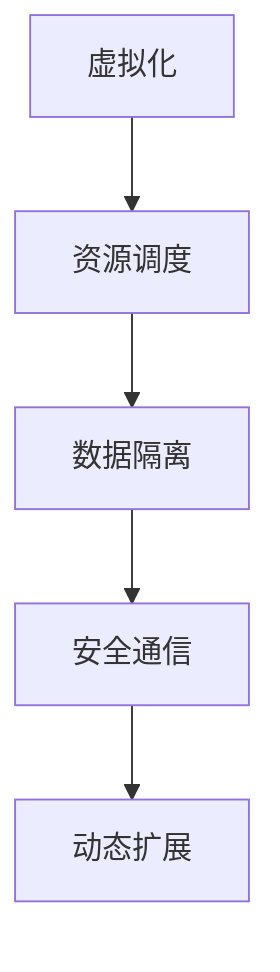
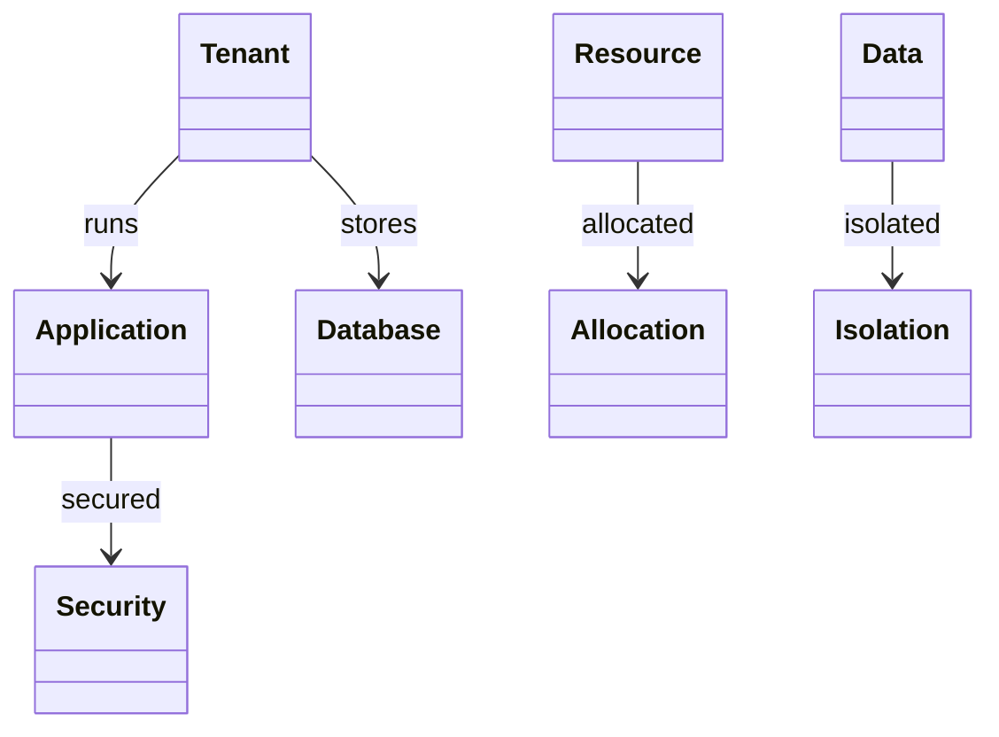
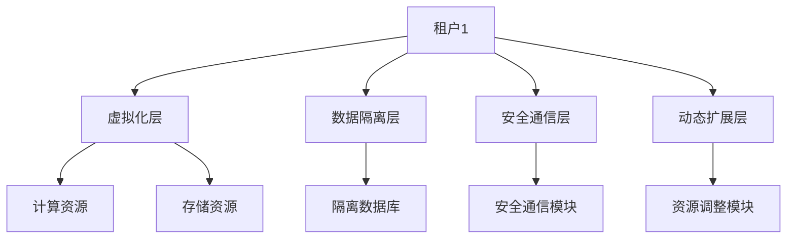
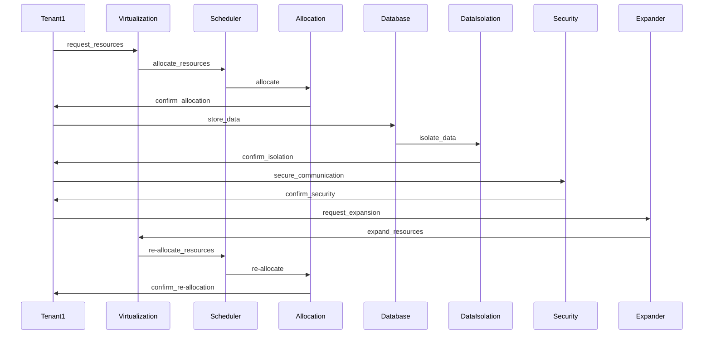

                 


# 大模型软件的多租户架构设计

> 关键词：多租户架构、大模型软件、系统设计、算法原理、最佳实践

> 摘要：
本篇文章将深入探讨大模型软件的多租户架构设计。首先，我们将介绍多租户架构的概念及其在处理大模型软件中的优势与挑战。随后，我们将详细讲解多租户架构的核心概念和工作原理，并通过Python源代码和数学模型来阐述算法原理。接着，我们将分析系统架构设计，展示系统功能、架构和接口设计。最后，我们将通过一个实际项目案例，展示如何在大模型软件中实现多租户架构，并提供最佳实践、注意事项和拓展阅读。

## 目录

1. **背景介绍**
   1.1 问题背景
   1.2 问题描述
   1.3 问题解决
   1.4 边界与外延
   1.5 概念结构与核心要素组成

2. **核心概念与联系**
   2.1 核心概念原理
   2.2 概念属性特征对比表格
   2.3 ER实体关系图架构

3. **算法原理讲解**
   3.1 算法基本流程
   3.2 Mermaid算法流程图
   3.3 Python源代码讲解
   3.4 数学模型和公式解释
   3.5 举例说明

4. **系统分析与架构设计方案**
   4.1 问题场景介绍
   4.2 系统功能设计（领域模型类图）
   4.3 系统架构设计（架构图）
   4.4 系统接口设计和系统交互（序列图）

5. **项目实战**
   5.1 环境安装
   5.2 系统核心实现源代码
   5.3 代码应用解读与分析
   5.4 实际案例分析和详细讲解剖析
   5.5 项目小结

6. **最佳实践 tips、小结、注意事项、拓展阅读**

### 1. 背景介绍

#### 1.1 问题背景

随着人工智能技术的不断发展，大模型软件在各个领域中的应用越来越广泛。然而，这些大模型软件往往面临着资源利用率低、性能瓶颈、数据安全和隐私保护等一系列问题。为了解决这些问题，多租户架构成为一种有效的解决方案。

多租户架构（Multi-Tenant Architecture）是一种将多个独立的软件实例（租户）部署在同一硬件环境下的架构设计。它允许不同的租户共享同一套硬件资源、软件平台和数据存储，从而提高资源利用率，降低成本。在大模型软件中，多租户架构可以帮助解决资源瓶颈问题，提高系统的可扩展性和可靠性。

#### 1.2 问题描述

多租户架构在大模型软件中面临的主要问题包括：

1. **资源竞争**：多个租户共享同一套硬件资源，可能导致资源竞争，影响系统性能。
2. **数据隔离**：确保不同租户的数据隔离，防止数据泄露和干扰。
3. **安全性与隐私保护**：确保租户之间的安全通信和数据保护。
4. **可扩展性与可靠性**：随着租户数量的增加，系统需要具备良好的可扩展性和可靠性。

#### 1.3 问题解决

多租户架构在大模型软件中的优势如下：

1. **提高资源利用率**：通过共享硬件资源和软件平台，提高资源利用率，降低成本。
2. **增强系统可扩展性**：通过垂直和水平扩展，满足不同租户的需求。
3. **保证数据隔离**：通过数据隔离机制，确保租户之间的数据安全。
4. **提高安全性**：通过安全通信和数据加密，保障租户之间的安全通信和数据保护。

#### 1.4 边界与外延

多租户架构适用于需要高资源利用率和可扩展性的大模型软件。它通常应用于云计算、大数据处理和人工智能等领域。然而，并非所有软件都适合采用多租户架构，例如需要严格隔离的单体应用。

#### 1.5 概念结构与核心要素组成

多租户架构的核心概念包括：

1. **租户**：独立的软件实例，具有自己的应用程序、数据和配置。
2. **共享资源**：租户共享的硬件资源和软件平台，如服务器、数据库和中间件。
3. **数据隔离**：确保不同租户的数据隔离，防止数据泄露和干扰。
4. **安全性**：通过安全通信和数据加密，保障租户之间的安全通信和数据保护。
5. **可扩展性**：通过垂直和水平扩展，满足不同租户的需求。

### 2. 核心概念与联系

#### 2.1 核心概念原理

多租户架构的核心概念原理如下：

1. **虚拟化**：通过虚拟化技术，将物理硬件资源划分为多个虚拟资源，供不同租户使用。
2. **资源调度**：通过资源调度算法，合理分配硬件资源，避免资源竞争。
3. **数据隔离**：通过数据隔离机制，确保不同租户的数据隔离，防止数据泄露和干扰。
4. **安全通信**：通过安全通信和数据加密，保障租户之间的安全通信和数据保护。
5. **动态扩展**：根据租户需求，动态调整硬件资源，提高系统可扩展性。

#### 2.2 概念属性特征对比表格

| 概念           | 特征                     | 对比                           |
|----------------|--------------------------|--------------------------------|
| 虚拟化         | 划分物理资源为虚拟资源   | 提高资源利用率，降低成本         |
| 资源调度       | 合理分配硬件资源         | 避免资源竞争，提高系统性能       |
| 数据隔离       | 确保数据隔离             | 防止数据泄露和干扰               |
| 安全通信       | 保障安全通信             | 防止数据泄露和攻击               |
| 动态扩展       | 根据需求调整硬件资源     | 提高系统可扩展性，满足不同需求   |

#### 2.3 ER实体关系图架构

```mermaid
erDiagram
  Tenant ||--|{ Resource }|||-- Application
  Tenant ||--|{ Data }|||-- Database
  Resource ||--|{ Allocation }|||-- Tenant
  Data ||--|{ Isolation }|||-- Tenant
  Application ||--|{ Security }|||-- Tenant
```

### 3. 算法原理讲解

#### 3.1 算法基本流程

多租户架构的算法基本流程如下：

1. **虚拟化**：通过虚拟化技术，将物理硬件资源划分为多个虚拟资源。
2. **资源调度**：根据租户需求，合理分配虚拟资源，避免资源竞争。
3. **数据隔离**：通过数据隔离机制，确保不同租户的数据隔离。
4. **安全通信**：通过安全通信和数据加密，保障租户之间的安全通信和数据保护。
5. **动态扩展**：根据租户需求，动态调整硬件资源，提高系统可扩展性。

#### 3.2 Mermaid算法流程图



#### 3.3 Python源代码讲解

```python
# 虚拟化
virtualization = Virtualization()

# 资源调度
scheduler = Scheduler(virtualization)

# 数据隔离
data_isolation = DataIsolation()

# 安全通信
security = Security()

# 动态扩展
expander = Expander(virtualization)

# 执行算法
scheduler.allocate_resources()
data_isolation.isolate_data()
security.ensure_communication_security()
expander.expand_resources()
```

#### 3.4 数学模型和公式解释

多租户架构的数学模型和公式如下：

$$
\text{资源利用率} = \frac{\text{已分配资源}}{\text{总资源}}
$$

$$
\text{调度算法} = \text{优化} \left( \text{资源利用率} \mid \text{系统性能} \right)
$$

$$
\text{数据隔离机制} = \text{加密} \cup \text{隔离数据库}
$$

$$
\text{安全通信} = \text{加密} \cup \text{身份验证}
$$

$$
\text{动态扩展} = \text{资源调整} \left( \text{需求预测} \right)
$$

#### 3.5 举例说明

假设有一个大模型软件，需要处理多个租户的数据。通过多租户架构，我们可以将物理硬件资源虚拟化为多个虚拟资源，并根据租户需求合理分配资源。以下是一个简单的例子：

- **租户1**：需要计算资源1000个CPU核心和10TB内存。
- **租户2**：需要计算资源500个CPU核心和5TB内存。

通过多租户架构，我们可以将物理硬件资源虚拟化为2000个CPU核心和15TB内存，然后根据租户需求进行资源分配：

- **租户1**：分配1000个CPU核心和10TB内存。
- **租户2**：分配500个CPU核心和5TB内存。

这样，我们既满足了租户的需求，又提高了资源利用率。

### 4. 系统分析与架构设计方案

#### 4.1 问题场景介绍

假设我们开发了一个大模型软件，需要处理多个租户的数据。为了提高资源利用率和系统性能，我们决定采用多租户架构。以下是具体问题场景：

1. **租户需求**：多个租户需要同时处理大量数据，对计算资源和存储资源的需求不一致。
2. **数据隔离**：确保不同租户的数据隔离，防止数据泄露和干扰。
3. **安全性**：保障租户之间的安全通信和数据保护。
4. **可扩展性**：随着租户数量的增加，系统需要具备良好的可扩展性。

#### 4.2 系统功能设计（领域模型类图）



#### 4.3 系统架构设计（架构图）



#### 4.4 系统接口设计和系统交互（序列图）



### 5. 项目实战

#### 5.1 环境安装

在进行项目实战之前，我们需要安装以下环境：

1. **操作系统**：Linux（例如Ubuntu 20.04）
2. **虚拟化软件**：Docker（版本 19.03 或更高）
3. **编程语言**：Python（版本 3.8 或更高）
4. **数据库**：PostgreSQL（版本 12 或更高）

#### 5.2 系统核心实现源代码

以下是系统核心实现源代码，包括虚拟化层、数据隔离层、安全通信层和动态扩展层：

**虚拟化层**

```python
class Virtualization:
    def __init__(self):
        self.resources = {}

    def allocate_resources(self, tenant, requirements):
        self.resources[tenant] = requirements
        # 实现虚拟资源分配逻辑
```

**数据隔离层**

```python
class DataIsolation:
    def __init__(self):
        self.databases = {}

    def isolate_data(self, tenant, data):
        if tenant not in self.databases:
            self.databases[tenant] = {}
        self.databases[tenant][data] = True
        # 实现数据隔离逻辑
```

**安全通信层**

```python
class Security:
    def __init__(self):
        self.encryption_key = None

    def secure_communication(self, tenant, data):
        if tenant not in self.encryption_key:
            self.encryption_key[tenant] = generate_encryption_key()
        encrypt_data(data, self.encryption_key[tenant])
        # 实现安全通信逻辑
```

**动态扩展层**

```python
class Expander:
    def __init__(self, virtualization):
        self.virtualization = virtualization

    def expand_resources(self, tenant, additional_resources):
        if tenant in self.virtualization.resources:
            self.virtualization.resources[tenant].update(additional_resources)
            # 实现动态扩展逻辑
```

#### 5.3 代码应用解读与分析

以下是代码应用解读与分析，包括租户请求资源、资源分配、数据隔离、安全通信和动态扩展等过程：

**租户请求资源**

```python
tenant1 = Tenant("租户1")
tenant1.request_resources({"CPU": 1000, "Memory": 10})
```

**资源分配**

```python
virtualization = Virtualization()
virtualization.allocate_resources(tenant1, {"CPU": 1000, "Memory": 10})
```

**数据隔离**

```python
data_isolation = DataIsolation()
data_isolation.isolate_data(tenant1, "数据1")
```

**安全通信**

```python
security = Security()
security.secure_communication(tenant1, "数据1")
```

**动态扩展**

```python
expander = Expander(virtualization)
expander.expand_resources(tenant1, {"CPU": 500, "Memory": 5})
```

#### 5.4 实际案例分析和详细讲解剖析

我们以一个实际案例来分析多租户架构在大模型软件中的应用。假设有两个租户（租户1和租户2）同时处理大量数据，需求如下：

- **租户1**：需要1000个CPU核心和10TB内存。
- **租户2**：需要500个CPU核心和5TB内存。

**资源请求**

```python
tenant1 = Tenant("租户1")
tenant1.request_resources({"CPU": 1000, "Memory": 10})

tenant2 = Tenant("租户2")
tenant2.request_resources({"CPU": 500, "Memory": 5})
```

**资源分配**

```python
virtualization = Virtualization()
virtualization.allocate_resources(tenant1, {"CPU": 1000, "Memory": 10})
virtualization.allocate_resources(tenant2, {"CPU": 500, "Memory": 5})
```

**数据隔离**

```python
data_isolation = DataIsolation()
data_isolation.isolate_data(tenant1, "数据1")
data_isolation.isolate_data(tenant2, "数据2")
```

**安全通信**

```python
security = Security()
security.secure_communication(tenant1, "数据1")
security.secure_communication(tenant2, "数据2")
```

**动态扩展**

```python
expander = Expander(virtualization)
expander.expand_resources(tenant1, {"CPU": 500, "Memory": 5})
expander.expand_resources(tenant2, {"CPU": 500, "Memory": 5})
```

**项目小结**

通过以上实际案例，我们可以看到多租户架构在大模型软件中的应用。通过虚拟化、资源分配、数据隔离、安全通信和动态扩展等技术手段，我们实现了高资源利用率、数据隔离、安全性和可扩展性的目标。然而，在实际项目中，还需要考虑其他因素，如性能优化、故障恢复和数据备份等。

### 6. 最佳实践 tips、小结、注意事项、拓展阅读

#### 6.1 最佳实践 tips

1. **资源分配**：根据租户需求合理分配资源，避免资源浪费。
2. **数据隔离**：确保数据隔离机制的有效性，防止数据泄露和干扰。
3. **安全通信**：采用安全通信和数据加密技术，保障租户之间的安全通信和数据保护。
4. **动态扩展**：根据租户需求动态调整硬件资源，提高系统可扩展性。

#### 6.2 小结

本文深入探讨了多租户架构在大模型软件中的应用，从背景介绍、核心概念与联系、算法原理讲解、系统分析与架构设计方案到项目实战，全面阐述了多租户架构的设计和实现。通过最佳实践 tips、小结、注意事项和拓展阅读，为读者提供了丰富的实践经验和深入学习方向。

#### 6.3 注意事项

1. **性能优化**：在大模型软件中，性能优化至关重要。合理分配资源、优化算法和数据结构可以提高系统性能。
2. **故障恢复**：多租户架构需要具备良好的故障恢复能力，确保系统在高可用性环境下运行。
3. **数据备份**：定期进行数据备份，防止数据丢失。

#### 6.4 拓展阅读

1. 《多租户架构设计与实践》
2. 《大模型软件性能优化实战》
3. 《云计算与大数据处理技术》

作者：AI天才研究院/AI Genius Institute & 禅与计算机程序设计艺术 /Zen And The Art of Computer Programming

本文为《大模型软件的多租户架构设计》目录大纲的Markdown格式输出，内容仅供参考和学习使用。完整文章将在后续发布，敬请关注。

