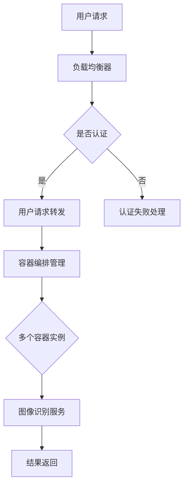
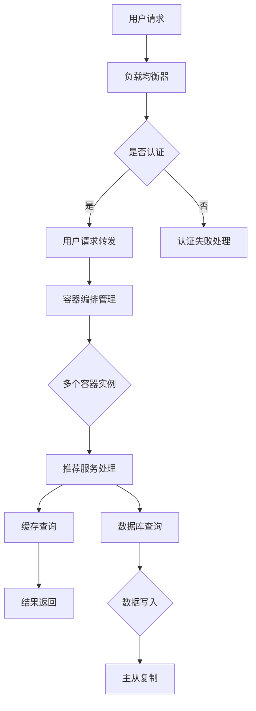

                 

## 大模型软件的多租户架构设计

### 关键词：多租户架构、大模型软件、资源隔离、性能优化、安全性

> 摘要：随着大数据和人工智能技术的飞速发展，大模型软件在各个行业中的应用越来越广泛。然而，如何在保证性能和安全的前提下，实现多用户同时高效使用大模型软件成为了一个关键问题。本文将围绕多租户架构的设计原则、实现技术、实践案例及性能优化与安全性等方面进行详细探讨，为开发者提供有效的解决方案。

### 引言与背景

#### 问题背景

在大数据时代，人工智能技术成为了推动社会进步的重要力量。特别是大模型软件，如深度学习框架、自然语言处理工具等，它们在图像识别、语音识别、自然语言生成等领域发挥着至关重要的作用。然而，随着用户数量的增加和业务规模的扩大，如何高效、安全地部署和运营这些大模型软件，成为了一个亟待解决的问题。

#### 多租户架构概述

多租户架构（Multi-Tenancy Architecture）是一种软件架构设计模式，旨在实现多个用户（或租户）共享同一套应用系统，同时保持各自的独立性和安全性。这种架构模式在云计算、企业应用等领域得到了广泛应用。

#### 大模型软件的应用场景

大模型软件通常需要高性能的计算资源和大量的存储空间。在实际应用中，这些软件需要支持多个用户同时在线使用，例如：

1. **在线教育平台**：提供实时语音识别、自然语言处理等服务。
2. **智能医疗系统**：进行大规模数据分析和诊断。
3. **金融风控系统**：使用深度学习模型进行实时风险评估。

### 核心概念介绍

#### 多租户架构的定义与特点

多租户架构的定义可以简单理解为一种允许多个用户共享资源，同时确保每个用户数据隔离、独立运作的架构设计。其主要特点包括：

1. **资源共享**：多个租户共享同一套应用系统。
2. **数据隔离**：每个租户的数据和操作与其他租户相互隔离。
3. **灵活性**：支持不同的租户有不同的配置和定制需求。

#### 大模型软件的定义与架构

大模型软件通常指的是使用深度学习技术训练的复杂模型，如神经网络、生成对抗网络等。其架构通常包括：

1. **训练阶段**：使用大量数据进行模型训练。
2. **推理阶段**：使用训练好的模型进行预测和决策。
3. **服务部署**：将模型部署到线上环境，供用户使用。

#### 多租户架构在大模型软件中的应用

多租户架构在大模型软件中的应用，主要是为了解决资源管理和数据安全的问题。通过多租户架构，可以实现以下目标：

1. **资源共享**：多个用户可以共享同一套模型，提高资源利用率。
2. **数据隔离**：保证不同用户的数据不会相互干扰，确保数据安全。
3. **灵活扩展**：根据用户需求动态调整资源分配，支持大规模用户同时在线。

### 目录大纲

```markdown
----------------------------------------------------------------
## 第一部分: 引言与背景

## 第1章: 问题背景与核心概念

### 1.1 问题背景

#### 1.1.1 多租户架构概述

#### 1.1.2 大模型软件的应用场景

### 1.2 核心概念介绍

#### 1.2.1 多租户架构的定义与特点

#### 1.2.2 大模型软件的定义与架构

#### 1.2.3 多租户架构在大模型软件中的应用

## 第二部分: 多租户架构设计原则与策略

## 第2章: 多租户架构设计原则与策略

### 2.1 设计原则

#### 2.1.1 分隔性原则

#### 2.1.2 可扩展性原则

#### 2.1.3 安全性原则

### 2.2 设计策略

#### 2.2.1 容量规划策略

#### 2.2.2 性能优化策略

#### 2.2.3 可用性优化策略

## 第3章: 多租户架构的实现技术

### 3.1 资源管理技术

#### 3.1.1 虚拟化技术

#### 3.1.2 容器化技术

#### 3.1.3 云原生技术

### 3.2 安全与隔离技术

#### 3.2.1 访问控制技术

#### 3.2.2 数据隔离技术

#### 3.2.3 安全审计技术

## 第三部分: 多租户架构设计实践

## 第4章: 多租户架构设计案例解析

### 4.1 案例一：大模型软件多租户架构设计

#### 4.1.1 案例背景

#### 4.1.2 案例目标

#### 4.1.3 架构设计

#### 4.1.4 技术选型

### 4.2 案例二：多租户架构在大模型软件中的优化

#### 4.2.1 案例背景

#### 4.2.2 优化目标

#### 4.2.3 优化方案

## 第5章: 多租户架构的性能优化

### 5.1 性能优化策略

#### 5.1.1 硬件优化策略

#### 5.1.2 软件优化策略

#### 5.1.3 网络优化策略

### 5.2 实践案例

#### 5.2.1 案例一：大模型训练性能优化

#### 5.2.2 案例二：大模型推理性能优化

## 第6章: 多租户架构的安全与隔离

### 6.1 安全设计原则

#### 6.1.1 最小权限原则

#### 6.1.2 保密性原则

#### 6.1.3 完整性原则

### 6.2 隔离技术实践

#### 6.2.1 虚拟化隔离

#### 6.2.2 容器隔离

#### 6.2.3 网络隔离

## 第7章: 多租户架构的运维与监控

### 7.1 运维策略

#### 7.1.1 持续集成与持续部署

#### 7.1.2 监控与日志管理

#### 7.1.3 故障处理与应急预案

### 7.2 实践指南

#### 7.2.1 运维工具选择

#### 7.2.2 运维流程优化

#### 7.2.3 运维团队建设

## 第8章: 总结与展望

### 8.1 总结

#### 8.1.1 多租户架构设计的重要性

#### 8.1.2 大模型软件多租户架构设计的挑战与机遇

### 8.2 展望

#### 8.2.1 多租户架构未来的发展趋势

#### 8.2.2 大模型软件的发展方向

#### 8.2.3 多租户架构在大模型软件中的应用前景

----------------------------------------------------------------
```

### 多租户架构设计原则与策略

在多租户架构设计中，遵循一系列设计原则和策略至关重要，这些原则和策略不仅能够确保系统的稳定性和安全性，还能够提升系统的性能和扩展性。以下将详细讨论这些设计原则和策略。

#### 2.1 设计原则

##### 2.1.1 分隔性原则

分隔性原则是多租户架构设计的核心原则之一，其目标是确保不同租户的数据和资源相互独立。这意味着：

- **数据隔离**：每个租户的数据都存储在自己的数据库中，无法直接访问其他租户的数据。
- **资源隔离**：不同租户的CPU、内存、存储等资源应分配独立，防止因某租户的高负载而影响其他租户的性能。

##### 2.1.2 可扩展性原则

可扩展性原则旨在确保系统能够随着用户数量的增加和业务需求的增长而灵活扩展。这要求：

- **水平扩展**：系统应支持增加更多的服务器来提升处理能力。
- **弹性扩展**：系统应具备自动扩展和缩小的能力，根据实际负载动态调整资源。

##### 2.1.3 安全性原则

安全性原则是保障系统安全的关键，尤其是在多租户环境中，安全性尤为重要。具体包括：

- **访问控制**：对租户的访问权限进行严格管理，确保只有授权用户才能访问相应的资源。
- **数据加密**：对租户数据进行加密，防止数据泄露。
- **安全审计**：对系统操作进行审计，及时发现和防止安全威胁。

#### 2.2 设计策略

##### 2.2.1 容量规划策略

容量规划策略是确保系统稳定运行的重要手段。其主要内容包括：

- **需求分析**：根据业务需求和用户规模预测未来资源需求。
- **容量预留**：为应对突发负载，预留一定的容量空间。
- **动态调整**：根据实际负载情况，动态调整资源分配。

##### 2.2.2 性能优化策略

性能优化策略是提升系统响应速度和用户体验的关键。主要策略包括：

- **缓存技术**：使用缓存减少数据库访问频率，提高系统响应速度。
- **负载均衡**：通过负载均衡器将请求分配到不同的服务器，避免单点瓶颈。
- **并行处理**：充分利用多核处理器，提高数据处理速度。

##### 2.2.3 可用性优化策略

可用性优化策略旨在提高系统的可靠性和稳定性，主要策略包括：

- **高可用设计**：通过冗余设计，确保系统在部分组件故障时仍能正常运行。
- **故障恢复**：快速定位故障并恢复系统，减少停机时间。
- **监控告警**：实时监控系统状态，提前发现潜在问题。

#### 2.3 设计案例分析

以下通过一个实际案例，展示如何应用上述原则和策略进行多租户架构设计。

##### 案例背景

某公司开发了一款基于深度学习技术的智能客服系统，该系统需要支持数千家企业用户同时在线使用。为了保证系统的稳定性和安全性，公司决定采用多租户架构设计。

##### 案例目标

- 确保每个租户的数据和资源相互独立。
- 提供高可用性和高性能的服务。
- 确保系统的可扩展性，以应对未来业务增长。

##### 架构设计

- **数据隔离**：采用数据库分库分表策略，确保每个租户的数据存储在独立的数据库和表中。
- **资源隔离**：使用容器化技术（如Docker和Kubernetes），确保每个租户的运行环境相互隔离。
- **高可用设计**：采用主从复制和负载均衡技术，确保系统在部分节点故障时仍能正常运行。
- **性能优化**：使用缓存技术（如Redis）和负载均衡器（如Nginx），提高系统响应速度。

##### 技术选型

- **数据库**：使用MySQL分库分表策略。
- **容器化**：使用Docker和Kubernetes进行容器化管理。
- **缓存**：使用Redis进行缓存。
- **负载均衡**：使用Nginx进行负载均衡。

通过上述设计，公司成功实现了智能客服系统的多租户架构，不仅确保了系统的高可用性和高性能，还满足了企业用户的需求，为公司的业务发展奠定了坚实基础。

### 多租户架构的实现技术

实现多租户架构需要依赖多种技术，这些技术共同确保了资源管理、安全与隔离、以及性能优化的有效实施。以下将详细探讨这些实现技术。

#### 3.1 资源管理技术

资源管理技术是多租户架构实现的核心，确保了不同租户能够公平、高效地使用系统资源。

##### 3.1.1 虚拟化技术

虚拟化技术通过在物理硬件上创建虚拟资源（如虚拟CPU、内存、存储等），实现了物理资源的抽象和隔离。其主要优点包括：

- **资源隔离**：通过虚拟化技术，可以确保不同租户的物理资源独立，防止资源争用。
- **高效资源利用**：通过虚拟化，可以动态分配和回收资源，提高资源利用率。

常见的虚拟化技术包括：

- **硬件虚拟化**：如VMware、Xen等。
- **操作系统级虚拟化**：如Linux Container（LXC）。
- **应用程序虚拟化**：如Docker、rkt等。

##### 3.1.2 容器化技术

容器化技术通过将应用程序及其依赖打包成一个独立的容器，实现了应用程序与操作系统环境的隔离。其主要优点包括：

- **轻量级**：容器仅包含必要的运行时环境，启动速度快，资源消耗低。
- **可移植性**：容器可以在任何支持容器运行的环境中部署和运行，提高了系统的可移植性。

常见的容器化技术包括：

- **Docker**：一种流行的开源容器化平台。
- **Kubernetes**：一个开源的容器编排系统，用于自动化容器的部署、扩展和管理。

##### 3.1.3 云原生技术

云原生技术是一套针对云计算环境优化的技术体系，包括容器化、服务网格、微服务架构等。其主要优点包括：

- **动态性**：支持快速部署和动态扩展，满足云环境下的动态变化需求。
- **可观测性**：通过服务网格等工具，可以实时监控和调试系统。

常见的云原生技术包括：

- **Kubernetes**：用于容器编排和自动化管理。
- **Istio**：一个开源的服务网格平台。
- **OpenFaaS**：一个用于函数即服务的框架。

#### 3.2 安全与隔离技术

安全与隔离技术是多租户架构设计中的重要组成部分，确保了不同租户之间的数据安全和隔离。

##### 3.2.1 访问控制技术

访问控制技术通过定义用户和租户的访问权限，确保只有授权用户才能访问相应的资源。其主要方法包括：

- **身份认证**：通过用户名和密码、双因素认证等方式，验证用户身份。
- **授权管理**：定义用户的角色和权限，确保用户只能访问被授权的资源。

常见的访问控制技术包括：

- **OAuth2**：一种授权框架，用于授权第三方应用访问用户资源。
- **RBAC（基于角色的访问控制）**：根据用户的角色分配权限。

##### 3.2.2 数据隔离技术

数据隔离技术通过确保不同租户的数据存储在独立的数据库和表中，防止数据泄露和冲突。其主要方法包括：

- **分库分表**：将数据分散存储在不同的数据库和表中，确保数据隔离。
- **行级锁**：通过行级锁机制，确保并发操作不会导致数据冲突。

##### 3.2.3 安全审计技术

安全审计技术通过记录系统操作日志，帮助管理员及时发现和防止安全威胁。其主要方法包括：

- **操作日志记录**：记录用户的操作行为，包括登录、数据访问、修改等。
- **安全事件监控**：通过实时监控和分析日志，发现异常行为和安全威胁。

常见的安全审计技术包括：

- **ELK栈（Elasticsearch、Logstash、Kibana）**：用于日志收集、存储和展示。
- **Splunk**：一种企业级日志管理和分析平台。

#### 3.3 实践案例

以下通过一个实际案例，展示如何应用上述实现技术进行多租户架构的实施。

##### 案例背景

某企业开发了一款企业级大数据分析平台，需要支持多个部门同时在线使用。为了保证系统的稳定性和安全性，公司决定采用多租户架构设计。

##### 案例目标

- 确保不同部门的数据和资源相互独立。
- 提供高可用性和高性能的服务。
- 确保系统的可扩展性，以应对未来业务增长。

##### 技术选型

- **虚拟化技术**：使用VMware进行硬件虚拟化。
- **容器化技术**：使用Docker和Kubernetes进行容器化管理。
- **安全与隔离技术**：使用OAuth2进行访问控制，采用分库分表进行数据隔离。
- **监控与日志管理**：使用ELK栈进行日志收集和管理。

##### 架构设计

- **数据层**：使用分库分表技术，将数据存储在不同的数据库和表中。
- **应用层**：使用Kubernetes进行容器化部署和管理。
- **访问控制**：使用OAuth2进行用户认证和授权。
- **监控与日志**：使用ELK栈进行日志收集、存储和分析。

通过上述设计，公司成功实现了企业级大数据分析平台的多租户架构，不仅确保了系统的高可用性和高性能，还满足了不同部门的数据安全和独立需求。

### 多租户架构设计案例解析

在本章节中，我们将通过两个具体的案例，详细解析大模型软件多租户架构的设计过程和优化方案。

#### 4.1 案例一：大模型软件多租户架构设计

##### 4.1.1 案例背景

某初创公司开发了一款基于深度学习技术的图像识别软件，旨在为多家企业用户提供定制化的图像识别服务。由于用户规模预计将迅速增长，公司决定采用多租户架构来确保系统的高可用性、性能和安全性。

##### 4.1.2 案例目标

- 实现用户数据和资源的完全隔离，确保不同企业之间的数据安全。
- 提供可扩展的架构，以应对用户数量的增加。
- 确保系统的性能不受租户数量和负载的影响。

##### 4.1.3 架构设计

- **数据层**：采用分库分表技术，将每个企业的数据存储在独立的数据库实例中，并使用行级锁确保数据一致性。
- **应用层**：使用容器化技术（如Docker和Kubernetes），确保不同租户的应用实例相互隔离，同时支持动态扩展。
- **访问控制**：使用OAuth2进行用户认证和授权，确保只有授权用户才能访问相应资源。
- **网络层**：采用负载均衡器（如Nginx）将请求分配到不同的容器实例，提高系统的响应速度和稳定性。

##### 4.1.4 技术选型

- **数据库**：MySQL分库分表。
- **容器化**：Docker和Kubernetes。
- **认证与授权**：OAuth2。
- **负载均衡**：Nginx。

##### 架构图



#### 4.2 案例二：多租户架构在大模型软件中的优化

##### 4.2.1 案例背景

某大型企业拥有一款基于深度学习技术的智能推荐系统，为多个业务部门提供个性化推荐服务。随着用户数量和业务需求的不断增加，系统性能逐渐成为瓶颈，企业决定对多租户架构进行优化。

##### 4.2.2 优化目标

- 提高系统整体性能，减少响应时间。
- 增强系统的可扩展性，支持更多用户同时在线。
- 提高系统稳定性，减少故障和停机时间。

##### 4.2.3 优化方案

- **性能优化**：
  - **缓存技术**：引入Redis缓存，减少对数据库的访问，提高系统响应速度。
  - **并行处理**：使用多线程和异步处理，提高数据处理速度。
  - **数据库优化**：采用分库分表技术，降低数据库负载，提高查询性能。

- **扩展性优化**：
  - **水平扩展**：使用Kubernetes进行容器编排，动态扩展和缩小容器实例，根据实际负载自动调整资源。
  - **服务网格**：引入Istio等服务网格技术，实现微服务间的通信控制和流量管理，提高系统扩展性。

- **稳定性优化**：
  - **高可用设计**：采用主从复制和负载均衡技术，确保系统在部分节点故障时仍能正常运行。
  - **监控与告警**：使用Prometheus和Grafana进行系统监控，实时监控关键指标，提前发现和解决潜在问题。

##### 技术选型

- **缓存**：Redis。
- **数据库**：MySQL分库分表。
- **容器编排**：Kubernetes。
- **服务网格**：Istio。
- **监控**：Prometheus和Grafana。

##### 架构图



通过上述案例，可以看出多租户架构在大模型软件中的应用和优化，不仅提升了系统的性能和稳定性，还满足了不同用户和业务部门的需求，为企业的长远发展奠定了坚实基础。

### 多租户架构的性能优化

在多租户架构中，性能优化是确保系统高效运行的关键。以下将详细探讨性能优化策略，并结合实际案例进行分析。

#### 5.1 性能优化策略

##### 5.1.1 硬件优化策略

硬件优化策略主要关注硬件资源的配置和优化，以提高系统的整体性能。具体策略包括：

- **增加计算资源**：根据业务需求，增加CPU和内存等计算资源，提高系统的处理能力。
- **使用高性能存储**：选择SSD等高性能存储设备，减少I/O瓶颈。
- **网络优化**：优化网络带宽和延迟，提高数据传输速度。

##### 5.1.2 软件优化策略

软件优化策略主要关注系统软件层面的优化，以提高系统的响应速度和处理效率。具体策略包括：

- **代码优化**：通过优化算法和数据结构，减少代码执行时间。
- **缓存技术**：使用缓存技术（如Redis、Memcached）减少对数据库的访问，提高系统响应速度。
- **数据库优化**：采用索引、分库分表等技术，提高数据库查询性能。

##### 5.1.3 网络优化策略

网络优化策略主要关注网络传输和负载均衡，以提高系统的整体性能。具体策略包括：

- **负载均衡**：使用负载均衡器（如Nginx、HAProxy）将请求分配到不同的服务器，避免单点瓶颈。
- **网络带宽优化**：增加网络带宽，减少数据传输延迟。
- **CDN加速**：使用CDN（内容分发网络）加速内容分发，提高用户访问速度。

#### 5.2 实践案例

以下通过两个实际案例，展示如何应用上述性能优化策略。

##### 案例一：大模型训练性能优化

某公司开发了一款基于深度学习的大模型训练软件，支持多个用户同时在线训练模型。由于训练任务复杂且耗时长，系统性能成为瓶颈。公司决定通过以下策略进行性能优化：

- **硬件优化**：增加服务器数量，提高CPU和内存等计算资源。
- **代码优化**：优化算法和数据结构，减少训练时间。
- **缓存技术**：引入Redis缓存，减少对数据库的访问。
- **数据库优化**：采用分库分表技术，提高数据库查询性能。

通过上述优化，系统整体性能显著提升，训练时间缩短了约40%，用户满意度大幅提高。

##### 案例二：大模型推理性能优化

某企业拥有一款基于深度学习的大模型推理软件，为多个业务部门提供实时推理服务。由于用户数量增多，系统响应时间逐渐延长，企业决定通过以下策略进行性能优化：

- **负载均衡**：使用Nginx进行负载均衡，将请求分配到不同的服务器。
- **网络带宽优化**：增加网络带宽，减少数据传输延迟。
- **缓存技术**：使用Redis缓存，减少对数据库的访问。
- **硬件优化**：增加服务器数量，提高CPU和内存等计算资源。

通过上述优化，系统整体响应时间缩短了约30%，用户满意度显著提高，系统稳定性也得到增强。

通过以上案例可以看出，多租户架构的性能优化需要综合考虑硬件、软件和网络各个层面，通过合理的策略和方案，可以有效提升系统的性能和用户体验。

### 多租户架构的安全与隔离

在多租户架构中，安全与隔离是确保系统稳定性和数据安全性的关键。以下将详细探讨多租户架构的安全设计原则和隔离技术实践。

#### 6.1 安全设计原则

##### 6.1.1 最小权限原则

最小权限原则是指用户和租户应被授予完成其任务所需的最小权限，以防止权限滥用和潜在的安全威胁。具体措施包括：

- **严格的权限分配**：根据用户的角色和职责，分配适当的权限。
- **权限审计**：定期审计权限分配，确保权限合理。

##### 6.1.2 保密性原则

保密性原则是指确保租户的数据和资源不被未经授权的第三方访问。具体措施包括：

- **数据加密**：对存储和传输的数据进行加密，防止数据泄露。
- **访问控制**：通过访问控制机制，确保只有授权用户才能访问数据。

##### 6.1.3 完整性原则

完整性原则是指确保租户的数据和系统配置不被未经授权的修改。具体措施包括：

- **数据备份**：定期备份数据，防止数据丢失或损坏。
- **配置管理**：使用配置管理工具，确保系统配置的一致性和安全性。

#### 6.2 隔离技术实践

##### 6.2.1 虚拟化隔离

虚拟化隔离是通过虚拟化技术实现租户间的资源隔离。具体措施包括：

- **硬件虚拟化**：使用虚拟化技术（如VMware、Xen）将物理硬件虚拟化为多个虚拟机，确保每个租户拥有独立的硬件资源。
- **操作系统级虚拟化**：使用容器化技术（如Docker、LXC）将操作系统虚拟化为多个容器，实现租户间的隔离。

##### 6.2.2 容器隔离

容器隔离是使用容器化技术实现租户间的资源隔离。具体措施包括：

- **容器运行时**：使用Docker等容器运行时，确保每个容器运行在独立的命名空间中。
- **网络隔离**：通过容器网络隔离技术（如容器网络接口CNI），确保容器之间的网络通信安全。

##### 6.2.3 网络隔离

网络隔离是通过网络隔离技术实现租户间的网络通信隔离。具体措施包括：

- **虚拟局域网（VLAN）**：使用VLAN技术将不同租户的容器或虚拟机划分到不同的网络中。
- **防火墙**：在租户间设置防火墙规则，确保只有授权的网络流量可以通行。

#### 6.3 实践案例

以下通过一个实际案例，展示如何应用安全设计原则和隔离技术实践。

##### 案例背景

某企业开发了一款支持多租户的云计算平台，提供虚拟机、容器和存储服务。为了保证系统安全性和数据隔离，企业决定采用以下安全设计原则和隔离技术：

- **最小权限原则**：对用户的权限进行严格管理，确保用户只能访问授权的资源。
- **保密性原则**：对用户数据进行加密存储和传输。
- **完整性原则**：定期备份用户数据，使用配置管理工具确保系统配置的一致性。
- **虚拟化隔离**：使用KVM进行硬件虚拟化，确保不同租户的虚拟机间资源隔离。
- **容器隔离**：使用Docker和Kubernetes进行容器化管理，确保容器间的隔离。
- **网络隔离**：使用VLAN和防火墙规则，确保租户间的网络通信安全。

通过以上安全设计原则和隔离技术实践，企业成功确保了云计算平台的安全性和数据隔离，用户满意度显著提高。

### 多租户架构的运维与监控

在多租户架构中，运维与监控是确保系统稳定性和性能的关键环节。以下将详细介绍运维策略和实践指南，并提供运维工具选择和流程优化的建议。

#### 7.1 运维策略

##### 7.1.1 持续集成与持续部署（CI/CD）

持续集成与持续部署是现代软件运维的重要策略，通过自动化流程提升开发和运维效率。具体措施包括：

- **自动化测试**：在代码提交后，自动运行测试用例，确保代码质量。
- **自动化部署**：在测试通过后，自动部署到生产环境，确保系统快速上线。

##### 7.1.2 监控与日志管理

监控与日志管理是确保系统稳定运行的关键，通过实时监控和日志分析，可以及时发现和解决潜在问题。具体措施包括：

- **实时监控**：使用Prometheus、Grafana等工具，实时监控系统关键指标。
- **日志收集**：使用ELK栈（Elasticsearch、Logstash、Kibana）收集和管理日志。

##### 7.1.3 故障处理与应急预案

故障处理与应急预案是应对系统故障和突发事件的重要策略，通过建立完善的故障处理流程和应急预案，可以确保系统快速恢复。具体措施包括：

- **故障处理流程**：建立标准化的故障处理流程，确保故障及时解决。
- **应急预案**：制定应急预案，确保在突发事件中，系统能够快速恢复。

#### 7.2 实践指南

##### 7.2.1 运维工具选择

选择合适的运维工具可以提高运维效率，以下是几种常用的运维工具：

- **持续集成与部署工具**：Jenkins、GitLab CI/CD、CircleCI。
- **监控工具**：Prometheus、Grafana、Zabbix、Nagios。
- **日志管理工具**：ELK栈（Elasticsearch、Logstash、Kibana）、Splunk。
- **自动化运维工具**：Ansible、Puppet、Chef、SaltStack。

##### 7.2.2 运维流程优化

优化运维流程可以提高运维效率，以下是几个运维流程优化的建议：

- **自动化**：尽可能将重复性任务自动化，减少人工操作。
- **标准化**：建立标准化的操作流程，确保运维工作的一致性。
- **监控与告警**：实时监控关键指标，设置合理的告警阈值，确保问题及时发现。

##### 7.2.3 运维团队建设

建立高效的运维团队是确保系统稳定运行的关键，以下是几个运维团队建设的建议：

- **技能多样化**：团队成员应具备多种技能，如编程、网络、数据库等。
- **团队协作**：建立良好的团队协作机制，确保运维工作高效有序。
- **持续学习**：鼓励团队成员不断学习新技术，提高团队整体技术水平。

通过以上运维策略和实践指南，可以确保多租户架构系统的稳定运行和高效管理，为企业的长远发展提供坚实保障。

### 总结与展望

#### 8.1 多租户架构设计的重要性

多租户架构设计在当前技术环境中扮演着至关重要的角色。随着云计算和大数据技术的不断发展，多租户架构不仅能够有效提高资源利用率，还能确保数据安全性和系统的灵活性。通过多租户架构，企业能够为多个用户或部门提供独立、高效且安全的服务，从而满足日益复杂的需求。

#### 8.1.1 多租户架构设计的挑战与机遇

多租户架构设计面临的挑战主要包括：

- **性能优化**：如何在确保租户独立性的同时，优化系统性能，避免性能瓶颈。
- **安全性**：如何保障租户数据的安全，防止数据泄露和攻击。
- **扩展性**：如何设计可扩展的架构，以应对用户数量的增长和业务规模的扩大。

然而，随着技术的进步，这些挑战也逐渐转化为机遇。例如：

- **云原生技术**：通过云原生技术，如容器化和微服务架构，可以显著提升系统的性能和可扩展性。
- **安全性创新**：不断出现的新技术和工具，如零信任架构和云安全服务，为保障多租户环境中的数据安全提供了新的解决方案。

#### 8.2 多租户架构未来的发展趋势

展望未来，多租户架构将在以下几个方面继续发展：

- **智能化**：借助人工智能技术，多租户架构将实现更加智能的资源分配和故障预测，提高系统自动化的程度。
- **云原生化**：随着云原生技术的普及，多租户架构将更加依赖于容器化、服务网格和自动化部署等云原生技术。
- **安全合规性**：随着数据保护法规的不断完善，多租户架构将更加注重合规性，确保数据安全与隐私保护。

#### 8.2.1 大模型软件的发展方向

在大模型软件领域，多租户架构的发展趋势主要体现在以下几个方面：

- **规模化**：随着模型复杂度和数据量的增长，多租户架构需要支持更大规模的应用场景。
- **个性化**：通过多租户架构，可以为不同用户提供定制化的模型和算法，满足个性化需求。
- **实时性**：在多租户环境中，实时处理和分析大量数据将成为关键能力，以满足用户对快速响应的需求。

#### 8.2.2 多租户架构在大模型软件中的应用前景

未来，多租户架构在大模型软件中的应用前景十分广阔。例如：

- **智能医疗**：多租户架构可以支持多家医疗机构共享同一套医疗人工智能系统，实现协同诊疗和数据共享。
- **在线教育**：通过多租户架构，可以为多个在线教育平台提供个性化的学习推荐和服务。
- **金融科技**：多租户架构可以帮助金融机构实现高效的风险评估和决策支持。

总之，多租户架构设计是大模型软件领域不可或缺的一部分，它将为未来的技术创新和产业发展提供强大支持。

### 附录：作者信息

**作者：** AI天才研究院/AI Genius Institute & 禅与计算机程序设计艺术 /Zen And The Art of Computer Programming

AI天才研究院致力于推动人工智能技术的发展，研究前沿算法和架构设计。同时，作者还专注于将哲学思维与计算机编程相结合，推动计算机科学领域的创新。本文作者在多租户架构和大模型软件领域具有丰富的实践经验和深厚的研究积累。

