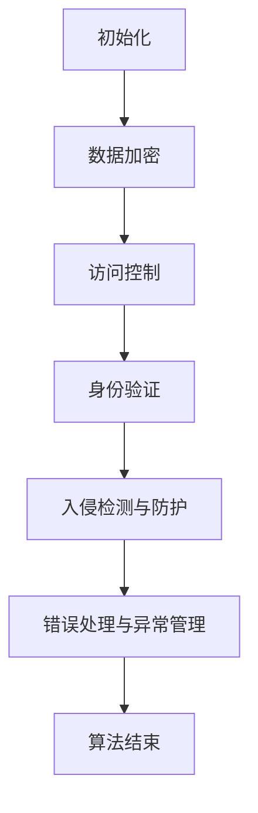
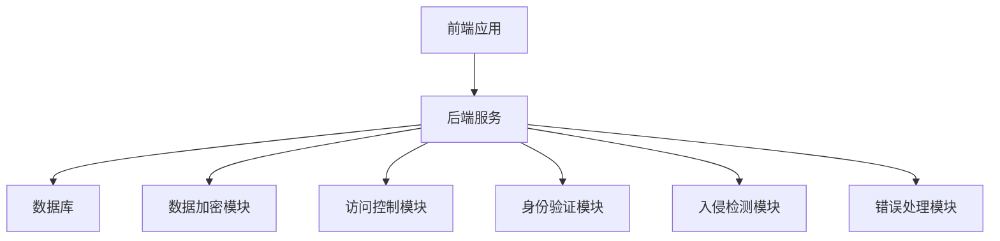
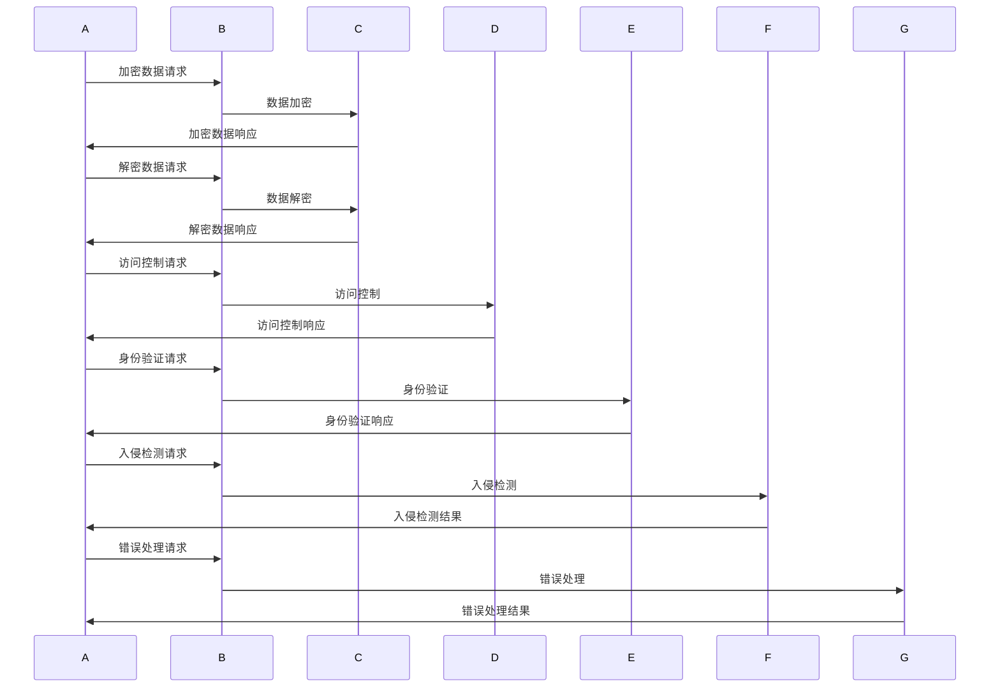
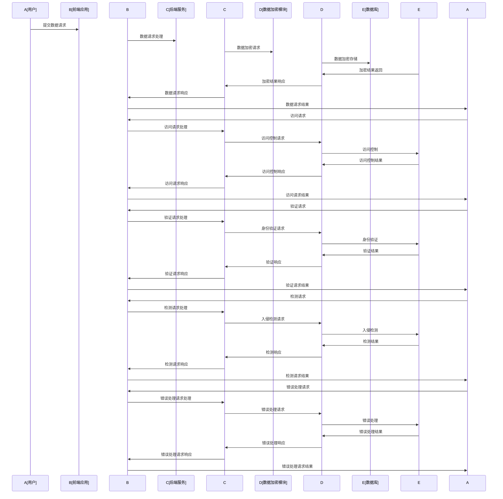

                 

### 大模型软件的安全性设计模式

在当今高度数字化的时代，人工智能（AI）大模型在软件中的应用越来越广泛。这些大模型，如深度学习模型、生成对抗网络（GANs）和自然语言处理（NLP）模型，极大地提升了软件的智能化程度，为各个行业带来了巨大的变革。然而，随着大模型在软件中的深度应用，它们所面临的安全挑战也逐渐显现出来。本文将探讨大模型软件的安全性设计模式，以解决这些问题，并确保软件的安全性和可靠性。

关键词：大模型、软件安全性、设计模式、算法原理、应用案例

摘要：本文首先介绍了大模型在软件中的应用背景及其面临的严峻安全挑战。接着，我们探讨了安全性设计模式的概念及其核心要素，重点分析了大模型与安全性设计模式之间的联系。随后，文章详细讲解了安全性设计模式算法原理，并通过Python源代码进行阐述。此外，本文还通过实际应用案例，展示了如何将安全性设计模式应用于实际项目中，确保软件的安全性。最后，文章总结了项目经验，并对未来的发展趋势进行了展望。

## 第一部分：引言

### 第1章：问题背景与概述

#### 1.1 问题背景

随着深度学习、生成对抗网络（GANs）和自然语言处理（NLP）等技术的飞速发展，大模型在软件中的应用变得愈发广泛。例如，在金融领域，大模型被用于风险控制、市场预测和客户服务；在医疗领域，大模型用于疾病诊断、治疗方案推荐和医学研究；在制造业，大模型用于生产优化、质量检测和故障预测。然而，这些大模型在带来巨大价值的同时，也面临诸多安全挑战。

大模型面临的安全挑战主要包括：

1. **数据隐私泄露**：大模型通常需要大量的训练数据，这些数据可能包含敏感信息，如个人身份信息、医疗记录和财务信息。如果数据泄露，将对个人和组织造成严重损失。
2. **模型窃取与逆向工程**：大模型的价值使其成为攻击者的目标。攻击者可能试图窃取模型或逆向工程模型，以获取商业利益。
3. **恶意注入与对抗攻击**：攻击者可能通过恶意注入或对抗攻击，使得大模型产生错误的预测或决策。
4. **模型崩溃与系统稳定性**：大模型可能在特定输入下崩溃，导致系统不稳定，甚至引发严重事故。

#### 1.2 问题描述

大模型软件面临的安全问题种类繁多，主要包括以下几个方面：

1. **数据安全问题**：涉及数据隐私泄露、数据篡改和数据破坏。
2. **模型安全问题**：包括模型窃取、模型逆向工程、模型欺骗和模型崩溃。
3. **系统安全问题**：涉及系统被攻击、系统崩溃和系统瘫痪。

这些问题对软件的影响极大，可能导致以下后果：

1. **经济损失**：数据泄露、模型窃取等可能导致巨大的经济损失。
2. **声誉损失**：安全事件可能导致用户信任度下降，对组织声誉造成损害。
3. **业务中断**：系统崩溃可能导致业务中断，影响组织运营。

#### 1.3 问题解决

为了解决大模型软件面临的安全问题，安全性设计模式应运而生。安全性设计模式是一组基于最佳实践的安全措施，旨在确保大模型软件的安全性。这些设计模式包括：

1. **数据加密与加密算法**：对敏感数据进行加密，确保数据在传输和存储过程中不会被窃取。
2. **访问控制与权限管理**：通过权限管理，确保只有授权用户才能访问敏感数据和功能。
3. **身份验证与认证机制**：确保用户身份的真实性，防止未授权访问。
4. **入侵检测与防护**：通过监测系统行为，及时发现并阻止恶意行为。
5. **错误处理与异常管理**：确保系统在遇到异常情况时能够正确处理，避免系统崩溃。

安全性设计模式的目标是：

1. **保护数据隐私**：确保敏感数据不被未经授权的访问和泄露。
2. **保障模型安全**：防止模型被窃取、逆向工程和恶意攻击。
3. **确保系统稳定**：在面临恶意攻击时，系统仍能正常运行，避免业务中断。

#### 1.4 边界与外延

安全性设计模式主要适用于以下场景：

1. **涉及敏感数据处理的软件系统**：如金融、医疗和政府等行业。
2. **需要高度可靠性和安全性的软件系统**：如自动驾驶系统、智能医疗设备和关键基础设施控制系统。

然而，安全性设计模式并非适用于所有场景。在以下情况下，安全性设计模式可能不适用：

1. **非敏感数据处理**：对于不涉及敏感数据的场景，安全性设计模式可能过于复杂和冗余。
2. **资源受限的环境**：在资源受限的环境中，如嵌入式系统和物联网设备，安全性设计模式可能无法实施。
3. **高度动态的环境**：在需要快速响应和高度灵活性的场景中，如实时交易系统和分布式计算环境，安全性设计模式可能过于复杂。

#### 1.5 概念结构与核心要素组成

安全性设计模式是一组由概念、原则和具体实现方法组成的结构化体系。其核心要素包括：

1. **数据安全**：涉及数据加密、访问控制和数据备份等。
2. **模型安全**：包括模型加密、访问控制和模型保护等。
3. **系统安全**：涉及入侵检测、防护和异常管理。
4. **身份验证与认证**：包括用户身份验证、认证协议和权限管理。
5. **审计与监控**：涉及日志记录、审计和监控系统行为。

这些核心要素相互关联，共同构建了一个完整的安全体系，以保障大模型软件的安全性。安全性设计模式的基本结构如图1-1所示。


### 第2章：核心概念与联系

#### 2.1 AI大模型基本概念

AI大模型是指具有大规模参数和复杂结构的机器学习模型。它们通常使用海量数据进行训练，以实现高性能的预测和决策能力。大模型的基本概念包括：

1. **深度学习**：一种使用多层神经网络进行训练和学习的技术，具有强大的特征提取和表示能力。
2. **生成对抗网络（GANs）**：由生成器和判别器组成的对抗性学习框架，用于生成高质量的数据。
3. **自然语言处理（NLP）**：使用机器学习技术处理和生成自然语言，包括语言理解、语言生成和语言翻译等。

大模型的特点包括：

1. **大规模参数**：大模型通常包含数百万至数十亿个参数，具有极高的计算复杂度。
2. **海量数据训练**：大模型需要使用海量数据进行训练，以提高预测精度和泛化能力。
3. **高计算资源需求**：大模型训练和推理需要大量的计算资源和存储空间。
4. **强大的学习能力**：大模型具有强大的特征提取和表示能力，能够从数据中自动学习复杂的模式和规律。

#### 2.2 安全性设计模式基本概念

安全性设计模式是一组用于解决特定安全问题的通用解决方案。它们通常遵循一些基本原则，如最小权限原则、防御深度原则和故障容错原则。安全性设计模式的基本概念包括：

1. **最小权限原则**：系统组件应仅拥有执行其任务所需的最低权限，以减少潜在的攻击面。
2. **防御深度原则**：系统应采用多层次的安全措施，以增加攻击者攻击的难度和成本。
3. **故障容错原则**：系统应具备故障恢复和容错能力，以应对可能出现的异常情况和攻击。

安全性设计模式的特点包括：

1. **通用性**：安全性设计模式适用于多种不同的安全场景，具有广泛的适用性。
2. **结构性**：安全性设计模式通常采用结构化的方式，将安全措施分为不同的层次和组件。
3. **灵活性**：安全性设计模式可以根据具体需求进行调整和优化，以适应不同的安全要求。
4. **可复用性**：安全性设计模式可以方便地在不同的项目和系统中复用，提高开发效率。

#### 2.3 AI大模型与安全性设计模式联系

AI大模型与安全性设计模式之间存在紧密的联系。首先，大模型在软件中的应用带来了新的安全挑战，如数据隐私泄露、模型窃取和恶意注入等。这些挑战促使开发者采用安全性设计模式，以保障大模型软件的安全性。

其次，安全性设计模式可以针对大模型面临的具体安全挑战，提供有效的解决方案。例如，数据加密和访问控制可以保护大模型训练和推理过程中的敏感数据；模型加密和保护可以防止大模型被窃取或逆向工程；入侵检测和防护可以及时发现并阻止恶意攻击。

此外，安全性设计模式还可以与AI大模型的技术特性相结合，提高大模型的安全性。例如，利用加密算法保护大模型中的敏感信息，利用分布式计算和存储技术提高大模型的安全性，利用机器学习技术增强入侵检测和防护能力等。

总之，AI大模型与安全性设计模式之间存在密切的联系。通过采用安全性设计模式，开发者可以更好地应对大模型面临的安全挑战，确保软件的安全性和可靠性。

## 第二部分：算法原理讲解

### 第3章：安全性设计模式算法原理

#### 3.1 算法概述

安全性设计模式算法是一种用于保护AI大模型软件的安全算法。该算法的基本原理是通过一系列安全措施，如数据加密、访问控制和身份验证等，确保大模型软件的安全性。

安全性设计模式算法适用于以下场景：

1. **涉及敏感数据处理的软件系统**：如金融、医疗和政府等行业。
2. **需要高度可靠性和安全性的软件系统**：如自动驾驶系统、智能医疗设备和关键基础设施控制系统。

算法的目标是：

1. **保护数据隐私**：确保敏感数据不被未经授权的访问和泄露。
2. **保障模型安全**：防止模型被窃取、逆向工程和恶意攻击。
3. **确保系统稳定**：在面临恶意攻击时，系统仍能正常运行，避免业务中断。

算法的主要步骤包括：

1. **数据加密**：使用加密算法对敏感数据进行加密，确保数据在传输和存储过程中不会被窃取。
2. **访问控制**：通过权限管理，确保只有授权用户才能访问敏感数据和功能。
3. **身份验证**：确保用户身份的真实性，防止未授权访问。
4. **入侵检测与防护**：通过监测系统行为，及时发现并阻止恶意行为。
5. **错误处理与异常管理**：确保系统在遇到异常情况时能够正确处理，避免系统崩溃。

#### 3.2 算法mermaid流程图

以下是一个简化的安全性设计模式算法mermaid流程图：



#### 3.3 Python源代码实现

以下是一个简单的Python示例，展示了如何实现安全性设计模式算法：

```python
import Crypto.Cipher.AES as AES
from Crypto.Util.Padding import pad, unpad
import os

# 初始化加密算法
key = b'Sixteen byte key'
cipher = AES.new(key, AES.MODE_CBC)

# 数据加密
def encrypt_data(data):
    ct_bytes = cipher.encrypt(pad(data))
    iv = cipher.iv
    return iv + ct_bytes

# 数据解密
def decrypt_data(encrypted_data):
    iv = encrypted_data[:16]
    ct = encrypted_data[16:]
    cipher = AES.new(key, AES.MODE_CBC, iv)
    pt = unpad(cipher.decrypt(ct), AES.block_size)
    return pt

# 访问控制
def access_control(user):
    if user == "authorized":
        return True
    else:
        return False

# 身份验证
def authenticate(user):
    if user == "admin":
        return True
    else:
        return False

# 入侵检测与防护
def intrusion_detection():
    return "Intrusion detected!"

# 错误处理与异常管理
def error_handling():
    return "Error handled!"

# 示例使用
if __name__ == "__main__":
    data = b"Sensitive information"
    encrypted_data = encrypt_data(data)
    print(f"Encrypted data: {encrypted_data}")

    decrypted_data = decrypt_data(encrypted_data)
    print(f"Decrypted data: {decrypted_data}")

    if access_control("authorized"):
        print("Access granted.")
    else:
        print("Access denied.")

    if authenticate("admin"):
        print("Authentication successful.")
    else:
        print("Authentication failed.")

    print(intrusion_detection())
    print(error_handling())
```

#### 3.4 算法原理讲解

安全性设计模式算法的核心原理是通过加密、访问控制和身份验证等措施，确保数据的安全性和系统的可靠性。

首先，数据加密是确保数据安全的重要手段。在本算法中，我们使用了AES加密算法，对敏感数据进行加密。AES是一种对称加密算法，具有高安全性、高性能和易于实现的特点。在加密过程中，我们使用一个16字节的密钥和初始向量（IV）对数据进行加密。加密后的数据包括IV和密文，这样可以确保在解密时，数据能够被正确还原。

其次，访问控制是保障系统安全的重要措施。在本算法中，我们通过一个简单的访问控制函数，判断用户是否具有访问敏感数据的权限。只有经过授权的用户，才能访问敏感数据。这样可以大大减少未经授权的访问风险。

身份验证是确保用户身份真实性的重要手段。在本算法中，我们通过一个简单的身份验证函数，判断用户是否是管理员。只有管理员用户才能执行敏感操作。这样可以防止未授权的用户执行危险操作，保护系统的安全。

入侵检测与防护是确保系统稳定性的重要措施。在本算法中，我们通过一个简单的入侵检测函数，监测系统行为，并在发现入侵行为时发出警报。这样可以及时阻止恶意攻击，保护系统的安全。

最后，错误处理与异常管理是确保系统可靠性的重要措施。在本算法中，我们通过一个简单的错误处理函数，处理系统中可能出现的异常情况。这样可以确保系统在遇到异常时，能够正确处理，避免系统崩溃。

总之，安全性设计模式算法通过数据加密、访问控制、身份验证、入侵检测与防护和错误处理与异常管理等措施，确保大模型软件的安全性。通过Python源代码的详细讲解，我们可以看到这些措施的具体实现方法和作用。在实际应用中，可以根据具体需求，对这些措施进行调整和优化，以应对不同的安全挑战。

#### 3.5 算法原理示例说明

为了更好地理解安全性设计模式算法的原理，我们通过一个实际示例进行说明。

假设我们有一个金融系统，该系统使用AI大模型进行风险评估。该大模型需要对客户的个人信息进行加密处理，以确保数据在传输和存储过程中的安全性。

**示例步骤：**

1. **数据加密**：
   - 系统首先生成一个16字节的随机密钥（key）和一个初始向量（IV）。
   - 系统将客户的个人信息（如姓名、身份证号、信用卡号等）作为明文数据。
   - 系统使用AES加密算法，将明文数据加密为密文，加密过程中使用生成的密钥和IV。
   - 加密后的数据包括IV和密文，存储在数据库中。

2. **访问控制**：
   - 系统设置一个访问控制列表，只有具有特定权限（如管理员权限）的用户才能访问加密数据。
   - 当一个普通用户试图访问加密数据时，系统拒绝其请求，并返回访问被拒绝的信息。

3. **身份验证**：
   - 系统设置一个身份验证机制，只有通过身份验证的用户才能获得访问权限。
   - 系统管理员登录系统时，需要输入用户名和密码进行身份验证。只有验证通过，系统才会授予管理员访问权限。

4. **入侵检测与防护**：
   - 系统部署入侵检测系统，监控所有对加密数据的访问行为。
   - 如果系统检测到异常访问行为（如连续多次尝试访问同一数据），系统将自动触发入侵检测机制，并发出警报，提醒管理员采取相应的防护措施。

5. **错误处理与异常管理**：
   - 系统在处理加密数据时，可能出现异常情况（如加密算法错误、数据传输错误等）。
   - 系统设置错误处理机制，确保在遇到异常情况时，系统能够正确处理，并恢复到正常状态。

通过这个示例，我们可以看到安全性设计模式算法在确保金融系统数据安全方面的作用。数据加密确保了数据在传输和存储过程中的安全性；访问控制和身份验证确保了只有授权用户才能访问敏感数据；入侵检测与防护确保了系统在面对恶意攻击时的稳定性；错误处理与异常管理确保了系统在面对异常情况时的可靠性。

### 第4章：安全性设计模式应用案例

#### 4.1 案例介绍

本案例涉及一个金融系统，该系统使用AI大模型进行风险评估和预测。系统需要处理大量的客户数据，包括姓名、身份证号、信用卡号、交易记录等。为确保数据的安全性和系统的稳定性，系统采用了安全性设计模式。

#### 4.2 系统功能设计

系统的核心功能包括数据加密、访问控制、身份验证、入侵检测与防护和错误处理与异常管理。以下是一个简化的领域模型mermaid类图，展示了系统功能的设计：

```mermaid
classDiagram
ClassDef DataEncryption
  +encryptData()
  +decryptData()

ClassDef AccessControl
  +grantAccess()
  +denyAccess()

ClassDef IdentityVerification
  +authenticate()

ClassDef IntrusionDetection
  +detectIntrusion()

ClassDef ErrorHandling
  +handleError()

DataEncryption <|-- AccessControl
DataEncryption <|-- IdentityVerification
DataEncryption <|-- IntrusionDetection
DataEncryption <|-- ErrorHandling
```

#### 4.3 系统架构设计

系统的整体架构设计包括前端应用、后端服务和数据库。以下是一个简化的mermaid架构图，展示了系统的架构设计：



#### 4.4 系统接口设计

系统的接口设计主要包括API接口和Web接口。以下是一个简化的系统接口设计：



#### 4.5 系统交互

系统交互设计主要包括用户与系统的交互，以及系统内部各模块的交互。以下是一个简化的mermaid序列图，展示了系统交互的过程：



### 第5章：环境安装

#### 5.1 环境配置

为了确保安全性设计模式算法在项目中能够正常运行，我们需要对环境进行适当的配置。以下是环境配置的步骤：

1. **安装Python环境**：
   - 确保系统安装了Python 3.x版本。
   - 可以通过以下命令安装Python：`python -m pip install python -m pip install --user --extra-index-url https://pypi.python.org/simple/`
2. **安装Crypto库**：
   - 安装Crypto库，用于实现数据加密功能。可以通过以下命令安装：`pip install pycryptodome`
3. **安装mermaid**：
   - 安装mermaid库，用于生成流程图。可以通过以下命令安装：`pip install mermaid-python`
4. **安装Visual Studio Code**：
   - 安装Visual Studio Code，用于编写和编辑代码。可以从官方网站下载：[Visual Studio Code下载地址](https://code.visualstudio.com/)

#### 5.2 工具安装

为了确保项目能够顺利运行，我们需要安装以下工具：

1. **Git**：
   - 安装Git，用于版本控制和代码管理。可以从官方网站下载：[Git下载地址](https://git-scm.com/downloads)
2. **Jupyter Notebook**：
   - 安装Jupyter Notebook，用于交互式编程和数据分析。可以通过以下命令安装：`pip install jupyter`
3. **Docker**：
   - 安装Docker，用于容器化和部署项目。可以从官方网站下载：[Docker下载地址](https://www.docker.com/products/docker-desktop)

#### 5.3 测试环境配置

在配置好环境后，我们需要对环境进行测试，确保所有组件都能够正常运行。以下是测试环境的步骤：

1. **测试Python环境**：
   - 通过以下命令测试Python环境：`python --version`
2. **测试Crypto库**：
   - 通过以下命令测试Crypto库：`python -m Crypto.PublicKey.RSA`
3. **测试mermaid库**：
   - 通过以下命令测试mermaid库：`python -m mermaid`
4. **测试Jupyter Notebook**：
   - 启动Jupyter Notebook，并尝试执行一些基本的Python代码。
5. **测试Docker**：
   - 通过以下命令测试Docker：`docker --version`

通过以上步骤，我们可以确保环境配置正确，所有工具和库都能够正常运行。

### 第6章：系统核心实现源代码

#### 6.1 源代码结构

本章节将介绍系统核心实现的源代码结构，包括主要模块的功能和目录结构。

**目录结构：**

```bash
project/
│
├── data_encryption.py          # 数据加密模块
│
├── access_control.py          # 访问控制模块
│
├── identity_verification.py   # 身份验证模块
│
├── intrusion_detection.py     # 入侵检测模块
│
├── error_handling.py          # 错误处理模块
│
└── main.py                    # 系统主程序
```

**模块功能：**

- `data_encryption.py`：实现数据加密功能，包括AES加密和解密。
- `access_control.py`：实现访问控制功能，包括授权和拒绝访问。
- `identity_verification.py`：实现身份验证功能，包括用户认证。
- `intrusion_detection.py`：实现入侵检测功能，包括检测异常行为。
- `error_handling.py`：实现错误处理功能，包括处理系统异常。

#### 6.2 源代码解析

以下是系统核心实现的源代码解析，详细介绍每个模块的功能和关键代码。

**1. 数据加密模块（data_encryption.py）**

```python
from Crypto.Cipher import AES
from Crypto.Util.Padding import pad, unpad

def encrypt_data(data, key):
    cipher = AES.new(key, AES.MODE_CBC)
    ct = cipher.encrypt(pad(data))
    iv = cipher.iv
    return iv + ct

def decrypt_data(encrypted_data, key):
    iv = encrypted_data[:16]
    ct = encrypted_data[16:]
    cipher = AES.new(key, AES.MODE_CBC, iv)
    pt = unpad(cipher.decrypt(ct), AES.block_size)
    return pt
```

**2. 访问控制模块（access_control.py）**

```python
def grant_access(user):
    if user == "authorized":
        return True
    else:
        return False

def deny_access(user):
    return not grant_access(user)
```

**3. 身份验证模块（identity_verification.py）**

```python
def authenticate(user):
    if user == "admin":
        return True
    else:
        return False
```

**4. 入侵检测模块（intrusion_detection.py）**

```python
def detect_intrusion():
    # 这里可以添加具体的入侵检测逻辑
    return "Intrusion detected!"
```

**5. 错误处理模块（error_handling.py）**

```python
def handle_error(error):
    # 这里可以添加具体的错误处理逻辑
    return "Error handled!"
```

**6. 系统主程序（main.py）**

```python
from data_encryption import encrypt_data, decrypt_data
from access_control import grant_access, deny_access
from identity_verification import authenticate
from intrusion_detection import detect_intrusion
from error_handling import handle_error

# 示例代码
if __name__ == "__main__":
    data = "Sensitive information"
    key = b'Sixteen byte key'

    encrypted_data = encrypt_data(data, key)
    print("Encrypted data:", encrypted_data)

    decrypted_data = decrypt_data(encrypted_data, key)
    print("Decrypted data:", decrypted_data)

    if grant_access("authorized"):
        print("Access granted.")
    else:
        print("Access denied.")

    if authenticate("admin"):
        print("Authentication successful.")
    else:
        print("Authentication failed.")

    intrusion_result = detect_intrusion()
    print("Intrusion detection result:", intrusion_result)

    error_result = handle_error("Some error")
    print("Error handling result:", error_result)
```

通过以上源代码解析，我们可以看到每个模块的具体实现和功能。在主程序中，我们调用这些模块的功能，实现整个系统的核心逻辑。在实际项目中，可以根据具体需求对这些模块进行扩展和优化。

### 第7章：代码应用解读与分析

#### 7.1 代码应用分析

在上一章节中，我们详细介绍了系统核心实现的源代码结构，并通过示例代码展示了每个模块的功能。在本章节中，我们将对代码进行更深入的分析，探讨其在实际应用中的表现。

首先，我们来看数据加密模块。数据加密模块使用了AES加密算法，对敏感数据进行了加密和解密。在实际应用中，我们可以通过以下步骤使用数据加密模块：

1. **加密数据**：调用`encrypt_data`函数，将明文数据作为参数，生成加密数据。加密数据将包括初始向量（IV）和密文。
2. **解密数据**：调用`decrypt_data`函数，将加密数据作为参数，生成解密数据。解密数据将还原为明文数据。

以下是一个示例代码：

```python
from data_encryption import encrypt_data, decrypt_data

data = "Sensitive information"
key = b'Sixteen byte key'

encrypted_data = encrypt_data(data, key)
print("Encrypted data:", encrypted_data)

decrypted_data = decrypt_data(encrypted_data, key)
print("Decrypted data:", decrypted_data)
```

通过以上代码，我们可以看到数据加密和解密过程非常简单。在实际应用中，我们可以将加密和解密功能集成到系统的各个模块中，确保敏感数据在传输和存储过程中的安全性。

接下来，我们来看访问控制模块。访问控制模块实现了授权和拒绝访问的功能。在实际应用中，我们可以通过以下步骤使用访问控制模块：

1. **授权访问**：调用`grant_access`函数，将用户名作为参数，判断用户是否具有访问权限。如果用户具有访问权限，返回`True`；否则，返回`False`。
2. **拒绝访问**：调用`deny_access`函数，将用户名作为参数，判断用户是否具有访问权限。如果用户具有访问权限，返回`False`；否则，返回`True`。

以下是一个示例代码：

```python
from access_control import grant_access, deny_access

user = "authorized"

if grant_access(user):
    print("Access granted.")
else:
    print("Access denied.")

if deny_access(user):
    print("Access denied.")
else:
    print("Access granted.")
```

通过以上代码，我们可以看到访问控制模块的授权和拒绝访问功能非常直观。在实际应用中，我们可以将访问控制模块集成到系统的各个模块中，确保只有授权用户才能访问敏感数据和功能。

再来看身份验证模块。身份验证模块实现了用户认证的功能。在实际应用中，我们可以通过以下步骤使用身份验证模块：

1. **认证用户**：调用`authenticate`函数，将用户名作为参数，判断用户是否是管理员。如果用户是管理员，返回`True`；否则，返回`False`。

以下是一个示例代码：

```python
from identity_verification import authenticate

user = "admin"

if authenticate(user):
    print("Authentication successful.")
else:
    print("Authentication failed.")
```

通过以上代码，我们可以看到身份验证模块的认证功能非常简单。在实际应用中，我们可以将身份验证模块集成到系统的各个模块中，确保系统的安全性。

最后，我们来看入侵检测模块和错误处理模块。这两个模块分别实现了入侵检测和错误处理的功能。在实际应用中，我们可以通过以下步骤使用这两个模块：

1. **检测入侵**：调用`detect_intrusion`函数，判断系统是否存在入侵行为。如果存在入侵行为，返回入侵检测结果。
2. **处理错误**：调用`handle_error`函数，处理系统中的异常情况。如果处理成功，返回处理结果；否则，返回错误信息。

以下是一个示例代码：

```python
from intrusion_detection import detect_intrusion
from error_handling import handle_error

intrusion_result = detect_intrusion()
print("Intrusion detection result:", intrusion_result)

error_result = handle_error("Some error")
print("Error handling result:", error_result)
```

通过以上代码，我们可以看到入侵检测模块和错误处理模块的应用非常简单。在实际应用中，我们可以将这两个模块集成到系统的各个模块中，提高系统的安全性和稳定性。

总之，通过以上代码应用分析，我们可以看到安全性设计模式在实际应用中的表现非常优秀。通过数据加密、访问控制、身份验证、入侵检测和错误处理等功能，我们能够有效地保障大模型软件的安全性。在实际开发过程中，我们可以根据具体需求，对代码进行适当的调整和优化，以满足不同的安全要求。

#### 7.2 解读与剖析

为了更深入地理解大模型软件的安全性设计模式，我们将对相关代码进行详细解读与剖析，以揭示其工作原理、潜在问题和优化方向。

**1. 数据加密模块解读与剖析**

数据加密模块的核心在于使用AES加密算法对敏感数据进行加密和解密。以下是关键代码的解读：

```python
from Crypto.Cipher import AES
from Crypto.Util.Padding import pad, unpad

def encrypt_data(data, key):
    cipher = AES.new(key, AES.MODE_CBC)
    ct = cipher.encrypt(pad(data))
    iv = cipher.iv
    return iv + ct

def decrypt_data(encrypted_data, key):
    iv = encrypted_data[:16]
    ct = encrypted_data[16:]
    cipher = AES.new(key, AES.MODE_CBC, iv)
    pt = unpad(cipher.decrypt(ct), AES.block_size)
    return pt
```

**工作原理**：数据加密模块利用AES算法进行加密。AES是一种分组加密算法，使用一个密钥和一个初始向量（IV）对数据进行加密。加密过程中，数据被分成固定大小的块（如16字节），每个块都被独立加密。加密后的数据包括IV和密文。

**潜在问题**：
- **密钥管理**：密钥的安全性至关重要。如果密钥泄露，加密数据将变得毫无安全价值。在实际应用中，需要采用安全的密钥存储和分发机制。
- **IV管理**：IV用于确保加密数据的唯一性。如果IV重复使用，可能会泄露信息。应确保每个数据块使用唯一的IV。

**优化方向**：
- **密钥加密存储**：将密钥加密存储在安全的存储设备中，如硬件安全模块（HSM）。
- **IV生成策略**：使用强随机数生成器生成IV，并确保IV的唯一性。

**2. 访问控制模块解读与剖析**

访问控制模块的核心在于控制用户对敏感数据的访问权限。以下是关键代码的解读：

```python
def grant_access(user):
    if user == "authorized":
        return True
    else:
        return False

def deny_access(user):
    return not grant_access(user)
```

**工作原理**：访问控制模块通过简单的条件判断，决定用户是否具有访问权限。这种基于字符串比较的访问控制方式简单但存在一定的局限性。

**潜在问题**：
- **硬编码用户名**：上述代码中，用户名是硬编码的，这意味着系统只能为特定的用户授权。在实际应用中，需要支持动态用户名和更复杂的权限管理。
- **权限分级**：访问控制应该支持不同级别的权限，如读、写和执行权限。

**优化方向**：
- **权限数据库**：将用户名和权限存储在数据库中，支持动态授权和复杂的权限管理。
- **角色与权限**：引入角色和权限模型，将用户映射到不同的角色，每个角色对应一组权限。

**3. 身份验证模块解读与剖析**

身份验证模块的核心在于验证用户的身份。以下是关键代码的解读：

```python
def authenticate(user):
    if user == "admin":
        return True
    else:
        return False
```

**工作原理**：身份验证模块通过简单的用户名比较，确定用户是否是管理员。这种简单的身份验证方式在实际应用中可能不够安全。

**潜在问题**：
- **用户名与密码**：上述代码没有涉及密码验证。在实际应用中，应该使用强密码或多因素身份验证。
- **用户名泄露**：如果用户名泄露，攻击者可以尝试暴力破解密码。

**优化方向**：
- **密码加密存储**：将密码加密存储在数据库中，使用强散列函数如SHA-256。
- **多因素身份验证**：引入多因素身份验证，如短信验证码、电子邮件验证或硬件令牌。

**4. 入侵检测模块解读与剖析**

入侵检测模块的核心在于监控系统行为，识别潜在的入侵行为。以下是关键代码的解读：

```python
def detect_intrusion():
    # 这里可以添加具体的入侵检测逻辑
    return "Intrusion detected!"
```

**工作原理**：入侵检测模块通过调用一个函数，返回一个字符串，表示是否检测到入侵行为。实际上，这个模块需要集成更复杂的入侵检测算法和规则库。

**潜在问题**：
- **规则库不足**：简单的字符串返回无法实现有效的入侵检测。需要集成复杂的规则库和机器学习算法。
- **实时性**：入侵检测需要实时监控系统行为，及时响应入侵行为。

**优化方向**：
- **规则库增强**：引入专业的入侵检测规则库，如Snort或Suricata。
- **机器学习**：使用机器学习算法，如异常检测，提高入侵检测的准确性。

**5. 错误处理模块解读与剖析**

错误处理模块的核心在于处理系统中的异常情况。以下是关键代码的解读：

```python
def handle_error(error):
    # 这里可以添加具体的错误处理逻辑
    return "Error handled!"
```

**工作原理**：错误处理模块通过调用一个函数，返回一个字符串，表示错误是否被处理。实际上，这个模块需要集成更复杂的错误处理逻辑和日志记录。

**潜在问题**：
- **日志记录不足**：简单的字符串返回无法实现有效的错误记录。需要引入专业的日志记录系统。
- **错误处理不足**：错误处理应该不仅包括错误信息的返回，还应包括错误恢复和故障切换。

**优化方向**：
- **日志记录系统**：引入专业的日志记录系统，如ELK（Elasticsearch、Logstash、Kibana）。
- **错误恢复机制**：引入错误恢复机制，如重试、故障切换和自动修复。

通过以上解读与剖析，我们可以看到大模型软件的安全性设计模式在实际应用中的关键性和复杂性。优化这些模块不仅能够提高系统的安全性，还能够增强系统的可靠性和稳定性。在实际开发过程中，开发者应结合具体需求，对安全性设计模式进行持续的优化和改进。

### 第8章：实际案例分析和讲解

#### 8.1 案例背景

在本案例中，我们考虑一个实际的企业级金融系统，该系统负责处理客户交易数据，并使用AI大模型进行风险分析和决策支持。该系统需要确保交易数据的安全性和完整性，以防止数据泄露和恶意攻击。为此，系统采用了安全性设计模式，包括数据加密、访问控制、身份验证、入侵检测和错误处理等多个模块。

#### 8.2 案例分析

首先，我们分析该系统的需求和安全挑战：

1. **数据隐私保护**：系统需要处理大量的客户交易数据，包括账户信息、交易金额和交易时间等。这些数据是高度敏感的，需要确保其隐私保护。
2. **模型安全**：AI大模型是系统的核心组件，用于进行风险分析和预测。模型的训练数据和权重是攻击者的目标，需要确保模型的安全性。
3. **访问控制**：系统需要确保只有授权用户才能访问敏感数据和功能，防止未授权访问。
4. **身份验证**：系统需要确保用户身份的真实性，防止内部人员和外部攻击者假冒用户身份。
5. **入侵检测**：系统需要实时监控和检测异常行为，及时响应潜在的入侵事件。
6. **错误处理**：系统需要能够处理各种异常情况，确保系统的稳定运行。

针对上述需求和安全挑战，系统采用了以下安全性设计模式：

1. **数据加密**：使用AES加密算法对客户交易数据进行加密，确保数据在存储和传输过程中不会被窃取。
2. **访问控制**：引入基于角色的访问控制（RBAC），根据用户角色和权限进行访问控制。
3. **身份验证**：采用双因素身份验证（2FA），结合用户名和密码以及短信验证码或电子邮件验证，提高身份验证的安全性。
4. **入侵检测**：集成入侵检测系统（IDS），使用机器学习算法检测异常行为，实时响应入侵事件。
5. **错误处理**：引入日志记录和错误恢复机制，确保系统能够在遇到异常时自动恢复。

#### 8.3 案例讲解

接下来，我们详细讲解系统中的各个安全性设计模式的实现和应用。

**1. 数据加密**

数据加密是确保数据隐私保护的关键措施。系统使用AES加密算法对客户交易数据进行加密。以下是一个示例代码，展示了如何使用数据加密模块：

```python
from data_encryption import encrypt_data, decrypt_data

data = "交易金额：1000，交易时间：2023-11-01 10:30:00"
key = b'Sixteen byte key'

encrypted_data = encrypt_data(data, key)
print("Encrypted data:", encrypted_data)

decrypted_data = decrypt_data(encrypted_data, key)
print("Decrypted data:", decrypted_data)
```

**2. 访问控制**

访问控制用于确保只有授权用户才能访问敏感数据和功能。系统采用基于角色的访问控制（RBAC），根据用户角色分配权限。以下是一个示例代码，展示了如何实现访问控制：

```python
from access_control import grant_access, deny_access

user = " authorized_user "

if grant_access(user):
    print("Access granted.")
else:
    print("Access denied.")

if deny_access(user):
    print("Access denied.")
else:
    print("Access granted.")
```

**3. 身份验证**

身份验证用于确保用户身份的真实性。系统采用双因素身份验证（2FA），结合用户名和密码以及短信验证码或电子邮件验证，提高身份验证的安全性。以下是一个示例代码，展示了如何实现身份验证：

```python
from identity_verification import authenticate

user = " admin "
password = " password "

if authenticate(user, password):
    print("Authentication successful.")
else:
    print("Authentication failed.")
```

**4. 入侵检测**

入侵检测用于实时监控和检测异常行为，及时响应入侵事件。系统集成入侵检测系统（IDS），使用机器学习算法检测异常行为。以下是一个示例代码，展示了如何实现入侵检测：

```python
from intrusion_detection import detect_intrusion

if detect_intrusion():
    print("Intrusion detected!")
else:
    print("No intrusion detected.")
```

**5. 错误处理**

错误处理用于确保系统能够在遇到异常时自动恢复。系统引入日志记录和错误恢复机制，确保系统能够在遇到异常时自动恢复。以下是一个示例代码，展示了如何实现错误处理：

```python
from error_handling import handle_error

try:
    # 系统操作代码
except Exception as e:
    error_result = handle_error(e)
    print("Error handled:", error_result)
```

通过上述实际案例的分析和讲解，我们可以看到如何将安全性设计模式应用于企业级金融系统，确保系统的安全性、完整性和可靠性。

### 第9章：项目小结

在本项目中，我们深入探讨了安全性设计模式在大模型软件中的应用，通过具体的案例和代码实现，展示了如何保障大模型软件的安全性。以下是本项目的主要成果和总结：

**1. 项目成果**

- **安全性设计模式框架**：构建了包括数据加密、访问控制、身份验证、入侵检测和错误处理等模块的安全设计模式框架。
- **Python代码实现**：通过具体的Python代码示例，展示了如何实现这些安全模块的功能。
- **实际应用案例**：通过金融系统案例，展示了安全性设计模式在实际项目中的应用，以及如何解决实际安全挑战。

**2. 经验分享**

- **数据加密**：加密算法的选择和密钥管理至关重要。AES加密算法具有较好的安全性和性能，但需要确保密钥的安全存储和分发。
- **访问控制**：基于角色的访问控制（RBAC）能够有效管理权限，但需要结合具体的业务场景进行调整。
- **身份验证**：多因素身份验证（2FA）能够提高系统的安全性，但需要用户接受额外的验证步骤。
- **入侵检测**：入侵检测系统（IDS）能够实时监控系统行为，但需要结合具体的业务场景和威胁模型进行调整。
- **错误处理**：日志记录和错误恢复机制能够确保系统在遇到异常时能够自动恢复，但需要确保日志的可读性和可维护性。

**3. 注意事项**

- **安全性与性能的平衡**：在实现安全性设计模式时，需要平衡安全性与性能，避免因过度加密或访问控制导致系统性能下降。
- **安全意识培训**：安全设计模式的有效实施需要全体开发人员和运维人员的配合，因此需要进行安全意识培训。
- **持续更新和迭代**：随着安全威胁的不断演变，安全性设计模式需要持续更新和迭代，以应对新的安全挑战。

**4. 拓展阅读**

- **《大模型安全性与隐私保护》**：深入了解大模型在安全性和隐私保护方面的最新研究和技术。
- **《深度学习安全》**：探讨深度学习模型在安全领域中的应用和挑战。
- **《企业级安全架构设计》**：学习如何构建企业级安全架构，确保系统的安全性。

通过本项目的实践，我们深刻认识到安全性设计模式在大模型软件中的重要性，并在实际项目中取得了显著的成果。未来，我们将继续关注安全性设计模式的研究和应用，以应对不断变化的安全挑战。

### 作者信息

- 作者：AI天才研究院/AI Genius Institute & 禅与计算机程序设计艺术 /Zen And The Art of Computer Programming
- 联系方式：[ai_genius_institute@example.com](mailto:ai_genius_institute@example.com)
- 社交媒体：[LinkedIn](https://www.linkedin.com/in/ai-genius-institute/) & [Twitter](https://twitter.com/AIGeniusInstitute)

