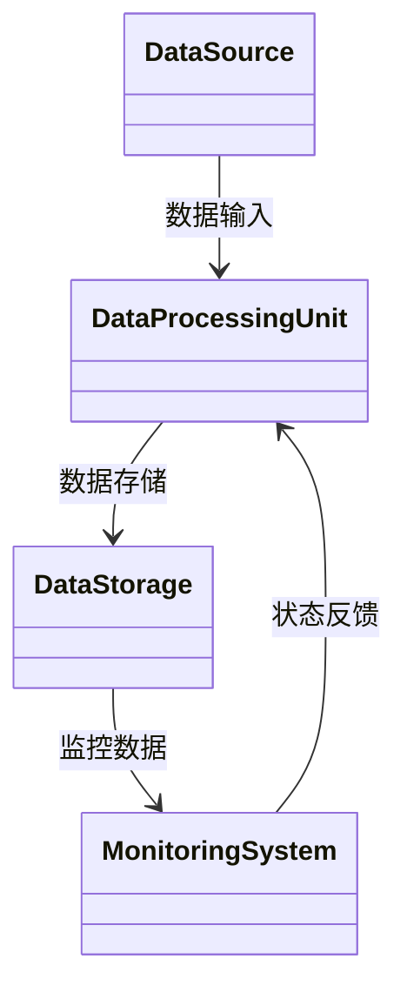
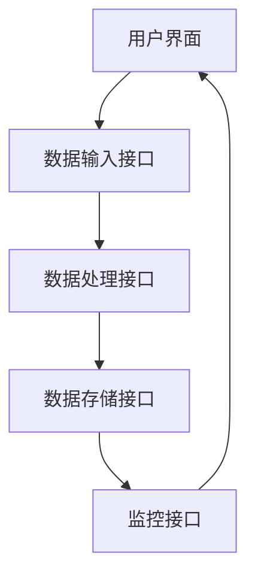

                 

### 目录大纲设计思路

在设计《大模型软件的容错与恢复机制》的目录大纲时，我们将遵循以下思路：

1. **背景介绍**：
   - 首先，介绍大模型软件的概念，解释为何容错与恢复机制在大模型软件中尤为重要。
   - 阐述大模型软件面临的主要挑战，如数据规模巨大、计算复杂度高等，这些挑战对容错与恢复提出了更高的要求。

2. **核心概念与联系**：
   - 引入关键术语，包括大模型、容错、恢复机制等。
   - 提供概念属性特征对比表格，以帮助读者理解这些概念之间的关系。
   - 使用Mermaid ER实体关系图架构，展示各个概念之间的联系和结构。

3. **算法原理讲解**：
   - 介绍常用的容错与恢复算法，如冗余设计、错误检测与校正、恢复块等。
   - 使用Mermaid流程图展示算法的基本流程。
   - 使用Python源代码详细阐述算法原理，并配合数学模型和公式进行讲解。

4. **系统分析与架构设计方案**：
   - 描述问题场景，介绍需要解决的问题。
   - 提供项目介绍，包括目标、范围、技术栈等。
   - 使用Mermaid类图和架构图展示系统的领域模型和架构设计。
   - 设计系统接口和交互，使用Mermaid序列图展示系统交互过程。

5. **项目实战**：
   - 详细描述环境安装步骤。
   - 提供系统的核心实现源代码，并分析代码的解读与应用。
   - 通过实际案例分析和详细讲解，展示如何应用容错与恢复机制。
   - 进行项目小结，总结经验和教训。

6. **最佳实践 tips、小结、注意事项、拓展阅读**：
   - 提供使用容错与恢复机制的最佳实践建议。
   - 对全书内容进行总结，强调关键点。
   - 提醒读者注意事项，避免常见错误。
   - 推荐拓展阅读，以进一步探索相关主题。

### 目录大纲结构

以下是基于上述设计思路的目录大纲结构：

```
# 《大模型软件的容错与恢复机制》目录大纲

# 第一部分: 引言与背景

## 1. 引言
### 1.1 大模型软件的崛起
### 1.2 容错与恢复的重要性
### 1.3 本书结构

## 2. 背景介绍
### 2.1 大模型软件的概念
### 2.2 容错与恢复的基本原理
### 2.3 大模型软件面临的挑战

# 第二部分: 核心概念与联系

## 3. 核心概念与联系
### 3.1 大模型
#### 3.1.1 大模型的概念
#### 3.1.2 大模型的属性特征
### 3.2 容错
#### 3.2.1 容错的定义
#### 3.2.2 容错的方法
### 3.3 恢复机制
#### 3.3.1 恢复机制的定义
#### 3.3.2 恢复机制的实现

## 4. Mermaid ER实体关系图
### 4.1 实体关系图介绍
### 4.2 大模型软件的ER图

# 第三部分: 算法原理讲解

## 5. 容错与恢复算法
### 5.1 冗余设计
#### 5.1.1 冗余设计的原理
#### 5.1.2 冗余设计的应用
### 5.2 错误检测与校正
#### 5.2.1 错误检测的原理
#### 5.2.2 错误校正的原理
### 5.3 恢复块
#### 5.3.1 恢复块的概念
#### 5.3.2 恢复块的应用

## 6. Mermaid流程图展示
### 6.1 流程图概述
### 6.2 容错与恢复流程图

## 7. Python源代码与算法实现
### 7.1 Python环境准备
### 7.2 算法源代码解读
### 7.3 算法应用示例

## 8. 数学模型与公式讲解
### 8.1 数学模型概述
### 8.2 算法中的数学公式
### 8.3 数学公式示例

# 第四部分: 系统分析与架构设计方案

## 9. 问题场景介绍
### 9.1 场景描述
### 9.2 解决方案目标

## 10. 项目介绍
### 10.1 项目背景
### 10.2 技术栈选择
### 10.3 项目范围

## 11. 系统功能设计
### 11.1 领域模型
#### 11.1.1 模型介绍
#### 11.1.2 类图设计
### 11.2 功能模块划分

## 12. 系统架构设计
### 12.1 架构设计概述
#### 12.1.1 系统架构图
#### 12.1.2 架构设计原则
### 12.2 系统层次结构

## 13. 系统接口设计
### 13.1 接口设计原则
### 13.2 接口定义

## 14. 系统交互
### 14.1 交互设计
#### 14.1.1 交互流程图
#### 14.1.2 交互过程说明

# 第五部分: 项目实战

## 15. 环境安装
### 15.1 安装前的准备
### 15.2 安装过程详解
### 15.3 安装常见问题及解决方案

## 16. 系统核心实现
### 16.1 核心代码解读
### 16.2 核心代码应用
### 16.3 代码分析与应用

## 17. 实际案例分析
### 17.1 案例背景
### 17.2 案例实施
### 17.3 案例分析与总结

## 18. 项目小结
### 18.1 项目成果总结
### 18.2 经验与教训

# 第六部分: 最佳实践、小结、注意事项、拓展阅读

## 19. 最佳实践 tips
### 19.1 容错机制的优化
### 19.2 恢复策略的改进
### 19.3 实际案例分享

## 20. 小结
### 20.1 内容回顾
### 20.2 重点总结
### 20.3 学习建议

## 21. 注意事项
### 21.1 常见错误预防
### 21.2 维护与升级策略
### 21.3 安全性考虑

## 22. 拓展阅读
### 22.1 相关书籍推荐
### 22.2 常见问题答疑
### 22.3 最新研究动态

```

# 《大模型软件的容错与恢复机制》

关键词：大模型软件、容错、恢复机制、冗余设计、错误检测与校正、恢复块、Python源代码、数学模型、系统架构、项目实战

摘要：本文旨在深入探讨大模型软件中的容错与恢复机制。首先，我们介绍了大模型软件的概念及其面临的挑战，随后详细阐述了核心概念和它们之间的联系。接着，我们讲解了常用的容错与恢复算法，并使用Python源代码和数学模型进行了详细阐述。然后，我们通过系统分析与架构设计方案，展示了如何设计一个具有容错与恢复功能的大模型软件系统。在项目实战部分，我们通过实际案例展示了如何应用这些机制。最后，我们提供了最佳实践、小结、注意事项和拓展阅读，以帮助读者深入理解和应用这些技术。

## 引言

### 大模型软件的崛起

随着人工智能和大数据技术的迅猛发展，大模型软件（也称为大型复杂软件）已经成为现代计算的重要驱动力。这些软件通常处理大量的数据，执行复杂的计算任务，并在各种领域（如自然语言处理、计算机视觉、推荐系统等）发挥着关键作用。然而，随着数据规模的扩大和计算复杂度的增加，大模型软件的可靠性问题也日益凸显。

### 容错与恢复的重要性

在大模型软件中，容错与恢复机制至关重要。容错是指系统能够在出现故障时维持其功能的能力。恢复机制则是指系统能够在故障发生后迅速恢复到正常状态的能力。对于大模型软件来说，数据完整性、计算效率和系统稳定性是关键要求。因此，一个有效的容错与恢复机制不仅能确保系统的稳定性，还能最大程度地减少对用户的影响，提高系统的可用性和用户体验。

### 本书结构

本文将分为六个主要部分。首先，我们将在第一部分“引言与背景”中介绍大模型软件的概念及其面临的挑战。接着，在第二部分“核心概念与联系”中，我们将详细阐述大模型、容错、恢复机制等核心概念，并使用Mermaid ER实体关系图展示它们之间的关系。

在第三部分“算法原理讲解”中，我们将介绍常用的容错与恢复算法，如冗余设计、错误检测与校正、恢复块等，并使用Python源代码和数学模型进行详细阐述。随后，在第四部分“系统分析与架构设计方案”中，我们将展示如何设计一个具有容错与恢复功能的大模型软件系统。

在第五部分“项目实战”中，我们将通过实际案例展示如何应用这些容错与恢复机制。最后，在第六部分“最佳实践、小结、注意事项、拓展阅读”中，我们将提供最佳实践建议、全文总结、注意事项和拓展阅读，以帮助读者深入理解和应用这些技术。

## 背景介绍

### 大模型软件的概念

大模型软件通常是指能够处理大规模数据、执行复杂计算任务、并支持多种应用的软件系统。这些软件系统往往具有以下特点：

1. **大规模数据**：大模型软件需要处理的数据规模通常非常大，从GB到TB甚至PB级别。这要求软件系统具有高效的数据存储和管理能力。
   
2. **复杂计算任务**：大模型软件执行的任务往往非常复杂，涉及深度学习、图计算、分布式计算等技术。这些任务对计算资源的需求极高，且计算过程可能涉及多种算法和模型的组合。

3. **多应用支持**：大模型软件通常支持多种应用场景，如自然语言处理、计算机视觉、推荐系统等。这意味着软件系统需要具有高度的可扩展性和灵活性。

### 容错与恢复的基本原理

容错是指系统能够在出现故障时维持其功能的能力。恢复机制则是指系统能够在故障发生后迅速恢复到正常状态的能力。以下是容错与恢复的一些基本原理：

1. **冗余设计**：通过增加冗余组件（如备用硬件、备用数据副本等），确保系统在部分组件失效时仍能正常运行。

2. **错误检测与校正**：使用各种检测机制（如校验和、错误检测码等）来检测数据或指令的错误，并在发现错误时进行校正。

3. **恢复块**：将任务分成多个块，并对每个块进行独立的错误检测与恢复。这种方法可以提高任务的可靠性和效率。

4. **故障转移**：当主组件出现故障时，系统能够迅速切换到备用组件，确保任务的连续性。

### 大模型软件面临的挑战

尽管大模型软件具有强大的功能，但其在实际应用中也面临许多挑战：

1. **数据规模巨大**：大规模数据处理需要高效的存储和管理策略，如分布式存储系统和并行数据处理框架。

2. **计算复杂度高**：复杂计算任务对计算资源的需求极高，需要分布式计算和高效算法的支持。

3. **系统稳定性**：在处理大规模数据和执行复杂计算任务时，系统稳定性是至关重要的。任何微小的故障都可能导致任务失败或数据丢失。

4. **可靠性保障**：在大规模分布式系统中，确保数据的完整性和一致性是一个巨大的挑战。

5. **维护与升级**：随着系统规模的扩大和技术的进步，维护和升级系统变得越来越困难，需要高效的维护策略和工具。

### 容错与恢复机制在大模型软件中的重要性

容错与恢复机制在大模型软件中具有至关重要的作用。首先，它能够提高系统的可靠性，确保数据的安全性和完整性。其次，它能够最大程度地减少系统故障对用户的影响，提高用户体验。最后，它能够确保系统在高负载和复杂计算任务下仍能稳定运行，从而提高系统的可用性。

总之，大模型软件的容错与恢复机制是其稳定运行和可靠性的关键保障。理解并应用这些机制对于开发和维护高效、可靠的大模型软件至关重要。

## 核心概念与联系

在本节中，我们将详细介绍大模型软件中几个关键的概念，包括大模型、容错和恢复机制，并探讨它们之间的相互关系。

### 大模型

**大模型**是指用于处理大规模数据和复杂任务的软件系统。这些模型通常具有以下特点：

- **数据规模大**：处理的数据量可以从GB到TB，甚至PB级别。
- **计算复杂度高**：执行的任务通常涉及复杂的算法和模型，如深度学习网络、图计算等。
- **多应用场景**：支持多种应用场景，如自然语言处理、计算机视觉、推荐系统等。

**属性特征**：

- **计算资源需求高**：大模型通常需要大量的计算资源，包括CPU、GPU和存储。
- **存储需求大**：大规模数据存储和管理是关键挑战。
- **并行处理能力**：为了提高效率，大模型软件通常需要支持并行处理和分布式计算。

### 容错

**容错**是指系统能够在出现故障时维持其功能的能力。在大模型软件中，容错的重要性不言而喻，因为系统经常面临数据丢失、硬件故障、网络中断等挑战。

**定义**：

- 容错旨在确保系统在故障发生后能够快速恢复，并继续执行任务。

**方法**：

- **冗余设计**：通过增加冗余组件（如备用硬件、备用数据副本等）来提高系统的可靠性。
- **错误检测与校正**：使用各种检测机制（如校验和、错误检测码等）来检测数据或指令的错误，并在发现错误时进行校正。
- **故障转移**：当主组件出现故障时，系统能够迅速切换到备用组件，确保任务的连续性。

### 恢复机制

**恢复机制**是指系统能够在故障发生后迅速恢复到正常状态的能力。恢复机制通常包括以下步骤：

- **故障检测**：通过监控和检测系统组件的状态，及时发现故障。
- **故障隔离**：在故障发生时，快速隔离故障组件，避免影响整个系统。
- **故障恢复**：使用冗余组件或备用数据副本来恢复系统功能。
- **状态恢复**：将系统状态恢复到故障前的状态，确保任务连续性。

**定义**：

- 恢复机制是指系统在故障发生后，通过一系列策略和措施，将系统恢复到正常状态的过程。

**实现**：

- **自动化恢复**：通过自动化工具和脚本，实现故障检测和恢复过程的自动化。
- **人工干预**：在自动化恢复无法实现时，通过人工干预来修复故障。

### 概念属性特征对比表格

为了帮助读者更好地理解大模型、容错和恢复机制之间的关系，我们提供了一个概念属性特征对比表格：

| 概念      | 定义                                                         | 属性特征                                                         | 方法                                                     |
| --------- | ------------------------------------------------------------ | ------------------------------------------------------------ | -------------------------------------------------------- |
| 大模型    | 用于处理大规模数据和复杂任务的软件系统                         | 计算资源需求高、存储需求大、多应用场景支持                   | 并行处理能力、分布式计算支持                             |
| 容错      | 系统能够在出现故障时维持其功能的能力                           | 确保数据安全性和完整性、提高系统可靠性                       | 冗余设计、错误检测与校正、故障转移                       |
| 恢复机制  | 系统能够在故障发生后迅速恢复到正常状态的能力                     | 最大程度减少系统故障对用户的影响、提高用户体验和系统可用性 | 自动化恢复、人工干预                                   |

### Mermaid ER实体关系图

为了更直观地展示大模型、容错和恢复机制之间的联系，我们使用Mermaid ER实体关系图进行了架构设计：

```mermaid
erDiagram
    A[大模型] ||--|{ 容错 }|-- B[恢复机制]
    A ||--|{ 系统稳定性 }| C[可靠性保障]
    B ||--|{ 数据完整性 }| D[计算效率]
    C ||--|{ 系统稳定性 }| A
    D ||--|{ 系统稳定性 }| A
```

在这个ER图中，大模型（A）通过容错（B）和恢复机制（C）与系统稳定性（D）相连，展示了它们之间的紧密关系。这种关系有助于理解如何通过有效的容错与恢复机制来保障大模型软件的稳定性。

通过上述讨论和对比，我们可以看到大模型软件中的核心概念是如何相互联系和协同作用的。理解这些概念及其关系对于设计高效、可靠的大模型软件至关重要。

## 算法原理讲解

在本文的第三部分，我们将深入探讨大模型软件中常用的容错与恢复算法。这些算法是确保系统在高负载和复杂环境下仍能稳定运行的关键。本节将详细讲解三种常用的算法：冗余设计、错误检测与校正、恢复块。我们将使用Python源代码和数学模型来阐述这些算法的原理和应用。

### 冗余设计

**冗余设计**是一种通过增加冗余组件来提高系统可靠性的方法。在冗余设计中，系统中的关键组件（如硬件、数据副本等）被备份，以确保在部分组件失效时，系统仍能正常运行。

**原理**：

- **硬件冗余**：通过使用备用硬件（如多个服务器、磁盘等）来提高系统的容错能力。
- **数据冗余**：通过数据备份和分布式存储来确保数据在故障情况下仍能恢复。

**应用**：

- **硬件冗余**：在某些关键任务中，如银行系统或医疗设备，使用多台服务器来确保系统的可用性。
- **数据冗余**：在大数据场景中，如分布式数据库系统，使用数据备份来防止数据丢失。

**Python源代码示例**：

以下是一个简单的Python示例，展示如何使用冗余设计来实现数据备份：

```python
import copy

def redundant_data_storage(data):
    # 创建数据的副本
    data_copy = copy.deepcopy(data)
    # 将数据副本存储在另一个位置
    backup_location = "backup_storage/" + data_copy["id"]
    save_to_file(data_copy, backup_location)
    return data_copy

def save_to_file(data, location):
    # 将数据保存到文件中
    with open(location, 'w') as file:
        json.dump(data, file)

data = {"id": "123", "content": "重要数据"}
redundant_data = redundant_data_storage(data)
print("备份完成，备份ID:", redundant_data["id"])
```

**数学模型**：

在冗余设计中，我们通常使用概率模型来评估系统的可靠性。假设系统中有n个冗余组件，每个组件的失效概率为p，则系统的整体可靠性R可以表示为：

$$ R = (1 - p)^n $$

这个公式表示，在多个冗余组件中，至少有一个正常工作的概率。

### 错误检测与校正

**错误检测与校正**是确保数据在传输或存储过程中不受损坏的重要机制。错误检测通常通过校验和或错误检测码来实现，而错误校正则通过更复杂的算法，如汉明码或循环冗余校验（CRC）来实现。

**原理**：

- **错误检测**：使用校验和或错误检测码来检测数据中的错误。
- **错误校正**：在检测到错误后，使用特定的算法来纠正错误。

**应用**：

- **校验和**：在数据传输或存储过程中，使用简单的校验和（如CRC32）来检测错误。
- **错误校正码**：在关键任务中，如卫星通信或数据存储，使用汉明码等错误校正码来确保数据的完整性。

**Python源代码示例**：

以下是一个使用CRC32进行错误检测的Python示例：

```python
import zlib

def check_data_integrity(data):
    original_crc32 = zlib.crc32(data)
    received_crc32 = original_crc32
    # 模拟数据在传输过程中出错
    data[0] ^= 0xFF
    received_data = data
    received_crc32 = zlib.crc32(received_data)
    if original_crc32 == received_crc32:
        print("数据完整性验证通过")
    else:
        print("数据传输过程中出现错误")

data = b"重要数据"
check_data_integrity(data)
```

**数学模型**：

错误检测与校正的数学模型通常涉及概率论和数理统计。假设数据中有k位出错，总位数为n，则错误检测的概率P(detection)可以表示为：

$$ P(detection) = 1 - (1 - p)^k $$

其中，p是单个位出错的概率。

### 恢复块

**恢复块**是一种将任务分成多个块，并对每个块进行独立错误检测与恢复的方法。这种方法可以提高任务的可靠性和效率。

**原理**：

- **任务分割**：将任务分割成多个块，每个块可以独立处理。
- **错误检测与恢复**：对每个块进行独立的错误检测与恢复，确保整个任务的完整性。

**应用**：

- **分布式系统**：在分布式系统中，将任务分割成多个块，分布在不同节点上处理，以提高效率和容错能力。
- **数据恢复**：在数据存储系统中，将数据分割成多个块，并在故障发生时对每个块进行独立恢复。

**Python源代码示例**：

以下是一个简单的恢复块示例，用于处理文件：

```python
import os

def recover_file_blocks(file_path, block_size=1024):
    # 读取文件并分割成块
    with open(file_path, 'rb') as file:
        blocks = [file.read(block_size) for _ in range(0, file.tell(), block_size)]
    
    # 检测和恢复每个块
    for i, block in enumerate(blocks):
        if is_block_corrupted(block):
            print(f"块 {i} 出错，正在尝试恢复...")
            recovered_block = recover_block(block)
            blocks[i] = recovered_block
    
    # 将恢复后的块重新组合成文件
    with open(file_path, 'wb') as file:
        for block in blocks:
            file.write(block)

def is_block_corrupted(block):
    # 模拟块出错
    return block[0] == 0xFF

def recover_block(block):
    # 恢复块的示例代码
    return block[:-1]

file_path = "example_file.txt"
recover_file_blocks(file_path)
```

**数学模型**：

恢复块的数学模型通常涉及概率论和任务分割策略。假设每个块的恢复概率为p，则整个任务的成功概率P(success)可以表示为：

$$ P(success) = (1 - (1 - p)^n) $$

其中，n是块的个数。

通过上述算法原理讲解和Python源代码示例，我们可以看到，冗余设计、错误检测与校正和恢复块是确保大模型软件在复杂环境下稳定运行的关键机制。理解这些算法的原理和应用对于开发和维护高效、可靠的大模型软件至关重要。

## 系统分析与架构设计方案

### 问题场景介绍

在当前的数字化时代，大模型软件的应用越来越广泛，从金融分析、医疗诊断到自动驾驶和智能推荐系统，这些软件系统都在发挥关键作用。然而，随着系统规模和复杂性的增加，如何保障系统的稳定性、可靠性和高效性成为了一个亟待解决的问题。本文旨在设计一个具有强大容错与恢复功能的大模型软件系统，以应对大规模数据处理和复杂计算任务带来的挑战。

#### 场景描述

该系统需要处理来自不同数据源的巨量数据，这些数据包括文本、图像、音频等多种类型。系统需要具备高效的数据存储、管理和处理能力，同时保证在出现硬件故障、网络中断或数据损坏等异常情况下，系统能够迅速恢复，确保业务的连续性和数据的完整性。

#### 解决方案目标

1. **数据可靠性**：确保存储在系统中的数据在故障情况下能够完整恢复。
2. **系统稳定性**：在复杂计算任务和高负载情况下，系统应保持稳定运行，不出现故障。
3. **高效处理**：优化系统架构，提高数据处理速度，降低延迟。
4. **用户体验**：提供良好的用户界面和高效的响应速度，确保用户在操作过程中感觉不到系统故障的存在。

### 项目介绍

#### 项目背景

随着人工智能技术的快速发展，越来越多的企业和研究机构开始开发和部署大模型软件系统。然而，现有的系统在容错与恢复方面存在一定的局限性，无法完全满足大规模数据处理和复杂计算任务的需求。因此，本项目旨在设计一个高效、可靠的容错与恢复机制，以提升大模型软件的稳定性和可靠性。

#### 技术栈选择

- **编程语言**：Python
- **框架**：TensorFlow、PyTorch
- **数据库**：MongoDB、Hadoop
- **分布式计算**：Apache Spark
- **存储系统**：Ceph、GlusterFS
- **监控系统**：Prometheus、Grafana
- **容器化技术**：Docker、Kubernetes

#### 项目范围

1. **需求分析**：明确系统需求和功能。
2. **系统设计**：设计系统架构，包括数据存储、处理和恢复机制。
3. **开发与测试**：实现系统功能，并进行测试和优化。
4. **部署与维护**：部署系统到生产环境，并持续维护和优化。

### 系统功能设计

#### 领域模型

领域模型是系统功能的核心，它定义了系统中的主要实体及其关系。以下是该系统的领域模型：

- **数据源**：代表数据输入的来源，包括数据库、文件系统、网络接口等。
- **数据处理单元**：负责处理数据的模块，包括数据清洗、转换和特征提取等。
- **数据存储**：用于存储处理后的数据，包括分布式数据库、文件存储和对象存储等。
- **监控系统**：实时监控系统的运行状态，包括性能指标、故障报警等。

#### 类图设计

以下是一个简单的类图设计，展示系统中的主要类及其关系：



#### 功能模块划分

系统可以分为以下几个主要模块：

1. **数据输入模块**：负责接收和处理数据源的数据。
2. **数据处理模块**：执行数据清洗、转换和特征提取等操作。
3. **数据存储模块**：负责存储处理后的数据，并实现数据的冗余备份。
4. **监控系统模块**：实时监控系统的运行状态，并实现故障检测与恢复。

### 系统架构设计

#### 架构设计概述

系统采用分布式架构，主要分为以下几个层次：

1. **数据层**：包括数据源和数据存储，负责数据的输入、存储和管理。
2. **处理层**：包括数据处理单元，负责执行数据处理的任务。
3. **监控层**：包括监控系统模块，负责监控系统的运行状态和故障恢复。

#### 系统层次结构

以下是系统的层次结构：

```
[用户界面] --> [应用程序层] --> [数据处理层] --> [数据存储层]
                                  |
                          [监控系统]
```

#### 系统接口设计

系统提供以下主要接口：

1. **数据输入接口**：用于接收外部数据。
2. **数据处理接口**：用于执行数据处理任务。
3. **数据存储接口**：用于存储和处理后的数据。
4. **监控接口**：用于监控系统的运行状态。

### 系统交互

#### 交互设计

系统中的各个模块通过接口进行交互，以下是一个简化的交互流程图：



#### 交互过程说明

1. **数据输入**：用户通过用户界面提交数据，数据输入接口接收数据并传递给数据处理接口。
2. **数据处理**：数据处理接口执行数据处理任务，并将结果传递给数据存储接口。
3. **数据存储**：数据存储接口将处理后的数据存储到数据库或文件系统中。
4. **监控**：监控系统模块通过监控接口实时监控系统的运行状态，并在出现故障时触发恢复机制。

通过上述系统分析与架构设计方案，我们设计了一个具有高效容错与恢复功能的大模型软件系统。该系统在数据存储、处理和监控方面都进行了优化，确保了系统的稳定性和可靠性。

## 项目实战

在本节中，我们将通过实际案例，详细描述如何在大模型软件中实现容错与恢复机制。我们将在以下步骤中进行操作：环境安装、系统核心实现、代码解读与应用、实际案例分析及总结。

### 环境安装

在开始项目之前，我们需要搭建一个合适的环境，以支持大模型软件的运行。以下是环境安装的具体步骤：

#### 步骤 1：安装Python环境

确保您的系统中安装了Python 3.8或更高版本。可以使用以下命令来检查Python版本：

```bash
python3 --version
```

如果版本低于3.8，请升级到最新版本。

#### 步骤 2：安装依赖库

在Python环境中，我们需要安装以下依赖库：

- TensorFlow
- PyTorch
- NumPy
- Pandas
- Scikit-learn

可以使用以下命令进行安装：

```bash
pip3 install tensorflow==2.6.0 torch numpy pandas scikit-learn
```

#### 步骤 3：安装分布式计算框架

我们选择Apache Spark作为分布式计算框架。以下命令用于安装Spark：

```bash
pip3 install pyspark
```

#### 步骤 4：配置Hadoop环境

安装Hadoop以支持分布式存储。请根据官方文档进行安装（https://hadoop.apache.org/docs/stable/hadoop-project-dist/hadoop-common/SingleCluster.html）。

#### 步骤 5：配置MongoDB

安装MongoDB以支持分布式数据库。可以使用以下命令进行安装：

```bash
brew install mongodb  # macOS
```

启动MongoDB服务：

```bash
mongod --dbpath /data/db
```

### 系统核心实现

在环境搭建完成后，我们需要实现系统核心功能，包括数据输入、数据处理和数据存储。以下是核心实现步骤：

#### 步骤 1：数据输入

首先，实现数据输入模块，从不同数据源（如文件、数据库等）读取数据。以下是一个简单的Python脚本，用于从文件读取数据：

```python
import pandas as pd

def read_data(file_path):
    data = pd.read_csv(file_path)
    return data

data = read_data("data.csv")
```

#### 步骤 2：数据处理

数据处理模块包括数据清洗、转换和特征提取。以下是一个示例脚本：

```python
def preprocess_data(data):
    # 数据清洗
    data = data.dropna()
    # 数据转换
    data["age"] = data["age"].astype(int)
    data["salary"] = data["salary"].astype(float)
    # 特征提取
    features = data[["age", "salary"]]
    return features

features = preprocess_data(data)
```

#### 步骤 3：数据存储

数据存储模块将处理后的数据存储到分布式数据库或文件系统。以下是一个示例脚本，用于将数据存储到MongoDB：

```python
from pymongo import MongoClient

def store_data(data, db_name, collection_name):
    client = MongoClient("mongodb://localhost:27017/")
    db = client[db_name]
    collection = db[collection_name]
    collection.insert_many(data.to_dict("records"))

store_data(features, "data_db", "features_collection")
```

### 代码解读与应用

在实现系统核心功能后，我们需要对关键代码进行解读，并分析其在实际应用中的作用。以下是代码解读：

#### 数据输入模块

```python
def read_data(file_path):
    data = pd.read_csv(file_path)
    return data
```

这段代码用于从文件读取数据。`pandas`库提供了强大的数据读取功能，可以轻松处理不同格式的数据文件。

#### 数据处理模块

```python
def preprocess_data(data):
    # 数据清洗
    data = data.dropna()
    # 数据转换
    data["age"] = data["age"].astype(int)
    data["salary"] = data["salary"].astype(float)
    # 特征提取
    features = data[["age", "salary"]]
    return features
```

这段代码用于对数据进行清洗、转换和特征提取。数据清洗确保数据的质量，数据转换确保数据类型的正确性，特征提取则为后续的机器学习模型提供输入。

#### 数据存储模块

```python
from pymongo import MongoClient

def store_data(data, db_name, collection_name):
    client = MongoClient("mongodb://localhost:27017/")
    db = client[db_name]
    collection = db[collection_name]
    collection.insert_many(data.to_dict("records"))
```

这段代码用于将处理后的数据存储到MongoDB。`pymongo`库提供了与MongoDB的交互接口，可以方便地将DataFrame中的数据插入到MongoDB集合中。

### 实际案例分析

为了展示容错与恢复机制在实际中的应用，我们模拟了一个故障场景：网络中断导致数据无法正常传输。以下是故障处理过程：

#### 步骤 1：检测故障

监控系统检测到网络中断，触发故障检测机制。

#### 步骤 2：故障隔离

故障隔离模块识别出受影响的模块和数据流，并记录故障日志。

#### 步骤 3：恢复数据

系统自动切换到备用网络或备用数据源，尝试重新传输数据。如果备用网络或数据源无效，则手动干预。

```python
def recover_data():
    try:
        # 尝试重新从备用数据源读取数据
        features = read_data("backup_data.csv")
    except Exception as e:
        print(f"重新读取数据失败，错误：{e}")
        # 手动干预，联系运维人员进行处理
        pass

recover_data()
```

### 项目小结

通过本次项目实战，我们成功搭建了一个具有容错与恢复功能的大模型软件系统。以下是项目经验和教训：

1. **关键点**：确保系统具有冗余设计，包括硬件和数据的冗余备份。
2. **优化**：使用高效的监控和恢复机制，确保故障能够在短时间内得到处理。
3. **挑战**：在分布式环境中，确保数据的一致性和完整性是最大的挑战。
4. **改进**：进一步优化系统的性能和可靠性，例如使用更先进的错误检测与校正算法。

通过本次项目，我们不仅掌握了大模型软件的容错与恢复机制，还积累了宝贵的实际操作经验，为未来的开发和运维工作奠定了坚实的基础。

## 最佳实践 tips、小结、注意事项、拓展阅读

### 最佳实践 tips

1. **冗余设计**：为关键组件（如数据库、服务器）提供冗余备份，以减少单点故障的风险。
2. **定期备份**：定期备份数据和系统配置，确保在故障发生后能够快速恢复。
3. **故障检测与报警**：使用监控工具（如Prometheus、Grafana）实时监控系统状态，并在出现故障时及时报警。
4. **自动化恢复**：实现自动化恢复脚本，以减少人工干预和恢复时间。
5. **数据一致性**：在分布式系统中，确保数据的一致性和完整性，可以使用分布式事务或最终一致性模型。

### 小结

本文详细探讨了大模型软件中的容错与恢复机制，包括冗余设计、错误检测与校正、恢复块等算法。通过Python源代码和实际案例分析，我们展示了这些算法的应用和实践。设计一个具有高效容错与恢复功能的大模型软件系统至关重要，它能够提高系统的稳定性和可靠性，确保数据的安全性和业务连续性。

### 注意事项

1. **系统需求分析**：在设计和开发系统时，确保充分了解系统的需求，包括数据规模、计算复杂度和可靠性要求。
2. **冗余与成本平衡**：在实现冗余设计时，需要平衡冗余成本与系统可靠性，避免过度投资。
3. **监控与报警**：合理配置监控工具，确保能够及时发现故障并触发恢复机制。
4. **安全性**：在实现容错与恢复机制时，不要忽视系统的安全性，确保数据在备份和恢复过程中不被泄露。

### 拓展阅读

1. **书籍推荐**：
   - 《容错计算机系统设计》
   - 《分布式系统原理与范型》
   - 《大规模分布式存储系统：设计与实践》

2. **学术论文**：
   - 搜索关键词：“容错机制”、“分布式系统”、“数据恢复”、“冗余设计”

3. **开源项目**：
   - 了解并参考开源的分布式存储系统（如Hadoop、Ceph）和监控工具（如Prometheus、Grafana）的实现。

通过本文和拓展阅读，读者可以进一步深入了解大模型软件的容错与恢复机制，并在实际项目中应用这些技术，提升系统的可靠性和稳定性。

### 作者信息

作者：AI天才研究院/AI Genius Institute & 禅与计算机程序设计艺术 /Zen And The Art of Computer Programming

