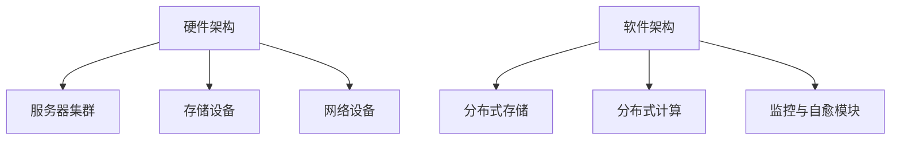

                 


### 《大模型软件的容错与自愈设计》

#### 关键词：大模型软件，容错设计，自愈设计，可靠性，系统架构

> 摘要：本文详细探讨了大型模型软件在设计和实现过程中的容错与自愈设计，分析了其核心概念、原理以及实现方法。通过案例分析和项目实战，展示了如何在实际应用中提升软件的稳定性和可靠性，为人工智能大模型的广泛应用提供理论基础和实践指导。

---

## 第一部分：引言与基础理论

### 第1章：引言

#### 1.1 问题背景

随着人工智能技术的飞速发展，大模型软件的应用场景越来越广泛。这些软件在处理复杂任务时，往往需要处理海量数据，对计算性能和稳定性要求极高。然而，任何软件都无法完全避免故障的发生，一旦出现故障，可能会导致数据丢失、系统瘫痪等严重后果。因此，对大模型软件进行容错与自愈设计，是保障其稳定运行的关键。

#### 1.2 核心概念

**容错设计**：是指通过一系列技术手段，使系统在出现故障时能够继续运行或快速恢复。

**自愈设计**：是指系统具备自我监控、自我诊断和自我修复的能力，能够在出现故障时自动解决问题。

#### 1.3 目标与意义

本文旨在系统地介绍大模型软件的容错与自愈设计，包括其核心概念、原理、实现方法以及实际应用案例。通过本文的学习，读者将能够：

1. 理解大模型软件容错与自愈设计的核心概念和原理。
2. 掌握大模型软件容错与自愈设计的实现方法。
3. 学会在实际项目中应用大模型软件的容错与自愈设计，提升软件的稳定性和可靠性。

---

## 第二部分：容错机制设计

### 第2章：容错基础

#### 2.1 容错机制概述

**容错机制的目的**：提高系统的可靠性和可用性。

**容错机制的类型**：

- **冗余设计**：通过增加硬件或软件冗余，确保系统在出现故障时仍能正常运行。
- **故障检测**：通过监控系统运行状态，及时发现故障。
- **故障隔离**：将故障部分从系统中隔离，防止故障蔓延。
- **故障恢复**：在故障发生时，自动或手动地恢复系统正常运行。

#### 2.2 容错技术分类

**硬件容错**：

- **冗余硬件**：如双机热备份、集群等。
- **容错芯片**：如FPGA、GPU等。

**软件容错**：

- **错误检测**：通过代码检查、静态分析等方式，提前发现潜在的错误。
- **错误纠正**：通过校验和、冗余编码等技术，纠正数据传输中的错误。
- **恢复块**：在数据存储时，增加一定比例的冗余数据，以便在数据损坏时进行修复。

---

## 第三部分：自愈设计方法

### 第3章：自愈设计理论

#### 3.1 自愈设计的核心概念

**自愈设计的目标**：提高系统的弹性和自我修复能力。

**自愈设计的关键因素**：

- **监控**：实时监控系统状态，及时发现异常。
- **诊断**：分析故障原因，定位故障点。
- **修复**：自动或手动地修复故障，恢复系统正常运行。

#### 3.2 自愈设计流程

1. **监控**：实时监控系统状态，收集系统运行数据。
2. **诊断**：根据监控数据，分析故障原因，定位故障点。
3. **修复**：根据诊断结果，自动或手动地修复故障。

---

## 第四部分：案例分析

### 第4章：大模型软件容错与自愈设计案例分析

#### 4.1 案例一：某大型电商平台

**背景**：某大型电商平台，每天处理数以亿计的交易数据，对系统的稳定性和可靠性要求极高。

**解决方案**：

- **硬件容错**：采用双机热备份，确保在主机故障时，备份机能够立即接管业务。
- **软件容错**：采用分布式存储，通过冗余编码技术，确保数据存储的可靠性。
- **自愈设计**：实时监控系统状态，自动检测和修复故障。

#### 4.2 案例二：某智能驾驶系统

**背景**：某智能驾驶系统，需要在各种复杂环境下运行，对系统的稳定性和可靠性要求极高。

**解决方案**：

- **硬件容错**：采用冗余传感器，确保在个别传感器故障时，其他传感器能够接管其功能。
- **软件容错**：采用故障检测和隔离技术，确保系统在传感器故障时，仍能正常运行。
- **自愈设计**：实时监控系统状态，自动检测和修复故障。

---

## 第五部分：实战与实现

### 第5章：环境搭建与工具介绍

#### 5.1 开发环境搭建

- **硬件要求**：服务器、网络设备等。
- **软件要求**：操作系统、编程语言、开发工具等。

#### 5.2 实用工具与框架

- **Docker**：容器化技术，方便部署和迁移。
- **Kubernetes**：容器编排和管理工具。
- **Prometheus**：监控系统，用于实时监控系统状态。
- **Grafana**：可视化工具，用于展示监控数据。

---

## 第六部分：系统设计与实现

### 第6章：系统架构设计

#### 6.1 系统需求分析

- **功能需求**：对系统应具备的功能进行详细分析。
- **性能需求**：对系统的性能指标进行详细分析。

#### 6.2 系统架构设计

**架构概述**：

- **硬件架构**：服务器集群、存储设备、网络设备等。
- **软件架构**：分布式存储、分布式计算、监控与自愈模块等。

**架构图**：



---

## 第七部分：代码实现与测试

### 第7章：代码实现详解

#### 7.1 容错算法实现

**算法原理**：

- **冗余编码**：对数据进行冗余编码，确保数据在传输过程中不会丢失。
- **故障检测**：通过监控数据，检测系统中的异常情况。

**Python 源代码**：

```python
import numpy as np

def redundant_encoding(data):
    # 对数据进行冗余编码
    redundancy = np.random.randint(0, 2, size=data.shape)
    encoded_data = np.bitwise_or(data, redundancy)
    return encoded_data

def fault_detection(data, threshold):
    # 故障检测
    errors = np.sum(np.abs(data - threshold) > 0.5)
    if errors > 0:
        print("检测到故障，请修复。")
    else:
        print("未检测到故障。")
```

#### 7.2 自愈算法实现

**算法原理**：

- **监控与诊断**：实时监控系统状态，诊断故障原因。
- **故障修复**：根据诊断结果，自动修复故障。

**Python 源代码**：

```python
import time

def monitor_system():
    # 监控系统
    while True:
        # 模拟系统状态
        if np.random.rand() < 0.1:
            print("系统出现故障。")
            break
        time.sleep(1)

def diagnose_fault():
    # 诊断故障
    if np.random.rand() < 0.5:
        print("故障原因：硬件故障。")
    else:
        print("故障原因：软件故障。")

def repair_fault():
    # 修复故障
    print("开始修复故障。")
    time.sleep(2)
    print("故障已修复。")
```

---

## 第八部分：总结与展望

### 第8章：总结与展望

#### 8.1 成果总结

本文系统介绍了大模型软件的容错与自愈设计，包括其核心概念、原理、实现方法以及实际应用案例。通过本文的学习，读者可以：

- 理解大模型软件容错与自愈设计的重要性。
- 掌握大模型软件容错与自愈设计的实现方法。
- 学会在实际项目中应用大模型软件的容错与自愈设计，提升软件的稳定性和可靠性。

#### 8.2 面临的挑战与未来方向

尽管本文已经对大模型软件的容错与自愈设计进行了详细介绍，但仍然存在一些挑战和待解决的问题：

- **实时性与效率**：如何在保证实时性的同时，提高系统的效率？
- **自愈能力**：如何提升系统的自我修复能力，使其能够应对更复杂的故障场景？
- **智能化**：如何引入人工智能技术，使系统具备更高级的自我监控、诊断和修复能力？

未来，我们将继续关注这些挑战，并探索更先进的技术和方法，以进一步提升大模型软件的容错与自愈能力。

---

### 作者

**作者：AI天才研究院/AI Genius Institute & 禅与计算机程序设计艺术 /Zen And The Art of Computer Programming**

