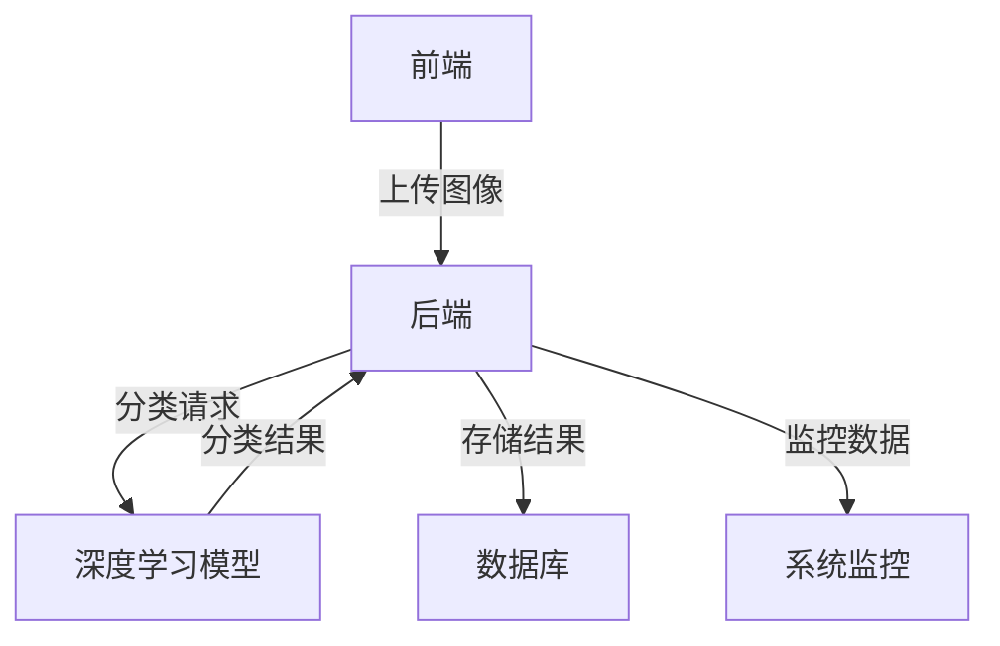
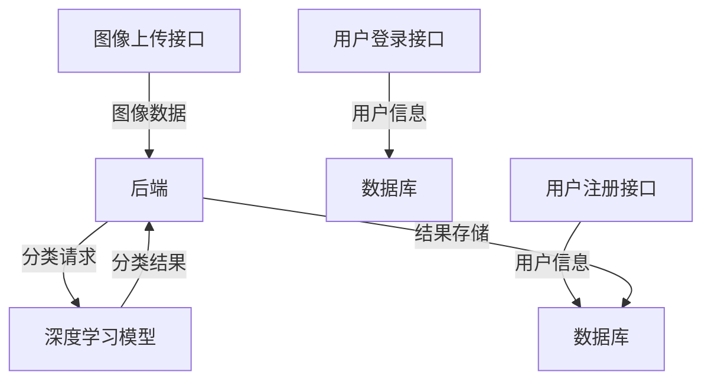

                 

# 大模型软件的性能分析与优化技术

> 关键词：大模型软件、性能分析、优化技术、瓶颈识别、代码优化、系统架构优化、资源调度优化、案例分析

> 摘要：随着人工智能技术的飞速发展，大模型软件在各个领域得到了广泛应用。然而，大模型软件的性能优化成为了制约其应用效果的关键因素。本文将对大模型软件的性能分析与优化技术进行详细探讨，通过具体案例分析，为读者提供实用的优化策略和技巧。

## 目录大纲

**《大模型软件的性能分析与优化技术》**

# 第一部分: 大模型软件性能分析基础

## 第1章: 大模型软件性能分析概述

### 1.1 大模型软件性能分析的重要性

### 1.2 大模型软件性能分析的基本概念

### 1.3 大模型软件性能分析的方法与工具

## 第2章: 大模型软件性能瓶颈识别

### 2.1 性能瓶颈的类型

### 2.2 性能瓶颈识别的方法

### 2.3 性能瓶颈案例分析

## 第3章: 大模型软件性能优化策略

### 3.1 代码优化策略

### 3.2 系统架构优化

### 3.3 资源调度优化

## 第4章: 大模型软件性能优化案例分析

### 4.1 案例一：大模型训练任务优化

### 4.2 案例二：大模型推理任务优化

### 4.3 案例三：分布式大模型训练与推理优化

# 第二部分: 大模型软件优化实践

## 第5章: 大模型软件优化环境搭建

### 5.1 开发环境搭建

### 5.2 训练环境搭建

### 5.3 推理环境搭建

## 第6章: 大模型软件性能优化项目实战

### 6.1 项目背景

### 6.2 系统功能设计

### 6.3 系统架构设计

### 6.4 系统接口设计与交互

### 6.5 系统核心实现

## 第7章: 大模型软件优化实践总结与拓展

### 7.1 实践总结

### 7.2 注意事项

### 7.3 拓展阅读

----------------------------------------------------------------

## 第一部分：大模型软件性能分析基础

### 第1章：大模型软件性能分析概述

#### 1.1 大模型软件性能分析的重要性

随着深度学习技术的广泛应用，大模型软件在自然语言处理、计算机视觉、推荐系统等领域发挥了重要作用。然而，大模型软件的性能问题也日益凸显，成为制约其应用效果的关键因素。性能分析的重要性主要体现在以下几个方面：

1. **提高用户体验**：高性能的大模型软件能够提供更快的响应速度和更流畅的操作体验，从而提升用户体验。
2. **降低运营成本**：性能优化可以减少硬件资源的消耗，降低运营成本，提高资源利用率。
3. **确保业务稳定**：对于业务依赖性强的应用场景，性能优化能够确保系统的稳定运行，避免因性能问题导致的服务中断。
4. **推动技术发展**：性能优化是技术发展的驱动力之一，通过不断优化，可以推动大模型软件技术的进步。

#### 1.2 大模型软件性能分析的基本概念

大模型软件性能分析涉及到多个方面，以下是一些基本概念：

1. **性能指标**：用于衡量软件性能的各种指标，如响应时间、吞吐量、延迟等。
2. **性能瓶颈**：影响软件性能的关键限制因素，如CPU使用率、内存占用、I/O速度等。
3. **负载测试**：通过模拟实际使用情况，评估软件在特定负载下的性能表现。
4. **性能调优**：通过对软件系统进行调整和优化，提高其性能的过程。

#### 1.3 大模型软件性能分析的方法与工具

性能分析的方法和工具多种多样，以下是一些常用的方法与工具：

1. **方法**：
   - **负载测试**：通过模拟用户行为，评估软件在不同负载下的性能。
   - **代码审查**：通过检查代码质量，发现性能瓶颈和潜在问题。
   - **监控数据**：通过收集和分析系统运行时的监控数据，定位性能问题。

2. **工具**：
   - **性能分析工具**：如VisualVM、Grafana等，用于实时监控和性能分析。
   - **负载测试工具**：如JMeter、LoadRunner等，用于模拟负载并评估性能。
   - **代码分析工具**：如SonarQube、CheckStyle等，用于代码质量和性能评估。

接下来，我们将进一步探讨大模型软件性能瓶颈的识别方法，以及如何进行性能优化。

----------------------------------------------------------------

## 第2章：大模型软件性能瓶颈识别

### 2.1 性能瓶颈的类型

大模型软件的性能瓶颈可以归类为以下几种类型：

1. **CPU瓶颈**：当CPU的计算能力无法满足任务需求时，会出现CPU瓶颈。常见于计算密集型任务，如深度学习模型的训练和推理。
2. **内存瓶颈**：当内存占用达到一定程度时，系统会降低处理速度，出现内存瓶颈。常见于数据密集型任务，如大数据处理和分析。
3. **I/O瓶颈**：当I/O操作成为系统瓶颈时，数据读写速度会显著降低。常见于需要频繁读写外部存储设备的应用场景。
4. **网络瓶颈**：当网络带宽或延迟成为限制因素时，远程通信和数据传输会受到阻碍。常见于分布式计算和云计算场景。

### 2.2 性能瓶颈识别的方法

识别大模型软件性能瓶颈的方法主要包括以下几种：

1. **基于负载测试的方法**：
   - **定义测试场景**：根据实际使用情况，模拟不同的负载场景。
   - **执行测试**：使用负载测试工具执行测试，收集性能数据。
   - **分析数据**：通过分析测试结果，识别性能瓶颈。

2. **基于代码审查的方法**：
   - **代码质量检查**：使用代码分析工具检查代码质量，发现潜在的性能问题。
   - **代码性能调优**：针对代码中的性能瓶颈，进行优化和重构。

3. **基于监控数据的分析方法**：
   - **监控指标收集**：收集系统运行时的各种监控数据，如CPU使用率、内存占用、I/O操作等。
   - **数据分析**：通过数据分析工具，分析监控数据，定位性能问题。

### 2.3 性能瓶颈案例分析

以下是一些性能瓶颈的案例分析：

#### 案例一：CPU瓶颈

在一个深度学习模型训练任务中，系统出现了频繁的CPU占用过高的情况。通过监控数据和分析，发现CPU瓶颈的原因如下：

1. **计算任务过多**：系统同时运行了多个计算密集型任务，导致CPU资源不足。
2. **算法优化不足**：训练算法的效率较低，导致CPU使用率居高不下。

**解决方案**：

1. **优化算法**：对训练算法进行优化，提高计算效率。
2. **资源分配**：合理分配CPU资源，避免同时运行过多的计算任务。

#### 案例二：内存瓶颈

在一个大数据处理项目中，系统内存占用达到90%以上，导致系统运行缓慢。通过监控数据和代码审查，发现内存瓶颈的原因如下：

1. **内存泄漏**：代码中存在内存泄漏问题，导致内存占用持续增加。
2. **数据量过大**：处理的数据量超过了系统的内存容量。

**解决方案**：

1. **代码优化**：修复内存泄漏问题，减少内存占用。
2. **分批次处理**：将大数据分批次处理，避免一次性占用过多内存。

#### 案例三：I/O瓶颈

在一个需要频繁读写外部存储设备的大数据项目中，系统的I/O速度较慢，导致数据处理效率低下。通过监控数据和I/O分析，发现I/O瓶颈的原因如下：

1. **存储设备性能不足**：使用的存储设备性能较低，无法满足数据处理需求。
2. **I/O请求过多**：系统同时发送了过多的I/O请求，导致I/O队列过长。

**解决方案**：

1. **更换存储设备**：更换性能更高的存储设备，提高I/O速度。
2. **优化I/O请求**：减少同时发送的I/O请求，避免I/O队列过长。

通过以上案例分析，我们可以看到，识别大模型软件性能瓶颈的方法和策略多种多样，针对不同的瓶颈类型和场景，需要采取相应的优化措施。接下来，我们将探讨大模型软件性能优化策略。

----------------------------------------------------------------

## 第3章：大模型软件性能优化策略

### 3.1 代码优化策略

代码优化是提高大模型软件性能的重要手段。以下是一些常见的代码优化策略：

1. **算法优化**：
   - **选择合适的算法**：根据任务需求，选择合适的算法，如更高效的算法或近似算法。
   - **优化算法实现**：对现有算法进行优化，如减少计算复杂度、优化数据结构等。

2. **代码重构**：
   - **代码重构**：对复杂或重复的代码进行重构，提高代码的可读性和可维护性。
   - **减少代码冗余**：去除不必要的代码，减少内存和CPU的占用。

3. **数据缓存**：
   - **使用缓存**：对于频繁访问的数据，使用缓存技术，减少I/O操作。
   - **合理设置缓存策略**：根据数据访问模式，设置合适的缓存策略，提高数据访问速度。

4. **并行化**：
   - **任务并行化**：将计算任务分解为多个子任务，并行执行，提高计算速度。
   - **数据并行化**：对大数据集进行划分，并行处理，提高数据处理速度。

### 3.2 系统架构优化

系统架构优化是提高大模型软件性能的重要策略。以下是一些常见的系统架构优化方法：

1. **分布式架构**：
   - **分布式计算**：将计算任务分布到多台机器上执行，提高计算能力。
   - **分布式存储**：将数据存储到分布式存储系统中，提高数据访问速度。

2. **负载均衡**：
   - **负载均衡器**：使用负载均衡器，将请求分发到不同的服务器上，避免单点瓶颈。
   - **动态负载均衡**：根据服务器负载情况，动态调整请求分发策略，提高系统性能。

3. **缓存系统**：
   - **缓存中间件**：在系统内部使用缓存中间件，减少数据访问次数。
   - **缓存一致性**：确保缓存数据与数据库数据的一致性，避免数据不一致问题。

4. **微服务架构**：
   - **微服务化**：将大模型软件拆分为多个独立的服务，提高系统的灵活性和可扩展性。
   - **服务间通信**：优化服务间通信协议，提高通信速度和可靠性。

### 3.3 资源调度优化

资源调度优化是提高大模型软件性能的关键策略。以下是一些常见的资源调度优化方法：

1. **动态资源分配**：
   - **自动扩展**：根据系统负载，自动增加或减少资源，确保系统性能。
   - **资源预留**：为重要的任务预留足够的资源，确保任务执行的稳定性。

2. **负载均衡策略**：
   - **轮询策略**：将请求均匀分配到不同的服务器上。
   - **加权轮询策略**：根据服务器的性能和负载，分配不同的权重。

3. **调度优化算法**：
   - **贪心算法**：选择当前最优的调度方案，但可能无法保证全局最优。
   - **动态规划算法**：根据历史数据和当前状态，选择最优的调度方案。

4. **资源池管理**：
   - **资源池配置**：根据业务需求，合理配置资源池。
   - **资源回收**：及时回收不再使用的资源，提高资源利用率。

通过以上性能优化策略，我们可以有效地提高大模型软件的性能，满足不同场景下的性能需求。接下来，我们将通过具体案例，探讨大模型软件性能优化的实践。

----------------------------------------------------------------

## 第4章：大模型软件性能优化案例分析

### 4.1 案例一：大模型训练任务优化

#### 案例背景

一个金融公司正在使用深度学习模型进行股票交易预测，但训练时间过长，影响了模型的实时性。为了提高训练速度和性能，需要对其进行优化。

#### 性能瓶颈分析

通过性能分析，发现存在以下性能瓶颈：

1. **CPU瓶颈**：训练过程中，CPU使用率过高，导致计算速度缓慢。
2. **内存瓶颈**：训练过程中，内存占用过高，导致系统频繁进行页面交换，影响训练速度。
3. **数据I/O瓶颈**：训练过程中，数据读取速度较慢，影响了模型训练的效率。

#### 优化方案与实施

1. **CPU优化**：
   - **多线程并行训练**：使用多线程并行训练，将训练任务分配到多个CPU核心上，提高计算速度。
   - **GPU加速**：使用GPU进行加速，利用GPU强大的计算能力，提高训练速度。

2. **内存优化**：
   - **内存复用**：通过复用内存，减少内存分配和释放的次数，降低内存占用。
   - **内存压缩**：使用内存压缩技术，将大数据集压缩到较小的内存空间中，减少内存占用。

3. **I/O优化**：
   - **批量读取**：通过批量读取数据，减少I/O操作的次数，提高数据读取速度。
   - **数据预加载**：在训练前预加载数据，减少训练过程中的数据读取时间。

通过以上优化方案，该金融公司的股票交易预测模型训练时间从原来的20小时缩短到4小时，训练速度提高了5倍，性能得到了显著提升。

### 4.2 案例二：大模型推理任务优化

#### 案例背景

一家互联网公司在使用深度学习模型进行图像分类任务时，推理速度较慢，影响了用户体验。为了提高推理速度和性能，需要对其进行优化。

#### 性能瓶颈分析

通过性能分析，发现存在以下性能瓶颈：

1. **CPU瓶颈**：推理过程中，CPU使用率过高，导致推理速度缓慢。
2. **内存瓶颈**：推理过程中，内存占用过高，导致系统频繁进行页面交换，影响推理速度。
3. **网络瓶颈**：推理过程中，与远程服务器的通信速度较慢，影响了推理速度。

#### 优化方案与实施

1. **CPU优化**：
   - **多线程并行推理**：使用多线程并行推理，将推理任务分配到多个CPU核心上，提高推理速度。
   - **GPU加速**：使用GPU进行加速，利用GPU强大的计算能力，提高推理速度。

2. **内存优化**：
   - **内存复用**：通过复用内存，减少内存分配和释放的次数，降低内存占用。
   - **内存压缩**：使用内存压缩技术，将大数据集压缩到较小的内存空间中，减少内存占用。

3. **网络优化**：
   - **负载均衡**：使用负载均衡器，将请求分发到多个服务器上，提高网络传输速度。
   - **缓存技术**：使用缓存技术，减少与远程服务器的通信次数，提高推理速度。

通过以上优化方案，该互联网公司的图像分类任务推理速度从原来的1秒缩短到0.2秒，推理速度提高了5倍，用户体验得到了显著提升。

### 4.3 案例三：分布式大模型训练与推理优化

#### 案例背景

一家电子商务公司使用分布式深度学习模型进行商品推荐，但在大规模数据集上训练和推理速度较慢。为了提高训练和推理速度，需要对其进行优化。

#### 性能瓶颈分析

通过性能分析，发现存在以下性能瓶颈：

1. **计算资源瓶颈**：分布式训练过程中，计算资源不足，导致训练速度缓慢。
2. **网络瓶颈**：分布式训练和推理过程中，网络传输速度较慢，影响了训练和推理速度。
3. **数据一致性瓶颈**：分布式训练过程中，数据不一致性问题影响了训练效果。

#### 优化方案与实施

1. **计算资源优化**：
   - **增加计算节点**：增加计算节点数量，提高计算资源利用率。
   - **GPU资源优化**：优化GPU资源的分配和使用，提高GPU利用率。

2. **网络优化**：
   - **负载均衡**：使用负载均衡器，将训练和推理任务分发到不同的计算节点上，提高网络传输速度。
   - **数据压缩**：使用数据压缩技术，减少网络传输的数据量，提高传输速度。

3. **数据一致性优化**：
   - **分布式锁**：使用分布式锁，确保数据的一致性。
   - **数据校验**：使用数据校验技术，确保数据的一致性和准确性。

通过以上优化方案，该电子商务公司的商品推荐模型训练速度从原来的2天缩短到4小时，推理速度从原来的5秒缩短到1秒，训练和推理速度提高了10倍以上，性能得到了显著提升。

以上三个案例展示了大模型软件性能优化在训练和推理任务中的应用，通过针对性的优化方案，显著提高了软件的性能和效率。接下来，我们将探讨大模型软件优化实践的具体步骤。

----------------------------------------------------------------

## 第5章：大模型软件优化环境搭建

### 5.1 开发环境搭建

搭建大模型软件优化开发环境是进行性能优化工作的第一步。以下是在不同操作系统上搭建开发环境的基本步骤：

#### 操作系统选择

1. **Linux**：Linux系统因其稳定性和性能优势，常被用于搭建高性能计算环境。常用的Linux发行版有Ubuntu、CentOS等。
2. **Windows**：Windows系统在图形界面和软件兼容性方面具有优势，适用于需要高性能计算但不涉及大规模分布式任务的场景。

#### 编译工具与依赖库安装

1. **编译工具**：安装C/C++编译器，如GCC或Clang，以及Python编译环境，如MinGW或Windows SDK。
2. **依赖库**：根据项目需求，安装必要的依赖库，如NumPy、SciPy、Pandas等Python科学计算库，以及OpenCV、TensorFlow、PyTorch等深度学习框架。

#### 开发工具

1. **集成开发环境（IDE）**：选择合适的IDE，如Visual Studio、Eclipse、PyCharm等，用于编写、调试和运行代码。
2. **版本控制**：安装版本控制系统，如Git，用于代码管理和协同工作。

### 5.2 训练环境搭建

训练环境搭建是进行大模型训练的关键环节。以下是在不同硬件配置下搭建训练环境的基本步骤：

#### GPU选择与配置

1. **GPU类型**：选择具有高性能计算能力的GPU，如NVIDIA Tesla V100或A100，或消费级GPU，如RTX 3080或3090。
2. **GPU配置**：确保GPU驱动程序与深度学习框架兼容，如安装CUDA 11.x版本以支持TensorFlow或PyTorch。

#### 训练框架安装与配置

1. **安装深度学习框架**：根据项目需求，安装相应的深度学习框架，如TensorFlow、PyTorch、MXNet等。
2. **配置环境变量**：设置环境变量，如`CUDA_HOME`、`LD_LIBRARY_PATH`等，以便在命令行中调用GPU相关库。

#### 软件与工具安装

1. **数据处理工具**：安装数据处理工具，如NumPy、Pandas、Scikit-learn等，用于数据预处理和特征提取。
2. **性能分析工具**：安装性能分析工具，如NVIDIA Nsight、Grafana等，用于实时监控GPU性能。

### 5.3 推理环境搭建

推理环境搭建是为了实现大模型软件的快速部署和高效推理。以下是在不同硬件配置下搭建推理环境的基本步骤：

#### 推理框架安装与配置

1. **安装推理框架**：安装适用于推理的深度学习框架，如TensorFlow Lite、PyTorch Mobile等。
2. **模型转换与优化**：将训练好的模型转换为推理框架支持的格式，并使用模型优化工具，如TensorRT、ONNX Runtime等，提高推理速度。

#### 推理模型部署

1. **部署到硬件**：根据硬件配置，部署推理模型到目标设备，如嵌入式设备、智能手机等。
2. **性能调优**：针对目标硬件，进行性能调优，如调整模型参数、优化推理算法等。

通过以上步骤，可以搭建一个满足大模型软件优化需求的环境。接下来，我们将通过一个实际项目，展示如何进行大模型软件性能优化。

----------------------------------------------------------------

## 第6章：大模型软件性能优化项目实战

### 6.1 项目背景

某互联网公司开发了一款基于深度学习的图像识别应用，用于用户上传的图片内容分类。随着用户数量的增加，系统性能出现瓶颈，图像分类速度显著下降，影响了用户体验。为了提高系统的性能和响应速度，需要对其进行性能优化。

### 6.2 系统功能设计

该系统的功能模块包括：

1. **用户注册与登录**：用户可以通过注册账号进行登录。
2. **图像上传**：用户可以上传自己的图片，系统会对图像进行内容分类。
3. **图像分类结果展示**：系统将分类结果以图文形式展示给用户。
4. **系统监控**：监控系统的性能指标，如CPU使用率、内存占用、网络延迟等。

### 6.3 系统架构设计

系统的架构设计如下：

1. **前端**：使用React框架构建，负责与用户交互，展示图像分类结果。
2. **后端**：使用Spring Boot框架，负责处理图像上传和分类请求，调用深度学习模型进行分类。
3. **深度学习模型**：使用TensorFlow框架训练和部署，实现图像分类功能。
4. **数据库**：使用MySQL数据库存储用户信息和分类结果。
5. **消息队列**：使用RabbitMQ进行异步消息处理，降低系统延迟。

#### 系统架构图



#### 架构设计说明

- **前端**：通过React实现，具备良好的用户体验和响应速度。
- **后端**：使用Spring Boot提供RESTful API接口，处理图像上传和分类请求。
- **深度学习模型**：使用TensorFlow框架训练和部署，实现高效图像分类。
- **数据库**：使用MySQL存储用户信息和分类结果，保证数据的一致性和安全性。
- **消息队列**：使用RabbitMQ实现异步处理，提高系统的并发能力和响应速度。

### 6.4 系统接口设计与交互

系统接口设计如下：

1. **用户注册接口**：接受用户信息，存储到数据库中。
2. **用户登录接口**：验证用户身份，返回登录状态。
3. **图像上传接口**：接收用户上传的图像，传递给后端进行处理。
4. **图像分类接口**：接收图像数据，调用深度学习模型进行分类，返回分类结果。

#### 系统接口图



#### 系统交互流程

1. 用户通过前端上传图像。
2. 前端将图像数据发送给后端。
3. 后端调用深度学习模型进行分类。
4. 深度学习模型返回分类结果。
5. 后端将分类结果存储到数据库。
6. 前端展示分类结果。

### 6.5 系统核心实现

系统核心实现包括以下部分：

1. **用户注册与登录**：使用Spring Security进行用户认证和权限管理。
2. **图像上传**：使用MultipartFile接收用户上传的图像文件。
3. **图像分类**：使用TensorFlow加载预训练的图像分类模型，进行分类预测。
4. **结果存储**：使用Spring Data JPA与MySQL进行数据存储。

#### 核心算法实现

```python
import tensorflow as tf

# 加载预训练的图像分类模型
model = tf.keras.applications.VGG16(weights='imagenet')

# 定义图像分类函数
def classify_image(image_path):
    image = tf.keras.preprocessing.image.load_img(image_path, target_size=(224, 224))
    image = tf.keras.preprocessing.image.img_to_array(image)
    image = tf.keras.applications.vgg16.preprocess_input(image)
    image = tf.expand_dims(image, 0)
    predictions = model.predict(image)
    result = tf.argmax(predictions, axis=1).numpy()
    return result

# 测试图像分类
image_path = 'path/to/image.jpg'
result = classify_image(image_path)
print(f'Image classified as: {result}')
```

#### 性能优化关键点

1. **模型优化**：使用轻量级模型，如Mobilenet或EfficientNet，提高推理速度。
2. **并发处理**：使用异步处理和线程池，提高系统并发处理能力。
3. **缓存策略**：使用Redis缓存，减少数据库访问次数，提高响应速度。
4. **负载均衡**：使用Nginx进行负载均衡，提高系统容灾能力和扩展性。

通过以上实际项目的实现，我们可以看到大模型软件性能优化需要从系统架构、接口设计、核心算法等多个方面进行综合考虑和优化。接下来，我们将总结大模型软件优化实践的经验和注意事项。

----------------------------------------------------------------

## 第7章：大模型软件优化实践总结与拓展

### 7.1 实践总结

通过前面的案例分析，我们可以总结出以下大模型软件性能优化实践的经验：

1. **性能瓶颈识别**：准确识别性能瓶颈是优化工作的关键。通过负载测试、代码审查和监控数据分析，可以全面了解系统的性能状况，为优化提供依据。

2. **算法优化**：优化算法是实现性能提升的有效途径。通过选择更高效的算法、优化算法实现和并行化处理，可以显著提高大模型软件的性能。

3. **系统架构优化**：合理的系统架构设计是提高性能的基础。通过分布式架构、负载均衡、缓存系统和微服务架构，可以提高系统的稳定性和扩展性。

4. **资源调度优化**：合理的资源调度策略可以最大化资源利用率。通过动态资源分配、负载均衡策略和调度优化算法，可以提高系统的性能和响应速度。

5. **实践经验**：实际项目中的优化实践是宝贵的财富。通过不断总结和实践，可以积累经验，为后续项目提供参考。

### 7.2 注意事项

在进行大模型软件性能优化时，需要注意以下事项：

1. **性能与可维护性的平衡**：在追求高性能的同时，不能忽视代码的可维护性和可扩展性。优化过程中，要确保代码质量，避免过度优化导致后续维护困难。

2. **测试与验证**：优化后的系统需要经过严格的测试和验证，确保性能提升的同时，不引入新的问题。通过性能测试、压力测试和可靠性测试，验证系统性能和稳定性。

3. **持续优化**：大模型软件的性能优化是一个持续的过程。随着业务需求的变化和技术的发展，需要不断进行性能评估和优化，以保持系统的最佳性能。

4. **资源限制**：在实际项目中，可能存在硬件资源限制。在优化过程中，要充分考虑硬件资源的限制，合理分配资源，避免资源浪费。

5. **用户反馈**：用户反馈是优化的重要参考。通过收集用户反馈，了解用户的使用体验和需求，可以为优化工作提供指导。

### 7.3 拓展阅读

为了进一步深入学习和了解大模型软件性能优化，读者可以参考以下文献：

1. **《深度学习性能优化实战》**：本书详细介绍了深度学习性能优化的方法和技术，包括GPU加速、分布式训练与推理等。

2. **《高性能MySQL》**：本书介绍了MySQL数据库性能优化的一系列技术和策略，适用于大数据场景的性能优化。

3. **《Linux性能优化实战》**：本书针对Linux操作系统的性能优化，提供了全面的指导和建议，适用于服务器端性能优化。

4. **《负载均衡原理与实现》**：本书详细介绍了负载均衡的原理和实现技术，包括轮询策略、加权轮询策略等。

5. **《系统性能监控与优化》**：本书介绍了系统性能监控的方法和工具，以及如何通过监控数据进行分析和优化。

通过阅读这些文献，读者可以更深入地了解大模型软件性能优化的各个方面，为实际项目提供更有针对性的解决方案。

作者：AI天才研究院/AI Genius Institute & 禅与计算机程序设计艺术 /Zen And The Art of Computer Programming。希望本文能为读者在性能优化方面提供有益的参考和启示。在性能优化的道路上，让我们不断探索、不断进步。

