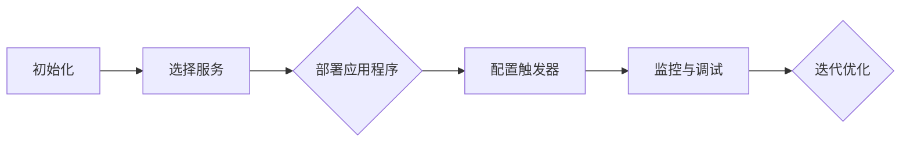
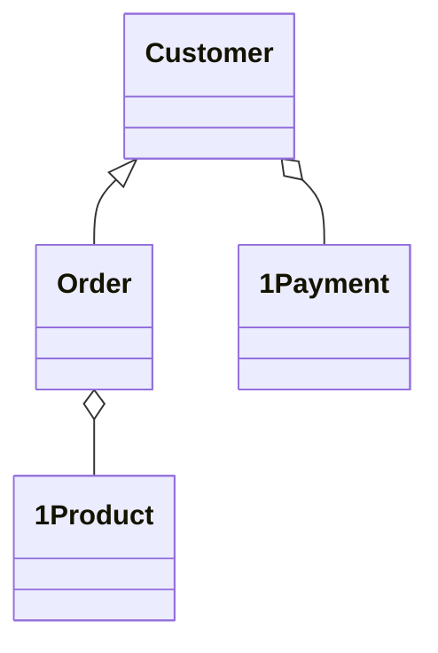
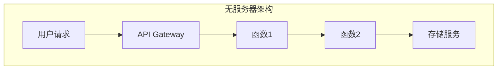
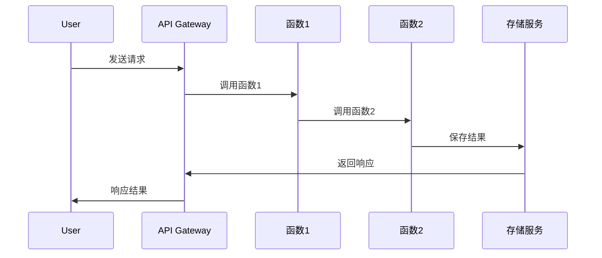

                 

## 大模型软件的无服务器架构设计

### 关键词：大模型软件、无服务器架构、架构设计、云计算、软件工程

> 摘要：随着云计算和容器技术的飞速发展，无服务器架构成为了一种越来越受欢迎的软件部署方式。本文将探讨大模型软件的无服务器架构设计，分析其核心概念、优势与挑战，并提供具体的实现方法与最佳实践。

### 引言与背景介绍

在当今数字化时代，人工智能技术正迅速变革各行各业。大模型软件，如深度学习框架和自然语言处理引擎，成为推动AI发展的关键驱动力。然而，如何高效地部署和管理这些大规模计算软件，成为了软件工程师和架构师面临的重大挑战。

无服务器架构（Serverless Architecture）作为一种新兴的软件架构模式，旨在通过云服务提供商（如AWS、Google Cloud、Azure等）来管理和部署应用程序，无需关心底层服务器资源的管理。这种架构模式提供了高度的可伸缩性、弹性和成本效益，正逐渐成为企业构建现代应用程序的首选方式。

### 第1章: 问题背景与问题描述

#### 1.1.1 问题背景

大模型软件通常具有如下特点：
- **计算密集型**：大模型软件往往需要进行大量并行计算，以训练和优化模型。
- **资源需求高**：这些软件可能需要大量的CPU和GPU资源，以及大规模的数据存储和处理能力。
- **数据隐私与安全**：大模型软件处理的数据可能包含敏感信息，需要严格的隐私保护和安全措施。

#### 1.1.2 问题描述

现有的传统架构在部署和管理这些大模型软件时面临以下挑战：
- **资源管理复杂**：需要手动管理服务器集群，配置和优化硬件资源。
- **可伸缩性不足**：传统架构难以快速响应负载波动，可能导致性能下降或资源浪费。
- **成本高昂**：维护和运营物理服务器或虚拟机成本较高。

#### 1.1.3 问题解决

无服务器架构提供了以下解决方案：
- **自动化资源管理**：云服务提供商自动管理计算资源，无需手动干预。
- **高度可伸缩性**：根据需求自动扩展或缩小计算资源，保证性能和成本最优。
- **成本节约**：按需付费，无需支付固定成本。

#### 1.1.4 边界与外延

无服务器架构的适用场景包括：
- **大规模数据处理**：如大数据分析、机器学习训练等。
- **临时性任务**：如自动化测试、数据处理等。
- **高可用性需求**：如金融交易系统、电商平台等。

#### 1.1.5 概念结构与核心要素组成

无服务器架构的核心概念包括：
- **函数即服务（Function as a Service, FaaS）**：通过云函数提供编程接口，运行在云基础设施上。
- **容器即服务（Container as a Service, CaaS）**：提供容器的托管服务，管理容器的生命周期。
- **事件驱动架构**：基于事件触发函数执行，提高系统响应速度。

### 第2章: 无服务器架构概述

#### 2.1.1 无服务器架构的定义与特点

无服务器架构是一种基于云计算的服务模型，它允许开发人员构建和运行应用程序而无需管理服务器。其核心特点包括：

- **按需分配资源**：根据应用程序的需求动态分配计算资源，无需固定配置。
- **弹性伸缩**：自动扩展或缩小计算资源，以应对负载波动。
- **低成本**：按实际使用量收费，无需支付固定成本。
- **简化运维**：云服务提供商负责管理底层基础设施，降低运维复杂度。

#### 2.1.2 无服务器架构与传统架构的比较

无服务器架构与传统架构相比，具有以下优势：

- **资源管理自动化**：无需手动配置和管理服务器，降低运维负担。
- **高可伸缩性**：自动扩展计算资源，应对负载变化。
- **低成本**：按需付费，节约运营成本。
- **简化部署**：简化部署流程，加快开发周期。

然而，无服务器架构也存在一些挑战，如缺乏对底层硬件的控制、性能瓶颈等。

#### 2.1.3 无服务器架构的核心组成部分

无服务器架构主要包括以下组成部分：

- **函数（Functions）**：作为应用程序的基本构建块，执行特定功能。
- **事件触发器（Event Triggers）**：触发函数执行的事件源。
- **存储服务（Storage Services）**：用于存储函数数据和输出结果。
- **API网关（API Gateway）**：提供API接口，处理外部请求。
- **日志服务（Logging Services）**：记录函数执行日志，便于监控和调试。

#### 2.1.4 无服务器架构的优势与挑战

无服务器架构的优势包括：

- **弹性伸缩**：自动调整计算资源，提高性能。
- **低成本**：按需付费，降低运营成本。
- **简化运维**：减少服务器维护，降低管理复杂度。

然而，其挑战包括：

- **性能瓶颈**：函数执行时间受限于服务提供商的性能。
- **缺乏控制**：无法自定义底层硬件配置。
- **依赖外部服务**：可能面临外部服务故障的影响。

### 第3章: 大模型软件的无服务器架构设计

#### 3.1.1 大模型软件的概述

大模型软件通常包括以下组件：

- **模型训练**：使用大量数据进行模型训练。
- **模型推理**：使用训练好的模型进行预测和分析。
- **数据预处理**：清洗和预处理输入数据，以提高模型性能。

#### 3.1.2 大模型软件的无服务器架构设计原则

设计大模型软件的无服务器架构时，应遵循以下原则：

- **模块化**：将应用程序拆分为独立模块，便于管理和扩展。
- **高可用性**：确保系统在任何情况下都能稳定运行。
- **可伸缩性**：根据需求自动调整计算资源，避免性能瓶颈。
- **安全性**：保护数据和模型，防止未授权访问和泄露。

#### 3.1.3 大模型软件的无服务器架构实现

无服务器架构实现步骤包括：

1. **定义功能模块**：将大模型软件拆分为独立函数，如数据预处理、模型训练和模型推理。
2. **选择合适的服务**：根据需求选择适合的服务，如AWS Lambda、Google Cloud Functions、Azure Functions等。
3. **配置触发器**：设置事件触发器，以触发函数执行。
4. **部署和监控**：部署应用程序，并使用日志和监控工具进行监控和调试。

### 第4章: 无服务器架构的核心概念与联系

#### 4.1.1 无服务器架构的核心概念

无服务器架构的核心概念包括：

- **函数（Functions）**：执行特定功能的基本单元。
- **事件（Events）**：触发函数执行的事件源。
- **触发器（Triggers）**：将事件与函数关联的机制。
- **存储（Storage）**：用于存储数据和函数输出的存储服务。
- **API网关（API Gateway）**：提供API接口，处理外部请求。

#### 4.1.2 无服务器架构的属性特征对比

无服务器架构与传统架构的属性特征对比如下：

| 特性         | 无服务器架构 | 传统架构 |
| ------------ | ------------ | -------- |
| 资源管理     | 自动化       | 手动     |
| 可伸缩性     | 高           | 低       |
| 成本         | 低           | 高       |
| 运维复杂度   | 低           | 高       |
| 灵活性       | 高           | 低       |

#### 4.1.3 无服务器架构的ER实体关系图

```mermaid
erDiagram
    Function ||--|{ Event }|| Event
    Function ||--|{ Trigger }|| Trigger
    Function ||--|{ Storage }|| Storage
    Function ||--|{ API Gateway }|| API Gateway
```

### 第5章: 算法原理讲解

#### 5.1.1 算法原理概述

无服务器架构的设计与实现涉及到多种算法原理，包括：

- **容器编排**：如Kubernetes，用于管理容器化应用程序。
- **负载均衡**：如Nginx，用于分发请求，提高系统性能。
- **分布式存储**：如Cassandra，用于存储大规模数据。

#### 5.1.2 算法流程与mermaid流程图



#### 5.1.3 算法数学模型与公式

无服务器架构的数学模型与公式主要包括：

- **计算资源需求**：$C = f(n, t)$，其中$C$为计算资源需求，$n$为并发请求数，$t$为请求处理时间。
- **成本**：$C = p \times u \times t$，其中$C$为成本，$p$为单价，$u$为使用量，$t$为使用时长。

#### 5.1.4 算法原理的详细讲解

无服务器架构的算法原理主要包括：

1. **容器编排**：通过Kubernetes等工具，实现容器的自动化部署、管理和扩展。
2. **负载均衡**：通过Nginx等工具，实现请求的分发和负载均衡，提高系统性能。
3. **分布式存储**：通过Cassandra等工具，实现大规模数据的存储和管理。

#### 5.1.5 算法原理的举例说明

假设一个无服务器架构的应用程序，处理100个并发请求，每个请求处理时间为10秒。根据计算资源需求模型，计算资源需求为$C = f(100, 10) = 1000$个CPU核心。根据成本模型，成本为$C = p \times u \times t = 0.1 \times 1000 \times 10 = 1000$美元。

### 第6章: 系统功能设计

#### 6.1.1 项目介绍

本章节将介绍一个基于无服务器架构的大模型软件项目，包括项目背景、目标和预期成果。

#### 6.1.2 系统功能设计（领域模型mermaid类图）



### 第7章: 系统架构设计

#### 7.1.1 系统架构设计（mermaid架构图）



#### 7.1.2 系统接口设计

本章节将详细介绍系统接口设计，包括API接口的定义、请求和响应格式。

#### 7.1.3 系统交互（mermaid序列图）



### 第8章: 环境安装与配置

#### 8.1.1 环境要求

本章节将介绍项目所需的环境要求，包括操作系统、编程语言、依赖库等。

#### 8.1.2 安装步骤

本章节将详细描述项目环境的安装过程，包括安装依赖库、配置环境变量等。

#### 8.1.3 配置说明

本章节将介绍项目的配置文件和配置参数，包括API Gateway的配置、函数的配置等。

### 第9章: 系统核心实现

#### 9.1.1 源代码解读

本章节将详细解读项目的核心源代码，包括函数的实现、API Gateway的处理逻辑等。

#### 9.1.2 代码应用分析与解读

本章节将对核心代码进行应用分析和解读，解释代码的实现原理和关键功能。

#### 9.1.3 实际案例分析

本章节将介绍一个实际案例，展示如何使用本项目的大模型软件进行数据分析和预测。

### 第10章: 最佳实践与注意事项

#### 10.1.1 最佳实践技巧

本章节将总结一些最佳实践技巧，帮助读者更好地设计和部署无服务器架构的应用程序。

#### 10.1.2 注意事项与风险防范

本章节将介绍一些常见的注意事项和风险，帮助读者避免潜在的问题和故障。

### 第11章: 小结与拓展阅读

#### 11.1.1 小结

本章节将对全文内容进行总结，强调无服务器架构在大模型软件部署中的优势和挑战。

#### 11.1.2 拓展阅读

本章节将推荐一些相关的书籍、论文和博客，供读者进一步学习和探索。

