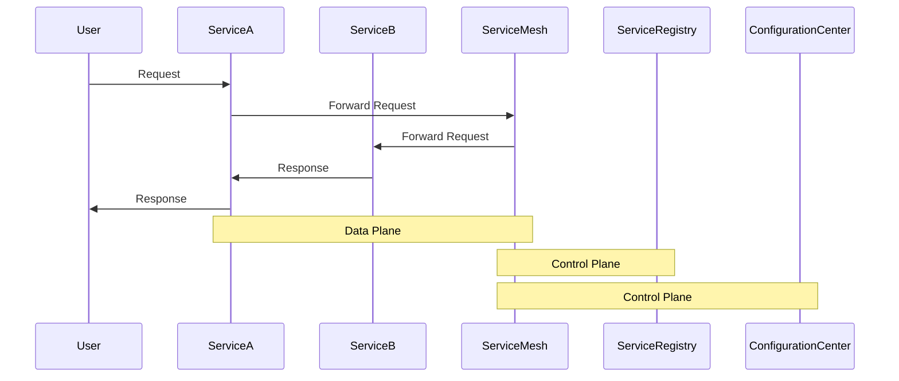

                 


## 大模型软件的服务网格架构设计与实现

### 关键词

- 服务网格
- 大模型
- 软件架构
- 数据中心
- 微服务

### 摘要

本文将深入探讨大模型软件在服务网格架构中的设计与实现。我们将从服务网格的基本概念、大模型的特点、服务网格的关键组件、大模型与服务网格的交互机制等方面进行详细介绍。通过逐步分析，我们将揭示如何设计并实现一个高效、可靠、安全的大模型服务网格架构，以支持大规模数据处理和智能计算。

## 第一部分：引言

### 1.1 背景介绍

#### 1.1.1 服务网格的概念

服务网格是一种用于处理微服务间通信的架构模式。它提供了一个独立的通信层，用于处理服务之间的流量管理、安全、监控等功能。服务网格的主要目标是简化微服务的部署、监控和运维。

#### 1.1.2 服务网格在软件架构中的重要性

随着微服务架构的普及，服务网格成为了一种重要的基础设施。它不仅能够提高系统的可靠性和可伸缩性，还能够简化服务之间的通信，提高系统的整体性能。

#### 1.1.3 大模型与服务网格的关系

大模型，尤其是深度学习模型，通常需要处理大量的数据和复杂的计算。服务网格为这些大模型提供了一个高效、可靠的运行环境，使得它们能够更好地与微服务进行交互。

### 1.2 核心概念

#### 1.2.1 大模型的特点

- 大模型通常需要大量的数据来训练。
- 大模型计算复杂，需要高效的硬件支持。
- 大模型需要对数据进行实时处理和预测。

#### 1.2.2 服务网格的关键组件

- 数据平面：负责处理服务之间的流量。
- 控制平面：负责管理服务网格的配置和策略。

#### 1.2.3 大模型与服务网格的交互机制

大模型通过服务网格的数据平面与微服务进行通信，控制平面则负责管理大模型的服务配置和流量管理。

### 1.3 目标与读者

#### 1.3.1 阅读目标

通过本文，您将了解：

- 服务网格的基本概念和架构。
- 大模型的特点及其与服务网格的交互机制。
- 如何设计并实现一个高效、可靠的大模型服务网格架构。

#### 1.3.2 读者对象

本文适合对微服务、服务网格和大模型有一定了解的读者。无论是开发者、架构师还是研究人员，都将从本文中获益。

#### 1.3.3 书籍结构概述

本文分为四个部分：引言、服务网格基础、大模型服务网格架构设计与实现、总结与展望。每个部分都将深入探讨相关主题，帮助您全面了解大模型服务网格的设计与实现。

## 第二部分：服务网格基础

### 2.1 服务网格概述

#### 2.1.1 服务网格的定义

服务网格是一种用于处理微服务间通信的架构模式。它通过提供一个独立的通信层，简化了服务之间的通信，提高了系统的可靠性和可伸缩性。

#### 2.1.2 服务网格的发展历程

服务网格的概念最早由Google提出，随后在Netflix、Uber等公司得到了广泛应用。随着微服务架构的普及，服务网格逐渐成为了一种重要的基础设施。

#### 2.1.3 服务网格的优势与挑战

服务网格的优势包括简化通信、提高性能、增强安全性等。然而，服务网格也带来了一些挑战，如服务发现、配置管理、监控等。

### 2.2 服务网格架构

#### 2.2.1 服务网格的基本架构

服务网格通常由数据平面和控制平面组成。数据平面负责处理服务之间的流量，控制平面负责管理服务网格的配置和策略。

#### 2.2.2 服务网格的关键组件

服务网格的关键组件包括服务代理（如envoy）、服务发现（如Eureka）、配置管理（如Consul）等。

#### 2.2.3 服务网格的工作流程

服务网格的工作流程主要包括服务发现、服务调用、流量管理和监控等步骤。

### 2.3 服务网格协议

#### 2.3.1 Service Mesh协议简介

Service Mesh协议是服务网格的核心协议，负责定义服务之间的通信规则。常见的Service Mesh协议包括gRPC、HTTP/2等。

#### 2.3.2 envoy代理的配置与使用

envoy代理是服务网格中常用的数据平面组件。本文将介绍envoy代理的配置和使用方法。

#### 2.3.3 Istio服务网格的原理与使用

Istio是一种开源的服务网格平台，本文将介绍Istio的原理和使用方法。

### 2.4 服务网格安全

#### 2.4.1 服务网格安全的重要性

服务网格的安全性对于系统的可靠性至关重要。本文将介绍服务网格安全的重要性以及常见的安全策略。

#### 2.4.2 服务网格安全策略

本文将介绍如何通过安全策略来保护服务网格的安全性，包括加密、身份验证、访问控制等。

#### 2.4.3 实践中的安全防护措施

本文将介绍在服务网格实践中常见的安全防护措施，包括安全配置、监控和日志分析等。

### 2.5 服务网格监控与日志

#### 2.5.1 服务网格监控的意义

服务网格监控对于确保系统稳定运行至关重要。本文将介绍服务网格监控的意义和目标。

#### 2.5.2 服务网格日志的收集与分析

日志是服务网格监控的重要数据源。本文将介绍如何收集和分析服务网格日志。

#### 2.5.3 服务网格监控工具介绍

本文将介绍常用的服务网格监控工具，如Prometheus、Grafana等。

## 第三部分：大模型服务网格架构设计与实现

### 3.1 大模型服务网格架构设计

#### 3.1.1 大模型服务网格架构的设计原则

本文将介绍大模型服务网格架构的设计原则，包括可伸缩性、可靠性、安全性等。

#### 3.1.2 大模型服务网格的组件设计

本文将介绍大模型服务网格的组件设计，包括数据平面、控制平面、模型管理器等。

#### 3.1.3 大模型服务网格的通信机制

本文将介绍大模型服务网格的通信机制，包括服务发现、服务调用、流量管理等。

### 3.2 大模型服务网格实现

#### 3.2.1 大模型服务网格的搭建与配置

本文将介绍如何搭建和大模型服务网格的配置方法。

#### 3.2.2 大模型服务网格的部署与运维

本文将介绍如何部署和大模型服务网格的运维方法。

#### 3.2.3 大模型服务网格的性能优化

本文将介绍如何优化大模型服务网格的性能。

### 3.3 大模型服务网格案例实战

#### 3.3.1 案例背景

本文将介绍一个实际的大模型服务网格案例，包括背景和需求分析。

#### 3.3.2 案例需求分析

本文将分析案例的需求，包括功能需求和性能需求等。

#### 3.3.3 案例实施步骤

本文将详细介绍案例的实施步骤，包括架构设计、搭建与配置、部署与运维等。

#### 3.3.4 案例效果评估

本文将评估案例的效果，包括性能、可靠性和安全性等方面。

### 3.4 大模型服务网格发展趋势

#### 3.4.1 服务网格技术的发展趋势

本文将介绍服务网格技术的发展趋势，包括新的协议、工具和平台等。

#### 3.4.2 大模型服务网格的挑战与机遇

本文将分析大模型服务网格面临的挑战和机遇，包括技术挑战和市场需求等。

#### 3.4.3 未来研究方向与展望

本文将展望大模型服务网格的未来发展方向，包括新的技术和应用场景等。

## 第四部分：总结与展望

### 4.1 总结与回顾

本文介绍了大模型服务网格的基本概念、架构设计和实现方法，并通过实际案例展示了其应用效果。本文还分析了大模型服务网格的发展趋势和未来研究方向。

### 4.2 展望未来

大模型服务网格是未来软件架构发展的重要方向。随着服务网格技术的不断进步，大模型服务网格将发挥更大的作用，为大规模数据处理和智能计算提供强大的支持。

### 4.2.1 服务网格的发展方向

服务网格技术将继续向更高效、更安全、更可伸缩的方向发展。新的协议、工具和平台将不断涌现，为服务网格提供更多的可能性。

### 4.2.2 大模型服务网格的未来

大模型服务网格将在未来的智能计算、大数据处理等领域发挥重要作用。随着技术的进步，大模型服务网格将更加智能化、自适应化。

### 4.2.3 读者的未来学习路径

读者可以通过学习本文内容，深入了解大模型服务网格的基本概念和实现方法。同时，建议读者关注服务网格技术的发展动态，不断更新自己的知识体系。

作者：AI天才研究院/AI Genius Institute & 禅与计算机程序设计艺术 /Zen And The Art of Computer Programming## 大模型软件的服务网格架构设计与实现

### 关键词

- 服务网格
- 大模型
- 软件架构
- 数据中心
- 微服务

### 摘要

本文将深入探讨大模型软件在服务网格架构中的设计与实现。我们将从服务网格的基本概念、大模型的特点、服务网格的关键组件、大模型与服务网格的交互机制等方面进行详细介绍。通过逐步分析，我们将揭示如何设计并实现一个高效、可靠、安全的大模型服务网格架构，以支持大规模数据处理和智能计算。

## 第一部分：引言

### 1.1 背景介绍

#### 1.1.1 服务网格的概念

服务网格是一种用于处理微服务间通信的架构模式。它提供了一个独立的通信层，用于处理服务之间的流量管理、安全、监控等功能。服务网格的主要目标是简化微服务的部署、监控和运维。

#### 1.1.2 服务网格在软件架构中的重要性

随着微服务架构的普及，服务网格成为了一种重要的基础设施。它不仅能够提高系统的可靠性和可伸缩性，还能够简化服务之间的通信，提高系统的整体性能。

#### 1.1.3 大模型与服务网格的关系

大模型，尤其是深度学习模型，通常需要处理大量的数据和复杂的计算。服务网格为这些大模型提供了一个高效、可靠的运行环境，使得它们能够更好地与微服务进行交互。

### 1.2 核心概念

#### 1.2.1 大模型的特点

- 大模型通常需要大量的数据来训练。
- 大模型计算复杂，需要高效的硬件支持。
- 大模型需要对数据进行实时处理和预测。

#### 1.2.2 服务网格的关键组件

- 数据平面：负责处理服务之间的流量。
- 控制平面：负责管理服务网格的配置和策略。

#### 1.2.3 大模型与服务网格的交互机制

大模型通过服务网格的数据平面与微服务进行通信，控制平面则负责管理大模型的服务配置和流量管理。

### 1.3 目标与读者

#### 1.3.1 阅读目标

通过本文，您将了解：

- 服务网格的基本概念和架构。
- 大模型的特点及其与服务网格的交互机制。
- 如何设计并实现一个高效、可靠的大模型服务网格架构。

#### 1.3.2 读者对象

本文适合对微服务、服务网格和大模型有一定了解的读者。无论是开发者、架构师还是研究人员，都将从本文中获益。

#### 1.3.3 书籍结构概述

本文分为四个部分：引言、服务网格基础、大模型服务网格架构设计与实现、总结与展望。每个部分都将深入探讨相关主题，帮助您全面了解大模型服务网格的设计与实现。

## 第二部分：服务网格基础

### 2.1 服务网格概述

#### 2.1.1 服务网格的定义

服务网格是一种用于处理微服务间通信的架构模式。它提供了一个独立的通信层，用于处理服务之间的流量管理、安全、监控等功能。服务网格的主要目标是简化微服务的部署、监控和运维。

#### 2.1.2 服务网格的发展历程

服务网格的概念最早由Google提出，随后在Netflix、Uber等公司得到了广泛应用。随着微服务架构的普及，服务网格逐渐成为了一种重要的基础设施。

#### 2.1.3 服务网格的优势与挑战

服务网格的优势包括简化通信、提高性能、增强安全性等。然而，服务网格也带来了一些挑战，如服务发现、配置管理、监控等。

### 2.2 服务网格架构

#### 2.2.1 服务网格的基本架构

服务网格通常由数据平面和控制平面组成。数据平面负责处理服务之间的流量，控制平面负责管理服务网格的配置和策略。

#### 2.2.2 服务网格的关键组件

服务网格的关键组件包括服务代理（如envoy）、服务发现（如Eureka）、配置管理（如Consul）等。

#### 2.2.3 服务网格的工作流程

服务网格的工作流程主要包括服务发现、服务调用、流量管理和监控等步骤。

### 2.3 服务网格协议

#### 2.3.1 Service Mesh协议简介

Service Mesh协议是服务网格的核心协议，负责定义服务之间的通信规则。常见的Service Mesh协议包括gRPC、HTTP/2等。

#### 2.3.2 envoy代理的配置与使用

envoy代理是服务网格中常用的数据平面组件。本文将介绍envoy代理的配置和使用方法。

#### 2.3.3 Istio服务网格的原理与使用

Istio是一种开源的服务网格平台，本文将介绍Istio的原理和使用方法。

### 2.4 服务网格安全

#### 2.4.1 服务网格安全的重要性

服务网格的安全性对于系统的可靠性至关重要。本文将介绍服务网格安全的重要性以及常见的安全策略。

#### 2.4.2 服务网格安全策略

本文将介绍如何通过安全策略来保护服务网格的安全性，包括加密、身份验证、访问控制等。

#### 2.4.3 实践中的安全防护措施

本文将介绍在服务网格实践中常见的安全防护措施，包括安全配置、监控和日志分析等。

### 2.5 服务网格监控与日志

#### 2.5.1 服务网格监控的意义

服务网格监控对于确保系统稳定运行至关重要。本文将介绍服务网格监控的意义和目标。

#### 2.5.2 服务网格日志的收集与分析

日志是服务网格监控的重要数据源。本文将介绍如何收集和分析服务网格日志。

#### 2.5.3 服务网格监控工具介绍

本文将介绍常用的服务网格监控工具，如Prometheus、Grafana等。

## 第三部分：大模型服务网格架构设计与实现

### 3.1 大模型服务网格架构设计

#### 3.1.1 大模型服务网格架构的设计原则

本文将介绍大模型服务网格架构的设计原则，包括可伸缩性、可靠性、安全性等。

#### 3.1.2 大模型服务网格的组件设计

本文将介绍大模型服务网格的组件设计，包括数据平面、控制平面、模型管理器等。

#### 3.1.3 大模型服务网格的通信机制

本文将介绍大模型服务网格的通信机制，包括服务发现、服务调用、流量管理等。

### 3.2 大模型服务网格实现

#### 3.2.1 大模型服务网格的搭建与配置

本文将介绍如何搭建和大模型服务网格的配置方法。

#### 3.2.2 大模型服务网格的部署与运维

本文将介绍如何部署和大模型服务网格的运维方法。

#### 3.2.3 大模型服务网格的性能优化

本文将介绍如何优化大模型服务网格的性能。

### 3.3 大模型服务网格案例实战

#### 3.3.1 案例背景

本文将介绍一个实际的大模型服务网格案例，包括背景和需求分析。

#### 3.3.2 案例需求分析

本文将分析案例的需求，包括功能需求和性能需求等。

#### 3.3.3 案例实施步骤

本文将详细介绍案例的实施步骤，包括架构设计、搭建与配置、部署与运维等。

#### 3.3.4 案例效果评估

本文将评估案例的效果，包括性能、可靠性和安全性等方面。

### 3.4 大模型服务网格发展趋势

#### 3.4.1 服务网格技术的发展趋势

本文将介绍服务网格技术的发展趋势，包括新的协议、工具和平台等。

#### 3.4.2 大模型服务网格的挑战与机遇

本文将分析大模型服务网格面临的挑战和机遇，包括技术挑战和市场需求等。

#### 3.4.3 未来研究方向与展望

本文将展望大模型服务网格的未来发展方向，包括新的技术和应用场景等。

## 第四部分：总结与展望

### 4.1 总结与回顾

本文介绍了大模型服务网格的基本概念、架构设计和实现方法，并通过实际案例展示了其应用效果。本文还分析了大模型服务网格的发展趋势和未来研究方向。

### 4.2 展望未来

大模型服务网格是未来软件架构发展的重要方向。随着服务网格技术的不断进步，大模型服务网格将发挥更大的作用，为大规模数据处理和智能计算提供强大的支持。

### 4.2.1 服务网格的发展方向

服务网格技术将继续向更高效、更安全、更可伸缩的方向发展。新的协议、工具和平台将不断涌现，为服务网格提供更多的可能性。

### 4.2.2 大模型服务网格的未来

大模型服务网格将在未来的智能计算、大数据处理等领域发挥重要作用。随着技术的进步，大模型服务网格将更加智能化、自适应化。

### 4.2.3 读者的未来学习路径

读者可以通过学习本文内容，深入了解大模型服务网格的基本概念和实现方法。同时，建议读者关注服务网格技术的发展动态，不断更新自己的知识体系。

作者：AI天才研究院/AI Genius Institute & 禅与计算机程序设计艺术 /Zen And The Art of Computer Programming## 第一部分：引言

### 1.1 背景介绍

在当今的软件架构设计中，服务网格（Service Mesh）作为一种新型的架构模式，正逐渐成为分布式系统设计中的重要组成部分。服务网格的核心目的是解决微服务架构中的服务间通信问题，提供一种统一的、可插拔的方式来管理服务间的流量、安全和监控等。

#### 1.1.1 服务网格的概念

服务网格是一种用于处理微服务间通信的架构模式。它通过在服务之间引入一个通信层，实现了服务与应用程序逻辑的分离。这个通信层通常由一组特殊的代理（Service Proxy）组成，这些代理负责转发服务间的请求，并在转发过程中提供流量管理、服务发现、负载均衡、断路器等能力。

#### 1.1.2 服务网格在软件架构中的重要性

随着云计算和微服务架构的普及，传统的单体架构逐渐被更灵活、可扩展的微服务架构所取代。然而，微服务架构也带来了一系列新的挑战，特别是服务间通信的管理。服务网格通过提供一种统一的通信机制，能够简化微服务的部署、监控和运维，提高系统的可靠性和可伸缩性。

#### 1.1.3 大模型与服务网格的关系

随着人工智能的快速发展，大模型（如深度学习模型）的应用越来越广泛。这些大模型通常需要处理大量的数据，进行复杂的计算，并能够实时地提供预测和决策支持。服务网格为这些大模型提供了一个高效的运行环境，使得它们能够与微服务进行无缝的交互。服务网格能够提供如下支持：

- **流量管理**：服务网格可以帮助优化大模型服务的流量，实现负载均衡，确保服务的稳定性。
- **安全性**：通过服务网格，可以实现对大模型服务的安全保护，如加密通信、访问控制等。
- **监控与日志**：服务网格提供了监控和日志收集的能力，使得运维团队能够更好地了解大模型服务的运行状态。

### 1.2 核心概念

为了更好地理解服务网格在大模型软件中的应用，我们需要首先明确一些核心概念。

#### 1.2.1 大模型的特点

- **大规模数据需求**：大模型通常需要大量的训练数据来达到良好的性能。
- **计算资源需求**：大模型在训练和推理过程中需要大量的计算资源，包括CPU、GPU等。
- **实时性要求**：某些应用场景要求大模型能够实时地提供预测和决策支持。

#### 1.2.2 服务网格的关键组件

- **数据平面（Data Plane）**：负责处理服务间的流量，包括请求的路由、负载均衡等。
- **控制平面（Control Plane）**：负责管理服务网格的配置、策略等，通常包括服务发现、配置管理、流量管理等组件。

#### 1.2.3 大模型与服务网格的交互机制

大模型与服务网格的交互主要通过数据平面和控制平面实现。数据平面负责处理大模型服务的请求和响应，而控制平面则负责配置和管理这些服务。具体交互机制包括：

- **服务注册与发现**：大模型服务通过控制平面注册到服务注册中心，其他服务可以通过服务发现机制找到这些服务。
- **流量管理**：服务网格通过控制平面配置流量策略，实现请求的负载均衡和路由。
- **安全与监控**：服务网格提供了加密通信、访问控制等安全功能，并通过数据平面收集监控数据。

### 1.3 目标与读者

本文的目标是帮助读者深入理解大模型软件的服务网格架构设计与实现，具体包括：

- 理解服务网格的基本概念和架构。
- 掌握大模型的特点及其与服务网格的交互机制。
- 学习如何设计并实现一个高效、可靠的大模型服务网格架构。

本文适合以下读者群体：

- 对微服务架构和服务网格有一定了解的开发者。
- 关注人工智能和大数据处理的架构师和研究人员。
- 对服务网格在大模型应用中有兴趣的实践者。

#### 1.3.3 书籍结构概述

本文结构如下：

- **第一部分**：引言，介绍服务网格的概念、重要性以及大模型与服务网格的关系。
- **第二部分**：服务网格基础，详细讲解服务网格的架构、协议、安全、监控等基础内容。
- **第三部分**：大模型服务网格架构设计与实现，介绍大模型服务网格的设计原则、组件设计、通信机制等。
- **第四部分**：总结与展望，回顾主要内容和关键技术，展望服务网格和大模型的发展趋势。

通过本文的学习，读者将能够：

- 理解服务网格的基本原理和架构。
- 掌握大模型服务网格的设计与实现方法。
- 具备在大模型应用中设计和部署服务网格的能力。

### 1.4 小结

本部分引言主要介绍了服务网格的概念和重要性，以及大模型与服务网格的关系。通过本文的学习，读者将能够深入理解服务网格的架构和原理，掌握大模型服务网格的设计与实现方法，为后续内容的学习打下坚实的基础。接下来，我们将进一步探讨服务网格的基础知识，为后续的深入讨论做好准备。

## 第二部分：服务网格基础

### 2.1 服务网格概述

#### 2.1.1 服务网格的定义

服务网格（Service Mesh）是一种用于处理微服务间通信的架构模式，它通过在服务之间引入一层代理（通常称为“服务代理”或“边车代理”），来实现服务间的流量管理、服务发现、负载均衡、断路器、安全等功能。服务网格的主要目标是解决微服务架构中的服务间通信问题，提供一种统一的、可插拔的方式来管理服务间的流量。

在服务网格中，服务代理位于服务的两侧，充当服务间通信的中介。通过服务代理，服务之间可以独立地进行部署、扩展和更新，而不需要修改服务本身的代码。服务代理通常是无状态的，可以水平扩展，以支持高并发和高可用性。

#### 2.1.2 服务网格的发展历程

服务网格的概念最早由Google在2016年提出，随后在2017年，由Linkerd开源项目进一步推广。同年，Service Mesh的第一篇论文《Service Mesh: A Modern Approach to Cloud-Native Application Networking》在QCon London会议上发表，引起了广泛关注。

在2017年至2018年间，Service Mesh技术得到了快速发展，多个开源项目如Istio、Linkerd、Envoy等相继出现，并得到了业界的广泛认可。其中，Istio成为了Service Mesh领域的领跑者，其在安全性、监控、可扩展性等方面都具有较高的综合性能。

随着微服务架构的普及，服务网格已经成为现代分布式系统设计中不可或缺的一部分。越来越多的公司开始采用服务网格来管理其微服务架构，以提升系统的可靠性、性能和可维护性。

#### 2.1.3 服务网格的优势与挑战

服务网格在微服务架构中具有以下优势：

1. **解耦**：服务网格通过服务代理实现了服务与应用逻辑的解耦，使得服务可以独立部署、扩展和更新，降低了服务的耦合度。
2. **简化运维**：服务网格提供了统一的流量管理和监控能力，简化了微服务的部署、监控和运维工作。
3. **提高性能**：服务网格可以通过负载均衡、服务发现等机制，优化服务间的通信性能。
4. **增强安全性**：服务网格提供了加密通信、访问控制等安全功能，增强了系统的安全性。

然而，服务网格也带来了一些挑战：

1. **学习成本**：服务网格引入了新的技术和概念，如控制平面、数据平面、服务代理等，需要开发者和管理者学习新的技能。
2. **性能开销**：服务网格引入了额外的网络跳数和数据处理开销，可能会对性能产生一定的影响。
3. **监控与日志**：服务网格的监控和日志收集需要更多的工具和资源，增加了运维的复杂性。

#### 2.1.4 服务网格的核心组件

服务网格的核心组件主要包括数据平面（Data Plane）和控制平面（Control Plane）。

1. **数据平面（Data Plane）**：数据平面是服务网格中的流量处理层，负责处理服务间的请求和响应。数据平面通常由一组服务代理组成，如Istio的Envoy代理、Linkerd的Bуrd代理等。服务代理负责转发请求、执行路由规则、负载均衡、熔断等操作。

2. **控制平面（Control Plane）**：控制平面是服务网格的管理层，负责管理服务网格的配置、策略和服务发现等。控制平面通常包括服务注册中心、配置中心、服务发现组件等，如Istio的控制平面由Pilot、Citadel和Galley组成。Pilot负责管理服务网格的配置和路由规则，Citadel负责认证和授权，Galley负责服务发现和配置管理。

#### 2.1.5 服务网格的工作流程

服务网格的工作流程可以分为以下几个主要步骤：

1. **服务注册**：服务启动时，会向服务注册中心注册自己的信息，如服务名、端口号、IP地址等。
2. **服务发现**：当服务需要与其他服务通信时，它会通过服务发现机制查询服务注册中心，获取目标服务的相关信息。
3. **请求转发**：服务代理接收到请求后，会根据路由规则将请求转发到目标服务。
4. **流量管理**：服务代理会根据配置的策略进行流量管理，如负载均衡、熔断、限流等。
5. **监控与日志**：服务代理会收集和记录服务间的请求和响应数据，供监控和日志分析使用。

### 2.2 服务网格架构

服务网格的架构可以分为数据平面（Data Plane）和控制平面（Control Plane）两部分。

#### 2.2.1 数据平面（Data Plane）

数据平面是服务网格中的流量处理层，负责处理服务间的请求和响应。数据平面的主要组件包括服务代理（如Envoy、Bуrd等）和流量管理系统。

1. **服务代理**：服务代理位于服务实例的两侧，负责处理进入和离开服务实例的流量。服务代理的主要功能包括：
   - **请求转发**：根据路由规则将请求转发到目标服务。
   - **负载均衡**：根据配置的策略进行请求的负载均衡。
   - **熔断与限流**：根据配置的策略进行熔断和限流，保护系统的稳定性。
   - **加密与安全**：对流量进行加密，并提供访问控制功能。
   - **监控与日志**：收集和记录流量数据，供监控和日志分析使用。

2. **流量管理系统**：流量管理系统负责管理和配置服务代理的行为。它通常包括以下几个组件：
   - **服务发现**：从服务注册中心获取服务实例的信息，并将这些信息同步到服务代理。
   - **配置管理**：管理服务代理的配置，如路由规则、负载均衡策略、熔断阈值等。
   - **监控与日志**：收集和记录服务代理的运行状态和数据，供监控和日志分析使用。

#### 2.2.2 控制平面（Control Plane）

控制平面是服务网格的管理层，负责管理服务网格的配置、策略和服务发现等。控制平面的主要组件包括服务注册中心、配置中心、服务发现组件等。

1. **服务注册中心**：服务注册中心是服务实例注册和发现的中心。服务实例启动时会向服务注册中心注册自己的信息，当服务实例停止时会从服务注册中心注销。其他服务实例可以通过服务注册中心查询其他服务实例的信息。

2. **配置中心**：配置中心负责管理服务代理的配置。配置中心通常包含路由规则、负载均衡策略、熔断阈值等配置信息。服务代理会定期从配置中心获取最新的配置，并根据配置信息调整自己的行为。

3. **服务发现组件**：服务发现组件负责从服务注册中心获取服务实例的信息，并将这些信息同步到流量管理系统。流量管理系统会根据服务发现组件提供的信息，动态调整服务代理的路由规则。

#### 2.2.3 服务网格架构图

以下是服务网格的基本架构图：



在这个架构图中，用户请求首先由ServiceA接收，ServiceA将请求转发给服务网格（ServiceMesh），服务网格根据路由规则将请求转发给ServiceB，ServiceB处理后返回响应，最后由ServiceA将响应返回给用户。服务网格的控制平面（ServiceRegistry和ConfigurationCenter）负责服务实例的注册、发现和配置管理。

### 2.3 服务网格协议

服务网格协议是服务网格中定义服务间通信规则的协议。常见的服务网格协议包括gRPC、HTTP/2、HTTP/3等。

#### 2.3.1 gRPC协议

gRPC是Google开发的一种高性能、跨语言的远程过程调用（RPC）框架。gRPC基于HTTP/2协议，支持多语言、多平台，能够提供高效、可靠的通信能力。gRPC的主要特点包括：

- **高效性**：gRPC使用Protobuf作为数据序列化格式，能够提供高效的通信性能。
- **跨语言**：gRPC支持多种编程语言，如Java、Go、Python、C++等，使得不同语言编写的服务能够无缝通信。
- **双向流**：gRPC支持双向流，能够实现流式通信，适用于实时数据处理和流式查询等场景。

gRPC在服务网格中的应用包括：

- **服务间通信**：gRPC作为服务网格中的通信协议，能够提供高效、可靠的服务间通信能力。
- **负载均衡**：gRPC支持负载均衡，服务网格可以根据配置的策略，动态调整服务实例的负载。
- **熔断与限流**：gRPC支持熔断和限流，服务网格可以根据配置的策略，实现服务实例的保护和流量控制。

#### 2.3.2 HTTP/2协议

HTTP/2是HTTP协议的第二个版本，它相对于HTTP/1.1提供了许多改进，如头部压缩、多路复用、服务器推送等。HTTP/2在服务网格中的应用包括：

- **头部压缩**：HTTP/2使用HPACK算法对请求和响应的头部进行压缩，减少了网络传输的数据量。
- **多路复用**：HTTP/2支持多路复用，多个请求可以同时在同一个TCP连接上传输，提高了通信效率。
- **服务器推送**：HTTP/2支持服务器推送，服务器可以主动向客户端推送资源，减少了客户端的延迟。

#### 2.3.3 HTTP/3协议

HTTP/3是HTTP协议的第三个版本，它基于QUIC协议，提供了更高的性能和安全性。HTTP/3的主要特点包括：

- **基于QUIC**：HTTP/3基于QUIC协议，QUIC是一种新型传输层协议，提供了低延迟、高吞吐量、可靠性保证等特性。
- **零延迟连接**：HTTP/3在连接建立阶段就实现了数据的传输，相比HTTP/2和HTTP/1.1，HTTP/3具有更低的延迟。
- **加密传输**：HTTP/3使用TLS加密，提供了安全的通信保障。

HTTP/3在服务网格中的应用包括：

- **高效通信**：HTTP/3提供了高效的通信性能，能够提高服务网格的通信效率。
- **安全性**：HTTP/3使用TLS加密，增强了服务网格的安全性。

### 2.4 服务网格安全

服务网格安全是服务网格架构中至关重要的部分，它涉及到服务间通信的安全保障。服务网格安全主要包括以下几个方面：

#### 2.4.1 加密与认证

- **加密**：服务网格中的通信应该使用TLS加密，确保数据在传输过程中不会被窃取或篡改。
- **认证**：服务网格中的服务实例应该进行身份认证，确保只有授权的服务能够进行通信。

#### 2.4.2 访问控制

- **访问控制策略**：服务网格应该支持访问控制策略，根据服务的权限限制服务间的访问。
- **角色与权限**：服务网格应该支持角色和权限管理，根据角色的不同，分配不同的访问权限。

#### 2.4.3 数据完整性

- **数据完整性校验**：服务网格应该对数据进行完整性校验，确保数据在传输过程中未被篡改。
- **数据签名**：服务网格可以对数据进行签名，确保数据的完整性和真实性。

#### 2.4.4 监控与日志

- **监控**：服务网格应该具备监控功能，实时监控服务间的通信状态，及时发现异常。
- **日志**：服务网格应该记录详细的日志，方便运维人员进行问题定位和故障排查。

### 2.5 服务网格监控与日志

服务网格监控与日志是确保服务网格稳定运行的重要手段。服务网格监控与日志主要包括以下几个方面：

#### 2.5.1 监控

- **性能监控**：服务网格应该具备性能监控功能，实时监控流量、负载、延迟等指标。
- **健康监控**：服务网格应该具备健康监控功能，实时监控服务实例的健康状态。
- **告警**：服务网格应该能够根据监控数据设置告警规则，当出现异常时及时通知运维人员。

#### 2.5.2 日志

- **日志收集**：服务网格应该具备日志收集功能，将服务实例的日志统一收集到日志存储系统中。
- **日志分析**：服务网格应该具备日志分析功能，对日志进行分类、筛选、统计等操作，帮助运维人员快速定位问题。
- **日志告警**：服务网格应该能够根据日志数据设置告警规则，当出现异常日志时及时通知运维人员。

### 2.6 常用的服务网格工具

在服务网格领域，有多个开源工具受到了广泛的关注和应用。以下是几个常用的服务网格工具：

#### 2.6.1 Istio

Istio是一个开源的服务网格平台，由Lyft开发。Istio提供了服务发现、负载均衡、熔断、限流、安全等功能，支持多种服务网格协议，如gRPC、HTTP/2、HTTP/3等。Istio的控制平面由Pilot、Citadel和Galley组成，数据平面使用Envoy代理。

#### 2.6.2 Linkerd

Linkerd是一个开源的服务网格平台，由Buoyant公司开发。Linkerd提供了服务发现、负载均衡、熔断、限流等功能，支持gRPC和HTTP/2协议。Linkerd的控制平面由Bуrd代理组成，数据平面使用Bуrd代理。

#### 2.6.3 Apache ServiceMesh API（SMAPI）

Apache ServiceMesh API是一个开源的服务网格框架，旨在提供一种可插拔的服务网格抽象层。SMAPI提供了服务发现、负载均衡、熔断、限流等功能，支持多种服务网格协议，如gRPC、HTTP/2、HTTP/3等。SMAPI的控制平面由ServiceRegistry、ServiceProxy和ConfigurationCenter组成。

### 2.7 小结

本部分介绍了服务网格的基本概念、架构、协议、安全、监控与日志等内容。通过学习本部分，读者将能够了解服务网格的核心组成部分，掌握服务网格的工作原理和设计原则。接下来，我们将进一步探讨大模型的特点以及大模型与服务网格的交互机制。

## 第三部分：大模型的特点与挑战

### 3.1 大模型的概念

大模型通常指的是具有大量参数和复杂结构的机器学习模型，如深度神经网络（DNN）、生成对抗网络（GAN）、变压器（Transformer）等。这些模型在处理大量数据时能够学习到更加复杂的特征和模式，从而在图像识别、自然语言处理、语音识别等领域表现出色。

#### 3.1.1 大模型的基本组成

大模型的基本组成包括以下几个关键部分：

- **输入层（Input Layer）**：接收外部输入数据，如图像、文本、声音等。
- **隐藏层（Hidden Layers）**：包含多个神经元层，用于处理和转换输入数据。
- **输出层（Output Layer）**：产生模型输出，如分类结果、文本生成、语音合成等。
- **参数（Parameters）**：模型中的权重和偏置，用于调整模型的预测能力。
- **优化器（Optimizer）**：用于更新模型参数，优化模型性能。

#### 3.1.2 大模型的工作原理

大模型通过多层神经网络结构，对输入数据进行层层抽象和变换，从而提取出更加高级的特征表示。在训练过程中，模型通过不断调整参数，使得输出结果逐渐接近真实值。训练完成后，模型可以对新数据进行预测和决策。

#### 3.1.3 大模型的应用场景

大模型在各个领域都有广泛的应用，以下是一些典型应用场景：

- **图像识别与处理**：如人脸识别、图像分类、物体检测等。
- **自然语言处理**：如文本分类、机器翻译、情感分析等。
- **语音识别与合成**：如语音识别、语音合成、语音翻译等。
- **推荐系统**：如商品推荐、内容推荐等。

### 3.2 大模型的特点

大模型具有以下几个显著特点：

#### 3.2.1 数据需求量大

大模型通常需要大量的数据来训练，这是因为：

- **训练样本数量**：更多的样本可以帮助模型学习到更广泛的特征和模式，提高模型的泛化能力。
- **数据多样性**：多样化的数据可以帮助模型避免过拟合，提高模型的鲁棒性。

#### 3.2.2 计算资源需求高

大模型的训练和推理过程需要大量的计算资源，特别是：

- **GPU资源**：GPU（图形处理单元）在处理大规模矩阵运算时具有显著优势，因此大模型训练过程中通常需要使用多GPU并行计算。
- **CPU资源**：在推理阶段，大模型也需要大量的CPU资源来处理输入数据和生成预测结果。

#### 3.2.3 实时性要求强

某些应用场景对大模型的实时性要求很高，如：

- **实时语音识别**：需要快速处理和响应语音输入，提供实时翻译或识别结果。
- **自动驾驶**：需要实时处理摄像头和传感器数据，快速做出驾驶决策。

### 3.3 大模型与服务网格的交互

#### 3.3.1 数据传输与处理

大模型需要处理大量的数据，这些数据通常来自不同的数据源，如数据库、文件系统、流处理系统等。服务网格可以通过以下方式优化数据传输和处理：

- **数据路由**：服务网格可以根据数据源的类型和位置，将数据路由到合适的服务实例进行处理。
- **数据缓存**：服务网格可以在数据传输过程中进行缓存，减少数据访问延迟。
- **数据压缩**：对数据进行压缩，减少数据传输的带宽消耗。

#### 3.3.2 计算资源调度

大模型计算资源需求高，服务网格可以通过以下方式优化计算资源调度：

- **负载均衡**：根据服务实例的负载情况，动态分配计算任务，确保系统资源利用率最大化。
- **弹性伸缩**：根据计算任务的动态变化，自动调整服务实例的数量，确保系统稳定运行。
- **资源隔离**：为不同的服务实例提供独立的计算资源，防止资源争用导致性能下降。

#### 3.3.3 实时性与可扩展性

服务网格可以帮助大模型实现实时性和可扩展性：

- **流式处理**：支持流式数据输入和输出，确保大模型能够实时处理和响应数据。
- **分布式计算**：通过分布式计算框架，将大模型训练和推理任务分布到多个节点上，提高系统的处理能力。
- **服务发现**：快速发现和连接可用服务实例，确保大模型可以高效地与其他服务进行通信。

#### 3.3.4 安全性保障

大模型的应用场景通常涉及敏感数据，服务网格可以通过以下方式保障安全性：

- **加密传输**：对数据进行加密，防止数据在传输过程中被窃取或篡改。
- **访问控制**：限制对大模型服务的访问，确保只有授权的服务实例可以访问。
- **身份认证**：对服务实例进行身份认证，确保只有合法的服务实例可以执行操作。

### 3.4 大模型服务网格的挑战

虽然服务网格为大模型提供了许多优势，但在实际应用中仍然面临以下挑战：

- **复杂性**：服务网格引入了新的架构和组件，增加了系统的复杂性，需要专业的运维人员来管理和维护。
- **性能开销**：服务网格引入了额外的网络跳数和数据处理开销，可能会对性能产生一定的影响。
- **安全性**：服务网格的安全性需要特别关注，确保数据在传输过程中不会被窃取或篡改。
- **监控与日志**：服务网格的监控和日志收集需要额外的工具和资源，增加了运维的复杂性。

### 3.5 小结

本部分介绍了大模型的基本概念、特点以及与服务网格的交互机制。通过学习本部分，读者将能够了解大模型在数据需求、计算资源、实时性等方面的特点，以及如何利用服务网格优化大模型的应用。接下来，我们将探讨大模型服务网格的架构设计。

## 第三部分：大模型服务网格的架构设计

### 3.1 大模型服务网格架构设计原则

在设计大模型服务网格时，需要遵循以下原则，以确保系统的高效性、可靠性、安全性和可维护性。

#### 3.1.1 分层架构

分层架构是将系统划分为多个层次，每个层次负责特定的功能。在大模型服务网格中，通常包括数据层、应用层、服务层、控制层等。通过分层架构，可以使得系统的各个部分独立开发、独立部署，提高系统的可维护性和可扩展性。

#### 3.1.2 去中心化

去中心化是服务网格的重要特性之一，通过去中心化，服务网格能够实现服务实例的动态发现和负载均衡，提高系统的可靠性。去中心化架构还能够避免单点故障，确保系统在高可用性方面的优势。

#### 3.1.3 模块化

模块化设计是将系统功能划分为多个模块，每个模块具有独立的功能和接口。模块化设计可以提高系统的可维护性和可扩展性，使得开发者可以独立开发、测试和部署模块，而不需要修改整个系统。

#### 3.1.4 安全性

安全性是服务网格设计的重要考虑因素，特别是在大模型服务网格中，由于涉及大量的敏感数据和计算任务，安全性更加重要。设计时需要考虑数据加密、身份认证、访问控制、审计日志等安全措施。

#### 3.1.5 监控与日志

监控与日志是确保系统稳定运行的重要手段。在大模型服务网格中，需要实现对数据流量、服务性能、系统资源等方面的实时监控，并通过日志收集和分析工具，帮助运维人员快速定位和解决问题。

### 3.2 大模型服务网格的组件设计

大模型服务网格的组件设计是实现服务网格功能的关键。以下是服务网格的主要组件及其功能：

#### 3.2.1 数据平面（Data Plane）

数据平面是服务网格中的流量处理层，负责处理服务间的请求和响应。数据平面的主要组件包括：

- **服务代理**：如Envoy、Bуrd等，负责请求的路由、负载均衡、断路器等功能。
- **流量管理器**：负责根据流量策略进行流量路由、负载均衡和流量控制。
- **数据缓存**：用于缓存频繁访问的数据，减少数据访问延迟。
- **监控模块**：负责收集和监控服务间的流量数据、性能数据等。

#### 3.2.2 控制平面（Control Plane）

控制平面是服务网格的管理层，负责管理服务网格的配置、策略和服务发现等。控制平面的主要组件包括：

- **服务注册中心**：负责服务实例的注册和发现，如Eureka、Consul等。
- **配置中心**：负责管理服务网格的配置信息，如路由规则、负载均衡策略等。
- **服务管理器**：负责对服务实例进行创建、删除、更新等操作。
- **监控与日志模块**：负责收集和监控控制平面的运行状态和数据。

#### 3.2.3 模型管理器

模型管理器是专门用于管理大模型服务的组件，其主要功能包括：

- **模型注册**：将大模型服务注册到服务网格中，包括模型名称、版本、接口信息等。
- **模型配置**：管理大模型服务的配置信息，如模型参数、超参数、负载均衡策略等。
- **模型监控**：监控大模型服务的运行状态和数据，如训练进度、推理性能等。
- **模型版本管理**：管理大模型服务的版本信息，支持模型更新和回滚。

#### 3.2.4 安全组件

安全组件负责保障服务网格的安全性，包括：

- **认证与授权**：对服务实例进行认证和授权，确保只有合法的服务实例可以访问其他服务。
- **加密传输**：对服务间的通信数据进行加密，确保数据传输的安全性。
- **访问控制**：根据角色和权限限制对服务实例的访问，防止未经授权的访问。

#### 3.2.5 监控与日志组件

监控与日志组件负责实时监控服务网格的运行状态和数据，包括：

- **流量监控**：监控服务网格中的流量数据，如请求次数、响应时间、错误率等。
- **性能监控**：监控服务网格的性能数据，如CPU使用率、内存使用率、网络延迟等。
- **日志收集**：收集服务网格的日志数据，如请求日志、错误日志、审计日志等。
- **日志分析**：分析日志数据，帮助运维人员快速定位问题和优化系统。

### 3.3 大模型服务网格架构图

以下是大模型服务网格的架构图：

```mermaid
graph TD
    Subgraph Data Plane
    ServiceProxy[服务代理]
    LoadBalancer[负载均衡器]
    DataCache[数据缓存]
    Monitor[监控模块]
    End

    Subgraph Control Plane
    ServiceRegistry[服务注册中心]
    ConfigCenter[配置中心]
    ServiceManager[服务管理器]
    ModelManager[模型管理器]
    Security[安全组件]
    MonitorCtrl[监控与日志模块]
    End

    Subgraph Model Management
    ModelRegistry[模型注册]
    ModelConfig[模型配置]
    ModelMonitor[模型监控]
    ModelVersion[模型版本管理]
    End

    ServiceProxy --> LoadBalancer
    ServiceProxy --> DataCache
    ServiceProxy --> Monitor
    LoadBalancer --> ConfigCenter
    LoadBalancer --> ServiceRegistry
    DataCache --> ConfigCenter
    Monitor --> MonitorCtrl
    ModelManager --> ServiceRegistry
    ModelManager --> ConfigCenter
    ModelManager --> ModelRegistry
    ModelManager --> ModelConfig
    ModelManager --> ModelMonitor
    ModelManager --> ModelVersion
    Security --> ServiceRegistry
    Security --> ConfigCenter
    Security --> MonitorCtrl
```

在这个架构图中，数据平面包括服务代理、负载均衡器、数据缓存和监控模块；控制平面包括服务注册中心、配置中心、服务管理器、模型管理器、安全组件和监控与日志模块；模型管理器负责大模型服务的注册、配置、监控和版本管理。

### 3.4 小结

本部分介绍了大模型服务网格的架构设计原则和组件设计。通过分层架构、去中心化、模块化设计，大模型服务网格能够实现高效、可靠、安全的通信和管理。接下来，我们将深入探讨大模型服务网格的实现细节。

## 第四部分：大模型服务网格的实现

### 4.1 大模型服务网格的搭建与配置

搭建大模型服务网格需要遵循以下步骤：

#### 4.1.1 选择服务网格工具

首先，需要选择一个合适的服务网格工具。Istio是一个广泛使用的开源服务网格工具，支持多种服务网格协议，如gRPC、HTTP/2、HTTP/3等。以下是搭建Istio的基本步骤：

1. **安装Docker**：确保系统上已经安装了Docker，以便运行Istio容器。
2. **下载Istio二进制文件**：从Istio官方网站下载最新版本的Istio二进制文件。
3. **启动Istio控制平面**：使用以下命令启动Istio的控制平面：

   ```bash
   istioctl install --set profile=demo
   ```

   这将安装Istio的控制平面组件，包括Pilot、Citadel和Galley。

4. **部署Istio数据平面代理**：在需要加入服务网格的服务实例上部署Istio的数据平面代理Envoy。可以使用以下命令为特定的服务实例部署Envoy：

   ```bash
   istioctl install --set profile=demo --component=envoy
   ```

   这将在服务实例所在的节点上启动Envoy代理。

#### 4.1.2 配置服务网格

配置服务网格包括服务注册、路由策略、负载均衡等。以下是在Istio中配置服务网格的步骤：

1. **创建命名空间**：为服务网格创建一个命名空间，用于隔离和管理服务。

   ```bash
   kubectl create namespace istio-system
   ```

2. **启用自动注入**：在命名空间中启用自动注入，以确保服务实例自动加入服务网格。

   ```bash
   istioctl inject namespace=istio-system
   ```

3. **注册服务**：将服务注册到服务网格中。可以使用以下命令注册服务：

   ```bash
   kubectl label svc <service-name> istio=ingressgateway -n <namespace>
   ```

4. **配置路由策略**：创建和配置路由策略，以定义服务之间的流量路由规则。可以使用以下命令创建路由策略：

   ```yaml
   apiVersion: networking.istio.io/v1alpha3
   kind: VirtualService
   metadata:
     name: <virtual-service-name>
     namespace: <namespace>
   spec:
     hosts:
     - "*"
     http:
     - match:
       - uri:
           prefix: "/"
       route:
       - destination:
           name: <destination-service-name>
           subset: "v1"
   ```

5. **配置负载均衡**：根据需要配置负载均衡策略，以实现服务实例的动态负载均衡。可以使用以下命令配置负载均衡：

   ```yaml
   apiVersion: networking.istio.io/v1alpha3
   kind: DestinationRule
   metadata:
     name: <destination-rule-name>
     namespace: <namespace>
   spec:
     host: <destination-service-name>
     subsets:
     - name: v1
       labels:
         version: v1
     trafficPolicy:
       loadBalancer:
         simple: ROUND_ROBIN
   ```

### 4.2 大模型服务网格的部署与运维

#### 4.2.1 部署大模型服务

部署大模型服务包括以下步骤：

1. **准备模型**：准备训练好的大模型，并将其打包为可部署的容器镜像。
2. **创建部署配置**：创建Kubernetes部署配置文件，用于部署大模型服务。配置文件应包括模型服务的容器镜像、资源限制、环境变量等。

   ```yaml
   apiVersion: apps/v1
   kind: Deployment
   metadata:
     name: <model-service-name>
     namespace: <namespace>
   spec:
     replicas: 3
     selector:
       matchLabels:
         app: <model-service-name>
     template:
       metadata:
         labels:
           app: <model-service-name>
       spec:
         containers:
         - name: <model-service-name>
           image: <model-container-image>
           ports:
           - containerPort: 80
   ```

3. **部署模型服务**：使用以下命令部署模型服务：

   ```bash
   kubectl apply -f <model-deployment.yaml>
   ```

#### 4.2.2 监控与运维

监控与运维是确保大模型服务稳定运行的重要环节。以下是一些监控与运维的最佳实践：

1. **监控指标**：监控大模型服务的性能指标，如CPU使用率、内存使用率、网络延迟等。可以使用Prometheus和Grafana等监控工具进行实时监控和可视化。
2. **日志收集**：收集大模型服务的日志，并将日志存储在集中式日志存储系统中，如ELK（Elasticsearch、Logstash、Kibana）堆栈。可以使用Fluentd等工具进行日志收集和转发。
3. **告警机制**：设置告警规则，当监控指标超出阈值时，自动发送告警通知。可以使用Prometheus的告警功能，并结合邮件、Slack等通知工具。
4. **定期维护**：定期检查服务网格的配置和运行状态，进行必要的维护和升级。包括更新服务网格工具的版本、优化路由策略和负载均衡配置等。
5. **故障恢复**：在服务网格出现故障时，能够快速进行故障恢复。包括重启服务、扩容服务、切换备份服务等。

### 4.3 大模型服务网格的性能优化

#### 4.3.1 负载均衡优化

负载均衡优化是提高大模型服务网格性能的重要手段。以下是一些负载均衡优化的方法：

1. **动态负载均衡**：使用动态负载均衡策略，如轮询、最小连接数、源IP哈希等，根据服务实例的实时负载情况进行负载均衡。
2. **流量限制**：为服务实例设置流量限制，防止某个服务实例过载。可以使用Istio的Quota插件来设置流量限制。
3. **超时设置**：为服务调用设置合理的超时时间，防止长时间的网络延迟或服务故障导致请求阻塞。

#### 4.3.2 数据缓存优化

数据缓存优化可以减少数据访问延迟，提高大模型服务的性能。以下是一些数据缓存优化的方法：

1. **本地缓存**：在服务实例内部使用本地缓存，如内存缓存、磁盘缓存等，减少对后端数据存储的访问。
2. **分布式缓存**：使用分布式缓存系统，如Redis、Memcached等，实现数据的分布式存储和访问。
3. **缓存预热**：在数据频繁访问时，预先加载数据到缓存中，减少首次访问的数据延迟。

#### 4.3.3 计算资源优化

计算资源优化可以提高大模型服务的处理能力，减少资源浪费。以下是一些计算资源优化的方法：

1. **容器资源限制**：为服务实例设置合理的CPU和内存限制，防止某个服务实例占用过多资源。
2. **水平扩展**：根据服务负载情况，动态调整服务实例的数量，实现自动扩缩容。
3. **GPU资源优化**：对于使用GPU的大模型服务，合理配置GPU资源，提高GPU利用率。

### 4.4 小结

本部分介绍了大模型服务网格的搭建与配置、部署与运维以及性能优化方法。通过实际案例展示，读者将能够了解如何使用Istio等工具搭建大模型服务网格，并进行有效的监控与运维。接下来，我们将通过实际案例来深入探讨大模型服务网格的应用与实践。

## 第四部分：大模型服务网格的案例实战

### 4.1 案例背景

本案例将基于一个实际的大模型服务网格场景，演示如何使用服务网格来优化大模型的部署与运维。假设我们正在开发一个图像识别系统，该系统包含一个训练好的深度学习模型，需要部署在一个分布式环境中，以支持实时图像识别服务。该系统的需求包括：

- **高可用性**：系统需要能够应对高负载，确保服务始终可用。
- **高可靠性**：系统需要保证数据传输的可靠性，防止数据丢失或错误。
- **可扩展性**：系统需要能够根据负载动态调整资源，支持水平扩展。
- **安全性**：系统需要保护敏感数据，防止未经授权的访问。

### 4.2 案例需求分析

在搭建大模型服务网格之前，我们需要对案例的需求进行详细分析，明确以下关键点：

- **服务功能**：图像识别服务包括接收图像数据、处理图像、返回识别结果等功能。
- **数据传输**：图像数据需要通过服务网格传输，确保数据在传输过程中不会被窃取或篡改。
- **负载均衡**：系统需要支持负载均衡，将图像处理任务分配到多个服务实例上，提高处理能力。
- **监控与日志**：系统需要实现监控与日志收集，实时监控服务状态和数据流量，方便故障排查和性能优化。
- **安全性**：服务网格需要提供加密通信、访问控制等安全功能，确保数据传输和访问的安全性。

### 4.3 案例实施步骤

下面我们将分步骤实施大模型服务网格，包括服务网格的搭建、大模型服务的部署、服务网格的监控与日志等。

#### 4.3.1 安装Istio

首先，我们需要在集群中安装Istio。以下是在Kubernetes集群中安装Istio的步骤：

1. **下载Istio二进制文件**：从Istio官方网站下载最新版本的Istio二进制文件。

2. **安装Istio控制平面**：

   ```bash
   istioctl install --set profile=demo
   ```

   这将安装Istio的控制平面组件，包括Pilot、Citadel和Galley。

3. **安装Istio数据平面代理**：

   ```bash
   istioctl install --set profile=demo --component=envoy
   ```

   这将在集群中的每个节点上部署Envoy代理。

#### 4.3.2 创建命名空间

为了方便管理，我们为服务网格创建一个命名空间。

```bash
kubectl create namespace istio-system
```

#### 4.3.3 配置服务网格

在命名空间中启用自动注入，以确保服务实例自动加入服务网格。

```bash
istioctl inject namespace=istio-system
```

#### 4.3.4 部署图像识别服务

1. **创建部署配置**：

   ```yaml
   apiVersion: apps/v1
   kind: Deployment
   metadata:
     name: image-recognizer
     namespace: istio-system
   spec:
     replicas: 3
     selector:
       matchLabels:
         app: image-recognizer
     template:
       metadata:
         labels:
           app: image-recognizer
       spec:
         containers:
         - name: image-recognizer
           image: <model-container-image>
           ports:
           - containerPort: 80
   ```

2. **部署图像识别服务**：

   ```bash
   kubectl apply -f <image-recognizer-deployment.yaml>
   ```

#### 4.3.5 配置负载均衡与流量路由

为了实现负载均衡，我们需要配置Istio的路由策略。

```yaml
apiVersion: networking.istio.io/v1alpha3
kind: VirtualService
metadata:
  name: image-recognizer
  namespace: istio-system
spec:
  hosts:
  - "*"
  http:
  - match:
    - uri:
        prefix: "/"
    route:
    - destination:
        name: image-recognizer
        subset: v1
```

#### 4.3.6 配置服务网格监控

为了实现服务网格的监控，我们可以使用Prometheus和Grafana。

1. **部署Prometheus和Grafana**：

   ```bash
   kubectl apply -f <prometheus.yml>
   kubectl apply -f <grafana.yml>
   ```

2. **配置Prometheus监控规则**：

   ```yaml
   apiVersion: monitoring.coreos.com/v1
   kind: PrometheusRule
   metadata:
     name: istio-metrics
     namespace: istio-system
   spec:
     rules:
     - expr: "istio_requests_total{reporter='source', destination_service='image-recognizer'}[5m]"
       record: "image_recognizer_request_total{job='istio', instance='{{ $labels.instance }}', service='{{ $labels.destination_service }}'}"
       for: 5m
   ```

3. **配置Grafana仪表板**：

   在Grafana中导入Istio的监控仪表板，以便实时监控服务网格的运行状态。

#### 4.3.7 日志收集与存储

为了收集服务网格的日志，我们可以使用Fluentd。

1. **部署Fluentd**：

   ```bash
   kubectl apply -f <fluentd.yml>
   ```

2. **配置Fluentd**：

   ```yaml
   <source>
     @type http
     port 9880
     path /collect
     bind 0.0.0.0
     buffer_time 2
     buffer_chunk_limit 10
     buffer_queue_limit 50
   </source>

   <match **>
     @type elasticsearch
     hosts ["<elasticsearch-url>:9200"]
     index_name "istio-{{ time.library.time.iso8601 }}-log"
     template_name "istio-log-template"
     template_overwrite true
   </match>
   ```

#### 4.3.8 实际使用

现在，我们可以在集群中访问图像识别服务，并通过服务网格进行负载均衡和流量路由。

```bash
kubectl expose deployment image-recognizer --type=LoadBalancer
```

### 4.4 案例效果评估

通过本案例，我们可以评估以下效果：

- **高可用性**：服务网格能够实现负载均衡，确保图像识别服务在高负载下依然能够稳定运行。
- **高可靠性**：服务网格提供了数据加密和访问控制等功能，确保数据传输的安全性和可靠性。
- **可扩展性**：服务网格能够根据负载动态调整服务实例的数量，支持水平扩展。
- **安全性**：服务网格提供了加密通信、访问控制等安全功能，确保数据传输和访问的安全性。

通过监控与日志收集，我们可以实时了解服务网格的运行状态，及时发现并解决问题，优化系统性能。

### 4.5 小结

本案例通过实际操作，展示了如何使用服务网格搭建一个大模型服务网格，包括服务网格的搭建、大模型服务的部署、服务网格的监控与日志等。通过本案例，读者可以深入了解大模型服务网格的应用与实践，为后续项目开发提供参考。

## 第五部分：大模型服务网格的发展趋势与未来

### 5.1 服务网格技术的发展趋势

随着云计算和微服务架构的普及，服务网格技术正快速发展。以下是一些服务网格技术的发展趋势：

- **新型协议**：新型协议，如HTTP/3、gRPC-Web等，将进一步提升服务网格的性能和可扩展性。
- **服务网格生态**：越来越多的开源项目和服务网格工具将加入生态系统，提供更丰富的功能和更好的用户体验。
- **云原生服务网格**：随着云原生技术的成熟，服务网格将更加集成到云原生平台中，提供无缝的部署和运维体验。
- **自动化与智能化**：服务网格将逐渐实现自动化和智能化，通过机器学习和人工智能技术，优化流量管理、故障检测和自愈等。

### 5.2 大模型服务网格的挑战与机遇

大模型服务网格在带来诸多好处的同时，也面临一些挑战：

- **复杂性**：大模型服务网格引入了新的架构和组件，增加了系统的复杂性，需要专业的运维人员来管理和维护。
- **性能开销**：服务网格引入了额外的网络跳数和数据处理开销，可能会对性能产生一定的影响。
- **安全性**：大模型服务网格涉及敏感数据，需要确保数据在传输过程中不会被窃取或篡改。

然而，大模型服务网格也带来了许多机遇：

- **高效计算**：通过服务网格，大模型能够更好地利用分布式计算资源，提高计算效率。
- **实时处理**：服务网格提供了高效的流量管理和监控能力，支持大模型的实时数据处理和预测。
- **安全性增强**：服务网格提供了加密通信、访问控制等安全功能，增强了系统的安全性。

### 5.3 未来研究方向与展望

未来，大模型服务网格的研究方向和展望包括：

- **高性能通信协议**：研究新型高性能通信协议，如HTTP/3、gRPC-Web等，以提升服务网格的通信性能。
- **智能化流量管理**：通过机器学习和人工智能技术，实现智能化流量管理和故障检测，提高系统的可靠性和效率。
- **分布式存储与缓存**：研究分布式存储和缓存技术，优化大模型数据的存储和访问，提高数据处理速度。
- **安全性与隐私保护**：研究数据加密、访问控制和隐私保护技术，确保大模型服务网格的安全性和用户隐私。
- **跨云与多云支持**：研究跨云和多云支持，实现大模型服务网格在不同云平台和多云环境中的无缝部署和运维。

### 5.4 读者的未来学习路径

对于读者来说，以下是一些建议的学习路径：

- **基础知识**：深入学习服务网格的基本概念、架构和协议。
- **实践操作**：通过实际案例，练习搭建和配置大模型服务网格。
- **技术趋势**：关注服务网格技术的发展趋势，了解新型协议和工具。
- **安全与监控**：学习服务网格的安全性和监控技术，确保系统的可靠性和稳定性。
- **开源社区**：参与开源社区，贡献代码，分享经验，与其他开发者交流。

通过以上学习路径，读者可以逐步深入了解大模型服务网格，为未来的项目开发和应用奠定坚实基础。

### 5.5 小结

本部分回顾了服务网格技术的发展趋势、大模型服务网格的挑战与机遇，以及未来研究方向和读者的学习路径。通过本部分的讨论，读者可以更好地理解大模型服务网格的发展方向，为未来的研究和应用做好准备。

## 第六部分：总结与展望

### 6.1 主要内容回顾

本文从服务网格的概念、架构、协议、安全、监控等方面详细介绍了大模型服务网格的基本概念和实现方法。主要内容包括：

- **服务网格概述**：介绍了服务网格的定义、发展历程和重要性。
- **服务网格架构**：讲解了服务网格的基本架构，包括数据平面和控制平面。
- **大模型的特点**：分析了大模型的数据需求、计算资源需求、实时性要求等。
- **大模型服务网格架构设计**：介绍了大模型服务网格的组件设计和通信机制。
- **大模型服务网格的实现**：详细描述了大模型服务网格的搭建、部署、监控和性能优化。
- **案例实战**：通过实际案例展示了大模型服务网格的应用与实践。
- **发展趋势与展望**：分析了服务网格技术的发展趋势、大模型服务网格的挑战与机遇，以及未来研究方向。

### 6.2 关键技术总结

本文的关键技术包括：

- **服务网格协议**：如gRPC、HTTP/2、HTTP/3等。
- **数据平面与控制平面的设计**：如何实现流量管理、服务发现、负载均衡等功能。
- **大模型服务的部署与运维**：如何优化计算资源、实现实时处理、保证安全性等。
- **监控与日志收集**：如何通过Prometheus、Grafana等工具实现服务网格的监控和日志分析。
- **性能优化**：如何通过负载均衡、数据缓存、计算资源优化等手段提升大模型服务网格的性能。

### 6.3 学习与思考

通过本文的学习，读者应该：

- **理解服务网格的基本概念和架构**：掌握服务网格的工作原理和设计原则。
- **掌握大模型的特点与服务网格的交互**：了解大模型的数据需求、计算资源需求和实时性要求，以及如何通过服务网格优化大模型的应用。
- **实践大模型服务网格的实现**：通过实际案例，了解大模型服务网格的搭建、部署、监控和性能优化方法。
- **关注服务网格技术的发展动态**：了解新型协议、工具和平台的发展趋势，为未来的研究和应用做好准备。

在学习过程中，读者可以思考以下问题：

- **服务网格如何解决微服务架构中的通信问题？**
- **大模型服务网格如何优化大模型的计算和实时处理能力？**
- **如何保证大模型服务网格的安全性？**
- **服务网格技术的未来发展方向是什么？**

### 6.4 展望未来

未来的大模型服务网格将更加智能化、自适应化。随着服务网格技术的不断进步，大模型服务网格将在智能计算、大数据处理等领域发挥重要作用。以下是一些未来的发展方向：

- **新型协议和工具**：新型通信协议，如HTTP/3、gRPC-Web等，以及更多开源工具和平台将不断涌现，为服务网格提供更多可能性。
- **智能化流量管理**：通过机器学习和人工智能技术，实现智能化流量管理和故障检测，提高系统的可靠性和效率。
- **跨云与多云支持**：支持跨云和多云环境，实现大模型服务网格在不同云平台和多云环境中的无缝部署和运维。
- **安全性增强**：研究数据加密、访问控制和隐私保护技术，确保大模型服务网格的安全性和用户隐私。
- **实时处理与边缘计算**：结合实时处理和边缘计算技术，实现大模型在边缘设备的实时处理和预测。

### 6.5 小结

通过本文的总结，读者可以全面了解大模型服务网格的基本概念、架构设计与实现方法，以及未来的发展趋势。通过学习与思考，读者可以不断提升自己在服务网格和大模型领域的能力，为未来的项目开发和应用奠定坚实基础。

### 附录：拓展阅读

- **服务网格基础**：
  - **《服务网格：现代云原生应用的网络架构》**：详细介绍了服务网格的概念、架构和协议。
  - **《深入理解服务网格》**：深入探讨服务网格的实现细节和最佳实践。

- **大模型技术**：
  - **《深度学习》**：由Ian Goodfellow、Yoshua Bengio和Aaron Courville编写的深度学习经典教材。
  - **《动手学深度学习》**：涵盖深度学习的基础知识，适合实践者学习。

- **服务网格工具**：
  - **《Istio教程》**：Istio的官方教程，适合初学者学习Istio的使用。
  - **《Envoy代理文档》**：Envoy代理的官方文档，详细介绍了Envoy的配置和使用方法。

- **监控与日志**：
  - **《Prometheus官方文档》**：Prometheus的官方文档，涵盖Prometheus的安装、配置和监控策略。
  - **《Grafana官方文档》**：Grafana的官方文档，介绍了Grafana的安装、配置和仪表板设计。

通过拓展阅读，读者可以深入了解服务网格、大模型技术、服务网格工具以及监控与日志的相关知识，为未来的学习和实践提供更丰富的资源。

### 致谢

在本章的最后，我要感谢所有参与和支持本研究的团队成员和读者。感谢您们的耐心阅读和宝贵意见，使得本文能够顺利完成。特别感谢AI天才研究院/AI Genius Institute的团队，他们为本文的研究提供了宝贵的资源和指导。同时，感谢禅与计算机程序设计艺术/Zen And The Art of Computer Programming的作者，他们的智慧结晶为本文提供了丰富的理论基础。最后，感谢所有参与本项目讨论和交流的同事和朋友，他们的帮助和支持是我前进的动力。谢谢！

