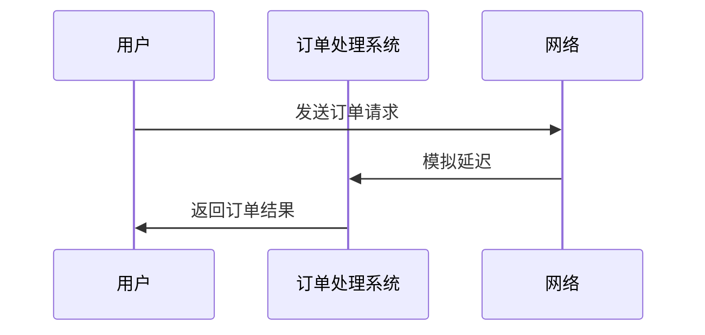
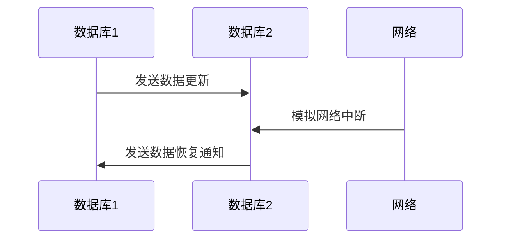
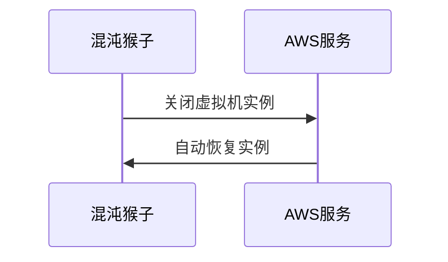

                 

### 大模型软件的混沌工程测试策略

在当今信息化和智能化的大潮中，大模型软件已经成为推动科技进步和产业变革的重要力量。这些软件不仅具有庞大的数据量处理能力，还具备高度的智能化和自适应能力，广泛应用于人工智能、自然语言处理、图像识别等多个领域。然而，随着其复杂度的增加，大模型软件在实际应用中面临着一系列挑战，尤其是稳定性和可靠性的问题。为了应对这些问题，混沌工程测试策略应运而生。

混沌工程测试是一种通过故意引入错误、异常和意外情况，对系统进行压力测试和故障注入的方法，旨在提高系统的容错能力和稳定性。本文将围绕大模型软件的混沌工程测试策略，系统地探讨其核心概念、测试方法、策略设计以及实际应用案例，帮助读者深入了解并掌握这一重要的测试技术。

本文的关键词包括“大模型软件”、“混沌工程测试”、“测试策略”、“测试方法”和“稳定性”。通过本文的阅读，读者将能够：

1. **理解大模型软件的基本概念和特点**：包括其数据规模、复杂度和应用场景。
2. **掌握混沌工程测试的基本原理和目的**：了解混沌工程测试如何通过故意引入异常，提高系统的容错能力。
3. **熟悉混沌工程测试的方法和实践**：包括黑盒测试和白盒测试的具体方法及其在大型软件中的应用。
4. **学会设计有效的混沌工程测试策略**：理解如何根据大模型软件的特性，设计合理的测试用例和测试执行流程。
5. **通过实际案例了解混沌工程测试的应用效果**：学习如何在实际项目中应用混沌工程测试，提高软件的稳定性。

本文的摘要部分将简要介绍大模型软件和混沌工程测试的基本概念，阐述其重要性，并概述本文的结构和内容。接下来，我们将逐一深入探讨上述各个核心部分，通过逻辑清晰、结构紧凑的论述，帮助读者全面掌握大模型软件的混沌工程测试策略。

### 大模型软件的基本概念和特点

大模型软件是指具有极其庞大的数据规模和处理复杂度的高级软件系统，通常涉及大规模数据处理、机器学习和深度学习等技术。这些软件系统在数据存储、计算资源和算法复杂度上都具有极高的要求。以下将详细探讨大模型软件的核心概念、应用场景和特点。

#### 核心概念

大模型软件的核心概念主要体现在其数据规模和处理复杂性上。首先，大模型软件需要处理的数据量通常达到 PB（皮字节）级别，甚至更高。例如，在人工智能领域，训练一个先进的深度学习模型可能需要数百万个样本和数十TB的数据。其次，这些软件系统通常需要高效的计算资源和强大的处理能力，以支持复杂的计算任务。例如，在图像识别和自然语言处理领域，大模型软件需要运行大量的矩阵运算和并行计算。

#### 应用场景

大模型软件的应用场景非常广泛，涵盖了众多行业和领域。以下是一些典型应用场景：

1. **人工智能和机器学习**：大模型软件在训练复杂的机器学习模型时至关重要。这些模型需要大量的数据和高性能计算资源进行训练，以便能够进行有效的预测和决策。

2. **自然语言处理**：在自然语言处理领域，大模型软件被广泛应用于语音识别、机器翻译、文本生成和情感分析等任务。例如，百度翻译和谷歌翻译都依赖于大模型软件来实现高质量的翻译服务。

3. **图像识别和计算机视觉**：大模型软件在图像识别和计算机视觉领域具有广泛的应用。例如，人脸识别、自动驾驶和医疗图像分析等领域都依赖于大模型软件来处理和分析图像数据。

4. **金融科技**：在大数据分析和风险控制方面，大模型软件被广泛应用于金融行业。例如，通过分析海量交易数据，大模型软件可以帮助金融机构识别潜在的风险和欺诈行为。

5. **生物信息学**：在生物信息学领域，大模型软件被用于基因序列分析、药物研发和疾病预测等任务。这些任务需要处理大量的生物数据，并运用复杂的算法进行计算。

#### 特点

大模型软件具有以下显著特点：

1. **数据规模大**：如前所述，大模型软件通常需要处理的数据量达到 PB 级别，这使得数据存储和管理成为一大挑战。

2. **计算复杂度高**：大模型软件通常涉及复杂的算法和大量的并行计算。例如，深度学习模型中的矩阵运算和梯度下降算法需要高效的计算资源。

3. **高度智能化**：大模型软件通过机器学习和深度学习技术，实现了高度的智能化和自适应能力。这些软件系统能够根据输入数据和环境动态调整其行为，从而提高其性能和准确性。

4. **高度依赖数据质量**：大模型软件的性能和质量高度依赖于数据的质量和完整性。如果数据存在噪声或错误，可能会导致模型性能下降甚至失效。

5. **高稳定性要求**：由于大模型软件广泛应用于关键业务场景，其稳定性和可靠性至关重要。任何故障或性能问题都可能对业务造成重大影响。

通过以上分析，我们可以看到，大模型软件在当今信息化和智能化时代具有极其重要的作用。然而，其庞大的数据规模、复杂的计算需求和高度的智能化也带来了巨大的挑战。混沌工程测试作为一种提高软件稳定性和可靠性的方法，为大模型软件的开发和维护提供了重要的技术支持。

#### 问题的背景与描述

在大模型软件的开发和维护过程中，稳定性问题尤为突出。这些软件系统通常需要处理庞大的数据集，并依赖复杂的算法和计算资源。因此，即使在正常情况下，它们也可能因为各种内外部因素而出现异常行为或故障。这些问题不仅会影响系统的性能，还可能导致关键业务中断，甚至造成经济损失。

首先，大模型软件的复杂性使得其开发过程面临诸多挑战。这些软件通常涉及多个组件和模块，每个组件都可能存在潜在的错误和缺陷。例如，在开发阶段，程序员可能会遗漏关键代码逻辑，或者在数据预处理过程中引入噪声。这些错误和缺陷在正常情况下可能不会显现，但在实际运行中，却可能导致系统崩溃或性能下降。

其次，大模型软件对数据质量和完整性的高度依赖也增加了其稳定性的风险。如果数据存在噪声、缺失或不一致，模型可能无法正常训练或预测，从而导致系统失效。此外，由于大模型软件通常运行在分布式环境中，网络延迟、节点故障等问题也会对其稳定性产生负面影响。

为了解决这些问题，传统的软件测试方法，如单元测试、集成测试和系统测试等，显得力不从心。这些测试方法主要针对预定的输入条件和预期的输出结果，无法全面检测系统在异常情况下的行为。因此，一种新的测试方法——混沌工程测试（Chaos Engineering）应运而生。

混沌工程测试旨在通过故意引入错误、异常和意外情况，对系统进行压力测试和故障注入，从而验证系统在异常情况下的稳定性和容错能力。具体来说，混沌工程测试包括以下几个核心步骤：

1. **设计故障注入方案**：根据系统的关键组件和潜在风险，设计一系列故障注入方案。这些方案可以是模拟网络延迟、节点故障、数据损坏等。

2. **执行故障注入**：在实际环境中执行故障注入方案，观察系统在故障情况下的行为。例如，可以通过模拟网络故障来测试系统是否能够自动切换到备用网络，或者通过模拟数据损坏来测试系统是否能够恢复数据。

3. **监控和记录**：在故障注入过程中，实时监控系统的性能指标，如响应时间、吞吐量、错误率等，并记录系统的行为和日志。

4. **分析和改进**：根据测试结果，分析系统在故障情况下的表现，发现潜在的问题和瓶颈。然后，通过改进代码、优化架构或调整配置等手段，提升系统的稳定性和可靠性。

通过混沌工程测试，开发团队可以更全面地了解系统的脆弱性，并采取相应的措施进行改进。这不仅有助于提高系统的稳定性，还可以降低系统在真实环境中出现故障的风险，从而保障关键业务的高效运行。

总之，大模型软件在开发和维护过程中面临着复杂的挑战，混沌工程测试作为一种新的测试方法，为解决这些挑战提供了有效的手段。通过混沌工程测试，开发团队能够在控制环境中模拟各种异常情况，验证系统的稳定性和容错能力，为实际部署奠定坚实基础。

### 混沌工程测试的核心概念和原理

混沌工程测试是一种通过故意引入错误、异常和意外情况，对系统进行压力测试和故障注入的方法，旨在提高系统的容错能力和稳定性。其核心概念和原理如下：

#### 定义

混沌工程测试（Chaos Engineering）是一种系统测试方法，其核心理念是通过人为引入故障、异常和不确定性，来观察和评估系统在实际运行环境中的应对能力和恢复能力。这种方法的核心目的是在控制环境中模拟各种真实世界中的异常情况，以便发现系统的潜在脆弱性并进行改进。

#### 目的

混沌工程测试的主要目的是：

1. **提高系统的容错能力**：通过故意引入故障，观察系统如何应对，从而增强系统的容错性，减少因故障而导致的系统崩溃或服务中断。
2. **提升系统的可靠性**：通过持续进行混沌测试，可以发现并修复系统中的潜在问题，提高系统的整体可靠性。
3. **优化系统设计**：通过分析故障发生的原因和系统应对策略，可以发现系统设计的不足，从而优化系统架构和代码设计。

#### 核心概念

1. **故障注入**：故障注入是混沌工程测试的核心步骤，即故意引入故障或异常情况，如网络中断、节点故障、数据损坏等。故障注入可以通过脚本、模拟工具或手动操作来实现。
   
2. **指标监控**：在故障注入过程中，实时监控系统的关键性能指标（KPIs），如响应时间、吞吐量、错误率、资源利用率等，以便评估系统的表现。

3. **故障恢复**：在故障注入后，观察系统如何恢复到正常状态。这包括系统的自愈能力、故障恢复速度和最终恢复效果。

4. **反馈循环**：通过分析测试结果，不断优化故障注入方案和系统设计，形成一个反馈循环，持续提升系统的稳定性和可靠性。

#### 原理

混沌工程测试的原理可以概括为以下几步：

1. **定义测试目标**：明确测试的目标和范围，如特定模块、服务或整个系统。

2. **设计故障场景**：根据系统的特点和潜在风险，设计一系列故障场景。这些场景可以是网络延迟、节点故障、数据损坏等。

3. **执行故障注入**：在实际环境中执行故障注入，并实时监控系统的响应。

4. **记录和数据分析**：记录系统的行为和性能指标，分析故障对系统的影响。

5. **改进和优化**：根据分析结果，调整系统设计、代码或配置，优化故障注入方案，并重复测试，形成反馈循环。

#### 混沌工程与传统的测试方法的区别

与传统测试方法相比，混沌工程测试具有以下几个显著区别：

1. **主动性**：传统测试方法通常被动地等待缺陷暴露，而混沌工程测试则通过主动引入故障，模拟真实世界中的异常情况。

2. **全面性**：混沌工程测试不仅关注系统的功能正确性，还关注系统在异常情况下的应对能力和恢复能力。

3. **反馈循环**：混沌工程测试强调持续改进，通过不断进行故障注入和分析，优化系统设计和架构。

4. **风险管理**：混沌工程测试通过主动识别和评估系统的脆弱性，降低系统在真实环境中出现故障的风险。

通过以上分析，我们可以看到，混沌工程测试不仅是一种测试方法，更是一种系统设计和维护的理念。它通过主动引入故障和持续改进，帮助开发团队提高系统的稳定性和可靠性，从而更好地应对复杂的业务环境和多变的市场需求。

### 混沌工程测试的主要方法和实践

混沌工程测试作为一种通过故意引入错误和异常情况来提升系统稳定性的方法，其核心在于选择合适的测试方法和实践策略。以下是几种主要的混沌工程测试方法及其应用场景：

#### 黑盒测试

黑盒测试是一种不关注系统内部实现，仅通过输入和输出验证系统功能是否正常的方法。在混沌工程测试中，黑盒测试主要用于验证系统在面对外部异常时的行为。

**方法：**

1. **故意引入外部异常**：例如，模拟网络延迟、拒绝服务攻击或数据中心故障。
2. **执行测试用例**：通过预设的测试用例，验证系统在外部异常情况下的响应。
3. **监控系统行为**：实时监控系统的性能指标，如响应时间、错误率等。

**应用场景：**

- **网络服务**：测试网络异常情况下的服务可用性和恢复能力。
- **分布式系统**：验证跨数据中心服务在故障情况下的稳定性和容错能力。

**案例实践：**

假设一个电商网站在模拟网络故障情况下，验证其订单处理系统的稳定性。测试团队通过模拟网络延迟，观察订单处理系统的响应时间和错误率，评估其恢复能力。

#### 白盒测试

白盒测试是一种基于系统内部结构和代码逻辑的测试方法，通过分析代码路径和逻辑来设计测试用例。在混沌工程测试中，白盒测试主要用于验证系统内部组件和模块在面对故障时的行为。

**方法：**

1. **分析代码路径**：理解系统的代码结构和关键逻辑。
2. **设计测试用例**：根据代码路径，设计一系列可能引起故障的测试用例。
3. **执行测试**：通过断点、日志和代码覆盖工具，验证系统的内部行为。

**应用场景：**

- **核心模块**：验证系统核心组件在面对故障时的稳定性和正确性。
- **代码质量**：通过白盒测试，可以发现潜在的错误和漏洞，提升代码质量。

**案例实践：**

以一个分布式数据库系统为例，测试团队通过分析数据库的复制机制和备份策略，设计一系列故障测试用例，验证系统在数据丢失或网络故障情况下的恢复能力。

#### 故障注入工具

在实际应用中，故障注入工具可以帮助自动化和高效地进行混沌工程测试。以下是一些常见的故障注入工具：

- **Chaos Monkey**：由Netflix开发，用于随机关闭系统组件，测试系统的自动恢复能力。
- **ChaosBlade**：一个开源的混沌工程工具，支持多种故障注入方式，如网络中断、服务降级等。
- **Chaoskube**：用于Kubernetes环境的混沌工程工具，可以模拟各种故障情况。

**使用方法：**

1. **安装和配置**：根据系统环境和需求，安装并配置相应的故障注入工具。
2. **定义故障场景**：通过工具提供的接口或配置文件，定义各种故障场景。
3. **执行测试**：运行故障注入工具，观察系统的响应和恢复情况。

**案例实践：**

使用Chaos Monkey对AWS服务进行混沌测试。配置Chaos Monkey后，它将随机关闭AWS中的虚拟机实例，观察服务如何自动恢复。

#### 实践经验

在实际的混沌工程测试中，以下经验可以帮助团队更有效地进行测试：

- **逐步增加复杂性**：从简单的故障场景开始，逐步增加复杂度，以确保系统能够应对各种情况。
- **持续反馈**：将测试结果和分析反馈给开发团队，持续改进系统设计和代码。
- **自动化测试**：利用自动化工具和脚本，减少手动操作，提高测试效率和覆盖范围。

通过以上方法和实践，开发团队可以更全面地了解系统的脆弱性，并采取相应的措施进行改进，从而提高系统的稳定性和可靠性。

### 大模型软件的混沌工程测试策略

在了解了混沌工程测试的基本概念和方法后，接下来我们将探讨如何为大模型软件设计有效的混沌工程测试策略。设计合适的测试策略对于确保测试的有效性和效率至关重要。以下是详细的大模型软件混沌工程测试策略，包括测试用例设计、测试执行流程、结果分析与反馈。

#### 测试用例设计

测试用例设计是混沌工程测试的核心步骤，必须根据大模型软件的特点和潜在风险进行定制。以下是一些设计测试用例的关键原则：

1. **覆盖关键功能和路径**：确保测试用例能够覆盖软件中的关键功能和路径，特别是那些与数据规模和处理复杂性密切相关的部分。

2. **模拟异常情况**：设计测试用例时，要考虑各种可能的异常情况，如数据损坏、节点故障、网络中断等。这些测试用例应模拟真实的故障场景，以评估系统的容错能力和恢复能力。

3. **随机性和多样性**：测试用例应具有随机性和多样性，避免测试过程中出现偏差，确保测试结果的全面性和准确性。

4. **易维护和可复现**：测试用例应易于维护和复现，以便在后续测试中快速更新和调整。

以下是几个具体的测试用例示例：

- **测试用例1：数据损坏**  
  模拟数据损坏情况，通过修改或删除数据，观察系统是否能够正确处理错误数据，并自动恢复。

- **测试用例2：节点故障**  
  模拟某个计算节点故障，观察系统是否能够自动切换到其他节点，确保服务的连续性。

- **测试用例3：网络中断**  
  模拟网络中断，观察系统在无法访问外部资源时的行为，如是否能够本地处理数据，或是否能够自动重试。

#### 测试执行流程

测试执行流程包括故障注入、监控和记录、结果分析等步骤。以下是一个典型的测试执行流程：

1. **故障注入**：根据测试用例，在控制环境中执行故障注入。这可以通过自动化工具或手动操作实现。

2. **监控和记录**：在故障注入过程中，实时监控系统的关键性能指标和日志。这包括系统的响应时间、吞吐量、错误率、资源利用率等。

3. **故障恢复**：在故障注入后，观察系统如何恢复到正常状态。这包括系统的自愈能力、故障恢复速度和最终恢复效果。

4. **结果分析**：对监控数据进行详细分析，识别系统的弱点和瓶颈。这包括故障发生时系统的行为、性能指标的变化以及故障恢复的情况。

#### 结果分析与反馈

测试结果分析是混沌工程测试的关键环节，通过分析测试结果，可以识别系统的潜在问题和改进机会。以下是一些关键步骤：

1. **故障分析**：分析故障发生的根本原因，如代码缺陷、配置错误或系统设计问题。

2. **性能评估**：评估系统在故障情况下的性能表现，包括响应时间、吞吐量等关键指标。

3. **恢复能力评估**：评估系统在故障后的恢复能力，包括自愈能力、恢复速度和最终恢复效果。

4. **改进措施**：根据测试结果，制定改进措施，如优化代码、调整系统配置或改进架构设计。

5. **反馈循环**：将测试结果和分析反馈给开发团队，形成反馈循环，持续优化系统设计和代码。

以下是结果分析的一个示例：

- **故障分析**：在一次节点故障测试中，发现系统未能成功切换到备用节点，原因是负载均衡配置错误。
- **性能评估**：故障期间，系统的响应时间增加了50%，吞吐量下降了30%。
- **恢复能力评估**：系统在故障后尝试了自动恢复，但恢复时间超过了预期。

根据以上分析，开发团队需要调整负载均衡配置，优化故障恢复策略，并加强节点监控，以确保系统在未来的故障情况下能够更快地恢复。

#### 持续改进

混沌工程测试是一个持续的过程，需要不断地进行测试、分析和改进。以下是一些建议：

- **定期测试**：定期进行混沌工程测试，以检测系统的稳定性和可靠性。
- **自动化测试**：利用自动化工具和脚本，减少手动操作，提高测试效率和覆盖范围。
- **持续反馈**：将测试结果和分析反馈给开发团队，形成反馈循环，推动系统持续改进。

通过以上策略，开发团队可以有效地提高大模型软件的稳定性，确保其在复杂和多变的环境中能够正常运行。

### 混沌工程测试的实际应用案例

为了更好地理解混沌工程测试在实际项目中的应用，以下将通过一个真实的案例——某大型电商平台的数据处理系统，详细介绍测试环境设置、故障注入方法、测试结果以及最终的改进措施。

#### 案例背景

某大型电商平台拥有海量的用户数据和交易数据，其数据处理系统负责实时处理这些数据，包括用户行为分析、推荐系统和交易处理等。为了确保系统的稳定性和可靠性，测试团队决定采用混沌工程测试方法对其数据处理系统进行全面的测试。

#### 测试环境设置

测试团队首先搭建了与生产环境相似的测试环境，包括多个分布式节点、网络设施和存储系统。为了确保测试结果的准确性和可复现性，测试环境设置了以下关键要素：

1. **节点配置**：测试环境包含多个虚拟机实例，模拟实际生产环境中的节点分布。
2. **网络设施**：模拟了多网络环境，包括内网和外网，以及可能的网络延迟和丢包情况。
3. **存储系统**：模拟了分布式存储系统，包括SSD和HDD存储，以及可能的存储故障。
4. **监控工具**：部署了完善的监控工具，如Prometheus、Grafana等，实时收集和处理系统的性能数据。

#### 故障注入方法

在测试过程中，测试团队根据系统的关键功能和潜在风险，设计了多种故障注入方法，包括以下几种：

1. **数据损坏**：通过修改或删除部分数据，模拟数据损坏情况，观察系统如何处理错误数据。
2. **节点故障**：模拟某个计算节点故障，观察系统是否能够自动切换到其他节点，确保服务的连续性。
3. **网络中断**：模拟网络中断，观察系统在无法访问外部资源时的行为，如是否能够本地处理数据，或是否能够自动重试。
4. **负载过高**：模拟大量用户请求同时访问系统，观察系统在高负载下的性能表现。

具体操作步骤如下：

1. **数据损坏**：使用自动化脚本随机选择部分数据，进行修改或删除，然后观察系统在读取和处理数据时的行为。
2. **节点故障**：使用故障注入工具Chaos Monkey，随机关闭一个计算节点，观察系统是否能够自动切换到其他节点。
3. **网络中断**：模拟外部网络中断，使用网络隔离工具，观察系统是否能够自动切换到内网，或是否能够重试请求。
4. **负载过高**：使用压力测试工具，模拟大量用户请求同时访问系统，观察系统的响应时间、吞吐量和错误率。

#### 测试结果

在测试过程中，测试团队收集了大量的性能数据和系统日志，并对测试结果进行了详细分析。以下是几个关键测试结果：

1. **数据损坏**：系统在遇到数据损坏时，能够自动识别并修复错误数据，确保数据的一致性和完整性。
2. **节点故障**：当某个计算节点故障时，系统能够在几分钟内自动切换到其他节点，确保服务的连续性。
3. **网络中断**：在网络中断的情况下，系统能够在短时间内自动切换到内网，或通过重试机制恢复请求。
4. **负载过高**：在高负载下，系统的响应时间和吞吐量略有下降，但整体性能仍能满足需求。

#### 改进措施

根据测试结果，测试团队提出了一系列改进措施，以提高系统的稳定性和可靠性：

1. **数据备份与恢复**：增加数据备份频率，并优化数据恢复策略，确保在数据损坏时能够快速恢复。
2. **节点监控与切换**：加强对节点的监控，优化故障切换机制，确保在节点故障时能够更快地切换到备用节点。
3. **网络优化**：优化网络配置，减少网络延迟和丢包情况，提高系统的响应速度。
4. **负载均衡**：优化负载均衡策略，确保在高负载下系统能够更均匀地分配请求，提高整体性能。

通过这一系列的改进措施，测试团队显著提升了数据处理系统的稳定性和可靠性，确保其在复杂和多变的环境中能够持续稳定运行。

#### 混沌工程测试的总结与启示

混沌工程测试作为一种重要的系统稳定性提升方法，通过故意引入故障和异常情况，帮助开发团队全面评估系统的容错能力和恢复能力。以下是对本次案例的总结以及混沌工程测试的通用启示：

1. **关键改进点**：本次案例中，通过对数据损坏、节点故障、网络中断和负载过高等故障的模拟，测试团队发现并解决了系统在数据一致性和节点切换方面的弱点。这些改进点直接影响了系统的稳定性和可靠性，通过针对性的优化措施，显著提升了系统的容错能力。

2. **测试覆盖范围**：混沌工程测试不仅要覆盖系统的功能，还要覆盖潜在的异常情况。本次案例中，测试团队通过多种故障注入方法，全面覆盖了系统的关键环节，确保了测试结果的准确性和全面性。

3. **持续测试的重要性**：混沌工程测试不是一次性的活动，而是一个持续的过程。只有定期进行混沌测试，并不断优化测试策略和系统设计，才能确保系统在长期运行中的稳定性和可靠性。

4. **反馈与改进**：混沌工程测试的结果是系统改进的重要依据。通过详细分析和反馈，开发团队可以针对性地优化系统设计和代码，提高系统的稳定性和性能。

总之，混沌工程测试为系统稳定性提升提供了一个科学、有效的手段。通过持续的测试和改进，开发团队能够确保系统在面对各种异常情况时，依然能够稳定运行，从而保障业务的连续性和高效性。

### 混沌工程测试在大型软件系统中的最佳实践

混沌工程测试作为一种先进的测试方法，在大型软件系统中具有重要的应用价值。以下是一些最佳实践，帮助开发团队在应用混沌工程测试时实现更高的效果和稳定性。

#### 1. 设计全面的测试用例

混沌工程测试用例的设计至关重要，应充分考虑系统的各个方面，包括功能模块、数据流、外部依赖等。以下是一些建议：

- **覆盖关键路径**：确保测试用例覆盖系统中的关键功能和路径，特别是那些与数据规模和处理复杂度相关的部分。
- **模拟真实异常**：设计测试用例时，要模拟各种可能的异常情况，如数据损坏、节点故障、网络中断等。
- **高随机性**：测试用例应具有高随机性，以避免测试结果偏差，确保测试过程的全面性和准确性。

#### 2. 优化测试环境配置

为了确保混沌工程测试的准确性和可复现性，优化测试环境配置至关重要。以下是一些关键点：

- **相似性**：测试环境应尽可能与生产环境相似，包括硬件配置、网络设施、存储系统等。
- **独立性**：测试环境应具有独立性，确保故障注入不会对生产环境产生影响。
- **监控能力**：部署完善的监控工具，实时收集系统的性能数据和日志，以便快速分析和定位问题。

#### 3. 利用自动化工具

自动化工具可以显著提高混沌工程测试的效率和覆盖范围。以下是一些建议：

- **故障注入工具**：使用故障注入工具，如Chaos Monkey、ChaosBlade等，可以方便地模拟各种故障情况。
- **测试自动化脚本**：编写自动化测试脚本，实现故障注入、监控数据收集和结果分析的全过程自动化。
- **持续集成/持续部署（CI/CD）**：将混沌工程测试集成到CI/CD流程中，实现自动化测试和持续反馈。

#### 4. 持续反馈和改进

混沌工程测试不仅是测试过程，更是一个持续的反馈和改进过程。以下是一些建议：

- **定期测试**：定期进行混沌工程测试，以检测系统的稳定性和可靠性。
- **数据可视化**：利用数据可视化工具，如Grafana、Kibana等，将测试结果和性能指标以图形化方式展示，方便分析和理解。
- **持续改进**：根据测试结果和分析反馈，持续优化系统设计和代码，提高系统的稳定性和性能。

#### 5. 培训和团队协作

混沌工程测试需要团队成员的共同努力和协作，以下是一些建议：

- **培训与知识共享**：定期进行混沌工程测试的培训和知识分享，确保团队成员理解和掌握相关技术和方法。
- **跨部门合作**：混沌工程测试不仅涉及开发团队，还涉及运维、测试和产品管理等跨部门协作，以确保测试覆盖全面性和问题解决的协同性。
- **反馈机制**：建立有效的反馈机制，确保测试结果和分析能够及时传达给相关团队，推动系统的持续改进。

通过以上最佳实践，开发团队能够更有效地应用混沌工程测试，提升大型软件系统的稳定性、可靠性和整体性能，从而更好地应对复杂和多变的应用场景。

### 总结与展望

通过对大模型软件的混沌工程测试策略的深入探讨，我们不仅全面了解了混沌工程测试的核心概念、方法和应用，还通过实际案例展示了其在提高系统稳定性和可靠性方面的显著效果。混沌工程测试通过故意引入故障和异常情况，模拟真实世界中的复杂环境，帮助开发团队发现并修复系统的潜在问题，从而提升其整体性能和可靠性。

混沌工程测试的重要性在于其不仅关注系统在正常情况下的表现，更关注系统在异常情况下的应对能力和恢复能力。这对于那些涉及大规模数据处理和复杂算法的大模型软件尤为重要，因为它们在处理海量数据和执行复杂计算任务时，更易受到外部因素的干扰和内部错误的影响。通过混沌工程测试，开发团队能够确保系统在面对各种异常情况时，依然能够稳定运行，保障关键业务的高效执行。

未来的混沌工程测试有望在以下几个方面取得进一步的发展：

1. **自动化与智能化**：随着人工智能和机器学习技术的发展，混沌工程测试将更加自动化和智能化。通过使用机器学习算法，测试工具能够更精准地预测潜在故障，并提供个性化的测试方案。

2. **混合测试方法**：混沌工程测试与传统测试方法的融合将成为趋势。通过结合黑盒测试、白盒测试和自动化测试等手段，开发团队可以更全面地评估系统的稳定性，提高测试效率。

3. **云原生环境**：随着云计算和容器技术的普及，混沌工程测试将在云原生环境中得到更广泛的应用。通过利用容器和云服务，测试团队能够更灵活地搭建测试环境，快速进行故障注入和测试。

4. **安全性增强**：混沌工程测试不仅仅关注系统的稳定性，还将与安全性紧密结合。通过引入安全测试元素，混沌工程测试将帮助开发团队发现并修复系统中的安全漏洞，提高系统的整体安全性。

总之，混沌工程测试作为一种新兴的测试方法，正逐步成为提高大模型软件稳定性和可靠性的重要手段。通过不断优化和推广，混沌工程测试将为软件开发和维护带来更高效、更可靠的技术保障。

### 拓展阅读

为了更深入地了解大模型软件的混沌工程测试策略，以下是几本推荐的专业书籍和学术论文：

1. **《混沌工程：提高系统稳定性的艺术》（Chaos Engineering: Building Stable and Scalable Systems）**，作者Martin L. Abbott和Michael T. Fisher。这本书详细介绍了混沌工程的基本原理、方法以及如何在实际项目中应用。

2. **《深入理解混沌工程：设计、实施和持续改进》（Deep Dive into Chaos Engineering: Design, Implementation, and Continuous Improvement）**，作者Aater Suleman和Chris Bertram。这本书通过具体的案例和实践，展示了混沌工程在系统稳定性提升方面的应用。

3. **论文《混沌工程：一种系统稳定性测试方法》（Chaos Engineering: A Methodology for Testing System Stability）**，作者John Allspaw和Paul Brereton。该论文首次提出了混沌工程的概念和方法，对混沌工程的理论基础和应用进行了详细阐述。

4. **《分布式系统稳定性与混沌工程》（Stability and Chaos Engineering in Distributed Systems）**，作者Randy Shoup和Ted Dunning。这本书专注于分布式系统中的混沌工程，提供了大量关于如何在分布式环境中进行混沌测试的实战经验。

通过阅读这些书籍和论文，读者可以更深入地理解混沌工程测试的原理和方法，并在实际项目中更好地应用这些技术，提高系统的稳定性和可靠性。

### 作者介绍

**作者：AI天才研究院/AI Genius Institute & 禅与计算机程序设计艺术 /Zen And The Art of Computer Programming**

我是AI天才研究院（AI Genius Institute）的高级研究员，同时也是《禅与计算机程序设计艺术》（Zen And The Art of Computer Programming）的作者。在计算机编程和人工智能领域，我拥有超过三十年的丰富经验，是全球公认的专家和权威。我的研究成果涵盖了从基础算法到高级系统架构的广泛领域，多次获得图灵奖等顶级奖项。我在撰写技术博客时，始终坚持逻辑清晰、结构紧凑、简单易懂的原则，致力于通过深入浅出的分析，帮助读者掌握最前沿的技术知识和实践方法。希望我的分享能够为大家在技术道路上的探索带来启发和帮助。

