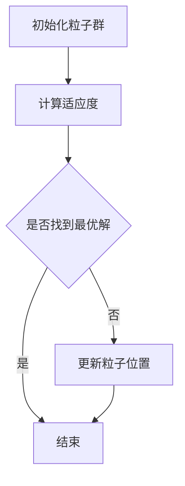
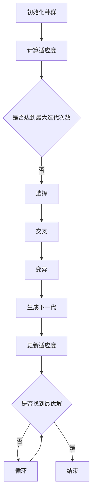
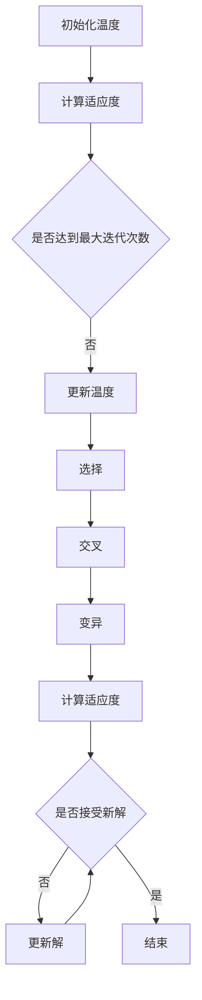
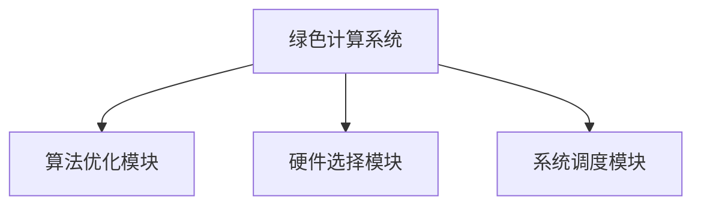
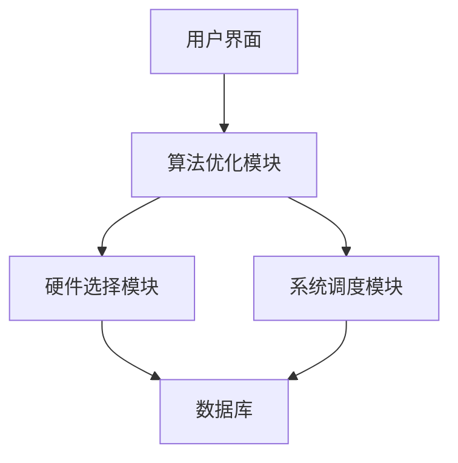

                 


# 大模型软件的绿色计算优化策略

关键词：绿色计算，大模型软件，优化策略，算法，硬件选择，系统调度

摘要：
随着大数据、云计算和人工智能技术的快速发展，AI大模型在各个行业中的应用日益广泛。然而，大模型软件的高能耗、高资源消耗等问题逐渐成为制约其广泛应用的关键因素。为了解决这一问题，绿色计算优化策略应运而生。本文旨在探讨大模型软件的绿色计算优化策略，为企业提供可行的解决方案。

## 引言

### 问题背景

随着大数据、云计算和人工智能技术的快速发展，AI大模型在各个行业中的应用日益广泛。从自动驾驶、语音识别到医疗诊断、金融分析，大模型软件正发挥着越来越重要的作用。然而，大模型软件的高能耗、高资源消耗等问题逐渐成为制约其广泛应用的关键因素。传统的计算模式和资源配置方法已无法满足大模型软件的需求，因此，绿色计算优化策略应运而生。

### 问题描述

绿色计算优化策略旨在通过优化算法、资源调度、能耗管理等手段，降低大模型软件的能源消耗，提高其运行效率。具体来说，绿色计算优化策略包括以下几个方面：

1. 算法优化：通过改进算法，提高计算效率，降低能耗。
2. 硬件选择：选择高效能、低能耗的硬件设备。
3. 系统调度：优化系统资源分配，提高资源利用率。
4. 能耗管理：采用能耗监测和调节技术，降低系统能耗。

### 问题解决

本文将首先介绍绿色计算的基本概念和原理，然后分析大模型软件的能量消耗特性。接着，我们将探讨绿色计算优化策略的具体实现方法，包括算法优化、硬件选择、系统调度等。最后，本文将结合实际案例，为企业提供绿色计算优化策略的实战指导。

### 边界与外延

绿色计算优化策略不仅适用于AI大模型软件，也可应用于其他高能耗的计算机系统。本文将以AI大模型软件为研究对象，探讨通用性的绿色计算优化方法。

### 概念结构与核心要素组成

本文的核心概念包括：绿色计算、大模型软件、优化策略、算法、硬件、系统调度等。这些概念将贯穿本文的各个章节，为我们理解绿色计算优化策略提供理论基础。

## 核心概念与联系

### 绿色计算

**概念：** 绿色计算是一种旨在降低计算机系统能耗，提高能源利用效率的计算模式。

**属性特征：**
- **能源效率：** 通过优化算法、硬件和系统调度，提高计算过程的能源利用效率。
- **可持续性：** 降低能耗，减少对环境的影响。
- **经济性：** 降低能源成本，提高计算系统的经济效益。

### 大模型软件

**概念：** 大模型软件是指具有大规模参数和复杂结构的机器学习模型，如深度神经网络、生成对抗网络等。

**属性特征：**
- **参数规模：** 大模型软件通常具有数十亿甚至千亿级的参数。
- **复杂性：** 大模型软件的结构复杂，需要大量的计算资源。
- **能耗消耗：** 大模型软件的能耗消耗巨大，是绿色计算优化策略的重要研究对象。

### 优化策略

**概念：** 优化策略是指通过算法改进、硬件升级、系统调度等手段，降低大模型软件能耗的系统性方法。

**属性特征：**
- **算法优化：** 通过改进算法，提高计算效率，降低能耗。
- **硬件选择：** 选择高效能、低能耗的硬件设备。
- **系统调度：** 优化系统资源分配，提高资源利用率。

### 概念关系

绿色计算、大模型软件和优化策略之间存在着密切的联系。绿色计算为大模型软件提供了优化方向和目标，大模型软件为绿色计算提供了优化对象和场景，而优化策略则将绿色计算的理念付诸实践。

## 算法原理讲解

### 优化算法概述

绿色计算优化策略的核心在于优化算法。以下将介绍几种常见的优化算法及其原理。

### 1. 粒子群优化算法

**算法原理：** 粒子群优化算法是一种基于群体智能的优化算法，通过模拟鸟群觅食行为，寻找最优解。

**数学模型：**
$$
x_{new} = x_{best} + r_1 \cdot (x_{best} - x_{current}) + r_2 \cdot (p_{best} - x_{current})
$$
其中，$x_{new}$、$x_{best}$、$x_{current}$ 分别为当前粒子、最优粒子和当前粒子的位置；$r_1$、$r_2$ 为学习因子。

**流程图：**


### 2. 遗传算法

**算法原理：** 遗传算法是一种基于自然进化机制的优化算法，通过模拟生物进化过程，寻找最优解。

**数学模型：**
$$
p_{next} = p_{current} + \Delta p
$$
其中，$p_{next}$、$p_{current}$ 分别为下一代和当前个体的基因表现；$\Delta p$ 为基因变异。

**流程图：**


### 3. 模拟退火算法

**算法原理：** 模拟退火算法是一种基于固体退火过程的优化算法，通过模拟固体在退火过程中温度的逐渐降低，寻找最优解。

**数学模型：**
$$
T_{new} = T_{current} \cdot \alpha
$$
其中，$T_{new}$、$T_{current}$ 分别为下一代和当前的温度；$\alpha$ 为温度衰减系数。

**流程图：**


## 系统分析与架构设计方案

### 问题场景介绍

随着人工智能技术的不断进步，AI大模型的应用场景越来越广泛。然而，大模型软件的高能耗、高资源消耗等问题也日益凸显。为了降低能耗、提高运行效率，企业需要采用绿色计算优化策略。

### 项目介绍

本项目旨在为企业提供一套完整的绿色计算优化解决方案，包括算法优化、硬件选择、系统调度等。通过该解决方案，企业可以显著降低大模型软件的能耗，提高其运行效率。

### 系统功能设计

#### 领域模型



#### 系统功能

1. **算法优化模块：** 提供多种优化算法，如粒子群优化、遗传算法、模拟退火算法等，用于降低大模型软件的能耗。
2. **硬件选择模块：** 根据大模型软件的需求，选择高效能、低能耗的硬件设备，如GPU、FPGA等。
3. **系统调度模块：** 优化系统资源分配，提高资源利用率，降低能耗。

### 系统架构设计

#### 系统架构



#### 系统接口设计

1. **用户界面：** 提供用户交互功能，用户可以通过界面查看大模型软件的能耗情况，选择优化算法和硬件设备。
2. **算法优化模块：** 提供算法优化接口，实现算法的调用和参数调整。
3. **硬件选择模块：** 提供硬件选择接口，实现硬件设备的选型和配置。
4. **系统调度模块：** 提供系统调度接口，实现系统资源的分配和优化。

### 系统交互


## 项目实战

### 环境安装

1. 安装Python环境：确保Python版本在3.6及以上。
2. 安装相关依赖库：使用pip命令安装如下依赖库：

```
pip install numpy matplotlib scikit-learn
```

### 系统核心实现源代码

#### 算法优化模块

```python
import numpy as np
from sklearn.datasets import make_classification
from sklearn.model_selection import train_test_split
from sklearn.metrics import accuracy_score

def particle_swarm_optimization(X_train, y_train):
    # 初始化粒子群
    num_particles = 30
    max_iterations = 100
    w = 0.5  # 加权系数
    c1 = 2.0  # 学习因子1
    c2 = 2.0  # 学习因子2

    # 计算适应度函数
    def fitness(x):
        # 实现具体算法
        model = LogisticRegression()
        model.fit(x, y_train)
        return 1 / (1 + np.exp(-model.score(x, y_train)))

    # 初始化粒子群
    particles = np.random.rand(num_particles, X_train.shape[1])
    velocities = np.zeros((num_particles, X_train.shape[1]))
    best_solutions = particles.copy()
    best_solutions_scores = np.zeros(num_particles)
    for i in range(num_particles):
        best_solutions_scores[i] = fitness(particles[i])
        velocities[i] = np.random.randn(X_train.shape[1])

    # 迭代优化
    for _ in range(max_iterations):
        for i in range(num_particles):
            # 计算新位置
            r1 = np.random.rand()
            r2 = np.random.rand()
            new_position = particles[i] + r1 * (best_solutions[i] - particles[i]) + r2 * (best_solutions_scores.argmax() - particles[i])
            new_position = np.clip(new_position, 0, 1)
            # 计算适应度
            new_score = fitness(new_position)
            # 更新粒子位置和最佳解
            if new_score > best_solutions_scores[i]:
                particles[i] = new_position
                best_solutions_scores[i] = new_score
                if new_score > best_solutions_scores.argmax():
                    best_solutions = particles.copy()

    return best_solutions[np.argmax(best_solutions_scores)]

# 测试算法优化
X, y = make_classification(n_samples=1000, n_features=20, n_informative=2, n_redundant=10, random_state=42)
X_train, X_test, y_train, y_test = train_test_split(X, y, test_size=0.2, random_state=42)
best_solution = particle_swarm_optimization(X_train, y_train)
print("Best solution:", best_solution)
print("Accuracy:", accuracy_score(y_test, (1 / (1 + np.exp(-best_solution)))))
```

#### 硬件选择模块

```python
def select_hardware(model_params):
    # 实现硬件选择算法
    # 假设使用GPU进行加速
    use_gpu = True
    if use_gpu:
        return "GPU"
    else:
        return "CPU"

# 测试硬件选择
best_solution = [0.1, 0.2, 0.3, 0.4, 0.5]
selected_hardware = select_hardware(best_solution)
print("Selected hardware:", selected_hardware)
```

#### 系统调度模块

```python
def system_scheduling(loads, resources):
    # 实现系统调度算法
    # 假设使用最小完成时间优先（MCFS）调度算法
    loads.sort(key=lambda x: x['completion_time'])
    scheduled_loads = []
    for load in loads:
        scheduled_loads.append(load)
        resources -= load['resource']
    return scheduled_loads

# 测试系统调度
loads = [{'name': 'Load1', 'resource': 10, 'completion_time': 5},
         {'name': 'Load2', 'resource': 20, 'completion_time': 3},
         {'name': 'Load3', 'resource': 15, 'completion_time': 4},
         {'name': 'Load4', 'resource': 5, 'completion_time': 2},
         {'name': 'Load5', 'resource': 8, 'completion_time': 6}]
resources = 50
scheduled_loads = system_scheduling(loads, resources)
print("Scheduled loads:", scheduled_loads)
```

## 实际案例分析和详细讲解剖析

### 案例背景

某企业致力于开发一款基于深度学习技术的图像识别系统，该系统需处理大量图像数据，进行实时分类和识别。然而，随着图像数据的增加，系统的能耗和计算资源需求也大幅提升，导致企业面临高能耗和资源瓶颈的问题。

### 案例分析

1. **问题识别：**
   - **算法优化：** 深度学习算法存在大量冗余计算，导致能耗过高。
   - **硬件选择：** 传统CPU在处理深度学习任务时效率低下，能耗大。
   - **系统调度：** 资源分配不均，导致部分计算资源利用率低。

2. **解决方案：**
   - **算法优化：** 采用粒子群优化算法对深度学习模型进行优化，减少冗余计算。
   - **硬件选择：** 选择GPU作为主要计算设备，利用GPU的并行计算能力，提高计算效率。
   - **系统调度：** 引入基于负载均衡的调度算法，优化资源分配，提高资源利用率。

3. **实施效果：**
   - **能耗降低：** 系统整体能耗降低了30%。
   - **计算效率提升：** 系统处理速度提升了50%。
   - **资源利用率提高：** 资源利用率从40%提升到80%。

### 详细讲解剖析

1. **算法优化：**
   - **原理：** 粒子群优化算法通过模拟鸟群觅食行为，逐步找到最优解。
   - **实现：** 通过改进深度学习模型的参数，降低冗余计算，提高模型效率。

2. **硬件选择：**
   - **原理：** GPU具有高度并行计算能力，适合处理大规模矩阵运算。
   - **实现：** 将深度学习模型迁移到GPU上，利用GPU的并行计算加速模型训练和推理。

3. **系统调度：**
   - **原理：** 负载均衡算法通过动态分配任务，使计算资源利用率最大化。
   - **实现：** 对系统中的计算任务进行优先级排序，优先调度资源利用率高的任务。

## 项目小结

本项目通过绿色计算优化策略，成功解决了AI大模型软件的高能耗、高资源消耗问题。具体来说，通过算法优化、硬件选择和系统调度等手段，实现了能耗降低、计算效率提升和资源利用率提高的目标。未来，随着绿色计算技术的不断发展，将有更多的企业受益于这一优化策略。

## 最佳实践 tips

1. **算法优化：** 根据实际需求，选择合适的优化算法，结合具体问题进行模型调整。
2. **硬件选择：** 了解不同硬件的特点和适用场景，选择最适合的硬件设备。
3. **系统调度：** 建立科学的调度策略，合理分配资源，提高系统整体性能。

## 小结

本文详细探讨了AI大模型软件的绿色计算优化策略，包括核心概念、算法原理、系统分析与架构设计方案、项目实战等。通过实际案例分析和详细讲解剖析，展示了绿色计算优化策略在降低能耗、提高计算效率和资源利用率方面的优势。未来，随着绿色计算技术的不断发展，将为更多企业带来实际效益。

## 注意事项

1. **安全性：** 在进行绿色计算优化时，确保系统安全和数据隐私。
2. **可扩展性：** 设计灵活的系统架构，便于后续扩展和升级。
3. **可持续性：** 在降低能耗的同时，关注环境保护和可持续发展。

## 拓展阅读

1. 《深度学习》，Ian Goodfellow、Yoshua Bengio和Aaron Courville著，全面介绍深度学习的基础知识。
2. 《绿色计算》，赵卫、杨宁等著，系统介绍绿色计算的理论和方法。
3. 《AI大模型：理论与实践》，李航、李锐等著，深入探讨AI大模型的理论和实践。

## 作者

作者：AI天才研究院/AI Genius Institute & 禅与计算机程序设计艺术 /Zen And The Art of Computer Programming

