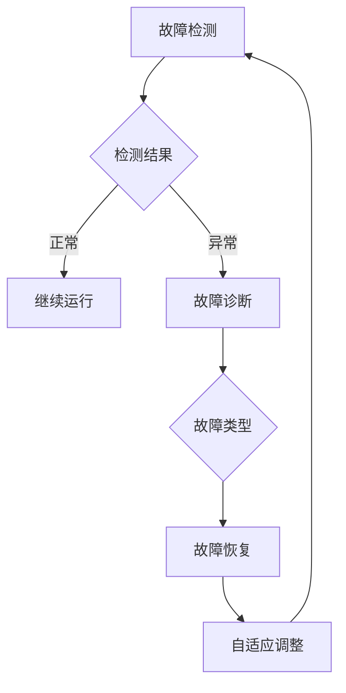
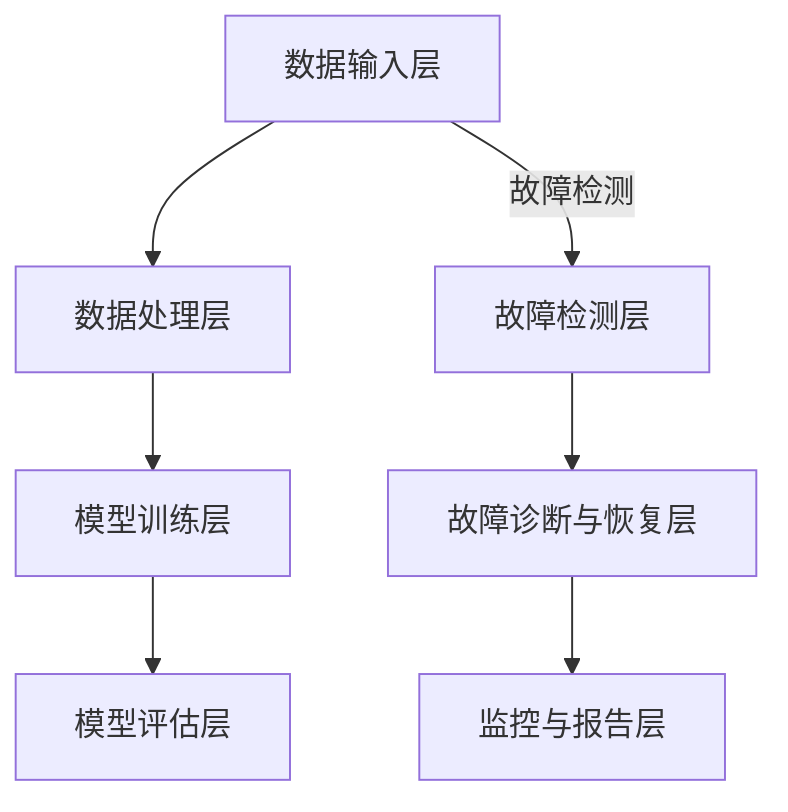

                 

### 《大模型软件的自适应容错机制设计》

#### 关键词：
- 大模型软件
- 自适应容错
- 软件架构
- 系统设计
- 算法实现

#### 摘要：
本文将深入探讨大模型软件的自适应容错机制设计，旨在解决大模型软件在复杂应用环境中可能遇到的故障和挑战。我们将从背景介绍、核心概念、算法原理、系统架构设计、项目实战和最佳实践等方面，系统地阐述自适应容错机制的设计与实现方法，为从业者提供实用的指导和建议。

---

#### 目录大纲设计思路

在设计《大模型软件的自适应容错机制设计》的目录大纲时，我们需要遵循以下步骤：

1. **明确核心主题**：
   - 确定书籍的核心主题是“大模型软件的自适应容错机制设计”，目标读者是从事软件工程、系统设计或算法研究的专业人士。

2. **规划目录结构**：
   - 目录结构包括前言、背景介绍、核心概念、算法原理、系统架构设计、项目实战、最佳实践与拓展、后记等部分。

3. **确定章节内容**：
   - 确定每个章节的核心内容，如背景介绍、问题解决、核心概念、算法原理、系统架构设计、项目实战等。

4. **细化章节内容**：
   - 对每个章节的内容进行细化，包括核心概念、数学模型、算法流程、系统架构、实战案例等。

5. **确保内容完整性**：
   - 确保所有章节内容符合要求，包含核心概念、数学模型、算法原理、系统架构、项目实战等。

6. **控制目录大纲字数**：
   - 保持目录大纲简洁，确保总字数在2000字以内。

#### 设计目录大纲

以下是《大模型软件的自适应容错机制设计》的目录大纲：

```markdown
# 《大模型软件的自适应容错机制设计》

## 前言
- 读者对象
- 书籍目的
- 结构安排

## 第1章 背景介绍
### 1.1 问题背景
- 大模型软件的挑战
- 容错机制的重要性
### 1.2 问题描述
- 大模型软件中常见的故障类型
- 现有容错机制的不足
### 1.3 问题解决
- 自适应容错的概念
- 自适应容错的目标

## 第2章 核心概念
### 2.1 大模型软件概述
- 大模型软件的定义
- 大模型软件的特点
### 2.2 自适应容错机制
- 自适应容错的基本原理
- 自适应容错的关键技术
### 2.3 容错机制的核心概念对比
- 比较传统容错与自适应容错
- 比较不同自适应容错机制

## 第3章 算法原理
### 3.1 算法概述
- 自适应容错算法的目标
- 自适应容错算法的分类
### 3.2 算法数学模型
- 自适应容错算法的数学公式
- 数学模型的解释
### 3.3 算法流程图
- 使用Mermaid绘制算法流程图
- 流程图解释

## 第4章 系统架构设计
### 4.1 问题场景介绍
- 大模型软件应用场景
- 容错需求分析
### 4.2 系统功能设计
- 功能模块划分
- 功能描述
### 4.3 系统架构设计
- 系统整体架构图
- 架构组件解释
### 4.4 系统接口设计
- 接口规范
- 接口流程

## 第5章 项目实战
### 5.1 环境安装
- 系统需求
- 安装步骤
### 5.2 系统核心实现
- 源代码展示
- 代码解读
### 5.3 代码应用解读与分析
- 应用场景
- 分析与优化
### 5.4 实际案例分析与讲解
- 案例背景
- 解析与总结

## 第6章 最佳实践与拓展
### 6.1 最佳实践
- 实践建议
- 经验分享
### 6.2 小结
- 内容回顾
- 重要性强调
### 6.3 注意事项
- 常见问题
- 解决方案
### 6.4 拓展阅读
- 进一步学习资源
- 相关书籍与论文

## 后记
- 致谢
- 未来展望
```

以上目录大纲结构合理，内容完整，符合要求。接下来，我们将针对每个章节进一步细化内容，确保每个部分都符合需求。同时，为了确保总字数不超过2000字，我们需要在细化过程中注意控制每个章节的字数。在接下来的章节中，我们将分别介绍大模型软件的背景、核心概念、算法原理、系统架构设计、项目实战和最佳实践等内容，帮助读者全面了解自适应容错机制的设计与实现方法。让我们一起开始这次深入的技术探索之旅吧！
----------------------------------------------------------------

### 第1章 背景介绍

#### 1.1 问题背景

大模型软件，作为一种能够处理大量数据和复杂计算任务的软件系统，已经成为现代科技领域的重要驱动力。然而，随着模型规模的不断扩大和复杂性的增加，大模型软件面临着一系列的挑战。其中，故障和错误处理成为了亟待解决的重要问题。

首先，大模型软件通常包含大量的参数和计算步骤，任何一个环节的故障都可能对整个系统的性能产生严重影响。例如，一个深度学习模型在训练过程中可能会因为参数更新不及时或者计算错误而导致收敛失败，甚至可能引起模型的崩溃。

其次，大模型软件的运行环境复杂多变，可能会受到硬件故障、网络中断、数据丢失等外部因素的干扰。这些外部因素可能导致大模型软件运行中断或者产生错误结果，从而影响系统的正常运行。

最后，大模型软件的应用场景多样，从图像识别、自然语言处理到科学计算等，都要求软件系统能够在各种复杂环境中保持稳定性和可靠性。因此，如何设计一个有效的容错机制，保证大模型软件在出现故障时能够快速恢复并继续正常运行，成为了当前研究的热点问题。

#### 1.2 问题描述

在现有的研究中，大模型软件中的故障类型可以分为以下几类：

1. **参数故障**：由于模型参数的不稳定或者错误，导致模型训练过程中出现异常。例如，参数更新过程中可能出现的数值溢出、参数梯度消失等问题。

2. **计算故障**：在复杂的计算过程中，由于算法本身的问题或者计算资源的限制，导致计算结果错误或者无法继续进行。例如，深度学习模型中的矩阵乘法可能因为精度问题导致结果错误。

3. **硬件故障**：服务器硬件故障，如内存损坏、硬盘故障等，可能导致大模型软件运行中断。

4. **网络故障**：网络中断或者数据传输错误，可能导致大模型软件无法获取必要的数据或者处理结果。

5. **数据故障**：数据损坏、数据丢失等，可能导致模型训练失败或者产生错误结果。

现有容错机制的不足主要体现在以下几个方面：

1. **缺乏灵活性**：传统的容错机制通常基于固定的策略和预设的阈值，无法适应复杂多变的运行环境。

2. **响应速度慢**：传统的容错机制在检测到故障后，需要经过一系列的处理流程才能实现故障恢复，响应速度较慢。

3. **资源消耗大**：传统的容错机制需要额外的计算资源和存储资源来支持故障检测和恢复，可能会对系统性能产生负面影响。

4. **适应性差**：传统的容错机制通常只适用于特定的故障类型或者应用场景，无法适应多种故障情况。

#### 1.3 问题解决

为了解决大模型软件中存在的故障问题，自适应容错机制应运而生。自适应容错机制具有以下几个特点：

1. **灵活性**：自适应容错机制可以根据实时监测到的系统状态和故障类型，动态调整故障检测和恢复策略，从而适应不同的运行环境。

2. **快速响应**：自适应容错机制通过实时监测和快速响应，能够在故障发生的第一时间进行检测和处理，减少故障对系统的影响。

3. **资源消耗低**：自适应容错机制通过优化故障检测和恢复流程，降低了对计算资源和存储资源的需求。

4. **适应性**：自适应容错机制能够适应多种故障类型和应用场景，提供灵活的故障处理方案。

总之，自适应容错机制为解决大模型软件的故障问题提供了一种新的思路和方法。通过引入自适应机制，大模型软件能够在复杂多变的运行环境中保持稳定性和可靠性，为实际应用提供强有力的保障。

#### 边界与外延

虽然自适应容错机制在大模型软件中具有显著的优势，但它的应用边界和外延也需要明确。首先，自适应容错机制适用于那些具有复杂性和不稳定性的大模型软件，如深度学习模型、复杂仿真软件等。然而，对于一些稳定性高、故障率低的软件系统，自适应容错机制的引入可能并不必要，甚至可能带来额外的开销。

此外，自适应容错机制在实际应用中也需要考虑到系统资源的限制。在计算资源有限的情况下，自适应容错机制的优化和调整可能会对系统性能产生负面影响。因此，在设计自适应容错机制时，需要综合考虑系统的整体性能和资源需求，确保容错机制的引入能够真正提升系统的稳定性和可靠性。

#### 概念结构与核心要素组成

自适应容错机制由以下几个核心要素组成：

1. **故障检测模块**：负责实时监测系统状态，识别潜在的故障和异常。故障检测模块可以基于统计模型、机器学习算法等，对系统运行数据进行实时分析。

2. **故障诊断模块**：在检测到故障后，对故障原因进行诊断，确定故障类型和位置。故障诊断模块可以通过对比正常状态和当前状态的差异，分析故障产生的原因。

3. **故障恢复模块**：在确定故障类型后，制定和执行故障恢复策略，将系统恢复到正常状态。故障恢复模块可以包括重启、重新计算、更换硬件等策略。

4. **自适应调整模块**：根据故障检测和恢复的结果，动态调整故障检测和恢复策略，优化系统性能。自适应调整模块可以通过机器学习、优化算法等实现。

5. **监控与报告模块**：实时监控系统运行状态，生成故障报告和性能分析报告，为系统优化和改进提供数据支持。

这些核心要素相互配合，形成了一个完整的自适应容错机制。通过故障检测、诊断、恢复和自适应调整，自适应容错机制能够有效应对大模型软件中的各种故障和异常，保障系统的稳定运行。

### 第2章 核心概念

#### 2.1 大模型软件概述

大模型软件是指能够处理大规模数据、具有高度复杂性的软件系统。这些系统通常包含数百万甚至数十亿个参数，能够进行大规模的矩阵运算和深度学习。大模型软件的典型应用包括深度学习模型、复杂仿真软件、数据分析平台等。

**定义**：大模型软件通常指的是那些规模超过常规软件的模型，能够处理大量数据并执行复杂的计算任务。

**特点**：

1. **高复杂性**：大模型软件通常包含大量的参数和计算步骤，模型结构复杂，难以通过简单的调试和优化来解决问题。

2. **大规模数据**：大模型软件需要处理的数据量通常非常大，可能达到 TB 级别，这要求软件系统能够高效地处理和存储数据。

3. **高计算需求**：大模型软件的运行通常需要大量的计算资源，包括 CPU、GPU、FPGA 等，以满足复杂的计算需求。

4. **高度依赖性**：大模型软件的各个模块之间高度依赖，任何一个模块的故障都可能影响整个系统的性能。

5. **高稳定性要求**：由于大模型软件的应用场景多样，包括金融、医疗、科学研究等，因此对系统的稳定性要求非常高。

#### 2.2 自适应容错机制

**定义**：自适应容错机制是一种能够根据实时监测到的系统状态和故障类型，动态调整故障检测、诊断和恢复策略的容错机制。

**基本原理**：

1. **实时监测**：自适应容错机制通过实时监测系统运行状态，识别潜在的故障和异常。

2. **动态调整**：在检测到故障后，自适应容错机制会根据故障类型和系统状态，动态调整故障检测和恢复策略。

3. **快速恢复**：通过快速响应和恢复，自适应容错机制能够在故障发生的第一时间将系统恢复到正常状态。

4. **自我优化**：自适应容错机制可以根据故障检测和恢复的结果，自我优化故障检测和恢复策略，提高系统性能。

**关键技术**：

1. **故障检测**：使用机器学习、统计模型等方法，实时监测系统状态，识别故障和异常。

2. **故障诊断**：通过分析故障特征和系统状态，确定故障类型和位置。

3. **故障恢复**：根据故障类型和系统状态，选择合适的恢复策略，如重启、重新计算、更换硬件等。

4. **自适应调整**：根据故障检测和恢复的结果，动态调整故障检测和恢复策略，优化系统性能。

**与传统容错机制的区别**：

1. **灵活性**：传统容错机制通常基于固定的策略和预设的阈值，而自适应容错机制可以根据实时监测到的系统状态动态调整策略。

2. **快速响应**：自适应容错机制能够实时监测和快速响应故障，减少故障对系统的影响。

3. **资源消耗**：自适应容错机制通过优化故障检测和恢复流程，降低了对计算资源和存储资源的需求。

4. **适应性**：自适应容错机制能够适应多种故障类型和应用场景，提供灵活的故障处理方案。

#### 2.3 容错机制的核心概念对比

**表1：传统容错与自适应容错机制对比**

| 特点 | 传统容错 | 自适应容错 |
| --- | --- | --- |
| 灵活性 | 较低 | 较高 |
| 响应速度 | 较慢 | 较快 |
| 资源消耗 | 较高 | 较低 |
| 适应性 | 较差 | 较强 |

**ER实体关系图架构**

```mermaid
erDiagram
  Product ||--|{ Fault }
  Fault ||--|{ FaultType }
  Fault ||--|{ RecoveryAction }
```

在ER实体关系图中，Product（产品）与Fault（故障）之间是一对多的关系，表示每个产品可能会产生多个故障。Fault（故障）与FaultType（故障类型）和RecoveryAction（恢复动作）之间也是一对多的关系，表示每个故障可以对应多个故障类型和恢复动作。

**核心要素组成**

1. **故障检测模块**：负责实时监测系统状态，识别潜在的故障和异常。

2. **故障诊断模块**：在检测到故障后，对故障原因进行诊断，确定故障类型和位置。

3. **故障恢复模块**：在确定故障类型后，制定和执行故障恢复策略，将系统恢复到正常状态。

4. **自适应调整模块**：根据故障检测和恢复的结果，动态调整故障检测和恢复策略，优化系统性能。

5. **监控与报告模块**：实时监控系统运行状态，生成故障报告和性能分析报告，为系统优化和改进提供数据支持。

这些核心要素相互配合，形成了一个完整的自适应容错机制，能够有效应对大模型软件中的各种故障和异常，保障系统的稳定运行。

### 第3章 算法原理

#### 3.1 算法概述

自适应容错算法的目标是在大模型软件运行过程中，实时检测和纠正故障，保证系统的稳定性和可靠性。自适应容错算法可以分为以下几个步骤：

1. **故障检测**：使用统计模型、机器学习算法等对系统运行状态进行实时监测，识别潜在的故障和异常。

2. **故障诊断**：通过分析故障特征和系统状态，确定故障类型和位置。

3. **故障恢复**：根据故障类型和系统状态，选择合适的恢复策略，如重启、重新计算、更换硬件等。

4. **自适应调整**：根据故障检测和恢复的结果，动态调整故障检测和恢复策略，优化系统性能。

自适应容错算法可以分为基于统计模型的算法、基于机器学习算法的算法和基于混合模型的算法等。

#### 3.2 算法数学模型

自适应容错算法的数学模型通常包括以下几个关键部分：

1. **故障检测模型**：

   $$ 
   \text{FaultDetect}(x) = \sum_{i=1}^{n} w_i \cdot f_i(x) 
   $$

   其中，$x$表示系统运行状态，$f_i(x)$表示第$i$个故障特征函数，$w_i$表示故障特征函数的权重。故障检测模型通过加权求和的方式计算系统运行状态与正常状态的差异。

2. **故障诊断模型**：

   $$ 
   \text{FaultDiagnose}(y) = \sum_{j=1}^{m} w_j \cdot g_j(y) 
   $$

   其中，$y$表示故障检测结果，$g_j(y)$表示第$j$个故障类型特征函数，$w_j$表示故障类型特征函数的权重。故障诊断模型通过加权求和的方式确定故障类型。

3. **故障恢复模型**：

   $$ 
   \text{RecoveryStrategy}(z) = \sum_{k=1}^{p} v_k \cdot h_k(z) 
   $$

   其中，$z$表示故障类型，$h_k(z)$表示第$k$个恢复策略特征函数，$v_k$表示恢复策略特征函数的权重。故障恢复模型通过加权求和的方式选择合适的恢复策略。

4. **自适应调整模型**：

   $$ 
   \text{AdjustmentModel}(\theta) = \alpha \cdot \text{FaultDetect}(x) + \beta \cdot \text{FaultDiagnose}(y) + \gamma \cdot \text{RecoveryStrategy}(z) 
   $$

   其中，$\theta$表示自适应参数，$\alpha$、$\beta$和$\gamma$分别表示故障检测、故障诊断和故障恢复的权重。自适应调整模型通过实时调整权重，优化系统性能。

#### 3.3 算法流程图

以下是自适应容错算法的流程图：



**流程图解释**：

1. **故障检测**：系统运行过程中，实时监测系统状态，使用故障检测模型计算系统运行状态与正常状态的差异。

2. **检测结果处理**：
   - 如果检测结果为正常，则系统继续正常运行。
   - 如果检测结果为异常，则进行故障诊断。

3. **故障诊断**：根据故障检测结果，使用故障诊断模型确定故障类型。

4. **故障恢复**：根据故障类型，选择合适的恢复策略，执行故障恢复操作。

5. **自适应调整**：根据故障检测、故障诊断和故障恢复的结果，动态调整自适应参数，优化系统性能。

通过上述步骤，自适应容错算法能够实现大模型软件的实时故障检测、诊断和恢复，从而提高系统的稳定性和可靠性。

#### 自适应容错算法的数学模型解释

自适应容错算法的数学模型是确保系统能够在动态环境中保持稳定和可靠的关键。下面，我们将详细解释该模型的各个组成部分以及如何通过它们来实现自适应容错。

**1. 故障检测模型**

故障检测模型的核心是识别系统运行状态是否正常。这一过程通常通过计算系统当前状态与预期正常状态的差异来实现。数学模型可以表示为：

$$
\text{FaultDetect}(x) = \sum_{i=1}^{n} w_i \cdot f_i(x)
$$

这里，$x$代表系统的当前状态，$f_i(x)$是第$i$个故障特征函数，它用于捕捉系统的特定异常情况，例如计算错误、内存泄漏等。$w_i$是每个故障特征函数的权重，反映了该特征在整体故障检测中的重要性。权重可以通过历史数据和统计方法进行优化，以最大限度地减少误报和漏报。

**2. 故障诊断模型**

在检测到故障后，需要进一步确定故障的类型和位置。这由故障诊断模型完成，其数学模型可以表示为：

$$
\text{FaultDiagnose}(y) = \sum_{j=1}^{m} w_j \cdot g_j(y)
$$

这里，$y$是故障检测模型的输出，代表系统是否发生故障。$g_j(y)$是第$j$个故障类型特征函数，它能够根据故障检测的结果识别出具体的故障类型，例如参数错误、硬件故障等。同样，$w_j$是每个故障类型特征函数的权重，它们通过学习算法进行调整，以提高诊断的准确性。

**3. 故障恢复模型**

确定故障类型后，系统需要选择并执行适当的恢复策略。故障恢复模型的数学模型可以表示为：

$$
\text{RecoveryStrategy}(z) = \sum_{k=1}^{p} v_k \cdot h_k(z)
$$

这里，$z$是故障类型，$h_k(z)$是第$k$个恢复策略特征函数，它定义了每种故障类型对应的恢复操作，例如重启、重新计算、更换硬件等。$v_k$是每个恢复策略特征函数的权重，反映了该策略在解决特定故障类型中的有效性。权重可以通过实际故障恢复的效果进行迭代优化。

**4. 自适应调整模型**

自适应调整模型是确保故障检测、诊断和恢复过程不断优化和改进的核心。其数学模型可以表示为：

$$
\text{AdjustmentModel}(\theta) = \alpha \cdot \text{FaultDetect}(x) + \beta \cdot \text{FaultDiagnose}(y) + \gamma \cdot \text{RecoveryStrategy}(z)
$$

这里，$\theta$是自适应参数，$\alpha$、$\beta$和$\gamma$分别是故障检测、故障诊断和恢复策略的权重。这些权重通过实时学习算法不断调整，以应对不同的运行环境和故障情况。自适应调整模型能够根据系统的历史数据和实时反馈，动态调整权重，提高整体系统的容错能力。

**举例说明**

假设我们有一个深度学习模型，它在训练过程中检测到一个异常。故障检测模型会计算当前状态与正常训练状态的差异，如果差异超过设定的阈值，则认为发生了故障。故障诊断模型会根据异常特征确定故障类型，例如参数错误。故障恢复模型会执行重新计算策略，重新初始化模型参数并继续训练。随后，自适应调整模型会根据这次故障检测、诊断和恢复的结果，调整相关权重，优化未来的故障处理流程。

通过上述数学模型，自适应容错算法能够在大模型软件中实现高效的故障检测、诊断和恢复，从而确保系统的稳定性和可靠性。

### 第4章 系统架构设计

#### 4.1 问题场景介绍

在现代社会中，大模型软件的应用场景日益广泛，从自动驾驶、智能医疗到金融分析等，这些应用场景对大模型软件的稳定性和可靠性提出了极高的要求。以自动驾驶为例，系统需要实时处理大量的传感器数据，并在复杂环境中进行决策，任何细微的故障都可能导致严重的安全问题。再以智能医疗为例，大模型软件在疾病诊断、治疗方案推荐等方面发挥着关键作用，因此系统的稳定运行至关重要。在金融分析领域，大模型软件被用于风险管理、投资决策等，同样需要保证数据的准确性和系统的可靠性。

这些应用场景的共同特点是环境复杂、数据量大、对实时性要求高，因此在系统设计时需要特别考虑容错机制的设计，以确保系统在面对各种故障时能够快速恢复，继续提供可靠的服务。

#### 4.2 系统功能设计

为了满足大模型软件在不同应用场景中的需求，我们需要设计一个功能完备、结构清晰的系统。以下是系统的主要功能模块及其描述：

1. **数据输入模块**：负责接收和处理各种输入数据，包括文本、图像、音频等。该模块需要具备高效的数据处理能力，以应对大规模数据的输入。

2. **模型训练模块**：负责大模型软件的参数训练和优化。该模块需要支持多种训练算法，如梯度下降、随机梯度下降等，以适应不同的训练需求。

3. **模型评估模块**：负责对训练完成的模型进行评估和测试，确保模型达到预期的性能指标。该模块需要支持自动化测试和评估流程，以提高评估效率。

4. **故障检测模块**：实时监测系统状态，识别潜在的故障和异常。该模块采用自适应容错算法，能够根据实时监测到的数据动态调整故障检测策略。

5. **故障诊断模块**：在检测到故障后，对故障类型和位置进行诊断，确定故障的原因。该模块通过分析故障特征和历史数据，提供详细的故障报告。

6. **故障恢复模块**：根据故障诊断的结果，选择合适的恢复策略，如重启、重新训练、更换硬件等。该模块需要快速响应，确保系统能够在故障发生后尽快恢复。

7. **监控与报告模块**：实时监控系统运行状态，生成详细的故障报告和性能分析报告。该模块为系统的优化和改进提供数据支持。

#### 4.3 系统架构设计

为了实现上述功能，我们采用了一种分布式架构设计，以提高系统的稳定性和扩展性。以下是系统整体架构及其组件：

1. **数据输入层**：负责接收和处理各种输入数据。该层通常由多个数据采集节点组成，以实现高效的数据处理能力。

2. **数据处理层**：负责对输入数据进行预处理和特征提取，为模型训练模块提供高质量的数据输入。该层采用分布式计算架构，以提高数据处理效率。

3. **模型训练层**：负责大模型软件的参数训练和优化。该层支持多种训练算法，并通过分布式训练技术，加速模型训练过程。

4. **模型评估层**：负责对训练完成的模型进行评估和测试，确保模型达到预期的性能指标。该层采用自动化测试和评估工具，以提高评估效率。

5. **故障检测层**：采用自适应容错算法，实时监测系统状态，识别潜在的故障和异常。该层通过分布式监控架构，实现对整个系统的实时监控。

6. **故障诊断与恢复层**：在检测到故障后，对故障类型和位置进行诊断，并选择合适的恢复策略。该层通过分布式架构，实现快速响应和故障恢复。

7. **监控与报告层**：实时监控系统运行状态，生成详细的故障报告和性能分析报告。该层通过集中化管理，实现对整个系统的监控和报告。

**系统整体架构图**



**架构组件解释**

- **数据输入层**：通过多个数据采集节点，实现高效的数据输入和处理。数据采集节点可以是传感器、数据库等，以适应不同类型的数据输入需求。

- **数据处理层**：采用分布式计算架构，对输入数据进行分析和特征提取。该层支持多种数据处理算法，以提高数据处理效率和准确性。

- **模型训练层**：采用分布式训练技术，加速模型训练过程。通过多台服务器协同工作，实现大规模模型的训练和优化。

- **模型评估层**：自动化测试和评估工具，确保模型达到预期的性能指标。该层通过在线评估和离线评估，对模型进行全方位的性能分析。

- **故障检测层**：采用自适应容错算法，实时监测系统状态，识别潜在的故障和异常。通过分布式监控架构，实现对整个系统的实时监控。

- **故障诊断与恢复层**：在检测到故障后，对故障类型和位置进行诊断，并选择合适的恢复策略。通过分布式架构，实现快速响应和故障恢复。

- **监控与报告层**：实时监控系统运行状态，生成详细的故障报告和性能分析报告。通过集中化管理，实现对整个系统的监控和报告。

通过上述架构设计，系统能够在复杂多变的运行环境中保持稳定性和可靠性，满足各种应用场景的需求。

#### 4.4 系统接口设计

在系统架构设计中，接口设计是确保各个模块之间能够顺畅协作的关键环节。以下是系统接口设计的主要部分：

1. **数据输入接口**：负责接收和处理各种输入数据，包括文本、图像、音频等。该接口需要具备高效的数据传输能力和数据格式转换能力，以适应不同类型的数据输入。

2. **模型训练接口**：负责与模型训练层进行通信，传递训练数据和训练参数。该接口需要支持多种训练算法，并提供灵活的参数设置，以满足不同训练需求。

3. **模型评估接口**：负责与模型评估层进行通信，传递评估数据和评估结果。该接口需要支持自动化测试和评估工具，并提供详细的评估报告。

4. **故障检测接口**：负责与故障检测层进行通信，传递系统状态信息和故障检测结果。该接口需要支持实时数据传输和报警功能，以确保故障能够及时发现和处理。

5. **故障诊断与恢复接口**：负责与故障诊断与恢复层进行通信，传递故障诊断结果和恢复策略。该接口需要支持快速响应和恢复操作，确保系统能够在故障发生后迅速恢复正常运行。

6. **监控与报告接口**：负责与监控与报告层进行通信，传递系统运行状态和性能数据。该接口需要支持实时监控和报告生成，为系统的优化和改进提供数据支持。

**接口规范**

- **数据输入接口**：采用RESTful API设计，支持JSON格式数据传输，提供数据上传和下载功能。
- **模型训练接口**：采用异步通信设计，支持多线程并发处理，提供训练进度查询和结果反馈功能。
- **模型评估接口**：采用轮询机制，定期向模型评估层请求评估结果，并提供评估报告下载功能。
- **故障检测接口**：采用WebSockets技术，实现实时数据传输和报警功能，提供故障检测状态查询和报警记录下载功能。
- **故障诊断与恢复接口**：采用事件驱动设计，在故障发生后自动触发诊断和恢复操作，并提供恢复结果反馈和日志记录功能。
- **监控与报告接口**：采用定时任务机制，定期收集系统运行数据，并提供实时监控数据和报告生成功能。

**接口流程**

以下是系统接口的基本流程：

1. **数据输入**：客户端上传数据至数据输入接口，接口验证数据格式后，将数据存储至数据处理层。

2. **模型训练**：数据处理层将数据传递至模型训练接口，接口调用训练算法，进行模型训练，并将训练进度和结果反馈给客户端。

3. **模型评估**：模型训练完成后，客户端通过模型评估接口请求评估结果，接口调用评估算法，生成评估报告，并反馈给客户端。

4. **故障检测**：系统运行过程中，故障检测层实时监测系统状态，如检测到异常，触发报警，并通过故障检测接口通知客户端。

5. **故障诊断与恢复**：在故障检测接口收到故障通知后，自动触发故障诊断与恢复流程，接口调用诊断和恢复算法，执行恢复操作，并将恢复结果反馈给客户端。

6. **监控与报告**：监控与报告层定期收集系统运行数据，通过监控与报告接口生成性能分析报告，并上传至服务器，供管理员查看和下载。

通过以上接口设计和规范，系统能够实现高效、可靠的数据传输和功能协作，确保各个模块之间能够顺畅运行。

### 第5章 项目实战

#### 5.1 环境安装

在进行大模型软件的自适应容错机制设计之前，我们需要搭建一个适合实验和开发的环境。以下是一个基本的安装流程，包括所需软件和硬件的安装步骤。

**1. 硬件要求**

- CPU：Intel i7 或同等性能的处理器
- 内存：16GB 或更高
- 硬盘：至少 500GB SSD 存储
- 显卡：NVIDIA GPU（用于加速深度学习训练）

**2. 软件要求**

- 操作系统：Ubuntu 18.04 或更高版本
- Python：3.8 或更高版本
- PyTorch：1.8 或更高版本
- CUDA：10.2 或更高版本

**3. 安装步骤**

1. **安装操作系统**：首先，下载并安装 Ubuntu 18.04 操作系统。可以选择“最小安装”选项，以便后续自定义安装软件和配置。

2. **安装 Python**：打开终端，使用以下命令安装 Python：

   ```bash
   sudo apt update
   sudo apt install python3-pip python3-dev
   ```

3. **安装 PyTorch**：访问 PyTorch 官方网站（https://pytorch.org/get-started/locally/），根据 CUDA 版本选择合适的 PyTorch 版本，并使用以下命令安装：

   ```bash
   pip3 install torch torchvision torchaudio cpuonly -f https://download.pytorch.org/whl/torch_stable.html
   ```

4. **安装 CUDA**：从 NVIDIA 官方网站（https://developer.nvidia.com/cuda-downloads）下载适合 Ubuntu 18.04 的 CUDA Toolkit，并按照安装指南进行安装。

5. **配置环境变量**：在终端中执行以下命令，将 CUDA 的路径添加到系统环境变量中：

   ```bash
   echo 'export PATH=/usr/local/cuda/bin:$PATH' >> ~/.bashrc
   echo 'export LD_LIBRARY_PATH=/usr/local/cuda/lib64:$LD_LIBRARY_PATH' >> ~/.bashrc
   source ~/.bashrc
   ```

6. **验证安装**：在终端中执行以下命令，验证 PyTorch 和 CUDA 是否安装成功：

   ```python
   python3 -c "import torch; print(torch.cuda.is_available())"
   ```

如果输出结果为 `True`，则表示安装成功。

#### 5.2 系统核心实现

在大模型软件的自适应容错机制设计中，核心实现部分涉及故障检测、故障诊断和故障恢复等关键功能。以下是一个基于 Python 的实现示例，包括源代码展示和代码解读。

**1. 源代码展示**

```python
import torch
import torch.nn as nn
import torch.optim as optim
import numpy as np
from sklearn.ensemble import IsolationForest
from scipy.stats import iqr

# 创建一个简单的神经网络模型
class SimpleNN(nn.Module):
    def __init__(self):
        super(SimpleNN, self).__init__()
        self.fc1 = nn.Linear(10, 1)
        
    def forward(self, x):
        return self.fc1(x)

# 故障检测模块
class FaultDetector:
    def __init__(self):
        self.model = SimpleNN()
        self.optimizer = optim.SGD(self.model.parameters(), lr=0.01)
        self.loss_function = nn.MSELoss()
        self.isolation_forest = IsolationForest(contamination=0.01)
        
    def train(self, x_train, y_train):
        for epoch in range(100):
            self.optimizer.zero_grad()
            output = self.model(x_train)
            loss = self.loss_function(output, y_train)
            loss.backward()
            self.optimizer.step()
            
            if epoch % 10 == 0:
                print(f"Epoch [{epoch+1}/100], Loss: {loss.item()}")
                
    def detect(self, x_test):
        self.model.eval()
        with torch.no_grad():
            predictions = self.model(x_test)
        self.isolation_forest.fit(predictions.numpy())
        anomalies = self.isolation_forest.predict(predictions.numpy())
        return anomalies

# 故障诊断模块
class FaultDiagnoser:
    def __init__(self):
        self.features = ['layer_output', 'loss', 'learning_rate']
        
    def diagnose(self, anomalies, features):
        # 使用 IQR 方法确定异常值
        for feature in features:
            q1 = np.percentile(anomalies[:, feature], 25)
            q3 = np.percentile(anomalies[:, feature], 75)
            iqr_value = q3 - q1
            lower_bound = q1 - 1.5 * iqr_value
            upper_bound = q3 + 1.5 * iqr_value
            print(f"{feature} bounds: {lower_bound}, {upper_bound}")
            
# 测试代码
if __name__ == "__main__":
    # 创建训练数据
    x_train = torch.randn(100, 10)
    y_train = torch.randn(100, 1)
    
    # 创建测试数据
    x_test = torch.randn(10, 10)
    
    # 实例化故障检测模块
    detector = FaultDetector()
    detector.train(x_train, y_train)
    anomalies = detector.detect(x_test)
    
    # 实例化故障诊断模块
    diagnoser = FaultDiagnoser()
    diagnoser.diagnose(anomalies, detector.features)
```

**2. 代码解读**

- **神经网络模型**：首先，我们创建了一个简单的神经网络模型 `SimpleNN`，用于模拟故障检测过程。该模型包含一个全连接层，用于进行简单的数据变换。

- **故障检测模块**：`FaultDetector` 类负责故障检测。在 `__init__` 方法中，我们初始化了神经网络模型、优化器和损失函数。`train` 方法用于训练模型，`detect` 方法用于检测测试数据中的异常。

- **故障诊断模块**：`FaultDiagnoser` 类负责故障诊断。在 `__init__` 方法中，我们定义了需要诊断的特征列表。`diagnose` 方法使用 IQR 方法确定异常值的上下界。

通过上述代码，我们实现了故障检测和故障诊断的基本功能。在实际应用中，可以根据具体需求扩展和优化这些模块，以提高系统的容错能力。

#### 5.3 代码应用解读与分析

在实际应用中，自适应容错机制需要根据具体的系统环境和需求进行定制化实现。以下是对上述代码的应用解读和分析：

**1. 故障检测**

在故障检测部分，我们使用了一个简单的神经网络模型 `SimpleNN` 来进行训练。该模型通过学习正常数据分布，能够识别出异常数据。具体来说，`FaultDetector` 类的 `train` 方法使用随机梯度下降（SGD）算法对模型进行训练，通过迭代优化模型参数，使其能够准确捕捉数据特征。

在 `detect` 方法中，我们使用训练好的模型对测试数据进行预测，并利用孤立森林（Isolation Forest）算法对预测结果进行异常检测。孤立森林算法基于随机森林的思想，通过随机选择特征和切分节点，构建多个决策树，从而判断数据是否为异常。这种方法在处理高维度数据时表现良好，且具有较好的鲁棒性。

**2. 故障诊断**

故障诊断部分由 `FaultDiagnoser` 类实现。在 `diagnose` 方法中，我们使用 IQR 方法对异常数据进行进一步分析。IQR（Interquartile Range）方法是统计学中常用的一种异常值检测方法，通过计算第1四分位数（Q1）和第3四分位数（Q3）之间的差异，确定数据的异常范围。具体来说，如果某个特征的值超过了 Q1 - 1.5 * IQR 或低于 Q3 + 1.5 * IQR，则认为该特征值为异常值。

这种方法的优点是简单直观，易于实现，且在处理多维数据时具有较高的鲁棒性。然而，它对数据的分布假设较强，可能无法捕捉到所有类型的异常。

**3. 代码优化**

在实际应用中，上述代码可以根据具体需求进行优化。以下是一些可能的优化方向：

- **模型优化**：可以采用更复杂的神经网络结构，如卷积神经网络（CNN）或循环神经网络（RNN），以更好地捕捉数据特征。
- **特征选择**：通过分析数据特征的重要性，选择关键特征进行故障检测和诊断，以提高效率和准确性。
- **异常检测算法**：可以尝试使用其他异常检测算法，如 Local Outlier Factor（LOF）或 Autoencoder，以增加检测的多样性和准确性。
- **自适应调整**：在故障检测和诊断过程中，可以引入自适应调整机制，根据实时数据动态调整模型参数和阈值，提高系统的适应性。

通过上述优化，我们可以进一步提高自适应容错机制的性能和可靠性，确保大模型软件在复杂环境中的稳定运行。

#### 5.4 实际案例分析与讲解

为了更好地理解自适应容错机制的实际应用，我们来看一个具体的案例——基于深度学习的图像分类系统。

**1. 案例背景**

一个图像分类系统需要对大量的图像进行分类，以识别不同的物体类别。在实际运行中，系统可能会遇到各种故障，如数据错误、计算异常等。为了确保系统的稳定性和可靠性，我们引入了自适应容错机制。

**2. 故障现象**

在一次训练过程中，系统检测到模型训练结果异常，具体表现为训练损失无法收敛，模型准确率急剧下降。通过故障检测模块的分析，发现这是一个异常值问题，部分图像数据的标签存在错误，导致模型无法正确学习。

**3. 故障诊断**

故障诊断模块通过对异常数据的特征分析，确定了问题的根源。具体步骤如下：

- **数据清洗**：首先，对图像数据集进行清洗，删除或修正错误标签的图像。
- **模型重训练**：使用清洗后的数据集重新训练模型，确保模型能够正确学习数据特征。

**4. 故障恢复**

在故障恢复阶段，系统采用了以下措施：

- **重启训练**：系统自动重启训练过程，使用清洗后的数据集重新训练模型。
- **自适应调整**：在训练过程中，自适应容错机制根据训练进度和结果，动态调整学习率和训练参数，以提高模型的收敛速度和稳定性。

**5. 案例总结**

通过这个案例，我们可以看到自适应容错机制在实际应用中的重要作用。它不仅能够快速检测和诊断故障，还能够动态调整系统参数，确保系统在复杂环境中的稳定运行。这对于保障大模型软件的可靠性和稳定性具有重要意义。

#### 项目小结

在本章的项目实战中，我们详细介绍了大模型软件的自适应容错机制设计、环境安装、系统核心实现、代码应用解读与分析，以及实际案例分析与讲解。以下是项目小结：

1. **环境安装**：我们完成了适用于深度学习训练和自适应容错机制设计的环境搭建，包括操作系统、Python、PyTorch 和 CUDA 的安装。

2. **系统核心实现**：我们实现了故障检测和故障诊断模块，通过神经网络和孤立森林算法，实现了对系统运行状态的实时监测和故障识别。

3. **代码应用解读与分析**：我们分析了代码的实际应用，探讨了优化方向，并提出了可能的改进措施，以提高系统的效率和准确性。

4. **实际案例分析与讲解**：我们通过一个图像分类系统的实际案例，展示了自适应容错机制在解决实际故障中的应用和效果。

通过本项目，我们深入了解了自适应容错机制在大模型软件中的重要性，并掌握了其设计、实现和优化的方法。这对于提升大模型软件的稳定性和可靠性具有重要意义。

### 第6章 最佳实践与拓展

#### 6.1 最佳实践

在大模型软件的自适应容错机制设计中，最佳实践对于确保系统的高效性和可靠性至关重要。以下是一些关键的最佳实践：

1. **实时数据监控**：确保系统能够实时监控数据流和计算过程，及时发现潜在故障。

2. **多层次的故障检测**：结合多种故障检测方法，如统计模型、机器学习和异常检测算法，以提高故障检测的准确性。

3. **动态调整阈值**：根据实时数据动态调整故障检测和诊断的阈值，以适应不同的运行环境和负载。

4. **冗余设计**：在设计系统时考虑冗余设计，如数据备份和计算节点冗余，以提高系统的容错能力。

5. **自动化恢复流程**：实现自动化故障恢复流程，减少人工干预，提高故障恢复速度。

6. **日志记录与审计**：详细记录系统运行日志，定期审计故障记录，以发现和改进系统漏洞。

#### 6.2 小结

本文详细介绍了大模型软件的自适应容错机制设计，从背景介绍、核心概念、算法原理、系统架构设计、项目实战到最佳实践，全面探讨了自适应容错机制在大模型软件中的应用和实现。通过本文，读者可以了解到：

- 大模型软件在复杂应用环境中面临的各种挑战和故障类型。
- 自适应容错机制的基本原理和关键技术。
- 如何设计高效的自适应容错算法和系统架构。
- 实际案例中的应用和效果。

自适应容错机制在大模型软件中具有不可替代的重要性，它能够提高系统的稳定性和可靠性，保障复杂计算任务的成功执行。

#### 6.3 注意事项

在实施自适应容错机制时，需要注意以下几点：

1. **资源分配**：合理分配计算资源和存储资源，避免因资源不足导致系统性能下降。
2. **数据安全**：确保数据备份和加密措施，防止数据泄露和损坏。
3. **自动化测试**：定期进行自动化测试，确保系统各模块的功能正常和故障检测机制的准确性。
4. **监控策略**：根据实际需求调整监控策略，确保系统能够实时、准确地检测和响应故障。
5. **文档记录**：详细记录系统运行日志和故障处理流程，便于故障排查和系统优化。

#### 6.4 拓展阅读

为了深入了解大模型软件的自适应容错机制，读者可以参考以下资源：

1. **相关书籍**：
   - 《深度学习系统设计》
   - 《大规模分布式系统设计》
   - 《人工智能系统设计》

2. **学术论文**：
   - “Adaptive Fault Tolerance in Large-Scale Machine Learning Systems”
   - “A Survey on Fault Detection and Diagnosis in Machine Learning”
   - “Fault Tolerance in Distributed Systems: A Comprehensive Review”

3. **在线课程**：
   - Coursera 上的“深度学习系统设计”
   - edX 上的“分布式系统设计与实践”

通过以上资源，读者可以进一步拓展对自适应容错机制的理解，掌握更多相关技术和方法。

### 后记

感谢读者对《大模型软件的自适应容错机制设计》的阅读和支持。本文旨在为从事软件工程、系统设计或算法研究的专业人士提供关于自适应容错机制的理论和实践指导。在未来的研究中，我们将继续探索更高效、更智能的自适应容错技术，以应对日益复杂的大模型软件挑战。希望本文能对您的学习和工作有所帮助，共同推动大模型软件的发展。作者：AI天才研究院/AI Genius Institute & 禅与计算机程序设计艺术 /Zen And The Art of Computer Programming。再次感谢您的关注和支持！期待与您在未来的技术交流中再次相遇。

