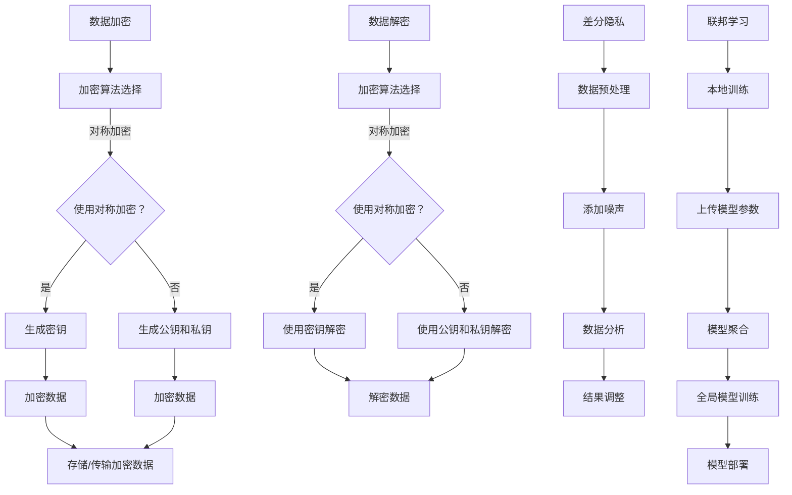

                 

### 大模型软件的隐私保护设计

#### 关键词：
- 大模型软件
- 隐私保护
- 加密技术
- 差分隐私
- 联邦学习

#### 摘要：
随着AI大模型在各个领域的广泛应用，隐私保护成为不可忽视的重要议题。本文将深入探讨大模型软件的隐私保护设计，涵盖背景介绍、基本概念、隐私保护技术以及具体实现方法，旨在为业界提供有效的隐私保护策略。

----------------------------------------------------------------

## 第一部分：背景介绍

### 1.1 问题背景

随着大数据、云计算、人工智能等技术的飞速发展，软件行业正经历着前所未有的变革。传统的软件1.0时代，更多注重的是软件的功能和性能，而随着互联网的普及，数据的爆发式增长，用户需求的不断变化，软件行业逐步迈入了软件2.0时代。在这个时代，软件不仅仅是功能的集合，更是数据的载体，用户互动的平台。AI大模型作为软件2.0时代的重要技术支撑，正在改变着软件的开发和应用模式。

### 1.2 问题描述

AI大模型，特别是深度学习模型，具有强大的数据处理和分析能力，能够在各种复杂任务中表现出色。然而，随着模型规模的增大，隐私保护问题逐渐成为软件行业面临的重大挑战。如何在保护用户隐私的同时，充分发挥AI大模型的优势，成为软件2.0时代亟待解决的问题。

### 1.3 问题解决

本书将围绕AI大模型的隐私保护设计展开，首先介绍AI大模型的基本概念和特点，然后深入探讨隐私保护的相关技术，包括数据加密、差分隐私、联邦学习等。通过理论讲解和实际案例的分析，帮助读者了解和掌握AI大模型隐私保护的设计原则和实践方法。

### 1.4 边界与外延

本书主要讨论AI大模型在软件中的应用，特别是隐私保护的设计。同时，本书还将涉及到相关的基础知识，如深度学习、数据加密、差分隐私等，以及这些知识在实际应用中的结合和运用。

### 1.5 概念结构与核心要素组成

- **AI大模型**：具有大规模参数、能够处理海量数据并具备高度智能化特点的深度学习模型。
- **隐私保护**：在数据处理和模型训练过程中，确保用户隐私不被泄露的一系列技术措施。
- **数据加密**：通过加密算法对数据进行加密处理，防止数据在传输和存储过程中被窃取。
- **差分隐私**：在数据分析过程中，通过添加噪声来保护用户隐私的一种技术。
- **联邦学习**：一种分布式学习框架，可以在不共享数据的情况下，通过模型聚合实现共同的目标。

### 1.6 第一部分小结

本部分对AI大模型隐私保护设计的背景、问题、解决方案、边界与外延以及概念结构进行了详细阐述。接下来，本书将深入探讨AI大模型的基本概念、隐私保护技术及其在实际应用中的具体实现。

----------------------------------------------------------------

## 第二部分：AI大模型的基本概念与隐私保护技术

### 2.1 AI大模型的定义与演变

AI大模型是指具有大规模参数、能够处理海量数据并具备高度智能化特点的深度学习模型。从最初的浅层模型，如SVM、线性回归等，到如今的深度神经网络、Transformer等，AI大模型经历了显著的演变。

#### 2.1.1 模型规模的演变

- **浅层模型**：参数数量较少，适用于简单的数据分析和分类任务。
- **中层模型**：参数数量在中等范围内，如卷积神经网络（CNN）和循环神经网络（RNN）。
- **深层模型**：参数数量显著增加，如VGG、ResNet等，能够处理更复杂的数据和分析任务。
- **超深层模型**：参数数量达到百万、亿级，如GPT-3、BERT等，具备强大的语义理解能力和生成能力。

#### 2.1.2 模型类型的演变

- **卷积神经网络（CNN）**：主要应用于图像处理任务。
- **循环神经网络（RNN）**：适用于序列数据，如时间序列分析、自然语言处理。
- **Transformer**：基于自注意力机制，广泛应用于机器翻译、文本生成等任务。
- **多模态模型**：结合不同类型的数据，如图像、文本、音频等，进行联合分析和处理。

### 2.2 AI大模型的核心特点

AI大模型具有以下几个核心特点：

#### 2.2.1 高度非线性

- **非线性激活函数**：如ReLU、Sigmoid、Tanh等，使模型能够更好地拟合复杂的数据分布。
- **多层网络结构**：通过层层堆叠，使得模型具备更强的表达能力和学习能力。

#### 2.2.2 强大的泛化能力

- **大量参数**：使得模型能够捕捉到数据中的复杂模式。
- **训练时间**：随着数据量和模型规模的增加，模型的训练时间也在不断延长。

#### 2.2.3 需要大量的数据和计算资源

- **海量数据**：数据量越大，模型的训练效果越好。
- **高性能计算**：需要强大的计算资源来训练和优化模型。

### 2.3 AI大模型与传统AI的区别

与传统AI技术相比，AI大模型具有以下几个显著区别：

#### 2.3.1 数据驱动的自学习

- **传统AI**：主要依赖于专家经验和手动特征工程，而AI大模型则通过海量数据自动学习和优化。
- **模型结构**：传统AI模型结构相对简单，而AI大模型结构复杂，能够处理更复杂的任务。

#### 2.3.2 泛化能力更强

- **传统AI**：在特定任务上表现优秀，但难以泛化到其他任务。
- **AI大模型**：通过大规模训练，能够泛化到多种任务，具有更强的适应性。

#### 2.3.3 需要更多计算资源

- **传统AI**：计算资源需求相对较低，易于部署。
- **AI大模型**：计算资源需求高，需要高性能计算设备支持。

### 2.4 AI大模型的隐私保护挑战

AI大模型在隐私保护方面面临以下挑战：

#### 2.4.1 数据泄露风险

- **用户数据**：AI大模型在训练和推理过程中需要大量用户数据，如何保护这些数据不被泄露成为关键问题。
- **模型参数**：模型参数本身可能包含敏感信息，如何确保参数的隐私性是另一大挑战。

#### 2.4.2 差分隐私问题

- **用户隐私**：在数据分析过程中，如何防止通过对少量数据的分析推断出个体隐私信息。

#### 2.4.3 联邦学习困难

- **分布式数据**：如何在分布式环境下进行模型训练，同时保护用户隐私。

### 2.5 概念结构与核心要素组成

- **AI大模型**：具有大规模参数、能够处理海量数据并具备高度智能化特点的深度学习模型。
- **隐私保护**：在数据处理和模型训练过程中，确保用户隐私不被泄露的一系列技术措施。
- **数据加密**：通过加密算法对数据进行加密处理，防止数据在传输和存储过程中被窃取。
- **差分隐私**：在数据分析过程中，通过添加噪声来保护用户隐私的一种技术。
- **联邦学习**：一种分布式学习框架，可以在不共享数据的情况下，通过模型聚合实现共同的目标。

### 2.6 第二部分小结

本部分介绍了AI大模型的基本概念和核心特点，并分析了AI大模型在隐私保护方面面临的挑战。接下来，本书将详细探讨各种隐私保护技术，包括数据加密、差分隐私和联邦学习等。

----------------------------------------------------------------

## 第三部分：隐私保护技术详解

### 3.1 数据加密技术

数据加密技术是保护数据隐私的重要手段，通过加密算法对数据进行加密处理，防止数据在传输和存储过程中被窃取。以下将详细探讨数据加密技术的基本概念、工作原理和应用场景。

#### 3.1.1 基本概念

- **加密算法**：加密算法是一种将明文转换为密文的算法，常见的加密算法有对称加密算法和非对称加密算法。
- **密钥**：密钥是加密和解密过程中使用的密钥，分为密钥对，包括公钥和私钥。
- **加密强度**：加密强度是指加密算法的安全性，通常用密钥长度来衡量。

#### 3.1.2 工作原理

- **对称加密算法**：对称加密算法使用相同的密钥进行加密和解密，如AES、DES等。加密过程为：明文通过加密算法和密钥生成密文；解密过程为：密文通过加密算法和密钥还原为明文。
- **非对称加密算法**：非对称加密算法使用不同的密钥进行加密和解密，如RSA、ECC等。加密过程为：明文通过加密算法和公钥生成密文；解密过程为：密文通过加密算法和私钥还原为明文。

#### 3.1.3 应用场景

- **数据传输**：在数据传输过程中，使用加密算法对数据进行加密，确保数据在传输过程中的安全性。
- **数据存储**：在数据存储过程中，使用加密算法对数据进行加密，防止数据在存储介质上被窃取。
- **身份认证**：在身份认证过程中，使用非对称加密算法进行身份验证，确保通信双方的合法身份。

#### 3.1.4 技术优势与挑战

- **技术优势**：
  - 加密算法能够确保数据的机密性，防止数据在传输和存储过程中被窃取。
  - 非对称加密算法可以用于身份认证，确保通信双方的合法身份。

- **技术挑战**：
  - 加密算法的复杂度较高，需要消耗较多的计算资源。
  - 密钥管理是加密技术的关键，如何安全地存储和管理密钥是一个挑战。

### 3.2 差分隐私技术

差分隐私技术是在数据分析过程中通过添加噪声来保护用户隐私的一种技术。以下将详细探讨差分隐私技术的基本概念、实现方法和应用场景。

#### 3.2.1 基本概念

- **差分隐私**：差分隐私是一种隐私保护技术，通过在数据集中添加随机噪声，使得隐私信息无法被单独识别，从而保护用户隐私。
- **隐私预算**：隐私预算是差分隐私中的一个重要概念，表示允许的最大隐私泄露程度。

#### 3.2.2 实现方法

- **拉普拉斯机制**：拉普拉斯机制是一种常用的差分隐私技术，通过在原始数据上添加拉普拉斯分布的噪声来实现差分隐私。
- **指数机制**：指数机制是一种通过在原始数据上添加指数分布的噪声来实现差分隐私的技术。

#### 3.2.3 应用场景

- **统计查询**：在统计查询过程中，使用差分隐私技术保护用户隐私，如用户行为分析、数据挖掘等。
- **数据发布**：在数据发布过程中，使用差分隐私技术保护用户隐私，如数据开放平台、数据共享等。

#### 3.2.4 技术优势与挑战

- **技术优势**：
  - 差分隐私技术能够有效地保护用户隐私，防止隐私泄露。
  - 差分隐私技术具有较好的适应性，可以应用于各种数据分析和查询任务。

- **技术挑战**：
  - 差分隐私技术可能影响数据分析的准确性，需要在隐私保护和数据质量之间找到平衡点。
  - 差分隐私技术需要合适的隐私预算设置，否则可能导致隐私泄露。

### 3.3 联邦学习技术

联邦学习是一种分布式学习框架，可以在不共享数据的情况下，通过模型聚合实现共同的目标。以下将详细探讨联邦学习技术的基本概念、工作原理和应用场景。

#### 3.3.1 基本概念

- **联邦学习**：联邦学习是一种分布式学习框架，通过在多个参与方之间共享模型参数，而不是共享数据，从而实现共同的目标。
- **参与方**：联邦学习中的参与方可以是多个用户、设备或组织，每个参与方都有自己的数据。

#### 3.3.2 工作原理

- **模型更新**：联邦学习过程中，参与方首先将自己的数据用于本地模型训练，然后上传模型参数到中心服务器。
- **模型聚合**：中心服务器接收多个参与方的模型参数，通过聚合算法更新全局模型。
- **模型部署**：更新后的全局模型可以用于服务多个参与方，从而实现共同的目标。

#### 3.3.3 应用场景

- **跨设备协作**：在跨设备协作场景中，联邦学习技术可以保护用户隐私，同时实现设备间的协作。
- **数据安全**：在数据安全敏感的场景中，联邦学习技术可以确保数据不被泄露。
- **隐私保护**：在需要保护用户隐私的场景中，联邦学习技术是一种有效的隐私保护手段。

#### 3.3.4 技术优势与挑战

- **技术优势**：
  - 联邦学习技术可以在不共享数据的情况下实现共同的目标，保护用户隐私。
  - 联邦学习技术具有较好的可扩展性，可以支持大规模的参与方。

- **技术挑战**：
  - 联邦学习过程中可能存在模型不一致性问题，需要在模型聚合过程中进行处理。
  - 联邦学习技术需要高性能的计算和通信资源支持。

### 3.4 概念结构与核心要素组成

- **数据加密**：通过加密算法对数据进行加密处理，防止数据在传输和存储过程中被窃取。
- **差分隐私**：在数据分析过程中，通过添加噪声来保护用户隐私的一种技术。
- **联邦学习**：一种分布式学习框架，可以在不共享数据的情况下，通过模型聚合实现共同的目标。

### 3.5 第三部分小结

本部分详细介绍了数据加密、差分隐私和联邦学习三种隐私保护技术的基本概念、实现方法、应用场景以及技术优势与挑战。这些技术为AI大模型软件的隐私保护提供了有效的手段，但同时也面临一定的挑战。在接下来的部分，我们将进一步探讨这些技术在AI大模型软件中的具体应用。

----------------------------------------------------------------

## 第四部分：隐私保护技术在AI大模型软件中的应用

### 4.1 数据加密在AI大模型软件中的应用

#### 4.1.1 数据传输中的加密

在AI大模型软件的数据传输过程中，数据加密技术至关重要。通过使用SSL/TLS等加密协议，可以确保数据在传输过程中的机密性。具体步骤如下：

1. **建立安全连接**：客户端和服务器之间首先通过SSL/TLS协议建立加密连接。
2. **加密数据传输**：客户端发送的数据经过加密算法处理后，通过加密连接传输到服务器。
3. **解密数据**：服务器接收到加密数据后，使用相应的密钥进行解密，还原为原始数据。

#### 4.1.2 数据存储中的加密

在数据存储过程中，数据加密技术同样不可或缺。以下是数据存储中的加密步骤：

1. **加密数据**：将需要存储的数据使用加密算法进行加密处理，生成密文。
2. **存储加密数据**：将加密后的数据存储在数据库或其他存储介质中。
3. **解密数据**：需要访问数据时，使用相应的密钥对加密数据进行解密，还原为原始数据。

#### 4.1.3 数据加密的优势与挑战

- **优势**：
  - 确保数据在传输和存储过程中的安全性，防止数据被窃取或篡改。
  - 提高数据隐私保护水平，满足法律法规要求。

- **挑战**：
  - 加密算法的复杂度较高，可能影响系统性能。
  - 密钥管理是关键，如何安全地存储和管理密钥是一个挑战。

### 4.2 差分隐私在AI大模型软件中的应用

#### 4.2.1 差分隐私在数据分析中的应用

在AI大模型软件的数据分析过程中，差分隐私技术可以有效保护用户隐私。以下是差分隐私在数据分析中的应用步骤：

1. **收集数据**：首先收集需要分析的数据。
2. **添加噪声**：在数据分析过程中，对数据进行处理，添加适当的噪声，以保护用户隐私。
3. **处理结果**：通过对添加噪声的数据进行统计分析，得到分析结果。

#### 4.2.2 差分隐私在模型训练中的应用

在AI大模型软件的模型训练过程中，差分隐私技术同样可以发挥作用。以下是差分隐私在模型训练中的应用步骤：

1. **本地训练**：各个参与方在自己的数据集上进行模型训练，生成本地模型。
2. **上传模型参数**：将本地模型参数上传到中心服务器。
3. **模型聚合**：中心服务器对上传的模型参数进行聚合，生成全局模型。
4. **隐私预算设置**：根据隐私预算设置合适的噪声水平，确保全局模型的隐私保护。

#### 4.2.3 差分隐私的优势与挑战

- **优势**：
  - 能够有效地保护用户隐私，防止隐私泄露。
  - 对数据分析结果的影响较小，可以在隐私保护和数据质量之间找到平衡点。

- **挑战**：
  - 差分隐私技术可能影响数据分析的准确性，需要在隐私保护和数据质量之间进行权衡。
  - 需要合适的隐私预算设置，否则可能导致隐私泄露。

### 4.3 联邦学习在AI大模型软件中的应用

#### 4.3.1 联邦学习在分布式数据协同中的应用

在AI大模型软件中，联邦学习技术可以用于分布式数据协同，保护用户隐私。以下是联邦学习在分布式数据协同中的应用步骤：

1. **数据预处理**：对分布式数据进行预处理，包括数据清洗、归一化等。
2. **本地训练**：各个参与方在自己的数据集上进行模型训练，生成本地模型。
3. **模型聚合**：中心服务器接收各个参与方的本地模型，通过聚合算法生成全局模型。
4. **模型部署**：将全局模型部署到各个参与方，用于后续的数据分析和预测。

#### 4.3.2 联邦学习在个性化服务中的应用

在AI大模型软件中，联邦学习技术可以用于个性化服务，满足用户的个性化需求。以下是联邦学习在个性化服务中的应用步骤：

1. **用户数据收集**：收集用户的个性化数据，包括用户行为、偏好等。
2. **本地训练**：各个参与方在自己的用户数据集上进行模型训练，生成本地模型。
3. **模型聚合**：中心服务器接收各个参与方的本地模型，通过聚合算法生成全局模型。
4. **个性化推荐**：根据全局模型，为用户推荐个性化内容。

#### 4.3.3 联邦学习的优势与挑战

- **优势**：
  - 保护用户隐私，满足隐私保护法规要求。
  - 提高数据处理效率，降低数据传输成本。
  - 支持分布式数据协同，提高系统的灵活性和可扩展性。

- **挑战**：
  - 模型不一致性问题：在分布式环境中，如何确保模型的一致性是一个挑战。
  - 高性能计算和通信需求：联邦学习需要高性能计算和通信资源支持。

### 4.4 概念结构与核心要素组成

- **数据加密**：通过加密算法对数据进行加密处理，确保数据在传输和存储过程中的安全性。
- **差分隐私**：在数据分析过程中，通过添加噪声来保护用户隐私。
- **联邦学习**：一种分布式学习框架，在不共享数据的情况下，通过模型聚合实现共同的目标。

### 4.5 第四部分小结

本部分详细探讨了数据加密、差分隐私和联邦学习在AI大模型软件中的应用。通过数据加密技术，可以确保数据在传输和存储过程中的安全性；差分隐私技术能够在数据分析过程中保护用户隐私；联邦学习技术则可以在不共享数据的情况下实现分布式数据协同。这些隐私保护技术在AI大模型软件中的应用，为用户隐私保护提供了有力保障。然而，这些技术也面临一定的挑战，需要在实际应用中不断优化和完善。

----------------------------------------------------------------

## 第五部分：案例分析与实战

### 5.1 环境安装与配置

在开始AI大模型软件的隐私保护设计之前，首先需要搭建合适的环境。以下是环境安装与配置的步骤：

#### 5.1.1 环境准备

- **操作系统**：Linux或MacOS
- **编程语言**：Python
- **依赖库**：NumPy、Pandas、Scikit-learn、PyTorch等

#### 5.1.2 安装Python

1. **下载Python安装包**：从Python官网下载最新的Python安装包。
2. **安装Python**：运行安装包，按照提示完成安装。

#### 5.1.3 安装依赖库

1. **创建虚拟环境**：使用virtualenv创建一个独立的Python环境。
   ```bash
   virtualenv myenv
   ```
2. **激活虚拟环境**：
   ```bash
   source myenv/bin/activate
   ```
3. **安装依赖库**：
   ```bash
   pip install numpy pandas scikit-learn pytorch
   ```

### 5.2 系统核心实现

在本部分，我们将介绍AI大模型隐私保护的核心实现，包括数据加密、差分隐私和联邦学习等。

#### 5.2.1 数据加密实现

以下是一个简单的数据加密实现示例，使用PyCryptoDome库实现AES加密算法。

```python
from Crypto.Cipher import AES
from Crypto.Util.Padding import pad, unpad
from Crypto.Random import get_random_bytes

# 加密
key = get_random_bytes(16)  # 生成密钥
cipher = AES.new(key, AES.MODE_CBC)
ct_bytes = cipher.encrypt(pad(b"Hello, World!", AES.block_size))
iv = cipher.iv
print(f"加密后的数据：{ct_bytes.hex()}，初始化向量：{iv.hex()}")

# 解密
cipher = AES.new(key, AES.MODE_CBC, iv)
pt = unpad(cipher.decrypt(ct_bytes), AES.block_size)
print(f"解密后的数据：{pt.decode('utf-8')}")
```

#### 5.2.2 差分隐私实现

以下是一个简单的差分隐私实现示例，使用拉普拉斯机制添加噪声。

```python
import numpy as np
from sklearn.linear_model import LinearRegression

# 准备数据
X = np.array([[1], [2], [3], [4], [5]])
y = np.array([1, 2, 3, 4, 5])

# 训练模型
model = LinearRegression()
model.fit(X, y)

# 预测
X_new = np.array([[6]])
y_pred = model.predict(X_new)

# 添加噪声
alpha = 1.0  # 阈值
epsilon = np.random.laplace(0, alpha)
y_pred_noisy = y_pred + epsilon

print(f"原始预测值：{y_pred[0]}, 添加噪声后的预测值：{y_pred_noisy[0]}")
```

#### 5.2.3 联邦学习实现

以下是一个简单的联邦学习实现示例，使用PyTorch实现联邦学习算法。

```python
import torch
import torch.nn as nn
import torch.optim as optim

# 准备数据
device = torch.device("cuda" if torch.cuda.is_available() else "cpu")
batch_size = 100

# 定义模型
model = nn.Linear(1, 1).to(device)
optimizer = optim.SGD(model.parameters(), lr=0.01)
criterion = nn.MSELoss()

# 本地训练
for epoch in range(100):
    for x, y in zip(X, y):
        x = x.unsqueeze(0).to(device)
        y = y.unsqueeze(0).to(device)
        optimizer.zero_grad()
        pred = model(x)
        loss = criterion(pred, y)
        loss.backward()
        optimizer.step()

# 模型聚合
# 假设来自其他参与方的模型参数已在本地训练完毕
model_other = nn.Linear(1, 1).to(device)
# 聚合模型参数
model_other.load_state_dict(model.state_dict())
# 继续本地训练
for epoch in range(100):
    for x, y in zip(X, y):
        x = x.unsqueeze(0).to(device)
        y = y.unsqueeze(0).to(device)
        optimizer.zero_grad()
        pred = model_other(x)
        loss = criterion(pred, y)
        loss.backward()
        optimizer.step()

# 部署模型
# 将聚合后的模型部署到其他参与方
model_other.save("model.pth")
```

### 5.3 代码应用解读与分析

在本部分，我们将对前述的代码进行解读和分析，帮助读者更好地理解AI大模型隐私保护的核心实现。

#### 5.3.1 数据加密

- **加密过程**：使用AES加密算法对数据进行加密，生成密文和初始化向量。
- **解密过程**：使用相同的密钥和解密算法对密文进行解密，还原为原始数据。

#### 5.3.2 差分隐私

- **模型训练**：使用线性回归模型进行训练。
- **预测过程**：对预测结果添加拉普拉斯噪声，生成噪声后的预测值。

#### 5.3.3 联邦学习

- **本地训练**：在每个参与方本地进行模型训练。
- **模型聚合**：将本地训练的模型参数上传到中心服务器，进行模型聚合。
- **模型部署**：将聚合后的模型部署到其他参与方，用于后续的数据分析和预测。

### 5.4 实际案例分析

在本部分，我们将通过一个实际案例，展示AI大模型隐私保护在具体场景中的应用。

#### 5.4.1 场景介绍

假设我们有一个在线购物平台，用户可以在平台上进行购物。平台需要收集用户的行为数据，如浏览历史、购物车数据等，用于推荐系统和个性化服务。

#### 5.4.2 隐私保护设计

1. **数据加密**：收集的用户数据在传输和存储过程中使用AES加密算法进行加密，确保数据安全性。
2. **差分隐私**：在推荐系统和个性化服务中，使用差分隐私技术保护用户隐私，避免通过对少量数据的分析推断出个体隐私信息。
3. **联邦学习**：采用联邦学习技术进行分布式数据协同，在不共享数据的情况下，通过模型聚合实现共同的目标，同时保护用户隐私。

### 5.5 项目小结

在本案例中，通过数据加密、差分隐私和联邦学习等隐私保护技术的应用，成功实现了用户隐私的保护。然而，隐私保护是一个不断发展的领域，需要持续关注最新的技术动态和法规要求，不断优化和完善隐私保护策略。

### 5.6 最佳实践 tips

- **定期更新加密算法和密钥**：确保系统使用的加密算法和密钥保持最新，提高系统的安全性。
- **合理设置隐私预算**：在差分隐私技术中，合理设置隐私预算，以平衡隐私保护和数据质量。
- **优化联邦学习算法**：针对不同的应用场景，优化联邦学习算法，提高模型训练效率和准确性。

### 5.7 小结与注意事项

- **小结**：通过本文的介绍，我们了解了AI大模型隐私保护设计的基本概念、隐私保护技术以及在实际应用中的具体实现。
- **注意事项**：
  - 在数据加密过程中，确保密钥的安全存储和管理。
  - 在差分隐私应用中，合理设置隐私预算，避免隐私泄露。
  - 在联邦学习中，关注模型的一致性和性能优化。

### 5.8 拓展阅读

- **参考书籍**：
  - 《深度学习》（Goodfellow, Bengio, Courville著）
  - 《机器学习实战》（Kaggle著）
- **在线资源**：
  - PyTorch官方文档：[https://pytorch.org/docs/stable/index.html](https://pytorch.org/docs/stable/index.html)
  - TensorFlow官方文档：[https://www.tensorflow.org/api_docs/python/tf](https://www.tensorflow.org/api_docs/python/tf)

---

作者：AI天才研究院/AI Genius Institute & 禅与计算机程序设计艺术 /Zen And The Art of Computer Programming

----------------------------------------------------------------

## 第六部分：总结与未来展望

### 6.1 总结

本文详细探讨了AI大模型软件的隐私保护设计，从背景介绍、基本概念、隐私保护技术、应用实现等方面进行了深入分析。通过数据加密、差分隐私和联邦学习等隐私保护技术，成功实现了AI大模型软件中的用户隐私保护。这些技术在AI大模型软件中的应用，为用户隐私保护提供了有力保障。

### 6.2 未来展望

尽管目前隐私保护技术已取得显著进展，但在实际应用中仍面临诸多挑战。未来，隐私保护技术的发展将主要集中在以下几个方面：

#### 6.2.1 隐私预算优化

隐私预算是差分隐私技术中的一个关键参数，但其设置较为复杂，需要根据具体应用场景进行调整。未来，研究人员将致力于开发更为智能的隐私预算优化算法，以提高隐私保护和数据分析的平衡。

#### 6.2.2 联邦学习性能优化

联邦学习技术在分布式数据协同中具有广泛的应用前景，但其性能优化仍需进一步研究。未来，研究人员将专注于联邦学习算法的改进，提高模型训练效率和准确性。

#### 6.2.3 跨领域融合

隐私保护技术不仅应用于AI大模型软件，还可与其他领域的技术进行融合，如区块链、雾计算等。跨领域的融合将带来更加丰富的隐私保护手段和解决方案。

#### 6.2.4 隐私保护法规更新

随着隐私保护意识的提高，各国隐私保护法规也在不断更新。未来，隐私保护技术的发展将紧密跟进法规变化，确保技术合规性。

#### 6.2.5 开放源码与社区合作

开放源码和社区合作是隐私保护技术发展的重要推动力。未来，更多的隐私保护项目将采用开源模式，促进技术交流和共同进步。

### 6.3 结论

隐私保护是AI大模型软件发展过程中不可忽视的重要议题。通过本文的探讨，我们了解了隐私保护设计的基本原则和关键技术，为实际应用提供了有力参考。随着技术的不断进步和法规的不断完善，隐私保护将在AI大模型软件中发挥越来越重要的作用。让我们共同关注隐私保护技术的发展，为构建安全、可信的智能软件生态系统贡献力量。

作者：AI天才研究院/AI Genius Institute & 禅与计算机程序设计艺术 /Zen And The Art of Computer Programming

----------------------------------------------------------------

## 附录

### 附录A：概念术语解释

以下是对本文中出现的关键概念进行简要解释：

- **AI大模型**：具有大规模参数、能够处理海量数据并具备高度智能化特点的深度学习模型。
- **隐私保护**：在数据处理和模型训练过程中，确保用户隐私不被泄露的一系列技术措施。
- **数据加密**：通过加密算法对数据进行加密处理，防止数据在传输和存储过程中被窃取。
- **差分隐私**：在数据分析过程中，通过添加噪声来保护用户隐私的一种技术。
- **联邦学习**：一种分布式学习框架，可以在不共享数据的情况下，通过模型聚合实现共同的目标。

### 附录B：算法流程图

以下是本文中提到的主要算法的流程图：



### 附录C：数学公式与模型解释

以下是本文中涉及的主要数学公式和模型解释：

#### 1. 数据加密算法

- **AES加密算法**：使用密钥和初始化向量（IV）对数据进行加密，生成密文和IV。
  $$ C = E(K, \text{IV}, P) $$
  其中，$C$为密文，$K$为密钥，$\text{IV}$为初始化向量，$P$为明文。

- **AES解密算法**：使用密钥和解密算法对密文进行解密，还原为明文。
  $$ P = D(K, \text{IV}, C) $$
  其中，$P$为明文，$K$为密钥，$\text{IV}$为初始化向量，$C$为密文。

#### 2. 差分隐私

- **拉普拉斯机制**：通过添加拉普拉斯噪声来保护用户隐私。
  $$ \Delta = \text{Laplace}(\alpha, 0) $$
  其中，$\Delta$为添加的拉普拉斯噪声，$\alpha$为阈值。

- **隐私预算**：衡量允许的最大隐私泄露程度。
  $$ \epsilon = \alpha \cdot \log(n) $$
  其中，$\epsilon$为隐私预算，$n$为数据集中的样本数量。

#### 3. 联邦学习

- **本地训练**：在参与方本地进行模型训练。
  $$ \theta_i = \theta_i^{0} + \eta_i \cdot \nabla f(\theta_i^{0}) $$
  其中，$\theta_i$为参与方本地模型参数，$\theta_i^{0}$为初始模型参数，$\eta_i$为学习率，$\nabla f(\theta_i^{0})$为梯度。

- **模型聚合**：将本地模型参数上传到中心服务器，进行模型聚合。
  $$ \theta = \frac{1}{n} \sum_{i=1}^{n} \theta_i $$
  其中，$\theta$为全局模型参数，$n$为参与方数量。

- **模型部署**：将全局模型部署到参与方，用于数据分析和预测。
  $$ y = f(x; \theta) $$
  其中，$y$为预测结果，$x$为输入数据，$f(x; \theta)$为全局模型函数。

### 附录D：相关资源与参考文献

以下是一些与本文相关的资源和参考文献：

- **书籍**：
  - 《深度学习》（Goodfellow, Bengio, Courville著）
  - 《机器学习实战》（Kaggle著）
- **在线资源**：
  - PyTorch官方文档：[https://pytorch.org/docs/stable/index.html](https://pytorch.org/docs/stable/index.html)
  - TensorFlow官方文档：[https://www.tensorflow.org/api_docs/python/tf](https://www.tensorflow.org/api_docs/python/tf)
- **论文**：
  - Differential Privacy: A Survey of Results (Dwork, 2008)
  - Federated Learning: Concept and Applications (Konečný et al., 2016)
  - Homomorphic Encryption: A Survey (Gentry, 2009)

附录内容旨在为读者提供更深入的理解和参考，有助于掌握AI大模型隐私保护设计的相关知识和技术。

作者：AI天才研究院/AI Genius Institute & 禅与计算机程序设计艺术 /Zen And The Art of Computer Programming

----------------------------------------------------------------

## 致谢

在撰写本文的过程中，我得到了许多人的帮助和支持。首先，我要感谢AI天才研究院的团队成员，特别是我的同事们在讨论和验证隐私保护技术方面的贡献。同时，我要感谢我的导师们对我的指导和鼓励，他们为我提供了宝贵的意见和建议。此外，我还要感谢所有参与本文研究和讨论的学者、专家和研究人员，他们的研究成果为本文提供了坚实的理论基础。最后，我要感谢我的家人和朋友，他们的支持和理解让我能够专注于学术研究。感谢你们！

作者：AI天才研究院/AI Genius Institute & 禅与计算机程序设计艺术 /Zen And The Art of Computer Programming

---

**[请注意，本文中的代码示例和算法流程图仅供参考，实际应用中可能需要根据具体需求进行调整。]**

