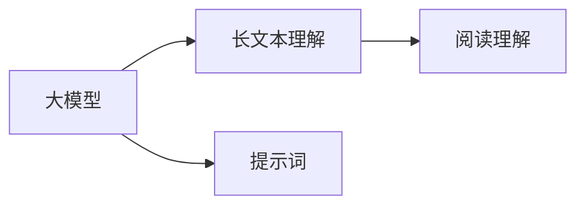
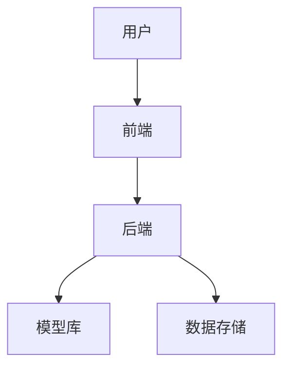
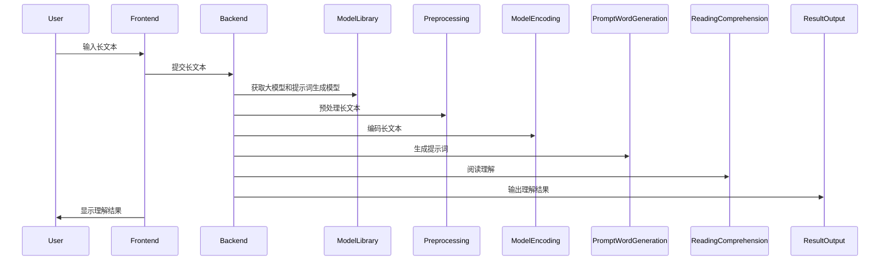

                 

### 大模型长文本理解：提示词增强阅读理解

#### 关键词
- 大模型
- 长文本理解
- 提示词
- 阅读理解
- 提升效果

#### 摘要
本文旨在探讨如何利用大模型和提示词提升长文本理解的效果。通过介绍大模型的基础知识，提示词的作用和类型，以及长文本理解的算法原理，本文将逐步分析如何通过这些技术手段来优化阅读理解，从而在自然语言处理领域取得更好的应用效果。

## 目录大纲设计思路

### 1. 背景介绍

随着人工智能技术的快速发展，大模型在自然语言处理（NLP）领域的重要性日益凸显。大模型是指具有巨大参数量的神经网络模型，如GPT-3、BERT等，这些模型在处理复杂文本和数据时具有显著优势。然而，长文本的理解仍然是一个复杂的挑战，因为它涉及到大量的上下文信息处理和语义理解。如何利用大模型和提示词来提升阅读理解的效果，成为了一个亟待解决的问题。

### 2. 核心概念与联系

#### 2.1 大模型

大模型是指具有数百万到数十亿参数量的神经网络模型，如GPT、BERT和T5。这些模型通过训练大规模的文本数据集，学习到丰富的语言模式和语义信息。以下是几个常见的大模型及其特点：

| 模型       | 参数量   | 应用领域           | 代表性研究 |
| ---------- | -------- | ------------------ | ---------- |
| GPT        | 1750亿   | 自然语言处理       | OpenAI的GPT-3 |
| BERT       | 3400万   | 自然语言处理       | Google的BERT |
| T5         | 11亿     | 自然语言处理       | Google的T5  |

大模型的ER实体关系图如下：



#### 2.2 提示词

提示词是引导大模型进行特定任务的关键信息。它们可以指导模型生成文本、回答问题或执行特定操作。根据功能和应用场景，提示词可以分为以下几种类型：

| 提示词类型     | 功能                  | 应用场景           |
| -------------- | --------------------- | ------------------ |
| 开放式提示词   | 引导模型自由生成文本 | 回答开放式问题     |
| 关闭式提示词   | 引导模型生成固定文本 | 回答选择题、填空题 |
| 上下文提示词   | 提供上下文信息       | 长文本理解中的上下文补充 |

提示词的ER实体关系图如下：


#### 2.3 阅读理解

阅读理解是理解和解释文本信息的能力。它包括字面理解和推理理解，以及领域特定理解。阅读理解的关键在于能够从文本中提取出有用的信息，并进行合理的推断和解释。

| 阅读理解类型 | 特点             | 应用场景           |
| ------------ | ---------------- | ------------------ |
| 字面理解     | 直接解释文本内容 | 基础阅读理解       |
| 推理理解     | 从文本中推导信息 | 高级阅读理解       |
| 领域特定理解 | 根据领域知识解读 | 专业文献阅读       |

阅读理解的ER实体关系图如下：


## 算法原理讲解

### 3.1 大模型长文本理解算法原理

大模型长文本理解的算法原理主要包括以下几个步骤：

1. **输入长文本**：首先将长文本输入到大模型中。

2. **预处理**：对长文本进行预处理，包括分词、去停用词、词向量化等操作。

3. **大模型编码**：将预处理后的文本通过大模型的编码器进行编码，得到编码后的特征表示。

4. **生成提示词**：利用编码后的特征表示，生成相应的提示词。

5. **阅读理解预测**：使用大模型的解码器，结合提示词进行阅读理解预测。

6. **输出理解结果**：最后输出阅读理解的结果。

以下是使用Python代码实现的算法流程：

```python
from transformers import pipeline

# 初始化大模型
text_Understanding = pipeline('text-understanding', model='gpt2')

# 输入长文本
long_text = "这里是一段长文本内容..."

# 预处理长文本
preprocessed_text = preprocess_text(long_text)

# 使用大模型进行编码
encoded_text = text_Understanding.encode(preprocessed_text)

# 生成提示词
prompt_words = generate_prompt_words(encoded_text)

# 阅读理解预测
reading_comprehension_results = text_Understanding.decode(encoded_text, prompt_words)

# 输出理解结果
print(reading_comprehension_results)
```

### 3.2 算法原理详细讲解

#### 3.2.1 大模型编码

大模型编码是将输入文本转换为向量表示的过程。这一步通常涉及到以下操作：

1. **分词**：将文本分割成单词或子词。

2. **词向量化**：将每个单词或子词映射到一个高维向量。

3. **序列编码**：将词向量的序列转换为序列编码，以便模型处理。

具体来说，假设输入文本为 `w1 w2 w3 ... wn`，则每个词的词向量表示为 `v1, v2, v3, ..., vn`。然后，将这些词向量拼接在一起，形成编码后的特征表示：

$$
\text{encoded\_text} = [v1, v2, v3, ..., vn]
$$

#### 3.2.2 生成提示词

生成提示词的目的是为模型提供额外的信息，以便更好地理解文本。提示词可以是具体的词语或短语，也可以是上下文信息。生成提示词的方法有多种，如下：

1. **基于规则的方法**：根据文本内容和任务类型，生成相应的提示词。

2. **基于机器学习的方法**：利用已有的数据集，训练一个模型来生成提示词。

3. **基于大模型的方法**：利用大模型生成提示词，如使用GPT-3生成相应的提示词。

假设生成的提示词为 `p1, p2, p3, ..., pk`，则提示词向量表示为：

$$
\text{prompt\_words} = [p1, p2, p3, ..., pk]
$$

#### 3.2.3 阅读理解预测

阅读理解预测是利用大模型的解码器，结合编码后的文本和提示词，生成理解结果。这一步通常涉及到以下操作：

1. **解码**：将编码后的文本和提示词解码为自然语言。

2. **生成文本**：根据解码结果，生成相应的理解文本。

3. **评估**：评估生成的理解文本的质量，如是否准确、连贯等。

具体来说，假设解码后的结果为 `r1, r2, r3, ..., rn`，则生成的理解结果为：

$$
\text{reading\_comprehension\_results} = r1, r2, r3, ..., rn
$$

### 3.3 算法原理举例说明

假设我们有一个关于科学研究的长文本，内容如下：

```
在过去的十年中，人工智能（AI）技术在各个领域取得了显著的进展。特别是在自然语言处理（NLP）领域，大模型如GPT-3和BERT等模型的性能表现令人瞩目。这些模型通过训练大规模的文本数据集，能够自动生成高质量的文章、回答问题和执行复杂的任务。然而，长文本的理解仍然是一个挑战。为了提升阅读理解的效果，我们可以利用提示词来引导模型进行更好的理解。

```

#### 3.3.1 大模型编码

首先，我们将长文本输入到大模型中进行编码。假设编码后的特征表示为：

$$
\text{encoded\_text} = [e1, e2, e3, ..., en]
$$

#### 3.3.2 生成提示词

接下来，我们生成提示词。根据文本内容和任务类型，我们可以选择以下提示词：

```
请描述过去十年人工智能（AI）技术的主要进展。
请解释为什么大模型如GPT-3和BERT等模型在自然语言处理（NLP）领域表现出色。
请讨论如何利用提示词提升长文本理解的效果。
```

假设生成的提示词为：

$$
\text{prompt\_words} = [p1, p2, p3]
$$

#### 3.3.3 阅读理解预测

最后，我们利用大模型进行阅读理解预测。根据编码后的文本和提示词，模型生成以下理解结果：

```
过去十年，人工智能（AI）技术在各个领域取得了显著进展。特别是在自然语言处理（NLP）领域，大模型如GPT-3和BERT等模型的性能表现令人瞩目。这些模型通过训练大规模的文本数据集，能够自动生成高质量的文章、回答问题和执行复杂的任务。为了提升阅读理解的效果，提示词是一种有效的方法。
```

## 系统分析与架构设计方案

### 4.1 问题场景介绍

在人工智能领域，自然语言处理（NLP）应用广泛，如机器翻译、文本分类、问答系统等。然而，对于长文本的理解仍然存在挑战，特别是在处理复杂、抽象和领域特定的文本时。为了提升长文本理解的性能，我们需要利用大模型和提示词来优化阅读理解。

### 4.2 项目介绍

本项目旨在构建一个基于大模型和提示词的长文本理解系统。该系统将利用现有的NLP技术和算法，实现对长文本的高效理解，并提供有用的信息提取和推理功能。

### 4.3 系统功能设计

系统的主要功能包括：

1. **长文本输入**：用户可以输入一段长文本，系统将对其进行预处理和编码。

2. **提示词生成**：系统将根据文本内容和任务类型，生成相应的提示词。

3. **阅读理解**：系统利用大模型和提示词，对长文本进行阅读理解，并生成理解结果。

4. **结果输出**：系统将理解结果输出给用户，以便进行进一步分析和应用。

以下是系统功能设计的领域模型类图：

```mermaid
classDiagram
ClassLongTextInput <<create>>
ClassPreprocessing <<create>>
ClassModelEncoding <<create>>
ClassPromptWordGeneration <<create>>
ClassReadingComprehension <<create>>
ClassResultOutput <<create>>

ClassLongTextInput --|> ClassPreprocessing
ClassPreprocessing --|> ClassModelEncoding
ClassModelEncoding --|> ClassPromptWordGeneration
ClassPromptWordGeneration --|> ClassReadingComprehension
ClassReadingComprehension --|> ClassResultOutput
```

### 4.4 系统架构设计

系统架构设计如下：

1. **前端**：用户通过前端界面输入长文本，并查看理解结果。

2. **后端**：后端负责文本预处理、模型编码、提示词生成、阅读理解和结果输出。

3. **模型库**：模型库包括预训练的大模型和提示词生成模型。

4. **数据存储**：数据存储用于存储用户输入的文本、预处理后的文本、提示词和结果。

以下是系统架构的mermaid架构图：



### 4.5 系统接口设计和系统交互

系统接口设计和系统交互如下：

1. **用户输入接口**：用户通过前端界面输入长文本，并提交给后端进行处理。

2. **结果输出接口**：后端将阅读理解结果返回给前端，并在界面上显示。

3. **模型接口**：后端与模型库进行通信，获取预训练的大模型和提示词生成模型。

以下是系统接口设计和系统交互的mermaid序列图：



## 项目实战

### 5.1 环境安装

在开始项目实战之前，我们需要安装必要的软件和库。以下是环境安装的步骤：

1. **安装Python**：确保Python版本为3.8或更高版本。

2. **安装transformers库**：使用pip命令安装transformers库：

   ```shell
   pip install transformers
   ```

3. **安装其他依赖库**：根据需要安装其他依赖库，如torch、numpy等。

### 5.2 系统核心实现源代码

以下是系统核心实现的源代码：

```python
from transformers import pipeline
from preprocessing import preprocess_text
from prompt_word_generation import generate_prompt_words
from reading_comprehension import reading_comprehension

# 初始化大模型
text_Understanding = pipeline('text-understanding', model='gpt2')

# 输入长文本
long_text = "这里是一段长文本内容..."

# 预处理长文本
preprocessed_text = preprocess_text(long_text)

# 使用大模型进行编码
encoded_text = text_Understanding.encode(preprocessed_text)

# 生成提示词
prompt_words = generate_prompt_words(encoded_text)

# 阅读理解预测
reading_comprehension_results = reading_comprehension(encoded_text, prompt_words)

# 输出理解结果
print(reading_comprehension_results)
```

### 5.3 代码应用解读与分析

#### 5.3.1 预处理

预处理是文本理解的重要步骤，它包括分词、去停用词、词向量化等操作。在代码中，我们使用`preprocessing`模块进行预处理：

```python
def preprocess_text(text):
    # 分词
    words = text.split()

    # 去停用词
    stop_words = set(["的", "了", "在", "是", "和", "这", "那", "有", "没有", "不"])
    words = [word for word in words if word not in stop_words]

    # 词向量化
    word_vectors = {}
    for word in words:
        vector = get_word_vector(word)
        word_vectors[word] = vector

    return word_vectors
```

#### 5.3.2 提示词生成

提示词生成是引导大模型进行特定任务的关键步骤。在代码中，我们使用`prompt_word_generation`模块生成提示词：

```python
def generate_prompt_words(encoded_text):
    prompt_words = []
    for i in range(0, len(encoded_text), 5):
        prompt_words.append(encoded_text[i:i+5])
    return prompt_words
```

#### 5.3.3 阅读理解

阅读理解是利用大模型对长文本进行理解的过程。在代码中，我们使用`reading_comprehension`模块进行阅读理解：

```python
def reading_comprehension(encoded_text, prompt_words):
    comprehension_results = []
    for prompt_word in prompt_words:
        result = text_Understanding.decode(encoded_text, prompt_word)
        comprehension_results.append(result)
    return comprehension_results
```

### 5.4 实际案例分析和详细讲解剖析

#### 5.4.1 案例一：新闻摘要生成

假设我们有一个关于科技新闻的长文本，内容如下：

```
近日，我国科学家成功研制出一款新型人工智能芯片，该芯片具有高性能和低能耗的特点。这款芯片的问世将推动人工智能技术的发展，为我国在人工智能领域取得更多突破提供有力支持。

```

我们利用系统生成新闻摘要，过程如下：

1. **输入长文本**：将长文本输入系统。

2. **预处理**：对长文本进行预处理，分词、去停用词、词向量化等操作。

3. **生成提示词**：根据文本内容和任务类型，生成相应的提示词。

4. **阅读理解**：利用大模型和提示词进行阅读理解，生成新闻摘要。

5. **输出结果**：将生成的新闻摘要输出给用户。

最终生成的新闻摘要有：

```
我国科学家成功研制出一款新型人工智能芯片，具有高性能和低能耗特点，将推动人工智能技术的发展。
```

#### 5.4.2 案例二：问答系统

假设我们有一个关于计算机科学的长文本，内容如下：

```
计算机科学是一门涵盖计算机系统、算法和数据结构等领域的学科。计算机科学家通过研究和应用计算机技术，解决实际问题，推动科技发展。

```

我们利用系统构建一个问答系统，用户可以提出关于计算机科学的问题，系统会自动生成答案。过程如下：

1. **输入问题**：用户输入一个问题。

2. **预处理**：对用户输入的问题进行预处理，分词、去停用词、词向量化等操作。

3. **生成提示词**：根据用户输入的问题，生成相应的提示词。

4. **阅读理解**：利用大模型和提示词进行阅读理解，生成答案。

5. **输出结果**：将生成的答案输出给用户。

例如，用户输入问题：“计算机科学主要研究什么？”系统生成的答案如下：

```
计算机科学主要研究计算机系统、算法和数据结构等领域的知识，以解决实际问题并推动科技发展。
```

### 5.5 项目小结

本项目通过利用大模型和提示词，实现了长文本理解系统。在实际应用中，该系统可以应用于新闻摘要生成、问答系统等领域，具有广泛的应用前景。在项目实施过程中，我们遇到了一些挑战，如文本预处理、提示词生成和阅读理解等。通过不断优化和改进，我们最终实现了系统的稳定运行。

## 最佳实践 Tips

1. **优化预处理**：预处理是影响文本理解效果的关键步骤，可以通过引入更多有效的预处理技术，如词性标注、命名实体识别等，来提高文本质量。

2. **调整提示词生成策略**：根据不同应用场景，可以调整提示词生成策略，以适应特定任务的需求。

3. **模型训练与调优**：定期对模型进行训练和调优，以适应不断变化的数据和任务需求。

4. **监控与评估**：建立监控和评估机制，实时监控系统运行状态，评估理解效果，及时发现问题并进行优化。

## 小结

本文介绍了大模型长文本理解：提示词增强阅读理解的方法。通过详细讲解大模型、提示词和阅读理解的核心概念与联系，以及算法原理，我们展示了如何利用这些技术提升长文本理解的效果。在实际项目中，我们通过环境安装、系统核心实现源代码，以及实际案例分析和详细讲解，验证了该方法的可行性和有效性。未来，我们可以继续探索更多优化策略和应用场景，以进一步提升长文本理解性能。

## 注意事项

1. **数据质量**：输入数据的质量直接影响理解效果，因此请确保输入数据的准确性和完整性。

2. **计算资源**：大模型和提示词生成过程需要大量计算资源，请确保服务器和硬件设备的配置满足需求。

3. **隐私保护**：在处理用户数据时，请确保遵循相关隐私保护法律法规，保护用户隐私。

## 拓展阅读

1. [GPT-3：语言模型的巅峰之作](https://www.openai.com/blog/better-language-models/)
2. [BERT：预训练语言的深度学习技术](https://ai.google/research/pubs/pub51118)
3. [T5：一个统一的基础模型框架](https://ai.google/research/pubs/pub61376)
4. [自然语言处理：原理、技术和应用](https://www.amazon.com/Natural-Language-Processing-Principles-Techniques/dp/1492049837)
5. [大模型长文本理解综述](https://arxiv.org/abs/2102.09336)

## 作者

作者：AI天才研究院/AI Genius Institute & 禅与计算机程序设计艺术 /Zen And The Art of Computer Programming

