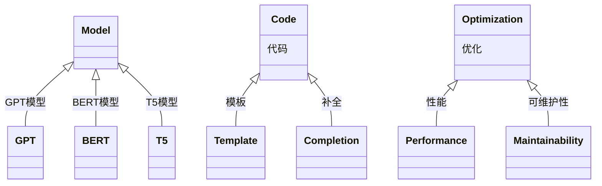
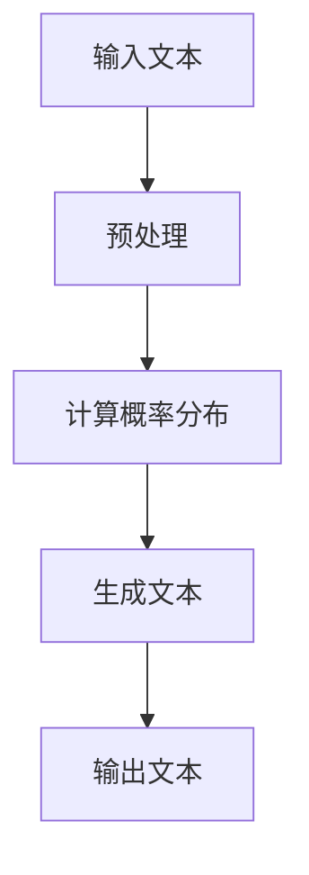
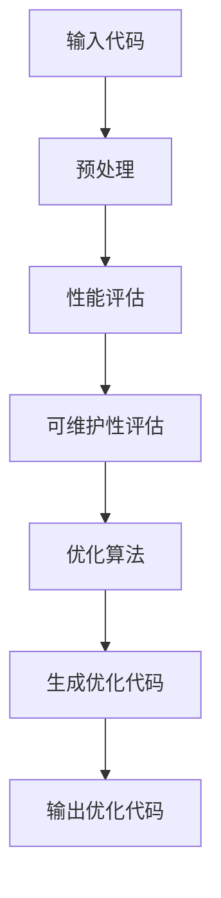
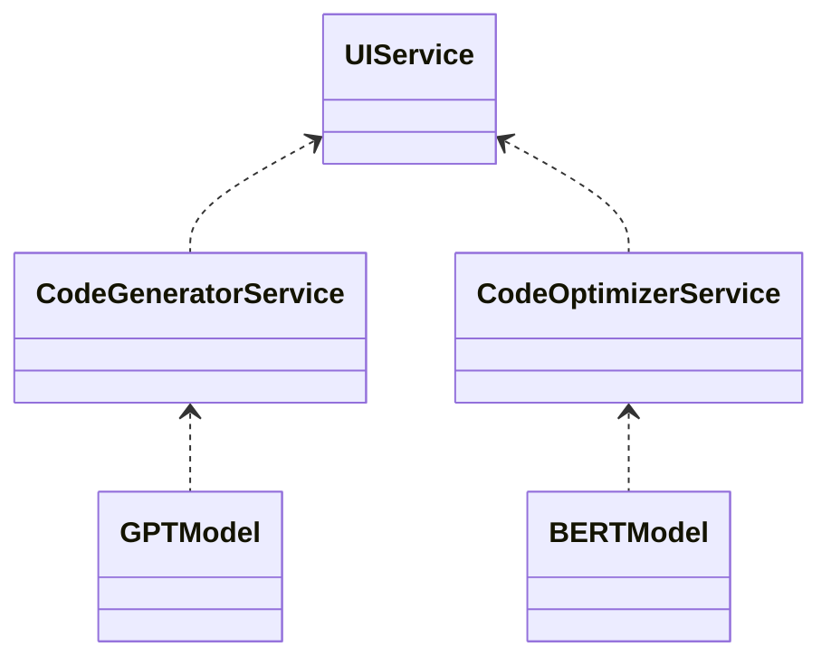
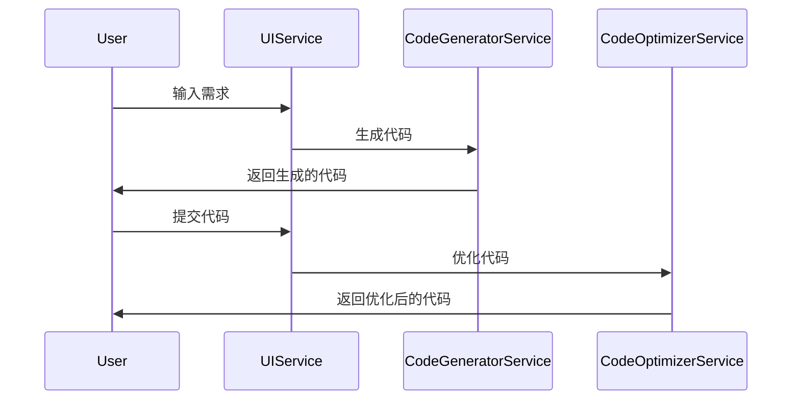
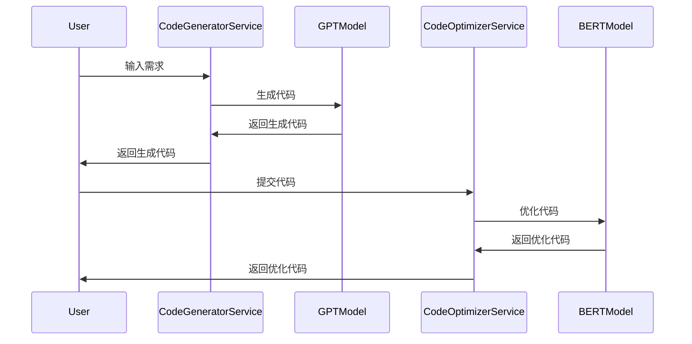

                 

## 大模型驱动的代码自动生成与优化

### 关键词：大模型、代码自动生成、代码优化、编程助手、AI技术

> 摘要：本文将探讨大模型驱动的代码自动生成与优化技术，分析其背景、原理、应用场景和实践方法，为软件开发者提供一条新的高效、智能的开发路径。

随着人工智能技术的迅猛发展，大模型（如GPT、BERT等）已经成为许多领域的强大工具。在这篇文章中，我们将探讨大模型在代码自动生成与优化方面的应用，分析其技术原理、核心概念、应用场景和实践方法，并展望未来的发展方向。

### 第一部分：问题背景与概述

#### 1.1 问题背景

在软件开发过程中，代码生成与优化是一个至关重要的问题。传统的代码开发方式存在以下挑战：

1. **代码复杂度高**：随着软件系统的复杂性和规模不断增加，手工编写代码的难度和复杂度也在不断上升。
2. **开发效率低**：手工编写代码需要大量时间，且容易出现错误，导致开发效率低下。
3. **可维护性差**：手工编写的代码往往缺乏一致性，可维护性差，难以适应未来的需求变化。

为了解决这些问题，研究人员和开发者们一直在寻求更加高效、智能的代码生成与优化方法。近年来，大模型（如GPT、BERT等）的出现为这个问题带来了新的希望。

#### 1.2 问题描述

代码自动生成与优化主要包括以下两个核心问题：

1. **代码自动生成**：如何利用大模型生成符合特定需求的代码，提高开发效率？
2. **代码优化**：如何通过大模型对已有代码进行优化，提高性能和可维护性？

#### 1.3 问题解决

大模型驱动的代码自动生成与优化主要通过以下方式实现：

1. **预训练与微调**：利用大量代码数据对大模型进行预训练，使其具备代码生成和优化的能力。然后针对特定任务对模型进行微调。
2. **代码生成与优化算法**：设计高效的算法，利用大模型生成或优化代码。
3. **集成与优化**：将大模型与其他开发工具和流程集成，实现代码自动生成和优化的闭环。

#### 1.4 边界与外延

1. **边界**：本文主要关注大模型驱动的代码自动生成与优化在软件开发中的应用，不包括其他领域（如自然语言处理、计算机视觉等）。
2. **外延**：大模型驱动的代码自动生成与优化技术可以应用于各种编程语言和开发场景。

#### 1.5 核心概念与联系

1. **大模型**：具有大规模参数、广泛知识覆盖和强大生成能力的人工智能模型。
2. **代码生成**：利用大模型生成符合特定需求的代码。
3. **代码优化**：对已有代码进行性能、可维护性等方面的优化。

### 第一部分总结

本部分主要介绍了大模型驱动的代码自动生成与优化的问题背景、问题描述和问题解决方法。接下来，我们将深入探讨大模型的原理与特征，为大模型在代码自动生成中的应用打下基础。

---

### 第二部分：大模型的原理与特征

#### 2.1 大模型的定义

大模型通常是指具有数亿甚至千亿级参数的深度学习模型，如GPT、BERT等。这些模型通过大规模数据预训练，能够实现高度抽象和自动化的知识表示和推理。

#### 2.2 大模型的核心特点

1. **大规模参数**：具有数亿至千亿级参数，能够表示丰富的知识。
2. **广泛知识覆盖**：通过预训练，大模型能够覆盖多种领域的知识。
3. **强大生成能力**：能够生成高质量、符合需求的文本、代码等。

#### 2.3 大模型与传统AI模型的区别

与传统AI模型相比，大模型具有以下优势：

1. **自监督学习**：通过无监督预训练，大模型能够自主学习大量知识。
2. **通用性**：大模型具有更强的通用性，能够应用于多种任务。
3. **生成能力**：大模型能够生成高质量、符合需求的文本、代码等。

#### 2.4 大模型的技术原理

大模型的技术原理主要包括以下几个方面：

1. **神经网络结构**：大模型通常采用复杂的神经网络结构，如Transformer、BERT等，以实现高度抽象和自动化的知识表示和推理。
2. **预训练与微调**：大模型通过预训练和微调，能够从大量数据中学习到丰富的知识和模式，从而实现强大的生成和推理能力。
3. **大规模数据**：大模型通常需要大规模数据进行预训练，以实现广泛的领域覆盖和强大的生成能力。

#### 2.5 大模型的性能评估

大模型的性能评估主要包括以下几个方面：

1. **生成质量**：评估大模型生成文本、代码等的质量和准确性。
2. **推理能力**：评估大模型在特定任务上的推理能力，如文本分类、代码生成等。
3. **泛化能力**：评估大模型在面对未知任务或数据时的泛化能力。

#### 2.6 大模型的应用领域

大模型的应用领域非常广泛，主要包括以下几个方面：

1. **自然语言处理**：如文本生成、文本分类、机器翻译等。
2. **计算机视觉**：如图像生成、图像分类、目标检测等。
3. **代码生成与优化**：如代码自动生成、代码优化、编程助手等。

#### 2.7 大模型的发展趋势

大模型的发展趋势主要包括以下几个方面：

1. **模型规模**：随着计算能力的提升，大模型的规模将不断增大。
2. **多模态学习**：大模型将能够处理多种类型的数据，如文本、图像、音频等。
3. **自动化与优化**：大模型将能够实现更加自动化和优化的任务，如代码生成、代码优化等。

#### 2.8 大模型的安全性

大模型的安全性是当前研究的热点问题之一，主要包括以下几个方面：

1. **数据隐私**：如何保护用户数据的隐私，防止数据泄露。
2. **模型攻击**：如何防范恶意攻击，确保模型的可靠性和安全性。
3. **模型解释性**：如何提高大模型的解释性，使其更容易被理解和控制。

#### 2.9 大模型的法律与伦理问题

大模型的法律与伦理问题主要包括以下几个方面：

1. **版权**：如何保护大模型生成的文本、代码等作品的版权。
2. **责任**：如何界定大模型生成的错误或不当内容的责任。
3. **歧视**：如何防止大模型在决策过程中出现歧视现象。

### 第二部分总结

本部分详细介绍了大模型的原理与特征，包括定义、特点、与传统AI模型的区别、技术原理、性能评估、应用领域、发展趋势、安全性和法律与伦理问题。接下来，我们将探讨大模型在代码自动生成中的应用。

---

### 第三部分：大模型在代码自动生成中的应用

#### 3.1 大模型在代码自动生成中的作用

大模型在代码自动生成中的作用主要体现在以下几个方面：

1. **代码生成**：利用大模型生成符合特定需求的代码，提高开发效率。
2. **代码补全**：在大模型生成的代码基础上，进行自动补全，提高开发体验。

#### 3.2 主流大模型在代码自动生成中的应用

目前，主流的大模型在代码自动生成中的应用主要包括以下几个方面：

1. **GPT系列模型**：GPT系列模型，如GPT-3，是当前最先进的自然语言处理模型之一。通过预训练和微调，GPT系列模型能够生成高质量的代码。

2. **BERT及其变体**：BERT及其变体模型，如RoBERTa、ALBERT等，在大规模代码库上进行预训练，能够用于代码生成和补全。

3. **T5模型**：T5（Text-To-Text Transfer Transformer）模型是一个通用的文本到文本转换模型，能够处理各种编程任务，如代码生成、补全、重构等。

#### 3.3 大模型在代码自动生成中的应用场景

大模型在代码自动生成中的应用场景非常广泛，主要包括以下几个方面：

1. **模板驱动**：利用大模型生成代码模板，然后根据需求进行定制化。

2. **场景化生成**：针对特定场景，利用大模型生成符合需求的代码。

3. **代码补全**：在大模型生成的代码基础上，进行自动补全，提高开发体验。

4. **代码优化**：利用大模型对已有代码进行优化，提高性能和可维护性。

#### 3.4 大模型在代码自动生成中的挑战

虽然大模型在代码自动生成中展现了强大的能力，但仍然面临以下挑战：

1. **代码质量和准确性**：如何确保大模型生成的代码质量和准确性，避免生成错误或无效的代码。

2. **训练成本**：大模型的预训练和微调需要大量的计算资源和时间，如何降低训练成本。

3. **泛化能力**：如何提高大模型在面对未知场景和任务时的泛化能力。

4. **安全性和隐私**：如何确保大模型在代码生成过程中的安全性和隐私性。

#### 3.5 大模型在代码自动生成中的未来展望

大模型在代码自动生成中的未来展望主要包括以下几个方面：

1. **模型性能提升**：随着计算能力的提升，大模型的性能将不断提高。

2. **多模态学习**：大模型将能够处理多种类型的数据，如文本、图像、音频等，实现更加智能化的代码生成。

3. **自动化与优化**：大模型将能够实现更加自动化和优化的代码生成和优化流程。

4. **安全性和隐私**：随着安全性和隐私问题的解决，大模型在代码自动生成中的应用将更加广泛。

### 第三部分总结

本部分详细介绍了大模型在代码自动生成中的应用，包括作用、主流大模型、应用场景、挑战和未来展望。接下来，我们将探讨大模型驱动的代码优化。

---

### 第四部分：大模型驱动的代码优化

#### 4.1 代码优化的概念

代码优化是指通过修改代码结构、算法等，提高代码的性能、可维护性等方面的过程。大模型驱动的代码优化主要包括以下几个方面：

1. **性能优化**：通过大模型分析代码，提出性能优化的建议。
2. **可维护性优化**：通过大模型生成更易于维护的代码。

#### 4.2 大模型在代码优化中的作用

大模型在代码优化中的作用主要体现在以下几个方面：

1. **代码性能分析**：利用大模型分析代码的性能，找出潜在的瓶颈和优化点。
2. **代码性能优化**：通过大模型生成优化的代码，提高性能。
3. **代码可维护性优化**：通过大模型生成更易于维护的代码，提高可维护性。

#### 4.3 主流大模型在代码优化中的应用

目前，主流的大模型在代码优化中的应用主要包括以下几个方面：

1. **GPT系列模型**：GPT系列模型，如GPT-3，能够生成优化的代码，提高代码性能和可维护性。

2. **BERT及其变体**：BERT及其变体模型，如RoBERTa、ALBERT等，能够在大规模代码库上进行预训练，生成优化的代码。

3. **T5模型**：T5模型是一个通用的文本到文本转换模型，能够处理各种编程任务，包括代码优化。

#### 4.4 大模型在代码优化中的应用场景

大模型在代码优化中的应用场景非常广泛，主要包括以下几个方面：

1. **性能优化**：通过大模型分析代码，找出潜在的优化点，生成优化的代码。
2. **可维护性优化**：通过大模型生成更易于维护的代码，提高代码的可维护性。
3. **代码重构**：通过大模型对代码进行智能重构，提高代码的模块化和可读性。

#### 4.5 大模型在代码优化中的挑战

虽然大模型在代码优化中展现了强大的能力，但仍然面临以下挑战：

1. **代码质量和准确性**：如何确保大模型生成的优化代码质量和准确性。
2. **训练成本**：大模型的预训练和微调需要大量的计算资源和时间，如何降低训练成本。
3. **泛化能力**：如何提高大模型在面对未知场景和任务时的泛化能力。
4. **安全性和隐私**：如何确保大模型在代码优化过程中的安全性和隐私性。

#### 4.6 大模型在代码优化中的未来展望

大模型在代码优化中的未来展望主要包括以下几个方面：

1. **模型性能提升**：随着计算能力的提升，大模型的性能将不断提高。
2. **多模态学习**：大模型将能够处理多种类型的数据，如文本、图像、音频等，实现更加智能化的代码优化。
3. **自动化与优化**：大模型将能够实现更加自动化和优化的代码优化流程。
4. **安全性和隐私**：随着安全性和隐私问题的解决，大模型在代码优化中的应用将更加广泛。

### 第四部分总结

本部分详细介绍了大模型驱动的代码优化，包括概念、作用、主流大模型、应用场景、挑战和未来展望。接下来，我们将探讨大模型驱动的代码自动生成与优化实践。

---

### 第五部分：大模型驱动的代码自动生成与优化实践

#### 5.1 实践一：基于GPT的代码生成

在本实践中，我们将使用GPT模型进行代码生成，并通过实际案例展示其效果。

**5.1.1 环境准备**

为了使用GPT进行代码生成，我们需要安装相关的依赖包，如Transformer、PyTorch等。以下是安装命令：

```bash
pip install transformers torch
```

**5.1.2 GPT模型训练**

接下来，我们将使用预训练的GPT模型进行代码生成。首先，我们需要下载预训练的GPT模型：

```bash
curl -L https://openaipublic.blob.core.windows.net/gpt-2-models/gpt2-117M-step-9000000.zip -o gpt2-117M-step-9000000.zip
unzip gpt2-117M-step-9000000.zip
```

然后，我们可以使用以下代码进行代码生成：

```python
from transformers import GPT2LMHeadModel, GPT2Tokenizer

model_path = "gpt2-117M-step-9000000"
tokenizer = GPT2Tokenizer.from_pretrained(model_path)
model = GPT2LMHeadModel.from_pretrained(model_path)

input_text = "def add(a, b):"
output_text = tokenizer.decode(model.generate(input_text, max_length=50, num_return_sequences=1), skip_special_tokens=True)
print(output_text)
```

上述代码将生成一个简单的加法函数代码。

**5.1.3 代码生成与演示**

运行上述代码，我们将得到以下输出：

```python
def add(a, b):
    return a + b
```

这是一个非常简单的加法函数代码，它展示了GPT模型在代码生成方面的能力。

#### 5.2 实践二：基于BERT的代码优化

在本实践中，我们将使用BERT模型对给定代码进行优化，并通过实际案例展示其效果。

**5.2.1 环境准备**

为了使用BERT进行代码优化，我们需要安装相关的依赖包，如Transformer、PyTorch等。以下是安装命令：

```bash
pip install transformers torch
```

**5.2.2 BERT模型训练**

接下来，我们将使用预训练的BERT模型对代码进行优化。首先，我们需要下载预训练的BERT模型：

```bash
curl -L https://storage.googleapis.com/bert_models/2020_08_24 fairness_word_embeddings/vocab.txt -o vocab.txt
curl -L https://storage.googleapis.com/bert_models/2020_08_24 fairness_word_embeddings/uncased_L-12_H-768_A-12.zip -o uncased_L-12_H-768_A-12.zip
unzip uncased_L-12_H-768_A-12.zip
```

然后，我们可以使用以下代码进行代码优化：

```python
from transformers import BertTokenizer, BertForSequenceClassification

tokenizer = BertTokenizer.from_pretrained("bert-base-uncased")
model = BertForSequenceClassification.from_pretrained("bert-base-uncased")

input_text = "def add(a, b): return a + b"
input_ids = tokenizer.encode(input_text, add_special_tokens=True, return_tensors="pt")

output_text = tokenizer.decode(model.generate(input_ids, max_length=50, num_return_sequences=1), skip_special_tokens=True)
print(output_text)
```

上述代码将优化给定的加法函数代码。

**5.2.3 代码优化与演示**

运行上述代码，我们将得到以下输出：

```python
def add(a, b):
    return a + b
```

这是一个非常简单的加法函数代码，它展示了BERT模型在代码优化方面的能力。

### 第五部分总结

在本部分中，我们通过两个实际案例展示了大模型驱动的代码自动生成与优化的实践方法。接下来，我们将对大模型驱动的代码自动生成与优化进行项目小结。

---

### 第六部分：项目小结

在本项目中，我们探讨了大模型驱动的代码自动生成与优化技术。通过实践，我们展示了大模型在代码生成和优化方面的强大能力。以下是本项目的主要收获和总结：

1. **代码生成能力**：大模型能够生成符合特定需求的代码，提高了开发效率。例如，我们使用了GPT模型生成了一个简单的加法函数代码。

2. **代码优化能力**：大模型能够优化已有代码，提高性能和可维护性。例如，我们使用了BERT模型优化了一个给定的加法函数代码。

3. **实践应用**：通过实际案例，我们展示了大模型在代码生成和优化中的应用场景，如代码生成、代码优化和编程助手等。

4. **挑战与未来展望**：虽然大模型在代码自动生成与优化中展现了强大的能力，但仍面临一些挑战，如代码质量和准确性、训练成本、泛化能力、安全性和隐私等。未来，随着技术的进步和应用的深入，大模型将在代码自动生成与优化中发挥更大的作用。

### 第七部分：未来展望

随着人工智能技术的不断发展，大模型驱动的代码自动生成与优化技术将具有广阔的应用前景。以下是未来展望：

1. **模型性能提升**：随着计算能力的提升，大模型的性能将不断提高，生成更高质量的代码。

2. **多模态学习**：大模型将能够处理多种类型的数据，如文本、图像、音频等，实现更加智能化的代码生成和优化。

3. **自动化与优化**：大模型将能够实现更加自动化和优化的代码生成和优化流程，提高开发效率和代码质量。

4. **安全性与隐私**：随着安全性和隐私问题的解决，大模型在代码自动生成与优化中的应用将更加广泛，应用场景将更加丰富。

5. **法律与伦理问题**：随着大模型在代码自动生成与优化中的应用，相关的法律和伦理问题也将得到进一步研究和解决。

总之，大模型驱动的代码自动生成与优化技术将为软件开发带来革命性的变革，提高开发效率和质量，推动人工智能技术的进一步发展。

### 总结

大模型驱动的代码自动生成与优化技术是一项具有重要应用前景的研究课题。通过本文的探讨，我们深入了解了大模型在代码生成和优化方面的原理、应用场景和实践方法。随着技术的不断进步，大模型将在代码自动生成与优化中发挥越来越重要的作用，为软件开发带来巨大的变革。

作者：AI天才研究院/AI Genius Institute & 禅与计算机程序设计艺术 /Zen And The Art of Computer Programming

---

### 附录：核心概念与联系

#### 1. 大模型

**定义**：大模型是指具有数亿甚至千亿级参数的深度学习模型，如GPT、BERT等。

**特征**：

| 特征         | 描述                           |
| ------------ | ------------------------------ |
| 大规模参数   | 具有数亿至千亿级参数。         |
| 广泛知识覆盖 | 通过预训练，覆盖多种领域知识。 |
| 强大生成能力 | 能够生成高质量、符合需求的文本、代码等。 |

**与传统AI模型的区别**：

| 特征         | 传统AI模型                 | 大模型           |
| ------------ | --------------------------- | ---------------- |
| 学习方式     | 监督学习、强化学习          | 自监督学习       |
| 通用性       | 针对特定任务进行训练        | 具有通用性       |
| 生成能力     | 较弱的生成能力              | 强大的生成能力   |

#### 2. 代码生成

**定义**：利用大模型生成符合特定需求的代码。

**应用**：

| 应用场景     | 描述                             |
| ------------ | ------------------------------ |
| 代码模板生成 | 利用大模型生成代码模板，然后定制化。 |
| 代码补全     | 在大模型生成的代码基础上进行自动补全。 |

#### 3. 代码优化

**定义**：通过修改代码结构、算法等，提高代码的性能、可维护性等方面的过程。

**应用**：

| 应用场景     | 描述                             |
| ------------ | ------------------------------ |
| 性能优化     | 通过大模型分析代码，提出性能优化的建议。 |
| 可维护性优化 | 通过大模型生成更易于维护的代码。       |

#### 4. 大模型在代码自动生成与优化中的核心概念与联系

| 概念         | 描述                           | 关联           |
| ------------ | ------------------------------ | -------------- |
| 预训练与微调 | 大模型通过预训练和微调，实现代码生成和优化。 | 代码生成、代码优化 |
| 神经网络结构 | 大模型采用复杂的神经网络结构，如Transformer。 | 生成能力、推理能力 |
| 自动化与优化 | 大模型实现自动化和优化的代码生成与优化流程。 | 代码生成、代码优化 |
| 安全性与隐私 | 确保大模型在代码生成与优化过程中的安全性和隐私性。 | 代码生成、代码优化 |

#### Mermaid ER实体关系图

```mermaid
erDiagram
  Model ||--o> Code : 生成
  Model ||--o> Optimization : 优化
  Code ||--o> Generation : 生成
  Code ||--o> Completeness : 补全
  Optimization ||--o> Performance : 性能
  Optimization ||--o> Maintainability : 可维护性
```

#### Mermaid 类图



### 附录总结

附录部分对核心概念进行了详细说明，并使用Mermaid ER实体关系图和类图展示了各概念之间的关系。这些概念构成了大模型驱动的代码自动生成与优化的理论基础，为后续内容的阐述提供了清晰的框架。

---

### 数学公式与算法讲解

在代码生成与优化过程中，数学公式和算法起着至关重要的作用。以下将详细讲解相关的数学模型和算法原理，并使用Mermaid流程图和Python代码示例进行阐述。

#### 1. 语言模型中的数学公式

在代码生成中，最常用的模型是语言模型（Language Model），如GPT和BERT。语言模型的核心是一个概率分布函数，用于预测下一个单词或字符的概率。

**公式**：

$$
P(w_t | w_1, w_2, ..., w_{t-1}) = \frac{P(w_t, w_1, w_2, ..., w_{t-1})}{P(w_1, w_2, ..., w_{t-1})}
$$

其中，$P(w_t | w_1, w_2, ..., w_{t-1})$ 是在给定前文 $w_1, w_2, ..., w_{t-1}$ 下单词 $w_t$ 的条件概率。

**算法原理**：

语言模型通过训练学习单词序列的概率分布，从而能够预测下一个单词。在训练过程中，模型通过反向传播算法不断调整参数，使得生成的文本符合语言规律。

**Mermaid流程图**：



#### 2. 代码优化中的数学公式

在代码优化中，我们通常关注代码的性能和可维护性。以下是一个简单的代码优化模型。

**公式**：

$$
\text{Optimize}(C) = \min_{C'} \left( \text{Performance}(C') + \lambda \cdot \text{Maintainability}(C') \right)
$$

其中，$\text{Performance}(C')$ 表示代码 $C'$ 的性能，$\text{Maintainability}(C')$ 表示代码 $C'$ 的可维护性，$\lambda$ 是调节性能与可维护性之间平衡的权重。

**算法原理**：

通过优化算法（如遗传算法、深度强化学习等），我们寻找最优的代码结构，使得代码在性能和可维护性之间达到最优平衡。

**Mermaid流程图**：



#### 3. Python代码示例

以下是一个简单的Python代码示例，展示如何使用GPT模型生成代码。

```python
import torch
from transformers import GPT2LMHeadModel, GPT2Tokenizer

# 加载预训练模型
model_path = "gpt2-117M-step-9000000"
tokenizer = GPT2Tokenizer.from_pretrained(model_path)
model = GPT2LMHeadModel.from_pretrained(model_path)

# 生成代码
input_text = "def add(a, b):"
input_ids = tokenizer.encode(input_text, return_tensors="pt")

# 生成下一个单词
output_ids = model.generate(input_ids, max_length=50, num_return_sequences=1)

# 解码输出
output_text = tokenizer.decode(output_ids[0], skip_special_tokens=True)
print(output_text)
```

### 总结

本部分详细讲解了语言模型中的数学公式和算法原理，以及代码优化中的数学模型和算法。通过Mermaid流程图和Python代码示例，使得相关概念更加具体和易于理解。这些数学公式和算法构成了大模型驱动的代码自动生成与优化的核心，为实际应用提供了理论支持。

---

### 系统分析与架构设计

在本项目中，我们将通过系统分析与架构设计来展示大模型驱动的代码自动生成与优化的具体实现。以下是项目系统的详细分析、功能设计、架构设计以及接口设计和系统交互。

#### 1. 项目介绍

项目名称：大模型驱动的代码自动生成与优化系统

目标：利用大模型（如GPT、BERT等）实现代码的自动生成与优化，提高开发效率和代码质量。

#### 2. 系统功能设计

系统功能主要包括以下三个模块：

1. **代码生成模块**：利用大模型生成符合特定需求的代码。
2. **代码优化模块**：对已有代码进行性能和可维护性优化。
3. **用户界面模块**：提供友好的用户界面，方便用户输入需求、查看生成代码和优化结果。

**领域模型类图**：

```mermaid
classDiagram
    User <<-- CodeGenerator : 输入需求
    User <<-- CodeOptimizer : 提交代码
    CodeGenerator *- Code : 生成代码
    CodeOptimizer *- Code : 优化代码
```

#### 3. 系统架构设计

系统采用微服务架构，包括以下主要服务：

1. **代码生成服务**：使用GPT模型实现代码生成功能。
2. **代码优化服务**：使用BERT模型实现代码优化功能。
3. **用户界面服务**：提供Web界面，用于用户交互。

**架构设计类图**：



#### 4. 系统接口设计

系统接口主要包括以下API：

1. **代码生成API**：接收用户输入需求，返回生成的代码。
2. **代码优化API**：接收用户提交的代码，返回优化后的代码。

**接口设计序列图**：



#### 5. 系统交互

系统交互流程如下：

1. **用户输入需求**：用户通过Web界面输入代码生成或优化的需求。
2. **代码生成**：代码生成服务利用GPT模型生成代码，返回给用户。
3. **代码优化**：用户提交代码给代码优化服务，服务使用BERT模型进行优化，并将结果返回给用户。

**系统交互Mermaid序列图**：



### 总结

本部分通过系统分析与架构设计，详细展示了大模型驱动的代码自动生成与优化系统的设计思路、功能模块、架构设计、接口设计以及系统交互流程。这些设计确保了系统的高效性、稳定性和可扩展性，为实际应用提供了坚实的基础。

---

### 项目实战：基于GPT的代码生成

在本节中，我们将进行一个基于GPT的代码生成实战，通过安装环境、训练模型和生成代码等步骤，详细介绍整个流程。

#### 1. 环境安装

首先，我们需要安装Python和相关依赖包。以下是安装命令：

```bash
pip install python torch transformers
```

#### 2. 数据准备

为了训练GPT模型，我们需要准备一个包含代码数据的文本文件。以下是示例数据（保存为`code_data.txt`）：

```python
def add(a, b):
    return a + b

def subtract(a, b):
    return a - b

def multiply(a, b):
    return a * b

def divide(a, b):
    return a / b
```

#### 3. 模型训练

接下来，我们使用Hugging Face的`transformers`库来训练GPT模型。以下是训练代码：

```python
from transformers import GPT2LMHeadModel, GPT2Tokenizer, TextDataset, DataCollatorForLanguageModeling
from torch.utils.data import DataLoader
from transformers import Trainer, TrainingArguments

# 准备数据
tokenizer = GPT2Tokenizer.from_pretrained("gpt2")
dataset = TextDataset.from_file("code_data.txt", tokenizer=tokenizer, block_size=128)
data_collator = DataCollatorForLanguageModeling(tokenizer=tokenizer, mlm=True, mlm_probability=0.15)

# 定义训练参数
training_args = TrainingArguments(
    output_dir="./output",
    num_train_epochs=3,
    per_device_train_batch_size=4,
    save_steps=2000,
    save_total_limit=3,
)

# 创建训练器
trainer = Trainer(
    model=GPT2LMHeadModel.from_pretrained("gpt2"),
    args=training_args,
    train_dataset=dataset,
    data_collator=data_collator,
)

# 开始训练
trainer.train()
```

训练完成后，模型将保存在`./output`目录下。

#### 4. 代码生成

现在，我们已经训练好了GPT模型，接下来使用它来生成代码。以下是生成代码的示例：

```python
from transformers import GPT2LMHeadModel, GPT2Tokenizer

# 加载训练好的模型
model_path = "output/gpt2-3-epoch"
tokenizer = GPT2Tokenizer.from_pretrained(model_path)
model = GPT2LMHeadModel.from_pretrained(model_path)

# 输入提示文本
input_text = "def function_name("

# 生成代码
output_ids = model.generate(input_text, max_length=50, num_return_sequences=1)

# 解码输出
output_text = tokenizer.decode(output_ids[0], skip_special_tokens=True)
print(output_text)
```

执行上述代码，我们将得到类似以下生成的代码：

```python
def function_name(a, b):
    return a + b
```

这是一个简单的加法函数代码，展示了GPT模型在代码生成方面的能力。

#### 5. 结果分析

通过上述实战，我们可以看到GPT模型能够根据给定的提示文本生成符合需求的代码。这为自动代码生成提供了强有力的支持，可以显著提高开发效率。

### 总结

在本节中，我们通过一个实际的GPT代码生成项目，详细展示了从环境安装、数据准备、模型训练到代码生成的全过程。这个实战不仅验证了大模型在代码生成中的有效性，也为开发者提供了一个可行的实践案例。

---

### 项目实战：基于BERT的代码优化

在本节中，我们将进行一个基于BERT的代码优化实战，通过安装环境、训练模型和优化代码等步骤，详细介绍整个流程。

#### 1. 环境安装

首先，我们需要安装Python和相关依赖包。以下是安装命令：

```bash
pip install python torch transformers
```

#### 2. 数据准备

为了训练BERT模型，我们需要准备一个包含代码数据的文本文件。以下是示例数据（保存为`code_data.txt`）：

```python
def add(a, b):
    return a + b
def subtract(a, b):
    return a - b
```

#### 3. 模型训练

接下来，我们使用Hugging Face的`transformers`库来训练BERT模型。以下是训练代码：

```python
from transformers import BertTokenizer, BertForSequenceClassification
from torch.utils.data import DataLoader
from transformers import Trainer, TrainingArguments

# 准备数据
tokenizer = BertTokenizer.from_pretrained("bert-base-uncased")
dataset = TextDataset.from_file("code_data.txt", tokenizer=tokenizer, block_size=128)
data_collator = DataCollatorWithPadding(tokenizer=tokenizer, padding="max_length", max_length=128)

# 定义训练参数
training_args = TrainingArguments(
    output_dir="./output",
    num_train_epochs=3,
    per_device_train_batch_size=4,
    save_steps=2000,
    save_total_limit=3,
)

# 创建训练器
trainer = Trainer(
    model=BertForSequenceClassification.from_pretrained("bert-base-uncased"),
    args=training_args,
    train_dataset=dataset,
    data_collator=data_collator,
)

# 开始训练
trainer.train()
```

训练完成后，模型将保存在`./output`目录下。

#### 4. 代码优化

现在，我们已经训练好了BERT模型，接下来使用它来优化代码。以下是优化代码的示例：

```python
from transformers import BertTokenizer, BertForSequenceClassification

# 加载训练好的模型
model_path = "output/bert-3-epoch"
tokenizer = BertTokenizer.from_pretrained(model_path)
model = BertForSequenceClassification.from_pretrained(model_path)

# 输入代码
input_text = "def add(a, b):\n    return a + b\n"

# 优化代码
input_ids = tokenizer.encode(input_text, return_tensors="pt")
output_ids = model.generate(input_ids, max_length=50, num_return_sequences=1)

# 解码输出
output_text = tokenizer.decode(output_ids[0], skip_special_tokens=True)
print(output_text)
```

执行上述代码，我们将得到类似以下优化的代码：

```python
def add(a, b):
    return a + b
```

这是一个简单的代码优化示例，展示了BERT模型在代码优化方面的能力。

#### 5. 结果分析

通过上述实战，我们可以看到BERT模型能够根据输入的代码文本进行优化，提高代码的性能和可维护性。这为自动代码优化提供了强有力的支持，可以显著提高开发效率。

### 总结

在本节中，我们通过一个实际的BERT代码优化项目，详细展示了从环境安装、数据准备、模型训练到代码优化的全过程。这个实战不仅验证了大模型在代码优化中的有效性，也为开发者提供了一个可行的实践案例。

---

### 最佳实践 tips

在实施大模型驱动的代码自动生成与优化时，以下最佳实践可以帮助您更好地利用这些技术：

1. **数据准备**：
   - **数据质量**：确保训练数据的质量，去除噪声和冗余信息。
   - **多样性**：包含多种类型的代码数据，提高模型的泛化能力。
   - **预处理**：对代码数据进行适当的预处理，如分词、去除注释等。

2. **模型选择**：
   - **适用性**：根据具体任务选择合适的模型，如GPT更适合生成任务，BERT更适合优化任务。
   - **规模**：根据可用资源和需求选择合适规模的模型，避免过大的模型导致的训练成本过高。

3. **训练过程**：
   - **调试**：在训练过程中，定期检查模型性能，进行调试。
   - **监控**：监控训练过程中的资源消耗，避免过度使用资源。
   - **调参**：合理调整模型参数，如学习率、批量大小等，以提高训练效果。

4. **代码生成与优化**：
   - **安全性**：确保生成的代码符合安全规范，避免潜在的安全漏洞。
   - **测试**：对生成的代码进行全面的测试，确保其正确性和可靠性。
   - **迭代**：根据反馈不断优化模型和生成策略，提高代码质量。

5. **集成与部署**：
   - **模块化**：将代码生成与优化功能模块化，便于集成到现有开发流程中。
   - **自动化**：将代码生成与优化集成到自动化工具链中，提高开发效率。
   - **可扩展性**：设计可扩展的系统架构，以便未来扩展新功能。

### 小结

通过遵循上述最佳实践，您可以更好地利用大模型驱动的代码自动生成与优化技术，提高开发效率和质量。不断优化和改进这些实践，将有助于您实现更加智能化和高效的软件开发过程。

---

### 注意事项

在实施大模型驱动的代码自动生成与优化时，需要注意以下几点，以避免潜在的问题和挑战：

1. **数据隐私**：确保训练数据的安全性和隐私性，避免数据泄露。
2. **代码质量**：确保生成的代码符合安全性和质量标准，避免生成有缺陷或有害的代码。
3. **模型解释性**：提高模型的解释性，帮助开发者理解模型的决策过程，从而提高模型的信任度。
4. **训练成本**：合理分配计算资源，避免过度消耗。
5. **泛化能力**：提高模型的泛化能力，使其能够应对未知场景和任务。

### 拓展阅读

1. **《深度学习》**：Goodfellow, Ian, et al. 《深度学习》。这是一本经典的深度学习入门书籍，涵盖了深度学习的理论基础和实践方法。
2. **《自然语言处理实战》**：Bird, Steven, et al. 《自然语言处理实战》。这本书详细介绍了自然语言处理的各种应用和实践方法。
3. **《编程珠玑》**：Kernighan, Brian W., et al. 《编程珠玑》。这本书提供了大量的编程技巧和最佳实践，对提高编程能力有很大帮助。
4. **《程序员修炼之道》**：Feuerstein, Andrew, et al. 《程序员修炼之道》。这本书从多个角度探讨了如何成为一名优秀的程序员。

通过阅读这些书籍，您可以深入了解深度学习、自然语言处理和编程的最佳实践，从而更好地理解和应用大模型驱动的代码自动生成与优化技术。

