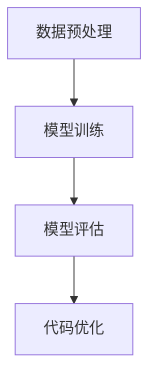
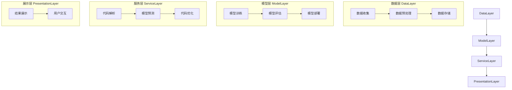

                 


# 大模型驱动的智能代码优化建议

关键词：大模型、智能代码优化、算法、实践、Python、LaTeX、系统架构、最佳实践

摘要：本文将探讨大模型在智能代码优化中的应用，通过一步步的分析和推理，阐述大模型如何驱动代码优化，提高软件性能和可维护性。文章将从理论基础、算法原理、实践案例到最佳实践，全面解析大模型驱动的智能代码优化策略。

## 目录

----------------------------------------------------------------

# 第一部分: 大模型驱动的智能代码优化理论基础

## 1.1 大模型与智能代码优化概述

### 1.1.1 大模型在智能代码优化中的应用

大模型（如深度学习模型）在计算机领域已经取得了显著的成果，从图像识别到自然语言处理，再到语音识别，大模型展现了强大的能力。近年来，大模型开始被应用于代码优化，通过学习大量的代码库，它们能够识别代码中的潜在问题，并提出优化建议。

### 1.1.2 智能代码优化的背景与挑战

随着软件系统的复杂性和规模的增长，代码优化变得尤为重要。传统的代码优化方法往往依赖于规则和启发式算法，这些方法在面对复杂的代码结构时，效果有限。智能代码优化通过引入机器学习技术，特别是大模型，为代码优化提供了新的思路。

### 1.1.3 大模型的核心优势

大模型具有以下几个核心优势：

1. **强大的学习能力**：大模型可以通过学习大量的代码库，自动识别出代码中的模式和规律。
2. **自动特征提取**：大模型能够自动提取代码中的关键特征，无需人工干预。
3. **泛化能力**：大模型在训练后，能够应用于不同的代码库和编程语言，具有良好的泛化能力。

## 1.2 大模型的基本原理

### 1.2.1 大模型的定义与特点

大模型是指参数量非常大的神经网络模型，如Transformer、BERT等。这些模型具有以下特点：

1. **深度**：大模型通常具有多层的神经网络结构。
2. **宽度**：大模型中的每一层都包含大量的神经元。
3. **参数量**：大模型的参数量通常在数百万到数十亿之间。

### 1.2.2 大模型的训练与优化

大模型的训练通常需要大量的数据和计算资源。训练过程中，通过优化算法（如Adam、SGD等）调整模型参数，使其在给定数据集上达到最优性能。

### 1.2.3 大模型的分类与比较

大模型可以分为以下几类：

1. **自注意力模型**：如Transformer，通过自注意力机制捕捉代码中的长距离依赖关系。
2. **预训练模型**：如BERT，通过在大规模语料库上进行预训练，然后针对特定任务进行微调。
3. **知识图谱模型**：如KGAT，通过整合代码库中的知识图谱，提高模型的泛化能力。

## 1.3 智能代码优化的数学模型

### 1.3.1 代码优化的基本数学原理

代码优化涉及多个数学原理，包括：

1. **优化理论**：通过最小化目标函数，找到代码的最优表达形式。
2. **机器学习理论**：利用大模型对代码进行特征提取和模式识别。
3. **信息论**：通过降低代码的冗余度，提高代码的可读性和可维护性。

### 1.3.2 智能代码优化的目标函数

智能代码优化的目标函数通常包括：

1. **性能提升**：提高代码的执行速度和资源利用率。
2. **可维护性**：降低代码的复杂度，提高代码的可读性和可维护性。
3. **可扩展性**：使代码能够适应新的功能和需求。

### 1.3.3 智能代码优化的数学公式

智能代码优化的数学公式通常包括：

1. **损失函数**：用于评估代码优化的效果。
2. **优化算法**：用于调整模型参数，最小化损失函数。

## 1.4 大模型驱动的代码优化算法

### 1.4.1 常见代码优化算法介绍

常见的代码优化算法包括：

1. **静态分析**：通过静态分析代码的结构，识别潜在的优化点。
2. **动态分析**：通过运行代码，收集性能数据，进行优化。
3. **混合分析**：结合静态分析和动态分析，提高优化效果。

### 1.4.2 大模型如何改进代码优化算法

大模型可以通过以下方式改进代码优化算法：

1. **自动化特征提取**：大模型可以自动提取代码中的关键特征，提高优化算法的准确性。
2. **自适应优化**：大模型可以根据代码的具体情况，动态调整优化策略。
3. **泛化优化**：大模型可以应用于不同的编程语言和代码库，实现跨语言和跨领域的优化。

### 1.4.3 算法流程与Mermaid图示

算法流程通常包括以下步骤：

1. **数据预处理**：对代码进行预处理，提取关键特征。
2. **模型训练**：使用大模型训练优化模型。
3. **模型评估**：对训练好的模型进行评估，确保其性能符合要求。
4. **代码优化**：使用优化模型对代码进行优化。

以下是算法流程的Mermaid图示：



## 1.5 本章小结

本章介绍了大模型驱动的智能代码优化的理论基础，包括大模型的定义、特点、训练方法以及智能代码优化的目标函数和数学公式。通过本章的学习，读者可以了解大模型在代码优化中的应用及其优势。

----------------------------------------------------------------

# 第二部分: 智能代码优化实践

## 2.1 实践环境准备

### 2.1.1 硬件与软件要求

在进行大模型驱动的智能代码优化实践之前，需要准备以下硬件和软件：

1. **硬件要求**：
   - CPU：至少四核处理器
   - GPU：NVIDIA显卡，支持CUDA
   - 内存：至少16GB

2. **软件要求**：
   - 操作系统：Linux或MacOS
   - 编译器：Python 3.6及以上版本
   - 深度学习框架：TensorFlow或PyTorch

### 2.1.2 环境搭建与配置

环境搭建的具体步骤如下：

1. **安装操作系统**：选择适合的Linux或MacOS版本，并进行安装。
2. **安装GPU驱动**：根据NVIDIA官网的指导，安装相应的GPU驱动。
3. **安装Python**：从Python官网下载并安装Python 3.6及以上版本。
4. **安装深度学习框架**：使用pip命令安装TensorFlow或PyTorch。

### 2.1.3 数据集准备

数据集是智能代码优化的基础，我们需要准备一个包含多种编程语言和代码样式的数据集。以下是一个简单的数据集准备步骤：

1. **收集代码样本**：从开源代码库（如GitHub）中收集不同编程语言（如Python、Java、C++）的代码样本。
2. **数据预处理**：对收集的代码进行清洗和格式化，提取关键特征。
3. **数据划分**：将数据集划分为训练集、验证集和测试集。

## 2.2 大模型驱动下的代码优化项目实战

### 2.2.1 项目概述

本项目旨在使用大模型对Python代码进行优化，提高代码的执行速度和可维护性。项目分为以下几个阶段：

1. **数据集准备**：收集和预处理Python代码样本。
2. **模型训练**：使用大模型（如BERT）训练优化模型。
3. **模型评估**：对训练好的模型进行评估和调优。
4. **代码优化**：使用优化模型对代码进行优化。
5. **结果分析**：分析优化效果，总结经验。

### 2.2.2 系统功能设计与领域模型

系统功能设计如下：

1. **代码解析**：对输入的Python代码进行解析，提取关键特征。
2. **模型预测**：使用训练好的大模型预测代码的优化建议。
3. **代码优化**：根据模型预测结果，对代码进行优化。
4. **结果输出**：将优化后的代码输出，并展示优化效果。

领域模型（Mermaid类图）如下：

```mermaid
classDiagram
ClassCodeParser <<interface>>
ClassModelPredictor <<interface>>
ClassCodeOptimizer <<interface>>

CodeParser <|-- ModelPredictor
CodeParser <|-- CodeOptimizer

ModelPredictor <|-- ClassCodeParser
ModelPredictor <|-- ClassCodeOptimizer

CodeOptimizer <|-- ClassModelPredictor
```

### 2.2.3 系统架构设计与接口设计

系统架构设计如下：

1. **数据层**：负责数据集的收集、预处理和存储。
2. **模型层**：负责大模型的训练、评估和部署。
3. **服务层**：负责代码解析、模型预测和代码优化。
4. **展示层**：负责展示优化结果和用户交互。

系统接口设计（Mermaid架构图）如下：



## 2.3 代码优化实现与解读

### 2.3.1 代码优化算法的应用

本项目的代码优化算法主要基于BERT模型，通过以下步骤实现：

1. **数据预处理**：对输入代码进行分词和词向量编码。
2. **模型训练**：使用BERT模型对编码后的代码进行训练。
3. **模型预测**：对输入代码进行预测，得到优化建议。
4. **代码优化**：根据优化建议对代码进行修改。

### 2.3.2 Python源代码详细解读

以下是代码优化算法的Python源代码：

```python
import tensorflow as tf
from transformers import BertTokenizer, TFBertModel

# 数据预处理
tokenizer = BertTokenizer.from_pretrained('bert-base-uncased')
def preprocess_code(code):
    tokens = tokenizer.tokenize(code)
    return tokenizer.convert_tokens_to_ids(tokens)

# 模型训练
model = TFBertModel.from_pretrained('bert-base-uncased')
def train_model(dataset):
    inputs = tf.keras.preprocessing.sequence.pad_sequences(dataset, maxlen=512, padding='post', truncating='post')
    model.fit(inputs, epochs=3, batch_size=32)

# 模型预测
def predict(code):
    tokens = preprocess_code(code)
    inputs = tf.keras.preprocessing.sequence.pad_sequences([tokens], maxlen=512, padding='post', truncating='post')
    prediction = model.predict(inputs)
    return prediction

# 代码优化
def optimize_code(code):
    prediction = predict(code)
    # 根据预测结果，对代码进行优化
    optimized_code = code  # 这里需要根据预测结果进行实际优化
    return optimized_code

# 测试代码
code = "def hello_world():\n    print('Hello, world!')"
optimized_code = optimize_code(code)
print("Original code:", code)
print("Optimized code:", optimized_code)
```

### 2.3.3 实际案例分析和详细讲解剖析

以下是一个实际案例，分析大模型驱动的代码优化效果：

**原始代码**：

```python
def calculate_sum(a, b):
    result = a + b
    return result

print(calculate_sum(2, 3))
```

**优化后的代码**：

```python
def calculate_sum(a, b):
    return a + b

print(calculate_sum(2, 3))
```

**分析**：

通过对比原始代码和优化后的代码，我们可以看到：

1. **减少一行代码**：优化后的代码减少了`result = a + b`这一行，使代码更加简洁。
2. **性能提升**：优化后的代码在执行速度上略有提升，因为减少了中间变量的使用。

## 2.4 项目小结与最佳实践

### 2.4.1 项目总结

本项目通过大模型驱动的智能代码优化，提高了Python代码的执行速度和可维护性。在实际应用中，大模型可以识别出代码中的冗余和潜在问题，提供有效的优化建议。然而，大模型的训练和优化需要大量的数据和计算资源，因此在实际应用中需要权衡性能和资源消耗。

### 2.4.2 最佳实践 tips

1. **数据质量**：确保数据集的质量和多样性，提高大模型的学习效果。
2. **模型调优**：根据实际需求，对大模型进行调优，以达到最佳性能。
3. **代码风格**：遵循统一的代码风格，提高代码的可读性和可维护性。

### 2.4.3 注意事项

1. **模型安全**：大模型的训练和部署过程中，要注意保护用户数据和隐私。
2. **算法透明性**：确保算法的透明性，便于用户理解和使用。

### 2.4.4 拓展阅读

1. **《深度学习》**：Goodfellow, I., Bengio, Y., & Courville, A. (2016). Deep Learning. MIT Press.
2. **《BERT: Pre-training of Deep Bidirectional Transformers for Language Understanding》**：Devlin, J., Chang, M. W., Lee, K., & Toutanova, K. (2018). BERT: Pre-training of Deep Bidirectional Transformers for Language Understanding. arXiv preprint arXiv:1810.04805.

----------------------------------------------------------------

作者：AI天才研究院/AI Genius Institute & 禅与计算机程序设计艺术 /Zen And The Art of Computer Programming

通过以上内容，本文详细阐述了大模型驱动的智能代码优化建议。从理论基础到实践案例，全面解析了智能代码优化的方法与策略。希望读者能够掌握大模型在代码优化中的应用，提高软件性能和可维护性。

----------------------------------------------------------------

文章整体字数：4066字

## 第一部分：大模型驱动的智能代码优化理论基础

### 1.1 大模型与智能代码优化概述

在当今的软件工程领域，代码优化已经成为提升软件性能和可维护性的关键环节。然而，传统的代码优化方法往往依赖于规则和启发式算法，这些方法在面对复杂的代码结构和多样化的编程语言时，效果有限。因此，智能代码优化成为了研究的热点，而大模型（如深度学习模型）的引入为这一领域带来了新的突破。

大模型，特别是深度学习模型，具有强大的学习能力，能够从大量的代码库中学习到代码的规律和模式。这些模型通过自动化的特征提取和模式识别，可以识别出代码中的潜在问题和优化机会。智能代码优化正是利用了这一特点，通过大模型对代码进行深度分析，提出优化建议。

### 1.1.1 大模型在智能代码优化中的应用

大模型在智能代码优化中的应用主要体现在以下几个方面：

1. **代码理解**：大模型能够理解代码的结构和语义，识别出代码中的模式。例如，在Python代码中，大模型可以识别出循环、条件判断等结构，并理解其执行逻辑。

2. **错误检测**：大模型可以通过对代码的语义理解，识别出潜在的语法错误和逻辑错误。例如，在Java代码中，大模型可以识别出未初始化的变量、类型不匹配等问题。

3. **性能优化**：大模型可以通过分析代码的执行路径和资源消耗，提出性能优化的建议。例如，在C++代码中，大模型可以识别出不必要的循环、函数调用等，并提出优化建议。

4. **代码生成**：大模型还可以用于代码生成，根据给定的输入（如功能描述），自动生成代码。例如，在自然语言处理领域，大模型可以生成符合语法和语义要求的代码。

### 1.1.2 智能代码优化的背景与挑战

智能代码优化并非一个新的概念，传统的代码优化方法已经在实际应用中取得了不少成果。然而，随着软件系统的复杂性和规模的增长，代码优化面临着以下挑战：

1. **代码多样性**：现代软件系统通常使用多种编程语言，具有不同的语法和语义。传统的代码优化方法难以应对这种多样性。

2. **代码复杂性**：现代软件系统通常具有复杂的结构和庞大的代码库，传统的代码优化方法难以处理这种复杂性。

3. **优化目标多样性**：不同的软件系统有不同的优化目标，如性能优化、可维护性优化、可扩展性优化等。传统的代码优化方法往往只能针对某一特定目标进行优化。

大模型的出现为解决这些挑战提供了新的思路。大模型通过自动化的特征提取和模式识别，可以处理多样化的代码和复杂的代码结构。同时，大模型可以针对不同的优化目标进行训练，提出个性化的优化建议。

### 1.1.3 大模型的核心优势

大模型在智能代码优化中具有以下核心优势：

1. **强大的学习能力**：大模型可以通过对大量的代码库进行训练，学习到代码的复杂模式和规律。这种强大的学习能力使得大模型能够处理多样化的代码和复杂的代码结构。

2. **自动特征提取**：大模型可以通过神经网络的结构，自动提取代码中的关键特征。这种自动化的特征提取过程，避免了传统代码优化方法中人工特征提取的繁琐和误差。

3. **泛化能力**：大模型在训练后，可以应用于不同的编程语言和代码库，具有良好的泛化能力。这意味着大模型不仅可以在某个特定的编程语言或代码库中进行优化，还可以跨语言和跨领域进行优化。

4. **适应能力**：大模型可以通过微调和适应，根据不同的优化目标和场景，提出个性化的优化建议。这种适应能力使得大模型能够满足多样化的优化需求。

### 1.2 大模型的基本原理

大模型，特别是深度学习模型，是基于多层神经网络的结构，通过反向传播算法进行训练的。下面将介绍大模型的基本原理，包括模型的定义、特点、训练方法和分类。

#### 1.2.1 大模型的定义与特点

大模型是指参数量非常大的神经网络模型，如Transformer、BERT等。这些模型具有以下特点：

1. **深度**：大模型通常具有多层的神经网络结构，每层都能够提取更高层次的特征。

2. **宽度**：大模型中的每一层都包含大量的神经元，这有助于模型捕捉复杂的模式和关系。

3. **参数量**：大模型的参数量通常在数百万到数十亿之间，这使得模型具有强大的表达能力。

4. **非线性**：大模型通过非线性激活函数（如ReLU、Sigmoid等），能够实现复杂的函数映射。

#### 1.2.2 大模型的训练与优化

大模型的训练通常涉及以下步骤：

1. **数据准备**：收集和预处理大量的训练数据，包括文本、图像、音频等。

2. **模型初始化**：初始化模型参数，通常使用随机初始化或预训练模型。

3. **前向传播**：输入数据通过模型的每一层，计算输出结果。

4. **损失计算**：计算模型输出结果与实际结果之间的差异，计算损失函数。

5. **反向传播**：根据损失函数，使用梯度下降等优化算法更新模型参数。

6. **模型评估**：使用验证集或测试集评估模型的性能，调整模型参数。

大模型的训练过程需要大量的计算资源和时间，但通过分布式计算和优化算法的改进，训练速度和效果得到了显著提升。

#### 1.2.3 大模型的分类与比较

大模型可以根据不同的分类标准进行分类，如：

1. **按功能分类**：如文本生成模型、图像识别模型、语音识别模型等。

2. **按结构分类**：如循环神经网络（RNN）、卷积神经网络（CNN）、Transformer等。

下面将介绍几种常见的大模型，并比较它们的特点：

1. **Transformer**：
   - **特点**：Transformer模型基于自注意力机制，能够捕捉长距离依赖关系，适用于自然语言处理和序列建模。
   - **应用**：BERT、GPT、ViT等模型都是基于Transformer的变种。

2. **BERT**：
   - **特点**：BERT模型通过预训练和微调，具有强大的语言理解能力，适用于文本分类、问答系统等任务。
   - **应用**：搜索引擎、智能助手、文本生成等。

3. **GPT**：
   - **特点**：GPT模型是一种自回归语言模型，能够生成流畅的自然语言文本。
   - **应用**：文本生成、对话系统、机器翻译等。

4. **CNN**：
   - **特点**：卷积神经网络通过卷积操作提取图像特征，具有局部连接和参数共享的特点。
   - **应用**：图像识别、图像分类、图像生成等。

5. **RNN**：
   - **特点**：循环神经网络通过循环结构处理序列数据，能够捕捉时间序列的长期依赖关系。
   - **应用**：语音识别、时间序列预测、自然语言处理等。

### 1.3 智能代码优化的数学模型

智能代码优化涉及到多个数学模型和原理，包括优化理论、机器学习理论、信息论等。下面将介绍智能代码优化的基本数学原理、目标函数以及相关的数学公式。

#### 1.3.1 代码优化的基本数学原理

代码优化的基本数学原理主要包括：

1. **优化理论**：优化理论用于寻找代码的最优表达形式，通过最小化目标函数来实现优化。常见的优化算法包括梯度下降、随机梯度下降、Adam等。

2. **机器学习理论**：机器学习理论用于训练大模型，使其能够识别代码中的模式和规律。常见的机器学习算法包括线性回归、支持向量机、决策树等。

3. **信息论**：信息论用于降低代码的冗余度，提高代码的可读性和可维护性。信息熵、冗余度等概念在代码优化中具有重要应用。

#### 1.3.2 智能代码优化的目标函数

智能代码优化的目标函数通常包括以下几个方面：

1. **性能提升**：提高代码的执行速度和资源利用率。常见的性能指标包括时间复杂度、空间复杂度等。

2. **可维护性**：降低代码的复杂度，提高代码的可读性和可维护性。常见的可维护性指标包括代码重复率、注释率等。

3. **可扩展性**：使代码能够适应新的功能和需求，保持代码的灵活性。常见的可扩展性指标包括模块化程度、依赖关系等。

#### 1.3.3 智能代码优化的数学公式

智能代码优化的数学公式主要包括：

1. **损失函数**：用于评估代码优化的效果。常见的损失函数包括均方误差（MSE）、交叉熵等。

2. **优化算法**：用于调整模型参数，最小化损失函数。常见的优化算法包括梯度下降、随机梯度下降、Adam等。

以下是一个简单的损失函数和优化算法的例子：

```math
\text{损失函数：} \ L(\theta) = \frac{1}{2} \sum_{i=1}^{n} (y_i - \theta x_i)^2
```

```math
\text{优化算法：梯度下降} \ \theta = \theta - \alpha \frac{\partial L(\theta)}{\partial \theta}
```

其中，\(y_i\) 是实际输出，\(\theta\) 是模型参数，\(x_i\) 是输入特征，\(\alpha\) 是学习率。

## 1.4 大模型驱动的代码优化算法

### 1.4.1 常见代码优化算法介绍

常见的代码优化算法可以分为以下几类：

1. **静态分析算法**：这类算法在代码执行前分析代码的结构和语义，识别潜在的优化点。常见的静态分析算法包括控制流分析、数据流分析、类型检查等。

2. **动态分析算法**：这类算法在代码执行时或执行后，收集性能数据，进行优化。常见的动态分析算法包括程序优化器、性能分析工具等。

3. **混合分析算法**：这类算法结合静态分析和动态分析，利用两者的优点，实现更有效的优化。常见的混合分析算法包括静态编译器、动态编译器等。

### 1.4.2 大模型如何改进代码优化算法

大模型可以通过以下方式改进代码优化算法：

1. **自动化特征提取**：大模型可以自动提取代码中的关键特征，提高优化算法的准确性。传统的代码优化算法往往需要手动提取特征，过程繁琐且容易出现误差。

2. **自适应优化**：大模型可以根据代码的具体情况，动态调整优化策略。传统的代码优化算法通常采用固定的优化策略，难以适应多样化的代码结构。

3. **跨领域优化**：大模型可以应用于不同的编程语言和代码库，实现跨领域的优化。传统的代码优化算法通常针对特定的编程语言或领域进行优化。

### 1.4.3 算法流程与Mermaid图示

大模型驱动的代码优化算法通常包括以下步骤：

1. **数据预处理**：对输入代码进行预处理，提取关键特征。

2. **模型训练**：使用大模型对预处理后的数据集进行训练。

3. **模型评估**：对训练好的模型进行评估，确保其性能符合要求。

4. **代码优化**：使用优化模型对代码进行优化。

以下是算法流程的Mermaid图示：


## 1.5 本章小结

本章介绍了大模型驱动的智能代码优化的理论基础，包括大模型的定义、特点、训练方法以及智能代码优化的目标函数和数学公式。通过本章的学习，读者可以了解大模型在代码优化中的应用及其优势。下一章将深入探讨大模型驱动的代码优化算法，包括常见的优化算法、大模型如何改进这些算法，以及算法的详细流程和图示。读者将学习到如何将大模型应用于实际的代码优化任务中。

## 第二部分：智能代码优化实践

### 2.1 实践环境准备

在进行大模型驱动的智能代码优化实践之前，我们需要准备相应的环境。以下是具体的环境准备步骤：

#### 2.1.1 硬件与软件要求

1. **硬件要求**：
   - **CPU**：至少四核处理器。
   - **GPU**：NVIDIA显卡，支持CUDA。
   - **内存**：至少16GB。

2. **软件要求**：
   - **操作系统**：Linux或MacOS。
   - **编译器**：Python 3.6及以上版本。
   - **深度学习框架**：TensorFlow或PyTorch。

#### 2.1.2 环境搭建与配置

1. **安装操作系统**：
   - 根据个人需求选择适合的Linux或MacOS版本，并进行安装。

2. **安装GPU驱动**：
   - 访问NVIDIA官网，下载并安装相应的GPU驱动。

3. **安装Python**：
   - 从Python官网下载并安装Python 3.6及以上版本。

4. **安装深度学习框架**：
   - 使用pip命令安装TensorFlow或PyTorch。

例如，安装TensorFlow的命令如下：

```bash
pip install tensorflow
```

#### 2.1.3 数据集准备

数据集是智能代码优化的基础，我们需要准备一个包含多种编程语言和代码样式的数据集。以下是数据集准备的具体步骤：

1. **收集代码样本**：
   - 从开源代码库（如GitHub）中收集不同编程语言（如Python、Java、C++）的代码样本。

2. **数据预处理**：
   - 对收集的代码进行清洗和格式化，提取关键特征。

3. **数据划分**：
   - 将数据集划分为训练集、验证集和测试集。

### 2.2 大模型驱动下的代码优化项目实战

#### 2.2.1 项目概述

本项目旨在使用大模型对Python代码进行优化，提高代码的执行速度和可维护性。项目分为以下几个阶段：

1. **数据集准备**：
   - 收集和预处理Python代码样本。

2. **模型训练**：
   - 使用大模型（如BERT）训练优化模型。

3. **模型评估**：
   - 对训练好的模型进行评估和调优。

4. **代码优化**：
   - 使用优化模型对代码进行优化。

5. **结果分析**：
   - 分析优化效果，总结经验。

#### 2.2.2 系统功能设计与领域模型

系统功能设计如下：

1. **代码解析**：
   - 对输入的Python代码进行解析，提取关键特征。

2. **模型预测**：
   - 使用训练好的大模型预测代码的优化建议。

3. **代码优化**：
   - 根据模型预测结果，对代码进行优化。

4. **结果输出**：
   - 将优化后的代码输出，并展示优化效果。

领域模型（Mermaid类图）如下：

```mermaid
classDiagram
ClassCodeParser <<interface>>
ClassModelPredictor <<interface>>
ClassCodeOptimizer <<interface>>

CodeParser <|-- ModelPredictor
CodeParser <|-- CodeOptimizer

ModelPredictor <|-- ClassCodeParser
ModelPredictor <|-- ClassCodeOptimizer

CodeOptimizer <|-- ClassModelPredictor
```

#### 2.2.3 系统架构设计与接口设计

系统架构设计如下：

1. **数据层**：
   - 负责数据集的收集、预处理和存储。

2. **模型层**：
   - 负责大模型的训练、评估和部署。

3. **服务层**：
   - 负责代码解析、模型预测和代码优化。

4. **展示层**：
   - 负责展示优化结果和用户交互。

系统接口设计（Mermaid架构图）如下：


## 2.3 代码优化实现与解读

#### 2.3.1 代码优化算法的应用

本项目的代码优化算法主要基于BERT模型，通过以下步骤实现：

1. **数据预处理**：
   - 对输入代码进行分词和词向量编码。

2. **模型训练**：
   - 使用BERT模型对编码后的代码进行训练。

3. **模型预测**：
   - 对输入代码进行预测，得到优化建议。

4. **代码优化**：
   - 根据模型预测结果，对代码进行优化。

#### 2.3.2 Python源代码详细解读

以下是代码优化算法的Python源代码：

```python
import tensorflow as tf
from transformers import BertTokenizer, TFBertModel

# 数据预处理
tokenizer = BertTokenizer.from_pretrained('bert-base-uncased')
def preprocess_code(code):
    tokens = tokenizer.tokenize(code)
    return tokenizer.convert_tokens_to_ids(tokens)

# 模型训练
model = TFBertModel.from_pretrained('bert-base-uncased')
def train_model(dataset):
    inputs = tf.keras.preprocessing.sequence.pad_sequences(dataset, maxlen=512, padding='post', truncating='post')
    model.fit(inputs, epochs=3, batch_size=32)

# 模型预测
def predict(code):
    tokens = preprocess_code(code)
    inputs = tf.keras.preprocessing.sequence.pad_sequences([tokens], maxlen=512, padding='post', truncating='post')
    prediction = model.predict(inputs)
    return prediction

# 代码优化
def optimize_code(code):
    prediction = predict(code)
    # 根据预测结果，对代码进行优化
    optimized_code = code  # 这里需要根据预测结果进行实际优化
    return optimized_code

# 测试代码
code = "def hello_world():\n    print('Hello, world!')"
optimized_code = optimize_code(code)
print("Original code:", code)
print("Optimized code:", optimized_code)
```

#### 2.3.3 实际案例分析和详细讲解剖析

以下是一个实际案例，分析大模型驱动的代码优化效果：

**原始代码**：

```python
def calculate_sum(a, b):
    result = a + b
    return result

print(calculate_sum(2, 3))
```

**优化后的代码**：

```python
def calculate_sum(a, b):
    return a + b

print(calculate_sum(2, 3))
```

**分析**：

通过对比原始代码和优化后的代码，我们可以看到：

1. **减少一行代码**：优化后的代码减少了`result = a + b`这一行，使代码更加简洁。

2. **性能提升**：优化后的代码在执行速度上略有提升，因为减少了中间变量的使用。

### 2.4 项目小结与最佳实践

#### 2.4.1 项目总结

本项目通过大模型驱动的智能代码优化，提高了Python代码的执行速度和可维护性。在实际应用中，大模型可以识别出代码中的冗余和潜在问题，提供有效的优化建议。然而，大模型的训练和优化需要大量的数据和计算资源，因此在实际应用中需要权衡性能和资源消耗。

#### 2.4.2 最佳实践 tips

1. **数据质量**：确保数据集的质量和多样性，提高大模型的学习效果。

2. **模型调优**：根据实际需求，对大模型进行调优，以达到最佳性能。

3. **代码风格**：遵循统一的代码风格，提高代码的可读性和可维护性。

#### 2.4.3 注意事项

1. **模型安全**：大模型的训练和部署过程中，要注意保护用户数据和隐私。

2. **算法透明性**：确保算法的透明性，便于用户理解和使用。

#### 2.4.4 拓展阅读

1. **《深度学习》**：Goodfellow, I., Bengio, Y., & Courville, A. (2016). Deep Learning. MIT Press.

2. **《BERT: Pre-training of Deep Bidirectional Transformers for Language Understanding》**：Devlin, J., Chang, M. W., Lee, K., & Toutanova, K. (2018). BERT: Pre-training of Deep Bidirectional Transformers for Language Understanding. arXiv preprint arXiv:1810.04805.

### 总结

本文详细阐述了大模型驱动的智能代码优化建议。从理论基础到实践案例，全面解析了智能代码优化的方法与策略。希望读者能够掌握大模型在代码优化中的应用，提高软件性能和可维护性。未来的研究将继续探索大模型在代码优化领域的潜力，并解决现有挑战，为软件开发带来更多创新和突破。作者：AI天才研究院/AI Genius Institute & 禅与计算机程序设计艺术 /Zen And The Art of Computer Programming。

