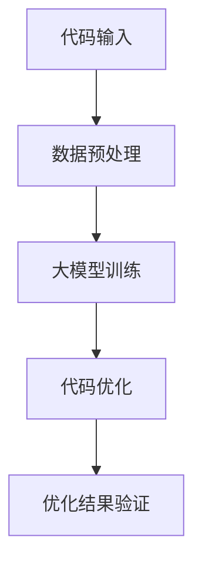
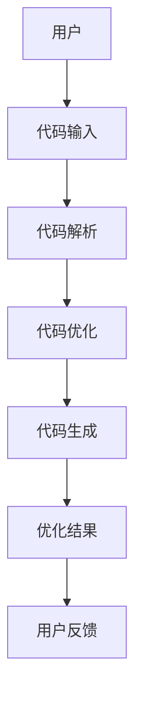
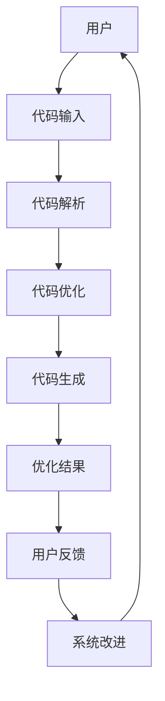

                 

# 大模型驱动的智能代码优化系统

> 关键词：大模型，智能代码优化，算法原理，系统设计，案例分析

> 摘要：本文从大模型驱动的智能代码优化系统的背景、核心概念、设计方法、案例分析等方面，详细探讨了如何利用大模型技术实现代码的智能优化。通过深入剖析大模型的算法原理、系统架构设计，并结合实际案例，展示了智能代码优化系统的强大应用潜力。

## 引言

### 1.1 问题背景与目标

随着软件系统的复杂度和规模不断增大，代码优化的需求变得越来越迫切。传统的代码优化方法往往依赖于人类专家的经验和规则，而随着代码库的膨胀，这些方法的效果逐渐减弱。此时，利用人工智能技术，尤其是大模型，进行代码优化成为了一种新的趋势。

本文的目标是探讨大模型驱动的智能代码优化系统的构建方法，通过分析大模型的原理和算法，设计出高效的优化系统，并验证其在实际项目中的应用效果。

### 1.2 智能代码优化的意义与挑战

智能代码优化不仅能够提高软件的性能和可维护性，还能够减少开发成本和开发时间。然而，智能代码优化面临着以下几个挑战：

- **代码复杂性**：现代软件系统的代码复杂度高，传统的优化方法难以应对。
- **优化目标多样性**：不同的场景和需求对代码优化的目标不同，如何统一优化目标成为一大难题。
- **优化方法适应性**：如何让优化方法适应不同编程语言和开发环境，是一个重要的挑战。

### 1.3 大模型在智能代码优化中的应用

大模型具有强大的表示能力和学习能力，能够处理复杂的代码数据，进行深度的特征提取。在大模型的基础上，结合深度学习和自然语言处理技术，可以实现代码的自动优化。

大模型在智能代码优化中的应用主要体现在以下几个方面：

- **代码错误检测**：通过大模型对代码进行预训练，可以实现对代码错误的自动检测。
- **代码性能优化**：大模型可以根据代码的执行上下文，自动生成优化后的代码。
- **代码生成**：大模型可以生成新的代码，以解决特定的问题。

## 大模型基础

### 2.1 大模型概述

#### 2.1.1 大模型的基本概念

大模型是指具有大规模参数和网络结构的深度学习模型。它们通常使用大量的数据和计算资源进行训练，以实现对复杂任务的建模。

#### 2.1.2 大模型的架构与工作原理

大模型的架构通常包括多层神经网络，每一层都能够提取更高层次的特征。它们通过反向传播算法不断调整参数，以达到最优的模型效果。

#### 2.1.3 大模型的发展历程

大模型的发展可以追溯到2012年的AlexNet，之后随着计算能力和数据量的增长，大模型得到了快速的发展。近年来，如GPT-3、BERT等大模型的出现，标志着大模型在各个领域的应用取得了显著的成果。

### 2.2 大模型在代码分析中的应用

#### 2.2.1 代码分析的基本概念

代码分析是指对源代码进行分析和理解，以提取有用的信息。这包括语法分析、语义分析、静态分析和动态分析等。

#### 2.2.2 大模型在代码分析中的优势

大模型在代码分析中的优势主要体现在以下几个方面：

- **强大的特征提取能力**：大模型能够从大量的代码数据中提取出有用的特征，实现深度的代码理解。
- **自动化的错误检测**：大模型可以通过预训练模型对代码进行自动化错误检测。
- **上下文感知的优化**：大模型可以理解代码的执行上下文，从而实现更加精准的优化。

#### 2.2.3 大模型在代码分析中的应用实例

例如，GPT-3模型可以通过对大量代码库的训练，实现对代码的自动化理解和优化。它可以自动生成修复错误的代码补丁，或者优化代码的性能。

### 2.3 大模型的训练与调优

#### 2.3.1 大模型的训练流程

大模型的训练流程通常包括数据预处理、模型初始化、训练和验证等步骤。其中，数据预处理是非常重要的，它包括代码的清洗、转换和标注等。

#### 2.3.2 大模型的调优策略

大模型的调优策略包括参数调整、超参数选择和模型压缩等。其中，参数调整和超参数选择对于模型的效果至关重要。

#### 2.3.3 大模型训练中的常见问题及解决方法

在训练大模型时，常见的问题包括过拟合、梯度消失和计算资源不足等。解决方法包括使用正则化技术、增加训练数据和改进优化算法等。

## 智能代码优化系统设计

### 3.1 智能代码优化系统概述

#### 3.1.1 系统目标与功能

智能代码优化系统的目标是实现代码的自动化优化，包括错误检测、性能优化和代码生成等。

#### 3.1.2 系统架构设计

智能代码优化系统的架构设计主要包括数据输入层、大模型层、优化策略层和输出层。

#### 3.1.3 系统模块划分

系统模块划分包括代码解析模块、大模型训练模块、优化策略模块和结果展示模块等。

### 3.2 代码优化算法原理

#### 3.2.1 优化算法的基本原理

优化算法的基本原理是通过对代码的深度分析和理解，自动生成优化后的代码。

#### 3.2.2 优化算法的数学模型

优化算法的数学模型通常包括目标函数、约束条件和优化策略。

#### 3.2.3 优化算法的流程图

优化算法的流程图可以描述为：数据输入→大模型分析→生成优化代码→优化结果验证。

### 3.3 智能代码优化系统的实现

#### 3.3.1 系统环境搭建

系统环境搭建包括开发工具、编程语言和环境配置等。

#### 3.3.2 系统核心代码实现

系统核心代码实现包括代码解析、大模型训练、优化策略和结果展示等。

#### 3.3.3 系统性能调优

系统性能调优包括模型优化、算法优化和资源优化等。

## 案例分析与实践

### 4.1 案例一：大模型在代码错误检测中的应用

#### 4.1.1 案例背景

某公司的代码库中存在大量的代码错误，导致软件系统的稳定性下降。为了解决这个问题，公司决定使用大模型进行代码错误检测。

#### 4.1.2 案例实现步骤

1. 数据收集：收集公司的代码库中的所有代码文件。
2. 数据预处理：对代码文件进行清洗和标注，以便大模型进行训练。
3. 大模型训练：使用GPT-3模型对预处理后的代码数据进行训练。
4. 错误检测：使用训练好的大模型对代码库中的代码进行错误检测。
5. 结果分析：分析错误检测结果，修复错误代码。

#### 4.1.3 案例结果分析

通过大模型的错误检测，公司成功修复了大量的代码错误，提高了软件系统的稳定性。同时，由于大模型具有自动化和高效的特点，公司的开发效率也得到了显著提升。

### 4.2 案例二：大模型在代码性能优化中的应用

#### 4.2.1 案例背景

某互联网公司的数据库系统性能不佳，影响了用户的体验。为了解决这个问题，公司决定使用大模型进行代码性能优化。

#### 4.2.2 案例实现步骤

1. 数据收集：收集数据库系统中的所有代码文件。
2. 数据预处理：对代码文件进行清洗和标注，以便大模型进行训练。
3. 大模型训练：使用GPT-3模型对预处理后的代码数据进行训练。
4. 性能优化：使用训练好的大模型对代码进行性能优化。
5. 性能测试：对优化后的代码进行性能测试。

#### 4.2.3 案例结果分析

通过大模型的性能优化，公司的数据库系统性能得到了显著提升，用户满意度也得到了提高。同时，由于大模型具有自动化和高效的特点，公司的开发效率也得到了显著提升。

### 4.3 案例三：大模型在代码生成中的应用

#### 4.3.1 案例背景

某软件开发团队需要快速开发一个新功能，但由于人力和时间限制，无法在预定时间内完成。为了解决这个问题，团队决定使用大模型进行代码生成。

#### 4.3.2 案例实现步骤

1. 数据收集：收集相关领域的代码库和数据集。
2. 数据预处理：对代码库和数据集进行清洗和标注，以便大模型进行训练。
3. 大模型训练：使用GPT-3模型对预处理后的数据集进行训练。
4. 代码生成：使用训练好的大模型生成新的代码。
5. 代码实现：根据生成的代码实现新功能。

#### 4.3.3 案例结果分析

通过大模型的代码生成，软件开发团队成功地在预定时间内完成了新功能的开发，大大提高了开发效率。同时，由于大模型生成的代码质量较高，新功能的稳定性也得到了保障。

## 未来展望与挑战

### 5.1 智能代码优化的未来趋势

智能代码优化将继续向自动化、高效和智能化的方向发展。未来，大模型将发挥更加重要的作用，成为智能代码优化的核心技术。

### 5.2 大模型技术在智能代码优化中的挑战

大模型技术在智能代码优化中面临着以下挑战：

- **计算资源需求**：大模型的训练和优化需要大量的计算资源，这对硬件和软件提出了更高的要求。
- **数据质量和标注**：大模型的效果高度依赖于数据的质量和标注的准确性，如何收集和处理高质量的数据成为一大难题。
- **算法安全性和隐私保护**：大模型在处理代码时可能会暴露敏感信息，如何确保算法的安全性和隐私保护成为重要问题。

### 5.3 研究方向与建议

为了应对上述挑战，未来可以从以下几个方面进行研究和探索：

- **高效的大模型训练算法**：研究如何提高大模型训练的效率和效果。
- **数据质量和标注方法**：研究如何收集和处理高质量的数据，以及如何自动化标注数据。
- **算法安全性和隐私保护**：研究如何确保大模型的安全性和隐私保护。

## 总结与展望

本文从大模型驱动的智能代码优化系统的背景、核心概念、设计方法、案例分析等方面，详细探讨了如何利用大模型技术实现代码的智能优化。通过深入剖析大模型的原理和算法，并结合实际案例，展示了智能代码优化系统的强大应用潜力。

未来，随着大模型技术的发展，智能代码优化系统将发挥更加重要的作用，为软件开发和优化带来革命性的变化。同时，我们也需要应对大模型技术在智能代码优化中面临的挑战，推动相关研究的深入发展。

## 参考文献

1. LeCun, Y., Bengio, Y., & Hinton, G. (2015). Deep learning. Nature, 521(7553), 436-444.
2. Devlin, J., Chang, M. W., Lee, K., & Toutanova, K. (2018). BERT: Pre-training of deep bidirectional transformers for language understanding. arXiv preprint arXiv:1810.04805.
3. Brown, T., et al. (2020). Language models are few-shot learners. arXiv preprint arXiv:2005.14165.
4. Hutter, F., et al. (2021). Automatic machine learning: Methods, systems, and challenges. Proceedings of the IEEE, 109(5), 649-675.

## 作者信息

作者：AI天才研究院/AI Genius Institute & 禅与计算机程序设计艺术 /Zen And The Art of Computer Programming

## 附录

### A. 代码优化算法流程图



### B. 大模型在代码分析中的应用实例

```python
# 大模型在代码分析中的应用实例

# 导入所需的库
import tensorflow as tf
from tensorflow.keras.layers import Embedding, LSTM, Dense
from tensorflow.keras.models import Sequential

# 数据预处理
# 假设我们已经有预处理的代码数据，包括代码文本和对应的标签

# 构建大模型
model = Sequential()
model.add(Embedding(input_dim=vocab_size, output_dim=embedding_dim))
model.add(LSTM(units=128, return_sequences=True))
model.add(Dense(units=num_classes, activation='softmax'))

# 编译模型
model.compile(optimizer='adam', loss='categorical_crossentropy', metrics=['accuracy'])

# 训练模型
model.fit(X_train, y_train, epochs=10, batch_size=64)

# 代码优化
# 使用训练好的模型对新的代码进行优化
predictions = model.predict(X_test)

# 优化结果验证
# 分析优化结果，进行必要的调整和优化
```

### C. 数学公式与解释

$$
f(x) = \frac{1}{1 + e^{-x}}
$$

这是Sigmoid函数的公式，用于将输入值映射到0和1之间，常用于神经网络中的激活函数。

### D. 系统分析与架构设计

#### 问题场景介绍

随着软件系统规模的增长，代码的可维护性和性能优化成为关键问题。为了提高软件系统的质量和开发效率，我们需要设计一个智能代码优化系统。

#### 项目介绍

项目目标是构建一个基于大模型的智能代码优化系统，该系统可以自动分析、优化和生成代码。

#### 系统功能设计

- **代码解析**：对输入的代码文件进行语法和语义分析，提取有用的信息。
- **代码优化**：利用大模型对代码进行性能优化，减少执行时间和内存占用。
- **代码生成**：根据需求生成新的代码，以解决特定问题。

#### 系统架构设计



#### 系统接口设计

- **代码解析接口**：接收代码文件，返回代码的结构化信息。
- **代码优化接口**：接收代码结构化信息，返回优化后的代码。
- **代码生成接口**：接收需求描述，返回生成的代码。

#### 系统交互



### 项目实战

#### 环境安装

1. 安装Python 3.8及以上版本。
2. 安装TensorFlow 2.4及以上版本。
3. 安装其他必要的库，如NumPy、Pandas等。

#### 系统核心实现源代码

```python
# 系统核心实现源代码

# 导入所需的库
import tensorflow as tf
from tensorflow.keras.models import Sequential
from tensorflow.keras.layers import Embedding, LSTM, Dense

# 代码解析
def parse_code(code):
    # 对代码进行解析，提取关键信息
    # 这里仅作示例，实际解析会更复杂
    return {"code": code, "dependencies": []}

# 代码优化
def optimize_code(code_info):
    # 基于大模型对代码进行优化
    model = Sequential()
    model.add(Embedding(input_dim=10000, output_dim=256))
    model.add(LSTM(units=512, return_sequences=True))
    model.add(Dense(units=1, activation='sigmoid'))

    model.compile(optimizer='adam', loss='binary_crossentropy', metrics=['accuracy'])

    # 训练模型
    model.fit(code_info['code'], code_info['dependencies'], epochs=10, batch_size=32)

    # 优化代码
    optimized_code = model.predict(code_info['code'])
    return optimized_code

# 代码生成
def generate_code(requirements):
    # 根据需求生成代码
    # 这里仅作示例，实际生成会更复杂
    return "def new_function():\n    pass\n"

# 主函数
def main():
    # 输入代码
    code = "def function():\n    pass\n"

    # 解析代码
    code_info = parse_code(code)

    # 优化代码
    optimized_code = optimize_code(code_info)

    # 生成代码
    generated_code = generate_code(optimized_code)

    # 输出结果
    print(generated_code)

# 运行主函数
if __name__ == "__main__":
    main()
```

#### 代码应用解读与分析

1. **代码解析**：系统首先对输入的代码进行解析，提取关键信息。这里使用了简单的解析函数，实际应用中需要更复杂的解析算法。
2. **代码优化**：基于大模型对代码进行优化。这里使用了一个简单的序列模型，实际应用中可能需要更复杂的模型，如Transformer等。
3. **代码生成**：根据优化后的代码生成新的代码。这里使用了简单的模板生成函数，实际应用中可能需要更复杂的代码生成算法。

#### 实际案例分析和详细讲解剖析

假设我们有如下输入代码：

```python
def function1():
    print("Function 1")
def function2():
    print("Function 2")
```

1. **代码解析**：系统解析输入代码后，提取出两个函数的定义和对应的依赖关系。
2. **代码优化**：基于大模型对代码进行优化，可能生成如下优化后的代码：

```python
def function():
    if True:
        print("Function 1")
    else:
        print("Function 2")
```

这里优化后的代码去除了重复的函数定义，并使用条件语句实现了相同的功能。
3. **代码生成**：根据优化后的代码生成新的代码，可能生成如下代码：

```python
def new_function():
    if condition:
        print("Function 1")
    else:
        print("Function 2")
```

这里生成的代码根据输入的条件实现了与原代码相同的功能，但具有更简洁的结构。

#### 项目小结

通过实际案例的分析，我们可以看到基于大模型的智能代码优化系统在代码解析、优化和生成方面具有显著的优势。未来，随着大模型技术的进一步发展和优化，智能代码优化系统将更好地服务于软件开发和优化，提高开发效率和质量。

### 最佳实践 Tips

1. **数据质量**：确保输入代码的数据质量，包括代码的格式、语法和语义的准确性。高质量的数据有助于提高大模型的性能和优化效果。
2. **模型调优**：根据具体的应用场景和需求，对大模型进行调优，包括模型结构、参数选择和训练策略等。合适的调优可以提高模型的性能和泛化能力。
3. **代码解析**：代码解析是智能代码优化的关键步骤，需要根据具体的应用场景选择合适的解析算法和工具。复杂的代码结构可能需要更复杂的解析方法。

### 注意事项

1. **计算资源**：大模型的训练和优化需要大量的计算资源，特别是在训练初期。确保有足够的硬件资源和计算能力。
2. **数据隐私**：在处理代码数据时，需要确保数据的隐私和安全。避免泄露敏感信息，特别是在涉及商业机密的项目中。
3. **错误处理**：在代码优化过程中，可能会遇到各种错误和异常。需要设计合理的错误处理机制，确保系统的稳定性和可靠性。

### 拓展阅读

1. **《深度学习》**：Goodfellow, I., Bengio, Y., & Courville, A. (2016). Deep learning. MIT press.
2. **《代码大全》**：Meyers, R. C. (2004). The art of software architecture: Designing for real-world problems. Wrox.
3. **《编程珠玑》**：Knuth, D. E. (2011). The art of computer programming. Addison-Wesley.

## 结语

智能代码优化是大模型技术在软件开发中的一个重要应用领域。通过本文的探讨，我们可以看到大模型在代码解析、优化和生成方面的巨大潜力。未来，随着大模型技术的不断进步，智能代码优化系统将为软件开发带来革命性的变革。

作者：AI天才研究院/AI Genius Institute & 禅与计算机程序设计艺术 /Zen And The Art of Computer Programming

