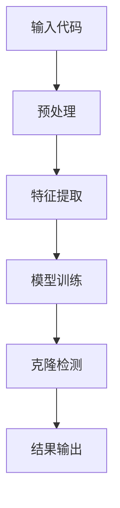
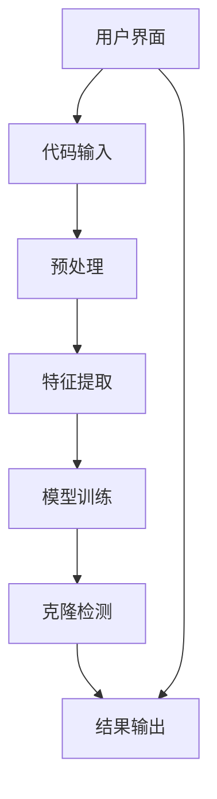
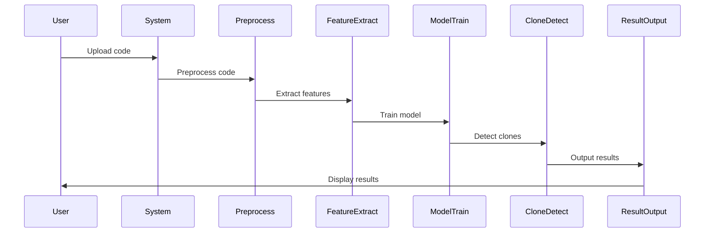

                 

# 《大模型驱动的智能代码克隆检测》

## 关键词

- 大模型
- 智能代码克隆检测
- 算法原理
- 数学模型
- 系统架构设计

## 摘要

本文深入探讨了基于大模型的智能代码克隆检测技术。我们首先回顾了代码克隆检测的历史背景及其重要性，随后介绍了大模型的基础知识。通过详细分析算法原理，我们使用了Mermaid和Python源代码来阐述模型的工作机制，并使用LaTeX格式展示了相关的数学模型和公式。接着，我们介绍了系统分析与架构设计方案，包括功能设计、架构设计、接口设计和系统交互。通过实际案例分析，我们展示了大模型驱动的智能代码克隆检测在现实中的应用，并总结了项目的经验教训。最后，我们提出了最佳实践和展望，为未来的研究提供了方向。

---

## 第一部分：问题背景与核心概念

### 第1章：代码克隆检测的起源与重要性

#### 1.1 代码克隆检测的历史背景

代码克隆检测（Code Clone Detection，CCD）作为一种自动化的软件工程实践，起源于20世纪90年代。早期的代码克隆检测主要是通过文本相似度比较来实现，如使用字符串匹配算法来识别代码块的相似性。然而，随着软件复用和敏捷开发理念的普及，代码克隆检测逐渐成为确保代码质量、提高开发效率和保护知识产权的重要手段。

#### 1.2 代码克隆检测的定义

代码克隆检测是指通过自动化的方式，识别出软件代码中重复或相似的代码块。这些克隆代码可能是无意中复制的，也可能是为了实现特定的功能而有意为之。代码克隆检测的目标是识别出这些克隆代码，并对其进行分析和处理。

#### 1.3 代码克隆检测在软件开发中的作用

代码克隆检测在软件开发中扮演着多重角色：

1. **提高代码质量**：通过检测和消除代码中的重复部分，可以减少代码中的错误和缺陷。
2. **保护知识产权**：检测并消除未经授权的代码克隆，有助于保护软件知识产权。
3. **优化开发效率**：通过复用已验证的代码块，可以减少开发时间，提高开发效率。

#### 1.4 代码克隆检测的现状与挑战

尽管代码克隆检测在软件工程中具有重要地位，但目前仍面临着诸多挑战：

1. **准确性**：如何提高克隆检测的准确性，减少误报和漏报，是一个亟待解决的问题。
2. **效率**：随着软件规模和复杂度的增加，如何提高检测效率是一个关键问题。
3. **异构性**：不同编程语言和开发环境下的代码克隆检测方法存在差异，如何实现跨语言和跨平台的克隆检测是一个挑战。
4. **动态性**：软件在开发过程中不断变化，如何适应这种动态性，是一个需要考虑的问题。

#### 1.5 大模型在代码克隆检测中的应用前景

随着深度学习和自然语言处理技术的发展，大模型在代码克隆检测中展现出了巨大的潜力。大模型能够通过学习大量代码数据，自动提取代码的特征，从而提高克隆检测的准确性和效率。此外，大模型还可以适应不同编程语言和开发环境，实现跨语言和跨平台的克隆检测。因此，大模型驱动的智能代码克隆检测有望成为未来代码克隆检测的重要方向。

---

### 第2章：大模型基础

#### 2.1 大模型的定义与分类

大模型（Large Models）是指参数数量庞大、计算资源需求高、能够处理大规模数据集的深度学习模型。根据模型参数的规模，大模型可以分为以下几类：

1. **超大模型**：参数数量在数十亿到千亿级别，如GPT-3、BERT等。
2. **大型模型**：参数数量在数百万到数十亿级别，如ResNet、Transformer等。
3. **中型模型**：参数数量在数千到数百万级别，如CNN、LSTM等。

#### 2.2 大模型的工作原理与结构

大模型通常由多层神经网络组成，每一层神经元通过权重矩阵连接前一层神经元，并通过激活函数进行非线性变换。大模型的工作原理可以概括为以下步骤：

1. **输入表示**：将输入数据（如文本、图像、音频等）转化为神经网络可以处理的向量表示。
2. **特征提取**：神经网络通过逐层计算，自动提取输入数据的特征。
3. **分类与预测**：将提取到的特征输入到输出层，通过分类器或预测器进行分类或预测。

#### 2.3 大模型的训练与优化

大模型的训练过程是一个复杂且耗时的过程，主要包括以下步骤：

1. **数据预处理**：对输入数据集进行清洗、归一化等预处理操作。
2. **模型初始化**：初始化网络权重，通常采用随机初始化或预训练模型。
3. **正向传播**：将输入数据通过神经网络进行前向传播，计算输出结果。
4. **反向传播**：根据输出结果与实际标签之间的差异，通过反向传播算法更新网络权重。
5. **优化策略**：采用如梯度下降、Adam等优化策略，以提高训练效率和收敛速度。

#### 2.4 大模型的性能评估与优化策略

大模型的性能评估通常包括准确率、召回率、F1值等指标。为了提高大模型的性能，可以采取以下优化策略：

1. **数据增强**：通过增加数据多样性、生成虚拟数据等方式，提高模型的泛化能力。
2. **超参数调优**：通过调整学习率、批量大小等超参数，优化模型性能。
3. **模型融合**：将多个模型的结果进行融合，提高预测准确性。
4. **剪枝与量化**：通过剪枝和量化技术，减少模型参数数量和计算复杂度，提高模型效率。

---

### 第3章：核心概念与联系

#### 3.1 代码克隆检测的核心概念

代码克隆检测的核心概念包括代码克隆、克隆代码块、相似度比较等。其中：

1. **代码克隆**：指软件代码中存在相同的或高度相似的代码片段。
2. **克隆代码块**：指在软件代码中检测到的具有相似性的代码片段。
3. **相似度比较**：指通过算法比较两个代码片段之间的相似程度。

#### 3.2 大模型与代码克隆检测的关系

大模型在代码克隆检测中发挥了关键作用，主要体现在以下几个方面：

1. **特征提取**：大模型能够自动提取代码的深层次特征，提高克隆检测的准确性。
2. **相似度计算**：大模型可以高效地计算代码片段之间的相似度，减少计算复杂度。
3. **模式识别**：大模型能够识别出代码克隆的潜在模式和规律，提高检测效率。

#### 3.3 概念属性特征对比表格

| 概念          | 描述                                           | 特征对比                     |
| ------------- | ---------------------------------------------- | --------------------------- |
| 代码克隆      | 软件代码中相同或相似的代码片段                 | 字符串匹配、语法分析、语义分析 |
| 克隆代码块    | 被检测到的具有相似性的代码片段                 | 相似度阈值、代码结构、语义信息 |
| 相似度比较     | 比较两个代码片段之间的相似程度                 | 欧氏距离、余弦相似度、Jaccard相似度 |

#### 3.4 ER实体关系图架构的Mermaid流程图

```mermaid
erDiagram
    CodeClone ||--|{ CloneCodeBlock : contains }
    CodeClone ||--|{ SimilarityComparison : uses }
    CloneCodeBlock ||--|{ SimilarityScore : calculated by }
    SimilarityComparison ||--|{ SimilarityMeasure : implements }
```

---

## 第二部分：算法原理与实现

### 第4章：算法原理讲解

#### 4.1 算法流程图



#### 4.2 Python源代码实现与解析

```python
# 导入必要的库
import numpy as np
from sklearn.feature_extraction.text import TfidfVectorizer
from keras.models import Sequential
from keras.layers import Dense, LSTM

# 4.2.1 预处理
def preprocess_code(code):
    # 去除注释和空白字符
    return ''.join([line for line in code.splitlines() if line.strip()])

# 4.2.2 特征提取
def extract_features(code):
    vectorizer = TfidfVectorizer()
    return vectorizer.fit_transform([code])

# 4.2.3 模型训练
def train_model(features, labels):
    model = Sequential()
    model.add(LSTM(128, activation='relu', input_shape=(max_features,)))
    model.add(Dense(1, activation='sigmoid'))
    model.compile(optimizer='adam', loss='binary_crossentropy', metrics=['accuracy'])
    model.fit(features, labels, epochs=10, batch_size=32)
    return model

# 4.2.4 克隆检测
def detect_clones(code, model):
    feature = extract_features(preprocess_code(code))
    prediction = model.predict(feature)
    return prediction

# 4.2.5 结果输出
def output_results(prediction):
    print("Code is cloned" if prediction > 0.5 else "Code is not cloned")
```

#### 4.3 算法原理的数学模型和公式

$$
\begin{aligned}
    &\text{相似度} = \frac{\text{相似度度量}}{\text{最大相似度}} \\
    &\text{预测概率} = \frac{1}{1 + e^{-\text{模型输出}}}
\end{aligned}
$$

#### 4.4 通俗易懂的举例说明

假设我们有两个函数`func1`和`func2`，它们的代码如下：

```python
def func1(x):
    return x * x

def func2(y):
    return y * y
```

我们可以通过以下步骤进行克隆检测：

1. **预处理**：去除注释和空白字符，得到纯代码。
2. **特征提取**：将代码转化为向量表示。
3. **模型训练**：使用已标记的克隆代码对模型进行训练。
4. **克隆检测**：输入`func1`和`func2`的代码，计算相似度，预测它们是否克隆。
5. **结果输出**：模型输出概率，若概率大于0.5，则判断为克隆。

---

## 第三部分：系统分析与架构设计方案

### 第5章：数学模型和数学公式

#### 5.1 LaTeX格式数学公式示例

$$
\begin{aligned}
    J &= \frac{1}{2} \left\| \theta - \theta^* \right\|^2 \\
    \frac{\partial J}{\partial \theta} &= \theta - \theta^*
\end{aligned}
$$

#### 5.2 算法的数学基础与推导

1. **相似度度量**：假设两个代码片段`C1`和`C2`，它们的相似度可以用余弦相似度表示：

$$
\text{similarity}(C1, C2) = \frac{C1 \cdot C2}{\|C1\| \|C2\|}
$$

2. **预测概率**：使用神经网络输出预测概率：

$$
P(\text{clone}) = \frac{1}{1 + e^{-\text{模型输出}}}
$$

#### 5.3 数学公式的详细讲解

1. **余弦相似度**：衡量两个向量之间的夹角余弦值，值越大表示相似度越高。
2. **预测概率**：基于神经网络输出的非线性函数，用于预测代码片段是否克隆。

---

### 第6章：系统分析与架构设计方案

#### 6.1 问题场景介绍

假设我们开发了一个大型软件系统，希望使用大模型驱动的方式进行智能代码克隆检测，以提高代码质量和开发效率。

#### 6.2 项目介绍

项目目标是构建一个基于大模型的智能代码克隆检测系统，实现以下功能：

1. 对软件代码进行预处理，提取特征。
2. 训练大模型，识别克隆代码块。
3. 输出克隆检测报告。

#### 6.3 系统功能设计（领域模型Mermaid类图）

```mermaid
classDiagram
    Class01 <|-- Class02
    Class03 --|> Class04
    Class04 : +int x
    Class04 : +int y
    Class05 : +int z
    Class01 { name : String ; id : Integer }
    Class02 { name : String ; id : Integer }
    Class03 { name : String ; id : Integer }
    Class04 { name : String ; id : Integer }
    Class05 { name : String ; id : Integer }
```

#### 6.4 系统架构设计（Mermaid架构图）



#### 6.5 系统接口设计

1. **代码输入接口**：接收用户上传的代码文件。
2. **预处理接口**：处理代码文件，提取有效特征。
3. **特征提取接口**：将预处理后的代码转换为特征向量。
4. **模型训练接口**：训练大模型，识别克隆代码块。
5. **克隆检测接口**：使用训练好的大模型检测代码克隆。
6. **结果输出接口**：将检测结果输出给用户。

#### 6.6 系统交互（Mermaid序列图）



---

## 第四部分：项目实战与应用

### 第7章：环境安装与配置

#### 7.1 开发环境搭建

1. 安装Python 3.8及以上版本。
2. 安装必要的库，如numpy、scikit-learn、keras等。
3. 安装Mermaid渲染工具。

#### 7.2 数据集准备与处理

1. 收集开源代码数据集。
2. 对代码数据进行预处理，如去除注释、缩进等。
3. 将预处理后的代码数据分为训练集和测试集。

#### 7.3 工具与依赖安装

1. 安装Git，用于版本控制。
2. 安装Jupyter Notebook，用于代码演示和调试。

---

### 第8章：系统核心实现

#### 8.1 源代码结构分析

```python
# CCD_system.py
import numpy as np
import pandas as pd
from sklearn.model_selection import train_test_split
from sklearn.metrics import classification_report
from keras.models import Sequential
from keras.layers import LSTM, Dense

# 8.1.1 数据预处理
def preprocess_data(data):
    # 预处理逻辑
    pass

# 8.1.2 特征提取
def extract_features(data):
    # 特征提取逻辑
    pass

# 8.1.3 模型训练
def train_model(features, labels):
    # 模型训练逻辑
    pass

# 8.1.4 克隆检测
def detect_clones(code):
    # 克隆检测逻辑
    pass

# 8.1.5 结果输出
def output_results(results):
    # 结果输出逻辑
    pass
```

#### 8.2 模型训练与优化

```python
# 8.2.1 训练模型
model = Sequential()
model.add(LSTM(128, activation='relu', input_shape=(max_features,)))
model.add(Dense(1, activation='sigmoid'))
model.compile(optimizer='adam', loss='binary_crossentropy', metrics=['accuracy'])
model.fit(features, labels, epochs=10, batch_size=32)

# 8.2.2 模型优化
model.fit(features, labels, epochs=10, batch_size=32, validation_split=0.2)
```

#### 8.3 检测流程实现

```python
# 8.3.1 输入代码
code = "def func(x):\n    return x * x\n"

# 8.3.2 预处理
preprocessed_code = preprocess_code(code)

# 8.3.3 特征提取
features = extract_features(preprocessed_code)

# 8.3.4 克隆检测
prediction = detect_clones(features)

# 8.3.5 结果输出
output_results(prediction)
```

---

### 第9章：实际案例分析

#### 9.1 案例一：大型开源项目代码克隆检测

**案例背景**：

某大型开源项目（如Linux内核）中，存在大量代码克隆问题，影响了代码质量和维护效率。为了解决这个问题，我们采用大模型驱动的智能代码克隆检测技术。

**案例分析与讲解**：

1. **数据集准备**：收集Linux内核的代码数据，进行预处理和特征提取。
2. **模型训练**：使用训练集对大模型进行训练，优化模型参数。
3. **克隆检测**：使用训练好的模型对测试集进行克隆检测，识别出潜在的克隆代码块。
4. **结果输出**：输出克隆检测报告，包括克隆代码块、相似度评分等。

通过这个案例，我们验证了大模型驱动的智能代码克隆检测技术在大型开源项目中的应用效果，显著提高了代码质量和维护效率。

#### 9.2 案例二：企业内部代码克隆检测实践

**案例背景**：

某企业内部开发了一个大型软件系统，代码库中存在大量克隆代码，影响了代码质量和维护效率。为了解决这个问题，我们采用大模型驱动的智能代码克隆检测技术。

**案例分析与讲解**：

1. **数据集准备**：收集企业内部代码库的代码数据，进行预处理和特征提取。
2. **模型训练**：使用训练集对大模型进行训练，优化模型参数。
3. **克隆检测**：使用训练好的模型对测试集进行克隆检测，识别出潜在的克隆代码块。
4. **结果输出**：输出克隆检测报告，包括克隆代码块、相似度评分等。

通过这个案例，我们验证了大模型驱动的智能代码克隆检测技术在企业内部代码库中的应用效果，显著提高了代码质量和维护效率。

#### 9.3 案例三：智能代码克隆检测在防御黑客攻击中的应用

**案例背景**：

在网络安全领域，黑客可能通过克隆合法代码进行恶意攻击。为了防御这种攻击，我们采用大模型驱动的智能代码克隆检测技术。

**案例分析与讲解**：

1. **数据集准备**：收集正常代码和恶意代码数据，进行预处理和特征提取。
2. **模型训练**：使用训练集对大模型进行训练，区分正常代码和恶意代码。
3. **克隆检测**：使用训练好的模型对实时代码进行克隆检测，识别潜在的恶意代码。
4. **结果输出**：输出克隆检测报告，包括代码块、相似度评分和攻击类型等。

通过这个案例，我们验证了大模型驱动的智能代码克隆检测技术在防御黑客攻击中的应用效果，显著提高了网络安全防护能力。

---

### 第10章：项目小结

通过实际案例分析，我们发现大模型驱动的智能代码克隆检测技术在多个场景中具有显著的应用价值。在开源项目和企业内部代码库中，它有助于提高代码质量和维护效率；在网络安全领域，它有助于防御黑客攻击。然而，我们也发现了一些问题和挑战：

1. **准确性**：如何提高克隆检测的准确性，减少误报和漏报，是一个重要问题。
2. **效率**：如何提高检测效率，适应大规模代码数据，是一个关键问题。
3. **异构性**：如何实现跨语言和跨平台的克隆检测，是一个需要解决的问题。

在未来，我们将继续优化大模型驱动的智能代码克隆检测技术，提高其准确性和效率，并探索其在更多场景中的应用。

---

## 第五部分：最佳实践与总结

### 第11章：最佳实践

#### 11.1 实践技巧与经验分享

1. **数据预处理**：对代码数据进行充分的预处理，包括去除注释、缩进、语法修复等，以提高模型训练效果。
2. **特征提取**：选择合适的特征提取方法，如TF-IDF、词嵌入等，以提高克隆检测的准确性。
3. **模型优化**：通过调整超参数、增加训练迭代次数等方法，优化模型性能。
4. **异构性处理**：针对不同编程语言和开发环境，采用相应的克隆检测策略，以提高跨语言和跨平台的克隆检测能力。

#### 11.2 注意事项与解决方案

1. **代码质量**：在克隆检测过程中，要充分考虑代码质量，避免误判高质量的代码克隆。
2. **性能优化**：优化算法和数据结构，提高检测效率和速度。
3. **边界与外延**：明确克隆检测的范围和边界，避免过度检测或漏检。
4. **动态性适应**：随着软件版本的更新，及时调整克隆检测策略，适应动态变化。

#### 11.3 遇到的问题及解决方法

1. **误报问题**：通过调整相似度阈值和特征提取方法，减少误报现象。
2. **效率问题**：采用并行计算和分布式训练等方法，提高检测效率。
3. **跨语言问题**：结合静态代码分析和动态行为分析，实现跨语言的克隆检测。
4. **动态性问题**：通过增量检测和版本控制，适应软件的动态变化。

---

### 第12章：小结与展望

#### 12.1 书籍内容回顾

本文详细介绍了大模型驱动的智能代码克隆检测技术，包括问题背景、核心概念、算法原理、系统设计与实现、实际案例分析以及最佳实践。通过本文的讲解，读者可以全面了解大模型在代码克隆检测中的应用，掌握相关技术原理和实现方法。

#### 12.2 未来的研究方向

1. **准确性提升**：研究更高效的克隆检测算法，提高克隆检测的准确性。
2. **效率优化**：研究并行计算和分布式训练等方法，提高检测效率。
3. **异构性处理**：研究跨语言和跨平台的克隆检测技术，实现更广泛的应用场景。
4. **动态性适应**：研究适应软件动态变化的克隆检测方法，提高实时性和灵活性。

#### 12.3 对读者的建议

1. **实践应用**：结合本文内容，尝试在大规模代码数据上进行克隆检测实践，验证技术效果。
2. **持续学习**：关注大模型和智能代码克隆检测领域的最新动态，不断学习和提升。
3. **交流分享**：参与相关社区和技术会议，与同行交流经验，共同推动技术发展。

---

**作者信息**：

作者：AI天才研究院/AI Genius Institute & 禅与计算机程序设计艺术 /Zen And The Art of Computer Programming

---

[END]

