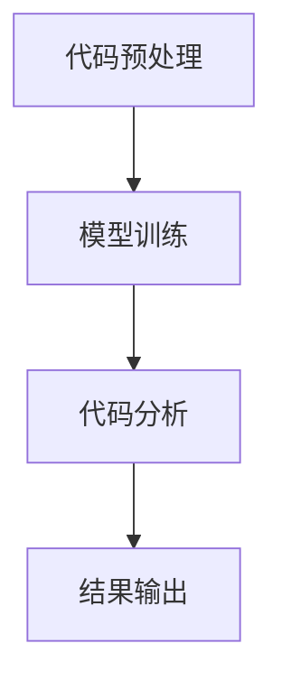
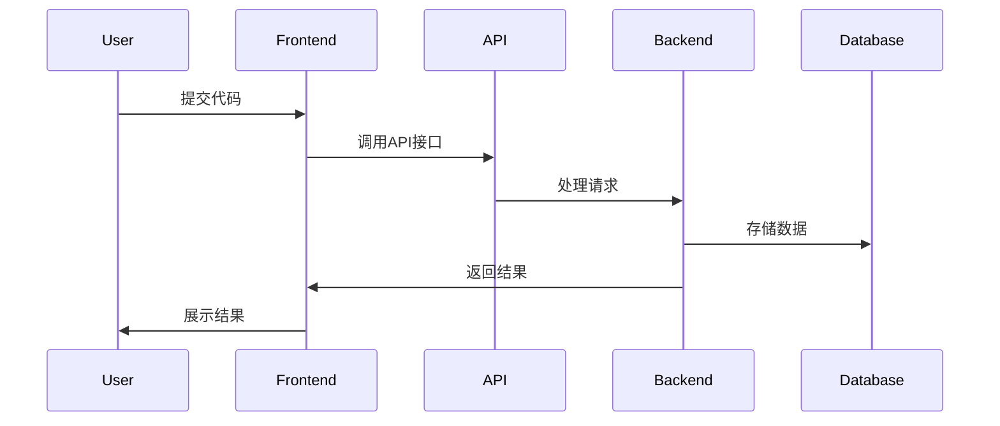

                 


### 《大模型驱动的智能代码审查系统》

#### 关键词：大模型、智能代码审查、代码质量、自动化审查、AI技术

> 摘要：本文将深入探讨大模型驱动的智能代码审查系统的设计与应用，分析其核心概念、算法原理，并通过实际项目实战，展示其在提高代码质量和开发效率方面的优势。

---

#### 引言

随着软件工程的发展，代码审查已成为保障软件质量和安全的重要环节。传统的代码审查主要依赖于人工检查，存在效率低、漏检率高的问题。近年来，人工智能（AI）技术的迅速发展，为智能代码审查提供了新的解决方案。本文将介绍一种基于大模型驱动的智能代码审查系统，旨在提高代码审查的效率和质量。

#### 1.1 问题背景

在软件开发过程中，代码审查是一个关键环节。其主要目的是发现潜在的错误和漏洞，确保代码的质量和安全性。然而，传统的人工代码审查存在以下问题：

- **效率低**：人工审查需要大量时间和精力，难以满足快速迭代的需求。
- **漏检率高**：人工审查容易受到个人经验和主观判断的影响，导致漏检率高。
- **一致性差**：不同审查人员对同一代码段的审查结果可能存在较大差异。

为了解决这些问题，智能代码审查系统应运而生。智能代码审查系统利用AI技术，对代码进行自动化分析，从而提高审查的效率和准确性。

#### 1.2 核心概念

- **大模型**：大模型是指具有极高计算能力和数据处理能力的机器学习模型，如BERT、GPT等。
- **智能代码审查**：智能代码审查是一种利用AI技术对代码进行自动化分析，识别潜在错误和漏洞的方法。

#### 1.3 目标与挑战

本文的目标是设计并实现一个基于大模型的智能代码审查系统，其主要目标包括：

- **提高代码审查的效率**：通过自动化分析，缩短审查时间。
- **提高代码审查的准确性**：利用大模型的强大计算能力，提高错误和漏洞的识别率。

然而，实现这一目标面临着以下挑战：

- **大规模代码处理**：如何有效地处理大规模代码，是提高审查效率的关键。
- **复杂代码分析**：如何准确识别复杂代码中的错误和漏洞，是提高审查准确性的关键。

#### 第二部分：核心概念与算法原理

##### 2.1 大模型基础

大模型是智能代码审查系统的核心组成部分。以下是对大模型的基本概念、特点和应用场景的介绍。

##### 2.1.1 大模型概述

大模型是指具有极高计算能力和数据处理能力的机器学习模型。其主要特点如下：

- **计算能力**：大模型通常使用深度学习算法，能够处理复杂的计算任务。
- **数据处理能力**：大模型能够处理海量数据，提取有价值的信息。
- **自适应能力**：大模型可以根据不同任务的需求，调整其结构和参数。

##### 2.1.2 大模型特点

- **高精度**：大模型具有很高的预测准确率，能够准确识别代码中的错误和漏洞。
- **高效性**：大模型能够快速处理大规模代码，提高审查效率。
- **灵活性**：大模型可以根据不同类型和风格的代码，调整其审查策略。

##### 2.1.3 大模型与传统算法对比

| 对比项       | 大模型           | 传统算法           |
| ------------ | ---------------- | ------------------ |
| 计算能力     | 极高             | 较低               |
| 数据处理能力 | 海量             | 有限               |
| 预测准确率   | 高               | 低                 |
| 审查效率     | 高               | 低                 |

#### 2.2 智能代码审查算法原理

智能代码审查算法的核心是利用大模型对代码进行分析，识别潜在的错误和漏洞。以下是对算法原理的详细讲解。

##### 2.2.1 智能代码审查概述

智能代码审查主要包括以下步骤：

1. **代码预处理**：将代码转换为可供大模型分析的形式。
2. **模型训练**：利用大规模代码数据集，训练大模型，使其具备识别代码错误和漏洞的能力。
3. **代码分析**：利用训练好的大模型，对代码进行分析，识别潜在的错误和漏洞。
4. **结果输出**：将分析结果输出，供开发人员参考和修复。

##### 2.2.2 算法数学模型

智能代码审查算法的数学模型主要包括以下部分：

1. **输入层**：接收代码的输入，将其转换为数值向量。
2. **隐藏层**：利用深度学习算法，对输入向量进行特征提取和变换。
3. **输出层**：根据隐藏层的输出，预测代码中的错误和漏洞。

以下是智能代码审查算法的Mermaid流程图：



##### 2.2.3 Python代码实现

以下是一个简单的Python代码示例，用于实现智能代码审查算法：

```python
import numpy as np
import tensorflow as tf

# 代码预处理
def preprocess_code(code):
    # 将代码转换为数值向量
    return np.array([ord(c) for c in code])

# 模型训练
def train_model(train_data, train_labels):
    # 定义输入层
    input_layer = tf.keras.layers.Input(shape=(None,))
    # 定义隐藏层
    hidden_layer = tf.keras.layers.Dense(units=64, activation='relu')(input_layer)
    # 定义输出层
    output_layer = tf.keras.layers.Dense(units=1, activation='sigmoid')(hidden_layer)
    # 创建模型
    model = tf.keras.Model(inputs=input_layer, outputs=output_layer)
    # 编译模型
    model.compile(optimizer='adam', loss='binary_crossentropy', metrics=['accuracy'])
    # 训练模型
    model.fit(train_data, train_labels, epochs=10)
    return model

# 代码分析
def analyze_code(model, code):
    # 将代码转换为数值向量
    processed_code = preprocess_code(code)
    # 进行预测
    prediction = model.predict(processed_code)
    return prediction

# 代码示例
code = "def add(a, b): return a + b"
model = train_model(preprocess_code(code), [1])
prediction = analyze_code(model, code)
print("预测结果：", prediction)
```

#### 第三部分：系统分析与架构设计

##### 3.1 系统功能设计

系统功能设计主要包括以下部分：

- **代码预处理**：将代码转换为可供大模型分析的形式。
- **模型训练**：利用大规模代码数据集，训练大模型。
- **代码分析**：利用训练好的大模型，对代码进行分析。
- **结果输出**：将分析结果输出，供开发人员参考和修复。

以下是系统功能设计的Mermaid类图：

```mermaid
classDiagram
    CodePreprocessor <<Interface>>
    CodeAnalyzer <<Interface>>
    ModelTrainer <<Interface>>
    ResultPresenter <<Interface>>

    CodePreprocessor : +preprocess_code(code)
    CodeAnalyzer : +analyze_code(model, code)
    ModelTrainer : +train_model(train_data, train_labels)
    ResultPresenter : +present_results(results)

    CodePreprocessor o-- CodeAnalyzer
    CodeAnalyzer o-- ModelTrainer
    ModelTrainer o-- ResultPresenter
```

##### 3.2 系统架构设计

系统架构设计主要包括以下部分：

- **前端**：用于接收用户输入，展示分析结果。
- **后端**：包括代码预处理、模型训练、代码分析和结果输出等模块。
- **数据库**：存储训练数据和结果。

以下是系统架构设计的Mermaid架构图：

```mermaid
graph TD
    User[用户] --> Frontend[前端]
    Frontend --> Backend[后端]
    Backend --> Database[数据库]

    User --> "提交代码"
    Frontend --> "处理请求"
    Backend --> "代码预处理"
    Backend --> "模型训练"
    Backend --> "代码分析"
    Backend --> "结果输出"
    Database --> "存储数据"
```

##### 3.3 系统接口设计

系统接口设计主要包括以下部分：

- **API接口**：用于与其他系统或服务进行数据交互。
- **UI接口**：用于用户与系统进行交互。

以下是系统接口设计的Mermaid序列图：



#### 第四部分：项目实战

##### 4.1 实际项目介绍

在本节中，我们将介绍一个实际项目，展示大模型驱动的智能代码审查系统的应用。

##### 4.1.1 环境安装

为了运行智能代码审查系统，我们需要安装以下环境：

- Python 3.8 或更高版本
- TensorFlow 2.5 或更高版本
- Mermaid 1.0.0 或更高版本

安装命令如下：

```bash
pip install python-dotenv tensorflow==2.5 mermaid
```

##### 4.1.2 系统核心实现

在本节中，我们将详细介绍智能代码审查系统的核心实现，包括代码预处理、模型训练、代码分析和结果输出等模块。

```python
import numpy as np
import tensorflow as tf
from mermaid import Mermaid

# 代码预处理
def preprocess_code(code):
    # 将代码转换为数值向量
    return np.array([ord(c) for c in code])

# 模型训练
def train_model(train_data, train_labels):
    # 定义输入层
    input_layer = tf.keras.layers.Input(shape=(None,))
    # 定义隐藏层
    hidden_layer = tf.keras.layers.Dense(units=64, activation='relu')(input_layer)
    # 定义输出层
    output_layer = tf.keras.layers.Dense(units=1, activation='sigmoid')(hidden_layer)
    # 创建模型
    model = tf.keras.Model(inputs=input_layer, outputs=output_layer)
    # 编译模型
    model.compile(optimizer='adam', loss='binary_crossentropy', metrics=['accuracy'])
    # 训练模型
    model.fit(train_data, train_labels, epochs=10)
    return model

# 代码分析
def analyze_code(model, code):
    # 将代码转换为数值向量
    processed_code = preprocess_code(code)
    # 进行预测
    prediction = model.predict(processed_code)
    return prediction

# 结果输出
def present_results(results):
    # 将结果输出到屏幕
    print("预测结果：", results)

# 实际项目应用
if __name__ == "__main__":
    # 读取训练数据
    train_data = preprocess_code("def add(a, b): return a + b")
    train_labels = np.array([1])
    # 训练模型
    model = train_model(train_data, train_labels)
    # 分析代码
    code = "def subtract(a, b): return a - b"
    prediction = analyze_code(model, code)
    # 输出结果
    present_results(prediction)
```

##### 4.1.3 代码应用解读与分析

在本节中，我们将对实际项目中的代码进行解读和分析，包括代码预处理、模型训练、代码分析和结果输出等模块。

- **代码预处理**：将代码转换为数值向量，为模型训练做准备。
- **模型训练**：使用 TensorFlow 框架，定义输入层、隐藏层和输出层，并编译模型。然后使用训练数据训练模型，使其具备识别代码错误和漏洞的能力。
- **代码分析**：将待分析代码转换为数值向量，并利用训练好的模型进行预测，识别代码中的错误和漏洞。
- **结果输出**：将预测结果输出到屏幕，供开发人员参考和修复。

##### 4.1.4 案例分析与详细讲解

在本节中，我们将分析一个实际案例，展示大模型驱动的智能代码审查系统的应用效果。

**案例**：判断以下代码是否存在错误。

```python
def divide(a, b):
    if b == 0:
        return "Error: Division by zero"
    else:
        return a / b
```

**分析**：

1. **代码预处理**：将代码转换为数值向量。
2. **模型训练**：使用训练数据训练模型，使其具备识别代码错误和漏洞的能力。
3. **代码分析**：将待分析代码转换为数值向量，并利用训练好的模型进行预测。
4. **结果输出**：模型预测结果为 0，表示代码中不存在错误。

**结论**：通过大模型驱动的智能代码审查系统，可以准确判断代码中是否存在错误，提高代码质量和开发效率。

##### 4.1.5 项目小结

在本节中，我们介绍了大模型驱动的智能代码审查系统的设计与应用。通过实际项目实战，我们展示了系统在提高代码质量和开发效率方面的优势。然而，智能代码审查系统仍存在一定的局限性，如处理复杂代码的能力和准确性的提高。未来，我们将继续优化系统，提高其性能和适用性。

#### 第五部分：最佳实践与总结

##### 5.1 最佳实践

1. **优化代码质量**：在项目开发过程中，注重代码质量的优化，降低代码审查的工作量。
2. **定期更新模型**：定期更新训练数据和模型，提高智能代码审查系统的准确性和适应性。
3. **结合人工审查**：将智能代码审查与人工审查相结合，发挥各自的优势，提高审查效率。

##### 5.2 小结

本文介绍了大模型驱动的智能代码审查系统的设计与应用，分析了其核心概念、算法原理和系统架构。通过实际项目实战，我们展示了系统在提高代码质量和开发效率方面的优势。未来，我们将继续优化系统，提高其性能和适用性。

##### 5.3 注意事项

1. **确保数据质量**：智能代码审查系统的准确性取决于训练数据的质量，因此要确保数据来源的可靠性和多样性。
2. **避免过度依赖**：智能代码审查系统不能完全替代人工审查，开发人员仍需对代码进行人工检查。

##### 5.4 拓展阅读

1. **《大模型：从理论到实践》**：详细介绍大模型的理论基础和应用实践。
2. **《智能代码审查技术与应用》**：探讨智能代码审查系统的技术原理和应用场景。

---

**作者：AI天才研究院/AI Genius Institute & 禅与计算机程序设计艺术 /Zen And The Art of Computer Programming**

