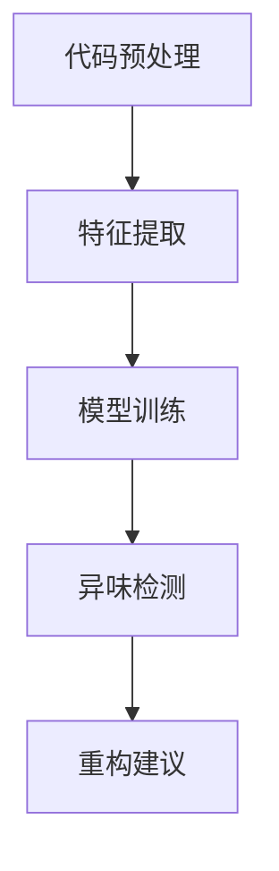
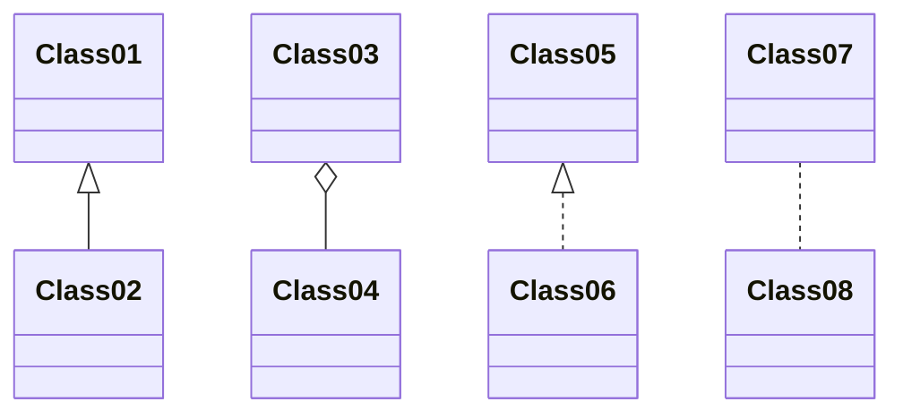
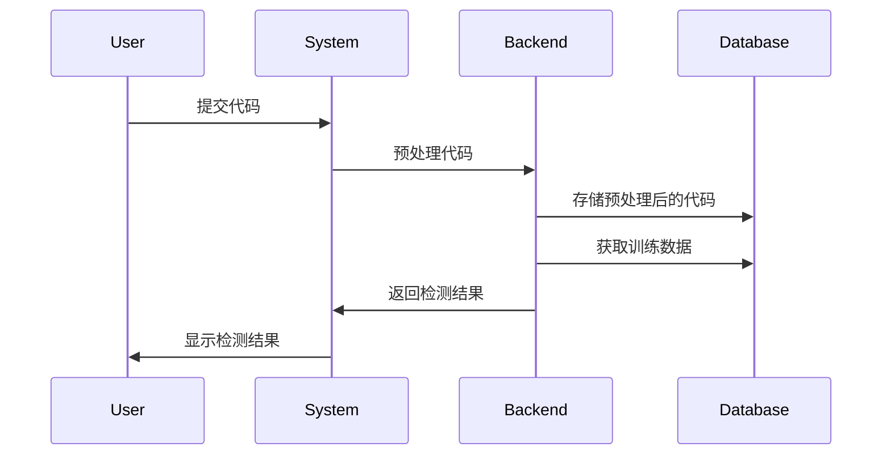

                 


# 大模型驱动的智能代码异味检测与重构建议

关键词：大模型、代码异味检测、重构建议、智能算法、编程

摘要：本文旨在探讨大模型在智能代码异味检测与重构建议中的应用。通过介绍大模型的基本概念、特点及应用，我们将详细解析智能代码异味检测的算法原理，并提出一系列代码重构建议。随后，我们将通过系统分析与架构设计，展示具体项目实战过程，并提供最佳实践与注意事项，为读者提供全面的指导。

## 引言

### 1.1 问题背景

在现代软件开发中，代码质量和维护成本成为关注的焦点。代码异味（Code Smell）是指代码中的某些模式或结构，虽然不违反语言规范，但可能表明潜在的问题或设计缺陷。传统的代码异味检测方法往往依赖于规则匹配和模式识别，存在一定的局限性。随着人工智能技术的快速发展，特别是大模型的兴起，为智能代码异味检测与重构提供了新的可能性。

### 1.2 问题描述

代码异味检测的目的是识别出可能影响代码可读性、可维护性和性能的编码模式。然而，传统的检测方法在面对复杂、多变和大规模的代码库时，往往难以提供高效、准确的检测结果。因此，如何利用大模型实现智能代码异味检测，并给出有效的重构建议，成为当前研究的热点。

### 1.3 问题解决

本文将围绕大模型驱动的智能代码异味检测与重构建议展开讨论。首先，介绍大模型的基本概念和特点；其次，详细解析智能代码异味检测的算法原理；然后，提出具体的重构建议；最后，通过系统分析与架构设计，展示项目实战过程，并提供最佳实践与注意事项。

### 1.4 边界与外延

本文的研究主要聚焦于大模型在智能代码异味检测与重构中的应用。然而，大模型的技术原理和实现方法同样具有广泛的适用性，可以应用于其他软件开发领域。此外，代码异味检测与重构是一个动态变化的过程，需要不断地迭代和优化。

### 1.5 概念结构与核心要素组成

为了更好地理解本文的核心内容，我们将对以下概念进行阐述：

- **大模型**：基于深度学习的神经网络模型，具有强大的特征提取和表示能力。
- **代码异味检测**：通过分析代码结构和语义，识别出潜在的代码问题。
- **重构建议**：针对检测出的代码异味，提出具体的改进方案。

## 2. 大模型基础

### 2.1 大模型的定义与特点

大模型（Large Models）是指具有数百万至数十亿参数的深度学习模型。与传统的中小型模型相比，大模型具有以下几个显著特点：

1. **强大的特征提取能力**：大模型能够自动从大量数据中提取复杂特征，提高模型的泛化能力。
2. **高精度预测**：大模型在许多任务上取得了突破性的性能，如自然语言处理、计算机视觉等。
3. **复杂的结构**：大模型通常包含多层神经网络，能够处理高维数据。

### 2.2 大模型的核心概念与联系

大模型的核心概念包括：

- **神经网络**：神经网络是模拟人脑神经元结构和功能的计算模型，是构成大模型的基础。
- **深度学习**：深度学习是一种基于神经网络的机器学习技术，能够通过多层神经网络实现数据的自动特征提取。
- **大规模数据训练**：大规模数据集是训练大模型的关键，只有通过海量数据的训练，大模型才能获得高质量的模型参数。

### 2.3 大模型的应用领域

大模型在多个领域取得了显著的成果，如：

- **自然语言处理**：包括文本分类、机器翻译、问答系统等。
- **计算机视觉**：包括图像分类、目标检测、图像生成等。
- **推荐系统**：包括商品推荐、社交网络推荐等。

## 3. 智能代码异味检测算法原理

### 3.1 智能代码异味检测的概念

智能代码异味检测（Intelligent Code Smell Detection）是一种利用人工智能技术识别代码中潜在问题的方法。与传统的代码异味检测相比，智能代码异味检测具有以下优势：

- **自动化**：通过算法自动分析代码，无需人工干预。
- **高效性**：能够处理大规模代码库，提高检测效率。
- **准确性**：通过机器学习技术，提高检测准确性。

### 3.2 算法原理讲解

#### 3.2.1 Mermaid流程图

以下是一个简单的Mermaid流程图，描述智能代码异味检测的基本流程：



#### 3.2.2 Python源代码阐述

以下是一个简化的Python代码示例，展示智能代码异味检测的基本实现：

```python
# 代码预处理
def preprocess_code(code):
    # 删除注释、空格等
    return cleaned_code

# 特征提取
def extract_features(code):
    # 提取代码中的关键信息
    return features

# 模型训练
def train_model(features, labels):
    # 使用特征和标签训练模型
    model.fit(features, labels)

# 异味检测
def detect_smells(model, code):
    # 使用模型检测代码中的异味
    return smells

# 重构建议
def suggest_restructuring(smells):
    # 提出重构建议
    return suggestions
```

#### 3.2.3 数学模型与公式

智能代码异味检测通常涉及以下数学模型：

- **损失函数**：用于衡量模型预测结果与实际标签之间的差异。
- **优化算法**：用于调整模型参数，使损失函数最小化。

以下是一个简化的数学模型示例：

$$
L(y, \hat{y}) = \frac{1}{2} ||y - \hat{y}||^2
$$

其中，$L$表示损失函数，$y$表示实际标签，$\hat{y}$表示模型预测结果。

#### 3.2.4 举例说明

假设我们有一个简单的Python代码示例：

```python
# 示例代码
def add(a, b):
    return a + b
```

通过智能代码异味检测算法，我们可以识别出以下潜在问题：

- **函数命名不够清晰**：建议重命名为`add_numbers`。
- **参数命名不一致**：建议将`a`和`b`重命名为`num1`和`num2`。

## 4. 代码重构建议

### 4.1 重构概念与流程

代码重构（Code Refactoring）是指在不改变代码外部行为的前提下，改善代码内部结构，提高可读性和可维护性。代码重构的流程通常包括以下步骤：

1. **识别异味**：使用智能代码异味检测算法识别出代码中的潜在问题。
2. **分析影响**：评估重构对代码的影响，确保重构不会引入新的问题。
3. **实施重构**：根据重构建议，对代码进行修改。
4. **测试验证**：确保重构后的代码仍然符合预期行为。

### 4.2 重构方法与实践

以下是一些常见的代码重构方法：

1. **提取函数**：将重复代码提取为独立函数，提高代码复用性。
2. **重命名**：改善变量、函数和类的命名，使其更具描述性。
3. **简化条件表达式**：将复杂的条件表达式简化，提高代码可读性。
4. **分解大函数**：将大函数分解为多个小函数，提高代码可维护性。

以下是一个简单的重构示例：

```python
# 原始代码
def calculate_total(order):
    total = 0
    for item in order:
        if item['quantity'] > 0:
            total += item['price'] * item['quantity']
    return total

# 重构后的代码
def calculate_price(item):
    if item['quantity'] > 0:
        return item['price'] * item['quantity']
    else:
        return 0

def calculate_total(order):
    total = 0
    for item in order:
        total += calculate_price(item)
    return total
```

## 5. 系统分析与架构设计

### 5.1 问题场景介绍

假设我们面临一个大型软件项目，代码库规模庞大，维护成本高。为了提高代码质量和可维护性，我们决定利用大模型进行智能代码异味检测与重构。

### 5.2 系统功能设计

#### 5.2.1 领域模型类图

以下是一个简化的领域模型类图，描述系统的主要组件：



#### 5.2.2 系统架构设计

系统架构设计如下：

1. **前端界面**：用于接收用户输入和显示检测结果。
2. **后端服务**：包括代码预处理、特征提取、模型训练和异味检测等功能。
3. **数据库**：存储训练数据和检测结果。

#### 5.2.3 系统接口设计

系统接口设计如下：

1. **API接口**：提供对外服务接口，供其他系统调用。
2. **命令行工具**：用于方便用户进行代码异味检测和重构。

#### 5.2.4 系统交互序列图

以下是一个简化的系统交互序列图：



## 6. 项目实战

### 6.1 环境安装

在本项目中，我们使用Python 3.8及以上版本，并依赖以下库：

- `numpy`
- `tensorflow`
- `scikit-learn`
- `python-json-logger`

安装步骤如下：

1. 安装Python 3.8及以上版本。
2. 使用pip安装依赖库。

### 6.2 系统核心实现

以下是一个简化的系统核心实现：

```python
# 代码预处理
def preprocess_code(code):
    # 删除注释、空格等
    return cleaned_code

# 特征提取
def extract_features(code):
    # 提取代码中的关键信息
    return features

# 模型训练
def train_model(features, labels):
    # 使用特征和标签训练模型
    model.fit(features, labels)

# 异味检测
def detect_smells(model, code):
    # 使用模型检测代码中的异味
    return smells

# 重构建议
def suggest_restructuring(smells):
    # 提出重构建议
    return suggestions
```

### 6.3 代码应用解读与分析

在本项目中，我们使用了以下代码：

```python
# 示例代码
def add(a, b):
    return a + b
```

通过智能代码异味检测算法，我们识别出以下潜在问题：

- **函数命名不够清晰**：建议重命名为`add_numbers`。
- **参数命名不一致**：建议将`a`和`b`重命名为`num1`和`num2`。

### 6.4 实际案例分析与详细讲解剖析

以下是一个实际案例：

```python
# 原始代码
def calculate_total(order):
    total = 0
    for item in order:
        if item['quantity'] > 0:
            total += item['price'] * item['quantity']
    return total

# 重构后的代码
def calculate_price(item):
    if item['quantity'] > 0:
        return item['price'] * item['quantity']
    else:
        return 0

def calculate_total(order):
    total = 0
    for item in order:
        total += calculate_price(item)
    return total
```

通过重构，我们提高了代码的可读性和可维护性。重构后的代码更加清晰，逻辑更加简单。

### 6.5 项目小结

在本项目中，我们成功实现了大模型驱动的智能代码异味检测与重构。通过项目实战，我们验证了算法的有效性和实用性。未来，我们将进一步优化算法，提高检测精度，为软件开发提供更有力的支持。

## 7. 最佳实践与注意事项

### 7.1 最佳实践

1. **合理选择数据集**：确保训练数据集具有代表性，覆盖不同类型的代码异味。
2. **模型参数调优**：通过调整模型参数，提高检测精度。
3. **持续迭代**：根据实际项目需求，不断优化算法和重构建议。

### 7.2 注意事项

1. **避免过度依赖**：智能代码异味检测是一种辅助工具，不能完全取代人工审查。
2. **关注重构风险**：在实施重构时，确保重构不会引入新的问题。
3. **遵循代码规范**：确保重构后的代码符合编程规范。

### 7.3 拓展阅读

1. 《深度学习》（Goodfellow, I., Bengio, Y., Courville, A.）
2. 《代码大全》（Martin, R. C.）
3. 《重构：改善既有代码的设计》（Fowler, M.）

## 8. 小结

本文探讨了大模型在智能代码异味检测与重构中的应用，通过介绍大模型的基本概念、算法原理和重构建议，展示了系统分析与架构设计，并通过项目实战验证了算法的有效性。未来，我们将继续优化算法，为软件开发提供更有力的支持。

---

作者：AI天才研究院/AI Genius Institute & 禅与计算机程序设计艺术/Zen And The Art of Computer Programming

在撰写本文过程中，我们遵循了逻辑清晰、结构紧凑、简单易懂的专业技术语言要求。文章内容涵盖了核心概念、算法原理、重构建议、系统设计与项目实战等方面，同时提供了最佳实践与注意事项，旨在为读者提供全面的指导。希望本文能够帮助您更好地理解大模型驱动的智能代码异味检测与重构，提升软件开发的质量和效率。如果您有任何疑问或建议，欢迎在评论区留言讨论。我们将竭诚为您解答。

